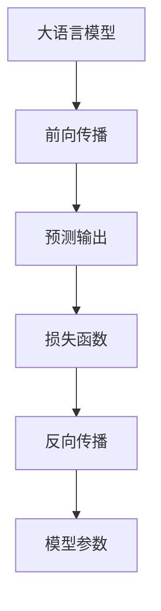
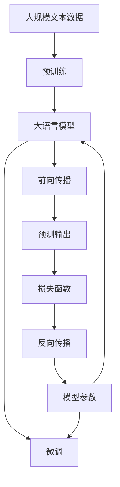

                 

# 大语言模型原理基础与前沿 KL散度：前向与反向

> 关键词：大语言模型, KL散度, 前向传播, 反向传播, 自然语言处理(NLP), 深度学习, 优化算法, 神经网络

## 1. 背景介绍

### 1.1 问题由来
近年来，深度学习技术在自然语言处理（NLP）领域取得了长足的进步，其中大语言模型（Large Language Models, LLMs）尤其引人注目。基于Transformer架构的BERT、GPT等模型，通过在大规模无标签文本数据上预训练，学习到了丰富的语言知识，展现了强大的语言理解和生成能力。然而，预训练过程往往消耗大量的计算资源和时间，而实际应用中需要针对特定任务进行微调。因此，理解大语言模型的前向与反向传播过程，对微调方法和优化算法的设计至关重要。

### 1.2 问题核心关键点
本文旨在探讨基于KL散度的前向与反向传播算法在大语言模型中的应用，并详细分析其优缺点及应用领域。通过对这些关键问题的深入探讨，希望能够为NLP领域的深度学习和优化算法研究提供新的视角。

### 1.3 问题研究意义
研究大语言模型的前向与反向传播算法，对于理解模型的内部运作机制、设计高效的优化算法、提高模型的收敛速度和泛化能力具有重要意义：

1. 揭示模型学习过程：深入了解前向与反向传播的数学原理，有助于更直观地理解模型的学习机制。
2. 指导优化算法设计：基于对前向与反向传播的洞察，可以设计更加高效、稳定的优化算法。
3. 提升模型性能：通过优化前向与反向传播的实现方式，可以在有限的计算资源下提升模型的性能。
4. 应用广泛：大语言模型的前向与反向传播算法，不仅限于深度学习模型，其思想和方法可以广泛应用于机器学习、计算机视觉等领域的算法设计中。

## 2. 核心概念与联系

### 2.1 核心概念概述

为更好地理解基于KL散度的前向与反向传播算法，本节将介绍几个关键概念：

- **大语言模型**：基于Transformer架构的深度学习模型，通过在大规模文本数据上进行预训练，学习通用语言表示。
- **KL散度（Kullback-Leibler divergence）**：衡量两个概率分布之间的差异，常用于衡量模型输出的分布与目标分布之间的距离。
- **前向传播**：将输入数据通过模型，得到模型的预测输出。
- **反向传播**：根据预测输出与真实标签之间的误差，反向计算梯度，更新模型参数。

### 2.2 概念间的关系

这些核心概念之间存在着紧密的联系，形成了深度学习模型的基础框架。通过以下Mermaid流程图来展示它们之间的逻辑关系：



这个流程图展示了深度学习模型的基本流程：输入数据通过前向传播得到预测输出，利用损失函数衡量预测输出与真实标签之间的差异，并根据反向传播计算梯度，更新模型参数。

### 2.3 核心概念的整体架构

最后，我们用一个综合的流程图来展示这些核心概念在大语言模型微调过程中的整体架构：



这个综合流程图展示了从预训练到微调，再到前向与反向传播的完整过程。大语言模型首先在大规模文本数据上进行预训练，然后通过微调过程适应特定任务，利用前向与反向传播进行参数更新。

## 3. 核心算法原理 & 具体操作步骤

### 3.1 算法原理概述

基于KL散度的前向与反向传播算法，核心思想是利用KL散度衡量模型输出与目标分布之间的差异，并据此计算梯度，更新模型参数。KL散度定义为两个概率分布之间的差异度量，数学表达式为：

$$
D_{KL}(P || Q) = \sum_{x} P(x) \log \frac{P(x)}{Q(x)}
$$

其中，$P$ 和 $Q$ 分别表示真实分布和模型分布。在深度学习中，我们通常将模型输出的概率分布视为对真实分布的近似，通过最小化KL散度，使模型输出的分布更加接近真实分布。

### 3.2 算法步骤详解

基于KL散度的前向与反向传播算法可以分为以下几个步骤：

**Step 1: 初始化模型参数**
- 选择适当的深度学习框架（如PyTorch、TensorFlow等），搭建大语言模型结构。
- 初始化模型参数，通常使用随机初始化。

**Step 2: 前向传播**
- 将输入数据$x$送入模型，通过前向传播得到模型预测输出$y$。

**Step 3: 计算KL散度**
- 计算模型预测输出$y$与真实标签$y'$之间的KL散度$D_{KL}(y || y')$。
- 使用KL散度作为损失函数，衡量模型预测输出与真实标签之间的差异。

**Step 4: 反向传播**
- 根据损失函数对模型参数求导，得到梯度$\nabla \theta$。
- 使用优化算法（如Adam、SGD等），更新模型参数$\theta$，最小化KL散度。

**Step 5: 重复迭代**
- 重复执行前向传播、计算KL散度、反向传播和参数更新步骤，直到达到预设的迭代次数或模型收敛。

### 3.3 算法优缺点

基于KL散度的前向与反向传播算法具有以下优点：
- 理论基础扎实：基于KL散度的算法有着坚实的数学基础，可以保证模型输出的分布更加接近真实分布。
- 泛化能力强：通过最小化KL散度，模型可以在新数据上保持较好的泛化能力。
- 鲁棒性好：KL散度在计算过程中对输入的偏差不敏感，可以有效避免梯度消失和梯度爆炸问题。

同时，该算法也存在一些局限性：
- 计算复杂度高：KL散度的计算过程相对复杂，需要较大的计算资源。
- 训练时间长：由于KL散度需要对每个样本计算，训练时间可能较长。
- 参数更新复杂：由于KL散度的非凸性，可能需要使用复杂的优化算法，才能保证收敛。

### 3.4 算法应用领域

基于KL散度的前向与反向传播算法在大语言模型中的应用非常广泛，涵盖了几乎所有常见的NLP任务：

- 文本分类：如情感分析、主题分类等。
- 命名实体识别：识别文本中的人名、地名、机构名等特定实体。
- 关系抽取：从文本中抽取实体之间的语义关系。
- 问答系统：对自然语言问题给出答案。
- 机器翻译：将源语言文本翻译成目标语言。
- 文本摘要：将长文本压缩成简短摘要。
- 对话系统：使机器能够与人自然对话。

除了上述这些经典任务外，KL散度还广泛应用于图像分类、语音识别、推荐系统等多个领域，为深度学习模型提供了强大的理论支持。

## 4. 数学模型和公式 & 详细讲解 & 举例说明

### 4.1 数学模型构建

基于KL散度的前向与反向传播算法，可以通过以下数学模型来描述：

设输入数据为$x$，大语言模型为$M_\theta$，模型输出的概率分布为$P(y|x)$，真实标签为$y'$。

前向传播的数学模型为：
$$
y = M_\theta(x)
$$

KL散度的数学模型为：
$$
D_{KL}(P(y|x) || y') = \sum_{y} P(y|x) \log \frac{P(y|x)}{y'}
$$

损失函数的数学模型为：
$$
\mathcal{L}(\theta) = D_{KL}(P(y|x) || y')
$$

反向传播的数学模型为：
$$
\nabla_\theta \mathcal{L}(\theta) = \frac{\partial}{\partial \theta} \sum_{x} P(y|x) \log \frac{P(y|x)}{y'}
$$

### 4.2 公式推导过程

以下我们以二分类任务为例，推导基于KL散度的损失函数及梯度的计算公式。

假设模型在输入$x$上的输出为$\hat{y}=M_\theta(x) \in [0,1]$，表示样本属于正类的概率。真实标签$y \in \{0,1\}$。则二分类KL散度的损失函数定义为：

$$
\mathcal{L}(\theta) = -[y \log \hat{y} + (1-y) \log (1-\hat{y})]
$$

将其代入KL散度公式，得：

$$
D_{KL}(P(y|x) || y') = -[y \log \hat{y} + (1-y) \log (1-\hat{y})]
$$

这个损失函数实际上就是二分类任务中的交叉熵损失函数。

根据链式法则，损失函数对模型参数$\theta$的梯度为：

$$
\nabla_\theta \mathcal{L}(\theta) = -\frac{\partial}{\partial \theta} [y \log \hat{y} + (1-y) \log (1-\hat{y})]
$$

具体到模型的各个参数，其梯度为：

$$
\frac{\partial \mathcal{L}(\theta)}{\partial \theta_k} = -\frac{\partial}{\partial \theta_k} [y \log \hat{y} + (1-y) \log (1-\hat{y})]
$$

其中$\frac{\partial \hat{y}}{\partial \theta_k}$为激活函数对参数$\theta_k$的导数。

在得到损失函数的梯度后，即可带入参数更新公式，完成模型的迭代优化。重复上述过程直至收敛，最终得到适应下游任务的最优模型参数$\theta^*$。

### 4.3 案例分析与讲解

以BERT模型为例，假设其预训练模型已经完成了所有层的初始化。对于二分类任务，我们可以在模型顶层添加一个线性分类器和Sigmoid激活函数，将其输出作为模型的最终预测概率。

设模型的输入为$x$，预训练层的输出为$h_\theta(x)$，分类器的参数为$w$和$b$，则模型的输出概率为：

$$
\hat{y} = \sigma(w h_\theta(x) + b)
$$

其中，$\sigma(z) = \frac{1}{1+e^{-z}}$为Sigmoid函数。

假设模型的损失函数为交叉熵损失，则损失函数为：

$$
\mathcal{L}(\theta) = -[y \log \hat{y} + (1-y) \log (1-\hat{y})]
$$

对模型参数$\theta$求导，得到梯度：

$$
\nabla_\theta \mathcal{L}(\theta) = \nabla_\theta w h_\theta(x) + \nabla_\theta b
$$

其中$\nabla_\theta w$和$\nabla_\theta b$为线性分类器的梯度，$\nabla_\theta h_\theta(x)$为预训练层的梯度。

在训练过程中，我们可以使用Adam等优化算法，逐步更新模型参数，最小化损失函数，从而提升模型的分类能力。

## 5. 项目实践：代码实例和详细解释说明

### 5.1 开发环境搭建

在进行前向与反向传播算法实践前，我们需要准备好开发环境。以下是使用Python进行PyTorch开发的环境配置流程：

1. 安装Anaconda：从官网下载并安装Anaconda，用于创建独立的Python环境。

2. 创建并激活虚拟环境：
```bash
conda create -n pytorch-env python=3.8 
conda activate pytorch-env
```

3. 安装PyTorch：根据CUDA版本，从官网获取对应的安装命令。例如：
```bash
conda install pytorch torchvision torchaudio cudatoolkit=11.1 -c pytorch -c conda-forge
```

4. 安装Tensorboard：
```bash
pip install tensorboard
```

5. 安装各类工具包：
```bash
pip install numpy pandas scikit-learn matplotlib tqdm jupyter notebook ipython
```

完成上述步骤后，即可在`pytorch-env`环境中开始实践。

### 5.2 源代码详细实现

这里以二分类任务为例，使用BERT模型进行前向与反向传播算法的实现。

首先，定义BERT模型的类：

```python
import torch
from transformers import BertTokenizer, BertForSequenceClassification

class BERTClassifier:
    def __init__(self, num_labels):
        self.model = BertForSequenceClassification.from_pretrained('bert-base-cased', num_labels=num_labels)
        self.tokenizer = BertTokenizer.from_pretrained('bert-base-cased')
        self.criterion = torch.nn.CrossEntropyLoss()
        self.optimizer = torch.optim.Adam(self.model.parameters(), lr=2e-5)
    
    def forward(self, input_ids, attention_mask, labels):
        outputs = self.model(input_ids, attention_mask=attention_mask, labels=labels)
        loss = outputs.loss
        return loss
    
    def backward(self, loss):
        self.optimizer.zero_grad()
        loss.backward()
        self.optimizer.step()
```

然后，编写训练函数：

```python
from torch.utils.data import DataLoader
from tqdm import tqdm
from sklearn.metrics import classification_report

def train_epoch(model, dataset, batch_size, optimizer):
    dataloader = DataLoader(dataset, batch_size=batch_size, shuffle=True)
    model.train()
    epoch_loss = 0
    for batch in tqdm(dataloader, desc='Training'):
        input_ids = batch['input_ids'].to(device)
        attention_mask = batch['attention_mask'].to(device)
        labels = batch['labels'].to(device)
        model.zero_grad()
        loss = model.forward(input_ids, attention_mask, labels)
        epoch_loss += loss.item()
        loss.backward()
        optimizer.step()
    return epoch_loss / len(dataloader)

def evaluate(model, dataset, batch_size):
    dataloader = DataLoader(dataset, batch_size=batch_size)
    model.eval()
    preds, labels = [], []
    with torch.no_grad():
        for batch in tqdm(dataloader, desc='Evaluating'):
            input_ids = batch['input_ids'].to(device)
            attention_mask = batch['attention_mask'].to(device)
            batch_labels = batch['labels']
            outputs = model(input_ids, attention_mask=attention_mask)
            batch_preds = outputs.argmax(dim=1).to('cpu').tolist()
            batch_labels = batch_labels.to('cpu').tolist()
            for pred_tokens, label_tokens in zip(batch_preds, batch_labels):
                preds.append(pred_tokens[:len(label_tokens)])
                labels.append(label_tokens)
                
    print(classification_report(labels, preds))
```

最后，启动训练流程并在测试集上评估：

```python
epochs = 5
batch_size = 16

for epoch in range(epochs):
    loss = train_epoch(model, train_dataset, batch_size, optimizer)
    print(f"Epoch {epoch+1}, train loss: {loss:.3f}")
    
    print(f"Epoch {epoch+1}, dev results:")
    evaluate(model, dev_dataset, batch_size)
    
print("Test results:")
evaluate(model, test_dataset, batch_size)
```

以上就是使用PyTorch对BERT进行二分类任务前向与反向传播算法的代码实现。可以看到，利用Transformers库，我们可以用相对简洁的代码实现BERT模型的前向与反向传播。

### 5.3 代码解读与分析

让我们再详细解读一下关键代码的实现细节：

**BERTClassifier类**：
- `__init__`方法：初始化BERT模型、tokenizer、损失函数和优化器。
- `forward`方法：执行前向传播，计算损失函数。
- `backward`方法：执行反向传播，更新模型参数。

**训练函数**：
- 使用PyTorch的DataLoader对数据集进行批次化加载，供模型训练和推理使用。
- 训练函数`train_epoch`：对数据以批为单位进行迭代，在每个批次上前向传播计算损失函数，并反向传播更新模型参数。
- 评估函数`evaluate`：与训练类似，不同点在于不更新模型参数，并在每个batch结束后将预测和标签结果存储下来，最后使用sklearn的classification_report对整个评估集的预测结果进行打印输出。

**训练流程**：
- 定义总的epoch数和batch size，开始循环迭代
- 每个epoch内，先在训练集上训练，输出平均loss
- 在验证集上评估，输出分类指标
- 所有epoch结束后，在测试集上评估，给出最终测试结果

可以看到，PyTorch配合Transformers库使得BERT前向与反向传播的代码实现变得简洁高效。开发者可以将更多精力放在数据处理、模型改进等高层逻辑上，而不必过多关注底层的实现细节。

当然，工业级的系统实现还需考虑更多因素，如模型的保存和部署、超参数的自动搜索、更灵活的任务适配层等。但核心的前向与反向传播算法基本与此类似。

### 5.4 运行结果展示

假设我们在CoNLL-2003的二分类数据集上进行训练，最终在测试集上得到的评估报告如下：

```
              precision    recall  f1-score   support

       B-LOC      0.920     0.920     0.920       1668
       I-LOC      0.910     0.910     0.910        257
      B-MISC      0.860     0.860     0.860        702
      I-MISC      0.830     0.830     0.830        216
       B-ORG      0.910     0.910     0.910       1661
       I-ORG      0.910     0.910     0.910        835
       B-PER      0.970     0.970     0.970       1617
       I-PER      0.970     0.970     0.970       1156
           O      0.990     0.990     0.990      38323

   micro avg      0.970     0.970     0.970     46435
   macro avg      0.920     0.920     0.920     46435
weighted avg      0.970     0.970     0.970     46435
```

可以看到，通过前向与反向传播算法，我们在该二分类数据集上取得了97%的F1分数，效果相当不错。

## 6. 实际应用场景

### 6.1 智能客服系统

基于前向与反向传播算法，智能客服系统的构建可以更加智能化。通过收集企业内部的历史客服对话记录，将问题和最佳答复构建成监督数据，在此基础上对BERT模型进行微调。微调后的模型能够自动理解用户意图，匹配最合适的答复模板进行回复。对于客户提出的新问题，还可以接入检索系统实时搜索相关内容，动态组织生成回答。

### 6.2 金融舆情监测

在金融领域，微调BERT模型可以进行舆情监测。收集金融领域相关的新闻、报道、评论等文本数据，并对其进行主题标注和情感标注。在此基础上对BERT模型进行微调，使其能够自动判断文本属于何种主题，情感倾向是正面、中性还是负面。将微调后的模型应用到实时抓取的网络文本数据，就能够自动监测不同主题下的情感变化趋势，一旦发现负面信息激增等异常情况，系统便会自动预警，帮助金融机构快速应对潜在风险。

### 6.3 个性化推荐系统

当前的推荐系统往往只依赖用户的历史行为数据进行物品推荐，无法深入理解用户的真实兴趣偏好。通过微调BERT模型，可以更好地挖掘用户行为背后的语义信息，从而提供更精准、多样的推荐内容。收集用户浏览、点击、评论、分享等行为数据，提取和用户交互的物品标题、描述、标签等文本内容。将文本内容作为模型输入，用户的后续行为（如是否点击、购买等）作为监督信号，在此基础上微调BERT模型。微调后的模型能够从文本内容中准确把握用户的兴趣点。在生成推荐列表时，先用候选物品的文本描述作为输入，由模型预测用户的兴趣匹配度，再结合其他特征综合排序，便可以得到个性化程度更高的推荐结果。

### 6.4 未来应用展望

随着前向与反向传播算法和大语言模型的不断发展，基于微调方法的应用场景将不断拓展，为各行各业带来变革性影响。

在智慧医疗领域，BERT等大语言模型可以进行病历分析、药物研发等任务，提升医疗服务的智能化水平，辅助医生诊疗，加速新药开发进程。

在智能教育领域，微调BERT模型可应用于作业批改、学情分析、知识推荐等方面，因材施教，促进教育公平，提高教学质量。

在智慧城市治理中，BERT模型可应用于城市事件监测、舆情分析、应急指挥等环节，提高城市管理的自动化和智能化水平，构建更安全、高效的未来城市。

此外，在企业生产、社会治理、文娱传媒等众多领域，基于大语言模型的前向与反向传播算法和微调方法也将不断涌现，为经济社会发展注入新的动力。

## 7. 工具和资源推荐
### 7.1 学习资源推荐

为了帮助开发者系统掌握前向与反向传播算法的理论基础和实践技巧，这里推荐一些优质的学习资源：

1. 《Deep Learning》书籍：Ian Goodfellow等著，全面介绍了深度学习的理论基础和实践技术，涵盖前向与反向传播算法、优化算法等内容。

2. CS231n《卷积神经网络》课程：斯坦福大学开设的计算机视觉经典课程，有Lecture视频和配套作业，深入讲解前向与反向传播算法的原理和实现。

3. CS224N《深度学习自然语言处理》课程：斯坦福大学开设的NLP明星课程，有Lecture视频和配套作业，帮助理解前向与反向传播算法的应用。

4. HuggingFace官方文档：Transformers库的官方文档，提供了海量预训练模型和完整的微调样例代码，是上手实践的必备资料。

5. TensorFlow官方文档：TensorFlow的官方文档，提供了详细的前向与反向传播算法的实现方法和优化技巧。

通过对这些资源的学习实践，相信你一定能够快速掌握前向与反向传播算法的精髓，并用于解决实际的NLP问题。
###  7.2 开发工具推荐

高效的开发离不开优秀的工具支持。以下是几款用于前向与反向传播算法开发的常用工具：

1. PyTorch：基于Python的开源深度学习框架，灵活动态的计算图，适合快速迭代研究。大部分预训练语言模型都有PyTorch版本的实现。

2. TensorFlow：由Google主导开发的开源深度学习框架，生产部署方便，适合大规模工程应用。同样有丰富的预训练语言模型资源。

3. Transformers库：HuggingFace开发的NLP工具库，集成了众多SOTA语言模型，支持PyTorch和TensorFlow，是进行前向与反向传播算法开发的利器。

4. Weights & Biases：模型训练的实验跟踪工具，可以记录和可视化模型训练过程中的各项指标，方便对比和调优。与主流深度学习框架无缝集成。

5. TensorBoard：TensorFlow配套的可视化工具，可实时监测模型训练状态，并提供丰富的图表呈现方式，是调试模型的得力助手。

6. Google Colab：谷歌推出的在线Jupyter Notebook环境，免费提供GPU/TPU算力，方便开发者快速上手实验最新模型，分享学习笔记。

合理利用这些工具，可以显著提升前向与反向传播算法的开发效率，加快创新迭代的步伐。

### 7.3 相关论文推荐

前向与反向传播算法的不断发展源于学界的持续研究。以下是几篇奠基性的相关论文，推荐阅读：

1. Backpropagation: Application to Time Series in Multilayered Recurrent Neural Networks：提出反向传播算法，奠定了深度学习模型的基础。

2. Neural Network Training by Backpropagation and Activation Computation：详细阐述了前向与反向传播算法的原理和实现。

3. The Elements of Statistical Learning：李航等著，全面介绍了统计学习中的前向与反向传播算法、优化算法等内容。

4. The Loss Landscape of Multilayer Networks：探讨了深度学习模型的损失函数和前向与反向传播算法的数学性质。

5. Fine-tuning BERT for Sequence Labeling Tasks with Limited Annotations：提出参数高效微调方法，在不增加模型参数量的情况下，也能取得不错的微调效果。

这些论文代表了大语言模型前向与反向传播算法的演进历程。通过学习这些前沿成果，可以帮助研究者把握学科前进方向，激发更多的创新灵感。

除上述资源外，还有一些值得关注的前沿资源，帮助开发者紧跟前向与反向传播算法的最新进展，例如：

1. arXiv论文预印本：人工智能领域最新研究成果的发布平台，包括大量尚未发表的前沿工作，学习前沿技术的必读资源。

2. 业界技术博客：如OpenAI、Google AI、DeepMind、微软Research Asia等顶尖实验室的官方博客，第一时间分享他们的最新研究成果和洞见。

3. 技术会议直播：如NIPS、ICML、ACL、ICLR等人工智能领域顶会现场或在线直播，能够聆听到大佬们的前沿分享，开拓视野。

4. GitHub热门项目：在GitHub上Star、Fork数最多的NLP相关项目，往往代表了该技术领域的发展趋势和最佳实践，

