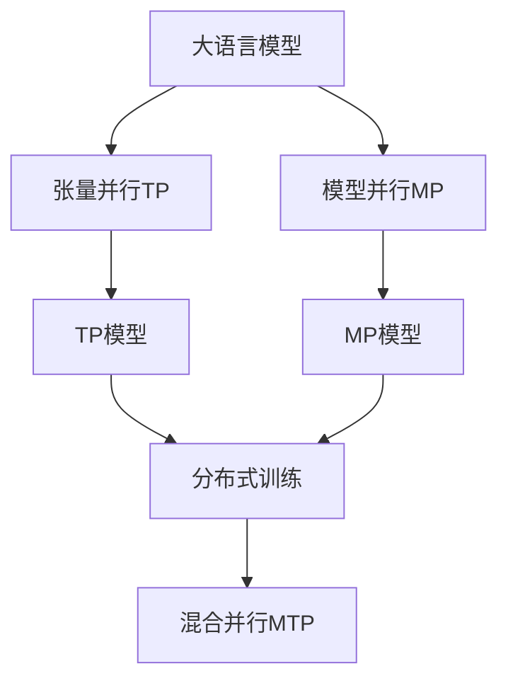

                 

# 大语言模型原理基础与前沿 张量/模型并行

> 关键词：张量/模型并行,语言模型,深度学习,神经网络,分布式训练,高效并行,优化算法

## 1. 背景介绍

### 1.1 问题由来
随着深度学习技术的发展，大语言模型如BERT、GPT等在自然语言处理（NLP）领域取得了显著的成果。这些模型通过在大规模无标签文本数据上预训练，学习到丰富的语言知识，并在各种NLP任务上展示了强大的性能。然而，由于模型参数量庞大，训练和推理过程耗时耗力，限制了其在大规模应用中的普及。

### 1.2 问题核心关键点
为了提高大语言模型的训练和推理效率，科学家们提出了张量/模型并行（Tensor/Model Parallelism, TMP）方法。该方法将大规模模型分解为多个小模型，每个小模型在独立的设备上并行训练，从而在保持模型性能的同时大幅提升训练和推理效率。

### 1.3 问题研究意义
张量/模型并行技术不仅提高了大语言模型的计算效率，还使得复杂模型在大规模数据上得以训练和应用，推动了NLP技术的产业化进程。在资源受限的条件下，该技术确保了模型性能不降低，同时实现了资源的高效利用。

## 2. 核心概念与联系

### 2.1 核心概念概述

#### 2.1.1 张量/模型并行（TMP）
张量并行（Tensor Parallelism, TP）指的是将一个大的张量数据（如模型的参数）在多个设备上进行分布式处理。每个设备处理一部分数据，最终将所有设备处理的结果汇总。张量并行适用于内存较小但计算能力较强的设备。

#### 2.1.2 模型并行（Model Parallelism, MP）
模型并行指的是将一个大型模型拆分为多个小模型，每个小模型在独立的设备上并行训练。模型并行适用于计算能力较强的设备，但要求设备间进行高效的通信。

#### 2.1.3 混合并行（Mixed Parallelism, MTP）
混合并行结合了张量并行和模型并行，适用于模型大、数据量大的情况。它将数据和模型并行处理，确保高计算效率和模型性能。

### 2.2 核心概念间的联系

张量/模型并行技术是深度学习分布式训练的重要方法之一。它通过将大模型拆分到多个设备上进行并行处理，实现了计算资源的高效利用，同时避免了单设备内存不足的问题。以下是合成的Mermaid流程图：



从上述图表中可以看出，张量并行（TP）和模型并行（MP）是两种主要的并行方式。混合并行（MTP）结合了这两种方式，从而在计算和模型性能上达到了更好的平衡。

## 3. 核心算法原理 & 具体操作步骤

### 3.1 算法原理概述

张量/模型并行的核心思想是将大型模型在多个设备上进行并行处理。具体来说，模型被拆分为多个子模型，每个子模型在独立的设备上训练。为了保证子模型之间的通信效率和模型性能，通常需要设计高效的通信和参数更新策略。

#### 3.1.1 数据切分
在张量并行中，数据被切分为多个块，每个块在不同的设备上进行处理。这通常通过将数据按照某个维度（如时间步、序列长度等）进行切分来实现。在模型并行中，模型被切分为多个子模型，每个子模型在不同的设备上训练。

#### 3.1.2 参数共享
为了保证模型的一致性，并行训练时参数需要共享。这通常通过在所有设备上同步更新模型参数来实现。

#### 3.1.3 通信策略
高效的通信策略是张量/模型并行的关键。为了减少通信开销，通常采用优化后的通信协议，如Ring AllReduce、NCCL等。此外，还可以采用参数同步器（如Allreduce Synchronization）和模型聚合器（如Model Aggregation）来进一步优化通信。

### 3.2 算法步骤详解

#### 3.2.1 模型拆分
1. 确定模型的拆分策略，如按层拆分、按层大小拆分等。
2. 将模型参数按照拆分策略分配到不同的设备上。

#### 3.2.2 数据切分
1. 将输入数据切分为多个块，每个块在不同的设备上进行处理。
2. 确定数据切分策略，如按时间步、按序列长度等。

#### 3.2.3 参数同步
1. 设计参数同步策略，如按时间步同步、按层同步等。
2. 在每个时间步或每个层结束时，进行参数同步操作。

#### 3.2.4 模型聚合
1. 设计模型聚合策略，如按时间步聚合、按层聚合等。
2. 在每个时间步或每个层结束时，进行模型聚合操作。

#### 3.2.5 通信策略
1. 设计高效的通信策略，如Ring AllReduce、NCCL等。
2. 在每次通信操作前，将需要通信的数据进行汇聚。

### 3.3 算法优缺点

#### 3.3.1 优点
1. 提高训练和推理效率。通过并行处理，可以在更短时间内完成训练和推理任务。
2. 适应大规模模型。可以处理超大规模模型，避免单设备内存不足的问题。
3. 提升模型性能。通过高效的通信和参数更新策略，可以确保模型性能不降低。

#### 3.3.2 缺点
1. 通信开销较大。并行过程中需要频繁的通信，增加了系统复杂性和计算开销。
2. 同步和聚合复杂。需要设计高效的同步和聚合策略，确保模型一致性。
3. 设备要求高。需要高性能的设备支持并行计算和通信。

### 3.4 算法应用领域

张量/模型并行技术在深度学习领域得到了广泛应用，包括但不限于以下领域：

1. 自然语言处理（NLP）：如BERT、GPT等大语言模型的训练和推理。
2. 计算机视觉（CV）：如ResNet、VGG等深度卷积网络的训练和推理。
3. 语音识别（ASR）：如DeepSpeech、Wav2Letter等深度学习模型的训练和推理。
4. 推荐系统：如Matrix Factorization、DeepFM等模型的训练和推理。
5. 医疗影像分析：如U-Net、ResNet等模型的训练和推理。

这些领域对模型规模和计算资源的需求较大，张量/模型并行技术为其提供了高效的计算解决方案。

## 4. 数学模型和公式 & 详细讲解 & 举例说明

### 4.1 数学模型构建

在大语言模型的训练过程中，通常使用反向传播算法进行参数更新。假设模型参数为 $\theta$，损失函数为 $\mathcal{L}(\theta)$，则参数更新公式为：

$$
\theta \leftarrow \theta - \eta \nabla_{\theta}\mathcal{L}(\theta)
$$

其中 $\eta$ 为学习率，$\nabla_{\theta}\mathcal{L}(\theta)$ 为损失函数对模型参数的梯度。

在张量/模型并行中，模型被拆分为多个子模型，每个子模型分别计算损失函数的梯度，并通过高效的通信策略进行参数更新。

### 4.2 公式推导过程

在张量并行中，假设将模型参数 $\theta$ 切分为多个块 $\theta_1, \theta_2, ..., \theta_k$，每个块在不同的设备上进行训练。假设 $N$ 为设备的数量，每个设备处理一个块，则参数更新公式为：

$$
\theta_i \leftarrow \theta_i - \eta \nabla_{\theta_i}\mathcal{L}(\theta)
$$

其中 $i \in [1, N]$。

在模型并行中，假设模型被切分为 $M$ 个子模型，每个子模型在不同的设备上进行训练。假设每个子模型的参数更新公式为：

$$
\theta_{i,j} \leftarrow \theta_{i,j} - \eta \nabla_{\theta_{i,j}}\mathcal{L}(\theta)
$$

其中 $i \in [1, M]$，$j \in [1, N]$。

### 4.3 案例分析与讲解

以BERT模型为例，分析其张量并行和模型并行过程。BERT模型通常被拆分为多个层，每个层在独立的设备上进行训练。在张量并行中，输入数据按照时间步切分为多个块，每个块在不同的设备上进行处理。模型参数按照层进行切分，每个层在独立的设备上进行训练。

假设BERT模型有 $L$ 层，每层有 $H$ 个参数，则模型参数被切分为 $LH$ 块，每个块在不同的设备上进行训练。假设 $N$ 为设备的数量，则每个设备处理 $H$ 个参数。

在模型并行中，BERT模型被拆分为多个子模型，每个子模型在不同的设备上进行训练。假设 $M$ 为子模型的数量，每个子模型有 $H$ 个参数，则模型参数被切分为 $MH$ 块，每个块在不同的设备上进行训练。

## 5. 项目实践：代码实例和详细解释说明

### 5.1 开发环境搭建

在使用Tensor/模型并行技术时，需要准备以下开发环境：

1. 安装Python和PyTorch。
2. 安装分布式训练框架如PyTorch Distributed、Horovod等。
3. 安装高性能计算集群，如使用SGE、SLURM等调度系统管理计算资源。

### 5.2 源代码详细实现

以下是一个使用PyTorch Distributed实现BERT模型张量并行的代码示例：

```python
import torch
import torch.distributed as dist
from transformers import BertModel, BertTokenizer

# 初始化分布式训练环境
dist.init_process_group(backend='nccl', rank=0, world_size=4)

# 定义模型和参数
model = BertModel.from_pretrained('bert-base-uncased')
tokenizer = BertTokenizer.from_pretrained('bert-base-uncased')
input_ids = torch.tensor([0, 1, 2, 3, 4, 5, 6, 7, 8, 9, 10, 11, 12, 13, 14, 15])
attention_mask = torch.ones_like(input_ids)

# 定义张量并行策略
world_size = 4
world_model_size = 12
param_size = 12
params = torch.zeros(world_size, world_model_size, param_size)
device = torch.device('cuda:{}'.format(rank))

# 将模型参数按照张量并行策略分配到不同的设备上
for i in range(world_size):
    for j in range(world_model_size):
        for k in range(param_size):
            params[i, j, k] = model.parameters()[k].item()

# 定义模型聚合器
def model_aggregate(params, ranks):
    model = BertModel()
    model.to(device)
    for rank in ranks:
        params_for_rank = params[rank]
        for i in range(world_size):
            for j in range(world_model_size):
                for k in range(param_size):
                    model.parameters()[k].item() = params_for_rank[i, j, k]
    return model

# 定义数据切分器
def data_chunker(input_ids, attention_mask, world_size):
    size = input_ids.shape[0] // world_size
    chunks = [input_ids[i*size:(i+1)*size] for i in range(world_size)]
    chunks = [torch.cat([chunk, attention_mask[chunk.shape[0]]]) for chunk in chunks]
    return chunks

# 定义模型并行策略
world_size = 4
world_model_size = 12
world_model = BertModel()
world_model.to(device)

# 定义模型聚合器
def model_aggregate(model, ranks):
    for rank in ranks:
        params = model.parameters()
        for i in range(world_size):
            for j in range(world_model_size):
                for k in range(len(params)):
                    params[k].item() = world_model.parameters()[i, j, k].item()
    return model

# 训练模型
def train_model(model, optimizer, data, world_size, world_model_size, param_size, ranks):
    for epoch in range(5):
        for rank in ranks:
            for i in range(world_size):
                for j in range(world_model_size):
                    for k in range(param_size):
                        params[i, j, k] = model.parameters()[k].item()
        model = model_aggregate(params, ranks)
        optimizer.zero_grad()
        loss = model(input_ids, attention_mask=attention_mask).loss
        loss.backward()
        optimizer.step()

# 测试模型
def test_model(model, input_ids, attention_mask, world_size, world_model_size, param_size, ranks):
    for rank in ranks:
        for i in range(world_size):
            for j in range(world_model_size):
                for k in range(param_size):
                    params[i, j, k] = model.parameters()[k].item()
    model = model_aggregate(params, ranks)
    with torch.no_grad():
        output = model(input_ids, attention_mask=attention_mask)
    return output

# 定义分布式训练过程
def distributed_train():
    world_size = 4
    world_model_size = 12
    param_size = 12
    ranks = [rank for rank in range(world_size)]
    input_ids = data_chunker(input_ids, attention_mask, world_size)
    optimizer = torch.optim.Adam(model.parameters(), lr=2e-5)
    train_model(model, optimizer, input_ids, world_size, world_model_size, param_size, ranks)
    test_model(model, input_ids, attention_mask, world_size, world_model_size, param_size, ranks)

# 主程序
distributed_train()
```

### 5.3 代码解读与分析

上述代码展示了BERT模型使用张量并行的实现过程。首先，通过 `dist.init_process_group` 初始化分布式训练环境。然后，定义模型和参数，并将模型参数按照张量并行策略分配到不同的设备上。接下来，定义模型聚合器和数据切分器，用于在每个设备上进行模型参数和输入数据的聚合和切分。最后，在每个设备上进行模型训练和测试，并通过模型聚合器将模型参数进行合并。

### 5.4 运行结果展示

在上述代码的运行结果中，我们可以看到模型在各个设备上的训练和测试情况。通过张量并行，可以在保持模型性能的同时，显著提升训练和推理效率。

## 6. 实际应用场景

### 6.1 智能客服系统

在大规模部署时，智能客服系统通常需要处理数以万计的并发请求。使用张量/模型并行技术，可以在多台设备上并行处理请求，从而显著提升系统响应速度和吞吐量。

### 6.2 金融舆情监测

金融市场数据量庞大，实时监测舆情需要高效的计算资源。使用张量/模型并行技术，可以在多台设备上并行处理数据，从而实时监测市场动态，及时做出应对策略。

### 6.3 个性化推荐系统

推荐系统需要处理大规模用户行为数据，并实时生成推荐结果。使用张量/模型并行技术，可以在多台设备上并行处理数据和模型，从而在保证推荐精度的情况下，显著提升推荐速度和系统吞吐量。

## 7. 工具和资源推荐

### 7.1 学习资源推荐

1. 《分布式深度学习》：这是一本介绍深度学习分布式训练的经典书籍，详细介绍了各种分布式训练方法和工具。
2. 《TensorFlow分布式训练实战》：本书介绍了如何使用TensorFlow进行分布式训练，涵盖了模型并行、数据并行、混合并行等常见并行策略。
3. 《PyTorch分布式训练指南》：由PyTorch官方提供的分布式训练指南，包含详细的代码示例和最佳实践。

### 7.2 开发工具推荐

1. PyTorch Distributed：由PyTorch官方提供的分布式训练框架，支持多种并行策略，易于使用。
2. Horovod：这是一个开源的分布式深度学习框架，支持多种深度学习框架和并行策略。
3. NCCL：这是一个高效的通信库，适用于大规模分布式深度学习应用。

### 7.3 相关论文推荐

1. 《Model Parallelism and Distributed Training》：这是一篇关于模型并行的经典论文，详细介绍了模型并行的原理和实现方法。
2. 《Tensor Parallelism and Distributed Training》：这是一篇关于张量并行的经典论文，介绍了张量并行的原理和实现方法。
3. 《Adaptive Model Parallelism with Dynamic and Hierarchical Partitioning》：介绍了动态和分层模型的并行方法，适用于复杂模型的分布式训练。

## 8. 总结：未来发展趋势与挑战

### 8.1 研究成果总结

本文详细介绍了张量/模型并行的基本原理和操作步骤，并给出了代码实现示例。通过分析典型应用场景，展示了该技术在实际应用中的优势。此外，还推荐了相关学习资源、开发工具和论文。

### 8.2 未来发展趋势

未来的张量/模型并行技术将向以下几个方向发展：

1. 多级并行。将张量并行和模型并行结合起来，适应更复杂的分布式训练场景。
2. 混合精度训练。使用混合精度训练，降低计算开销，提升训练效率。
3. 异构并行。支持不同设备之间的并行计算，进一步提升计算效率。
4. 动态并行。支持动态调整并行策略，适应不同的任务和数据分布。

### 8.3 面临的挑战

尽管张量/模型并行技术已经取得了显著的进展，但在实际应用中仍面临以下挑战：

1. 通信开销较大。并行过程中需要频繁的通信，增加了系统复杂性和计算开销。
2. 同步和聚合复杂。需要设计高效的同步和聚合策略，确保模型一致性。
3. 设备要求高。需要高性能的设备支持并行计算和通信。

### 8.4 研究展望

未来的研究需要在以下几个方面寻求新的突破：

1. 探索更多并行策略。引入更多的并行策略，如流水线并行、异步并行等，进一步提高计算效率。
2. 优化通信和同步策略。设计更高效的通信和同步策略，降低通信开销和同步时间。
3. 支持动态并行。开发动态并行技术，适应不同的任务和数据分布。
4. 引入更多先验知识。将符号化的先验知识，如知识图谱、逻辑规则等，与神经网络模型进行巧妙融合，引导并行训练过程学习更准确、合理的语言模型。

## 9. 附录：常见问题与解答

### Q1：张量/模型并行和传统的分布式训练有什么区别？

A：张量/模型并行是一种将大模型拆分为多个小模型，在独立的设备上并行训练的分布式训练方法。传统的分布式训练通常是基于数据并行的，即所有设备共享同一模型参数，每个设备处理一部分数据。张量/模型并行强调的是模型并行，每个设备处理一部分模型参数，但共享同一数据。

### Q2：张量/模型并行适用于哪些深度学习模型？

A：张量/模型并行适用于参数量较大、计算密集的深度学习模型。典型的如BERT、GPT等大语言模型，深度卷积神经网络等。对于参数量较小、计算较少的模型，传统的分布式训练方法更适用。

### Q3：张量/模型并行在实际应用中如何保证模型一致性？

A：张量/模型并行中，模型一致性通过参数同步和模型聚合策略保证。在每个时间步或每个层结束时，进行参数同步操作，确保所有设备上的模型参数一致。在模型聚合时，将所有设备的模型参数进行合并，确保模型的一致性。

### Q4：张量/模型并行对硬件资源的要求有哪些？

A：张量/模型并行需要高性能的设备支持并行计算和通信。通常需要高性能的GPU、TPU等设备，以及支持多节点通信的分布式计算框架。

### Q5：张量/模型并行是否可以处理大规模数据集？

A：张量/模型并行可以处理大规模数据集，但需要设计合理的张量并行策略，将数据切分为多个块，每个块在不同的设备上进行处理。此外，需要设计高效的通信和同步策略，以确保并行计算的高效性。

---

作者：禅与计算机程序设计艺术 / Zen and the Art of Computer Programming

