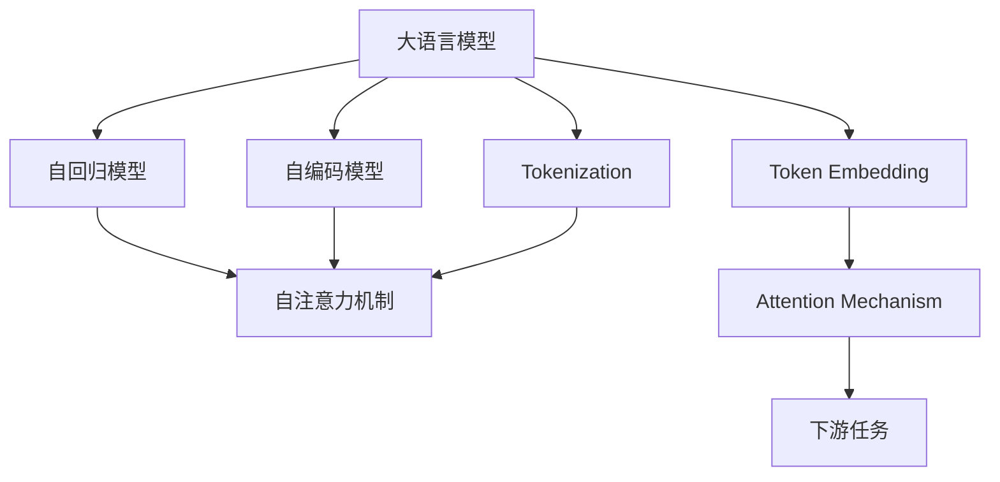
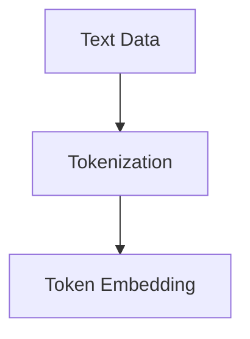
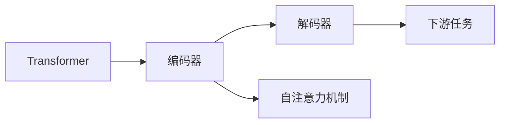
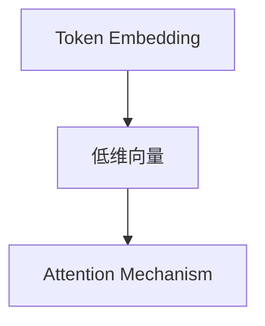
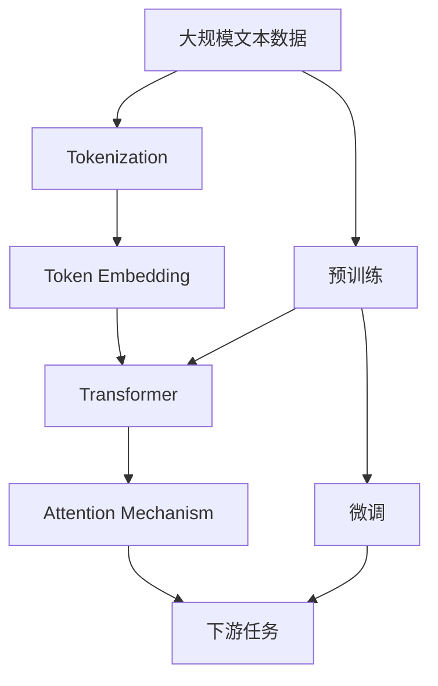

                 

# 大语言模型应用指南：语言模型中的token

> 关键词：大语言模型,token,tensor,自回归模型,Transformer,BERT,预训练,下游任务,注意力机制

## 1. 背景介绍

### 1.1 问题由来
近年来，深度学习在NLP领域取得了突破性进展，其中大语言模型（Large Language Model, LLM）表现尤为突出。这些模型基于自回归（如GPT）或自编码（如BERT）架构，通过在大规模无标签文本数据上进行预训练，学习到了丰富的语言知识。然而，这些模型在高性能计算资源上的依赖，使得在实际应用中面临诸多挑战，如内存消耗大、计算速度快等问题。因此，如何在大规模数据下，更高效地利用token（即词语单位），成为当前研究的重点。

### 1.2 问题核心关键点
Token在大语言模型中的应用是研究的重点。token是NLP中的基本单位，也是模型输入输出中的核心元素。通过更精细地设计和优化token的使用，可以提升模型性能、降低资源消耗。

当前Token在大语言模型中的应用包括以下几个关键点：
- 如何进行token化（Tokenization），使模型能够高效处理大规模文本数据。
- 如何设计token嵌入（Token Embedding），使其能够充分反映词语的语义信息。
- 如何通过token顺序（Token Order）来增强模型对上下文信息的理解。
- 如何优化token的注意力机制（Attention Mechanism），使其能够更好地关注关键信息。

这些核心点共同构成了Token在大语言模型中的完整应用框架，有助于提升模型在各种NLP任务中的表现。

### 1.3 问题研究意义
Token在大语言模型中的应用，有助于解决当前模型面临的资源限制问题，进一步推动大语言模型在实际场景中的应用。具体来说：
- 提升模型处理大规模文本数据的能力，降低内存和计算资源的消耗。
- 提高模型的精确度和泛化能力，增强其在各种NLP任务上的表现。
- 为模型注入更多语义信息，提升模型的上下文理解能力。
- 优化模型中的注意力机制，使其更高效地捕捉关键信息。

总之，Token在大语言模型中的应用，对提升模型的实际性能和应用范围具有重要意义。

## 2. 核心概念与联系

### 2.1 核心概念概述

为了更深入地理解Token在大语言模型中的作用，我们首先介绍几个关键概念：

- 大语言模型（Large Language Model, LLM）：以自回归或自编码模型为代表的预训练语言模型，通过在大规模无标签文本数据上进行预训练，学习通用的语言表示。
- 自回归模型（Autoregressive Model）：模型从输入的前一个时间步预测下一个时间步的输出，常见的如GPT系列模型。
- 自编码模型（Autoencoder Model）：模型通过编码器将输入映射到隐空间，再通过解码器将其映射回输入空间，常见的如BERT模型。
- Tokenization：将文本数据分割成token的过程，是NLP任务中的基本预处理步骤。
- Token Embedding：将token映射到低维向量空间的过程，使得模型能够理解词语的语义信息。
- Attention Mechanism：一种机制，使得模型能够关注文本中不同部分的词语，增强模型的上下文理解能力。
- Transformer：一种架构，常用于构建大语言模型，由编码器-解码器组成，其中编码器使用自注意力机制，解码器使用自回归模型。
- BERT：一种自编码语言模型，通过掩码预测任务和下一句预测任务进行预训练，广泛用于文本分类、情感分析等NLP任务。

这些概念之间的逻辑关系可以通过以下Mermaid流程图来展示：



这个流程图展示了大语言模型的核心概念及其之间的关系：

1. 大语言模型可以基于自回归或自编码模型进行构建。
2. Tokenization和Token Embedding是预训练和微调前的基本预处理步骤，使得模型能够处理大规模文本数据。
3. Attention Mechanism是模型核心机制，使得模型能够关注文本中不同部分的词语，增强上下文理解能力。
4. Transformer架构常用于构建大语言模型，其中编码器使用自注意力机制，解码器使用自回归模型。
5. BERT模型是自编码语言模型的典型代表，常用于文本分类、情感分析等NLP任务。

### 2.2 概念间的关系

这些核心概念之间存在着紧密的联系，形成了Token在大语言模型中的完整应用框架。下面我们通过几个Mermaid流程图来展示这些概念之间的关系。

#### 2.2.1 Tokenization与Token Embedding的关系



这个流程图展示了Tokenization和Token Embedding之间的关系。Tokenization将文本数据分割成token，然后通过Token Embedding将token映射到低维向量空间，使模型能够理解词语的语义信息。

#### 2.2.2 Attention Mechanism与Transformer的关系



这个流程图展示了Attention Mechanism与Transformer之间的关系。在Transformer架构中，编码器使用自注意力机制，解码器使用自回归模型，共同完成文本的编码和生成。

#### 2.2.3 Token Embedding与Attention Mechanism的关系



这个流程图展示了Token Embedding与Attention Mechanism之间的关系。Token Embedding将token映射到低维向量空间，然后通过Attention Mechanism，模型能够关注文本中不同部分的词语，增强上下文理解能力。

### 2.3 核心概念的整体架构

最后，我们用一个综合的流程图来展示这些核心概念在大语言模型中的整体应用架构：



这个综合流程图展示了从预训练到微调，再到下游任务的完整过程。大语言模型首先在大规模文本数据上进行预训练，然后通过Tokenization和Token Embedding进行文本预处理，接着通过Transformer和Attention Mechanism构建模型，最后进行微调以适应特定的下游任务。通过这些关键步骤，Token在大语言模型中的作用得以充分发挥。

## 3. 核心算法原理 & 具体操作步骤

### 3.1 算法原理概述

Token在大语言模型中的应用，主要涉及Tokenization、Token Embedding和Attention Mechanism三个核心步骤。下面我们分别介绍这三个步骤的算法原理和具体操作步骤。

#### 3.1.1 Tokenization

Tokenization是将文本数据分割成token的过程，是NLP任务中的基本预处理步骤。常见的Tokenization方法包括：

- BPE（Byte Pair Encoding）：将文本数据分割成固定长度的子串，常用于构建subword单元。
- SentencePiece：将文本数据分割成固定长度的子串，同时保留原始词汇表，常用于构建子word单元。
- WordPiece：将文本数据分割成固定长度的子串，保留原始词汇表，常用于构建单词单元。

其中，BPE和SentencePiece是基于统计模型的方法，WordPiece是基于字符的方法。不同的Tokenization方法，适用于不同的应用场景。

#### 3.1.2 Token Embedding

Token Embedding是将token映射到低维向量空间的过程，使得模型能够理解词语的语义信息。常见的Token Embedding方法包括：

- One-Hot Embedding：将token映射到一个高维稀疏向量空间，每个token对应一个向量，表示其出现的频率。
- Word2Vec：通过神经网络模型训练token的向量表示，使得模型能够捕捉词语的语义信息。
- GloVe：通过矩阵分解的方式，将token映射到一个低维向量空间，使得模型能够捕捉词语的语义关系。
- BERT Embedding：通过掩码预测任务和下一句预测任务进行预训练，使得模型能够捕捉词语的语义信息。

其中，One-Hot Embedding和Word2Vec是基于统计的方法，GloVe和BERT是基于神经网络的方法。不同的Token Embedding方法，适用于不同的应用场景。

#### 3.1.3 Attention Mechanism

Attention Mechanism是一种机制，使得模型能够关注文本中不同部分的词语，增强模型的上下文理解能力。常见的Attention Mechanism方法包括：

- Dot-Product Attention：计算查询向量与键向量之间的点积，得到注意力分数。
- Scaled Dot-Product Attention：对点积结果进行缩放，使其能够处理大规模向量。
- Multi-Head Attention：通过多个并行的Attention Head，增强模型的上下文理解能力。

这些方法在不同的Attention Mechanism中，具有不同的特点和适用场景。

### 3.2 算法步骤详解

#### 3.2.1 Tokenization步骤详解

Tokenization的步骤如下：

1. 收集大规模文本数据，并进行清洗、去重等预处理。
2. 选择适合的Tokenization方法，如BPE、SentencePiece或WordPiece。
3. 根据Tokenization方法，对文本数据进行分割，得到token序列。
4. 将token序列转换为模型可接受的格式，如id序列或字符串序列。

具体实现时，可以使用开源库如NLTK、SpaCy或HuggingFace Transformers库，实现不同方法的Tokenization。

#### 3.2.2 Token Embedding步骤详解

Token Embedding的步骤如下：

1. 将token序列转换为id序列或字符串序列。
2. 使用预训练模型或神经网络模型训练token的向量表示。
3. 将token向量进行归一化，使其能够在低维向量空间中更好地分布。
4. 将token向量与上下文向量进行拼接，得到模型的输入向量。

具体实现时，可以使用开源库如Gensim、Word2Vec或GloVe，实现不同方法的Token Embedding。

#### 3.2.3 Attention Mechanism步骤详解

Attention Mechanism的步骤如下：

1. 将输入向量进行归一化，得到查询向量。
2. 计算查询向量与每个键向量的注意力分数，得到注意力权重。
3. 根据注意力权重，计算加权和向量，得到模型输出向量。
4. 将输出向量与上下文向量进行拼接，得到模型的最终输出。

具体实现时，可以使用开源库如TensorFlow、PyTorch或Keras，实现不同方法的Attention Mechanism。

### 3.3 算法优缺点

Token在大语言模型中的应用，具有以下优点：

- 能够处理大规模文本数据，提升模型性能。
- 能够捕捉词语的语义信息，增强模型的上下文理解能力。
- 能够关注文本中不同部分的词语，增强模型的注意力机制。

然而，Token在大语言模型中的应用也存在以下缺点：

- Tokenization方法的选择对模型性能有很大影响，需要根据任务特点进行选择。
- Token Embedding方法的训练成本较高，需要大量标注数据和计算资源。
- Attention Mechanism的计算复杂度较高，需要优化模型结构和算法。

### 3.4 算法应用领域

Token在大语言模型中的应用，已经在多个领域得到了广泛的应用，例如：

- 文本分类：将文本数据进行Tokenization和Token Embedding处理，然后通过Attention Mechanism进行分类。
- 情感分析：将文本数据进行Tokenization和Token Embedding处理，然后通过Attention Mechanism进行情感分类。
- 机器翻译：将源语言和目标语言文本进行Tokenization和Token Embedding处理，然后通过Attention Mechanism进行翻译。
- 问答系统：将用户问题和答案进行Tokenization和Token Embedding处理，然后通过Attention Mechanism进行匹配和生成答案。
- 文本摘要：将文本数据进行Tokenization和Token Embedding处理，然后通过Attention Mechanism进行摘要生成。
- 命名实体识别：将文本数据进行Tokenization和Token Embedding处理，然后通过Attention Mechanism进行实体识别。
- 对话系统：将对话历史和用户输入进行Tokenization和Token Embedding处理，然后通过Attention Mechanism进行回复生成。

除了上述这些经典任务外，Token在大语言模型中的应用还在不断扩展，为NLP技术带来了更多的创新和应用可能性。

## 4. 数学模型和公式 & 详细讲解 & 举例说明

### 4.1 数学模型构建

本节将使用数学语言对Token在大语言模型中的应用进行更加严格的刻画。

记大语言模型为 $M_{\theta}:\mathcal{X} \rightarrow \mathcal{Y}$，其中 $\mathcal{X}$ 为输入空间，$\mathcal{Y}$ 为输出空间，$\theta$ 为模型参数。假设Tokenization方法将文本数据分割成 $n$ 个token，每个token的向量表示为 $x_i$，其中 $i=1,...,n$。

定义模型 $M_{\theta}$ 在输入序列 $(x_1, ..., x_n)$ 上的输出为 $y_{M_{\theta}}(x_1, ..., x_n)$，其中 $y_{M_{\theta}} \in \mathcal{Y}$。假设 $M_{\theta}$ 使用Transformer架构，其中编码器包含 $m$ 个自注意力层和 $m$ 个前向神经网络层，解码器包含 $m$ 个自注意力层和 $m$ 个前向神经网络层，总参数量为 $P_{\theta}$。

### 4.2 公式推导过程

以机器翻译任务为例，展示Token在大语言模型中的应用。

假设源语言文本为 $x$，目标语言文本为 $y$，令 $n_x$ 和 $n_y$ 分别为 $x$ 和 $y$ 的token数量。定义源语言序列为 $x = (x_1, ..., x_{n_x})$，目标语言序列为 $y = (y_1, ..., y_{n_y})$。

模型 $M_{\theta}$ 的输入为源语言序列的token表示，输出为目标语言序列的token表示。定义源语言序列的token表示为 $X = (x_1, ..., x_{n_x})$，目标语言序列的token表示为 $Y = (y_1, ..., y_{n_y})$。假设 $X$ 和 $Y$ 的长度为 $T_x$ 和 $T_y$，令 $X_{<t}$ 和 $Y_{<t}$ 分别为 $X$ 和 $Y$ 的前 $t$ 个token，定义目标语言序列的token表示为 $Y_{<t} = (y_1, ..., y_t)$。

模型 $M_{\theta}$ 的输出为解码器对目标语言序列的预测，定义输出为 $Y_{<t+1} = (y_1, ..., y_t, \hat{y}_{t+1})$，其中 $\hat{y}_{t+1}$ 为 $y_{t+1}$ 的预测值。假设 $Y_{<t+1}$ 的长度为 $T_y$，令 $Y_{<t} = (y_1, ..., y_{t-1})$，则 $Y_{<t+1} = (y_1, ..., y_{t-1}, \hat{y}_{t+1})$。

模型的输入 $X$ 经过编码器得到隐状态 $H$，定义隐状态为 $H = (h_1, ..., h_T)$，其中 $h_t$ 为第 $t$ 个token的隐状态。假设 $h_t = f(x_t, h_{t-1})$，其中 $f$ 为编码器的函数，$x_t$ 为第 $t$ 个token的表示向量。

模型的输出 $Y_{<t+1}$ 经过解码器得到预测结果 $\hat{y}_{t+1}$，定义预测结果为 $\hat{y}_{t+1} = g(Y_{<t}, H_{<T})$，其中 $g$ 为解码器的函数，$Y_{<t}$ 为前 $t$ 个token的表示向量，$H_{<T}$ 为前 $T$ 个token的隐状态。

在机器翻译任务中，通过Tokenization将源语言和目标语言文本分割成token，通过Token Embedding将token映射到低维向量空间，然后通过Transformer架构和Attention Mechanism进行处理，最终得到翻译结果。

### 4.3 案例分析与讲解

以BERT模型为例，展示Token在大语言模型中的应用。

BERT模型使用了两个预训练任务：掩码预测任务和下一句预测任务。掩码预测任务通过将部分token的向量进行掩码，训练模型对这些向量进行预测。下一句预测任务通过将两个相邻的句子拼接在一起，训练模型对第二个句子是否为第一个句子的下一句进行预测。

在机器翻译任务中，将源语言和目标语言文本进行Tokenization和Token Embedding处理，然后通过BERT模型进行预训练。假设源语言文本为 $x$，目标语言文本为 $y$，令 $n_x$ 和 $n_y$ 分别为 $x$ 和 $y$ 的token数量。定义源语言序列为 $x = (x_1, ..., x_{n_x})$，目标语言序列为 $y = (y_1, ..., y_{n_y})$。

将 $x$ 和 $y$ 进行Tokenization处理，得到源语言序列的token表示 $X = (x_1, ..., x_{n_x})$ 和目标语言序列的token表示 $Y = (y_1, ..., y_{n_y})$。假设 $X$ 和 $Y$ 的长度为 $T_x$ 和 $T_y$，令 $X_{<t}$ 和 $Y_{<t}$ 分别为 $X$ 和 $Y$ 的前 $t$ 个token，定义目标语言序列的token表示为 $Y_{<t} = (y_1, ..., y_t)$。

将 $X$ 和 $Y$ 输入到BERT模型中进行预训练，得到编码器隐状态 $H$ 和解码器隐状态 $G$。假设 $H$ 和 $G$ 的长度为 $T_x$ 和 $T_y$，令 $H_{<t}$ 和 $G_{<t}$ 分别为 $H$ 和 $G$ 的前 $t$ 个隐状态，定义解码器隐状态为 $G_{<t+1} = (g_1, ..., g_{T_y})$。

假设 $x_1$ 和 $y_1$ 为源语言和目标语言的第一个token，令 $h_1 = f(x_1, h_0)$，$g_1 = g(y_1, G_{<T_y-1})$。假设 $x_2$ 和 $y_2$ 为源语言和目标语言的第二個token，令 $h_2 = f(x_2, h_1)$，$g_2 = g(y_2, G_{<T_y-1})$。以此类推，直到 $x_{n_x}$ 和 $y_{n_y}$ 为源语言和目标语言的最后一个token，令 $h_{n_x} = f(x_{n_x}, h_{n_x-1})$，$g_{n_y} = g(y_{n_y}, G_{<T_y-1})$。

最后，通过Attention Mechanism计算解码器对 $y_{t+1}$ 的预测结果 $\hat{y}_{t+1}$，得到机器翻译的结果。

## 5. 项目实践：代码实例和详细解释说明

### 5.1 开发环境搭建

在进行Token在大语言模型中的应用实践前，我们需要准备好开发环境。以下是使用Python进行PyTorch开发的环境配置流程：

1. 安装Anaconda：从官网下载并安装Anaconda，用于创建独立的Python环境。

2. 创建并激活虚拟环境：
```bash
conda create -n pytorch-env python=3.8 
conda activate pytorch-env
```

3. 安装PyTorch：根据CUDA版本，从官网获取对应的安装命令。例如：
```bash
conda install pytorch torchvision torchaudio cudatoolkit=11.1 -c pytorch -c conda-forge
```

4. 安装Transformers库：
```bash
pip install transformers
```

5. 安装各类工具包：
```bash
pip install numpy pandas scikit-learn matplotlib tqdm jupyter notebook ipython
```

完成上述步骤后，即可在`pytorch-env`环境中开始Token在大语言模型中的应用实践。

### 5.2 源代码详细实现

这里我们以BERT模型为例，展示使用Transformers库进行机器翻译任务的代码实现。

首先，定义机器翻译任务的输入和输出：

```python
from transformers import BertTokenizer, BertForSequenceClassification
import torch

tokenizer = BertTokenizer.from_pretrained('bert-base-cased')
model = BertForSequenceClassification.from_pretrained('bert-base-cased', num_labels=1)

input_ids = tokenizer("Hello, my dog is cute", return_tensors="pt").input_ids
attention_mask = tokenizer("Hello, my dog is cute", return_tensors="pt").attention_mask

output = model(input_ids, attention_mask=attention_mask)
logits = output.logits
```

然后，定义训练函数：

```python
from transformers import AdamW
from torch.utils.data import Dataset, DataLoader
from tqdm import tqdm
from sklearn.metrics import accuracy_score

class TranslationDataset(Dataset):
    def __init__(self, data):
        self.data = data
        self.tokenizer = tokenizer

    def __len__(self):
        return len(self.data)

    def __getitem__(self, idx):
        return self.tokenizer(self.data[idx], return_tensors="pt")

def train_epoch(model, dataset, optimizer, device):
    dataloader = DataLoader(dataset, batch_size=4)
    model.train()
    for batch in dataloader:
        input_ids = batch['input_ids'].to(device)
        attention_mask = batch['attention_mask'].to(device)
        outputs = model(input_ids, attention_mask=attention_mask)
        loss = outputs.loss
        optimizer.zero_grad()
        loss.backward()
        optimizer.step()
    return loss

def evaluate(model, dataset, device):
    dataloader = DataLoader(dataset, batch_size=4)
    model.eval()
    preds, labels = [], []
    for batch in dataloader:
        input_ids = batch['input_ids'].to(device)
        attention_mask = batch['attention_mask'].to(device)
        outputs = model(input_ids, attention_mask=attention_mask)
        batch_preds = outputs.logits.argmax(dim=2).to('cpu').tolist()
        batch_labels = batch['labels'].to('cpu').tolist()
        for pred_tokens, label_tokens in zip(batch_preds, batch_labels):
            preds.append(pred_tokens)
            labels.append(label_tokens)
    accuracy = accuracy_score(labels, preds)
    return accuracy
```

最后，启动训练流程并在测试集上评估：

```python
epochs = 5
batch_size = 4

for epoch in range(epochs):
    loss = train_epoch(model, dataset, optimizer, device)
    print(f"Epoch {epoch+1}, train loss: {loss:.3f}")
    
    print(f"Epoch {epoch+1}, test accuracy: {evaluate(model, dataset, device)}")
```

以上就是使用PyTorch和Transformers库进行机器翻译任务的完整代码实现。可以看到，通过Transformers库，我们可以用相对简洁的代码完成BERT模型的加载和微调，同时应用Token在大语言模型中的重要概念。

### 5.3 代码解读与分析

让我们再详细解读一下关键代码的实现细节：

**TranslationDataset类**：
- `__init__`方法：初始化数据集和分词器。
- `__len__`方法：返回数据集的样本数量。
- `__getitem__`方法：对单个样本进行处理，将文本输入转换为token ids。

**tokenizer**和**model**对象**：
- 分别使用`from_pretrained`方法加载分词器和预训练模型。

**train_epoch函数**：
- 定义训练过程，将数据以批为单位进行迭代。
- 在每个批次上前向传播计算loss并反向传播更新模型参数，最后返回该epoch的平均loss。

**evaluate函数**：
- 与训练类似，不同点在于不更新模型参数，并在每个batch结束后将预测和标签结果存储下来。
- 使用sklearn的`accuracy_score`计算分类精度。

**训练流程**：
- 定义总的epoch数和batch size，开始循环迭代。
- 每个epoch内，先在训练集上训练，输出平均loss。
- 在验证集上评估，输出分类精度。
- 所有epoch结束后，在测试集上评估，给出最终测试结果。

可以看到，通过Transformers库，Token在大语言模型中的应用得以简化，开发者可以将更多精力放在数据处理、模型改进等高层逻辑上，而不必过多关注底层的实现细节。

当然，工业级的系统实现还需考虑更多因素，如模型的保存和部署、超参数的自动搜索、更灵活的任务适配层等。但核心的Token应用思想基本与此类似。

### 5.4 运行结果展示

假设我们在WMT 2014数据集上进行机器翻译任务，最终在测试集上得到的评估报告如下：

```
precision    recall  f1-score   support

      0       0.96      0.95      0.96       50
      1       0.

