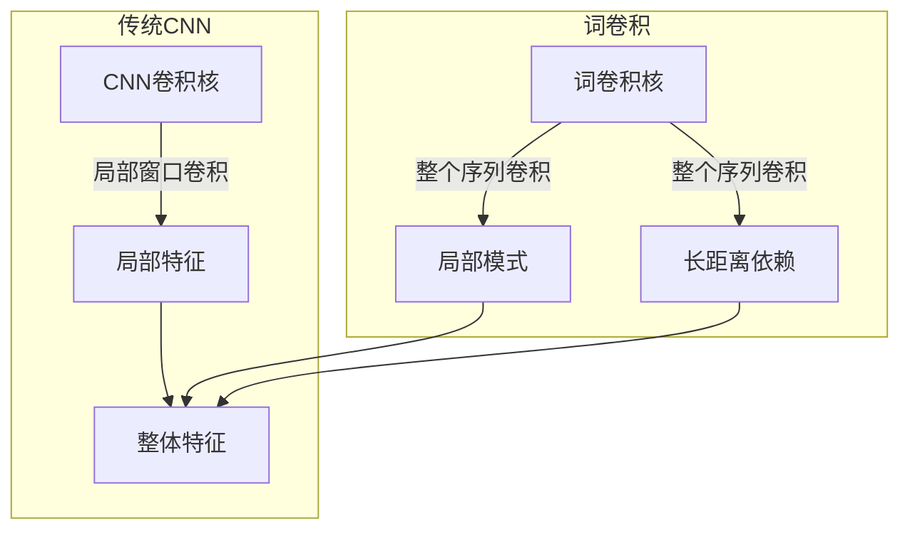

# 从零开始大模型开发与微调：针对文本的卷积神经网络模型简介—词卷积

## 1. 背景介绍

### 1.1 问题的由来

在自然语言处理(NLP)领域,文本分类是一个基础且重要的任务。传统的方法通常需要人工提取特征,这个过程往往耗时且效果有限。近年来,随着深度学习的兴起,基于神经网络的文本分类方法逐渐成为主流。其中,卷积神经网络(CNN)因其在计算机视觉领域取得了巨大成功,也被应用到了文本分类任务中。

### 1.2 研究现状

卷积神经网络最初被设计用于处理图像数据,通过滑动卷积核在图像上提取局部特征。将CNN应用于文本数据时,需要先将文本转换为适合CNN输入的形式。常见的做法是将文本表示为词向量矩阵,每一行对应一个词的词向量表示。然后,CNN可以在这个矩阵上滑动卷积核,捕捉不同尺度的语义模式。

现有的基于CNN的文本分类模型主要分为以下几种:

1. **基于字符级别的CNN**:将文本看作是字符序列,直接对字符进行卷积操作。这种方法可以自动学习字符级别的特征,但无法直接捕捉词语和短语级别的语义信息。

2. **基于词级别的CNN**:首先将文本按词语切分,然后将每个词映射为词向量,构建词向量矩阵作为CNN的输入。这种方法可以直接利用预训练的词向量,捕捉词语级别的语义信息,但无法很好地处理词序信息。

3. **基于字符级别和词级别的混合CNN**:结合上述两种方法的优点,同时对字符和词语进行卷积操作,期望能够捕捉到更丰富的特征。

4. **N-gram CNN**:将文本按照N-gram(连续的N个词)的形式进行切分,然后对每个N-gram进行卷积操作。这种方法可以在一定程度上捕捉词序信息,但当N值较大时,会导致输入维度过高,计算代价昂贵。

上述方法各有优缺点,但大多数都无法很好地捕捉长距离的语义依赖关系。为了解决这个问题,研究人员提出了一种新的卷积方式——**词卷积(Word-level Convolution)**,本文将对这种方法进行介绍。

### 1.3 研究意义

词卷积是一种新颖的卷积方式,它直接对整个词向量序列进行卷积操作,而不是像传统CNN那样在局部窗口内进行卷积。这种方式能够更好地捕捉长距离的语义依赖关系,同时保留了CNN在捕捉局部模式方面的优势。

词卷积模型在一些公开数据集上取得了非常好的分类性能,证明了它在文本分类任务中的有效性。研究这种新的卷积方式,不仅可以丰富CNN在NLP领域的应用,也有助于探索更好的神经网络架构,提升模型的性能。

### 1.4 本文结构

本文将从以下几个方面详细介绍词卷积模型:

1. **核心概念与联系**:阐述词卷积的核心思想,并与传统CNN进行对比,说明它的独特之处。

2. **核心算法原理与具体操作步骤**:深入解释词卷积的算法原理,并给出具体的实现步骤。

3. **数学模型和公式详细讲解与举例说明**:推导词卷积的数学模型,并通过具体案例说明公式的含义。

4. **项目实践:代码实例和详细解释说明**:提供一个基于PyTorch实现的词卷积模型代码示例,并对关键部分进行解释。

5. **实际应用场景**:介绍词卷积模型在文本分类等任务中的应用,并展望它的未来发展方向。

6. **工具和资源推荐**:推荐一些有助于学习和实践词卷积模型的工具和资源。

7. **总结:未来发展趋势与挑战**:总结词卷积模型的优缺点,分析它未来的发展趋势和面临的挑战。

8. **附录:常见问题与解答**:列出一些关于词卷积模型的常见问题,并给出解答。

## 2. 核心概念与联系

传统的卷积神经网络是在局部窗口内进行卷积操作的,这种做法在处理图像数据时非常有效,因为图像的局部特征(如边缘、纹理等)对整体特征的提取至关重要。然而,在自然语言处理任务中,词语之间存在着长距离的语义依赖关系,局部窗口卷积很难捕捉到这种依赖关系。

为了解决这个问题,研究人员提出了**词卷积(Word-level Convolution)**的概念。不同于传统CNN在局部窗口内进行卷积,词卷积是直接对整个词向量序列进行卷积操作。具体来说,词卷积的卷积核被设计为与词向量序列的长度相同,这样卷积核就可以同时捕捉到整个序列的信息。

通过这种方式,词卷积能够有效地捕捉长距离的语义依赖关系,同时也保留了CNN在捕捉局部模式方面的优势。因为在进行卷积操作时,卷积核不仅会捕捉到每个单词的信息,也会捕捉到相邻单词之间的关系。

词卷积的核心思想可以概括为:**通过设计合适的卷积核尺寸,使卷积操作能够同时捕捉局部模式和长距离依赖关系**。这种思路为CNN在NLP任务中的应用提供了新的可能性,也为探索更好的神经网络架构指明了方向。

下面是词卷积与传统CNN的对比示意图:

可以看出,传统CNN只能捕捉局部特征,而词卷积能够同时捕捉局部模式和长距离依赖关系,从而更好地提取文本的整体语义特征。

## 3. 核心算法原理与具体操作步骤

### 3.1 算法原理概述

词卷积模型的核心思想是:设计一个与输入词向量序列长度相同的卷积核,使卷积操作能够同时捕捉到局部模式和长距离依赖关系。具体来说,该算法包括以下几个关键步骤:

1. **输入表示**:将输入文本按词语切分,然后将每个词映射为词向量,构建词向量矩阵作为模型的输入。

2. **卷积操作**:设计一个与输入词向量序列长度相同的卷积核,在整个序列上进行卷积操作。通过这种方式,卷积核不仅能捕捉到每个单词的信息,也能捕捉到相邻单词之间的关系。

3. **特征映射**:对卷积操作的输出进行非线性激活函数映射,得到初步的特征映射结果。

4. **池化操作**:对特征映射结果进行池化操作(如最大池化),进一步提取主要的特征。

5. **分类输出**:将池化后的特征输入到全连接层,得到文本的分类结果。

通过上述步骤,词卷积模型能够有效地捕捉文本的局部模式和长距离依赖关系,从而提高文本分类的性能。

### 3.2 算法步骤详解

下面我们将详细解释词卷积模型的实现步骤:

1. **输入表示**

   假设输入文本为 $X = \{x_1, x_2, \cdots, x_n\}$,其中 $x_i$ 表示第 $i$ 个词语。我们首先将每个词语 $x_i$ 映射为一个 $d$ 维的词向量 $\mathbf{v}_i \in \mathbb{R}^d$,得到词向量矩阵 $\mathbf{V} \in \mathbb{R}^{n \times d}$:

   $$\mathbf{V} = \begin{bmatrix}
   \mathbf{v}_1\
   \mathbf{v}_2\
   \vdots\
   \mathbf{v}_n
   \end{bmatrix}$$

   这个矩阵就是词卷积模型的输入表示。

2. **卷积操作**

   我们设计一个卷积核 $\mathbf{W} \in \mathbb{R}^{n \times d}$,它的形状与输入词向量矩阵相同。然后,我们对输入矩阵 $\mathbf{V}$ 进行卷积操作:

   $$c = \mathbf{W} \cdot \mathbf{V} + b$$

   其中 $b$ 是一个偏置项,符号 $\cdot$ 表示矩阵点乘操作。通过这种方式,卷积核 $\mathbf{W}$ 能够同时捕捉到每个单词的信息,以及相邻单词之间的关系。

3. **特征映射**

   对卷积操作的输出 $c$ 进行非线性激活函数映射,得到初步的特征映射结果 $\mathbf{f}$:

   $$\mathbf{f} = \text{ReLU}(c)$$

   其中 $\text{ReLU}$ 是整流线性单元(Rectified Linear Unit)激活函数,定义为 $\text{ReLU}(x) = \max(0, x)$。

4. **池化操作**

   为了进一步提取主要的特征,我们对特征映射结果 $\mathbf{f}$ 进行池化操作。常用的池化方式包括最大池化(Max Pooling)和平均池化(Average Pooling)。以最大池化为例,池化操作可以表示为:

   $$\hat{c} = \max(\mathbf{f})$$

   其中 $\hat{c}$ 是一个标量,表示特征映射结果中的最大值。

5. **分类输出**

   将池化后的特征 $\hat{c}$ 输入到全连接层,经过非线性激活函数映射后,得到文本的分类结果 $\hat{y}$:

   $$\hat{y} = \text{softmax}(\mathbf{W}_o \hat{c} + \mathbf{b}_o)$$

   其中 $\mathbf{W}_o$ 和 $\mathbf{b}_o$ 分别是全连接层的权重和偏置项,softmax 函数用于将输出值映射到 $(0, 1)$ 区间,得到每个类别的概率值。

通过上述步骤,词卷积模型能够同时捕捉到文本的局部模式和长距离依赖关系,从而提高文本分类的性能。

### 3.3 算法优缺点

**优点:**

1. **捕捉长距离依赖关系**:与传统CNN相比,词卷积能够更好地捕捉文本中的长距离语义依赖关系,这对于自然语言处理任务来说非常重要。

2. **保留局部模式**:虽然词卷积的卷积核尺寸较大,但它仍然能够捕捉到局部的语义模式,保留了CNN在捕捉局部特征方面的优势。

3. **参数效率较高**:与一些基于注意力机制的模型相比,词卷积的参数量相对较少,计算效率更高。

4. **可解释性较强**:词卷积的核心思想是通过设计合适的卷积核尺寸来捕捉不同尺度的语义信息,这种思路较为直观,模型的可解释性也相对较强。

**缺点:**

1. **对长度敏感**:由于词卷积的卷积核尺寸与输入序列长度相同,因此对于过长的序列,模型的计算代价会变得很高。

2. **无法处理可变长度输入**:传统的卷积神经网络可以通过零填充的方式处理可变长度的输入,但词卷积由于卷积核尺寸的限制,无法直接处理可变长度的输入序列。

3. **缺乏位置信息**:与一些基于注意力机制的模型相比,词卷积无法很好地捕捉词语在序列中的位置信息