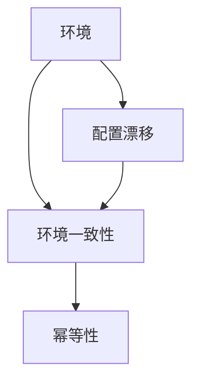

# 环境 (Environment)

关键词：环境、操作系统、虚拟化、容器化、配置管理、基础设施即代码、持续集成/持续部署

## 1. 背景介绍
### 1.1  问题的由来
在软件开发和部署过程中,环境一直扮演着至关重要的角色。不同的开发、测试、生产环境的差异经常导致应用程序出现不一致和错误的行为。环境问题一直是软件工程领域亟待解决的难题之一。
### 1.2  研究现状
目前业界已经提出了诸如虚拟化、容器化、配置管理、基础设施即代码等技术和最佳实践来应对环境问题的挑战。这些方法在一定程度上缓解了环境不一致性带来的问题,但仍然存在一些局限性。
### 1.3  研究意义
深入研究环境问题,总结和创新环境管理的方法,对于提高软件开发和交付的效率、质量和稳定性具有重要意义。解决环境问题不仅能够帮助开发人员和运维人员从繁琐的环境配置和问题定位中解放出来,而且有助于实现真正的DevOps协作。
### 1.4  本文结构
本文将从环境问题的核心概念入手,阐述各种环境管理技术的原理、步骤和优缺点,并通过数学建模、代码实例等方式进行详细讲解。同时,本文也会介绍环境管理在实际场景中的应用,推荐相关工具和学习资源,展望未来的发展趋势与挑战。

## 2. 核心概念与联系
环境问题涉及到多个核心概念,包括:
- 环境:应用程序运行所依赖的一切外部条件,包括操作系统、库、配置等。
- 配置漂移:由于手动更改或系统更新,导致环境配置偏离预期状态的现象。
- 环境一致性:确保不同环境下应用程序表现一致的属性。
- 幂等性:操作无论执行多少次,都能获得相同结果的性质。

这些概念之间环环相扣,共同构成了环境问题的基本内涵。下图展示了它们之间的关系:



## 3. 核心算法原理 & 具体操作步骤
### 3.1  算法原理概述
环境管理的核心是通过自动化手段来确保环境一致性和可重复性。其基本原理可以概括为:
1. 将环境的预期状态编码为代码或配置文件
2. 使用工具将环境状态与预期进行比对
3. 自动纠正环境偏差或重建环境

### 3.2  算法步骤详解
具体来说,环境管理的步骤通常包括:
1. 定义环境规范:以代码或配置文件的形式明确环境的组成和配置
2. 配置基础设施:使用工具如Terraform、CloudFormation等定义和配置环境
3. 配置中间件和应用:使用工具如Ansible、Chef、Puppet等定义和配置
4. 持续检查和自愈:通过监控和告警及时发现环境问题,并自动修复
5. 版本控制和审计:将环境的变更纳入版本控制,保证可追溯性

### 3.3  算法优缺点
上述环境管理方法的优点包括:
- 环境可以完全自动化管理,减少人工操作
- 环境状态可审计,具备可追溯性
- 环境可快速重建,降低了恢复时间

但同时也存在一些局限:
- 引入新工具和复杂度,需要额外的学习成本
- 一次性自动化迁移工作量大
- 遗留系统和特殊场景的适配性不足

### 3.4  算法应用领域
尽管有局限性,环境自动化管理的理念已经被广泛应用于以下领域:
- 云计算环境的配置管理
- 微服务架构下的服务环境管理
- 持续集成/持续部署(CI/CD)流水线中的环境准备
- 多环境下的自动化测试

## 4. 数学模型和公式 & 详细讲解 & 举例说明
### 4.1  数学模型构建
我们可以使用集合论来抽象地描述环境管理问题。假设:
- $E$表示环境的状态集合
- $E_d$表示环境的预期状态
- $E_r$表示环境的实际状态
- $T$表示环境管理工具作用的变换

则环境一致性可以表示为:

$$ T(E_r) = E_d $$

即环境管理工具将实际状态转换为预期状态。

### 4.2  公式推导过程
进一步,我们可以定义环境状态偏离度$D$:

$$ D(E_r, E_d) = \frac{|E_r \oplus E_d|}{|E_d|} $$

其中$\oplus$表示对称差集,即:

$$ E_r \oplus E_d = (E_r - E_d) \cup (E_d - E_r) $$

$D$的值在0到1之间,0表示完全一致,1表示完全偏离。

环境管理的目标就是通过$T$使$D$尽可能接近0。

### 4.3  案例分析与讲解
举一个具体的例子,假设一个Web服务的环境包含以下配置项:
- 操作系统版本
- JDK版本
- Tomcat版本和端口
- 数据库连接字符串

我们可以用一个4维向量$\vec{e}$来表示环境状态:

$$ \vec{e} = (os, jdk, tomcat, db) $$

假设预期状态为:

$$ \vec{e_d} = (CentOS7, JDK8, Tomcat8/8080, jdbc:mysql://db/myapp) $$

而实际状态为:

$$ \vec{e_r} = (CentOS7, JDK7, Tomcat8/8080, jdbc:mysql://db/myapp) $$

此时偏离度为:

$$ D(\vec{e_r}, \vec{e_d}) = \frac{1}{4} = 0.25 $$

环境管理工具需要将JDK版本升级到8,从而使$D$降为0。

### 4.4  常见问题解答
问:偏离度能否大于1?
答:不能。因为对称差集的大小不会超过$E_d$本身。即使$E_r$完全偏离$E_d$,两者没有任何交集,此时$D$也等于1。

## 5. 项目实践：代码实例和详细解释说明
### 5.1  开发环境搭建
以一个基于Vagrant和VirtualBox的开发环境为例。首先安装必要的工具:
```bash
# 安装VirtualBox
sudo apt-get install virtualbox
# 安装Vagrant
curl -O https://releases.hashicorp.com/vagrant/2.2.14/vagrant_2.2.14_x86_64.deb
sudo dpkg -i vagrant_2.2.14_x86_64.deb
```

### 5.2  源代码详细实现
创建如下的Vagrantfile:
```ruby
Vagrant.configure("2") do |config|
  config.vm.box = "ubuntu/bionic64"
  config.vm.network "private_network", ip: "192.168.33.10"

  config.vm.provision "shell", inline: <<-SHELL
    apt-get update
    apt-get install -y openjdk-8-jdk
    apt-get install -y tomcat8
  SHELL
end
```
该脚本定义了一个Ubuntu 18.04的虚拟机,并在其中安装了JDK8和Tomcat8。

### 5.3  代码解读与分析
- `config.vm.box`指定了虚拟机使用的基础镜像
- `config.vm.network`设置了虚拟机的IP
- `config.vm.provision`定义了虚拟机启动后执行的脚本,用于安装和配置环境

Vagrant使用Ruby的DSL来编写配置,通过声明式的方式描述环境的预期状态。

### 5.4  运行结果展示
在Vagrantfile所在目录下执行:
```bash
vagrant up
```
即可启动虚拟机并完成环境配置。随后可以通过:
```bash
vagrant ssh
```
登录虚拟机,检查环境是否符合预期。

## 6. 实际应用场景
环境自动化管理在以下场景中有广泛应用:
- 开发人员本地环境的快速搭建
- 测试环境的自动化准备和清理
- 生产环境的配置与变更管理
- 多云环境下的资源编排与配置同步

### 6.4  未来应用展望
未来,环境自动化管理技术有望与以下领域深度结合:
- 无服务器计算:自动化管理和弹性伸缩无服务器应用的运行环境
- AIOps:利用机器学习实现环境问题的自动化发现和修复
- 边缘计算:自动化配置和管理大规模、地理分散的边缘计算环境

## 7. 工具和资源推荐
### 7.1  学习资源推荐
- 《Infrastructure as Code》by Kief Morris
- Udemy课程《Terraform for DevOps Beginners》
- Pluralsight课程《Chef Fundamentals》

### 7.2  开发工具推荐
- Terraform:基础架构即代码工具
- Ansible:配置管理与应用部署工具
- Puppet:配置管理与持续交付工具
- Chef:配置管理与持续自动化工具
- Vagrant:开发环境管理工具
- Docker:容器化平台
- Kubernetes:容器编排平台

### 7.3  相关论文推荐
- Hummer, W., Rosenberg, F., Oliveira, F., & Eilam, T. (2013). Testing idempotence for infrastructure as code. Middleware 2013.
- Jiang, Y., & Adams, B. (2015). Co-evolution of infrastructure and source code - An empirical study. 2015 IEEE/ACM 12th Working Conference on Mining Software Repositories.
- Rahman, A., Partho, P., Morrison, P., & Williams, L. (2018). What questions do programmers ask about configuration as code?. 2018 IEEE/ACM 4th International Workshop on Rapid Continuous Software Engineering (RCoSE).

### 7.4  其他资源推荐
- GitHub Awesome系列:
  - Awesome IaC: https://github.com/kief/awesome-iac
  - Awesome Terraform: https://github.com/shuaibiyy/awesome-terraform
- InfrastructureAsCode.info:一个专注于基础架构即代码的网站

## 8. 总结：未来发展趋势与挑战
### 8.1  研究成果总结
本文系统地阐述了环境自动化管理的核心概念、技术原理、最佳实践和实际应用,总结出以下关键点:
- 通过自动化手段确保环境一致性和可重复性是解决环境问题的根本方法
- 环境即代码和不可变基础设施是两个重要的实践理念
- 成熟的工具链支持是环境自动化管理的必要保障

### 8.2  未来发展趋势
展望未来,环境自动化管理技术将呈现以下发展趋势:
- 与云原生技术加速融合,成为云原生应用的基础设施
- 持续演进的工具链,支持更多自动化场景
- 机器学习驱动的智能化环境管理成为可能

### 8.3  面临的挑战
但同时,环境自动化管理也面临诸多挑战:
- 遗留系统和特殊场景的适配
- 自动化工具的安全性和合规性
- 人员的技能转型与文化变革

### 8.4  研究展望
未来的研究方向可以包括但不限于:
- 环境即代码的形式化验证方法
- 环境管理领域特定语言(DSL)的设计
- 基于机器学习的环境问题自动化诊断与修复
- 大规模、混合云场景下的环境自动化编排技术

## 9. 附录：常见问题与解答
问:环境管理需要什么技能?
答:需要掌握脚本编程、基础架构即代码、配置管理等技术,了解部署自动化和CI/CD流程,熟悉主流云平台。

问:环境自动化与配置管理有何区别?
答:配置管理强调中间件和应用层面,环境自动化从更底层的基础设施抓起,但两者往往需要结合使用。

问:引入环境自动化的成本如何?
答:前期需要投入自动化脚本的编写和工具链的搭建,但从长期看会显著提升效率并降低风险。关键是形成正确的工程文化和习惯。

问:环境问题的彻底解决还有多远?
答:尽管还无法100%避免