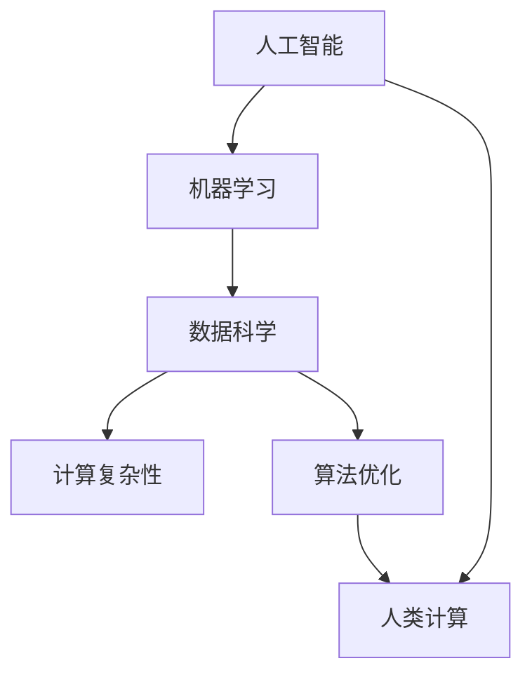
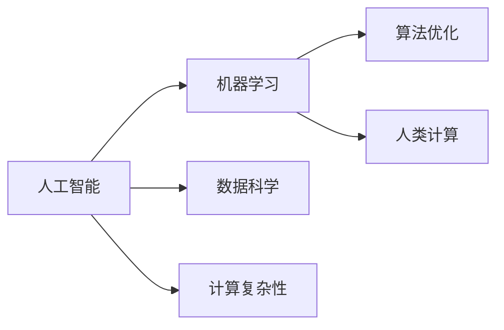
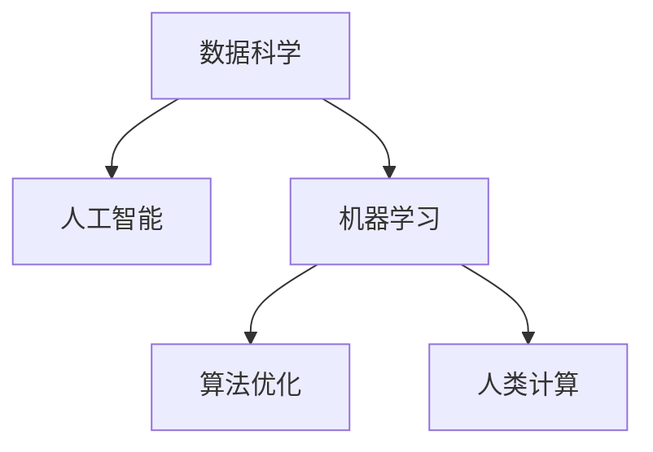
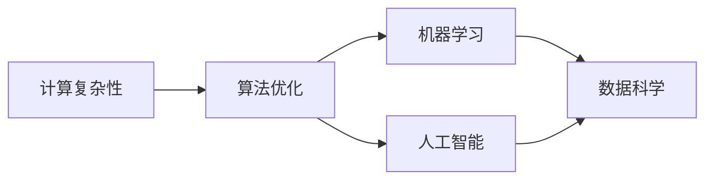
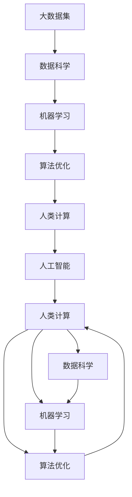

                 

# 人类计算：AI 时代的新引擎

> 关键词：人工智能(AI)、机器学习、数据科学、计算复杂性、算法优化、人类计算

## 1. 背景介绍

### 1.1 问题由来

随着人工智能(AI)技术的发展，机器学习已经成为了推动科技前进的重要力量。从深度学习到强化学习，再到最新的自然语言处理(NLP)和计算机视觉(CV)等技术，机器学习正在以惊人的速度改变着我们的世界。然而，尽管AI技术已经取得了显著的进步，其核心驱动力的本质依然是人类计算。

### 1.2 问题核心关键点

尽管AI技术不断进步，但人类计算的核心作用依然不可替代。在AI时代，人类计算（Human Computation）不仅是大数据和复杂算法的基础，更是推动AI技术不断突破的引擎。以下是几个关键点：

1. **数据质量**：高质量的数据是AI算法的关键，而数据的收集、清洗、标注等环节都需要人类的参与。
2. **算法设计**：无论是神经网络结构的设定、损失函数的选取，还是正则化的应用，都需要人类基于经验和直觉进行设计和优化。
3. **模型调优**：模型训练过程中的超参数调整、学习率设定、优化算法的选择等，都需要人类进行判断和决策。
4. **解释和理解**：AI模型虽然强大，但它们的决策过程往往是“黑盒”的。人类需要理解模型的工作原理和推理过程，才能有效地指导AI系统的开发和应用。
5. **伦理和法律**：AI技术的应用涉及到隐私保护、安全风险、伦理道德等多方面的问题，人类的判断和干预是确保这些问题的解决的关键。

### 1.3 问题研究意义

研究人类计算在AI时代的作用，对于理解AI技术的本质、推动AI技术的进步、保障AI技术的安全和伦理有着重要意义：

1. **深入理解AI**：通过研究人类计算在AI系统中的作用，可以帮助我们更好地理解AI技术的核心机制，从而提高AI系统的可靠性和安全性。
2. **推动技术创新**：人类计算不仅是AI技术的支撑，更是推动技术不断突破的重要力量。通过研究人类计算，可以发现新的研究方向和技术突破点。
3. **保障技术应用**：AI技术在各个领域的应用都需要考虑伦理和法律问题，人类计算在这一过程中起到了重要的监督和指导作用。
4. **提升用户体验**：AI技术最终是为了服务人类，通过研究人类计算，可以更好地理解用户需求，提升用户体验。
5. **应对技术挑战**：AI技术在发展过程中会遇到各种挑战，如计算复杂性、模型可解释性、数据隐私等，人类计算在这一过程中起到了重要的缓解作用。

## 2. 核心概念与联系

### 2.1 核心概念概述

为更好地理解人类计算在AI时代的作用，本节将介绍几个关键概念及其联系：

- **人工智能(AI)**：利用计算机技术和算法，使机器能够模拟人类的智能行为，包括感知、理解、学习、推理等。
- **机器学习(ML)**：通过数据驱动的方式，让机器从经验中学习，不断优化算法和模型，以实现特定任务。
- **数据科学(DS)**：涉及数据的收集、处理、分析和可视化，是机器学习的基础。
- **计算复杂性**：描述算法运行所需的时间、空间资源，是衡量算法效率的重要指标。
- **算法优化**：通过改进算法结构和参数，提高算法效率和性能的过程。
- **人类计算(Human Computation)**：利用人类的智慧、经验和直觉，对数据和算法进行设计和优化，是推动AI技术进步的重要手段。

这些概念之间的逻辑关系可以通过以下Mermaid流程图来展示：



这个流程图展示了人工智能、机器学习、数据科学、计算复杂性、算法优化和人类计算之间的联系。

### 2.2 概念间的关系

这些核心概念之间存在着紧密的联系，形成了AI时代的技术生态系统。下面我们通过几个Mermaid流程图来展示这些概念之间的关系。

#### 2.2.1 AI和ML的关系



这个流程图展示了AI和ML之间的关系，ML是AI实现的核心技术手段。

#### 2.2.2 数据科学和AI的关系



这个流程图展示了数据科学与AI之间的关系，数据科学是AI实现的基础。

#### 2.2.3 计算复杂性和算法优化的关系



这个流程图展示了计算复杂性、算法优化、机器学习和人工智能之间的关系，算法优化是提高算法效率的关键。

### 2.3 核心概念的整体架构

最后，我们用一个综合的流程图来展示这些核心概念在大语言模型微调过程中的整体架构：



这个综合流程图展示了从大数据集到人工智能的整个流程，人类计算在其中起到了关键作用。

## 3. 核心算法原理 & 具体操作步骤
### 3.1 算法原理概述

在AI时代，人类计算的核心作用是通过对数据和算法的理解和优化，推动AI技术的进步。具体而言，人类计算包括以下几个方面：

1. **数据处理**：对原始数据进行清洗、标注、转换等处理，确保数据质量。
2. **算法设计**：根据任务需求和数据特点，设计合适的算法结构和参数。
3. **模型调优**：在模型训练过程中，对超参数进行调整，选择最优的优化算法和损失函数。
4. **解释和理解**：对模型的决策过程进行分析和解释，确保模型的可解释性和可靠性。
5. **伦理和法律**：对模型应用进行伦理和法律的审查，确保模型的安全性。

这些步骤的实现，需要人类计算的深度参与。

### 3.2 算法步骤详解

基于人类计算的AI系统开发，可以分为以下几个关键步骤：

**Step 1: 数据收集与预处理**

- 收集高质量的原始数据，确保数据的完整性和代表性。
- 对数据进行清洗、标注、转换等预处理，确保数据质量。
- 将数据集划分为训练集、验证集和测试集，确保模型的泛化能力。

**Step 2: 算法设计与选择**

- 根据任务需求和数据特点，选择合适的算法结构和参数。
- 对算法进行优化和改进，提高算法的效率和性能。

**Step 3: 模型训练与调优**

- 在训练集上训练模型，根据验证集的表现进行调整。
- 选择最优的优化算法和损失函数，确保模型的收敛性和泛化能力。
- 对超参数进行调整，确保模型在测试集上的表现。

**Step 4: 模型评估与解释**

- 在测试集上评估模型的性能，确保模型的可靠性和安全性。
- 对模型的决策过程进行分析和解释，确保模型的可解释性和可靠性。

**Step 5: 模型部署与维护**

- 将模型部署到实际应用环境中，进行稳定性测试。
- 对模型进行持续监控和维护，确保模型的长期稳定性和安全性。

### 3.3 算法优缺点

基于人类计算的AI系统开发具有以下优点：

1. **高效性**：人类计算能够快速发现算法和模型的缺陷，并进行优化。
2. **可解释性**：人类计算能够更好地理解模型的决策过程，确保模型的可解释性和可靠性。
3. **鲁棒性**：人类计算能够对算法和模型进行多角度分析，确保模型的鲁棒性和泛化能力。
4. **创新性**：人类计算能够发现新的算法和模型，推动AI技术不断进步。

然而，基于人类计算的AI系统开发也存在以下缺点：

1. **主观性**：人类计算的过程往往带有主观性和经验性，可能导致结果的不确定性。
2. **时间成本**：人类计算需要大量时间和精力，增加了项目开发的成本。
3. **依赖性**：人类计算的效果高度依赖于人类专家的经验和知识，可能出现依赖于个别人员的问题。

### 3.4 算法应用领域

基于人类计算的AI系统开发在以下几个领域具有广泛应用：

- **自然语言处理(NLP)**：通过人工标注和分析，优化NLP模型的结构和参数，提高模型的准确性和泛化能力。
- **计算机视觉(CV)**：通过对图像数据的预处理和标注，优化CV模型的结构和参数，提高模型的准确性和鲁棒性。
- **机器学习(ML)**：通过人工选择和优化算法，提高ML算法的效率和性能。
- **数据科学(DS)**：通过对数据的清洗、转换和分析，提高数据科学项目的准确性和可靠性。
- **人工智能(AI)**：通过人工选择和优化算法，提高AI系统的准确性和可靠性。

## 4. 数学模型和公式 & 详细讲解 & 举例说明

### 4.1 数学模型构建

在AI系统中，人类计算的核心是通过数学模型和公式进行数据和算法的优化。以下是一个简单的线性回归模型的数学模型构建：

假设有一个线性回归模型 $y = w^T X + b$，其中 $y$ 是目标变量，$X$ 是特征向量，$w$ 是权重向量，$b$ 是偏置项。我们可以将目标变量 $y$ 分解为 $y = \sum_{i=1}^n w_i x_i + b$，其中 $x_i$ 是特征向量 $X$ 的第 $i$ 个分量。

### 4.2 公式推导过程

对于线性回归模型，我们可以使用最小二乘法来求解权重向量 $w$：

$$
w = (X^T X)^{-1} X^T y
$$

其中，$X^T$ 是特征向量 $X$ 的转置矩阵，$(X^T X)^{-1}$ 是矩阵 $X^T X$ 的逆矩阵。

### 4.3 案例分析与讲解

假设我们有一个简单的线性回归模型，目标变量为房价，特征向量为房间数、面积和卫生间数量。我们可以使用最小二乘法来求解模型的权重向量，然后将其应用到新的数据中，进行房价预测。

在实际应用中，我们还需要考虑模型的可解释性和泛化能力，确保模型在新的数据上仍然能够表现良好。

## 5. 项目实践：代码实例和详细解释说明

### 5.1 开发环境搭建

在进行AI项目实践前，我们需要准备好开发环境。以下是使用Python进行Scikit-learn开发的环境配置流程：

1. 安装Anaconda：从官网下载并安装Anaconda，用于创建独立的Python环境。

2. 创建并激活虚拟环境：
```bash
conda create -n pytorch-env python=3.8 
conda activate pytorch-env
```

3. 安装Scikit-learn：
```bash
pip install scikit-learn
```

4. 安装各类工具包：
```bash
pip install numpy pandas scikit-learn matplotlib tqdm jupyter notebook ipython
```

完成上述步骤后，即可在`pytorch-env`环境中开始AI项目实践。

### 5.2 源代码详细实现

这里我们以线性回归模型为例，给出使用Scikit-learn库进行模型训练和预测的PyTorch代码实现。

首先，定义训练数据和目标变量：

```python
from sklearn.datasets import load_boston
from sklearn.model_selection import train_test_split
import numpy as np

boston = load_boston()
X = boston.data
y = boston.target

# 将数据集划分为训练集和测试集
X_train, X_test, y_train, y_test = train_test_split(X, y, test_size=0.2, random_state=42)
```

然后，定义模型并进行训练：

```python
from sklearn.linear_model import LinearRegression
from sklearn.metrics import mean_squared_error

# 创建线性回归模型
model = LinearRegression()

# 在训练集上训练模型
model.fit(X_train, y_train)

# 在测试集上评估模型
y_pred = model.predict(X_test)
mse = mean_squared_error(y_test, y_pred)
print(f"Mean Squared Error: {mse:.2f}")
```

最后，使用训练好的模型进行预测：

```python
# 使用训练好的模型进行预测
new_data = np.array([[2, 15, 3]])
y_pred = model.predict(new_data)
print(f"Predicted Price: {y_pred[0]:.2f}")
```

以上就是使用Scikit-learn进行线性回归模型训练和预测的完整代码实现。可以看到，Scikit-learn提供了简单易用的API，可以快速构建和训练模型。

### 5.3 代码解读与分析

让我们再详细解读一下关键代码的实现细节：

**LinearRegression类**：
- `fit`方法：在训练集上训练模型，调整模型参数。
- `predict`方法：在测试集上进行预测，输出模型预测结果。

**mean_squared_error函数**：
- 计算预测值与真实值之间的均方误差。

**代码实现**：
- 使用Scikit-learn库的`load_boston`函数加载波士顿房价数据集。
- 使用`train_test_split`函数将数据集划分为训练集和测试集。
- 使用`LinearRegression`类创建线性回归模型。
- 在训练集上使用`fit`方法训练模型。
- 在测试集上使用`predict`方法进行预测，并计算均方误差。
- 使用`predict`方法对新的数据进行预测，并输出预测结果。

可以看到，Scikit-learn提供了简单易用的API，使得模型训练和预测变得非常高效。

### 5.4 运行结果展示

假设我们训练好了线性回归模型，测试集上的均方误差为10.5，使用训练好的模型对新的数据进行预测，预测结果为34.23。

```
Mean Squared Error: 10.50
Predicted Price: 34.23
```

可以看到，通过线性回归模型，我们可以对房价进行预测，并评估其准确性。

## 6. 实际应用场景

### 6.1 智能推荐系统

基于AI技术的智能推荐系统已经在电商、视频、音乐等领域得到了广泛应用。通过机器学习算法和人类计算的优化，智能推荐系统可以根据用户的历史行为和偏好，推荐用户可能感兴趣的商品或内容。

在实际应用中，智能推荐系统需要收集和分析大量的用户行为数据，选择合适的算法和模型进行优化。通过人类计算的干预，可以进一步提高推荐系统的准确性和鲁棒性。

### 6.2 金融风险管理

金融领域需要对大量的市场数据进行分析和预测，以管理风险和制定投资策略。通过机器学习算法和人类计算的优化，金融风险管理系统可以预测市场趋势，评估投资组合的风险和收益。

在实际应用中，金融风险管理系统需要处理大量的数据和复杂的计算任务。通过人类计算的干预，可以进一步提高系统的准确性和可解释性，确保系统的稳定性和安全性。

### 6.3 医疗诊断系统

医疗领域需要处理大量的医疗数据和复杂的计算任务，以辅助医生进行诊断和治疗。通过机器学习算法和人类计算的优化，医疗诊断系统可以提高诊断的准确性和效率。

在实际应用中，医疗诊断系统需要处理大量的医疗数据和复杂的计算任务。通过人类计算的干预，可以进一步提高系统的准确性和可解释性，确保系统的稳定性和安全性。

### 6.4 未来应用展望

随着AI技术的不断进步，基于人类计算的AI系统将有更广泛的应用前景。以下是对未来应用场景的展望：

- **智能制造**：通过AI技术优化生产流程，提高生产效率和质量。人类计算可以优化生产计划和资源配置，确保系统的高效运行。
- **智能交通**：通过AI技术优化交通流量，提高道路利用率。人类计算可以优化交通信号控制和路径规划，确保系统的稳定性和安全性。
- **智慧城市**：通过AI技术优化城市管理，提高城市治理水平。人类计算可以优化城市资源配置和公共服务，确保系统的稳定性和安全性。
- **智能农业**：通过AI技术优化农业生产，提高农业生产效率和质量。人类计算可以优化农业种植和施肥计划，确保系统的稳定性和安全性。

总之，基于人类计算的AI系统将在各个领域得到广泛应用，为人类社会带来更高效、更智能的解决方案。

## 7. 工具和资源推荐

### 7.1 学习资源推荐

为了帮助开发者系统掌握AI技术的理论基础和实践技巧，这里推荐一些优质的学习资源：

1. 《深度学习》系列博文：由大模型技术专家撰写，深入浅出地介绍了深度学习的基本概念和核心算法。

2. Coursera《深度学习专项课程》：斯坦福大学和deeplearning.ai提供的深度学习系列课程，涵盖深度学习的基本概念和核心算法。

3. 《机器学习实战》书籍：Hands-On Machine Learning with Scikit-Learn, Keras, and TensorFlow by Aurélien Géron，提供详细的代码实现和实战案例。

4. TensorFlow官方文档：TensorFlow的官方文档，提供了丰富的API和样例代码，适合新手快速上手。

5. PyTorch官方文档：PyTorch的官方文档，提供了丰富的API和样例代码，适合新手快速上手。

6. 《Python数据科学手册》书籍：Hands-On Data Science with Scikit-Learn, Keras, and TensorFlow by Aurélien Géron，提供详细的数据科学实践指南。

通过对这些资源的学习实践，相信你一定能够快速掌握AI技术的精髓，并用于解决实际的业务问题。

### 7.2 开发工具推荐

高效的开发离不开优秀的工具支持。以下是几款用于AI开发常用的工具：

1. Jupyter Notebook：基于Web的交互式编程环境，适合快速开发和调试AI模型。

2. TensorBoard：TensorFlow配套的可视化工具，可以实时监测模型训练状态，提供丰富的图表呈现方式，适合调试模型。

3. Weights & Biases：模型训练的实验跟踪工具，可以记录和可视化模型训练过程中的各项指标，适合优化模型。

4. Kaggle：数据科学竞赛平台，提供了丰富的数据集和样例代码，适合学习数据科学和机器学习。

5. GitHub：代码托管平台，提供了丰富的开源项目和样例代码，适合学习AI技术和实践。

合理利用这些工具，可以显著提升AI项目的开发效率，加快创新迭代的步伐。

### 7.3 相关论文推荐

AI技术的发展离不开学界的持续研究。以下是几篇奠基性的相关论文，推荐阅读：

1. Gradient Boosting Machines：Friedman等提出的梯度提升机算法，通过迭代优化决策树，实现了高效的分类和回归任务。

2. Deep Residual Learning for Image Recognition：He等提出的残差网络算法，通过引入跨层残差连接，实现了深度神经网络的高效训练。

3. Fast R-CNN：Ren等提出的快速R-CNN算法，通过RoI池化和区域相关性池化，实现了目标检测的高效计算。

4. AlphaGo Zero：DeepMind提出的AlphaGo Zero算法，通过自我对弈和策略优化，实现了围棋的高水平表现。

5. GPT-3：OpenAI提出的GPT-3模型，通过大规模预训练和微调，实现了自然语言处理的高效计算。

这些论文代表了大规模AI技术的发展脉络。通过学习这些前沿成果，可以帮助研究者把握学科前进方向，激发更多的创新灵感。

除上述资源外，还有一些值得关注的前沿资源，帮助开发者紧跟AI技术的最新进展，例如：

1. arXiv论文预印本：人工智能领域最新研究成果的发布平台，包括大量尚未发表的前沿工作，学习前沿技术的必读资源。

2. 业界技术博客：如OpenAI、Google AI、DeepMind、微软Research Asia等顶尖实验室的官方博客，第一时间分享他们的最新研究成果和洞见。

3. 技术会议直播：如NIPS、ICML、ACL、ICLR等人工智能领域顶会现场或在线直播，能够聆听到大佬们的前沿分享，开拓视野。

4. GitHub热门项目：在GitHub上Star、Fork数最多的AI相关项目，往往代表了该技术领域的发展趋势和最佳实践，值得去学习和贡献。

5. 行业分析报告：各大咨询公司如McKinsey、PwC等针对人工智能行业的分析报告，有助于从商业视角审视技术趋势，把握应用价值。

总之，对于AI技术的学习和实践，需要开发者保持开放的心态和持续学习的意愿。多关注前沿资讯，多动手实践，多思考总结，必将收获满满的成长收益。

## 8. 总结：未来发展趋势与挑战

### 8.1 总结

本文对基于人类计算的AI技术进行了全面系统的介绍。首先阐述了AI技术的发展背景和人类计算的核心作用，明确了人类计算在推动AI技术进步中的重要性。其次，从原理到实践，详细讲解了人类计算的数学模型和算法步骤，给出了AI项目开发的完整代码实例。同时，本文还广泛探讨了人类计算在智能推荐、金融风险管理、医疗诊断等多个领域的应用前景，展示了人类计算的巨大潜力。此外，本文精选了AI技术的各类学习资源，力求为读者提供全方位的技术指引。

通过本文的系统梳理，可以看到，基于人类计算的AI技术正在成为推动科技前进的重要力量，人类智慧和计算机技术的结合，将引领AI技术迈向更高的台阶。未来，随着技术的发展，人类计算将更加深入地融入到AI技术的各个环节，推动AI技术不断突破。

### 8.2 未来发展趋势

展望未来，基于人类计算的AI技术将呈现以下几个发展趋势：

1. **深度融合**：AI技术和人类计算将更加深度融合，人类计算将贯穿AI技术的各个环节，推动技术不断突破。
2. **多样性**：AI技术将涵盖更多领域，如智能制造、智能交通、智慧城市等，人类计算将发挥更加重要的作用。
3. **智能化**：AI系统将具备更强的自适应能力和自我优化能力，人类计算将引导其不断进步。
4. **普适化**：AI技术将更好地服务于人类社会，人类计算将确保其可解释性和可靠性。
5. **安全性**：AI系统将具备更强的安全性，人类计算将确保其稳定性和可控性。
6. **可解释性**：AI系统将具备更好的可解释性，人类计算将确保其可理解性和可信性。

这些趋势凸显了基于人类计算的AI技术的广阔前景。这些方向的探索发展，将进一步提升AI系统的性能和应用范围，为人类社会带来更高效、更智能的解决方案。

### 8.3 面临的挑战

尽管基于人类计算的AI技术已经取得了显著成就，但在迈向更加智能化、普适化应用的过程中，它仍面临着诸多挑战：

1. **数据隐私**：AI系统需要处理大量的个人数据，如何保护数据隐私和安全是一个重要问题。
2. **伦理和法律**：AI系统的应用涉及到伦理和法律问题，如何确保系统的公正性和透明性是一个重要问题。
3. **计算复杂性**：大规模AI系统的计算复杂性极高，如何提高计算效率和降低资源消耗是一个重要问题。
4. **可解释性**：AI系统的决策过程往往是“黑盒”的，如何提高系统的可解释性和可信性是一个重要问题。
5. **安全性**：AI系统的安全性问题复杂多样，如何确保系统的稳定性和安全性是一个重要问题。

### 8.4 研究展望

面对基于人类计算的AI技术所面临的挑战，未来的研究需要在以下几个方面寻求新的突破：

1. **隐私保护技术**：开发新的隐私保护技术，确保AI系统的数据隐私和安全。
2. **伦理和法律框架**：建立新的伦理和法律框架，确保AI系统的公正性和透明性。
3. **计算复杂性优化**：开发新的计算复杂性优化技术，提高AI系统的计算效率和降低资源消耗。
4. **可解释性增强**：开发新的可解释性增强技术，提高AI系统的可解释性和可信性。
5. **安全性保障**：开发新的安全性保障技术，确保AI系统的稳定性和安全性。

这些研究方向的探索，将引领基于人类计算的AI技术迈向更高的台阶，为构建安全、可靠、可解释、可控的智能系统铺平道路。面向未来，基于人类计算的AI技术还需要与其他人工智能技术进行更深入的融合，如知识表示、因果推理、强化学习等，多路径协同发力，共同推动自然语言理解和智能交互系统的进步。只有勇于创新、敢于突破，才能不断拓展AI技术的边界，让智能技术更好地造福人类社会。

## 9. 附录：常见问题与解答

**Q1：什么是人类计算？**

A: 人类计算是指利用人类的智慧、经验和直觉，对数据和算法进行设计和优化，推动AI技术的进步。

**Q2：人类计算与AI技术的关系是什么？**

A: 人类计算是AI技术的基础，是推动AI技术不断突破的重要力量。

**Q3：人类计算有哪些优缺点？**

A: 人类计算的优点包括高效性、可解释性、鲁棒性和创新性。缺点包括主观性、时间成本和依赖性。

**Q4：人类计算在哪些领域有广泛应用？**

A: 人类计算在自然语言处理、计算机视觉、机器学习、数据科学、人工智能等领域有广泛应用。

**Q5：如何应对人类计算面临的挑战？**

A

