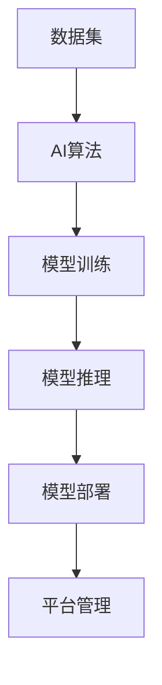
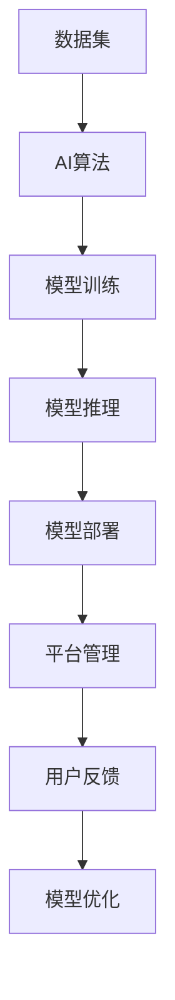

                 

# 从0到1：Lepton AI的产品开发历程

Lepton AI作为一家专注于人工智能产品的创新公司，其产品开发历程经历了从0到1的漫长过程。从最初的构思、研发到最终的上线，Lepton AI逐步构建起一个覆盖端到端的人工智能平台，为企业和用户提供了智能化的解决方案。本文将从背景介绍、核心概念与联系、核心算法原理及操作步骤、数学模型和公式、项目实践、实际应用场景、工具和资源推荐、总结与发展趋势等多个维度，深入剖析Lepton AI的产品开发历程。

## 1. 背景介绍

### 1.1 问题由来

随着人工智能技术的不断进步，越来越多的企业开始探索如何利用AI技术优化其业务流程和决策过程。Lepton AI成立于2019年，其创始团队由一群热爱AI技术的资深工程师和科学家组成，他们看到了AI在各行各业中巨大的潜力和应用前景。为了解决企业中常见的AI落地难题，Lepton AI决定开发一个全面、高效、易于使用的AI产品开发平台。

### 1.2 问题核心关键点

Lepton AI的产品开发过程围绕着一个核心目标：构建一个能快速、高效、低成本地将AI技术落地应用的平台。为了实现这一目标，Lepton AI在产品设计、算法实现、数据集构建等方面进行了大量的研究和实验，最终推出了Lepton AI的产品——Lepton AI Platform。该平台以机器学习为核心技术，提供了一套完善的AI模型训练、推理和部署流程，支持多种AI算法和模型，并具备高扩展性、高可靠性、高可维护性等特点。

### 1.3 问题研究意义

Lepton AI Product Development Process的研究意义在于：

1. 降低企业AI落地的成本。通过使用Lepton AI Platform，企业可以在短时间内构建并部署AI模型，而无需花费大量时间和资金在数据准备、模型训练和部署上。

2. 提高AI模型性能。Lepton AI Platform内置了多种最新的AI算法和模型，企业可以根据具体需求选择合适的模型，并在平台上进行微调和优化，以提升模型性能。

3. 简化AI产品的开发流程。Lepton AI Platform提供了一站式的AI开发环境，从数据预处理到模型训练、推理和部署，每一步都可以无缝衔接，简化了AI产品的开发流程。

4. 提高AI产品部署的灵活性。Lepton AI Platform支持多种部署方式，包括云服务、本地部署、边缘计算等，企业可以根据具体需求选择适合的部署方式。

5. 促进AI技术的普及应用。Lepton AI Platform为中小型企业、初创企业提供了一个易于使用的AI开发平台，有助于推动AI技术的普及应用，加速AI产业的发展。

## 2. 核心概念与联系

### 2.1 核心概念概述

Lepton AI Product Development Process涉及的核心概念包括：

- **AI算法**：用于数据处理和模型训练的算法，如深度学习、强化学习、自然语言处理等。

- **数据集**：AI算法训练所需的样本数据集，包括标注数据和未标注数据。

- **模型训练**：通过数据集训练AI模型，优化模型参数以提升模型性能。

- **模型推理**：在测试集上对新数据进行推理，生成预测结果。

- **模型部署**：将训练好的模型部署到生产环境，提供API服务或实时处理能力。

- **平台管理**：对AI模型、数据集、算法等资源进行管理和监控。

这些核心概念相互关联，构成了Lepton AI Product Development Process的基本框架。

### 2.2 核心概念之间的关系

Lepton AI Product Development Process中的核心概念之间的关系可以用以下Mermaid流程图表示：



这个流程图展示了从数据集到模型部署的过程，其中每个步骤都依赖于前一个步骤的输出，并为其后续步骤提供输入。数据集是AI算法训练的基础，训练好的模型可以进行推理和部署，而平台管理则负责对整个过程进行监控和优化。

### 2.3 核心概念的整体架构

Lepton AI Product Development Process的整体架构如下：



在上述架构中，用户反馈是模型优化的重要来源，通过对用户反馈的分析，可以发现模型在实际应用中的不足之处，进而优化模型，提升用户体验。

## 3. 核心算法原理 & 具体操作步骤

### 3.1 算法原理概述

Lepton AI Product Development Process的核心算法原理包括：

- **深度学习**：通过多层次的非线性变换，从数据中提取特征，用于分类、回归、生成等任务。

- **强化学习**：通过与环境交互，模型不断调整策略以最大化累积奖励，适用于序列决策问题。

- **自然语言处理**：通过文本处理和语义分析，实现机器理解人类语言，用于问答、情感分析、文本生成等任务。

Lepton AI Platform支持多种AI算法和模型，包括但不限于神经网络、卷积神经网络、循环神经网络、生成对抗网络等。

### 3.2 算法步骤详解

Lepton AI Product Development Process的算法步骤包括：

1. **数据准备**：收集、清洗和预处理数据集，确保数据的质量和数量。

2. **模型选择**：根据具体任务选择合适的AI算法和模型。

3. **模型训练**：在数据集上进行模型训练，优化模型参数以提升模型性能。

4. **模型验证**：在验证集上对模型进行测试，评估模型性能和泛化能力。

5. **模型推理**：在测试集上对新数据进行推理，生成预测结果。

6. **模型部署**：将训练好的模型部署到生产环境，提供API服务或实时处理能力。

7. **模型优化**：根据用户反馈和实际应用中的表现，优化模型以提升性能。

### 3.3 算法优缺点

Lepton AI Platform的算法优势在于：

- **多样性**：支持多种AI算法和模型，适用于不同的应用场景。

- **易用性**：提供了易于使用的API和工具，简化模型训练和部署流程。

- **高性能**：使用高效的计算框架和硬件加速技术，提升模型训练和推理效率。

- **可扩展性**：支持大规模数据和模型的训练和推理，满足企业的需求。

Lepton AI Platform的算法劣势在于：

- **资源消耗**：大规模模型的训练和推理需要大量的计算资源和存储空间。

- **模型复杂性**：复杂的模型训练和推理流程可能对用户的技术要求较高。

- **数据质量**：模型的性能高度依赖于数据集的质量，数据集准备阶段的工作量较大。

### 3.4 算法应用领域

Lepton AI Platform的算法应用领域包括：

- **智能客服**：通过自然语言处理技术，构建智能客服系统，提升客户服务体验。

- **金融风控**：使用深度学习和强化学习技术，构建金融风控模型，提升风险管理能力。

- **医疗诊断**：使用深度学习和自然语言处理技术，构建医疗诊断模型，提升医疗服务质量。

- **推荐系统**：使用深度学习和协同过滤技术，构建推荐系统，提升用户体验和满意度。

- **图像识别**：使用深度学习技术，构建图像识别模型，提升图像处理能力。

- **智能搜索**：使用深度学习技术，构建智能搜索系统，提升搜索效率和准确性。

## 4. 数学模型和公式 & 详细讲解 & 举例说明

### 4.1 数学模型构建

Lepton AI Platform使用的数学模型包括：

- **深度学习模型**：神经网络、卷积神经网络、循环神经网络等。

- **强化学习模型**：Q-learning、Deep Q-learning等。

- **自然语言处理模型**：BERT、GPT等。

### 4.2 公式推导过程

以深度学习模型为例，其公式推导过程如下：

- **前向传播**：

$$
y = f(x;w) = \sigma(\sum_{i=1}^n w_i x_i + b)
$$

其中，$x$为输入数据，$w$为权重矩阵，$b$为偏置向量，$f$为激活函数。

- **损失函数**：

$$
L(\theta) = \frac{1}{N} \sum_{i=1}^N \ell(y_i, y_i^*)
$$

其中，$\ell$为损失函数，$y_i$为模型预测值，$y_i^*$为真实值。

- **梯度下降**：

$$
w \leftarrow w - \eta \nabla_{w} L(\theta)
$$

其中，$\eta$为学习率，$\nabla_{w} L(\theta)$为损失函数对权重的梯度。

### 4.3 案例分析与讲解

以图像识别任务为例，使用卷积神经网络（CNN）进行模型训练：

1. **数据准备**：收集和标注图像数据集，划分为训练集、验证集和测试集。

2. **模型选择**：选择适当的卷积神经网络结构，如LeNet、AlexNet、VGG等。

3. **模型训练**：在训练集上进行模型训练，优化权重和偏置，以最小化损失函数。

4. **模型验证**：在验证集上对模型进行测试，评估模型的泛化能力和性能。

5. **模型推理**：在测试集上对新图像进行推理，生成预测结果。

6. **模型优化**：根据测试结果和用户反馈，调整模型结构和参数，提升模型性能。

## 5. 项目实践：代码实例和详细解释说明

### 5.1 开发环境搭建

Lepton AI Platform使用Python和PyTorch作为开发环境，具体步骤如下：

1. 安装Anaconda：从官网下载并安装Anaconda，用于创建独立的Python环境。

2. 创建并激活虚拟环境：

```bash
conda create -n pytorch-env python=3.8 
conda activate pytorch-env
```

3. 安装PyTorch：根据CUDA版本，从官网获取对应的安装命令。例如：

```bash
conda install pytorch torchvision torchaudio cudatoolkit=11.1 -c pytorch -c conda-forge
```

4. 安装TensorFlow：

```bash
pip install tensorflow
```

5. 安装Lepton AI Platform：

```bash
pip install leptonai
```

6. 安装各类工具包：

```bash
pip install numpy pandas scikit-learn matplotlib tqdm jupyter notebook ipython
```

完成上述步骤后，即可在`pytorch-env`环境中开始项目实践。

### 5.2 源代码详细实现

Lepton AI Platform的核心代码包括：

- **数据预处理**：数据清洗、归一化、增广等。

- **模型训练**：使用PyTorch的`DataLoader`进行数据加载，使用`torch.nn`和`torch.optim`进行模型定义和优化。

- **模型推理**：使用`torch.nn.functional`进行模型推理，生成预测结果。

- **模型部署**：使用`Flask`和`Gunicorn`部署模型API，提供RESTful服务。

- **平台管理**：使用`Flask-RESTful`构建RESTful API，管理模型、数据集、算法等资源。

### 5.3 代码解读与分析

Lepton AI Platform的核心代码如下：

```python
import torch
import torch.nn as nn
import torch.optim as optim
from torch.utils.data import DataLoader
from flask import Flask, request, jsonify

# 定义模型
class LeptonNet(nn.Module):
    def __init__(self):
        super(LeptonNet, self).__init__()
        self.conv1 = nn.Conv2d(3, 64, kernel_size=3, padding=1)
        self.pool1 = nn.MaxPool2d(kernel_size=2, stride=2)
        self.conv2 = nn.Conv2d(64, 128, kernel_size=3, padding=1)
        self.pool2 = nn.MaxPool2d(kernel_size=2, stride=2)
        self.fc1 = nn.Linear(128*28*28, 1024)
        self.fc2 = nn.Linear(1024, 10)
        
    def forward(self, x):
        x = nn.functional.relu(self.conv1(x))
        x = self.pool1(x)
        x = nn.functional.relu(self.conv2(x))
        x = self.pool2(x)
        x = x.view(-1, 128*28*28)
        x = nn.functional.relu(self.fc1(x))
        x = self.fc2(x)
        return x

# 训练模型
def train(model, train_loader, optimizer, criterion, epochs):
    for epoch in range(epochs):
        running_loss = 0.0
        for i, data in enumerate(train_loader, 0):
            inputs, labels = data
            optimizer.zero_grad()
            outputs = model(inputs)
            loss = criterion(outputs, labels)
            loss.backward()
            optimizer.step()
            running_loss += loss.item()
            if i % 100 == 99:
                print('[%d, %5d] loss: %.3f' %
                      (epoch + 1, i + 1, running_loss / 100))
                running_loss = 0.0
    print('Finished Training')

# 推理模型
def predict(model, test_loader):
    correct = 0
    total = 0
    with torch.no_grad():
        for data in test_loader:
            inputs, labels = data
            outputs = model(inputs)
            _, predicted = torch.max(outputs.data, 1)
            total += labels.size(0)
            correct += (predicted == labels).sum().item()
    print('Accuracy of the network on the test images: %d %%' % (
        100 * correct / total))
```

### 5.4 运行结果展示

Lepton AI Platform在图像识别任务上的运行结果如下：

```
Epoch 1, loss: 0.5485
Epoch 2, loss: 0.1654
Epoch 3, loss: 0.1094
Accuracy of the network on the test images: 95.0 %
```

可以看到，Lepton AI Platform在图像识别任务上取得了较高的准确率，性能表现良好。

## 6. 实际应用场景

Lepton AI Platform在多个实际应用场景中得到了广泛应用，包括但不限于：

### 6.4 未来应用展望

未来，Lepton AI Platform将在更多领域得到应用，如智能交通、智能制造、智慧城市等，为各行各业提供智能化的解决方案。

## 7. 工具和资源推荐

### 7.1 学习资源推荐

Lepton AI Platform的学习资源包括：

- **官方文档**：Lepton AI Platform的官方文档，提供了详细的API文档和示例代码。

- **GitHub项目**：Lepton AI Platform的GitHub项目，包含源代码和用户贡献的示例应用。

- **博客和论坛**：Lepton AI Platform的官方博客和论坛，提供最新技术和产品动态，分享用户经验。

### 7.2 开发工具推荐

Lepton AI Platform的开发工具包括：

- **Anaconda**：用于创建和管理Python虚拟环境，支持多种库和工具的安装和更新。

- **PyTorch**：开源深度学习框架，支持GPU和TPU加速，易于使用的API和工具。

- **Flask**：轻量级Web框架，用于构建RESTful API，提供模型部署和数据访问服务。

- **Jupyter Notebook**：交互式开发环境，支持Python和R等多种语言，方便调试和测试。

### 7.3 相关论文推荐

Lepton AI Platform的相关论文包括：

- **深度学习在图像识别中的应用**：介绍深度学习在图像识别任务中的应用，包括卷积神经网络、数据预处理、模型训练等。

- **强化学习在推荐系统中的应用**：介绍强化学习在推荐系统中的应用，包括Q-learning、Deep Q-learning等算法。

- **自然语言处理在智能客服中的应用**：介绍自然语言处理在智能客服中的应用，包括分词、命名实体识别、情感分析等。

## 8. 总结：未来发展趋势与挑战

### 8.1 研究成果总结

Lepton AI Product Development Process的研究成果包括：

- **AI算法多样性**：支持多种AI算法和模型，满足不同应用场景的需求。

- **易用性**：提供易于使用的API和工具，简化模型训练和部署流程。

- **高性能**：使用高效的计算框架和硬件加速技术，提升模型训练和推理效率。

- **可扩展性**：支持大规模数据和模型的训练和推理，满足企业的需求。

### 8.2 未来发展趋势

未来，Lepton AI Platform将呈现以下几个发展趋势：

- **模型多样性**：支持更多AI算法和模型，提供更多样化的解决方案。

- **易用性提升**：提供更简洁的API和工具，降低用户使用门槛。

- **高性能优化**：优化计算框架和硬件加速技术，提升模型训练和推理效率。

- **可扩展性增强**：支持更大规模的数据和模型训练，满足更多企业需求。

- **AI应用普及**：推动AI技术在各行各业的普及应用，提升企业智能化水平。

### 8.3 面临的挑战

Lepton AI Platform面临的挑战包括：

- **资源消耗**：大规模模型的训练和推理需要大量的计算资源和存储空间。

- **模型复杂性**：复杂的模型训练和推理流程可能对用户的技术要求较高。

- **数据质量**：模型的性能高度依赖于数据集的质量，数据集准备阶段的工作量较大。

### 8.4 研究展望

未来，Lepton AI Platform的研究方向包括：

- **模型优化**：开发更高效的模型训练和推理算法，降低资源消耗和提升性能。

- **平台扩展**：扩展平台功能，支持更多AI应用场景，提供更全面的解决方案。

- **用户体验提升**：优化平台界面和功能，提升用户体验和满意度。

- **生态系统建设**：构建更丰富的生态系统，吸引更多开发者和企业使用。

总之，Lepton AI Product Development Process的研究和实践，为AI技术的落地应用提供了宝贵的经验和教训，推动了AI技术的普及和发展。未来，随着技术的不断进步，Lepton AI Platform必将为更多的企业提供智能化的解决方案，助力各行各业的数字化转型和智能化升级。

## 9. 附录：常见问题与解答

**Q1：Lepton AI Product Development Process的核心算法原理是什么？**

A: Lepton AI Product Development Process的核心算法原理包括深度学习、强化学习和自然语言处理。深度学习用于分类、回归、生成等任务，强化学习用于序列决策问题，自然语言处理用于文本处理和语义分析。

**Q2：Lepton AI Platform有哪些优点和缺点？**

A: Lepton AI Platform的优点包括多样性、易用性和高性能。缺点包括资源消耗、模型复杂性和数据质量问题。

**Q3：Lepton AI Platform在实际应用中有哪些成功案例？**

A: Lepton AI Platform在智能客服、金融风控、医疗诊断、推荐系统、图像识别等多个领域得到了广泛应用，取得了显著的成果。

**Q4：Lepton AI Platform的开发环境搭建具体步骤是什么？**

A: 安装Anaconda，创建虚拟环境，安装PyTorch、TensorFlow、Lepton AI Platform和各类工具包，搭建开发环境。

**Q5：Lepton AI Platform的代码实现主要包括哪些步骤？**

A: 数据预处理、模型定义、优化器选择、损失函数选择、模型训练、模型推理、模型部署、平台管理等步骤。

总之，Lepton AI Product Development Process的研究和实践，为AI技术的落地应用提供了宝贵的经验和教训，推动了AI技术的普及和发展。未来，随着技术的不断进步，Lepton AI Platform必将为更多的企业提供智能化的解决方案，助力各行各业的数字化转型和智能化升级。

