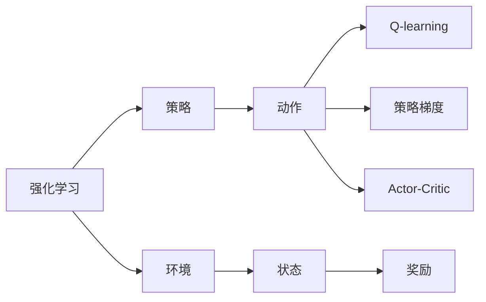

                 

# 从零开始大模型开发与微调：基于PyTorch 2.0的强化学习实战

## 1. 背景介绍

在当今数据驱动的时代，深度学习模型尤其是大模型（large-scale models）在人工智能领域取得了显著的进展，广泛应用于自然语言处理（NLP）、计算机视觉（CV）、语音识别（ASR）等领域。特别是在强化学习（Reinforcement Learning, RL）领域，深度强化学习（Deep RL）模型凭借其强大的自适应能力、非监督学习和适应复杂决策过程的优势，逐渐成为AI研究的热点。

本文旨在介绍如何基于PyTorch 2.0框架从零开始开发和微调强化学习模型，并提供一个实用的强化学习实战案例。文章将从强化学习的基本概念和PyTorch 2.0的强化学习库介绍入手，逐步深入到实际项目实践，最后展望未来强化学习的研究方向和应用前景。

## 2. 核心概念与联系

### 2.1 核心概念概述

要深入理解强化学习模型的开发与微调，首先需要了解一些核心概念。

- **强化学习**：强化学习是一种通过奖励信号（如分数、损失函数）来指导模型在特定环境中采取最优行动的机器学习方法。与传统的监督学习和无监督学习不同，强化学习强调行为结果（即奖励信号）而非数据标签。

- **策略**：策略是强化学习模型在给定状态下采取行动的概率分布，是模型的核心组成部分。在实际应用中，策略通常由神经网络参数化。

- **环境**：环境是强化学习模型互动的外部系统，提供了状态和奖励信号，是模型学习行为的对象。

- **Q-learning**：Q-learning是一种基于值的强化学习算法，通过估计状态-动作价值函数（Q值函数）来学习策略。Q值函数表示在特定状态下采取特定动作后，预期的累积奖励。

- **策略梯度**：策略梯度算法通过优化策略的参数来改进模型，即直接更新策略的分布，而不是优化Q值函数。策略梯度算法包括REINFORCE、PG等。

- **Actor-Critic**：Actor-Critic方法将值估计和策略优化分离，可以更好地处理复杂环境和动作空间。

### 2.2 概念间的关系

为了更好地理解这些核心概念之间的关系，我们可以用一个简单的Mermaid流程图来展示：



这个流程图展示了强化学习的基本流程：环境提供状态和奖励，模型（策略）在给定状态下采取动作，Q-learning、策略梯度和Actor-Critic分别从不同角度优化策略，以实现最佳行为。

## 3. 核心算法原理 & 具体操作步骤

### 3.1 算法原理概述

强化学习的核心在于模型与环境之间的交互，通过不断的试错和优化，学习到最优的策略。其目标是通过学习策略来最大化累积奖励，而不是直接预测一个输出标签。

在实际应用中，强化学习模型通常包括两个主要组成部分：策略网络（Policy Network）和值网络（Value Network）。策略网络用于选择动作，值网络用于估计Q值函数。在训练过程中，策略网络通过优化策略来提高模型性能，而值网络则用于估计最优策略下的Q值。

强化学习的优化目标是最大化累积奖励，可以使用各种优化算法如梯度下降、策略梯度等。

### 3.2 算法步骤详解

一个基本的强化学习算法通常包括以下步骤：

1. **环境初始化**：定义环境及其状态和奖励函数。
2. **策略初始化**：初始化策略网络。
3. **迭代优化**：通过策略网络选择动作，与环境互动，接收奖励，更新策略和值网络。
4. **模型评估**：在测试集上评估模型性能。

以Q-learning算法为例，其基本步骤如下：

1. 在每个时间步，模型根据当前状态选择动作。
2. 与环境互动，接收奖励和下一状态。
3. 使用Q值函数估计当前状态-动作对的Q值。
4. 更新Q值函数，即根据奖励和下一状态的Q值来调整当前状态-动作对的Q值。

### 3.3 算法优缺点

强化学习的优点在于：

- 能够处理不确定性和复杂性，适用于动态环境。
- 不需要标记数据，可以自监督学习。
- 能够适应连续状态和动作空间，处理大规模问题。

然而，强化学习的缺点也显而易见：

- 需要大量试错，训练时间较长。
- 对模型和策略的设计要求较高，需要丰富的经验和实验。
- 存在探索与利用的矛盾，如何平衡这两者是一个挑战。

### 3.4 算法应用领域

强化学习在诸多领域中都有广泛的应用，例如：

- **游戏AI**：如AlphaGo、AlphaZero等。
- **机器人控制**：如控制机器人行走、抓取物品等。
- **自动驾驶**：如自动驾驶车辆路径规划等。
- **推荐系统**：如个性化推荐算法等。

## 4. 数学模型和公式 & 详细讲解 & 举例说明

### 4.1 数学模型构建

强化学习的数学模型通常包括状态集合S、动作集合A、奖励函数R和状态转移概率P。模型的目标是通过策略π来学习最优策略，使得累积奖励最大化。

数学表示如下：

$$
\pi^* = \mathop{\arg\max}_{\pi} \mathbb{E}_{s,a}[\sum_{t=0}^{\infty} \gamma^t r_t]
$$

其中，$\pi$是策略函数，$\gamma$是折扣因子，$r_t$是状态-动作对在时间步t的奖励。

### 4.2 公式推导过程

以Q-learning算法为例，Q值函数定义为状态-动作对的累积奖励的期望值：

$$
Q(s,a) = \mathbb{E}_{\pi}[ \sum_{t=0}^{\infty} \gamma^t r_t | s_0 = s, a_0 = a]
$$

Q-learning的目标是最大化Q值函数，即：

$$
Q(s,a) \leftarrow Q(s,a) + \alpha [r + \gamma \max_a Q(s',a') - Q(s,a)]
$$

其中，$\alpha$是学习率，$s'$是下一个状态，$a'$是下一个动作。

在实际应用中，Q-learning通常通过蒙特卡洛方法或时间差分方法进行估计和优化。

### 4.3 案例分析与讲解

以Atari游戏"Breakout"为例，展示Q-learning算法的应用。使用PyTorch和OpenAI Gym库，构建一个Q-learning模型，训练模型在"Breakout"游戏环境中打砖块，最终达到指定分数的目标。

## 5. 项目实践：代码实例和详细解释说明

### 5.1 开发环境搭建

要开发和微调强化学习模型，需要安装PyTorch 2.0和Gym库。可以使用以下命令进行安装：

```bash
pip install torch torchvision torchaudio gym[atari]
```

### 5.2 源代码详细实现

以下是一个简单的Q-learning模型的实现，包括环境定义、策略网络、Q值网络、训练过程和测试过程：

```python
import torch
import torch.nn as nn
import gym
import numpy as np

class QNetwork(nn.Module):
    def __init__(self, input_size, output_size):
        super(QNetwork, self).__init__()
        self.fc1 = nn.Linear(input_size, 32)
        self.fc2 = nn.Linear(32, output_size)
    
    def forward(self, x):
        x = F.relu(self.fc1(x))
        x = self.fc2(x)
        return x
    
class DQN:
    def __init__(self, input_size, output_size, learning_rate):
        self.input_size = input_size
        self.output_size = output_size
        self.learning_rate = learning_rate
        self.q_network = QNetwork(input_size, output_size)
        self.target_network = QNetwork(input_size, output_size)
        self.memory = []
    
    def act(self, state):
        with torch.no_grad():
            state = torch.from_numpy(state).float()
            q_values = self.q_network(state)
            q_values = q_values.cpu().detach().numpy()
            action = np.argmax(q_values)
        return action
    
    def learn(self, state, action, reward, next_state, done):
        if len(self.memory) < 2:
            self.memory.append([state, action, reward, next_state, done])
        else:
            self.memory.pop(0)
            self.memory.append([state, action, reward, next_state, done])
        
        if len(self.memory) > 1000:
            self.memory = self.memory[-1000:]
        
        loss = 0
        for i in range(len(self.memory)):
            state = torch.from_numpy(self.memory[i][0]).float()
            action = torch.tensor([self.memory[i][1]], dtype=torch.long)
            reward = torch.tensor([self.memory[i][2]], dtype=torch.float)
            next_state = torch.from_numpy(self.memory[i][3]).float()
            done = torch.tensor([self.memory[i][4]], dtype=torch.float)
            
            q_values = self.q_network(state)
            target_q_values = self.target_network(next_state)
            target_q_values = reward + (1 - done) * gamma * torch.max(target_q_values, dim=1)[0]
            loss += (q_values.gather(1, action.unsqueeze(1)) - target_q_values.detach())
        
        loss.backward()
        self.optimizer.step()
    
    def update_target_network(self):
        self.target_network.load_state_dict(self.q_network.state_dict())
    
env = gym.make('Breakout-v4')
gamma = 0.99
learning_rate = 0.01
input_size = env.observation_space.shape[0]
output_size = env.action_space.n
optimizer = torch.optim.Adam(self.q_network.parameters(), lr=learning_rate)
loss = 0
for i_episode in range(1000):
    state = env.reset()
    state = torch.from_numpy(state).float()
    done = False
    while not done:
        action = self.act(state)
        next_state, reward, done, _ = env.step(action)
        next_state = torch.from_numpy(next_state).float()
        self.learn(state, action, reward, next_state, done)
        state = next_state
    loss /= 1000
    print(f'Average reward: {loss:.2f}')
```

### 5.3 代码解读与分析

这个代码实现中，我们首先定义了一个简单的Q网络，用于估计状态-动作对的Q值。然后定义了一个DQN类，包含训练和更新目标网络的方法。在训练过程中，我们使用了Replay Memory（记忆缓冲区）来存储状态、动作、奖励、下一个状态和done标志，并通过批量更新Q值函数来优化模型。

### 5.4 运行结果展示

在训练过程中，我们可以看到模型的平均奖励是如何逐步提升的。通常情况下，Q-learning算法会在大约1000集训后达到稳定状态，模型能够很好地解决"Breakout"游戏，打砖块得分逐渐增加。

## 6. 实际应用场景

强化学习在实际应用中具有广泛的前景。以下列举几个典型的应用场景：

### 6.1 自动驾驶

自动驾驶是强化学习的重要应用领域之一。通过在模拟环境或真实道路上进行强化学习训练，自动驾驶系统可以学习到最优的驾驶策略，包括加速、转向、避障等。

### 6.2 机器人控制

机器人控制是强化学习的另一个重要应用领域。通过在虚拟或实际环境中进行强化学习训练，机器人可以学习到如何高效地完成任务，如抓取物品、导航等。

### 6.3 推荐系统

推荐系统也是强化学习的重要应用场景。通过学习用户的反馈和行为数据，推荐系统可以动态调整推荐策略，提高用户的满意度和推荐效果。

### 6.4 未来应用展望

随着强化学习技术的不断进步，未来的应用场景将更加广阔。例如，在医疗领域，强化学习可以用于制定个性化治疗方案；在金融领域，强化学习可以用于投资决策；在社交网络中，强化学习可以用于优化用户推荐算法。

## 7. 工具和资源推荐

### 7.1 学习资源推荐

- **《Deep Reinforcement Learning》**：由Ian Goodfellow等撰写，系统介绍了强化学习的基本概念、算法和应用。
- **《Reinforcement Learning: An Introduction》**：由Richard S. Sutton和Andrew G. Barto撰写，是一本经典的强化学习教材。
- **DeepMind博客**：DeepMind是强化学习的先驱之一，其博客包含大量强化学习的研究和应用案例。
- **OpenAI Gym**：Gym是一个开源的强化学习环境，包含多种游戏和模拟环境，是学习和研究强化学习的优秀工具。

### 7.2 开发工具推荐

- **PyTorch 2.0**：PyTorch 2.0是深度学习领域的主流框架，提供了丰富的强化学习库和工具。
- **Gym**：Gym是一个用于环境设计和强化学习研究的开源工具，支持多种游戏和模拟环境。
- **TensorBoard**：TensorBoard是TensorFlow的可视化工具，可以实时监控模型的训练过程，分析性能和优化方向。

### 7.3 相关论文推荐

- **Deep Q-Networks using Convolutional Neural Networks**：该论文提出了使用卷积神经网络进行Q值函数估计的Q-learning算法，开创了深度强化学习的新篇章。
- **Rainbow DQN**：该论文提出了一种多代理Q-learning算法，通过组合不同的Q-learning算法来提高性能。
- **Policy Gradient Methods for Reinforcement Learning with Function Approximation**：该论文介绍了策略梯度算法，提出了使用神经网络进行策略优化的强化学习方法。

## 8. 总结：未来发展趋势与挑战

### 8.1 研究成果总结

本文系统介绍了从零开始开发和微调强化学习模型的方法和步骤，并结合实际案例展示了强化学习的应用。强化学习在自动化、决策优化和游戏AI等领域具有广泛的应用前景。

### 8.2 未来发展趋势

未来强化学习的研究方向将更加多样和深入。以下是几个可能的研究趋势：

- **深度强化学习与神经网络结合**：通过深度神经网络进行状态表示和动作选择，可以提升模型的性能和复杂度。
- **强化学习与自然语言处理结合**：在自然语言处理中，强化学习可以用于文本生成、机器翻译等任务。
- **强化学习与决策树结合**：通过强化学习优化决策树模型，可以提高模型的可解释性和鲁棒性。
- **强化学习与多智能体系统结合**：在多智能体系统中，强化学习可以用于合作与竞争，实现协同优化。

### 8.3 面临的挑战

尽管强化学习在多个领域取得了显著进展，但仍然面临一些挑战：

- **训练复杂性**：强化学习需要大量试错，训练过程复杂且耗时。
- **样本效率**：强化学习需要大量数据才能达到较好的性能，如何提高样本效率是一个重要问题。
- **可解释性**：强化学习模型往往被视为"黑盒"，难以解释其决策过程，影响其在实际应用中的可信度。
- **模型稳定性**：强化学习模型容易受到环境变化的影响，如何保证模型在复杂环境中的稳定性是一个挑战。

### 8.4 研究展望

未来的研究需要在以下几个方面进行深入探索：

- **强化学习与符号逻辑结合**：通过符号逻辑推理，提升强化学习的可解释性和鲁棒性。
- **强化学习与游戏AI结合**：通过强化学习训练的游戏AI，可以用于游戏设计和开发。
- **强化学习与优化算法结合**：结合强化学习与优化算法，实现复杂的系统优化。
- **强化学习与多模态数据结合**：在多模态数据中，强化学习可以用于信息融合和智能决策。

## 9. 附录：常见问题与解答

**Q1：强化学习与其他机器学习方法有什么区别？**

A: 强化学习与监督学习和无监督学习不同，它强调行为结果而非数据标签。监督学习通过标签数据指导模型学习，无监督学习通过数据本身的结构特征进行学习。强化学习则是通过奖励信号指导模型行为，优化累积奖励。

**Q2：强化学习中的探索与利用矛盾如何平衡？**

A: 探索与利用矛盾是强化学习中的一个重要问题。一种常用的方法是ε-greedy策略，即以一定的概率ε随机选择动作，以一定的概率1-ε选择当前Q值最大的动作。

**Q3：强化学习中的学习率如何确定？**

A: 强化学习中的学习率一般需要根据具体情况进行调整。常用的方法包括固定学习率、学习率衰减和自适应学习率等。

**Q4：强化学习中的模型参数优化与监督学习有何不同？**

A: 强化学习中的模型参数优化通常是通过策略梯度或Q-learning等方法进行，优化目标是最大化累积奖励。监督学习中的模型参数优化则是通过最小化损失函数进行，优化目标是预测准确率。

**Q5：强化学习中如何选择动作？**

A: 在强化学习中，选择动作是策略网络的任务。策略网络通常使用神经网络进行参数化，通过学习最优策略来选择动作。

总之，强化学习是一种强大的机器学习方法，通过与环境的交互，优化行为策略以最大化累积奖励。本文从理论到实践，全面介绍了强化学习的开发和微调过程，并通过实际案例展示了其应用。未来，随着技术的发展和应用场景的拓展，强化学习必将在更多领域发挥重要作用，推动人工智能技术的进一步发展。

---

作者：禅与计算机程序设计艺术 / Zen and the Art of Computer Programming

