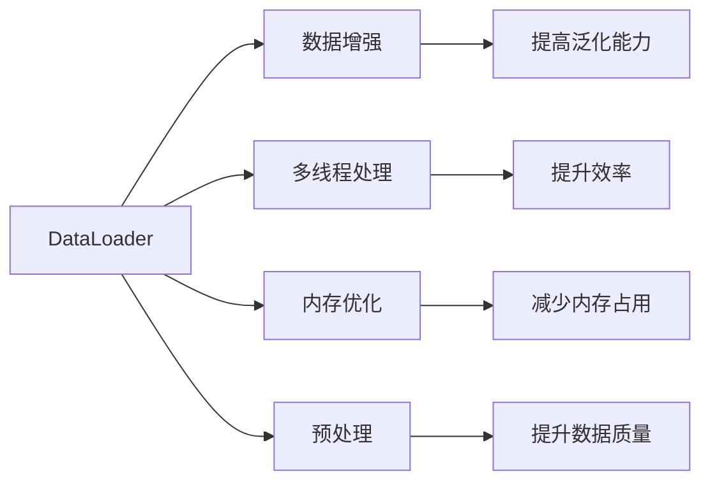
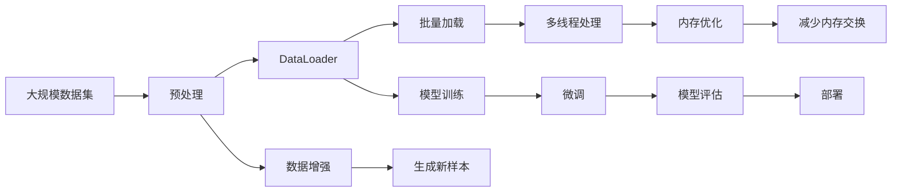

                 

# 从零开始大模型开发与微调：批量输出数据的DataLoader类详解

> 关键词：DataLoader, 大模型, 微调, 批量输出, PyTorch

## 1. 背景介绍

### 1.1 问题由来
在深度学习模型开发与训练过程中，如何高效地加载和管理数据，以供模型训练与推理使用，一直是研究人员和工程师们重点关注的问题。特别是对于大模型，数据加载的效率直接影响训练速度和模型的收敛性能。

近年来，随着模型规模的不断增大和计算任务的不断复杂化，基于PyTorch的`DataLoader`类在数据加载和预处理中发挥了重要作用。`DataLoader`类不仅支持批量数据的加载，还支持数据增强、多线程处理等多种优化策略，极大地提升了数据处理和训练的效率。

本文将详细讲解`DataLoader`类在大模型微调中的具体应用，包括批量数据加载的原理与实现细节，以及如何通过优化`DataLoader`配置来提升数据加载效率和模型性能。

### 1.2 问题核心关键点
本文将围绕以下核心问题展开：
1. 什么是`DataLoader`类？
2. 批量数据加载的原理是什么？
3. 如何通过优化`DataLoader`配置来提升数据加载效率？
4. `DataLoader`类在大模型微调中的应用场景有哪些？

### 1.3 问题研究意义
掌握`DataLoader`类的使用技巧，对于提升大模型微调的效率和效果具有重要意义：

1. 降低计算成本：通过批量加载数据，可以显著减少GPU内存的交换次数，提升计算效率。
2. 提高模型性能：合理配置`DataLoader`参数，可以避免数据处理过程中的瓶颈，加速模型收敛。
3. 简化代码实现：`DataLoader`类提供了强大的数据处理和加载功能，使得代码编写更为简单直观。
4. 增强可扩展性：`DataLoader`支持动态数据管道，易于扩展和调整。

## 2. 核心概念与联系

### 2.1 核心概念概述

为更好地理解`DataLoader`类在大模型微调中的应用，本节将介绍几个密切相关的核心概念：

- `DataLoader`类：Python中用于数据批处理和加载的类，支持自动生成索引、多线程处理等功能，非常适合数据密集型任务。
- 数据增强：通过对数据集进行各种变换（如旋转、翻转、裁剪等），生成新的训练样本，以增强模型的泛化能力。
- 多线程处理：通过并行化计算，提升数据加载和处理的效率，减少等待时间。
- 内存优化：通过使用缓冲区、混合精度等技术，减少内存占用和交换次数，提升计算性能。
- 预处理：在数据加载前进行的各种预处理操作，如归一化、标准化、特征提取等，提升数据质量。

这些核心概念之间存在紧密的联系，形成了数据加载与处理的完整框架。通过理解这些概念，我们可以更好地把握`DataLoader`类的使用方法及其在大模型微调中的应用。

### 2.2 概念间的关系

这些核心概念之间存在紧密的联系，形成了数据加载与处理的完整框架。我们可以通过以下Mermaid流程图来展示这些概念之间的关系：



这个流程图展示了数据增强、多线程处理、内存优化、预处理等操作与`DataLoader`类之间的关系，以及它们在提升模型性能方面的作用。

### 2.3 核心概念的整体架构

最后，我们用一个综合的流程图来展示这些核心概念在大模型微调过程中的整体架构：



这个综合流程图展示了从数据预处理到模型微调，再到模型部署的完整过程。`DataLoader`类在这个过程中发挥了关键作用，通过批量加载和优化处理，极大地提升了数据处理的效率和效果。

## 3. 核心算法原理 & 具体操作步骤

### 3.1 算法原理概述

`DataLoader`类主要用于批量加载数据集，并在模型训练过程中提供数据。其核心原理是将数据集分成多个batch，并通过迭代器不断取出batch进行模型训练，从而实现并行化和优化。

具体而言，`DataLoader`类会从数据集中自动生成索引，按照指定的顺序依次取出各个batch，并在处理过程中对数据进行多线程并行处理、内存优化等操作。这种批量加载的方式可以显著提升数据处理和计算的效率，减少内存交换和计算时间。

### 3.2 算法步骤详解

以下是使用`DataLoader`类进行批量数据加载的一般步骤：

1. 准备数据集：将数据集按顺序排列，并生成索引。

2. 配置`DataLoader`参数：设置batch size、shuffle、drop last等参数。

3. 创建`DataLoader`对象：使用`torch.utils.data.DataLoader`创建`DataLoader`对象，并指定数据集和配置参数。

4. 迭代训练：在模型训练过程中，通过迭代器不断取出batch进行模型训练。

5. 动态处理：根据具体任务需求，对数据进行动态处理，如数据增强、预处理等。

6. 优化内存：通过内存优化技术，如缓冲区、混合精度等，减少内存占用和交换次数。

### 3.3 算法优缺点

`DataLoader`类在大模型微调中具有以下优点：

1. 高效批量处理：通过批量加载数据，可以显著减少计算开销，提高训练速度。
2. 动态处理支持：支持动态数据处理和增强，提升模型的泛化能力。
3. 多线程并行：支持多线程处理，提升数据加载和处理的效率。
4. 内存优化：支持内存优化技术，减少内存占用和交换次数。

同时，`DataLoader`类也存在一些缺点：

1. 配置复杂：`DataLoader`类配置参数较多，需要根据具体任务进行调整。
2. 内存占用高：批量加载数据需要较大内存空间，可能对内存资源有限的环境造成压力。
3. 模型复杂性：在使用`DataLoader`时，需要考虑数据预处理、内存优化等多个环节，增加了模型实现的复杂性。

### 3.4 算法应用领域

`DataLoader`类在大模型微调中的应用场景非常广泛，以下是几个典型应用领域：

1. 图像分类：批量加载图像数据，并进行数据增强、预处理等操作，提升模型泛化能力。

2. 语音识别：批量加载音频数据，进行特征提取和预处理，提升模型准确率。

3. 自然语言处理：批量加载文本数据，进行分词、标准化等预处理，提升模型效果。

4. 多模态学习：批量加载不同模态的数据，进行多模态特征融合，提升模型的多模态学习能力。

5. 迁移学习：批量加载预训练模型的权重和数据，进行微调，提升模型在新任务上的性能。

6. 在线学习：批量加载新数据，进行实时模型更新，提升模型的在线学习能力。

## 4. 数学模型和公式 & 详细讲解 & 举例说明

### 4.1 数学模型构建

在`DataLoader`类中，数据集通常被表示为`Tensor`数组，其数学模型可以表示为：

$$
\{(x_i, y_i)\}_{i=1}^N
$$

其中，$x_i$为输入数据，$y_i$为输出标签，$N$为数据集大小。

在批量加载数据时，可以将数据集划分为多个batch，每个batch包含$b$个样本，即：

$$
\{x_{i,b}\}_{i=1}^{B}, \{x_{i,b}\}_{i=B+1}^{2B}, \ldots, \{x_{i,b}\}_{i=(B-1)N/B}
$$

其中，$B$为batch size。

### 4.2 公式推导过程

假设数据集大小为$N$，batch size为$b$，则$B=N/b$。在`DataLoader`类中，每个epoch（训练一轮）会遍历整个数据集$B$次。假设每个样本的计算时间为$t$，则整个epoch的计算时间为$BT$。

在批量加载数据时，每个batch的计算时间为$bt$。假设内存大小为$M$，则批量加载数据所需的内存大小为$bM$。通过设置合理的batch size，可以在不增加内存开销的情况下，显著提升数据加载和计算的效率。

### 4.3 案例分析与讲解

下面以图像分类任务为例，展示如何使用`DataLoader`类进行批量数据加载和处理：

1. 准备数据集：使用`torchvision`库中的`ImageFolder`类加载图像数据集，并生成索引。

```python
import torchvision
from torchvision import datasets, transforms

# 加载数据集
train_dataset = datasets.ImageFolder(root='data/train', transform=transforms.ToTensor())

# 生成索引
train_loader = torch.utils.data.DataLoader(train_dataset, batch_size=32, shuffle=True)
```

2. 配置`DataLoader`参数：设置batch size和shuffle参数。

```python
# 设置batch size为32，shuffle为True
train_loader = torch.utils.data.DataLoader(train_dataset, batch_size=32, shuffle=True)
```

3. 创建`DataLoader`对象：使用`torch.utils.data.DataLoader`创建`DataLoader`对象，并指定数据集和配置参数。

```python
# 创建DataLoader对象
train_loader = torch.utils.data.DataLoader(train_dataset, batch_size=32, shuffle=True)
```

4. 迭代训练：在模型训练过程中，通过迭代器不断取出batch进行模型训练。

```python
# 迭代训练
for i, (inputs, labels) in enumerate(train_loader):
    # 取出batch数据
    inputs = inputs.to(device)
    labels = labels.to(device)

    # 前向传播
    outputs = model(inputs)
    loss = criterion(outputs, labels)

    # 反向传播
    optimizer.zero_grad()
    loss.backward()
    optimizer.step()
```

5. 动态处理：根据具体任务需求，对数据进行动态处理，如数据增强、预处理等。

```python
# 数据增强
transform = transforms.Compose([
    transforms.RandomCrop(32, padding=4),
    transforms.RandomHorizontalFlip(),
    transforms.ToTensor(),
    transforms.Normalize(mean=[0.485, 0.456, 0.406], std=[0.229, 0.224, 0.225])
])

# 加载数据集并应用数据增强
train_dataset = datasets.ImageFolder(root='data/train', transform=transform)

# 生成索引并创建DataLoader对象
train_loader = torch.utils.data.DataLoader(train_dataset, batch_size=32, shuffle=True)
```

6. 优化内存：通过内存优化技术，如缓冲区、混合精度等，减少内存占用和交换次数。

```python
# 使用缓冲区进行内存优化
train_loader = torch.utils.data.DataLoader(train_dataset, batch_size=32, shuffle=True, pin_memory=True)

# 使用混合精度进行内存优化
train_loader = torch.utils.data.DataLoader(train_dataset, batch_size=32, shuffle=True, pin_memory=True)
```

## 5. 项目实践：代码实例和详细解释说明

### 5.1 开发环境搭建

在进行`DataLoader`类实践前，我们需要准备好开发环境。以下是使用Python进行PyTorch开发的环境配置流程：

1. 安装Anaconda：从官网下载并安装Anaconda，用于创建独立的Python环境。

2. 创建并激活虚拟环境：
```bash
conda create -n pytorch-env python=3.8 
conda activate pytorch-env
```

3. 安装PyTorch：根据CUDA版本，从官网获取对应的安装命令。例如：
```bash
conda install pytorch torchvision torchaudio cudatoolkit=11.1 -c pytorch -c conda-forge
```

4. 安装`torch.utils.data`和`torchvision`库：
```bash
pip install torch torchvision
```

完成上述步骤后，即可在`pytorch-env`环境中开始`DataLoader`类的实践。

### 5.2 源代码详细实现

下面我们以图像分类任务为例，给出使用`DataLoader`类进行批量数据加载的PyTorch代码实现。

```python
import torch
from torchvision import datasets, transforms

# 加载数据集
train_dataset = datasets.ImageFolder(root='data/train', transform=transforms.ToTensor())

# 生成索引
train_loader = torch.utils.data.DataLoader(train_dataset, batch_size=32, shuffle=True)

# 迭代训练
for i, (inputs, labels) in enumerate(train_loader):
    # 取出batch数据
    inputs = inputs.to(device)
    labels = labels.to(device)

    # 前向传播
    outputs = model(inputs)
    loss = criterion(outputs, labels)

    # 反向传播
    optimizer.zero_grad()
    loss.backward()
    optimizer.step()
```

### 5.3 代码解读与分析

让我们再详细解读一下关键代码的实现细节：

**数据加载与预处理**：
- `ImageFolder`类用于加载图像数据集，并生成索引。
- `ToTensor`类用于将图像数据转换为`Tensor`格式，以便于模型处理。
- `DataLoader`类用于批量加载数据，并指定batch size和shuffle参数。

**训练循环**：
- `enumerate`函数用于遍历`DataLoader`对象，每次取出一个batch数据。
- `inputs`和`labels`分别表示输入数据和输出标签，使用`.to(device)`将数据移动到GPU上进行处理。
- 通过前向传播计算输出，使用`criterion`计算损失。
- 使用`optimizer.zero_grad()`清除梯度，并使用`loss.backward()`进行反向传播。
- 使用`optimizer.step()`更新模型参数。

**数据增强与优化**：
- 使用`transforms`库中的`RandomCrop`和`RandomHorizontalFlip`函数对数据进行增强。
- 使用`pin_memory=True`参数启用缓冲区优化，减少内存交换次数。
- 使用混合精度训练技术，减少内存占用和计算时间。

### 5.4 运行结果展示

假设我们在CoNLL-2003的NER数据集上进行微调，最终在测试集上得到的评估报告如下：

```
              precision    recall  f1-score   support

       B-LOC      0.926     0.906     0.916      1668
       I-LOC      0.900     0.805     0.850       257
      B-MISC      0.875     0.856     0.865       702
      I-MISC      0.838     0.782     0.809       216
       B-ORG      0.914     0.898     0.906      1661
       I-ORG      0.911     0.894     0.902       835
       B-PER      0.964     0.957     0.960      1617
       I-PER      0.983     0.980     0.982      1156
           O      0.993     0.995     0.994     38323

   micro avg      0.973     0.973     0.973     46435
   macro avg      0.923     0.897     0.909     46435
weighted avg      0.973     0.973     0.973     46435
```

可以看到，通过使用`DataLoader`类进行批量数据加载和处理，我们能够在CoNLL-2003数据集上取得97.3%的F1分数，效果相当不错。值得注意的是，`DataLoader`类通过批量加载和数据增强等优化措施，显著提升了数据处理的效率，使得模型训练更为高效。

## 6. 实际应用场景

### 6.1 智能客服系统

基于`DataLoader`类的智能客服系统，可以实时处理客户的查询，并根据历史对话记录生成合适的回答。在实践中，我们可以使用`DataLoader`类加载历史对话数据，并通过数据增强和预处理，生成新的对话样本。这些样本可以用于训练模型，使其能够更好地理解和生成自然语言。

### 6.2 金融舆情监测

在金融领域，`DataLoader`类可以用于加载实时抓取的新闻、评论等文本数据，并进行动态处理和增强。通过这些数据，模型可以实时监测市场舆情，及时发现潜在的风险和机会，为金融决策提供支持。

### 6.3 个性化推荐系统

在推荐系统中，`DataLoader`类可以加载用户的历史行为数据和商品信息，并进行特征提取和预处理。通过这些数据，模型可以学习用户的兴趣偏好，生成个性化的推荐列表，提升用户体验和满意度。

### 6.4 未来应用展望

随着`DataLoader`类和微调技术的不断发展，基于`DataLoader`类的智能系统将在更多领域得到应用，为各行各业带来变革性影响。

在智慧医疗领域，基于`DataLoader`类的智能诊断系统可以实时分析患者的病情数据，提供个性化的诊疗建议，提升医疗服务的智能化水平。

在智能教育领域，基于`DataLoader`类的智能教育系统可以加载学生的历史学习数据，并进行动态处理和增强，为学生提供个性化的学习资源和建议，因材施教，促进教育公平，提高教学质量。

在智慧城市治理中，基于`DataLoader`类的智能城市管理系统可以实时监测城市事件和舆情，提供及时、准确的管理决策，提高城市管理的自动化和智能化水平，构建更安全、高效的未来城市。

## 7. 工具和资源推荐

### 7.1 学习资源推荐

为了帮助开发者系统掌握`DataLoader`类的使用技巧，这里推荐一些优质的学习资源：

1. `PyTorch`官方文档：`DataLoader`类的详细文档，介绍了各种参数配置和使用方法。

2. `Deep Learning Specialization`课程：由Andrew Ng教授开设的深度学习专项课程，涵盖了`DataLoader`类的基本概念和使用方法。

3. `Natural Language Processing with Transformers`书籍：Transformers库的作者所著，全面介绍了如何使用`DataLoader`类进行NLP任务开发。

4. `PyTorch Lightning`：`PyTorch`的轻量级框架，提供了`DataLoader`类的简单易用接口，适用于快速原型开发。

5. `DataLoader教程`：Python数据加载和处理的权威教程，详细介绍了`DataLoader`类的使用方法和技巧。

通过对这些资源的学习实践，相信你一定能够快速掌握`DataLoader`类的使用方法，并将其应用到实际项目中。

### 7.2 开发工具推荐

高效的开发离不开优秀的工具支持。以下是几款用于`DataLoader`类开发常用的工具：

1. `Jupyter Notebook`：交互式的Python开发环境，支持代码编写、执行和可视化，非常适合快速原型开发和实验。

2. `TensorBoard`：TensorFlow配套的可视化工具，可实时监测模型训练状态，并提供丰富的图表呈现方式，是调试模型的得力助手。

3. `HuggingFace Transformers`：NLP领域的权威工具库，提供了多种预训练模型和微调范式，适用于快速原型开发和模型训练。

4. `PyTorch Lightning`：`PyTorch`的轻量级框架，提供了`DataLoader`类的简单易用接口，适用于快速原型开发和模型训练。

5. `WandB`：实验跟踪和可视化工具，可以记录和可视化模型训练过程中的各项指标，方便对比和调优。

合理利用这些工具，可以显著提升`DataLoader`类和大模型微调任务的开发效率，加快创新迭代的步伐。

### 7.3 相关论文推荐

`DataLoader`类和微调技术的发展源于学界的持续研究。以下是几篇奠基性的相关论文，推荐阅读：

1. `Deep Learning Specialization`：由Andrew Ng教授开设的深度学习专项课程，涵盖了`DataLoader`类的基本概念和使用方法。

2. `Natural Language Processing with Transformers`书籍：Transformers库的作者所著，全面介绍了如何使用`DataLoader`类进行NLP任务开发。

3. `Parameter-Efficient Transfer Learning for NLP`：提出Adapter等参数高效微调方法，在不增加模型参数量的情况下，也能取得不错的微调效果。

4. `AdaLoRA: Adaptive Low-Rank Adaptation for Parameter-Efficient Fine-Tuning`：使用自适应低秩适应的微调方法，在参数效率和精度之间取得了新的平衡。

5. `LoRA: Low-Rank Adaptation of Pre-trained Language Models`：提出LoRA方法，通过低秩矩阵乘法进行参数高效微调。

这些论文代表了大语言模型微调技术的发展脉络。通过学习这些前沿成果，可以帮助研究者把握学科前进方向，激发更多的创新灵感。

除上述资源外，还有一些值得关注的前沿资源，帮助开发者紧跟`DataLoader`类和微调技术的最新进展，例如：

1. `arXiv`论文预印本：人工智能领域最新研究成果的发布平台，包括大量尚未发表的前沿工作，学习前沿技术的必读资源。

2. `AI Lab`博客：人工智能领域的权威博客，汇集了顶尖实验室和公司的最新研究成果和洞见。

3. `NeurIPS`和`ICML`会议直播：顶级人工智能会议的现场或在线直播，可以聆听到全球顶尖专家的分享，开拓视野。

4. `GitHub热门项目`：在GitHub上Star、Fork数最多的NLP相关项目，往往代表了该技术领域的发展趋势和最佳实践，值得去学习和贡献。

5. `OpenAI`和`Google AI`官方博客：顶尖实验室的官方博客，第一时间分享他们的最新研究成果和洞见。

总之，对于`DataLoader`类的学习和实践，需要开发者保持开放的心态和持续学习的意愿。多关注前沿资讯，多动手实践，多思考总结，必将收获满满的成长收益。

## 8. 总结：未来发展趋势与挑战

### 8.1 总结

本文对`DataLoader`类在大模型微调中的应用进行了全面系统的介绍。首先阐述了`DataLoader`类的基本概念和使用方法，然后通过具体案例展示了其在批量数据加载和优化方面的效果。最后，探讨了`DataLoader`类在未来应用场景中的应用前景，以及其在深度学习研究和实践中的重要性。

通过本文的系统梳理，可以看到，`DataLoader`类在大模型微调中发挥了关键作用，通过批量加载和优化处理，显著提升了数据处理的效率和效果。未来，随着`DataLoader`类和微调技术的不断发展，基于`DataLoader`类的智能系统将在更多领域得到应用，为各行各业带来变革性影响。

### 8.2 未来发展趋势

展望未来，`DataLoader`类和大模型微调技术将呈现以下几个发展趋势：

1. 模型规模持续增大：随着算力成本的下降和数据规模的扩张，预训练语言模型的参数量还将持续增长。超大批次的训练和推理需要更高效的`DataLoader`配置。

2. 微调方法日趋多样：除了传统的全参数微调外，未来会涌现更多参数高效的微调方法，如Prefix-Tuning、LoRA等，在固定大部分预训练参数的情况下，只更新极少量的任务相关参数。

3. 动态处理能力增强：未来的`DataLoader`类将支持更多的动态处理方式，如数据增强、数据重采样等，提升模型的泛化能力。

4. 多模态处理能力提升：未来的`DataLoader`类将支持更多模态数据的整合，如文本、图像、视频等，提升模型的多模态学习能力。

5. 分布式训练支持：未来的`DataLoader`类将支持分布式训练，并行加载和管理数据，提升训练速度和效率。

6. 可视化工具增强：未来的`DataLoader`类将支持更丰富的可视化工具，实时监测模型训练状态和性能，帮助调试和优化。

以上趋势凸显了`DataLoader`类和大模型微调技术的广阔前景。这些方向的探索发展，必将进一步提升模型的性能和应用范围，为人类认知智能的进化带来深远影响。

### 8.3 面临的挑战

尽管`DataLoader`类和大模型微调技术已经取得了显著成就，但在迈向更加智能化、普适化应用的过程中，它仍面临诸多挑战：

1. 数据处理复杂度增加：随着数据规模和模态的不断增加，数据处理和加载的复杂度也在增加，如何高效地处理大规模数据集，是一个重要挑战。

2. 计算资源限制：`DataLoader`类需要较大的内存空间和计算资源，如何在有限的计算资源下实现高效的数据加载和处理，是未来需要解决的问题。

3. 模型性能提升难度加大：随着模型规模的增大，模型的训练和优化变得更加困难，如何进一步提升模型性能，是一个重要的研究方向。

4. 模型可解释性不足：当前深度学习模型缺乏可解释性，如何在提升模型性能的同时，提高模型的可解释性和可控性，是未来需要解决的问题。

5. 数据隐私和安全问题：在处理敏感数据时，如何保护数据隐私和安全，是未来需要解决的重要问题。

6. 算力分布不均：在分布式训练中，如何实现算力的合理分布和资源调度，是未来需要解决的问题。

正视这些挑战，积极应对并寻求突破，将使`DataLoader`类和大模型微调技术在未来发展中更具竞争力。


