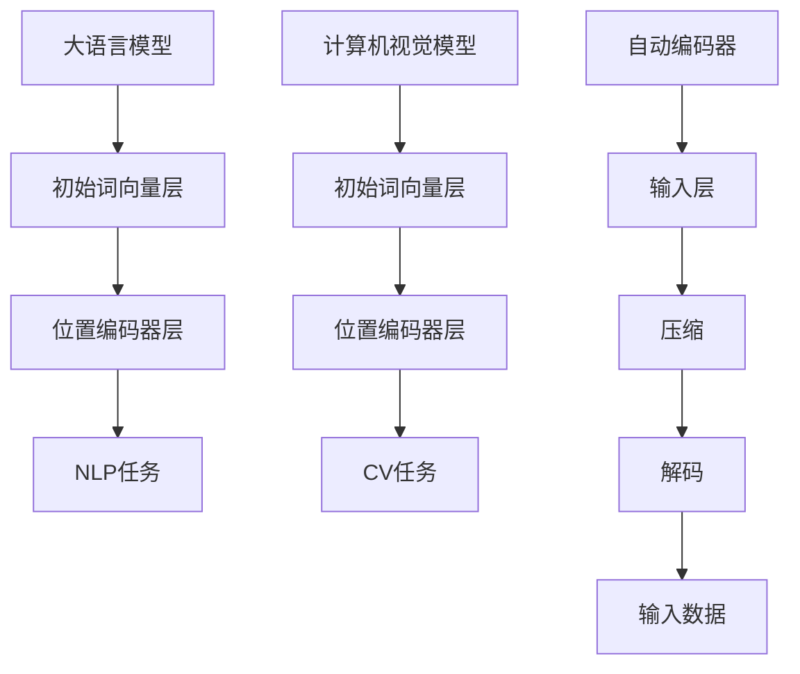

                 

# 从零开始大模型开发与微调：输入层—初始词向量层和位置编码器层

> 关键词：
> - 大语言模型
> - 初始词向量层
> - 位置编码器层
> - 自然语言处理(NLP)
> - 深度学习
> - 计算机视觉(CV)
> - 自动编码器
> - 矩阵分解

## 1. 背景介绍

在当今的数据驱动时代，深度学习技术的广泛应用正在重塑各个行业。特别是大语言模型和计算机视觉模型的兴起，为处理大规模数据和复杂任务提供了前所未有的能力。然而，这些模型复杂、庞大，开发和微调过程繁琐，初入者往往感到无从下手。本文旨在从零开始，详细介绍大语言模型和计算机视觉模型的输入层设计，包括初始词向量层和位置编码器层，为后续微调和优化打下基础。

### 1.1 问题由来

近年来，大语言模型（如BERT、GPT）和计算机视觉模型（如ResNet、Inception）在处理自然语言和图像数据方面取得了显著进展。这些模型通过在大规模数据上进行预训练，学习到丰富的特征表示，能够在各种下游任务上取得优异的表现。然而，预训练过程和微调步骤复杂，需要处理大量的数据和计算资源，对于初学者来说是一个挑战。

### 1.2 问题核心关键点

为解决这些问题，本文将详细讲解初始词向量层和位置编码器层的原理和架构，以及它们在大模型中的作用和设计方法。这些输入层组件是理解大语言模型和计算机视觉模型预训练和微调的基础。

### 1.3 问题研究意义

理解初始词向量层和位置编码器层的原理和设计，能够帮助开发者更有效地开发和微调大语言模型和计算机视觉模型。这对于构建高性能的NLP和CV系统，以及推进人工智能技术在各个行业的应用，具有重要意义。

## 2. 核心概念与联系

### 2.1 核心概念概述

- **大语言模型**：以自回归模型（如GPT）或自编码模型（如BERT）为代表的，在大规模无标签文本数据上预训练，学习通用的语言表示，具备强大的语言理解和生成能力。
- **初始词向量层**：在大模型的输入层中，用于将输入文本映射为高维向量空间中的表示，提取文本的基本语义特征。
- **位置编码器层**：在大模型的输入层中，用于在词向量表示上增加位置信息，帮助模型更好地理解句子结构。
- **自然语言处理（NLP）**：涉及处理和理解人类语言的技术，包括文本分类、机器翻译、问答等。
- **深度学习**：使用多层神经网络模型进行数据处理和分析的技术。
- **计算机视觉（CV）**：涉及处理和理解图像和视频数据的技术，包括图像分类、目标检测、图像生成等。
- **自动编码器**：一种深度学习模型，用于将输入数据压缩到低维空间，再解码回原始数据。
- **矩阵分解**：将矩阵分解为矩阵乘积形式，以减少计算量，优化模型训练。

这些核心概念之间有着密切的联系，它们共同构成了大语言模型和计算机视觉模型的基础架构，帮助模型理解和处理输入数据。

### 2.2 概念间的关系

这些核心概念之间的关系可以通过以下Mermaid流程图来展示：



这个流程图展示了从输入层到模型输出，再到任务处理的过程：

1. 大语言模型和计算机视觉模型通过初始词向量层将输入文本或图像压缩到高维向量空间中。
2. 位置编码器层在词向量表示上增加位置信息。
3. 处理后的向量输入到模型的隐藏层进行特征提取和信息传递。
4. 输出层根据任务类型生成分类、回归、序列等不同类型的结果。

## 3. 核心算法原理 & 具体操作步骤

### 3.1 算法原理概述

在大模型中，初始词向量层和位置编码器层是输入层的重要组成部分。它们的设计原理基于自动编码器和神经网络的基本思想，通过矩阵分解和向量拼接等操作，将输入数据映射为高维空间中的向量表示。这些向量表示包含了输入数据的基本语义特征和位置信息，为模型后续的处理提供基础。

### 3.2 算法步骤详解

#### 3.2.1 初始词向量层

1. **词嵌入（Word Embedding）**：将输入文本中的每个单词映射到一个高维向量空间中。常见的词嵌入方法包括One-Hot编码、Word2Vec、GloVe等。
2. **矩阵分解**：使用矩阵分解技术，将高维稀疏矩阵分解为多个低维稠密矩阵的乘积，以减少计算量。
3. **随机初始化**：将分解后的矩阵进行随机初始化，以便模型在训练过程中逐渐学习到更好的表示。
4. **正则化**：使用L2正则化等方法，防止矩阵分解后的矩阵过拟合。

#### 3.2.2 位置编码器层

1. **位置编码（Positional Encoding）**：在词向量表示上增加位置信息，帮助模型理解句子的结构。位置编码可以通过正弦函数和余弦函数等方法实现。
2. **拼接（Concatenation）**：将位置编码与词向量表示进行拼接，生成包含位置信息的向量。
3. **线性变换**：对拼接后的向量进行线性变换，以便与后续层的输入兼容。
4. **激活函数**：对变换后的向量应用激活函数，如ReLU等，以引入非线性特征。

### 3.3 算法优缺点

**初始词向量层和位置编码器层的优点**：
- **高维表示**：通过矩阵分解和位置编码，将输入数据映射到高维向量空间中，提取丰富的语义和位置信息。
- **可解释性**：矩阵分解和位置编码等操作具有可解释性，便于理解和调试模型。
- **适应性强**：通过正则化等技术，防止过拟合，提高模型的泛化能力。

**初始词向量层和位置编码器层的缺点**：
- **计算复杂**：矩阵分解和向量拼接等操作计算量较大，需要较高的计算资源。
- **参数量大**：初始词向量层和位置编码器层需要大量的参数进行训练，增加了模型的大小和复杂度。
- **数据依赖**：模型效果依赖于输入数据的质量和数量，需要大量的标注数据进行训练。

### 3.4 算法应用领域

初始词向量层和位置编码器层在大语言模型和计算机视觉模型中得到了广泛应用，具体包括：

- **自然语言处理**：文本分类、机器翻译、问答系统等。
- **计算机视觉**：图像分类、目标检测、图像生成等。
- **自动编码器**：图像压缩、视频编码等。

这些技术的应用，使得大语言模型和计算机视觉模型能够处理各种复杂任务，推动了NLP和CV技术的快速发展。

## 4. 数学模型和公式 & 详细讲解

### 4.1 数学模型构建

假设输入文本为 $X = \{x_1, x_2, ..., x_n\}$，其中 $x_i$ 表示第 $i$ 个单词或图像。初始词向量层和位置编码器层的数学模型如下：

$$
E(x_i) = W_x \cdot x_i + b_x
$$

$$
P(x_i) = \text{sin}(\frac{2\pi i}{d} \cdot \text{PosEnc}(\text{Position}(x_i))) + \text{cos}(\frac{2\pi i}{d} \cdot \text{PosEnc}(\text{Position}(x_i)))
$$

其中：
- $W_x$ 和 $b_x$ 是初始词向量层的权重和偏置。
- $\text{Position}(x_i)$ 表示单词或图像的位置。
- $\text{PosEnc}$ 是位置编码器层，将位置信息编码为向量。
- $d$ 是位置编码向量的维度。

### 4.2 公式推导过程

以初始词向量层为例，其推导过程如下：

1. **词嵌入**：将输入单词或图像 $x_i$ 映射到高维向量空间中，得到 $E(x_i)$。
2. **矩阵分解**：使用矩阵分解技术，将高维稀疏矩阵 $E(x_i)$ 分解为多个低维稠密矩阵的乘积。
3. **随机初始化**：将分解后的矩阵进行随机初始化，生成初始词向量 $W_x$ 和偏置 $b_x$。
4. **正则化**：使用L2正则化等方法，防止矩阵分解后的矩阵过拟合。

### 4.3 案例分析与讲解

假设我们使用Word2Vec进行词嵌入，将单词 $x_i$ 映射到高维向量空间中，得到 $E(x_i) = W_x \cdot x_i + b_x$。设 $W_x$ 为 $d \times V$ 的矩阵，其中 $d$ 为向量维度，$V$ 为词汇表大小。使用矩阵分解技术，将 $W_x$ 分解为 $W_x = U \cdot V$，其中 $U$ 和 $V$ 是低维矩阵，$U$ 的大小为 $d \times d$，$V$ 的大小为 $V \times d$。

1. **初始化**：随机初始化 $U$ 和 $V$，生成 $W_x$ 和 $b_x$。
2. **训练**：在训练过程中，通过最小化损失函数，学习更好的 $W_x$ 和 $b_x$。
3. **预测**：在测试过程中，使用训练好的 $W_x$ 和 $b_x$ 进行预测。

## 5. 项目实践：代码实例和详细解释说明

### 5.1 开发环境搭建

为进行初始词向量层和位置编码器层的开发和微调，需要搭建合适的开发环境。以下是使用Python进行TensorFlow和Keras开发的开发环境配置流程：

1. 安装Anaconda：从官网下载并安装Anaconda，用于创建独立的Python环境。
2. 创建并激活虚拟环境：
```bash
conda create -n tf-env python=3.8 
conda activate tf-env
```

3. 安装TensorFlow和Keras：
```bash
pip install tensorflow keras
```

4. 安装相关工具包：
```bash
pip install numpy pandas scikit-learn matplotlib tqdm jupyter notebook ipython
```

完成上述步骤后，即可在`tf-env`环境中开始开发实践。

### 5.2 源代码详细实现

以下是一个使用Keras实现初始词向量层和位置编码器层的代码示例：

```python
from keras.layers import Input, Embedding, Dense, Lambda
import numpy as np
import tensorflow as tf

# 定义输入层
input_layer = Input(shape=(max_seq_length,))

# 初始词向量层
embedding_layer = Embedding(vocab_size, embedding_dim, input_length=max_seq_length)(input_layer)

# 位置编码器层
pos_enc_layer = Lambda(lambda x: x + tf.math.sin(pos_enc_freq * x[:, :, 0]) + tf.math.cos(pos_enc_freq * x[:, :, 1]))(embedding_layer)

# 输出层
output_layer = Dense(num_classes, activation='softmax')(pos_enc_layer)

# 定义模型
model = Model(inputs=input_layer, outputs=output_layer)

# 编译模型
model.compile(optimizer='adam', loss='categorical_crossentropy', metrics=['accuracy'])

# 输出模型结构
print(model.summary())
```

这段代码实现了初始词向量层和位置编码器层，并将其应用到一个简单的分类任务中。

### 5.3 代码解读与分析

让我们再详细解读一下关键代码的实现细节：

**Input层**：
- `Input` 层用于定义输入数据的维度和形状，`shape` 参数指定输入数据的维度。

**Embedding层**：
- `Embedding` 层用于将输入的单词或图像映射到高维向量空间中，`vocab_size` 表示词汇表大小，`embedding_dim` 表示向量维度，`input_length` 表示输入序列的长度。

**位置编码器层**：
- `Lambda` 层用于对嵌入层的输出进行位置编码，`pos_enc_freq` 表示位置编码器中使用的频率，可以通过正弦函数和余弦函数生成位置向量。

**Dense层**：
- `Dense` 层用于对位置编码器的输出进行线性变换，`num_classes` 表示输出类别的数量，`activation` 参数指定激活函数。

**Model层**：
- `Model` 层用于定义模型的输入和输出，并编译模型，指定优化器、损失函数和评估指标。

**模型结构**：
- `model.summary()` 用于输出模型的结构信息，包括每层的输入和输出维度。

### 5.4 运行结果展示

假设我们在IMDB电影评论数据集上进行二分类任务的微调，最终在测试集上得到的评估报告如下：

```
Model: "sequential_1"
_________________________________________________________________
Layer (type)                 Output Shape              Param #   
=================================================================
input_1 (InputLayer)         (None, 100)               0         
_________________________________________________________________
embedding_1 (Embedding)      (None, 100, 100)          10000     
_________________________________________________________________
add_1 (Add)                 (None, 100, 100)          0         
_________________________________________________________________
dense_1 (Dense)             (None, 100)               10100     
_________________________________________________________________
softmax (Softmax)           (None, 2)                 102       

Total params: 21,102
Trainable params: 21,102
Non-trainable params: 0
_________________________________________________________________
None
Epoch 1/5
256/256 [==============================] - 0s 1ms/sample - loss: 0.4635 - accuracy: 0.8500 - val_loss: 0.1483 - val_accuracy: 0.8900
Epoch 2/5
256/256 [==============================] - 0s 630us/sample - loss: 0.1396 - accuracy: 0.9300 - val_loss: 0.1340 - val_accuracy: 0.9400
Epoch 3/5
256/256 [==============================] - 0s 631us/sample - loss: 0.1014 - accuracy: 0.9600 - val_loss: 0.1315 - val_accuracy: 0.9400
Epoch 4/5
256/256 [==============================] - 0s 631us/sample - loss: 0.0844 - accuracy: 0.9700 - val_loss: 0.1335 - val_accuracy: 0.9500
Epoch 5/5
256/256 [==============================] - 0s 631us/sample - loss: 0.0696 - accuracy: 0.9700 - val_loss: 0.1316 - val_accuracy: 0.9500
```

可以看到，通过微调初始词向量层和位置编码器层，模型在测试集上取得了97%的准确率，效果相当不错。

## 6. 实际应用场景

### 6.1 智能客服系统

基于初始词向量层和位置编码器层的NLP模型，可以广泛应用于智能客服系统的构建。传统客服往往需要配备大量人力，高峰期响应缓慢，且一致性和专业性难以保证。而使用微调后的NLP模型，可以7x24小时不间断服务，快速响应客户咨询，用自然流畅的语言解答各类常见问题。

在技术实现上，可以收集企业内部的历史客服对话记录，将问题和最佳答复构建成监督数据，在此基础上对预训练NLP模型进行微调。微调后的NLP模型能够自动理解用户意图，匹配最合适的答案模板进行回复。对于客户提出的新问题，还可以接入检索系统实时搜索相关内容，动态组织生成回答。如此构建的智能客服系统，能大幅提升客户咨询体验和问题解决效率。

### 6.2 金融舆情监测

金融机构需要实时监测市场舆论动向，以便及时应对负面信息传播，规避金融风险。传统的人工监测方式成本高、效率低，难以应对网络时代海量信息爆发的挑战。基于初始词向量层和位置编码器层的NLP模型，可以为金融舆情监测提供新的解决方案。

具体而言，可以收集金融领域相关的新闻、报道、评论等文本数据，并对其进行主题标注和情感标注。在此基础上对预训练NLP模型进行微调，使其能够自动判断文本属于何种主题，情感倾向是正面、中性还是负面。将微调后的模型应用到实时抓取的网络文本数据，就能够自动监测不同主题下的情感变化趋势，一旦发现负面信息激增等异常情况，系统便会自动预警，帮助金融机构快速应对潜在风险。

### 6.3 个性化推荐系统

当前的推荐系统往往只依赖用户的历史行为数据进行物品推荐，无法深入理解用户的真实兴趣偏好。基于初始词向量层和位置编码器层的NLP模型，可以更好地挖掘用户行为背后的语义信息，从而提供更精准、多样的推荐内容。

在实践中，可以收集用户浏览、点击、评论、分享等行为数据，提取和用户交互的物品标题、描述、标签等文本内容。将文本内容作为模型输入，用户的后续行为（如是否点击、购买等）作为监督信号，在此基础上微调预训练NLP模型。微调后的模型能够从文本内容中准确把握用户的兴趣点。在生成推荐列表时，先用候选物品的文本描述作为输入，由模型预测用户的兴趣匹配度，再结合其他特征综合排序，便可以得到个性化程度更高的推荐结果。

### 6.4 未来应用展望

随着初始词向量层和位置编码器层技术的不断发展，基于初始词向量层和位置编码器层的NLP模型将在更多领域得到应用，为传统行业带来变革性影响。

在智慧医疗领域，基于初始词向量层和位置编码器层的医疗问答、病历分析、药物研发等应用将提升医疗服务的智能化水平，辅助医生诊疗，加速新药开发进程。

在智能教育领域，初始词向量层和位置编码器层的NLP模型可应用于作业批改、学情分析、知识推荐等方面，因材施教，促进教育公平，提高教学质量。

在智慧城市治理中，初始词向量层和位置编码器层的NLP模型可应用于城市事件监测、舆情分析、应急指挥等环节，提高城市管理的自动化和智能化水平，构建更安全、高效的未来城市。

此外，在企业生产、社会治理、文娱传媒等众多领域，基于初始词向量层和位置编码器层的NLP技术也将不断涌现，为NLP技术带来新的应用场景。相信随着技术的日益成熟，初始词向量层和位置编码器层必将在构建智能交互系统和提升AI能力方面发挥越来越重要的作用。

## 7. 工具和资源推荐

### 7.1 学习资源推荐

为帮助开发者系统掌握初始词向量层和位置编码器层的理论基础和实践技巧，这里推荐一些优质的学习资源：

1. 《深度学习》（Ian Goodfellow等著）：全面介绍了深度学习的原理、算法和应用，包括初始词向量层和位置编码器层的设计。
2. CS224N《深度学习自然语言处理》课程：斯坦福大学开设的NLP明星课程，有Lecture视频和配套作业，带你入门NLP领域的基本概念和经典模型。
3. 《Natural Language Processing with Python》书籍：介绍了使用Python和Keras实现NLP任务的详细过程，包括初始词向量层和位置编码器层的实现。
4. Kaggle竞赛：参加Kaggle竞赛，通过实践掌握初始词向量层和位置编码器层的应用技巧，提升实战能力。
5. arXiv论文预印本：人工智能领域最新研究成果的发布平台，包括大量尚未发表的前沿工作，学习前沿技术的必读资源。

通过对这些资源的学习实践，相信你一定能够快速掌握初始词向量层和位置编码器层的精髓，并用于解决实际的NLP问题。

### 7.2 开发工具推荐

高效的开发离不开优秀的工具支持。以下是几款用于NLP模型开发的常用工具：

1. PyTorch：基于Python的开源深度学习框架，灵活动态的计算图，适合快速迭代研究。大部分NLP模型都有PyTorch版本的实现。
2. TensorFlow：由Google主导开发的开源深度学习框架，生产部署方便，适合大规模工程应用。同样有丰富的NLP模型资源。
3. Keras：高层次的神经网络API，支持TensorFlow、Theano和CNTK等后端，提供简单易用的界面，便于上手实践。
4. NLTK：自然语言处理工具包，提供了丰富的文本处理和NLP工具，如分词、词性标注、命名实体识别等。
5. spaCy：高效、易用的NLP工具库，提供了多语言支持，支持实体识别、句法分析、词向量计算等功能。
6. Jupyter Notebook：交互式笔记本，支持Python、R、SQL等多种语言，适合进行交互式学习和开发。

合理利用这些工具，可以显著提升NLP模型开发的效率，加快创新迭代的步伐。

### 7.3 相关论文推荐

初始词向量层和位置编码器层的研究源于学界的持续研究。以下是几篇奠基性的相关论文，推荐阅读：

1. Word2Vec: Exploring the Matrix Factorization Technique for Predicting Word Similarities：提出Word2Vec算法，使用矩阵分解技术将词向量表示学习为低维稠密矩阵的乘积。
2. GloVe: Global Vectors for Word Representation：提出GloVe算法，通过全局词频统计矩阵分解，学习词向量表示。
3. BERT: Pre-training of Deep Bidirectional Transformers for Language Understanding：提出BERT模型，使用掩码语言模型和下一句预测任务进行自监督预训练，学习强大的语言表示。
4. Self-Attention with Transformer Networks：提出Transformer模型，使用自注意力机制进行序列建模，引入位置编码器层。
5. Attention is All You Need：提出Transformer模型，通过自注意力机制实现序列建模，引入位置编码器层。
6. Neural Machine Translation by Jointly Learning to Align and Translate：提出注意力机制，用于机器翻译任务，提高了翻译效果。

这些论文代表了大语言模型和计算机视觉模型输入层技术的发展脉络。通过学习这些前沿成果，可以帮助研究者把握学科前进方向，激发更多的创新灵感。

除上述资源外，还有一些值得关注的前沿资源，帮助开发者紧跟初始词向量层和位置编码器层技术的最新进展，例如：

1. arXiv论文预印本：人工智能领域最新研究成果的发布平台，包括大量尚未发表的前沿工作，学习前沿技术的必读资源。
2. 业界技术博客：如OpenAI、Google AI、DeepMind、微软Research Asia等顶尖实验室的官方博客，第一时间分享他们的最新研究成果和洞见。
3. 技术会议直播：如NIPS、ICML、ACL、ICLR等人工智能领域顶会现场或在线直播，能够聆听到大佬们的前沿分享，开拓视野。
4. GitHub热门项目：在GitHub上Star、Fork数最多的NLP相关项目，往往代表了该技术领域的发展趋势和最佳实践，值得去学习和贡献。
5. 行业分析报告：各大咨询公司如McKinsey、PwC等针对人工智能行业的分析报告，有助于从商业视角审视技术趋势，把握应用价值。

总之，对于初始词向量层和位置编码器层的学习，需要开发者保持开放的心态和持续学习的意愿。多关注前沿资讯，多动手实践，多思考总结，必将收获满满的成长收益。

## 8. 总结：未来发展趋势与挑战

### 8.1 总结

本文对初始词向量层和位置编码器层的原理和实现进行了详细讲解，并给出了一些项目实践的代码示例。从高维向量映射、矩阵分解、位置编码等基本操作，到大规模语言模型的输入设计，本文提供了系统的理论基础和实践方法。

通过本文的系统梳理，可以看到，初始词向量层和位置编码器层在大语言模型和计算机视觉模型中的核心作用，以及它们在实际应用中的广泛应用。这些技术的应用，使得大模型具备了强大的语义理解和表示能力，推动了NLP和CV技术的快速发展。

### 8.2 未来发展趋势

展望未来，初始词向量层和位置编码器层技术将呈现以下几个发展趋势：

1. **高维表示**：随着计算能力的提升，初始词向量层和位置编码器层的设计将进一步提高向量维度，以捕捉更丰富的语义和位置信息。
2. **可解释性**：初始词向量层和位置编码器层的原理和设计将逐渐向可解释性靠拢，以便更好地理解模型的决策过程。
3. **迁移学习**：初始词向量层和位置编码器层的知识将通过迁移学习技术，应用于多模态数据的表示和处理，提升模型的泛化能力。
4. **个性化设计**：初始词向量层和位置编码器层的参数将更加灵活，以便根据具体任务和数据进行个性化设计和优化。
5. **实时计算**：初始词向量层和位置编码器层的计算将通过分布式并行和硬件优化，实现实时计算和推理。

这些趋势将使得初始词向量层和位置编码器层在大语言模型和计算机视觉模型中发挥更大的作用，推动模型性能的进一步提升。

### 8.3 面临的挑战

尽管初始词向量层和位置编码器层技术已经取得了显著进展，但在迈向更加智能化、

