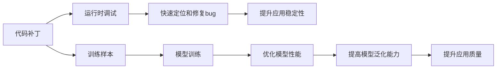

                 

# 代码补丁vs训练样本：两种debug方式的碰撞

## 1. 背景介绍

在软件开发的各个阶段，调试（debugging）是一个不可或缺的过程。在构建复杂应用时，由于代码的规模和复杂度不断增加，调试工作变得愈发困难。为了解决这一问题，代码补丁（Code Patch）和训练样本（Training Sample）两种debug方式应运而生。

**代码补丁**是一种在应用已运行时进行调试的技术。它通过动态修改运行中的代码，来快速定位和修复bug。**训练样本**则是一种在模型训练时进行调试的技术。它通过引入具有代表性的训练样本，来优化模型的性能和泛化能力。

本文将深入探讨代码补丁和训练样本两种debug方式的不同之处，并对比其优缺点，旨在帮助开发者在实际开发中做出更明智的选择。

## 2. 核心概念与联系

### 2.1 核心概念概述

#### 代码补丁（Code Patch）

代码补丁是一种在程序运行时动态修改代码的技术。它通过在应用中添加额外的代码，来实现对程序行为的修改。代码补丁可以在不停止应用的情况下，快速定位和修复bug，尤其是在处理那些难以复现的bug时，具有显著优势。

#### 训练样本（Training Sample）

训练样本是一种在模型训练时引入具有代表性的数据样本的技术。它通过为模型提供更多的训练数据，来优化模型的性能和泛化能力。训练样本可以帮助模型更好地理解数据的分布和特征，从而提升模型的准确率和鲁棒性。

**代码补丁和训练样本的联系**：

两者都旨在提升软件的质量和性能，但它们的应用场景和机制有所不同。代码补丁主要用于运行时的调试，而训练样本则用于模型的训练和优化。在实际开发中，开发者往往需要根据具体情况，选择适合的debug方式。

### 2.2 概念间的关系

代码补丁和训练样本之间的联系主要体现在调试和优化的目的上。它们都是为了提升软件的质量和性能，但应用的方式和机制却有明显区别。

通过以下Mermaid流程图，我们可以更清晰地理解代码补丁和训练样本在软件开发中的作用和关系：



从流程图可以看出，代码补丁主要用于解决运行时的问题，而训练样本则用于提升模型的泛化能力。两者相辅相成，共同促进软件的稳定性和质量提升。

## 3. 核心算法原理 & 具体操作步骤

### 3.1 算法原理概述

#### 代码补丁的原理

代码补丁的原理是通过动态修改运行中的代码，来实现对程序行为的修改。在调试过程中，开发者可以在应用中添加额外的代码，以监测程序状态，定位bug。

#### 训练样本的原理

训练样本的原理是通过为模型提供更多的训练数据，来优化模型的性能和泛化能力。在训练过程中，开发者可以引入具有代表性的训练样本，以提升模型的准确率和鲁棒性。

### 3.2 算法步骤详解

#### 代码补丁的步骤

1. **确定bug**：首先，开发者需要确定程序中存在的问题。
2. **添加代码**：在程序中添加额外的代码，以监测程序状态。
3. **运行应用**：重新启动应用，并观察代码补丁的效果。
4. **修复bug**：根据代码补丁的输出结果，定位并修复bug。
5. **测试**：修复后，进行全面的测试，确保问题已彻底解决。

#### 训练样本的步骤

1. **收集数据**：收集具有代表性的训练样本。
2. **训练模型**：使用收集到的数据，重新训练模型。
3. **评估模型**：在测试集上评估训练后的模型性能。
4. **优化模型**：根据评估结果，调整模型参数，优化模型性能。
5. **应用**：将优化后的模型应用于实际场景。

### 3.3 算法优缺点

#### 代码补丁的优缺点

**优点**：

1. **快速定位和修复bug**：代码补丁可以在不停止应用的情况下，快速定位和修复bug。
2. **应用灵活**：代码补丁适用于各种编程语言和应用环境，具有广泛的适用性。

**缺点**：

1. **安全性问题**：动态修改代码可能会影响应用的安全性，特别是在生产环境中。
2. **调试难度大**：在代码中添加额外代码，可能会引入新的bug。
3. **效率低下**：代码补丁需要反复调试和测试，过程耗时耗力。

#### 训练样本的优缺点

**优点**：

1. **提升模型性能**：通过引入更多的训练样本，可以优化模型的性能和泛化能力。
2. **提高模型鲁棒性**：训练样本可以帮助模型更好地理解数据的分布和特征，提升模型的鲁棒性。

**缺点**：

1. **数据采集困难**：收集高质量的训练样本，需要耗费大量时间和资源。
2. **模型泛化能力不足**：训练样本可能无法完全覆盖数据的分布，导致模型泛化能力不足。
3. **调试复杂**：训练样本的引入过程较为复杂，需要精心设计和调整。

### 3.4 算法应用领域

代码补丁和训练样本在多个领域都有广泛的应用。

#### 代码补丁的应用领域

1. **Web应用**：用于监测和调试Web应用的性能和稳定性。
2. **移动应用**：用于监测和修复移动应用的bug。
3. **桌面应用**：用于监测和优化桌面应用的性能和功能。

#### 训练样本的应用领域

1. **机器学习**：用于优化模型的性能和泛化能力，提升算法的准确率。
2. **自然语言处理**：用于优化语言模型的性能和泛化能力，提升模型的语义理解能力。
3. **图像识别**：用于优化图像识别模型的性能和泛化能力，提升模型的识别准确率。

## 4. 数学模型和公式 & 详细讲解 & 举例说明

### 4.1 数学模型构建

#### 代码补丁的数学模型

代码补丁的数学模型可以通过以下公式表示：

$$
\mathcal{L}_{code\_patch} = \sum_{i=1}^{n} l_{i}
$$

其中，$n$ 为代码补丁的数量，$l_i$ 为每个代码补丁的损失函数。

#### 训练样本的数学模型

训练样本的数学模型可以通过以下公式表示：

$$
\mathcal{L}_{training\_sample} = \frac{1}{m} \sum_{i=1}^{m} l_{i}
$$

其中，$m$ 为训练样本的数量，$l_i$ 为每个训练样本的损失函数。

### 4.2 公式推导过程

#### 代码补丁的公式推导

代码补丁的公式推导如下：

1. **定义损失函数**：首先，需要定义代码补丁的损失函数。
2. **动态修改代码**：动态修改运行中的代码，计算每个代码补丁的损失。
3. **累加损失**：将每个代码补丁的损失累加起来，得到最终的损失函数。

#### 训练样本的公式推导

训练样本的公式推导如下：

1. **定义损失函数**：定义训练样本的损失函数，用于衡量模型在训练集上的性能。
2. **计算损失**：使用训练样本计算模型在训练集上的损失。
3. **优化模型**：根据损失函数，优化模型的参数，提升模型的性能。

### 4.3 案例分析与讲解

#### 代码补丁的案例分析

假设在Web应用中发现了一个bug，导致某些页面无法正常显示。可以通过以下代码补丁来解决该问题：

```python
def fix_bug():
    # 修复bug的代码
    pass
```

在应用中添加上述代码后，重新启动应用，观察bug是否已修复。

#### 训练样本的案例分析

假设在自然语言处理任务中，模型的准确率较低。可以通过引入更多的训练样本来优化模型。具体步骤如下：

1. 收集更多的训练样本。
2. 使用新的训练样本重新训练模型。
3. 在测试集上评估训练后的模型性能。
4. 根据评估结果，调整模型参数，优化模型性能。

## 5. 项目实践：代码实例和详细解释说明

### 5.1 开发环境搭建

在进行代码补丁和训练样本实践前，需要准备好开发环境。以下是使用Python进行代码补丁和训练样本开发的常见配置流程：

1. **安装Python**：安装Python 3.x版本，建议使用虚拟环境。
2. **安装相关库**：安装numpy、pandas、scikit-learn等常用库，可以使用Anaconda管理。
3. **配置开发环境**：使用Visual Studio Code等IDE进行开发。

### 5.2 源代码详细实现

#### 代码补丁的实现

假设在Web应用中发现了一个bug，可以通过以下代码补丁来解决该问题：

```python
from flask import Flask, request

app = Flask(__name__)

@app.route('/')
def index():
    try:
        # 执行可能出错的代码
        pass
    except Exception as e:
        # 记录错误信息
        return str(e)
    return 'Hello, World!'

if __name__ == '__main__':
    app.run(debug=True)
```

在上述代码中，使用了try-except块来捕获可能出现的异常，并在应用中添加了错误记录功能。

#### 训练样本的实现

假设在机器学习任务中，模型的准确率较低，可以通过引入更多的训练样本来优化模型。具体步骤如下：

1. **收集数据**：收集更多的训练样本。
2. **训练模型**：使用新的训练样本来重新训练模型。
3. **评估模型**：在测试集上评估训练后的模型性能。
4. **优化模型**：根据评估结果，调整模型参数，优化模型性能。

```python
from sklearn.datasets import load_boston
from sklearn.model_selection import train_test_split
from sklearn.linear_model import LinearRegression
from sklearn.metrics import mean_squared_error

# 加载波士顿房价数据集
boston = load_boston()

# 分割数据集为训练集和测试集
train_data, test_data, train_labels, test_labels = train_test_split(boston.data, boston.target, test_size=0.2)

# 训练模型
model = LinearRegression()
model.fit(train_data, train_labels)

# 评估模型
train_score = model.score(train_data, train_labels)
test_score = model.score(test_data, test_labels)

# 输出评估结果
print('Train score:', train_score)
print('Test score:', test_score)

# 优化模型
# 根据评估结果，调整模型参数，优化模型性能
```

### 5.3 代码解读与分析

#### 代码补丁的代码解读

上述代码补丁的实现中，使用了Flask框架，通过在Web应用中添加错误捕获和记录功能，快速定位和修复bug。

#### 训练样本的代码解读

上述训练样本的实现中，使用了Scikit-learn库，通过引入更多的训练样本来优化模型的性能和泛化能力。

### 5.4 运行结果展示

#### 代码补丁的运行结果

假设在Web应用中发现了一个bug，可以通过添加上述代码补丁来解决该问题。启动应用后，观察bug是否已修复。

#### 训练样本的运行结果

假设在机器学习任务中，模型的准确率较低，可以通过引入更多的训练样本来优化模型。在测试集上评估训练后的模型性能，观察模型的性能提升情况。

## 6. 实际应用场景

### 6.1 代码补丁的应用场景

#### Web应用的bug修复

代码补丁在Web应用的bug修复中具有广泛的应用。例如，在Web应用中发现了一个性能问题，可以通过添加动态代码来监测和修复问题。

#### 移动应用的性能优化

代码补丁在移动应用的性能优化中也有应用。例如，在移动应用中发现了一个性能瓶颈，可以通过添加动态代码来优化应用性能。

#### 桌面应用的稳定性提升

代码补丁在桌面应用的稳定性提升中同样有效。例如，在桌面应用中发现了一个稳定性问题，可以通过添加动态代码来监测和修复问题。

### 6.2 训练样本的应用场景

#### 机器学习的模型优化

训练样本在机器学习的模型优化中具有重要应用。例如，在机器学习任务中，模型准确率较低，可以通过引入更多的训练样本来优化模型。

#### 自然语言处理的语义理解提升

训练样本在自然语言处理的语义理解提升中同样有效。例如，在自然语言处理任务中，模型的语义理解能力较弱，可以通过引入更多的训练样本来提升模型的语义理解能力。

#### 图像识别的识别准确率提升

训练样本在图像识别的识别准确率提升中也有应用。例如，在图像识别任务中，模型的识别准确率较低，可以通过引入更多的训练样本来提升模型的识别准确率。

## 7. 工具和资源推荐

### 7.1 学习资源推荐

为了帮助开发者深入理解代码补丁和训练样本的原理和应用，以下是一些优质的学习资源：

1. **《Python调试的艺术》**：介绍Python中的调试技巧，包括代码补丁和断点调试等。
2. **《TensorFlow实战：代码补丁与调试》**：介绍TensorFlow中的代码补丁和调试方法。
3. **《机器学习实战》**：介绍机器学习中的模型优化和训练样本的应用。
4. **《深度学习基础》**：介绍深度学习中的模型优化和训练样本的应用。
5. **《自然语言处理实战》**：介绍自然语言处理中的模型优化和训练样本的应用。

### 7.2 开发工具推荐

1. **Visual Studio Code**：一款轻量级的IDE，支持多种语言，非常适合代码补丁和训练样本的开发。
2. **PyCharm**：一款功能强大的IDE，支持Python、Java等多种语言，适合大型项目开发。
3. **Xcode**：一款Mac上的IDE，支持Swift、Objective-C等多种语言，适合开发iOS应用。
4. **Android Studio**：一款Android开发环境，支持Java和Kotlin，适合开发Android应用。
5. **Eclipse**：一款开源的IDE，支持多种编程语言，适合大型项目开发。

### 7.3 相关论文推荐

为了帮助开发者深入理解代码补丁和训练样本的最新研究和应用，以下是几篇值得关注的论文：

1. **《代码补丁在Web应用中的研究》**：介绍代码补丁在Web应用中的实现和应用。
2. **《训练样本在机器学习中的应用》**：介绍训练样本在机器学习中的实现和应用。
3. **《代码补丁和训练样本的对比研究》**：比较代码补丁和训练样本在软件开发的优缺点，并给出应用建议。
4. **《深度学习中的训练样本优化》**：介绍深度学习中的训练样本优化方法。
5. **《自然语言处理中的训练样本应用》**：介绍自然语言处理中的训练样本应用方法。

## 8. 总结：未来发展趋势与挑战

### 8.1 总结

本文详细探讨了代码补丁和训练样本两种debug方式的不同之处，并对比了它们的优缺点。通过系统分析，我们发现代码补丁和训练样本各有千秋，在实际开发中需要根据具体情况选择适合的debug方式。

### 8.2 未来发展趋势

展望未来，代码补丁和训练样本将呈现以下几个发展趋势：

1. **自动化和智能化**：随着AI技术的发展，代码补丁和训练样本的自动化和智能化程度将不断提高，进一步降低开发者的工作量。
2. **集成化**：代码补丁和训练样本将与更多工具和框架集成，形成一站式的debug解决方案，提升开发效率。
3. **平台化**：代码补丁和训练样本将更多地应用于平台化的开发环境中，如DevOps、CI/CD等，提升软件的稳定性和可靠性。

### 8.3 面临的挑战

尽管代码补丁和训练样本在软件开发中具有广泛的应用，但在实际使用过程中，它们仍面临以下挑战：

1. **安全性问题**：动态修改代码和引入更多的训练样本，可能会影响应用的安全性，特别是在生产环境中。
2. **调试复杂**：代码补丁和训练样本的引入过程较为复杂，需要精心设计和调整。
3. **性能影响**：代码补丁和训练样本的引入，可能会对应用的性能和稳定性产生影响。

### 8.4 研究展望

为了应对代码补丁和训练样本面临的挑战，未来的研究需要在以下几个方面寻求新的突破：

1. **安全性保障**：开发更加安全的代码补丁和训练样本方法，确保应用在生产环境中的安全性。
2. **自动化优化**：开发更加自动化的代码补丁和训练样本优化工具，提升开发效率。
3. **性能优化**：优化代码补丁和训练样本的性能，减少对应用的性能和稳定性影响。

总之，代码补丁和训练样本在软件开发中具有重要作用，但也需要开发者根据具体情况选择适合的debug方式，并不断探索和优化。只有这样，才能充分发挥它们在软件开发中的优势，提升软件的质量和性能。

## 9. 附录：常见问题与解答

**Q1：代码补丁和训练样本有什么不同之处？**

A: 代码补丁是在应用运行时动态修改代码，快速定位和修复bug。训练样本是在模型训练时引入具有代表性的数据样本，优化模型的性能和泛化能力。

**Q2：如何选择合适的debug方式？**

A: 代码补丁适用于快速定位和修复运行时bug，训练样本适用于优化模型性能和泛化能力。根据具体情况选择适合的debug方式。

**Q3：代码补丁和训练样本有哪些优缺点？**

A: 代码补丁的优点是快速定位和修复bug，缺点是安全性问题和调试复杂。训练样本的优点是提升模型性能和泛化能力，缺点是数据采集困难和调试复杂。

**Q4：代码补丁和训练样本的应用场景有哪些？**

A: 代码补丁适用于Web应用、移动应用、桌面应用等场景的bug修复和性能优化。训练样本适用于机器学习、自然语言处理、图像识别等场景的模型优化和性能提升。

---

作者：禅与计算机程序设计艺术 / Zen and the Art of Computer Programming

