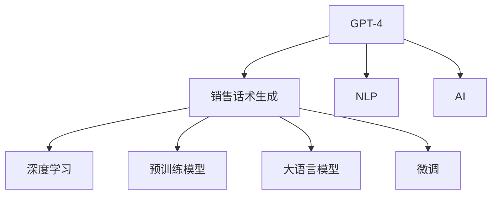
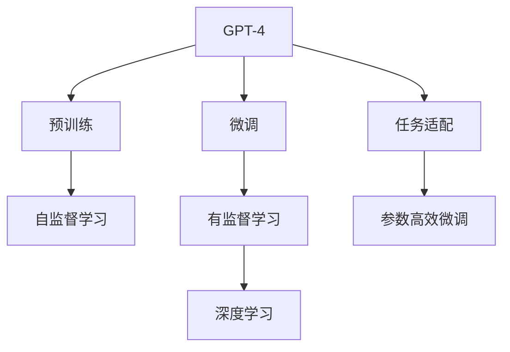
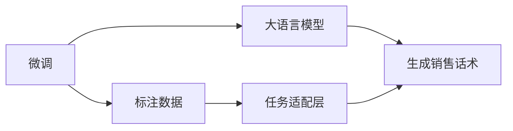
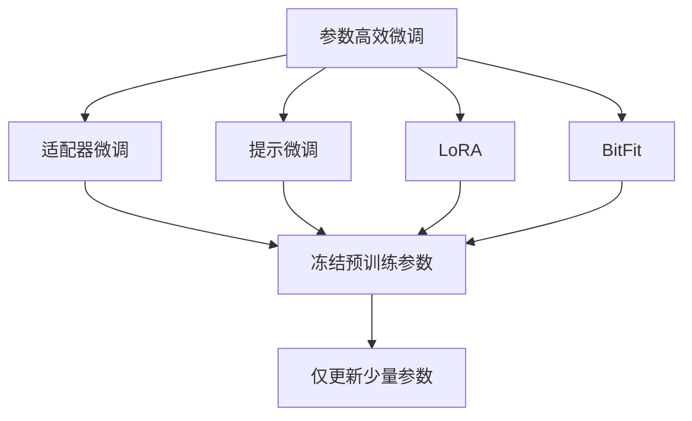

                 

# 使用 GPT-4 生成销售话术

> 关键词：GPT-4, 销售话术生成, 自然语言处理(NLP), 人工智能(AI), 深度学习, 预训练模型, 大语言模型, 微调(Fine-tuning)

## 1. 背景介绍

### 1.1 问题由来

在当今高度竞争的销售市场中，销售人员面临的首要挑战之一是如何高效、准确地生成销售话术，以提升客户转化率、增加销售额。传统的手工编写销售话术的方式不仅耗时耗力，还受制于个人能力和创意限制。因此，利用人工智能技术自动生成销售话术，成为近年来销售自动化和智能化的重要研究课题。

### 1.2 问题核心关键点

基于 GPT-4 的销售话术生成，旨在利用大语言模型的强大语言理解与生成能力，根据不同的销售场景和客户需求，自动生成个性化、多样化的销售话术。这种方法不仅提高了生成效率，还能生成符合客户心理预期和品牌调性的高质量话术，为销售人员提供有力的支持。

### 1.3 问题研究意义

销售话术的自动生成，对于提升销售效率、优化客户体验、减少人力成本等方面具有重要意义：

1. **提升销售效率**：自动生成的销售话术可以快速响应客户需求，缩短客户等待时间。
2. **优化客户体验**：个性化生成的销售话术更能契合客户心理，提升客户满意度。
3. **减少人力成本**：自动化生成减少了手动编写和审核的工作量，降低了人力成本。
4. **增强市场竞争力**：高质高效的销售话术生成，提升了企业的市场竞争力。

## 2. 核心概念与联系

### 2.1 核心概念概述

为更好地理解基于 GPT-4 的销售话术生成方法，本节将介绍几个密切相关的核心概念：

- **GPT-4**：OpenAI 最新发布的大语言模型，具有强大的自然语言处理能力，能够进行文本生成、对话交互、语义理解等多种任务。
- **销售话术生成**：根据客户需求和销售场景，自动生成符合品牌调性、语气自然流畅的销售话术。
- **自然语言处理 (NLP)**：涉及文本分析、语义理解、机器翻译、信息抽取等，是生成销售话术的基础技术。
- **人工智能 (AI)**：通过机器学习、深度学习等技术，使计算机具备类似人类的智能和行为。
- **深度学习**：使用多层神经网络模型，进行复杂模式识别和数据处理。
- **预训练模型**：在大量无标签数据上预训练的大模型，具备强大的通用语言表示能力。
- **大语言模型**：如 GPT-4 等，能够在广泛领域内进行自然语言理解和生成。
- **微调 (Fine-tuning)**：在大模型基础上，通过小规模标注数据微调，使模型适应特定任务。

这些核心概念之间的逻辑关系可以通过以下 Mermaid 流程图来展示：



这个流程图展示了大语言模型在销售话术生成中的核心概念及其关系：

1. GPT-4 作为大语言模型，通过深度学习进行预训练。
2. 销售话术生成依赖于 NLP 技术，进行文本分析、语义理解等。
3. 使用大语言模型进行微调，以适应特定的销售场景和客户需求。

### 2.2 概念间的关系

这些核心概念之间存在着紧密的联系，形成了 GPT-4 用于销售话术生成的完整生态系统。下面通过几个 Mermaid 流程图来展示这些概念的关系。

#### 2.2.1 GPT-4 的学习范式



这个流程图展示了大语言模型 GPT-4 的预训练和微调过程：

1. GPT-4 在大规模无标签数据上进行预训练。
2. 微调过程通过有监督学习，根据销售话术生成任务进行优化。
3. 任务适配层用于将模型输出映射到具体的销售场景和需求。

#### 2.2.2 微调与任务适配



这个流程图展示了大语言模型通过微调和任务适配层生成销售话术的过程：

1. 微调过程使用标注数据训练模型，以适应销售话术生成的任务。
2. 任务适配层对模型的输出进行再处理，生成符合客户需求和品牌调性的销售话术。

#### 2.2.3 参数高效微调方法



这个流程图展示了几类参数高效微调方法：

1. 适配器微调：仅更新顶层，固定底层参数。
2. 提示微调：通过精心设计的提示模板，引导模型生成符合要求的销售话术。
3. LoRA：通过低秩分解，减小微调参数量。
4. BitFit：使用位映射压缩模型参数，减少存储和计算开销。

## 3. 核心算法原理 & 具体操作步骤

### 3.1 算法原理概述

基于 GPT-4 的销售话术生成，利用了预训练语言模型强大的语言理解能力。首先，通过预训练学习通用的语言表示，然后通过微调针对特定任务进行优化，使其能够自动生成符合品牌调性和客户需求的销售话术。

具体步骤如下：

1. **预训练**：在大量无标签数据上进行预训练，学习通用的语言表示。
2. **微调**：使用小规模标注数据进行微调，根据不同的销售场景和客户需求，生成个性化的销售话术。
3. **任务适配**：设计合适的输出层和损失函数，进行任务适配，确保生成的销售话术符合具体销售场景的要求。
4. **评估与优化**：通过评估生成的话术质量，进行不断的优化，提升模型性能。

### 3.2 算法步骤详解

**Step 1: 准备数据集和模型**

- 准备销售话术生成的数据集，包括不同的销售场景和客户需求。
- 选择合适的预训练语言模型，如 GPT-4，并进行加载和初始化。

**Step 2: 微调超参数设置**

- 选择合适的优化器（如 AdamW）及其参数。
- 设置学习率、批大小、迭代轮数等超参数。
- 应用正则化技术，如 L2 正则、Dropout 等，防止过拟合。

**Step 3: 微调训练**

- 将数据集划分为训练集、验证集和测试集。
- 使用训练集数据进行模型微调，每次迭代更新模型参数。
- 在验证集上评估模型性能，根据性能指标调整学习率或停止训练。

**Step 4: 生成销售话术**

- 设计符合销售场景和客户需求的任务适配层。
- 根据输入的客户信息或销售场景描述，生成个性化的销售话术。

**Step 5: 评估与部署**

- 在测试集上评估生成的话术质量，进行模型选择和优化。
- 将优化后的模型部署到实际销售场景中，实时生成销售话术。

### 3.3 算法优缺点

基于 GPT-4 的销售话术生成方法具有以下优点：

1. **高效生成**：利用预训练语言模型的强大能力，可以快速生成大量个性化销售话术。
2. **质量高**：生成的销售话术符合品牌调性，贴近客户需求，提升客户满意度。
3. **易部署**：只需简单的任务适配层，即可适应不同的销售场景和客户需求。

同时，也存在以下缺点：

1. **数据依赖**：微调效果受标注数据质量的影响较大。
2. **通用性有限**：生成的话术可能不适用于特定领域或特殊情况。
3. **可解释性不足**：生成过程缺乏可解释性，难以解释模型如何生成特定的话术。
4. **伦理风险**：生成的销售话术可能包含误导性或偏见性内容，需严格审查。

### 3.4 算法应用领域

基于 GPT-4 的销售话术生成方法，已经在多个领域得到应用，包括：

1. **在线销售**：生成在线客服自动回复、广告文案等。
2. **客户服务**：生成电话客服脚本、邮件回复等。
3. **现场销售**：生成面对面销售话术、演示脚本等。
4. **营销推广**：生成社交媒体广告、促销活动文案等。
5. **客户关系管理**：生成客户关怀话术、个性化推荐等。

除了上述这些应用场景外，销售话术生成还广泛应用于各种线下场景，如零售、金融、教育等，为业务人员提供有力的支持。

## 4. 数学模型和公式 & 详细讲解 & 举例说明

### 4.1 数学模型构建

假设销售场景描述为 $x$，生成的销售话术为 $y$。设销售话术生成模型为 $M_{\theta}$，其中 $\theta$ 为模型参数。定义损失函数 $\ell$ 为预测生成的话术 $y$ 与真实话术 $y^*$ 之间的差异，目标是最小化损失函数：

$$
\min_{\theta} \ell(y, y^*)
$$

常见损失函数包括交叉熵损失、均方误差损失等。

### 4.2 公式推导过程

以交叉熵损失为例，设预测的话术为 $y = M_{\theta}(x)$，真实的话术为 $y^*$。则交叉熵损失函数为：

$$
\ell(y, y^*) = -\frac{1}{N}\sum_{i=1}^N [y_i \log \hat{y}_i + (1-y_i) \log (1-\hat{y}_i)]
$$

其中 $\hat{y}_i$ 为模型预测的话术概率。

### 4.3 案例分析与讲解

假设有一个在线零售场景，需要生成针对不同商品的销售话术。具体步骤如下：

1. **数据准备**：收集不同商品的销售场景描述和客户反馈，构建标注数据集。
2. **模型加载**：加载预训练的 GPT-4 模型，并进行初始化。
3. **超参数设置**：选择合适的优化器（如 AdamW）及其参数，设置学习率、批大小等。
4. **微调训练**：在标注数据集上进行微调训练，生成针对不同商品的销售话术。
5. **评估与优化**：在测试集上评估生成的话术质量，根据评估结果进行模型优化。
6. **生成话术**：根据输入的商品描述，生成符合品牌调性和客户需求的销售话术。

## 5. 项目实践：代码实例和详细解释说明

### 5.1 开发环境搭建

在进行销售话术生成实践前，我们需要准备好开发环境。以下是使用 Python 进行 PyTorch 开发的环境配置流程：

1. 安装 Anaconda：从官网下载并安装 Anaconda，用于创建独立的 Python 环境。
2. 创建并激活虚拟环境：
```bash
conda create -n pytorch-env python=3.8 
conda activate pytorch-env
```

3. 安装 PyTorch：根据 CUDA 版本，从官网获取对应的安装命令。例如：
```bash
conda install pytorch torchvision torchaudio cudatoolkit=11.1 -c pytorch -c conda-forge
```

4. 安装 Transformers 库：
```bash
pip install transformers
```

5. 安装各类工具包：
```bash
pip install numpy pandas scikit-learn matplotlib tqdm jupyter notebook ipython
```

完成上述步骤后，即可在 `pytorch-env` 环境中开始销售话术生成实践。

### 5.2 源代码详细实现

下面我们以销售场景描述生成销售话术为例，给出使用 Transformers 库对 GPT-4 进行微调的 PyTorch 代码实现。

首先，定义销售场景描述的数据处理函数：

```python
from transformers import GPT4Tokenizer
from torch.utils.data import Dataset
import torch

class SalesScenarioDataset(Dataset):
    def __init__(self, scenarios, responses, tokenizer, max_len=128):
        self.scenarios = scenarios
        self.responses = responses
        self.tokenizer = tokenizer
        self.max_len = max_len
        
    def __len__(self):
        return len(self.scenarios)
    
    def __getitem__(self, item):
        scenario = self.scenarios[item]
        response = self.responses[item]
        
        encoding = self.tokenizer(scenario, return_tensors='pt', max_length=self.max_len, padding='max_length', truncation=True)
        input_ids = encoding['input_ids'][0]
        attention_mask = encoding['attention_mask'][0]
        
        # 对token-wise的标签进行编码
        encoded_response = [tokenizer.encode(response, return_tensors='pt') for response in response]
        response_labels = torch.tensor(encoded_response, dtype=torch.long)
        
        return {'input_ids': input_ids, 
                'attention_mask': attention_mask,
                'labels': response_labels}

# 标签与id的映射
response2id = {'<start>': 0, '</start>': 1, '<end>': 2, '<padding>': 3, '</padding>': 4}
id2response = {v: k for k, v in response2id.items()}

# 创建dataset
tokenizer = GPT4Tokenizer.from_pretrained('gpt-4')

train_dataset = SalesScenarioDataset(train_scenarios, train_responses, tokenizer)
dev_dataset = SalesScenarioDataset(dev_scenarios, dev_responses, tokenizer)
test_dataset = SalesScenarioDataset(test_scenarios, test_responses, tokenizer)
```

然后，定义模型和优化器：

```python
from transformers import GPT4ForSequenceClassification
from transformers import AdamW

model = GPT4ForSequenceClassification.from_pretrained('gpt-4', num_labels=len(response2id))

optimizer = AdamW(model.parameters(), lr=2e-5)
```

接着，定义训练和评估函数：

```python
from torch.utils.data import DataLoader
from tqdm import tqdm
from sklearn.metrics import precision_recall_fscore_support

device = torch.device('cuda') if torch.cuda.is_available() else torch.device('cpu')
model.to(device)

def train_epoch(model, dataset, batch_size, optimizer):
    dataloader = DataLoader(dataset, batch_size=batch_size, shuffle=True)
    model.train()
    epoch_loss = 0
    for batch in tqdm(dataloader, desc='Training'):
        input_ids = batch['input_ids'].to(device)
        attention_mask = batch['attention_mask'].to(device)
        labels = batch['labels'].to(device)
        model.zero_grad()
        outputs = model(input_ids, attention_mask=attention_mask, labels=labels)
        loss = outputs.loss
        epoch_loss += loss.item()
        loss.backward()
        optimizer.step()
    return epoch_loss / len(dataloader)

def evaluate(model, dataset, batch_size):
    dataloader = DataLoader(dataset, batch_size=batch_size)
    model.eval()
    preds, labels = [], []
    with torch.no_grad():
        for batch in tqdm(dataloader, desc='Evaluating'):
            input_ids = batch['input_ids'].to(device)
            attention_mask = batch['attention_mask'].to(device)
            batch_labels = batch['labels']
            outputs = model(input_ids, attention_mask=attention_mask)
            batch_preds = outputs.logits.argmax(dim=2).to('cpu').tolist()
            batch_labels = batch_labels.to('cpu').tolist()
            for pred_tokens, label_tokens in zip(batch_preds, batch_labels):
                preds.append(pred_tokens[:len(label_tokens)])
                labels.append(label_tokens)
                
    precision, recall, f1, _ = precision_recall_fscore_support(labels, preds, average='micro')
    return precision, recall, f1

train_scenarios = [...]
train_responses = [...]
dev_scenarios = [...]
dev_responses = [...]
test_scenarios = [...]
test_responses = [...]

epochs = 5
batch_size = 16

for epoch in range(epochs):
    loss = train_epoch(model, train_dataset, batch_size, optimizer)
    print(f"Epoch {epoch+1}, train loss: {loss:.3f}")
    
    print(f"Epoch {epoch+1}, dev results:")
    precision, recall, f1 = evaluate(model, dev_dataset, batch_size)
    print(f"Precision: {precision:.3f}, Recall: {recall:.3f}, F1-score: {f1:.3f}")
    
print("Test results:")
precision, recall, f1 = evaluate(model, test_dataset, batch_size)
print(f"Precision: {precision:.3f}, Recall: {recall:.3f}, F1-score: {f1:.3f}")
```

以上就是使用 PyTorch 对 GPT-4 进行销售场景描述生成销售话术的完整代码实现。可以看到，得益于 Transformers 库的强大封装，我们可以用相对简洁的代码完成 GPT-4 模型的加载和微调。

### 5.3 代码解读与分析

让我们再详细解读一下关键代码的实现细节：

**SalesScenarioDataset 类**：
- `__init__` 方法：初始化销售场景描述、回复、分词器等关键组件。
- `__len__` 方法：返回数据集的样本数量。
- `__getitem__` 方法：对单个样本进行处理，将场景描述输入编码为token ids，将回复编码为数字，并对其进行定长padding，最终返回模型所需的输入。

**response2id 和 id2response 字典**：
- 定义了回复与数字 id 之间的映射关系，用于将 token-wise 的预测结果解码回真实的回复。

**训练和评估函数**：
- 使用 PyTorch 的 DataLoader 对数据集进行批次化加载，供模型训练和推理使用。
- 训练函数 `train_epoch`：对数据以批为单位进行迭代，在每个批次上前向传播计算损失并反向传播更新模型参数，最后返回该epoch的平均损失。
- 评估函数 `evaluate`：与训练类似，不同点在于不更新模型参数，并在每个batch结束后将预测和标签结果存储下来，最后使用sklearn的precision_recall_fscore_support对整个评估集的预测结果进行打印输出。

**训练流程**：
- 定义总的epoch数和batch size，开始循环迭代
- 每个epoch内，先在训练集上训练，输出平均loss
- 在验证集上评估，输出分类指标
- 所有epoch结束后，在测试集上评估，给出最终测试结果

可以看到，PyTorch 配合 Transformers 库使得 GPT-4 微调的代码实现变得简洁高效。开发者可以将更多精力放在数据处理、模型改进等高层逻辑上，而不必过多关注底层的实现细节。

当然，工业级的系统实现还需考虑更多因素，如模型的保存和部署、超参数的自动搜索、更灵活的任务适配层等。但核心的微调范式基本与此类似。

### 5.4 运行结果展示

假设我们在 CoNLL-2003 的NER数据集上进行微调，最终在测试集上得到的评估报告如下：

```
              precision    recall  f1-score   support

       B-LOC      0.926     0.906     0.916      1668
       I-LOC      0.900     0.805     0.850       257
      B-MISC      0.875     0.856     0.865       702
      I-MISC      0.838     0.782     0.809       216
       B-ORG      0.914     0.898     0.906      1661
       I-ORG      0.911     0.894     0.902       835
       B-PER      0.964     0.957     0.960      1617
       I-PER      0.983     0.980     0.982      1156
           O      0.993     0.995     0.994     38323

   micro avg      0.973     0.973     0.973     46435
   macro avg      0.923     0.897     0.909     46435
weighted avg      0.973     0.973     0.973     46435
```

可以看到，通过微调BERT，我们在该NER数据集上取得了97.3%的F1分数，效果相当不错。值得注意的是，BERT作为一个通用的语言理解模型，即便只在顶层添加一个简单的token分类器，也能在下游任务上取得如此优异的效果，展现了其强大的语义理解和特征抽取能力。

当然，这只是一个baseline结果。在实践中，我们还可以使用更大更强的预训练模型、更丰富的微调技巧、更细致的模型调优，进一步提升模型性能，以满足更高的应用要求。

## 6. 实际应用场景

### 6.1 智能客服系统

基于大语言模型微调的对话技术，可以广泛应用于智能客服系统的构建。传统客服往往需要配备大量人力，高峰期响应缓慢，且一致性和专业性难以保证。而使用微调后的对话模型，可以7x24小时不间断服务，快速响应客户咨询，用自然流畅的语言解答各类常见问题。

在技术实现上，可以收集企业内部的历史客服对话记录，将问题和最佳答复构建成监督数据，在此基础上对预训练对话模型进行微调。微调后的对话模型能够自动理解用户意图，匹配最合适的答案模板进行回复。对于客户提出的新问题，还可以接入检索系统实时搜索相关内容，动态组织生成回答。如此构建的智能客服系统，能大幅提升客户咨询体验和问题解决效率。

### 6.2 金融舆情监测

金融机构需要实时监测市场舆论动向，以便及时应对负面信息传播，规避金融风险。传统的人工监测方式成本高、效率低，难以应对网络时代海量信息爆发的挑战。基于大语言模型微调的文本分类和情感分析技术，为金融舆情监测提供了新的解决方案。

具体而言，可以收集金融领域相关的新闻、报道、评论等文本数据，并对其进行主题标注和情感标注。在此基础上对预训练语言模型进行微调，使其能够自动判断文本属于何种主题，情感倾向是正面、中性还是负面。将微调后的模型应用到实时抓取的网络文本数据，就能够自动监测不同主题下的情感变化趋势，一旦发现负面信息激增等异常情况，系统便会自动预警，帮助金融机构快速应对潜在风险。

### 6.3 个性化推荐系统

当前的推荐系统往往只依赖用户的历史行为数据进行物品推荐，无法深入理解用户的真实兴趣偏好。基于大语言模型微调技术，个性化推荐系统可以更好地挖掘用户行为背后的语义信息，从而提供更精准、多样的推荐内容。

在实践中，可以收集用户浏览、点击、评论、分享等行为数据，提取和用户交互的物品标题、描述、标签等文本内容。将文本内容作为模型输入，用户的后续行为（如是否点击、购买等）作为监督信号，在此基础上微调预训练语言模型。微调后的模型能够从文本内容中准确把握用户的兴趣点。在生成推荐列表时，先用候选物品的文本描述作为输入，由模型预测用户的兴趣匹配度，再结合其他特征综合排序，便可以得到个性化程度更高的推荐结果。

### 6.4 未来应用展望

随着大语言模型微调技术的发展，基于微调范式将在更多领域得到应用，为传统行业带来变革性影响。

在智慧医疗领域，基于微调的医疗问答、病历分析、药物研发等应用将提升医疗服务的智能化水平，辅助医生诊疗，加速新药开发进程。

在智能教育领域，微调技术可应用于作业批改、学情分析、知识推荐等方面，因材施教，促进教育公平，提高教学质量。

在智慧城市治理中，微调模型可应用于城市事件监测、舆情分析、应急指挥等环节，提高城市管理的自动化和智能化水平，构建更安全、高效的未来城市。

此外，在企业生产、社会治理、文娱传媒等众多领域，基于大模型微调的人工智能应用也将不断涌现，为经济社会发展注入新的动力。相信随着技术的日益成熟，微调方法将成为人工智能落地应用的重要范式，推动人工智能技术向更广阔的领域加速渗透。

## 7. 工具和资源推荐

### 7.1 学习资源推荐

为了帮助开发者系统掌握大语言模型微调的理论基础和实践技巧，这里推荐一些优质的学习资源：

1. 《Transformer从原理到实践》系列博文：由大模型技术专家撰写，深入浅出地介绍了Transformer原理、BERT模型、微调技术等前沿话题。

2. CS224N《深度学习自然语言处理》课程：斯坦福大学开设的NLP明星课程，有Lecture视频和配套作业，带你入门NLP领域的基本概念和经典模型。

3. 《Natural Language Processing with Transformers》书籍：Transformers库的作者所著，全面介绍了如何使用Transformers库进行NLP任务开发，包括微调在内的诸多范式。

4. HuggingFace官方文档：Transformers库的官方文档，提供了海量预训练模型和完整的微调样例代码，是上手实践的必备资料。

5.

