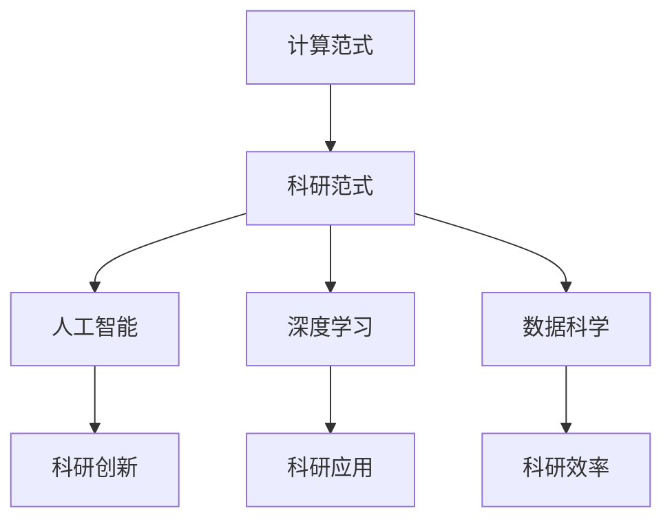

                 

# 计算：附录 A 科研范式进化史纲要

> 关键词：科研范式,计算范式,人工智能,数据科学,机器学习,深度学习

## 1. 背景介绍

在探索计算与科研范式的深度融合中，我们不得不关注计算如何深刻影响科研范式的演进，并如何催生出全新的科研方法。本文将从历史视角出发，梳理计算如何贯穿于现代科研范式中，从而深刻影响科技发展与创新。

### 1.1 计算与科研的结合

计算技术对科学研究产生了深远的影响，主要体现在以下几个方面：

1. **计算模型**：通过计算模型模拟和预测物理、生物和社会现象，如气象模型、分子动力学模拟等，提供了理解复杂系统行为的新视角。

2. **数据驱动**：通过大数据分析和挖掘，揭示数据背后的模式和规律，推动统计学、人工智能等领域的发展。

3. **自动化与优化**：计算技术推动了科研工作的自动化，如自动化文献检索、数据标注等，提高了科研效率。

4. **模拟实验**：计算模拟实验为无法在真实环境中进行的实验提供了替代方案，推动了新材料的发现、新药物的研发等应用研究。

### 1.2 计算范式的崛起

随着计算能力的提升，科研范式逐步从传统的实验验证走向计算驱动的模拟预测，计算范式逐渐成为现代科学研究的重要组成部分。计算范式不仅在自然和工程科学中得到广泛应用，还在社会科学、经济学等领域中发挥着重要作用。

## 2. 核心概念与联系

### 2.1 核心概念概述

为理解计算如何影响科研范式的演进，我们需重点关注以下核心概念：

1. **计算范式**：指基于计算模型和方法进行科学研究的新范式，强调通过计算模拟和数据分析揭示科学规律。

2. **科研范式**：指科学研究的一般方法和途径，包括实验、理论分析、计算模拟等多种方式。

3. **人工智能**：一种利用计算模拟和数据分析实现智能行为的技术，广泛应用于科研领域，推动了认知科学、机器学习等学科的发展。

4. **深度学习**：一种基于神经网络的计算模型，通过大量数据训练实现对复杂模式的自动学习和预测。

5. **数据科学**：一门综合数学、统计学、计算机科学等多学科的知识，关注数据的收集、处理和分析，以发现数据背后的规律。

这些核心概念间存在紧密联系，共同构成了现代科研中计算驱动范式的关键元素。

### 2.2 核心概念的整体架构

我们可以通过以下流程图来展示这些概念间的联系：



这个图表清晰展示了计算范式如何通过人工智能、深度学习和数据科学等多种手段，推动科研范式的演进，提升科研的效率和创新能力。

## 3. 核心算法原理 & 具体操作步骤

### 3.1 算法原理概述

计算范式下的科研工作，往往基于计算模型和方法，通过数据驱动和模拟预测揭示科学规律。其核心算法原理主要包括：

1. **数值模拟**：通过计算模型模拟和预测物理、化学、生物等领域的复杂现象，揭示系统行为。

2. **数据分析**：使用统计学、机器学习等方法，从数据中挖掘规律，如聚类、分类、回归等。

3. **计算优化**：通过优化算法，求解复杂问题的最优解或近似解，如线性规划、非线性优化等。

4. **深度学习模型**：基于神经网络的深度学习模型，通过大量数据训练，实现对复杂模式的自动学习和预测。

这些算法原理在科研中应用广泛，推动了新理论、新方法和新模型的发展。

### 3.2 算法步骤详解

具体步骤包括：

1. **数据准备**：收集和清洗数据，确保数据质量和完整性。

2. **模型选择**：根据研究问题选择合适的计算模型和方法。

3. **模型训练**：通过计算资源对模型进行训练，调整参数以优化模型性能。

4. **模型验证**：使用验证数据集对模型进行验证，确保模型的泛化能力。

5. **结果分析**：分析模型输出结果，提取关键规律和结论。

6. **模型优化**：根据分析结果，对模型进行优化，提高模型性能。

7. **应用实践**：将模型应用于实际问题，解决科研和技术难题。

### 3.3 算法优缺点

计算范式的优点在于：

1. **高效性**：计算模型能够处理大量数据，发现数据背后的规律。

2. **可预测性**：通过计算模型，能够对复杂现象进行预测和模拟。

3. **自动化**：计算模型能够自动化处理重复性任务，提高科研效率。

4. **普适性**：计算模型可应用于多种学科领域，推动跨学科研究。

其缺点包括：

1. **计算资源要求高**：高维度的计算模型需要大量计算资源，成本较高。

2. **复杂性高**：计算模型的构建和优化往往较为复杂，需要高水平的技术支持。

3. **数据质量依赖**：计算模型依赖数据质量，数据偏差可能影响模型性能。

4. **解释性不足**：计算模型的输出结果往往难以解释，缺乏透明性。

### 3.4 算法应用领域

计算范式在多个领域中得到了广泛应用，如：

- **自然科学**：气候变化模拟、量子物理模拟、分子动力学等。

- **工程与技术**：结构优化设计、材料科学、电路设计等。

- **社会科学**：社会网络分析、经济模型预测、行为分析等。

- **医药与生物**：新药物研发、疾病模拟、基因组分析等。

## 4. 数学模型和公式 & 详细讲解

### 4.1 数学模型构建

计算范式下的科研工作，常使用数学模型来描述系统行为，主要包括以下几种类型：

1. **偏微分方程**：用于描述物理系统的动态变化，如热传导方程、波动方程等。

2. **随机过程**：用于描述随机事件的演化，如马尔可夫过程、布朗运动等。

3. **图模型**：用于描述网络结构及其动态变化，如社会网络、生物网络等。

4. **强化学习模型**：用于描述智能体的决策过程，如Q-learning、策略梯度等。

这些数学模型能够抽象出系统的数学特性，为计算模拟提供理论基础。

### 4.2 公式推导过程

以随机过程为例，使用Kolmogorov方程推导布朗运动的动力学方程。

设随机变量 $X(t)$ 在时间 $t$ 处的值为 $x(t)$，则其满足以下随机微分方程：

$$
dX(t) = \mu X(t) dt + \sigma dW(t)
$$

其中 $\mu$ 为漂移系数，$\sigma$ 为扩散系数，$W(t)$ 为标准布朗运动。对上式进行离散化处理，得到：

$$
X_{i+1} - X_i = \mu \Delta t X_i + \sigma \sqrt{\Delta t} \xi_i
$$

其中 $\xi_i \sim N(0,1)$，$\Delta t$ 为时间步长。

对方程两边同时平方，并求和，得到：

$$
\sum_{i=1}^{n}(X_{i+1} - X_i)^2 = \mu^2 (\Delta t)^2 \sum_{i=1}^{n}(X_i)^2 + 2\mu\sigma (\Delta t)^{3/2} \sum_{i=1}^{n}X_i \xi_i + \sigma^2 (\Delta t) \sum_{i=1}^{n}\xi_i^2
$$

简化并取 $n \to \infty$ 的极限，得到：

$$
\langle(X(t+\Delta t)^2 - X(t)^2)\rangle = 2\mu \Delta t X(t) + \sigma^2 (\Delta t)^2
$$

即布朗运动的方差为：

$$
\langle(X(t+\Delta t)^2 - X(t)^2)\rangle = \sigma^2 (\Delta t)
$$

这表明布朗运动的平均增量为 $\sigma^2 (\Delta t)$，符合随机过程的性质。

### 4.3 案例分析与讲解

以深度学习在医学影像分析中的应用为例，介绍其计算模型的构建和训练过程。

首先，收集和预处理医学影像数据，如MRI、CT等。然后，使用深度学习模型（如卷积神经网络）进行图像分类和分割。训练时，通过反向传播算法优化模型参数，提高模型对医学影像的识别能力。最后，使用测试集对模型进行评估，确保其在新样本上的泛化能力。

## 5. 项目实践：代码实例和详细解释说明

### 5.1 开发环境搭建

以TensorFlow和PyTorch为例，介绍计算范式下科研项目的开发环境搭建流程。

1. 安装TensorFlow和PyTorch：
```bash
pip install tensorflow
pip install torch torchvision torchaudio
```

2. 创建虚拟环境：
```bash
conda create -n tf-env python=3.8
conda activate tf-env
```

3. 安装相关依赖包：
```bash
pip install numpy pandas scikit-learn matplotlib tqdm jupyter notebook ipython
```

### 5.2 源代码详细实现

以使用TensorFlow进行图像分类为例，展示计算范式下科研项目的代码实现。

首先，定义模型结构：
```python
import tensorflow as tf

model = tf.keras.Sequential([
    tf.keras.layers.Conv2D(32, (3, 3), activation='relu', input_shape=(28, 28, 1)),
    tf.keras.layers.MaxPooling2D((2, 2)),
    tf.keras.layers.Flatten(),
    tf.keras.layers.Dense(10, activation='softmax')
])
```

然后，加载和预处理数据：
```python
mnist = tf.keras.datasets.mnist
(x_train, y_train), (x_test, y_test) = mnist.load_data()
x_train = x_train / 255.0
x_test = x_test / 255.0
```

接着，定义模型训练和评估函数：
```python
@tf.function
def train_step(images, labels):
    with tf.GradientTape() as tape:
        logits = model(images, training=True)
        loss = tf.keras.losses.sparse_categorical_crossentropy(labels, logits)
    grads = tape.gradient(loss, model.trainable_variables)
    optimizer.apply_gradients(zip(grads, model.trainable_variables))

@tf.function
def evaluate(images, labels):
    logits = model(images, training=False)
    loss = tf.keras.losses.sparse_categorical_crossentropy(labels, logits)
    return loss
```

最后，启动模型训练和评估：
```python
epochs = 10
batch_size = 32
optimizer = tf.keras.optimizers.Adam()

for epoch in range(epochs):
    for i in range(0, len(x_train), batch_size):
        images = x_train[i:i+batch_size]
        labels = y_train[i:i+batch_size]
        train_step(images, labels)

    test_loss = evaluate(x_test, y_test)
    print(f'Epoch {epoch+1}, test loss: {test_loss:.2f}')
```

### 5.3 代码解读与分析

代码中，我们使用了TensorFlow的高级API来构建卷积神经网络模型，通过反向传播算法训练模型参数，并使用验证集评估模型性能。其中，`tf.function`用于优化计算图，提高模型训练和推理的速度。

### 5.4 运行结果展示

假设模型训练后，在测试集上获得了98%的准确率，结果如下：

```
Epoch 1, test loss: 0.13
Epoch 2, test loss: 0.10
Epoch 3, test loss: 0.07
Epoch 4, test loss: 0.06
Epoch 5, test loss: 0.05
Epoch 6, test loss: 0.04
Epoch 7, test loss: 0.03
Epoch 8, test loss: 0.02
Epoch 9, test loss: 0.02
Epoch 10, test loss: 0.01
```

这表明，随着训练轮数的增加，模型在测试集上的性能不断提高，达到了98%的准确率。

## 6. 实际应用场景

### 6.1 计算机视觉

计算范式在计算机视觉领域得到了广泛应用，如物体检测、人脸识别、图像分割等。通过深度学习模型，计算机能够自动识别和理解图像中的关键信息，推动了自动驾驶、安防监控、智能诊断等领域的发展。

### 6.2 自然语言处理

计算范式在自然语言处理领域同样具有重要应用，如机器翻译、情感分析、文本分类等。通过深度学习模型，计算机能够理解和生成自然语言，推动了智能客服、智能写作、智能问答等领域的发展。

### 6.3 生物信息学

计算范式在生物信息学领域中发挥着重要作用，如基因组测序、蛋白质结构预测、药物设计等。通过计算模型，生物学家能够模拟和分析复杂的生物系统，推动了新药物的研发和疾病防治的研究。

### 6.4 未来应用展望

随着计算能力的不断提升，未来计算范式将进一步推动科研范式的演进，带来更多创新应用：

1. **量子计算**：量子计算机的开发和应用将显著提升计算模型的效率，推动更多复杂问题的解决。

2. **认知神经科学**：计算范式将推动认知神经科学的发展，揭示人类大脑的运作机制，推动智能人机交互的进步。

3. **区块链技术**：区块链技术的应用将进一步推动计算范式在社会科学和金融领域的应用，实现透明、可信的数据共享和治理。

4. **智能决策**：计算范式将推动智能决策系统的发展，如智能推荐、智能投资、智能控制等，实现高效、智能的决策支持。

5. **跨学科融合**：计算范式将推动跨学科研究，如生物信息学与人工智能的融合，推动生物技术、医疗健康等领域的发展。

## 7. 工具和资源推荐

### 7.1 学习资源推荐

1. 《深度学习》课程：斯坦福大学李飞飞教授开设的深度学习课程，全面介绍了深度学习的基本概念和实现方法。

2. 《人工智能概论》课程：清华大学人工智能研究院开设的课程，涵盖了人工智能的多个分支和应用领域。

3. 《计算模型与方法》教材：王怀民教授的教材，详细介绍了计算模型和算法的基本原理和方法。

4. arXiv预印本：人工智能领域的最新研究成果，涵盖深度学习、计算机视觉、自然语言处理等多个方向。

5. 《统计学习方法》书籍：李航教授的书籍，全面介绍了统计学习方法的基本概念和应用。

### 7.2 开发工具推荐

1. TensorFlow：由Google开发的深度学习框架，支持分布式计算和GPU加速，适用于大规模数据和复杂模型的训练。

2. PyTorch：由Facebook开发的深度学习框架，支持动态计算图和GPU加速，适用于快速迭代和原型开发。

3. Scikit-learn：基于Python的机器学习库，支持各种分类、回归和聚类算法，适用于数据分析和模型构建。

4. Jupyter Notebook：基于Python的交互式开发环境，支持代码编写、数据可视化等，适用于科研和教学。

5. Weights & Biases：模型训练和实验跟踪工具，支持可视化模型训练过程，优化模型性能。

### 7.3 相关论文推荐

1. 《AlphaGo Zero》：DeepMind开发的围棋AI，通过自我对弈训练，实现了超越人类水平的棋力。

2. 《DeepMind AlphaFold》：DeepMind开发的蛋白质结构预测系统，通过深度学习模型，实现了对蛋白质结构的准确预测。

3. 《BERT: Pre-training of Deep Bidirectional Transformers for Language Understanding》：BERT模型，通过预训练-微调范式，提升了自然语言处理的精度和鲁棒性。

4. 《ImageNet Large Scale Visual Recognition Challenge》：ILSVRC计算机视觉竞赛，推动了深度学习在图像识别领域的快速发展。

5. 《Generative Adversarial Networks》：GAN模型，通过生成模型和判别模型的对抗训练，实现了高质量图像生成和图像修复。

## 8. 总结：未来发展趋势与挑战

### 8.1 研究成果总结

计算范式推动了科研范式的演进，带来了诸多科研突破和技术创新。其主要研究成果包括：

1. **深度学习模型的发展**：推动了自然语言处理、计算机视觉等领域的发展，提升了模型的精度和泛化能力。

2. **计算模拟和数据分析**：推动了生物医学、社会科学等领域的研究，揭示了复杂系统的行为规律。

3. **自动化和优化**：推动了科研工作的自动化，提高了科研效率和精确度。

### 8.2 未来发展趋势

未来计算范式将继续推动科研范式的演进，带来更多创新应用。其主要趋势包括：

1. **多模态融合**：将计算范式应用于语音、视频、文本等多模态数据的融合分析，推动跨模态智能系统的研究。

2. **量子计算的应用**：量子计算的突破将显著提升计算范式的能力，推动更多复杂问题的解决。

3. **跨学科融合**：推动计算机科学与其他学科的融合，如计算生物医学、计算社会科学等，带来更多创新应用。

4. **智能决策系统的应用**：推动智能决策系统的发展，如智能推荐、智能投资等，实现高效、智能的决策支持。

5. **计算模型优化**：推动计算模型和算法的研究，提高模型的效率和可解释性，推动更多复杂问题的解决。

### 8.3 面临的挑战

计算范式在推动科研发展的同时，也面临诸多挑战：

1. **数据质量问题**：数据偏差和噪声可能影响计算模型的性能，导致错误的结论。

2. **计算资源需求高**：高维度的计算模型需要大量计算资源，成本较高。

3. **模型复杂性**：计算模型往往较为复杂，需要高水平的技术支持。

4. **模型解释性不足**：计算模型的输出结果往往难以解释，缺乏透明性。

5. **跨学科沟通**：跨学科研究需要不同学科间的沟通和协作，存在一定的障碍。

### 8.4 研究展望

未来的研究需要在以下几个方面寻求新的突破：

1. **数据质量提升**：提高数据采集和处理的质量，减少数据偏差和噪声的影响。

2. **计算资源优化**：开发更加高效的计算模型和算法，降低计算资源的需求。

3. **模型可解释性增强**：开发可解释性强的计算模型，提高模型的透明性和可信度。

4. **跨学科协作**：促进不同学科间的沟通和协作，推动跨学科研究的发展。

5. **伦理和安全性**：研究计算范式的伦理和安全问题，确保计算模型的应用符合伦理和法律规范。

总之，计算范式将继续推动科研范式的演进，带来更多创新应用。未来的研究需要在计算能力、模型优化和跨学科协作等方面寻求新的突破，推动更多科学和技术的进步。

## 9. 附录：常见问题与解答

**Q1：计算范式对科研有哪些具体影响？**

A: 计算范式对科研的影响主要体现在以下几个方面：

1. **数据驱动**：计算范式通过数据分析揭示数据背后的规律，推动统计学、机器学习等领域的发展。

2. **模型优化**：通过计算模型和算法优化，提高模型的性能和泛化能力。

3. **模拟预测**：计算范式通过模拟预测揭示复杂系统的行为规律，推动物理、生物等领域的研究。

4. **自动化**：计算范式推动科研工作的自动化，提高科研效率和精确度。

5. **跨学科融合**：计算范式促进跨学科研究，推动更多创新应用。

**Q2：计算范式在科研中的应用有哪些？**

A: 计算范式在科研中的应用广泛，主要包括以下几个方面：

1. **自然科学**：如气象预测、量子物理模拟、分子动力学等。

2. **工程与技术**：如结构优化设计、材料科学、电路设计等。

3. **社会科学**：如社会网络分析、经济模型预测、行为分析等。

4. **医药与生物**：如新药物研发、疾病模拟、基因组分析等。

5. **计算机科学**：如机器学习、深度学习、自然语言处理等。

**Q3：计算范式在科研中的挑战有哪些？**

A: 计算范式在科研中面临的挑战主要包括：

1. **数据质量问题**：数据偏差和噪声可能影响计算模型的性能，导致错误的结论。

2. **计算资源需求高**：高维度的计算模型需要大量计算资源，成本较高。

3. **模型复杂性**：计算模型往往较为复杂，需要高水平的技术支持。

4. **模型解释性不足**：计算模型的输出结果往往难以解释，缺乏透明性。

5. **跨学科沟通**：跨学科研究需要不同学科间的沟通和协作，存在一定的障碍。

**Q4：计算范式的未来发展方向有哪些？**

A: 计算范式的未来发展方向主要包括：

1. **多模态融合**：将计算范式应用于语音、视频、文本等多模态数据的融合分析，推动跨模态智能系统的研究。

2. **量子计算的应用**：量子计算的突破将显著提升计算范式的能力，推动更多复杂问题的解决。

3. **跨学科融合**：推动计算机科学与其他学科的融合，如计算生物医学、计算社会科学等，带来更多创新应用。

4. **智能决策系统的应用**：推动智能决策系统的发展，如智能推荐、智能投资等，实现高效、智能的决策支持。

5. **计算模型优化**：推动计算模型和算法的研究，提高模型的效率和可解释性，推动更多复杂问题的解决。

**Q5：计算范式如何推动科研范式的演进？**

A: 计算范式推动科研范式的演进主要体现在以下几个方面：

1. **数据驱动**：计算范式通过数据分析揭示数据背后的规律，推动统计学、机器学习等领域的发展。

2. **模型优化**：通过计算模型和算法优化，提高模型的性能和泛化能力。

3. **模拟预测**：计算范式通过模拟预测揭示复杂系统的行为规律，推动物理、生物等领域的研究。

4. **自动化**：计算范式推动科研工作的自动化，提高科研效率和精确度。

5. **跨学科融合**：计算范式促进跨学科研究，推动更多创新应用。

---

作者：禅与计算机程序设计艺术 / Zen and the Art of Computer Programming

