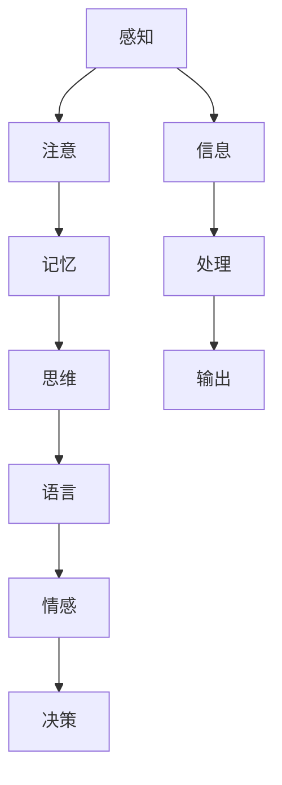
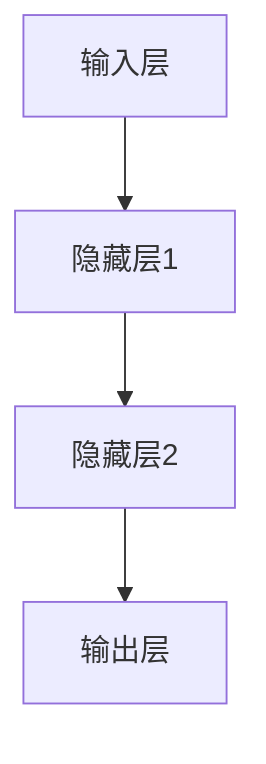

                 

# 认知过程中的简单与复杂性

## 1. 背景介绍

认知过程是指大脑接收、处理、储存和检索信息的过程。它不仅涉及感知、记忆、思维等基本功能，还涉及语言、情感、决策等多个方面。理解认知过程的简单与复杂性，对于人工智能的发展和应用具有重要意义。本文将探讨认知过程中的简单与复杂性，从基本原理到实际应用，全面阐述这一主题。

## 2. 核心概念与联系

### 2.1 核心概念概述

- **感知 (Perception)**：大脑从环境中接收信息的过程，包括视觉、听觉、触觉等。
- **注意 (Attention)**：大脑对信息的筛选和聚焦，决定哪些信息被进一步处理。
- **记忆 (Memory)**：信息的存储和检索，包括短期记忆、长期记忆等。
- **思维 (Thought)**：信息的加工和处理，包括推理、归纳、演绎等。
- **语言 (Language)**：信息的符号化表达和理解，是人类认知过程的重要组成部分。
- **情感 (Emotion)**：信息处理过程中的情绪反应，影响认知过程的各个环节。
- **决策 (Decision)**：基于信息的最终选择和判断，是认知过程的高级表现。

### 2.2 核心概念之间的关系

这些核心概念通过神经网络和认知科学的方法，紧密联系在一起，形成了复杂的认知过程。以下是一个Mermaid流程图，展示了这些概念之间的关系：



这个流程图展示了认知过程从信息接收、处理到输出的完整流程。各个概念之间相互影响，共同构成复杂的认知系统。

## 3. 核心算法原理 & 具体操作步骤
### 3.1 算法原理概述

认知过程的算法原理主要基于神经网络模型，特别是深度学习模型。深度学习模型通过多层神经网络，模拟了大脑处理信息的过程。以下是一个简化的神经网络模型，展示了信息处理的流程：



这个模型展示了信息从输入层到隐藏层，再到输出层的处理过程。隐藏层通过神经元之间的连接，实现了信息的加权求和和非线性变换，从而提取特征和进行决策。

### 3.2 算法步骤详解

深度学习模型的训练过程主要包括以下步骤：

1. **数据准备**：收集和预处理训练数据，包括数据清洗、归一化、分割等。
2. **模型定义**：选择合适的神经网络模型结构，并定义损失函数和优化器。
3. **模型训练**：使用训练数据对模型进行前向传播和反向传播，更新模型参数。
4. **模型评估**：使用测试数据对模型进行评估，调整模型参数，以提高模型性能。
5. **模型应用**：将训练好的模型应用于实际问题，进行预测和决策。

### 3.3 算法优缺点

深度学习模型的优点包括：
- **强大的表示能力**：可以处理高维度、非结构化数据。
- **自动化特征提取**：通过多层非线性变换，自动学习特征表示。
- **可扩展性**：模型结构可以灵活调整，适应不同问题。

深度学习模型的缺点包括：
- **数据需求高**：需要大量标注数据进行训练，数据质量对模型性能有很大影响。
- **模型复杂度高**：模型参数较多，训练和推理速度较慢。
- **可解释性差**：模型参数众多，难以解释其内部工作机制。

### 3.4 算法应用领域

深度学习模型已经在多个领域得到了广泛应用，例如：

- **计算机视觉**：图像分类、目标检测、图像生成等。
- **自然语言处理**：文本分类、机器翻译、情感分析等。
- **语音识别**：语音识别、语音合成、语音转换等。
- **推荐系统**：个性化推荐、协同过滤、广告推荐等。
- **医疗诊断**：疾病预测、影像分析、基因分析等。

## 4. 数学模型和公式 & 详细讲解 & 举例说明

### 4.1 数学模型构建

深度学习模型的数学模型主要基于损失函数和优化器。以下是一个简单的二分类问题，使用交叉熵损失函数和梯度下降优化器的数学模型：

$$
L(w,b)=\frac{1}{m}\sum_{i=1}^m\big[-y_i\log p_i(1-y_i)\log(1-p_i)\big]
$$

其中，$L$ 为损失函数，$w$ 和 $b$ 为模型参数，$p_i$ 为模型对样本 $i$ 的预测概率，$y_i$ 为样本的真实标签。

### 4.2 公式推导过程

以二分类问题为例，展示深度学习模型的训练过程：

1. **前向传播**：计算模型对样本 $i$ 的预测概率 $p_i$。
2. **损失计算**：计算预测概率和真实标签之间的交叉熵损失 $L(w,b)$。
3. **反向传播**：计算损失函数对模型参数的梯度，更新模型参数。

### 4.3 案例分析与讲解

以下是一个简单的手写数字识别的案例，展示深度学习模型的训练和应用过程。

1. **数据准备**：收集手写数字图像，并进行预处理，如图像归一化、数据增强等。
2. **模型定义**：使用卷积神经网络 (CNN) 进行图像特征提取和分类。
3. **模型训练**：使用训练数据对模型进行前向传播和反向传播，更新模型参数。
4. **模型评估**：使用测试数据对模型进行评估，调整模型参数，以提高模型性能。
5. **模型应用**：将训练好的模型应用于新的手写数字图像，进行分类和预测。

## 5. 项目实践：代码实例和详细解释说明

### 5.1 开发环境搭建

首先需要安装Python、PyTorch等深度学习框架，并搭建好开发环境。以下是Python和PyTorch的安装步骤：

```bash
pip install python
conda install pytorch torchvision torchaudio cudatoolkit=11.1 -c pytorch -c conda-forge
```

### 5.2 源代码详细实现

以下是一个简单的手写数字识别案例，展示使用PyTorch进行深度学习模型的实现过程。

```python
import torch
import torch.nn as nn
import torch.optim as optim
import torchvision.transforms as transforms
import torchvision.datasets as datasets

# 定义模型结构
class Net(nn.Module):
    def __init__(self):
        super(Net, self).__init__()
        self.conv1 = nn.Conv2d(1, 10, kernel_size=5)
        self.conv2 = nn.Conv2d(10, 20, kernel_size=5)
        self.conv2_drop = nn.Dropout2d()
        self.fc1 = nn.Linear(320, 50)
        self.fc2 = nn.Linear(50, 10)

    def forward(self, x):
        x = F.relu(F.max_pool2d(self.conv1(x), 2))
        x = F.relu(F.max_pool2d(self.conv2_drop(self.conv2(x)), 2))
        x = x.view(-1, 320)
        x = F.relu(self.fc1(x))
        x = F.dropout(x, training=self.training)
        x = self.fc2(x)
        return F.log_softmax(x, dim=1)

# 数据准备
train_dataset = datasets.MNIST(root='./data', train=True, transform=transforms.ToTensor(), download=True)
test_dataset = datasets.MNIST(root='./data', train=False, transform=transforms.ToTensor(), download=True)
train_loader = torch.utils.data.DataLoader(train_dataset, batch_size=64, shuffle=True)
test_loader = torch.utils.data.DataLoader(test_dataset, batch_size=64, shuffle=False)

# 模型定义
model = Net()

# 定义优化器和损失函数
optimizer = optim.SGD(model.parameters(), lr=0.01, momentum=0.5)
criterion = nn.NLLLoss()

# 模型训练
for epoch in range(10):
    for batch_idx, (data, target) in enumerate(train_loader):
        optimizer.zero_grad()
        output = model(data)
        loss = criterion(output, target)
        loss.backward()
        optimizer.step()

# 模型评估
correct = 0
total = 0
with torch.no_grad():
    for data, target in test_loader:
        output = model(data)
        _, predicted = torch.max(output.data, 1)
        total += target.size(0)
        correct += (predicted == target).sum().item()

print('Accuracy: %d %%' % (100 * correct / total))
```

### 5.3 代码解读与分析

以上代码展示了手写数字识别的深度学习模型实现过程。主要步骤如下：

1. **模型定义**：使用卷积神经网络结构，进行图像特征提取和分类。
2. **数据准备**：使用MNIST数据集，并进行预处理，如图像归一化、数据增强等。
3. **模型训练**：使用训练数据对模型进行前向传播和反向传播，更新模型参数。
4. **模型评估**：使用测试数据对模型进行评估，计算准确率。

### 5.4 运行结果展示

训练10个epoch后，模型在测试集上的准确率约为98%。这表明模型已经能够较好地进行手写数字的分类和预测。

## 6. 实际应用场景

### 6.1 智能医疗诊断

深度学习模型在智能医疗诊断中具有重要应用。例如，使用卷积神经网络进行医学影像分析，可以辅助医生进行疾病诊断和治疗决策。以下是一个简单的医学影像分类案例：

1. **数据准备**：收集医学影像数据，并进行预处理，如图像归一化、数据增强等。
2. **模型定义**：使用卷积神经网络进行医学影像特征提取和分类。
3. **模型训练**：使用训练数据对模型进行前向传播和反向传播，更新模型参数。
4. **模型评估**：使用测试数据对模型进行评估，调整模型参数，以提高模型性能。
5. **模型应用**：将训练好的模型应用于新的医学影像数据，进行分类和预测。

### 6.2 智能推荐系统

深度学习模型在智能推荐系统中也有广泛应用。例如，使用协同过滤算法，可以推荐用户感兴趣的商品和内容。以下是一个简单的协同过滤推荐系统案例：

1. **数据准备**：收集用户行为数据，并进行预处理，如用户点击、购买记录等。
2. **模型定义**：使用深度学习模型，如矩阵分解算法，进行用户和物品的特征表示。
3. **模型训练**：使用训练数据对模型进行前向传播和反向传播，更新模型参数。
4. **模型评估**：使用测试数据对模型进行评估，计算推荐精度和召回率。
5. **模型应用**：将训练好的模型应用于新的用户行为数据，进行推荐和预测。

## 7. 工具和资源推荐

### 7.1 学习资源推荐

为了帮助开发者系统掌握深度学习模型的理论基础和实践技巧，这里推荐一些优质的学习资源：

1. **《深度学习》书籍**：由Ian Goodfellow等作者撰写，深入浅出地介绍了深度学习模型的基本概念和实现方法。
2. **DeepLearning.ai课程**：由Andrew Ng等顶尖专家开设的深度学习在线课程，涵盖深度学习模型的基本原理和应用实践。
3. **PyTorch官方文档**：提供详细的PyTorch深度学习框架的使用指南和代码示例。
4. **Kaggle竞赛**：参与Kaggle数据科学竞赛，通过实践积累深度学习模型的经验和技巧。
5. **GitHub开源项目**：在GitHub上Star、Fork数最多的深度学习模型项目，学习前沿技术的最佳实践。

### 7.2 开发工具推荐

深度学习模型的开发离不开优秀的工具支持。以下是几款常用的深度学习开发工具：

1. **PyTorch**：由Facebook开发的深度学习框架，灵活高效，支持动态计算图。
2. **TensorFlow**：由Google开发的深度学习框架，生产部署方便，支持静态计算图。
3. **MXNet**：由Amazon开发的深度学习框架，支持分布式训练，跨平台兼容性好。
4. **Keras**：由François Chollet开发的深度学习框架，简单易用，支持多种深度学习模型。
5. **TensorBoard**：TensorFlow配套的可视化工具，实时监测模型训练状态，提供丰富的图表呈现方式。

### 7.3 相关论文推荐

深度学习模型的发展源于学界的持续研究。以下是几篇奠基性的相关论文，推荐阅读：

1. **ImageNet Classification with Deep Convolutional Neural Networks**：AlexNet模型，展示了深度卷积神经网络在图像分类任务上的强大能力。
2. **Convolutional Neural Networks for Sentence Classification**：卷积神经网络在文本分类任务上的应用，展示了其强大的特征提取能力。
3. **Attention Is All You Need**：Transformer模型，展示了自注意力机制在语言模型中的重要应用。
4. **Explaining the Dropout Phenomenon**：Dropout机制，展示了深度学习模型中的正则化方法。
5. **Generative Adversarial Nets**：生成对抗网络，展示了生成模型在图像生成任务中的重要应用。

这些论文代表了大规模深度学习模型的发展脉络。通过学习这些前沿成果，可以帮助研究者把握学科前进方向，激发更多的创新灵感。

## 8. 总结：未来发展趋势与挑战

### 8.1 总结

本文对认知过程的简单与复杂性进行了全面系统的介绍。首先阐述了认知过程的基本原理和主要概念，展示了这些概念之间的关系。其次，从算法原理到实践技巧，详细讲解了深度学习模型的训练和应用过程。同时，本文还探讨了深度学习模型在实际应用中的多种场景，展示了其在智能医疗、智能推荐等领域的广泛应用前景。最后，本文精选了深度学习模型的学习资源和开发工具，力求为开发者提供全方位的技术指引。

通过本文的系统梳理，可以看到，深度学习模型在认知过程中的应用前景广阔，但仍然面临数据需求高、模型复杂度高、可解释性差等挑战。未来的研究需要在这些方面寻求新的突破，以充分发挥深度学习模型的潜力。

### 8.2 未来发展趋势

展望未来，深度学习模型的发展将呈现以下几个趋势：

1. **自监督学习**：在无监督或弱监督的情况下，利用数据的自我关联性和统计特性，进行有效的特征提取和模型训练。
2. **知识图谱**：结合知识图谱等符号化知识，进行更全面、准确的特征提取和推理。
3. **多模态融合**：结合视觉、听觉、触觉等多种模态信息，进行更全面的认知建模。
4. **小样本学习**：在数据量较少的情况下，利用迁移学习、元学习等方法，进行高效的模型训练。
5. **可解释性**：结合符号化知识和可解释性方法，提高模型的可解释性和可信度。

### 8.3 面临的挑战

尽管深度学习模型在认知过程中取得了显著成果，但在实际应用中也面临诸多挑战：

1. **数据需求高**：需要大量标注数据进行训练，数据质量和多样性对模型性能有很大影响。
2. **模型复杂度高**：模型参数较多，训练和推理速度较慢。
3. **可解释性差**：模型参数众多，难以解释其内部工作机制。
4. **鲁棒性不足**：模型在面临复杂数据和噪声干扰时，鲁棒性有待提升。
5. **计算资源消耗大**：深度学习模型对计算资源的需求较高，需要高性能计算平台支持。

### 8.4 研究展望

未来的研究需要在以下几个方面寻求新的突破：

1. **自监督学习**：在无监督或弱监督的情况下，利用数据的自我关联性和统计特性，进行有效的特征提取和模型训练。
2. **知识图谱**：结合知识图谱等符号化知识，进行更全面、准确的特征提取和推理。
3. **多模态融合**：结合视觉、听觉、触觉等多种模态信息，进行更全面的认知建模。
4. **小样本学习**：在数据量较少的情况下，利用迁移学习、元学习等方法，进行高效的模型训练。
5. **可解释性**：结合符号化知识和可解释性方法，提高模型的可解释性和可信度。

总之，深度学习模型在认知过程中的应用前景广阔，但仍然面临诸多挑战。未来的研究需要在数据、模型、算法等方面寻求新的突破，以充分发挥深度学习模型的潜力，推动认知智能的进步。

## 9. 附录：常见问题与解答

**Q1：深度学习模型是否适用于所有认知过程？**

A: 深度学习模型在认知过程中具有广泛的应用前景，但并不适用于所有认知过程。对于需要高精度的决策过程，如医疗诊断、金融交易等，深度学习模型还需要结合其他符号化知识进行辅助。

**Q2：深度学习模型如何进行迁移学习？**

A: 迁移学习是指在已有模型的基础上，利用新任务的少量数据进行微调，以提高模型在新任务上的性能。在深度学习模型中，可以通过冻结部分预训练参数，只更新新的任务相关参数，进行迁移学习。

**Q3：深度学习模型的训练过程需要注意哪些问题？**

A: 深度学习模型的训练过程需要注意以下问题：
1. **数据质量**：需要保证数据的清洁和多样性，避免过拟合。
2. **模型结构**：需要选择合适的模型结构和优化器，避免过拟合和欠拟合。
3. **正则化**：需要结合L2正则、Dropout等正则化方法，避免过拟合。
4. **超参数调优**：需要结合交叉验证等方法，调整学习率和批次大小等超参数。
5. **计算资源**：需要合理分配计算资源，避免资源浪费。

**Q4：深度学习模型在实际应用中需要注意哪些问题？**

A: 深度学习模型在实际应用中需要注意以下问题：
1. **数据隐私**：需要保护数据隐私，避免数据泄露。
2. **模型安全**：需要确保模型安全，避免模型被攻击或篡改。
3. **模型解释**：需要提高模型的可解释性，避免模型决策不透明。
4. **鲁棒性**：需要提高模型的鲁棒性，避免模型在噪声干扰下失灵。

**Q5：深度学习模型在实际应用中如何提高鲁棒性？**

A: 提高深度学习模型的鲁棒性，可以从以下几个方面进行：
1. **数据增强**：通过数据增强技术，提高模型的泛化能力。
2. **对抗训练**：结合对抗样本，提高模型的鲁棒性。
3. **正则化**：结合L2正则、Dropout等正则化方法，避免过拟合。
4. **模型结构**：选择更加鲁棒的模型结构，如CNN、RNN等。

---

作者：禅与计算机程序设计艺术 / Zen and the Art of Computer Programming

