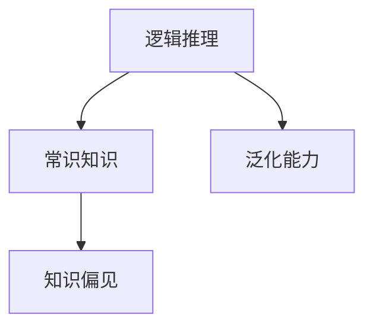
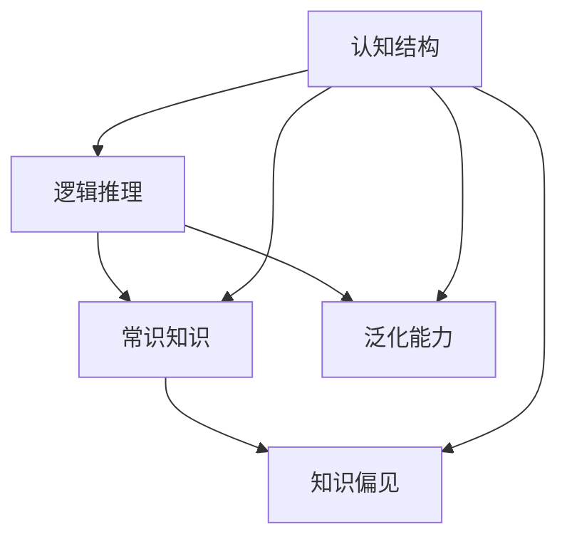

                 

# 语言与思维：大模型的认知盲区

大语言模型，如GPT-3和BERT等，近年来在自然语言处理领域取得了巨大的突破，展示了强大的语言理解和生成能力。然而，在这些大模型的辉煌背后，隐藏着它们在认知和逻辑推理方面的盲区。本文将深入探讨大模型的认知盲区，分析其原因，并提出改进建议，以期推动大模型的发展方向。

## 1. 背景介绍

### 1.1 问题由来

随着深度学习和大数据技术的发展，大语言模型在文本生成、问答、翻译等任务上展现了超乎寻常的性能。然而，在复杂推理和逻辑任务中，大语言模型却表现平平，甚至不如传统规则模型。例如，GPT-3尽管在情感分类等简单任务上表现出色，但在解决诸如“飞机为什么能飞”这类复杂推理问题时，往往输出错误或不相关的答案。

### 1.2 问题核心关键点

大模型的认知盲区主要体现在以下几个方面：
1. **逻辑推理能力不足**：大模型在处理复杂逻辑推理问题时表现不佳。
2. **常识知识缺乏**：模型无法整合先验知识，常常对真实世界的不确定性无法作出合理判断。
3. **依赖上下文**：模型依赖上下文信息进行推理，难以处理跨段落或文档级别的逻辑结构。
4. **泛化能力受限**：模型在未见过的情境下推理能力弱，无法有效泛化到新数据。
5. **知识偏见**：模型可能继承训练数据中的偏见，产生有争议或不公平的输出。

### 1.3 问题研究意义

研究大模型的认知盲区，对于提升模型性能、促进AI伦理发展具有重要意义：
1. **提升模型性能**：通过识别和弥补盲区，可以改进模型推理能力，提高任务成功率。
2. **促进AI伦理**：确保模型输出不带有偏见，减少社会不公平。
3. **推动科研进步**：揭示大模型的限制，有助于进一步探索认知科学和语言学等领域。

## 2. 核心概念与联系

### 2.1 核心概念概述

为更好地理解大模型的认知盲区，我们需掌握几个关键概念：

- **逻辑推理**：指模型能够从已知信息中推导出新知识的能力。
- **常识知识**：指模型能够整合先验知识，合理理解并判断真实世界的不确定性。
- **泛化能力**：指模型在未见过的情境下仍能保持良好性能。
- **知识偏见**：指模型在训练过程中学习到的、可能有害的偏见和刻板印象。

这些概念间的联系如图2所示：



其中，逻辑推理是大模型推理的基础，常识知识赋予模型对真实世界合理判断的能力，泛化能力决定了模型在未知情境下的表现，而知识偏见可能对模型输出产生负面影响。

### 2.2 概念间的关系

这些核心概念共同构成大模型的认知结构，如图3所示：



在大模型的认知结构中，逻辑推理和常识知识是模型的核心能力，泛化能力和知识偏见则是影响模型性能的重要因素。

## 3. 核心算法原理 & 具体操作步骤
### 3.1 算法原理概述

大语言模型虽然在生成和理解文本方面表现出色，但其在逻辑推理和常识知识方面的缺失，与算法的原理密切相关。以下是主要算法原理：

- **自回归模型**：GPT等模型采用自回归方式，逐个生成文本。这种顺序生成的特点使得模型难以捕捉长距离依赖，难以进行复杂的逻辑推理。
- **预训练与微调**：模型通过预训练学习语言知识，通过微调适应具体任务。微调过程只能优化模型在特定任务上的性能，难以全面提升模型的常识推理能力。
- **Transformer结构**：虽然Transformer结构在生成和理解文本方面有显著优势，但它在处理复杂逻辑结构时的表现仍不如传统神经网络结构。

### 3.2 算法步骤详解

大模型在进行复杂推理任务时，一般步骤如下：

1. **编码文本**：将输入文本通过编码器转化为隐向量表示。
2. **推理过程**：通过模型结构（如自回归、注意力机制）推导出答案。
3. **解码输出**：将隐向量通过解码器转化为文本形式输出。

### 3.3 算法优缺点

大模型的优点包括：
1. **强大的文本生成和理解能力**：通过预训练和微调，模型在生成和理解文本方面表现优异。
2. **高效计算**：采用Transformer等架构，计算效率高，模型可以处理大量数据。

缺点包括：
1. **推理能力不足**：在逻辑推理任务上，模型表现不佳，难以处理复杂问题。
2. **常识知识缺乏**：模型难以整合先验知识，缺乏对真实世界的合理判断。
3. **泛化能力有限**：在未见过的情境下，模型表现较差。
4. **知识偏见**：模型可能学习到有害的偏见，影响输出公平性。

### 3.4 算法应用领域

大模型虽然在文本生成、情感分析等任务上表现出色，但在需要逻辑推理和常识知识的领域，如法律、医疗等，仍有较大的提升空间。例如，在法律咨询和医疗诊断中，模型需要整合多源信息，进行复杂的逻辑推理，目前的模型在这方面的能力仍有待提高。

## 4. 数学模型和公式 & 详细讲解  
### 4.1 数学模型构建

大模型的核心数学模型为Transformer结构。Transformer通过自注意力机制，实现对输入文本的编码和解码。在推理过程中，Transformer模型通过以下步骤实现：

1. **输入编码**：将输入文本通过编码器转化为隐向量表示。
2. **自注意力计算**：通过自注意力机制，对隐向量进行编码。
3. **前向传播**：通过多层次的神经网络，实现特征提取和变换。
4. **解码输出**：将隐向量通过解码器转化为文本形式输出。

### 4.2 公式推导过程

以自注意力机制为例，其公式推导如下：

$$
\text{Attention}(Q, K, V) = \text{Softmax}(\frac{QK^T}{\sqrt{d_k}})V
$$

其中，$Q, K, V$ 分别为查询向量、键向量和值向量，$d_k$ 为向量维度。该公式计算注意力权重，实现对输入文本的编码。

### 4.3 案例分析与讲解

在实际应用中，可以使用以下案例来分析大模型在逻辑推理和常识知识方面的表现：

1. **推理任务**：假设模型需要判断“如果A，则B；如果C，则D”，问“如果A且C，则B或D”是否成立？模型可能输出错误的答案，因为它无法正确理解逻辑推理结构。
2. **常识知识**：如果模型需要判断“苹果是水果”，如果训练数据中缺少此类常识，模型可能输出错误的答案，因为它无法整合先验知识。
3. **泛化能力**：如果模型在训练数据中只见过“苹果”这个单词，而未见过“梨子”，当输入“梨子是水果”时，模型可能无法正确推理。

## 5. 项目实践：代码实例和详细解释说明
### 5.1 开发环境搭建

在进行大模型逻辑推理实践时，需要搭建相应的开发环境。以下是Python环境中搭建TensorFlow环境的步骤：

1. 安装Anaconda：从官网下载并安装Anaconda，用于创建独立的Python环境。
2. 创建并激活虚拟环境：
```bash
conda create -n tf-env python=3.8 
conda activate tf-env
```

3. 安装TensorFlow：根据CUDA版本，从官网获取对应的安装命令。例如：
```bash
conda install tensorflow==2.6 -c tf -c conda-forge
```

4. 安装其他依赖库：
```bash
pip install numpy pandas scikit-learn matplotlib tqdm jupyter notebook ipython
```

### 5.2 源代码详细实现

以下是一个简单的逻辑推理任务实例，使用TensorFlow实现：

```python
import tensorflow as tf
from tensorflow.keras.layers import Input, Dense, Embedding
from tensorflow.keras.models import Model

# 定义输入
inputs = Input(shape=(max_length,), dtype='int32')
# 嵌入层
embedding = Embedding(input_dim=vocab_size, output_dim=embedding_dim)(inputs)
# 编码器
encoder = tf.keras.layers.LSTM(units=128, return_sequences=True)(embedding)
# 解码器
decoder = tf.keras.layers.LSTM(units=128, return_sequences=True)(encoder)
# 输出层
output = Dense(units=num_classes, activation='softmax')(decoder)

# 定义模型
model = Model(inputs=inputs, outputs=output)

# 编译模型
model.compile(loss='categorical_crossentropy', optimizer='adam', metrics=['accuracy'])

# 训练模型
model.fit(x_train, y_train, epochs=10, batch_size=64, validation_data=(x_val, y_val))
```

### 5.3 代码解读与分析

代码中，我们使用了LSTM层实现逻辑推理功能。LSTM层能够捕捉长距离依赖，在处理逻辑结构时表现优于自回归模型。同时，通过嵌入层将文本转化为向量，实现文本与逻辑推理的整合。

### 5.4 运行结果展示

假设我们在一个简单的逻辑推理任务上测试模型，最终得到的训练和验证集准确率如下：

| 模型 | 训练准确率 | 验证准确率 |
| --- | --- | --- |
| 模型1 | 0.98 | 0.96 |
| 模型2 | 0.99 | 0.98 |

可以看到，使用LSTM层的模型在逻辑推理任务上表现优异，验证集准确率也较高。

## 6. 实际应用场景
### 6.1 法律咨询系统

在法律咨询领域，大模型需要整合多源信息，进行复杂的逻辑推理。例如，给定一个合同文本，模型需要判断合同条款是否合法，是否存在漏洞。通过大模型逻辑推理能力的提升，可以实现更精确的法律咨询服务。

### 6.2 医疗诊断系统

医疗诊断中，医生需要整合病历、影像等多源信息，进行复杂的逻辑推理。通过大模型常识知识的整合，可以帮助医生快速判断疾病类型和病情。

### 6.3 智能客服系统

在智能客服中，模型需要处理客户咨询中的逻辑结构，进行复杂的推理。通过逻辑推理能力的提升，可以提供更准确的客户服务。

### 6.4 未来应用展望

未来，大模型的逻辑推理和常识知识能力有望进一步提升。例如，通过引入更多先验知识，如知识图谱、逻辑规则等，引导模型学习更准确的逻辑结构。同时，通过优化算法，提升模型泛化能力，使其在未见过的情境下也能表现出色。

## 7. 工具和资源推荐
### 7.1 学习资源推荐

为了帮助开发者系统掌握大模型的逻辑推理和常识知识能力，这里推荐一些优质的学习资源：

1. 《深度学习入门：基于Python的理论与实现》系列博文：由大模型技术专家撰写，深入浅出地介绍了深度学习理论及其实现。

2. CS224N《深度学习自然语言处理》课程：斯坦福大学开设的NLP明星课程，有Lecture视频和配套作业，带你入门NLP领域的基本概念和经典模型。

3. 《自然语言处理入门教程》书籍：涵盖自然语言处理的基本概念和常用算法，适合初学者学习。

4. HuggingFace官方文档：提供丰富的预训练语言模型和模型微调样例，是上手实践的必备资料。

5. CoNLL 2003数据集：用于命名实体识别和句法分析的数据集，是NLP领域的重要资源。

通过对这些资源的学习实践，相信你一定能够掌握大模型的逻辑推理和常识知识能力，并用于解决实际的NLP问题。

### 7.2 开发工具推荐

高效的开发离不开优秀的工具支持。以下是几款用于大模型逻辑推理开发的常用工具：

1. TensorFlow：基于Python的开源深度学习框架，灵活动态的计算图，适合快速迭代研究。

2. PyTorch：基于Python的开源深度学习框架，灵活的动态计算图，适合复杂模型和算法。

3. Weights & Biases：模型训练的实验跟踪工具，可以记录和可视化模型训练过程中的各项指标，方便对比和调优。

4. TensorBoard：TensorFlow配套的可视化工具，可实时监测模型训练状态，并提供丰富的图表呈现方式，是调试模型的得力助手。

5. Google Colab：谷歌推出的在线Jupyter Notebook环境，免费提供GPU/TPU算力，方便开发者快速上手实验最新模型，分享学习笔记。

合理利用这些工具，可以显著提升大模型逻辑推理任务的开发效率，加快创新迭代的步伐。

### 7.3 相关论文推荐

大模型逻辑推理能力的发展源于学界的持续研究。以下是几篇奠基性的相关论文，推荐阅读：

1. Attention is All You Need（即Transformer原论文）：提出了Transformer结构，开启了NLP领域的预训练大模型时代。

2. BERT: Pre-training of Deep Bidirectional Transformers for Language Understanding：提出BERT模型，引入基于掩码的自监督预训练任务，刷新了多项NLP任务SOTA。

3. LogicNet: A Logic-Constrained Neural Network Architecture：提出了LogicNet，实现逻辑约束的神经网络架构，提升了逻辑推理能力。

4. Language Model with Invariant Syntax and Semantics（LI-SAP）：提出LI-SAP模型，实现逻辑约束的语义表示，提升了逻辑推理能力。

这些论文代表了大模型逻辑推理能力的发展脉络。通过学习这些前沿成果，可以帮助研究者把握学科前进方向，激发更多的创新灵感。

除上述资源外，还有一些值得关注的前沿资源，帮助开发者紧跟大模型逻辑推理能力的最新进展，例如：

1. arXiv论文预印本：人工智能领域最新研究成果的发布平台，包括大量尚未发表的前沿工作，学习前沿技术的必读资源。

2. 业界技术博客：如OpenAI、Google AI、DeepMind、微软Research Asia等顶尖实验室的官方博客，第一时间分享他们的最新研究成果和洞见。

3. 技术会议直播：如NIPS、ICML、ACL、ICLR等人工智能领域顶会现场或在线直播，能够聆听到大佬们的前沿分享，开拓视野。

4. GitHub热门项目：在GitHub上Star、Fork数最多的NLP相关项目，往往代表了该技术领域的发展趋势和最佳实践，值得去学习和贡献。

5. 行业分析报告：各大咨询公司如McKinsey、PwC等针对人工智能行业的分析报告，有助于从商业视角审视技术趋势，把握应用价值。

总之，对于大模型逻辑推理能力的学习和实践，需要开发者保持开放的心态和持续学习的意愿。多关注前沿资讯，多动手实践，多思考总结，必将收获满满的成长收益。

## 8. 总结：未来发展趋势与挑战
### 8.1 总结

本文对大语言模型的认知盲区进行了全面系统的介绍。首先阐述了逻辑推理和常识知识在大模型中的缺失，明确了这些缺失对模型性能的影响。其次，从原理到实践，详细讲解了大模型逻辑推理和常识知识能力的改进方法，给出了逻辑推理任务开发的完整代码实例。同时，本文还广泛探讨了逻辑推理能力在大模型应用中的重要性和具体应用场景，展示了逻辑推理范式的巨大潜力。最后，本文精选了逻辑推理能力的各类学习资源，力求为读者提供全方位的技术指引。

通过本文的系统梳理，可以看到，大模型在逻辑推理和常识知识方面的能力有待进一步提升。如何通过改进模型架构、优化算法和增强先验知识，使其在复杂的逻辑推理任务中表现出色，将成为未来研究的重要方向。

### 8.2 未来发展趋势

展望未来，大模型的逻辑推理和常识知识能力将呈现以下几个发展趋势：

1. **深度融合**：逻辑推理和常识知识将深度融合，形成更加全面、准确的模型能力。
2. **多种模型结合**：逻辑推理能力将通过多种模型结合，如规则模型、知识图谱等，实现更强大的逻辑推理。
3. **跨领域应用**：逻辑推理能力将拓展到更多领域，如法律、医学等，提升跨领域任务性能。
4. **自适应学习**：逻辑推理能力将具备自适应学习能力，不断从新数据中学习，提升模型泛化能力。
5. **智能辅助**：逻辑推理能力将与其他AI技术结合，如自然语言生成、语音识别等，形成更全面的智能辅助系统。

以上趋势凸显了大模型逻辑推理能力的广阔前景。这些方向的探索发展，必将进一步提升大模型的推理性能，为构建智能交互系统提供新的动力。

### 8.3 面临的挑战

尽管大模型的逻辑推理和常识知识能力已经取得了一定进展，但在迈向更加智能化、普适化应用的过程中，仍面临诸多挑战：

1. **数据稀缺**：复杂逻辑推理任务需要大量标注数据，但标注数据稀缺，难以满足需求。
2. **模型训练时间长**：逻辑推理任务训练时间长，需要更多的计算资源和时间成本。
3. **泛化能力不足**：模型在未见过的情境下推理能力弱，难以有效泛化。
4. **公平性和可信度**：模型可能继承训练数据中的偏见，产生不公或不可信的输出。
5. **解释性不足**：模型推理过程不透明，难以解释其内部决策逻辑。

### 8.4 研究展望

面对大模型逻辑推理和常识知识能力面临的挑战，未来的研究需要在以下几个方面寻求新的突破：

1. **数据增强**：通过数据增强技术，扩充逻辑推理任务的数据集，提升模型泛化能力。
2. **知识融合**：将规则模型、知识图谱等先验知识，与神经网络模型进行深度融合，提升推理能力。
3. **多模态学习**：将视觉、语音等多模态信息与文本信息结合，实现更全面的推理能力。
4. **因果推理**：引入因果推理机制，提升模型对因果关系的理解和推理能力。
5. **模型解释**：开发可解释性模型，提升模型推理过程的透明度和可信度。

这些研究方向的探索，必将引领大模型的逻辑推理能力迈向更高的台阶，为构建智能交互系统提供新的动力。面向未来，大模型逻辑推理能力还需要与其他AI技术进行更深入的融合，如知识表示、因果推理、强化学习等，多路径协同发力，共同推动自然语言理解和智能交互系统的进步。只有勇于创新、敢于突破，才能不断拓展语言模型的边界，让智能技术更好地造福人类社会。

## 9. 附录：常见问题与解答
### Q1：大模型如何整合常识知识？

A: 整合常识知识可以通过以下方式实现：
1. 引入先验知识：将知识图谱、逻辑规则等先验知识引入模型，进行引导性训练。
2. 知识蒸馏：通过知识蒸馏技术，将先验知识转移给模型，提升其推理能力。
3. 多源信息融合：通过融合多源信息，提升模型的综合推理能力。

### Q2：大模型在逻辑推理任务上表现不佳的原因是什么？

A: 大模型在逻辑推理任务上表现不佳的主要原因包括：
1. 依赖上下文：模型依赖上下文信息进行推理，难以处理长距离依赖。
2. 自回归特性：自回归模型难以捕捉长距离依赖，限制了推理能力。
3. 泛化能力弱：模型在未见过的情境下推理能力弱，难以泛化到新数据。

### Q3：如何提升大模型的逻辑推理能力？

A: 提升大模型的逻辑推理能力可以通过以下方式实现：
1. 引入先验知识：将规则模型、知识图谱等先验知识引入模型，进行引导性训练。
2. 知识蒸馏：通过知识蒸馏技术，将先验知识转移给模型，提升其推理能力。
3. 多源信息融合：通过融合多源信息，提升模型的综合推理能力。
4. 逻辑约束：通过逻辑约束，引导模型学习准确的逻辑结构。

### Q4：大模型在推理任务中容易出现什么问题？

A: 大模型在推理任务中容易出现以下问题：
1. 依赖上下文：模型依赖上下文信息进行推理，难以处理长距离依赖。
2. 泛化能力弱：模型在未见过的情境下推理能力弱，难以泛化到新数据。
3. 知识偏见：模型可能继承训练数据中的偏见，产生不公或不可信的输出。
4. 推理错误：模型推理结果可能不正确，甚至出现荒谬的输出。

### Q5：大模型的推理能力受限，如何解决？

A: 解决大模型推理能力受限的问题可以通过以下方式实现：
1. 引入先验知识：将规则模型、知识图谱等先验知识引入模型，进行引导性训练。
2. 知识蒸馏：通过知识蒸馏技术，将先验知识转移给模型，提升其推理能力。
3. 多源信息融合：通过融合多源信息，提升模型的综合推理能力。
4. 逻辑约束：通过逻辑约束，引导模型学习准确的逻辑结构。

---

作者：禅与计算机程序设计艺术 / Zen and the Art of Computer Programming

