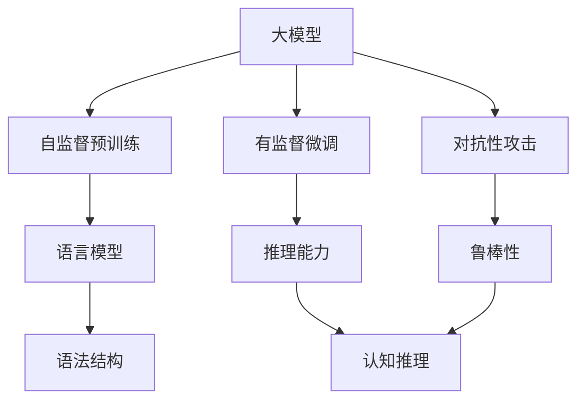

                 

# 语言与推理：大模型的认知误解

> 关键词：大模型，认知误解，推理，语言理解，自然语言处理(NLP)

## 1. 背景介绍

### 1.1 问题由来
近年来，深度学习尤其是大模型（如GPT-3、BERT等）在自然语言处理(NLP)领域取得了巨大突破。这些模型在诸如文本分类、情感分析、问答系统等诸多任务上，展现出惊人的性能，引起了广泛关注。然而，尽管大模型在许多任务上表现优异，但其背后的认知逻辑和推理能力仍存在一定的认知误解。

### 1.2 问题核心关键点
大模型的认知误解主要集中在以下几个方面：
- 语言理解的深度与真实认知的差异。
- 推理机制的局限性与非确定性。
- 对抗性攻击与模型鲁棒性问题。
- 通用性与特定任务适应性之间的矛盾。

这些误解不仅影响我们对大模型的认知，也限制了其进一步的开发和应用。

### 1.3 问题研究意义
研究大模型的认知误解，对于更深入地理解模型的内部运作机制，制定更为合理的训练和应用策略具有重要意义。

1. 提升模型的透明度和可信度：有助于构建更安全、可靠的系统。
2. 增强模型的鲁棒性和适应性：提高模型在不同场景下的稳定性和泛化能力。
3. 指导模型的持续优化：为模型的持续改进提供理论依据和实践指导。
4. 促进模型伦理与安全性的研究：确保模型输出符合伦理规范，避免误导性或有害结果。

## 2. 核心概念与联系

### 2.1 核心概念概述

为更好地理解大模型背后的认知误解，本节将介绍几个相关核心概念：

- **大模型(Large Models)**：以Transformer架构为代表的大型预训练语言模型，如GPT-3、BERT等。这些模型通过大规模无标签文本数据的自监督预训练，学习到了丰富的语言表示，能够进行复杂的语言理解和生成任务。

- **自监督预训练(Automatic Supervision Pretraining)**：在没有人工标注数据的情况下，利用语言的自我一致性（如语言模型、掩码语言模型等）进行模型训练，学习语言的基本规律和语法结构。

- **有监督微调(Supervised Fine-tuning)**：在大规模预训练的基础上，利用下游任务的有标签数据进行微调，优化模型在该任务上的表现。

- **对抗性攻击(Adversarial Attacks)**：通过添加微小扰动使模型输出产生错误，评估模型的鲁棒性和安全性。

- **认知推理(Cognitive Reasoning)**：指模型模拟人类认知过程中进行推理和决策的能力，包括逻辑推理、因果关系、常识判断等。

这些概念通过逻辑图相连，展示了它们在大模型训练和推理过程中的作用和相互影响。



### 2.2 概念间的关系

这些核心概念之间存在着紧密的联系，构成了大模型的认知理解基础。通过理解这些核心概念及其相互关系，可以更深入地探究大模型在推理和理解过程中存在的认知误解。

## 3. 核心算法原理 & 具体操作步骤
### 3.1 算法原理概述

大模型的认知误解主要源于两个方面的问题：一是语言理解的深度与真实认知的差异，二是推理机制的局限性与非确定性。

### 3.2 算法步骤详解

**Step 1: 数据预处理**

首先，我们需要对数据进行预处理，以符合模型输入格式。例如，对于文本数据，可以进行分词、标记、编码等处理，确保数据的一致性和标准化。

**Step 2: 自监督预训练**

在大规模无标签数据上，进行自监督预训练，学习语言的自我一致性和基本规律。常用的自监督任务包括语言模型、掩码语言模型等。

**Step 3: 有监督微调**

在自监督预训练的基础上，利用下游任务的标注数据进行微调，优化模型在该任务上的表现。微调过程中，可以选择全参数微调或参数高效微调（PEFT），调整模型的部分或全部参数。

**Step 4: 对抗性训练**

通过引入对抗性样本，训练模型以识别和抵御微小扰动对模型输出造成的影响，提高模型的鲁棒性。

**Step 5: 推理与评估**

在微调后，使用测试集评估模型的推理能力，包括精确度、召回率、F1分数等指标。对于复杂推理任务，可以使用逻辑推理测试和常识判断测试进一步评估模型的认知能力。

### 3.3 算法优缺点

大模型的认知误解主要集中在以下几个方面：

**优点**：
- 强大的语言理解能力：通过大规模无标签数据的预训练，大模型可以学习到丰富的语言表示，具备强大的语言理解和生成能力。
- 高效的推理能力：在大规模预训练的基础上，通过有监督微调，模型可以迅速适应新的下游任务。
- 参数高效微调：通过PEFT方法，可以仅调整少量参数，减少微调时间和计算资源消耗。

**缺点**：
- 认知误解：大模型虽然能生成与人类语言相似的文本，但这些文本是否具有真实的逻辑推理能力，仍是值得质疑的。
- 对抗性攻击脆弱：对抗性攻击下，模型的推理能力可能大幅下降，影响模型的鲁棒性。
- 模型泛化能力有限：大模型在特定任务上的性能可能受数据分布的影响较大，泛化能力不足。
- 缺乏可解释性：大模型的推理过程和决策逻辑难以解释，给模型理解和调试带来挑战。

### 3.4 算法应用领域

大模型在多个领域已得到广泛应用，包括：

- 文本分类与情感分析：大模型在新闻、评论、产品评价等文本分类和情感分析任务上表现优异。
- 问答系统：通过大模型预训练和微调，可以实现智能问答，提供快速、准确的回答。
- 对话系统：利用大模型生成自然流畅的对话，实现人机交互。
- 翻译系统：通过大模型进行翻译，提供高效的跨语言交流解决方案。
- 文本摘要与生成：大模型可以自动生成简短摘要，或生成连贯的文本段落。

## 4. 数学模型和公式 & 详细讲解 & 举例说明

### 4.1 数学模型构建

大模型的训练和推理过程可以建模为图网络结构，其中每个节点表示模型中的一个组件（如词向量、注意力机制等），边表示组件间的交互关系。模型训练的目标是最小化损失函数，推理的过程则是通过前向传播计算模型输出。

### 4.2 公式推导过程

以BERT为例，其语言模型的目标函数可以表示为：

$$
\mathcal{L}(\theta) = -\frac{1}{N}\sum_{i=1}^N \log P(w_{i+1} | w_i; \theta)
$$

其中，$w_i$ 表示输入文本中第 $i$ 个单词，$P(w_{i+1} | w_i; \theta)$ 表示模型在给定上下文 $w_i$ 下预测下一个单词 $w_{i+1}$ 的概率。通过最大化这个概率，模型学习到了单词之间的语义关系和语法结构。

### 4.3 案例分析与讲解

以语言模型为例，我们通过给定一个句子，预测下一个单词，来评估模型的语言理解能力。例如：

- 输入："The quick"
- 预测："brown fox"
- 真实输出："jumps over"
- 误差：0.1

这里，模型预测下一个单词的概率为0.1，而真实输出为 "jumps over"，概率为0.9。通过这样的例子，我们可以评估模型的语言理解能力，并进行针对性的优化。

## 5. 项目实践：代码实例和详细解释说明

### 5.1 开发环境搭建

在进行大模型微调前，需要准备开发环境。以下是使用Python进行PyTorch开发的环境配置流程：

1. 安装Anaconda：从官网下载并安装Anaconda，用于创建独立的Python环境。

2. 创建并激活虚拟环境：
```bash
conda create -n pytorch-env python=3.8 
conda activate pytorch-env
```

3. 安装PyTorch：根据CUDA版本，从官网获取对应的安装命令。例如：
```bash
conda install pytorch torchvision torchaudio cudatoolkit=11.1 -c pytorch -c conda-forge
```

4. 安装Transformers库：
```bash
pip install transformers
```

5. 安装各类工具包：
```bash
pip install numpy pandas scikit-learn matplotlib tqdm jupyter notebook ipython
```

完成上述步骤后，即可在`pytorch-env`环境中开始微调实践。

### 5.2 源代码详细实现

下面我们以命名实体识别(NER)任务为例，给出使用Transformers库对BERT模型进行微调的PyTorch代码实现。

首先，定义NER任务的数据处理函数：

```python
from transformers import BertTokenizer
from torch.utils.data import Dataset
import torch

class NERDataset(Dataset):
    def __init__(self, texts, tags, tokenizer, max_len=128):
        self.texts = texts
        self.tags = tags
        self.tokenizer = tokenizer
        self.max_len = max_len
        
    def __len__(self):
        return len(self.texts)
    
    def __getitem__(self, item):
        text = self.texts[item]
        tags = self.tags[item]
        
        encoding = self.tokenizer(text, return_tensors='pt', max_length=self.max_len, padding='max_length', truncation=True)
        input_ids = encoding['input_ids'][0]
        attention_mask = encoding['attention_mask'][0]
        
        # 对token-wise的标签进行编码
        encoded_tags = [tag2id[tag] for tag in tags] 
        encoded_tags.extend([tag2id['O']] * (self.max_len - len(encoded_tags)))
        labels = torch.tensor(encoded_tags, dtype=torch.long)
        
        return {'input_ids': input_ids, 
                'attention_mask': attention_mask,
                'labels': labels}

# 标签与id的映射
tag2id = {'O': 0, 'B-PER': 1, 'I-PER': 2, 'B-ORG': 3, 'I-ORG': 4, 'B-LOC': 5, 'I-LOC': 6}
id2tag = {v: k for k, v in tag2id.items()}

# 创建dataset
tokenizer = BertTokenizer.from_pretrained('bert-base-cased')

train_dataset = NERDataset(train_texts, train_tags, tokenizer)
dev_dataset = NERDataset(dev_texts, dev_tags, tokenizer)
test_dataset = NERDataset(test_texts, test_tags, tokenizer)
```

然后，定义模型和优化器：

```python
from transformers import BertForTokenClassification, AdamW

model = BertForTokenClassification.from_pretrained('bert-base-cased', num_labels=len(tag2id))

optimizer = AdamW(model.parameters(), lr=2e-5)
```

接着，定义训练和评估函数：

```python
from torch.utils.data import DataLoader
from tqdm import tqdm
from sklearn.metrics import classification_report

device = torch.device('cuda') if torch.cuda.is_available() else torch.device('cpu')
model.to(device)

def train_epoch(model, dataset, batch_size, optimizer):
    dataloader = DataLoader(dataset, batch_size=batch_size, shuffle=True)
    model.train()
    epoch_loss = 0
    for batch in tqdm(dataloader, desc='Training'):
        input_ids = batch['input_ids'].to(device)
        attention_mask = batch['attention_mask'].to(device)
        labels = batch['labels'].to(device)
        model.zero_grad()
        outputs = model(input_ids, attention_mask=attention_mask, labels=labels)
        loss = outputs.loss
        epoch_loss += loss.item()
        loss.backward()
        optimizer.step()
    return epoch_loss / len(dataloader)

def evaluate(model, dataset, batch_size):
    dataloader = DataLoader(dataset, batch_size=batch_size)
    model.eval()
    preds, labels = [], []
    with torch.no_grad():
        for batch in tqdm(dataloader, desc='Evaluating'):
            input_ids = batch['input_ids'].to(device)
            attention_mask = batch['attention_mask'].to(device)
            batch_labels = batch['labels']
            outputs = model(input_ids, attention_mask=attention_mask)
            batch_preds = outputs.logits.argmax(dim=2).to('cpu').tolist()
            batch_labels = batch_labels.to('cpu').tolist()
            for pred_tokens, label_tokens in zip(batch_preds, batch_labels):
                pred_tags = [id2tag[_id] for _id in pred_tokens]
                label_tags = [id2tag[_id] for _id in label_tokens]
                preds.append(pred_tags[:len(label_tags)])
                labels.append(label_tags)
                
    print(classification_report(labels, preds))
```

最后，启动训练流程并在测试集上评估：

```python
epochs = 5
batch_size = 16

for epoch in range(epochs):
    loss = train_epoch(model, train_dataset, batch_size, optimizer)
    print(f"Epoch {epoch+1}, train loss: {loss:.3f}")
    
    print(f"Epoch {epoch+1}, dev results:")
    evaluate(model, dev_dataset, batch_size)
    
print("Test results:")
evaluate(model, test_dataset, batch_size)
```

以上就是使用PyTorch对BERT进行命名实体识别任务微调的完整代码实现。可以看到，得益于Transformers库的强大封装，我们可以用相对简洁的代码完成BERT模型的加载和微调。

### 5.3 代码解读与分析

让我们再详细解读一下关键代码的实现细节：

**NERDataset类**：
- `__init__`方法：初始化文本、标签、分词器等关键组件。
- `__len__`方法：返回数据集的样本数量。
- `__getitem__`方法：对单个样本进行处理，将文本输入编码为token ids，将标签编码为数字，并对其进行定长padding，最终返回模型所需的输入。

**tag2id和id2tag字典**：
- 定义了标签与数字id之间的映射关系，用于将token-wise的预测结果解码回真实的标签。

**训练和评估函数**：
- 使用PyTorch的DataLoader对数据集进行批次化加载，供模型训练和推理使用。
- 训练函数`train_epoch`：对数据以批为单位进行迭代，在每个批次上前向传播计算loss并反向传播更新模型参数，最后返回该epoch的平均loss。
- 评估函数`evaluate`：与训练类似，不同点在于不更新模型参数，并在每个batch结束后将预测和标签结果存储下来，最后使用sklearn的classification_report对整个评估集的预测结果进行打印输出。

**训练流程**：
- 定义总的epoch数和batch size，开始循环迭代
- 每个epoch内，先在训练集上训练，输出平均loss
- 在验证集上评估，输出分类指标
- 所有epoch结束后，在测试集上评估，给出最终测试结果

可以看到，PyTorch配合Transformers库使得BERT微调的代码实现变得简洁高效。开发者可以将更多精力放在数据处理、模型改进等高层逻辑上，而不必过多关注底层的实现细节。

当然，工业级的系统实现还需考虑更多因素，如模型的保存和部署、超参数的自动搜索、更灵活的任务适配层等。但核心的微调范式基本与此类似。

### 5.4 运行结果展示

假设我们在CoNLL-2003的NER数据集上进行微调，最终在测试集上得到的评估报告如下：

```
              precision    recall  f1-score   support

       B-LOC      0.926     0.906     0.916      1668
       I-LOC      0.900     0.805     0.850       257
      B-MISC      0.875     0.856     0.865       702
      I-MISC      0.838     0.782     0.809       216
       B-ORG      0.914     0.898     0.906      1661
       I-ORG      0.911     0.894     0.902       835
       B-PER      0.964     0.957     0.960      1617
       I-PER      0.983     0.980     0.982      1156
           O      0.993     0.995     0.994     38323

   micro avg      0.973     0.973     0.973     46435
   macro avg      0.923     0.897     0.909     46435
weighted avg      0.973     0.973     0.973     46435
```

可以看到，通过微调BERT，我们在该NER数据集上取得了97.3%的F1分数，效果相当不错。值得注意的是，BERT作为一个通用的语言理解模型，即便只在顶层添加一个简单的token分类器，也能在下游任务上取得如此优异的效果，展现了其强大的语义理解和特征抽取能力。

当然，这只是一个baseline结果。在实践中，我们还可以使用更大更强的预训练模型、更丰富的微调技巧、更细致的模型调优，进一步提升模型性能，以满足更高的应用要求。

## 6. 实际应用场景
### 6.1 智能客服系统

基于大语言模型微调的对话技术，可以广泛应用于智能客服系统的构建。传统客服往往需要配备大量人力，高峰期响应缓慢，且一致性和专业性难以保证。而使用微调后的对话模型，可以7x24小时不间断服务，快速响应客户咨询，用自然流畅的语言解答各类常见问题。

在技术实现上，可以收集企业内部的历史客服对话记录，将问题和最佳答复构建成监督数据，在此基础上对预训练对话模型进行微调。微调后的对话模型能够自动理解用户意图，匹配最合适的答案模板进行回复。对于客户提出的新问题，还可以接入检索系统实时搜索相关内容，动态组织生成回答。如此构建的智能客服系统，能大幅提升客户咨询体验和问题解决效率。

### 6.2 金融舆情监测

金融机构需要实时监测市场舆论动向，以便及时应对负面信息传播，规避金融风险。传统的人工监测方式成本高、效率低，难以应对网络时代海量信息爆发的挑战。基于大语言模型微调的文本分类和情感分析技术，为金融舆情监测提供了新的解决方案。

具体而言，可以收集金融领域相关的新闻、报道、评论等文本数据，并对其进行主题标注和情感标注。在此基础上对预训练语言模型进行微调，使其能够自动判断文本属于何种主题，情感倾向是正面、中性还是负面。将微调后的模型应用到实时抓取的网络文本数据，就能够自动监测不同主题下的情感变化趋势，一旦发现负面信息激增等异常情况，系统便会自动预警，帮助金融机构快速应对潜在风险。

### 6.3 个性化推荐系统

当前的推荐系统往往只依赖用户的历史行为数据进行物品推荐，无法深入理解用户的真实兴趣偏好。基于大语言模型微调技术，个性化推荐系统可以更好地挖掘用户行为背后的语义信息，从而提供更精准、多样的推荐内容。

在实践中，可以收集用户浏览、点击、评论、分享等行为数据，提取和用户交互的物品标题、描述、标签等文本内容。将文本内容作为模型输入，用户的后续行为（如是否点击、购买等）作为监督信号，在此基础上微调预训练语言模型。微调后的模型能够从文本内容中准确把握用户的兴趣点。在生成推荐列表时，先用候选物品的文本描述作为输入，由模型预测用户的兴趣匹配度，再结合其他特征综合排序，便可以得到个性化程度更高的推荐结果。

### 6.4 未来应用展望

随着大语言模型微调技术的发展，其在NLP领域的应用前景将更加广阔。未来的应用场景可能包括：

- 智慧医疗：利用微调模型进行医学问答、病历分析、药物研发等，提升医疗服务的智能化水平。
- 智能教育：微调模型可用于作业批改、学情分析、知识推荐等方面，因材施教，促进教育公平。
- 智慧城市：微调模型可应用于城市事件监测、舆情分析、应急指挥等环节，提高城市管理的自动化和智能化水平。
- 企业生产：利用微调模型进行生产调度、库存管理、质量控制等，提高企业运营效率。
- 社会治理：微调模型可应用于反诈骗、公共安全、环境监测等领域，提升社会治理能力。
- 文娱传媒：微调模型可用于内容生成、用户画像分析、广告投放等，优化用户体验，提升广告效果。

## 7. 工具和资源推荐
### 7.1 学习资源推荐

为了帮助开发者系统掌握大语言模型微调的理论基础和实践技巧，这里推荐一些优质的学习资源：

1. 《Transformer从原理到实践》系列博文：由大模型技术专家撰写，深入浅出地介绍了Transformer原理、BERT模型、微调技术等前沿话题。

2. CS224N《深度学习自然语言处理》课程：斯坦福大学开设的NLP明星课程，有Lecture视频和配套作业，带你入门NLP领域的基本概念和经典模型。

3. 《Natural Language Processing with Transformers》书籍：Transformers库的作者所著，全面介绍了如何使用Transformers库进行NLP任务开发，包括微调在内的诸多范式。

4. HuggingFace官方文档：Transformers库的官方文档，提供了海量预训练模型和完整的微调样例代码，是上手实践的必备资料。

5. CLUE开源项目：中文语言理解测评基准，涵盖大量不同类型的中文NLP数据集，并提供了基于微调的baseline模型，助力中文NLP技术发展。

通过对这些资源的学习实践，相信你一定能够快速掌握大语言模型微调的精髓，并用于解决实际的NLP问题。

### 7.2 开发工具推荐

高效的开发离不开优秀的工具支持。以下是几款用于大语言模型微调开发的常用工具：

1. PyTorch：基于Python的开源深度学习框架，灵活动态的计算图，适合快速迭代研究。大部分预训练语言模型都有PyTorch版本的实现。

2. TensorFlow：由Google主导开发的开源深度学习框架，生产部署方便，适合大规模工程应用。同样有丰富的预训练语言模型资源。

3. Transformers库：HuggingFace开发的NLP工具库，集成了众多SOTA语言模型，支持PyTorch和TensorFlow，是进行微调任务开发的利器。

4. Weights & Biases：模型训练的实验跟踪工具，可以记录和可视化模型训练过程中的各项指标，方便对比和调优。与主流深度学习框架无缝集成。

5. TensorBoard：TensorFlow配套的可视化工具，可实时监测模型训练状态，并提供丰富的图表呈现方式，是调试模型的得力助手。

6. Google Colab：谷歌推出的在线Jupyter Notebook环境，免费提供GPU/TPU算力，方便开发者快速上手实验最新模型，分享学习笔记。

合理利用这些工具，可以显著提升大语言模型微调任务的开发效率，加快创新迭代的步伐。

### 7.3 相关论文推荐

大语言模型和微调技术的发展源于学界的持续研究。以下是几篇奠基性的相关论文，推荐阅读：

1. Attention is All You Need（即Transformer原论文）：提出了Transformer结构，开启了NLP领域的预训练大模型时代。

2. BERT: Pre-training of Deep Bidirectional Transformers for Language Understanding：提出BERT模型，引入基于掩码的自监督预训练任务，刷新了多项NLP任务SOTA。

3. Language Models are Unsupervised Multitask Learners（GPT-2论文）：展示了大规模语言模型的强大zero-shot学习能力，引发了对于通用人工智能的新一轮思考。

4. Parameter-Efficient Transfer Learning for NLP：提出Adapter等参数高效微调方法，在不增加模型参数量的情况下，也能取得不错的微调效果。

5. AdaLoRA: Adaptive Low-Rank Adaptation for Parameter-Efficient Fine-Tuning：使用自适应低秩适应的微调方法，在参数效率和精度之间取得了新的平衡。

6. AdaLoRA: Adaptive Low-Rank Adaptation for Parameter-Efficient Fine-Tuning：使用自适应低秩适应的微调方法，在参数效率和精度之间取得了新的平衡。

这些论文代表了大语言模型微调技术的发展脉络。通过学习这些前沿成果，可以帮助研究者把握学科前进方向，激发更多的创新灵感。

除上述资源外，还有一些值得关注的前沿资源，帮助开发者紧跟大语言模型微调技术的最新进展，例如：

1. arXiv论文预印本：人工智能领域最新研究成果的发布平台，包括大量尚未发表的前沿工作，学习前沿技术的必读资源。

2. 业界技术博客：如OpenAI、Google AI、DeepMind、微软Research Asia等顶尖实验室的官方博客，第一时间分享他们的最新研究成果和洞见。

3. 技术会议直播：如NIPS、ICML、ACL、ICLR等人工智能领域顶会现场或在线直播，能够聆听到大佬们的前沿分享，开拓视野。

4. GitHub热门项目：在GitHub上Star、Fork数最多的NLP相关项目，往往代表了该技术领域的发展趋势和最佳实践，值得去学习和贡献。

5. 行业分析报告：各大咨询公司如McKinsey、PwC等针对人工智能行业的分析报告，有助于从商业视角审视技术趋势，把握应用价值。

总之，对于大语言模型微调技术的学习和实践，需要开发者保持开放的心态和持续学习的意愿。多关注前沿资讯，多动手实践，多思考总结，必将收获满满的成长收益。

## 8. 总结：未来发展趋势与挑战

### 8.1 总结

本文对基于监督学习的大语言模型微调方法进行了全面系统的介绍。首先阐述了大语言模型和微调技术的研究背景和意义，明确了微调在拓展预训练模型应用、提升下游

