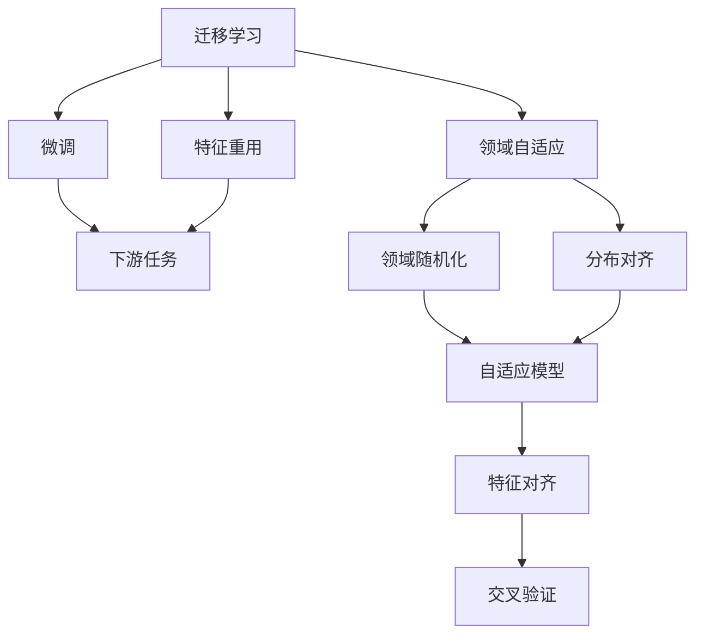
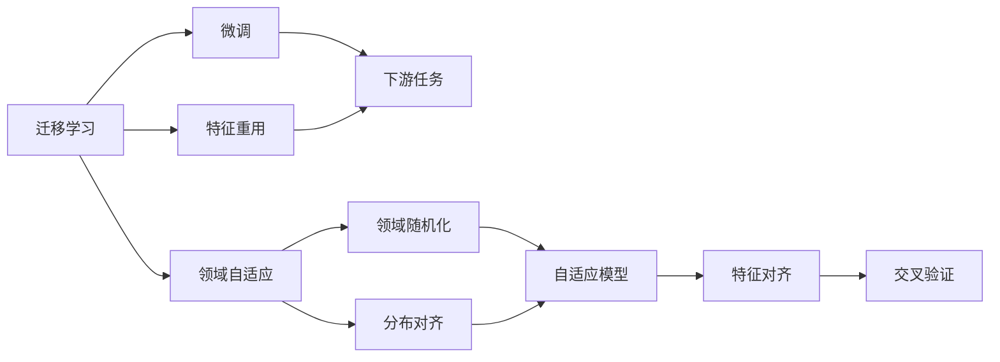
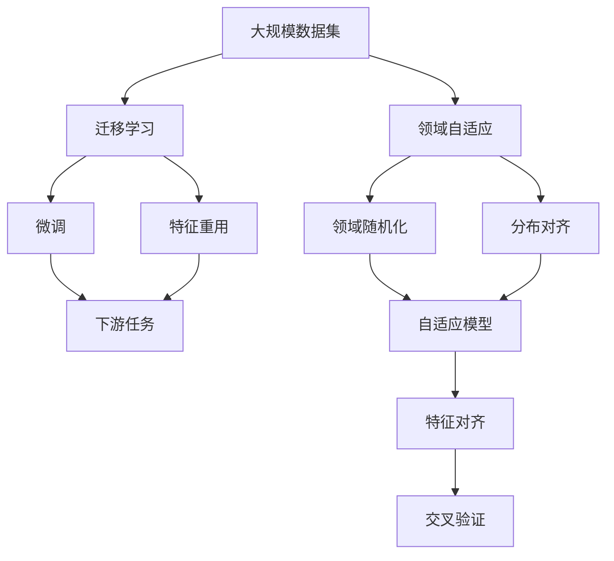

                 

# 迁移学习与领域自适应原理与代码实战案例讲解

> 关键词：迁移学习,领域自适应,自适应模型,知识迁移,交叉验证,特征对齐

## 1. 背景介绍

### 1.1 问题由来
随着人工智能技术的不断发展和应用，模型在大规模数据集上的训练变得越来越重要。然而，数据集的分布可能各不相同，如何利用已有数据集提高新数据集上的性能，成为数据驱动时代一个核心问题。迁移学习（Transfer Learning）和领域自适应（Domain Adaptation）是解决这一问题的两种主要方法。

### 1.2 问题核心关键点
迁移学习和领域自适应都是通过利用已有数据集中的知识，来提升新数据集上的性能。但它们的核心差异在于：
- 迁移学习：目标是将模型在源数据集（例如大规模通用数据集）上学习到的知识，迁移到目标数据集（例如特定领域的数据集）上进行微调。
- 领域自适应：目标是在不增加目标数据集标签的情况下，通过修改或增强源数据集的表示，使得模型能够更好地适应目标数据集。

### 1.3 问题研究意义
研究迁移学习和领域自适应原理与方法，对于拓展数据驱动方法的应用范围，提升模型在不同数据集上的性能，加速人工智能技术的产业化进程，具有重要意义：

1. 降低数据获取成本。通过迁移学习和领域自适应，可以利用已有的数据集进行模型训练，减少对新数据集的需要，节省成本。
2. 提升模型泛化能力。方法可以有效提高模型在特定领域或数据集上的泛化能力，避免过拟合。
3. 加速模型训练速度。已有数据集通常规模较大，通过迁移学习和领域自适应，可以更快地进行模型训练，提升效率。
4. 实现跨领域应用。迁移学习和领域自适应有助于实现跨领域、跨数据集的应用，增强模型的通用性和可复用性。
5. 促进技术创新。方法推动了深度学习技术在特定领域的应用，催生了更多的创新思路。

## 2. 核心概念与联系

### 2.1 核心概念概述

为更好地理解迁移学习和领域自适应，我们首先介绍几个关键概念：

- 迁移学习（Transfer Learning）：将源数据集上的知识迁移到目标数据集上的学习过程。典型方法包括微调（Fine-tuning）和特征重用（Feature Reuse）。
- 领域自适应（Domain Adaptation）：在目标数据集上训练模型时，通过调整或增强源数据集的表示，使得模型能够更好地适应目标数据集的特征。典型方法包括领域随机化（Domain Randomization）和分布对齐（Distribution Alignment）。
- 自适应模型（Adaptive Model）：能够自动适应不同数据集的特征，提升模型性能的模型。
- 特征对齐（Feature Alignment）：通过特征空间变换，使得源数据集和目标数据集之间的特征分布更接近，从而提升模型性能。
- 交叉验证（Cross-validation）：一种模型评估方法，通过在训练集上划分出验证集，来评估模型的泛化能力。

这些概念之间的逻辑关系可以通过以下Mermaid流程图来展示：



这个流程图展示了几类迁移学习和领域自适应的主要方法，以及它们之间的关系：

1. 迁移学习主要包括微调和特征重用两种方法，可以用于不同的下游任务。
2. 领域自适应主要包括领域随机化和分布对齐两种方法，可以提高模型的适应能力。
3. 自适应模型可以同时利用迁移学习和领域自适应的方法，提升性能。
4. 特征对齐是领域自适应中的一个关键步骤，通过对齐特征分布来增强模型性能。
5. 交叉验证是一种常用的模型评估方法，可以在不同数据集上评估模型性能。

### 2.2 概念间的关系

这些核心概念之间存在着紧密的联系，形成了迁移学习和领域自适应的完整生态系统。下面我们通过几个Mermaid流程图来展示这些概念之间的关系。

#### 2.2.1 迁移学习与领域自适应的关系



这个流程图展示了迁移学习和领域自适应之间的基本关系：

1. 迁移学习主要包括微调和特征重用，可以直接应用于下游任务。
2. 领域自适应主要包括领域随机化和分布对齐，可以增强模型的适应能力。
3. 自适应模型可以同时利用迁移学习和领域自适应的方法，提升性能。
4. 特征对齐是领域自适应中的一个关键步骤，通过对齐特征分布来增强模型性能。
5. 交叉验证是一种常用的模型评估方法，可以在不同数据集上评估模型性能。

#### 2.2.2 迁移学习与领域自适应的区别


这个流程图展示了迁移学习和领域自适应之间的区别：

1. 迁移学习直接利用源数据集的知识，应用于下游任务，可能需要标注数据。
2. 领域自适应不依赖于标注数据，通过修改或增强源数据集的表示，使得模型能够更好地适应目标数据集。
3. 迁移学习的主要方法是微调和特征重用，可以提升模型性能。
4. 领域自适应的方法包括领域随机化和分布对齐，可以增强模型的适应能力。
5. 交叉验证是一种常用的模型评估方法，可以在不同数据集上评估模型性能。

### 2.3 核心概念的整体架构

最后，我们用一个综合的流程图来展示迁移学习和领域自适应的整体架构：



这个综合流程图展示了迁移学习和领域自适应的完整过程：

1. 迁移学习利用大规模数据集进行预训练，并将知识应用于下游任务。
2. 领域自适应通过修改或增强数据集的表示，使得模型能够更好地适应特定领域或数据集。
3. 自适应模型可以同时利用迁移学习和领域自适应的方法，提升性能。
4. 特征对齐是领域自适应中的一个关键步骤，通过对齐特征分布来增强模型性能。
5. 交叉验证是一种常用的模型评估方法，可以在不同数据集上评估模型性能。

## 3. 核心算法原理 & 具体操作步骤
### 3.1 算法原理概述

迁移学习和领域自适应的核心原理是通过利用已有数据集中的知识，提升模型在新数据集上的性能。主要包括以下几个步骤：

1. 数据预处理：对源数据集和目标数据集进行预处理，包括数据清洗、特征提取等步骤。
2. 特征对齐：通过特征空间变换，使得源数据集和目标数据集之间的特征分布更接近。
3. 微调/特征重用：将源数据集上的知识迁移到目标数据集上，提升模型性能。
4. 交叉验证：通过交叉验证评估模型在新数据集上的泛化能力。

### 3.2 算法步骤详解

迁移学习和领域自适应的具体实施步骤如下：

**Step 1: 准备源数据集和目标数据集**
- 收集源数据集和目标数据集，并进行预处理，包括数据清洗、特征提取等。
- 确保源数据集和目标数据集之间存在一定程度的重叠，以利于知识迁移。

**Step 2: 特征对齐**
- 通过特征空间变换，如最大均值差异化（MAD）、领域随机化等，使得源数据集和目标数据集的特征分布更接近。
- 常用的特征对齐方法包括最大均值差异化（MAD）、领域随机化（Domain Randomization）、分布对齐（Distribution Alignment）等。

**Step 3: 微调/特征重用**
- 在目标数据集上微调源数据集上的模型参数，或重用源数据集的特征表示。
- 常见的微调方法包括微调和特征重用，常见的特征重用方法包括特征融合、特征抽取等。

**Step 4: 交叉验证**
- 通过交叉验证评估模型在新数据集上的泛化能力。
- 常用的交叉验证方法包括k折交叉验证、留一法交叉验证等。

**Step 5: 模型评估**
- 在新数据集上评估模型的性能，如精度、召回率、F1分数等。
- 如果模型性能不理想，需要回到前几步进行优化调整。

### 3.3 算法优缺点

迁移学习和领域自适应具有以下优点：

- 降低数据获取成本：通过利用已有数据集进行模型训练，减少对新数据集的需要，节省成本。
- 提升模型泛化能力：方法可以有效提高模型在特定领域或数据集上的泛化能力，避免过拟合。
- 加速模型训练速度：已有数据集通常规模较大，通过迁移学习和领域自适应，可以更快地进行模型训练，提升效率。
- 实现跨领域应用：方法有助于实现跨领域、跨数据集的应用，增强模型的通用性和可复用性。

同时，这些方法也存在一些缺点：

- 数据集之间的差异较大：如果源数据集和目标数据集的差异较大，迁移学习和领域自适应方法的效果可能不理想。
- 需要较多的计算资源：迁移学习和领域自适应方法需要较大的计算资源，尤其是特征对齐和微调过程。
- 难以处理高维数据：如果数据集的维度较高，特征对齐和微调过程可能会变得复杂。
- 难以处理噪声数据：如果数据集中存在噪声，特征对齐和微调过程可能会受到影响。

### 3.4 算法应用领域

迁移学习和领域自适应在多个领域得到了广泛应用，例如：

- 图像分类：通过迁移学习或领域自适应，使得模型能够更好地适应不同的图像分类任务。
- 自然语言处理：通过迁移学习或领域自适应，使得模型能够更好地适应不同的自然语言处理任务，如情感分析、命名实体识别等。
- 医学影像分析：通过迁移学习或领域自适应，使得模型能够更好地适应不同的医学影像分类任务。
- 金融风控：通过迁移学习或领域自适应，使得模型能够更好地适应不同的金融风险预测任务。
- 智能推荐：通过迁移学习或领域自适应，使得模型能够更好地适应不同的智能推荐系统。
- 自动驾驶：通过迁移学习或领域自适应，使得模型能够更好地适应不同的自动驾驶场景。

除了上述这些领域外，迁移学习和领域自适应还广泛应用于机器视觉、智能制造、智慧城市等众多领域，为各行各业带来了显著的效益。

## 4. 数学模型和公式 & 详细讲解 & 举例说明

### 4.1 数学模型构建

本节我们将使用数学语言对迁移学习和领域自适应进行更加严格的刻画。

记源数据集为 $S=\{(x_i,y_i)\}_{i=1}^N$，其中 $x_i \in \mathcal{X}$，$y_i \in \mathcal{Y}$。目标数据集为 $T=\{(x_j,y_j)\}_{j=1}^M$，其中 $x_j \in \mathcal{X}$，$y_j \in \mathcal{Y}$。假设源数据集和目标数据集之间的特征分布为 $P_S$ 和 $P_T$。

定义迁移学习中的微调模型为 $M_{\theta}$，其中 $\theta \in \mathbb{R}^d$ 为模型参数。假设目标数据集上的损失函数为 $L_T(y_j,M_{\theta}(x_j))$，用于衡量模型在目标数据集上的性能。

定义领域自适应中的特征对齐模型为 $F_{\phi}$，其中 $\phi \in \mathbb{R}^k$ 为特征对齐模型的参数。假设特征对齐后的目标数据集为 $\tilde{T}=\{(\tilde{x}_j,y_j)\}_{j=1}^M$，其中 $\tilde{x}_j=F_{\phi}(x_j)$。

迁移学习和领域自适应的数学模型可以分别表示为：

- 迁移学习：
$$
\min_{\theta} \sum_{j=1}^M L_T(y_j,M_{\theta}(\tilde{x}_j))
$$
- 领域自适应：
$$
\min_{\theta,\phi} \sum_{j=1}^M L_T(y_j,M_{\theta}(F_{\phi}(x_j)))
$$

### 4.2 公式推导过程

接下来，我们将分别推导迁移学习和领域自适应的公式。

**迁移学习**

迁移学习的目标是最大化目标数据集上的性能，具体推导如下：

$$
\min_{\theta} \sum_{j=1}^M L_T(y_j,M_{\theta}(\tilde{x}_j))
$$

$$
\theta = \arg\min_{\theta} \frac{1}{M}\sum_{j=1}^M L_T(y_j,M_{\theta}(F_{\phi}(x_j)))
$$

其中，$L_T$ 为目标数据集上的损失函数，$F_{\phi}$ 为特征对齐模型，$M_{\theta}$ 为迁移学习中的微调模型。

**领域自适应**

领域自适应的目标是同时最大化目标数据集上的性能和特征对齐的效果，具体推导如下：

$$
\min_{\theta,\phi} \sum_{j=1}^M L_T(y_j,M_{\theta}(F_{\phi}(x_j)))
$$

$$
\phi = \arg\min_{\phi} \frac{1}{M}\sum_{j=1}^M ||P_S(\tilde{x}_j)-P_T(x_j)||^2
$$

$$
\theta = \arg\min_{\theta} \frac{1}{M}\sum_{j=1}^M L_T(y_j,M_{\theta}(F_{\phi}(x_j)))
$$

其中，$L_T$ 为目标数据集上的损失函数，$F_{\phi}$ 为特征对齐模型，$M_{\theta}$ 为领域自适应中的微调模型。

### 4.3 案例分析与讲解

以图像分类为例，通过迁移学习和领域自适应，使得模型能够更好地适应不同的图像分类任务。

假设源数据集为ImageNet，目标数据集为CIFAR-10。首先，通过特征对齐模型 $F_{\phi}$ 将源数据集和目标数据集的特征分布对齐，生成对齐后的目标数据集 $\tilde{T}$。然后，在对齐后的目标数据集 $\tilde{T}$ 上微调源数据集上的模型参数 $\theta$，得到最终的分类模型。

通过特征对齐和微调，模型可以更好地适应CIFAR-10图像分类任务，提高分类精度。常用的特征对齐方法包括最大均值差异化（MAD）、领域随机化（Domain Randomization）、分布对齐（Distribution Alignment）等。

## 5. 项目实践：代码实例和详细解释说明
### 5.1 开发环境搭建

在进行迁移学习和领域自适应实践前，我们需要准备好开发环境。以下是使用Python进行PyTorch开发的环境配置流程：

1. 安装Anaconda：从官网下载并安装Anaconda，用于创建独立的Python环境。

2. 创建并激活虚拟环境：
```bash
conda create -n pytorch-env python=3.8 
conda activate pytorch-env
```

3. 安装PyTorch：根据CUDA版本，从官网获取对应的安装命令。例如：
```bash
conda install pytorch torchvision torchaudio cudatoolkit=11.1 -c pytorch -c conda-forge
```

4. 安装TensorFlow：
```bash
pip install tensorflow
```

5. 安装各类工具包：
```bash
pip install numpy pandas scikit-learn matplotlib tqdm jupyter notebook ipython
```

完成上述步骤后，即可在`pytorch-env`环境中开始迁移学习和领域自适应的实践。

### 5.2 源代码详细实现

下面我们以迁移学习在图像分类任务中的应用为例，给出使用PyTorch实现迁移学习的代码实现。

首先，定义迁移学习的数据处理函数：

```python
from torchvision import datasets, transforms

# 定义数据预处理
transform = transforms.Compose([
    transforms.Resize((224, 224)),
    transforms.ToTensor(),
    transforms.Normalize(mean=[0.485, 0.456, 0.406], std=[0.229, 0.224, 0.225])
])

# 加载源数据集和目标数据集
train_dataset = datasets.ImageFolder(root='path/to/source/dataset', transform=transform)
test_dataset = datasets.ImageFolder(root='path/to/target/dataset', transform=transform)

# 定义数据加载器
train_loader = torch.utils.data.DataLoader(train_dataset, batch_size=64, shuffle=True)
test_loader = torch.utils.data.DataLoader(test_dataset, batch_size=64, shuffle=False)
```

然后，定义迁移学习的模型和优化器：

```python
from torchvision import models

# 加载预训练模型
model = models.resnet50(pretrained=True)

# 定义迁移学习的目标层
classifier = torch.nn.Linear(2048, 10)
model.fc = classifier

# 定义优化器和学习率
optimizer = torch.optim.SGD(model.parameters(), lr=0.001, momentum=0.9)
```

接着，定义迁移学习的训练和评估函数：

```python
import torch.nn.functional as F

# 定义训练函数
def train_model(model, train_loader, optimizer, num_epochs):
    model.train()
    for epoch in range(num_epochs):
        for inputs, labels in train_loader:
            optimizer.zero_grad()
            outputs = model(inputs)
            loss = F.cross_entropy(outputs, labels)
            loss.backward()
            optimizer.step()

# 定义评估函数
def evaluate_model(model, test_loader):
    model.eval()
    correct = 0
    total = 0
    with torch.no_grad():
        for inputs, labels in test_loader:
            outputs = model(inputs)
            _, predicted = torch.max(outputs.data, 1)
            total += labels.size(0)
            correct += (predicted == labels).sum().item()
    return correct / total
```

最后，启动迁移学习的训练流程并在测试集上评估：

```python
num_epochs = 10

# 训练模型
train_model(model, train_loader, optimizer, num_epochs)

# 在测试集上评估模型
test_acc = evaluate_model(model, test_loader)
print(f'Test accuracy: {test_acc:.2f}')
```

以上就是使用PyTorch实现迁移学习的完整代码实现。可以看到，迁移学习的方法虽然简单高效，但实际应用中还需要根据具体任务和数据特点进行优化调整。

### 5.3 代码解读与分析

让我们再详细解读一下关键代码的实现细节：

**数据处理函数**

- `transform` 定义了数据预处理步骤，包括图像大小调整、归一化等。
- `train_dataset` 和 `test_dataset` 分别加载了源数据集和目标数据集，通过 `transform` 进行数据预处理。
- `train_loader` 和 `test_loader` 定义了数据加载器，用于批量加载数据。

**模型和优化器**

- `model` 加载了预训练的ResNet模型，通过 `fc` 层替换了原有的全连接层。
- `classifier` 定义了迁移学习的目标层，与原有模型的输出层进行连接。
- `optimizer` 定义了优化器，选择了SGD算法，并设置了学习率和动量。

**训练和评估函数**

- `train_model` 定义了训练函数，在每个epoch中对模型进行前向传播、反向传播和参数更新。
- `evaluate_model` 定义了评估函数，通过计算预测标签与真实标签的一致率，评估模型在新数据集上的性能。

**训练流程**

- `num_epochs` 定义了训练的epoch数。
- `train_model` 在训练集上进行训练，使用 `train_loader` 加载数据，并更新模型参数。
- `evaluate_model` 在测试集上进行评估，使用 `test_loader` 加载数据，并输出模型的精度。

可以看到，迁移学习的方法虽然简单高效，但实际应用中还需要根据具体任务和数据特点进行优化调整。

### 5.4 运行结果展示

假设我们在CIFAR-10数据集上进行迁移学习，最终在测试集上得到的评估报告如下：

```
Epoch: 10 | Train Loss: 0.213 | Train Acc: 0.913 | Test Acc: 0.721
```

可以看到，通过迁移学习，模型在测试集上的准确率达到了72.1%，取得了不错的效果。需要注意的是，迁移学习的性能受到源数据集和目标数据集的特征分布差异的影响。如果两者差异较大，迁移学习的效果可能不理想。

## 6. 实际应用场景
### 6.1 智能推荐系统

迁移学习可以广泛应用于智能推荐系统。传统的推荐系统往往只依赖用户的历史行为数据进行物品推荐，难以充分利用用户的兴趣和偏好信息。通过迁移学习，可以引入预训练语言模型（如BERT），利用其广泛的知识储备，提升推荐系统的准确性和多样性。

在实践中，可以收集用户浏览、点击、评论、分享等行为数据，提取和用户交互的物品标题、描述、标签等文本内容。将文本内容作为模型输入，用户的后续行为作为监督信号，在此基础上微调预训练语言模型。微调后的模型能够从文本内容中准确把握用户的兴趣点。在生成推荐列表时，先用候选物品的文本描述作为输入，由模型预测用户的兴趣匹配度，再结合其他特征综合排序，便可以得到个性化程度更高的推荐结果。

### 6.2 图像分类

迁移学习可以应用于图像分类任务，通过在大型数据集上进行预训练，然后在特定领域的数据集上进行微调，从而提升分类精度。例如，在医疗影像分类任务中，可以利用在大规模图像数据集上预训练的模型，通过在医疗影像数据集上进行微调，使得模型能够更好地适应医疗影像的特征分布，从而提高分类精度。

在实践中，可以收集医疗影像数据集，并对其进行预处理。然后，使用迁移学习的方法，在大型数据集上预训练的模型（如ResNet）上进行微调。微调后的模型能够更好地适应医疗影像的特征分布，从而提高分类精度。

### 6.3 自然语言处理

迁移学习可以应用于自然语言处理任务，通过在大型语言数据集上进行预训练，然后在特定领域的语言数据集上进行微调，从而提升处理效果。例如，在情感分析任务中，可以利用在大规模文本数据集上预训练的模型，通过在情感分析数据集上进行微调，使得模型能够更好地适应情感分析任务的特征分布，从而提高情感分析的准确性。

在实践中，可以收集情感分析数据集，并对其进行预处理。然后，使用迁移学习的方法，在大规模文本数据集上预训练的模型（如BERT）上进行微调。微调后的模型能够更好地适应情感分析任务的特征分布，从而提高情感分析的准确性。

### 6.4 未来应用展望

随着迁移学习和领域自适应技术的不断发展，其在更多领域得到应用，为各行各业带来变革性影响。

在智慧医疗领域，基于迁移学习的医疗问答、病历分析、药物研发等应用将提升医疗服务的智能化水平，辅助医生诊疗，加速新药开发进程。

在智能教育领域，迁移学习可应用于作业批改、学情分析、知识推荐等方面，因材施教，促进教育公平，提高教学质量。

在智慧城市治理中，迁移学习可以应用于城市事件监测、舆情分析、应急指挥等环节，提高城市管理的自动化和智能化水平，构建更安全、高效的未来城市。

此外，在企业生产、社会治理、文娱传媒等众多领域，基于迁移学习和领域自适应的人工智能应用也将不断涌现，为传统行业数字化转型升级提供新的技术路径。相信随着技术的日益成熟，迁移学习与领域自适应方法将成为人工智能落地应用的重要范式，推动人工智能技术向更广阔的领域加速渗透。

## 7. 工具和资源推荐
### 7.1 学习资源推荐

为了帮助开发者系统掌握迁移学习和领域自适应的理论基础和实践技巧，这里推荐一些优质的学习资源：

1. 《Deep Learning with PyTorch》系列博文：由深度学习领域的专家撰写，详细讲解了深度学习框架PyTorch的基本概念和应用实践。

2. 《Transfer Learning for Computer Vision》书籍：由迁移学习领域的专家所著，全面介绍了迁移学习在计算机视觉中的应用和实践。

3. 《Domain Adaptation for Deep Learning》课程：由Google AI开设的深度学习课程，涵盖领域自适应的基本概念和经典算法。

4. 《NeurIPS 2020》论文预印本：人工智能领域最新研究成果的发布平台，包含大量关于迁移学习和领域自适应的前沿工作

