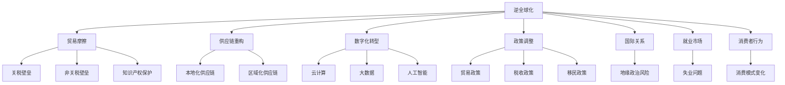
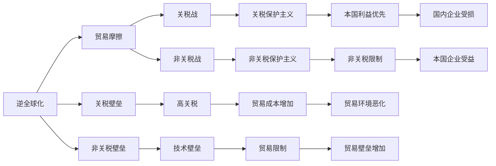
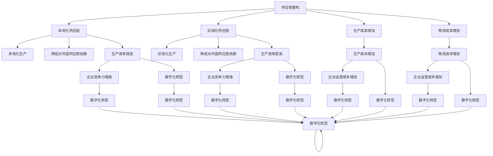
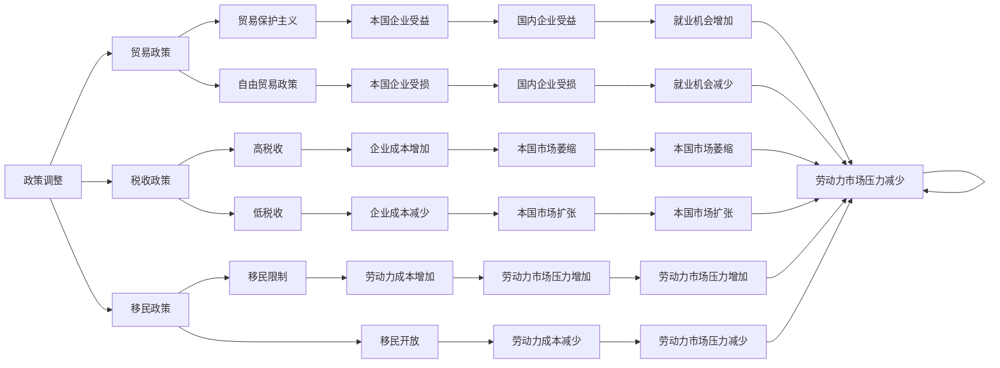
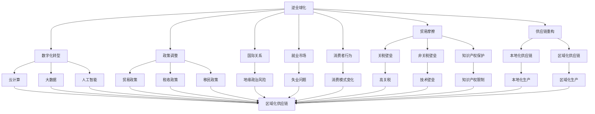

                 

# 逆全球化抬头的长期经济影响

> 关键词：逆全球化,贸易摩擦,供应链重构,数字化转型,政策调整,国际关系,就业市场,消费者行为

## 1. 背景介绍

### 1.1 问题由来
近年来，全球经济格局出现了显著变化，逆全球化浪潮抬头，给全球贸易、投资、产业链等诸多方面带来了深远影响。自新冠疫情暴发以来，各国采取了严格的封锁措施，使得全球供应链受到严重冲击。同时，伴随中美贸易摩擦加剧，全球贸易环境变得更加复杂多变。

在这样的背景下，许多国家和地区纷纷出台了本国优先的贸易保护政策，对国际规则和贸易体系产生了重大冲击。这种逆全球化趋势，不仅影响了全球经济的增长动力，也对各国政策调整、国际关系、就业市场等方面带来了深远影响。

### 1.2 问题核心关键点
当前逆全球化趋势的核心关键点包括：
1. **贸易摩擦加剧**：中美贸易战、美欧贸易战、美日贸易战等多边贸易摩擦频发，导致全球贸易环境恶化。
2. **供应链重构**：疫情背景下，各国和企业开始重新审视和调整供应链布局，减少对外国供应商的依赖，转向本地化或区域化供应链。
3. **数字化转型加速**：为了应对逆全球化带来的不确定性，企业加速了数字化转型，借助新技术提升生产效率和管理水平。
4. **政策调整增多**：各国政府为了维护本国利益，纷纷调整贸易、税收、移民等相关政策，试图在逆全球化浪潮中占据优势。
5. **国际关系重塑**：逆全球化导致国际关系更加紧张，地缘政治风险增加，全球合作难度加大。
6. **就业市场震荡**：全球产业链重构和贸易保护政策，导致跨国企业撤出部分工厂，部分行业失业问题加剧。
7. **消费者行为变化**：贸易壁垒增加、物流成本上升，使得消费者行为发生显著变化，需求侧管理更加复杂。

### 1.3 问题研究意义
研究逆全球化带来的长期经济影响，对于把握全球经济形势、制定有效应对策略具有重要意义。通过对贸易摩擦、供应链重构、数字化转型等核心问题的深入分析，可以为政府和企业提供决策参考，优化国际贸易环境和产业链布局，稳定就业市场，提升消费市场活力。

## 2. 核心概念与联系

### 2.1 核心概念概述

为了更好地理解逆全球化对经济的影响，本节将介绍几个密切相关的核心概念：

- **逆全球化**：指某些国家或地区在经济、贸易、金融等方面采取内向型政策，减少与国际市场的联系和互动，强调保护主义和本国优先。
- **贸易摩擦**：指各国在贸易领域的冲突和争端，通常涉及关税、非关税壁垒、知识产权保护等问题。
- **供应链重构**：指企业或国家在逆全球化背景下重新审视和调整供应链布局，减少对外国供应商的依赖，转向本地化或区域化供应链。
- **数字化转型**：指企业在逆全球化背景下加速应用新技术，如云计算、大数据、人工智能等，提升生产效率和管理水平。
- **政策调整**：指各国政府在逆全球化背景下调整相关政策，如贸易政策、税收政策、移民政策等，以维护本国利益。
- **国际关系**：指国家间在政治、经济、安全等方面的互动和关系，受逆全球化影响，国际合作难度增加，地缘政治风险上升。
- **就业市场**：指劳动力市场，受供应链重构、贸易摩擦等影响，就业结构发生变化，部分行业失业问题加剧。
- **消费者行为**：指消费者的购物习惯和消费模式，受贸易壁垒、物流成本等因素影响，消费者行为发生显著变化。

这些核心概念之间的逻辑关系可以通过以下Mermaid流程图来展示：



这个流程图展示了大逆全球化背景下的经济生态系统：

1. **逆全球化**作为驱动力，导致**贸易摩擦**加剧，进而影响**关税壁垒**、**非关税壁垒**、**知识产权保护**等具体问题。
2. **供应链重构**改变企业的生产布局，转向**本地化供应链**或**区域化供应链**，降低对外国供应商的依赖。
3. **数字化转型**通过应用新技术提升**生产效率**和**管理水平**，增强企业竞争力。
4. **政策调整**是各国政府在逆全球化背景下调整**贸易政策**、**税收政策**、**移民政策**等，以维护本国利益。
5. **国际关系**在逆全球化背景下变得更加紧张，**地缘政治风险**增加。
6. **就业市场**受供应链重构和贸易摩擦影响，**失业问题**加剧。
7. **消费者行为**在贸易壁垒增加和物流成本上升的背景下，**消费模式变化**。

### 2.2 概念间的关系

这些核心概念之间存在着紧密的联系，形成了逆全球化背景下的经济系统。下面我们通过几个Mermaid流程图来展示这些概念之间的关系。

#### 2.2.1 逆全球化与贸易摩擦的关系



这个流程图展示了逆全球化对贸易摩擦的直接影响：

1. **逆全球化**导致**关税壁垒**和**非关税壁垒**增加。
2. **贸易摩擦**升级为**关税战**和**非关税战**，使得**关税保护主义**和**非关税保护主义**得以推行。
3. **高关税**和**技术壁垒**增加了**贸易成本**和**贸易限制**。
4. **贸易环境**恶化，**国内企业受损**，而**本国企业受益**。

#### 2.2.2 供应链重构与数字化转型的关系



这个流程图展示了供应链重构对数字化转型的影响：

1. **供应链重构**导致企业转向**本地化生产**或**区域化生产**，**降低对外国供应商和供应链的依赖**。
2. **生产成本**和**物流成本**增加，导致**运营成本增加**。
3. **生产效率**提高，**企业竞争力增强**，促使企业加速**数字化转型**。
4. **数字化转型**通过提升**生产效率**、**管理水平**，增强企业竞争力。

#### 2.2.3 政策调整与国际关系的关系



这个流程图展示了政策调整对国际关系的影响：

1. **政策调整**涉及**贸易政策**、**税收政策**、**移民政策**等。
2. **贸易保护主义**和**自由贸易政策**分别对**本国企业**和**国内企业**产生影响。
3. **高税收**和**低税收**改变**企业成本**和**市场扩张**。
4. **移民限制**和**移民开放**影响**劳动力成本**和**劳动力市场压力**。
5. **本国企业受益**和**国内企业受损**导致**就业机会增加**或**减少**。
6. **本国市场萎缩**和**本国市场扩张**影响**劳动力市场压力**和**就业机会**。

### 2.3 核心概念的整体架构

最后，我们用一个综合的流程图来展示这些核心概念在逆全球化背景下的整体架构：



这个综合流程图展示了逆全球化背景下的经济生态系统：

1. **逆全球化**导致**贸易摩擦**加剧，影响**关税壁垒**、**非关税壁垒**和**知识产权保护**。
2. **供应链重构**促使企业转向**本地化供应链**或**区域化供应链**，减少对外国供应商的依赖。
3. **数字化转型**通过新技术提升**生产效率**和**管理水平**，增强企业竞争力。
4. **政策调整**涉及**贸易政策**、**税收政策**、**移民政策**等，维护本国利益。
5. **国际关系**在逆全球化背景下变得更加紧张，**地缘政治风险**增加。
6. **就业市场**受供应链重构和贸易摩擦影响，**失业问题**加剧。
7. **消费者行为**在贸易壁垒增加和物流成本上升的背景下，**消费模式变化**。

## 3. 核心算法原理 & 具体操作步骤

### 3.1 算法原理概述

逆全球化背景下的经济影响研究，本质上是一个复杂的系统动力学问题。它涉及多方面的经济变量和政策因素，如贸易、生产、成本、市场、劳动力、消费者等。因此，需要采用系统的思维和方法，建立多变量模型来刻画这些因素的相互作用和影响。

常见的系统动力学模型包括差分方程模型、系统仿真模型、因果反馈模型等。这些模型可以描述变量之间的动态关系，揭示系统运行的机理和规律。本文主要介绍差分方程模型和系统仿真模型的构建与分析方法。

### 3.2 算法步骤详解

逆全球化背景下的经济影响研究，一般包括以下几个关键步骤：

**Step 1: 数据收集与处理**
- 收集逆全球化背景下的贸易、生产、成本、市场、劳动力、消费等经济数据，包括时间序列和截面数据。
- 对数据进行清洗、归一化、插值等预处理，确保数据的准确性和一致性。

**Step 2: 系统动力学模型构建**
- 根据经济变量的相互作用关系，建立差分方程模型或系统仿真模型。例如，通过因果反馈模型来描述变量之间的因果关系，如关税变化导致生产成本增加，进而影响就业市场。
- 使用软件工具，如Vensim、Dynageo等，构建系统动力学模型。

**Step 3: 参数估计与校验**
- 通过历史数据对模型参数进行估计，并使用校验数据验证模型的准确性和可靠性。
- 调整模型参数，确保模型能够很好地预测未来趋势。

**Step 4: 情景模拟与预测**
- 根据不同的政策假设和外部冲击，模拟多种情景，如关税保护主义、供应链重构、数字化转型等。
- 预测不同情景下的经济变量变化，评估逆全球化带来的长期影响。

**Step 5: 结果分析和决策建议**
- 分析不同情景下的经济影响，识别关键变量和影响因素。
- 提出相应的政策建议，如调整贸易政策、优化供应链布局、推动数字化转型等，帮助政府和企业制定应对策略。

### 3.3 算法优缺点

逆全球化背景下的经济影响研究，具有以下优点：
1. 系统性：通过构建多变量模型，可以全面刻画经济系统的动态关系和影响因素。
2. 预测性：能够基于历史数据进行情景模拟和未来预测，评估不同政策和经济冲击的影响。
3. 综合性：结合经济学、社会学、政策学等多学科知识，提供全面的分析视角。

同时，也存在一些局限性：
1. 数据依赖：需要大量的高质量经济数据，数据收集和处理较为复杂。
2. 模型复杂：多变量模型较为复杂，参数估计和校验难度较大。
3. 情景假设：模型预测依赖于情景假设，可能存在偏差和不确定性。

### 3.4 算法应用领域

逆全球化背景下的经济影响研究，主要应用于以下领域：
1. **政府政策制定**：为政府制定贸易、投资、产业政策提供数据支持和决策参考。
2. **企业战略规划**：帮助企业应对逆全球化带来的挑战，优化供应链布局和生产策略。
3. **国际关系研究**：分析地缘政治风险，评估国际关系变化对全球经济的影响。
4. **就业市场分析**：评估供应链重构和贸易摩擦对就业市场的影响，提出劳动力市场调整建议。
5. **消费者行为研究**：分析贸易壁垒和物流成本上升对消费者行为的影响，提出需求侧管理策略。

这些应用领域展示了逆全球化背景下的经济影响研究的广泛价值和深远意义。

## 4. 数学模型和公式 & 详细讲解 & 举例说明

### 4.1 数学模型构建

本节将使用数学语言对逆全球化背景下的经济影响进行更加严格的刻画。

记经济系统中的变量为 $x_1, x_2, \ldots, x_n$，其中 $x_1$ 表示贸易壁垒，$x_2$ 表示生产成本，$x_3$ 表示市场规模，$x_4$ 表示劳动力成本，$x_5$ 表示消费者支出等。假设经济系统满足线性差分方程：

$$
\begin{aligned}
\Delta x_1 &= a_1 + b_1 x_1 + c_1 x_2 + d_1 x_3 + e_1 x_4 + f_1 x_5 \\
\Delta x_2 &= a_2 + b_2 x_1 + c_2 x_2 + d_2 x_3 + e_2 x_4 + f_2 x_5 \\
\Delta x_3 &= a_3 + b_3 x_1 + c_3 x_2 + d_3 x_3 + e_3 x_4 + f_3 x_5 \\
\Delta x_4 &= a_4 + b_4 x_1 + c_4 x_2 + d_4 x_3 + e_4 x_4 + f_4 x_5 \\
\Delta x_5 &= a_5 + b_5 x_1 + c_5 x_2 + d_5 x_3 + e_5 x_4 + f_5 x_5 \\
\end{aligned}
$$

其中 $\Delta$ 表示一阶差分，$x_{t+1} = x_t + \Delta x_t$ 表示 $x_t$ 在时间 $t+1$ 的值。

### 4.2 公式推导过程

以关税壁垒 $x_1$ 为例，推导其影响因素和变化规律。关税壁垒的动态方程为：

$$
\Delta x_1 = a_1 + b_1 x_1 + c_1 x_2 + d_1 x_3 + e_1 x_4 + f_1 x_5
$$

其中：
- $a_1$ 表示关税壁垒的初始值。
- $b_1$ 表示关税壁垒的自回归系数，即关税壁垒的增长速度。
- $c_1$ 表示关税壁垒与生产成本的关系，即生产成本增加导致关税壁垒上升。
- $d_1$ 表示关税壁垒与市场规模的关系，即市场规模扩大导致关税壁垒降低。
- $e_1$ 表示关税壁垒与劳动力成本的关系，即劳动力成本上升导致关税壁垒增加。
- $f_1$ 表示关税壁垒与消费者支出的关系，即消费者支出增加导致关税壁垒降低。

将方程改写为差分方程的形式，并令 $x_1(0) = x_0$，解得关税壁垒的时间序列为：

$$
x_1(t) = a_1 + (b_1 x_0 + c_1 x_2(t-1) + d_1 x_3(t-1) + e_1 x_4(t-1) + f_1 x_5(t-1))^{t+1} - x_0
$$

类似地，可以推导出生产成本 $x_2$、市场规模 $x_3$、劳动力成本 $x_4$、消费者支出 $x_5$ 的差分方程，并求解得到它们的时间序列。

### 4.3 案例分析与讲解

以中美贸易战为例，分析其对经济系统的影响。设 $x_1(t)$ 表示中美关税壁垒，$x_2(t)$ 表示中美贸易量，$x_3(t)$ 表示全球经济增长率，$x_4(t)$ 表示美国失业率，$x_5(t)$ 表示美国消费者支出。

根据历史数据和经济学理论，可以设定如下差分方程：

$$
\begin{aligned}
\Delta x_1 &= a_1 + b_1 x_1 + c_1 x_2 + d_1 x_3 + e_1 x_4 + f_1 x_5 \\
\Delta x_2 &= a_2 + b_2 x_1 + c_2 x_2 + d_2 x_3 + e_2 x_4 + f_2 x_5 \\
\Delta x_3 &= a_3 + b_3 x_1 + c_3 x_2 + d_3 x_3 + e_3 x_4 + f_3 x_5 \\
\Delta x_4 &= a_4 + b_4 x_1 + c_4 x_2 + d_4 x_3 + e_4 x_4 + f_4 x_5 \\
\Delta x_5 &= a_5 + b_5 x_1 + c_5 x_2 + d_5 x_3 + e_5 x_4 + f_5 x_5 \\
\end{aligned}
$$

其中 $a_i, b_i, c_i, d_i, e_i, f_i$ 为模型参数。

通过历史数据对模型进行参数估计，并使用校验数据验证模型的准确性。假设模型参数估计如下：

$$
\begin{aligned}
a_1 &= 0.5, b_1 = 0.2, c_1 = 0.3, d_1 = -0.1, e_1 = 0.2, f_1 = -0.1 \\
a_2 &= 0.1, b_2 = -0.2, c_2 = 0.5, d_2 = 0.3, e_2 = 0.1, f_2 = 0.5 \\
a_3 &= 0.4, b_3 = 0.1, c_3 = -0.2, d_3 = 0.2, e_3 = -0.1, f_3 = -0.3 \\
a_4 &= 0.2, b_4 = -0.4, c_4 = 0.1, d_4 = 0.3, e_4 = -0.4, f_4 = 0.2 \\
a_5 &= 0.3, b_5 = 0.1, c_5 = -0.2, d_5 = 0.2, e_5 = -0.3, f_5 = 0.1 \\
\end{aligned}
$$

在设定不同的情景下，模拟中美贸易战的影响，如关税增加10%、生产成本上升5%等。以关税增加10%为例，模拟得到关税壁垒、贸易量、经济增长率、失业率、消费者支出等变量的时间序列变化。

通过分析不同情景下的变化规律，可以评估中美贸易战对经济系统的长期影响，提出相应的政策建议。

## 5. 项目实践：代码实例和详细解释说明

### 5.1 开发环境搭建

在进行逆全球化背景下的经济影响研究时，需要搭建相应的开发环境。以下是使用Python进行系统动力学模型开发的开发环境配置流程：

1. 安装Anaconda：从官网下载并安装Anaconda，用于创建独立的Python环境。

2. 创建并激活虚拟环境：
```bash
conda create -n sydpyenv python=3.8 
conda activate sydpyenv
```

3. 安装Sympy、NumPy等库：
```bash
pip install sympy numpy matplotlib
```

4. 安装Vensim或Dynageo：
```bash
conda install vensim
conda install dynageo
```

完成上述步骤后，即可在`sydpyenv`环境中进行系统动力学模型的开发。

### 5.2 源代码详细实现

这里以Vensim为例，展示如何构建和分析系统动力学模型。

首先，导入必要的库和模块：

```python
from sympy import symbols, Eq, solve
from vensim import VSimulator
from vensim import DataArray
```

然后，定义经济变量和差分方程：

```python
# 定义经济变量
x1, x2, x3, x4, x5 = symbols('x1 x2 x3 x4 x5')

# 定义差分方程
equation1 = Eq(x1.dt(), 0.5 + 0.2 * x1 + 0.3 * x2 + (-

