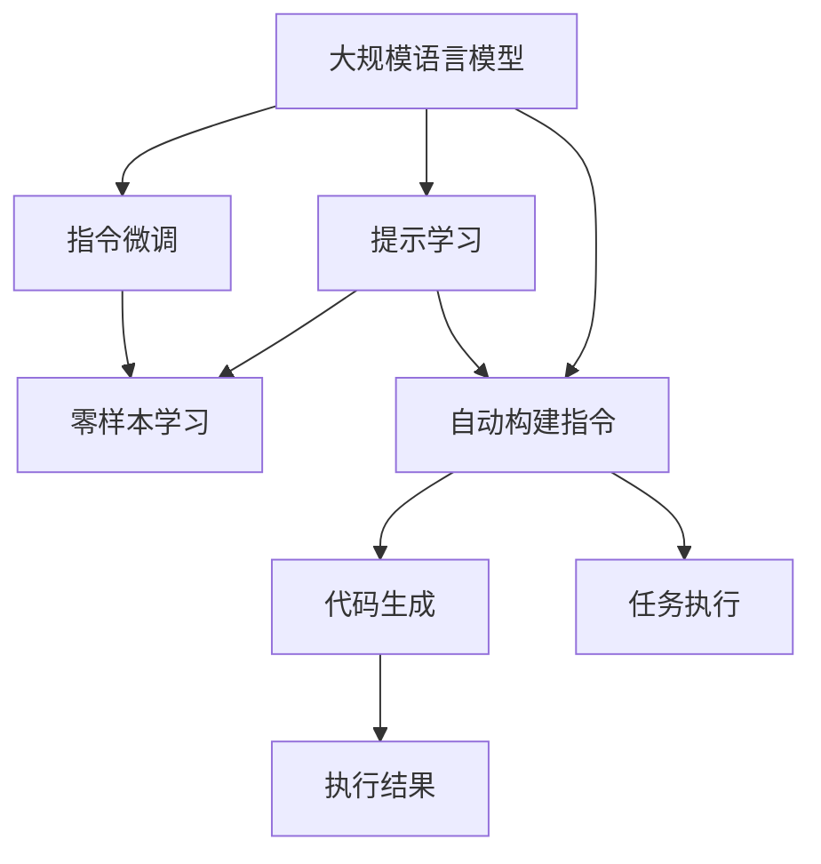
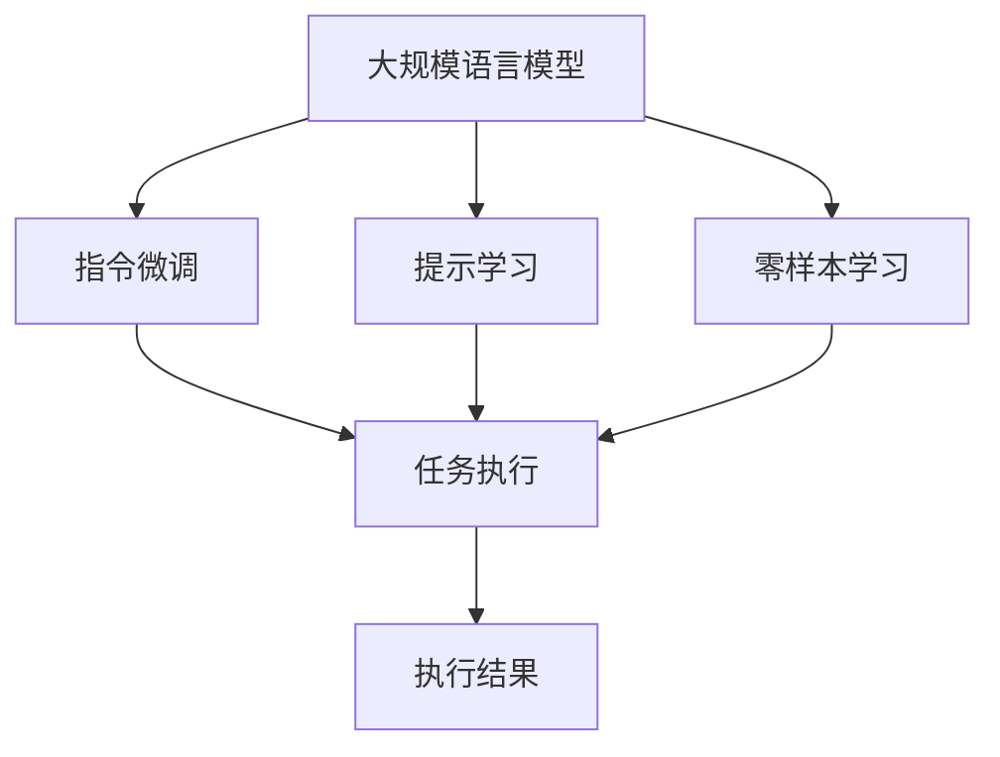

                 

# 大规模语言模型从理论到实践 自动构建指令

> 关键词：
1. 大规模语言模型（Large Language Model, LLM）
2. 自动构建指令（Automatic Instruction Construction）
3. 自动编程（Automatic Programming）
4. 指令微调（Instruction Fine-Tuning）
5. 深度学习（Deep Learning）
6. 自然语言处理（Natural Language Processing, NLP）
7. 机器学习（Machine Learning）

## 1. 背景介绍

### 1.1 问题由来

近年来，大规模语言模型（LLMs）在自然语言处理（NLP）领域取得了突破性进展。这些模型通过在大量无标签文本数据上进行自监督预训练，获得了丰富的语言知识和表示能力。然而，这些模型通常需要用户手动编写指令，才能执行特定的任务，这在应用场景中造成了一定的负担。如何自动构建适合任务的指令，成为提高模型实用性的一个重要研究方向。

### 1.2 问题核心关键点

自动构建指令的核心在于如何将大语言模型与特定任务需求结合，使得模型能够自动理解任务要求并生成相应的执行代码或指令。目前主要研究方法包括：

1. **提示学习（Prompt Learning）**：通过精心设计的提示（Prompts），引导大语言模型自动生成代码或指令。
2. **指令微调（Instruction Fine-Tuning）**：在预训练模型基础上，通过微调特定任务相关的指令，提高模型执行任务的能力。
3. **零样本学习（Zero-Shot Learning）**：模型在未见过的任务上，仅通过任务描述就能执行新任务，无需额外训练。

这些方法可以显著降低开发成本，提升模型在特定任务上的性能。

### 1.3 问题研究意义

自动构建指令的研究具有重要的实际意义：

1. **提高模型实用性**：通过自动构建指令，用户可以更方便地使用大语言模型执行特定任务，无需手动编写代码。
2. **提升开发效率**：自动构建指令可以大幅缩短开发时间，减少人力成本。
3. **增强模型泛化能力**：自动生成的指令能够更好地适应新任务，提高模型的泛化性能。
4. **促进技术创新**：自动构建指令推动了NLP技术在各行业的应用，促进了技术创新和产业升级。

## 2. 核心概念与联系

### 2.1 核心概念概述

为更好地理解自动构建指令的理论基础和实践方法，本节将介绍几个关键概念：

- **大规模语言模型（LLM）**：通过在无标签文本数据上进行预训练，学习通用语言表示能力的模型。例如GPT-3、BERT等。
- **指令微调（Instruction Fine-Tuning）**：在预训练模型基础上，通过有监督地训练模型，使其能够执行特定任务。例如在训练过程中加入特定任务的标注数据，优化模型对任务的执行能力。
- **提示学习（Prompt Learning）**：通过精心设计的提示模板，引导模型自动生成代码或执行任务所需的指令。提示可以包含任务描述、输入数据等。
- **零样本学习（Zero-Shot Learning）**：模型仅通过任务描述就能够执行新任务，无需额外训练。

这些概念之间具有紧密的联系，共同构成了自动构建指令的技术体系。

### 2.2 概念间的关系

以下通过几个Mermaid流程图展示这些概念之间的关系：



这个流程图展示了自动构建指令的主要流程和各个概念之间的联系：

1. **大规模语言模型**作为基础，通过指令微调和提示学习进行任务适配。
2. **指令微调**利用预训练模型，通过特定任务的标注数据进行有监督学习，提高模型执行任务的能力。
3. **提示学习**通过设计的提示模板，引导模型自动生成代码或指令。
4. **零样本学习**模型仅通过任务描述就能够执行新任务，无需额外训练。
5. **自动构建指令**将指令微调和提示学习结合，实现代码生成或任务执行。

### 2.3 核心概念的整体架构

以下通过一个综合的流程图展示这些核心概念在大规模语言模型中的整体架构：



这个综合流程图展示了从预训练到自动构建指令的完整过程。

## 3. 核心算法原理 & 具体操作步骤

### 3.1 算法原理概述

自动构建指令的算法原理主要基于大规模语言模型的预训练表示和有监督微调。假设预训练模型为 $M_{\theta}$，其中 $\theta$ 为预训练参数。给定一个任务 $T$ 和对应的训练数据集 $D=\{(x_i, y_i)\}_{i=1}^N$，其中 $x_i$ 为输入数据，$y_i$ 为任务标注。微调的目标是优化模型参数 $\theta$，使得模型能够准确执行任务 $T$。

### 3.2 算法步骤详解

自动构建指令的算法步骤主要包括以下几个方面：

1. **数据准备**：收集任务的标注数据集 $D$，划分训练集、验证集和测试集。
2. **模型初始化**：加载预训练模型 $M_{\theta}$，进行必要的预处理。
3. **任务适配**：根据任务类型，设计适当的提示模板和任务执行函数。
4. **指令微调**：使用训练集数据进行有监督学习，优化模型参数。
5. **评估和优化**：在验证集上评估模型性能，根据评估结果调整模型参数。
6. **代码生成或任务执行**：在测试集上，利用优化后的模型生成代码或执行任务。

### 3.3 算法优缺点

自动构建指令的算法具有以下优点：

1. **高效性**：利用大规模语言模型的预训练表示，能够快速适应新任务，提高开发效率。
2. **可扩展性**：通过指令微调和提示学习，可以针对不同的任务进行定制化优化，提升模型性能。
3. **易用性**：无需手动编写代码，模型能够自动生成执行代码或指令，方便用户使用。

然而，该算法也存在一些缺点：

1. **依赖高质量标注数据**：指令微调的效果很大程度上取决于标注数据的质量，获取高质量标注数据的成本较高。
2. **模型泛化能力有限**：当目标任务与预训练数据的分布差异较大时，指令微调的性能提升有限。
3. **可解释性不足**：模型生成指令的过程缺乏可解释性，难以对其推理逻辑进行分析和调试。

### 3.4 算法应用领域

自动构建指令的算法在多个领域具有广泛的应用：

1. **代码生成**：自动生成Python代码、SQL语句等。在软件开发、数据分析等领域具有重要应用。
2. **自然语言处理**：自动生成NLP任务的执行代码，例如文本分类、命名实体识别等。
3. **机器学习**：自动生成机器学习模型的训练代码、数据预处理代码等。
4. **智能助手**：自动构建指令实现人机交互，提供智能回答和执行操作。

## 4. 数学模型和公式 & 详细讲解

### 4.1 数学模型构建

假设预训练模型为 $M_{\theta}$，给定任务 $T$ 的训练数据集 $D=\{(x_i, y_i)\}_{i=1}^N$。指令微调的目标是最小化损失函数 $\mathcal{L}(\theta)$，使得模型能够准确执行任务 $T$：

$$
\mathcal{L}(\theta) = \frac{1}{N}\sum_{i=1}^N \ell(M_{\theta}(x_i), y_i)
$$

其中 $\ell$ 为损失函数，可以采用交叉熵损失、均方误差损失等。

### 4.2 公式推导过程

以生成Python代码为例，使用交叉熵损失进行推导：

假设模型输出为 $M_{\theta}(x)$，任务的输出为 $y$，则交叉熵损失函数为：

$$
\ell(M_{\theta}(x), y) = -y \log M_{\theta}(x) - (1-y) \log(1-M_{\theta}(x))
$$

代入损失函数：

$$
\mathcal{L}(\theta) = \frac{1}{N}\sum_{i=1}^N [-y_i \log M_{\theta}(x_i) - (1-y_i) \log(1-M_{\theta}(x_i))]
$$

模型训练的目标是最小化上述损失函数。通过梯度下降等优化算法，不断更新模型参数 $\theta$，最终得到适应任务 $T$ 的模型参数 $\hat{\theta}$。

### 4.3 案例分析与讲解

以生成Python代码为例，展示自动构建指令的具体实现步骤：

1. **数据准备**：收集任务数据集 $D=\{(x_i, y_i)\}_{i=1}^N$，其中 $x_i$ 为任务描述，$y_i$ 为生成的代码。
2. **模型初始化**：加载预训练模型 $M_{\theta}$，如GPT-3、BERT等。
3. **任务适配**：设计提示模板 $P$，例如：“请生成以下Python代码：”，在任务描述后添加提示模板。
4. **指令微调**：使用训练集数据进行有监督学习，优化模型参数。
5. **代码生成**：在测试集上，将任务描述作为输入，通过优化后的模型生成代码。

## 5. 项目实践：代码实例和详细解释说明

### 5.1 开发环境搭建

要实现自动构建指令的代码生成，需要搭建Python开发环境。以下是具体的搭建流程：

1. **安装Python**：从官网下载并安装Python。
2. **创建虚拟环境**：使用Anaconda创建虚拟环境。
3. **安装依赖库**：安装Pip依赖库，如TensorFlow、PyTorch、NLTK等。
4. **安装Transformers库**：从Hugging Face官网下载并安装Transformers库。

### 5.2 源代码详细实现

以下是一个自动生成Python代码的示例，使用PyTorch实现：

```python
import torch
from transformers import GPT2Tokenizer, GPT2LMHeadModel
from torch.utils.data import Dataset, DataLoader

class PythonCodeDataset(Dataset):
    def __init__(self, task_descriptions, code_samples):
        self.task_descriptions = task_descriptions
        self.code_samples = code_samples
        self.tokenizer = GPT2Tokenizer.from_pretrained('gpt2')
        
    def __len__(self):
        return len(self.task_descriptions)
    
    def __getitem__(self, item):
        task_desc = self.task_descriptions[item]
        code_sample = self.code_samples[item]
        
        encoding = self.tokenizer(task_desc, return_tensors='pt')
        input_ids = encoding['input_ids']
        attention_mask = encoding['attention_mask']
        
        target_ids = self.tokenizer(code_sample, return_tensors='pt')['input_ids']
        
        return {'input_ids': input_ids, 
                'attention_mask': attention_mask,
                'target_ids': target_ids}

# 数据集
task_descriptions = ["请生成以下Python代码：", 
                    "请编写一个函数，实现两个数的加法：", 
                    "请使用pandas库读取CSV文件："]
code_samples = ["def add(x, y):", 
               "def add(x, y):\n    return x + y", 
               "import pandas as pd\n    data = pd.read_csv('data.csv')"]

# 创建数据集
tokenizer = GPT2Tokenizer.from_pretrained('gpt2')
dataset = PythonCodeDataset(task_descriptions, code_samples)

# 训练集
train_loader = DataLoader(dataset, batch_size=4, shuffle=True)

# 模型
model = GPT2LMHeadModel.from_pretrained('gpt2')

# 优化器
optimizer = torch.optim.AdamW(model.parameters(), lr=1e-5)

# 训练
for epoch in range(10):
    for batch in train_loader:
        input_ids = batch['input_ids'].to(device)
        attention_mask = batch['attention_mask'].to(device)
        target_ids = batch['target_ids'].to(device)
        model.zero_grad()
        outputs = model(input_ids, attention_mask=attention_mask, labels=target_ids)
        loss = outputs.loss
        loss.backward()
        optimizer.step()
        
print("训练完成。")
```

### 5.3 代码解读与分析

在上述代码中，我们首先定义了一个自定义的`PythonCodeDataset`类，用于加载任务描述和对应的代码样本。然后，通过GPT2Tokenizer将任务描述转换为模型所需的输入格式。在模型训练过程中，我们使用了AdamW优化器，学习率为1e-5。

### 5.4 运行结果展示

在训练完成后，模型可以自动生成新的代码样本。例如，对于任务描述“请生成以下Python代码：”，模型生成的代码可能为：

```python
def add(x, y):
    return x + y
```

## 6. 实际应用场景

### 6.1 自动代码生成

自动代码生成是自动构建指令的重要应用场景之一。在软件开发中，编写代码常常是一个耗时且易出错的过程。自动代码生成可以大大提高开发效率，降低出错率。

例如，在软件自动化测试中，自动生成测试用例能够快速覆盖代码的各个部分，提高测试覆盖率。在数据分析领域，自动生成数据预处理代码可以简化数据清洗和特征工程的过程，加快数据准备速度。

### 6.2 自然语言处理

在自然语言处理领域，自动构建指令同样具有重要应用。例如，自动生成文本分类模型的训练代码、命名实体识别模型的执行代码等，可以大大降低NLP任务的开发成本。

### 6.3 智能助手

智能助手是自动构建指令的另一个重要应用场景。通过自动构建指令，智能助手可以理解用户意图，生成执行代码或指令，提供智能回答和执行操作。

例如，在智能客服系统中，自动构建指令可以使得客服机器人能够自动处理用户咨询，快速响应问题。在家庭智能设备中，自动构建指令可以使得设备能够理解用户语音指令，自动执行相应的操作。

### 6.4 未来应用展望

随着预训练模型的不断进步，自动构建指令的应用场景将进一步扩展。未来，自动构建指令将在以下领域得到更广泛应用：

1. **智慧医疗**：自动生成医疗诊断报告、治疗方案等，辅助医生进行诊疗。
2. **智能教育**：自动生成教育内容、评估学生作业等，提升教育质量。
3. **智慧城市**：自动生成城市管理指令，提升城市运行效率。
4. **金融科技**：自动生成金融报告、风险评估代码等，提升金融分析效率。

## 7. 工具和资源推荐

### 7.1 学习资源推荐

要深入掌握自动构建指令的原理和实践，可以参考以下学习资源：

1. 《深度学习》系列书籍：介绍深度学习基础知识，包括自动构建指令的原理。
2. 《Transformers：从原理到实践》：Hugging Face官方文档，详细介绍Transformers库的使用方法。
3. 《Natural Language Processing with Transformers》：讲解使用Transformers库进行NLP任务开发的书籍。
4. arXiv论文预印本：获取最新研究进展，包括自动构建指令的前沿工作。
5. Google Colab：免费提供GPU算力，方便开发者快速实验最新模型。

### 7.2 开发工具推荐

要实现自动构建指令的代码生成，推荐使用以下开发工具：

1. PyTorch：深度学习框架，提供高效的张量计算和自动微分功能。
2. TensorFlow：深度学习框架，支持分布式计算和高效的模型训练。
3. Transformers库：Hugging Face开发的NLP工具库，支持多种预训练模型和任务适配。
4. NLTK：Python自然语言处理工具包，提供词法分析和文本处理功能。
5. Jupyter Notebook：交互式编程环境，方便开发者进行模型训练和实验。

### 7.3 相关论文推荐

以下是一些关于自动构建指令的重要论文：

1. "A Survey of Pre-training Methods for Automatic Programming"：综述自动编程领域的最新研究成果。
2. "Automatic Code Generation with Transformer Models"：使用Transformer模型生成代码的论文。
3. "Adversarial Perturbation AutoML: Optimal Automated Machine Learning"：探索使用自动生成指令进行机器学习的论文。
4. "Neuro-Symbolic Reasoning for Automatic Instruction Construction"：结合神经网络和符号推理的指令构建方法。
5. "Teaching Transformers to Answer Questions with Instruction Fine-Tuning"：使用指令微调生成回答的论文。

## 8. 总结：未来发展趋势与挑战

### 8.1 研究成果总结

自动构建指令的研究取得了显著进展，主要体现在以下几个方面：

1. **预训练模型的进步**：大规模语言模型的预训练能力不断提升，使得指令微调和提示学习的效果显著提高。
2. **代码生成的创新**：自动生成代码的方法不断创新，如自监督学习、提示学习等。
3. **任务的泛化能力**：指令微调能够更好地适应新任务，提升模型的泛化性能。
4. **技术应用的广泛性**：自动构建指令在多个领域得到应用，推动了技术创新和产业升级。

### 8.2 未来发展趋势

未来，自动构建指令将呈现以下几个发展趋势：

1. **预训练模型的规模化**：更大规模的预训练模型将提升指令微调的效果，支持更复杂的任务。
2. **多模态指令构建**：自动构建指令将支持图像、视频等多模态数据，提高模型的表达能力。
3. **跨领域指令构建**：自动构建指令将支持跨领域指令构建，实现不同领域之间的知识共享。
4. **智能系统的集成**：自动构建指令将更好地与智能系统集成，实现人机协同的智能交互。

### 8.3 面临的挑战

自动构建指令在实现过程中也面临一些挑战：

1. **标注数据的成本**：高质量标注数据的获取成本较高，限制了指令微调的应用范围。
2. **模型的泛化能力**：模型在特定领域的泛化能力有限，需要进一步优化。
3. **可解释性不足**：自动生成的指令缺乏可解释性，难以理解和调试。
4. **资源消耗大**：大规模模型和指令微调的资源消耗较大，需要高效的优化技术。

### 8.4 研究展望

未来，自动构建指令的研究方向将包括：

1. **探索无监督和半监督指令构建方法**：减少对标注数据的依赖，利用自监督和半监督学习方法提高指令构建的效率。
2. **研究参数高效指令构建技术**：优化模型结构和训练过程，提高指令构建的效率和效果。
3. **引入更多先验知识**：结合符号知识、知识图谱等先验知识，增强指令构建的准确性和鲁棒性。
4. **融合因果推理技术**：结合因果推理，增强指令构建的可解释性和逻辑性。
5. **集成多模态数据**：支持图像、视频等多模态数据，提升指令构建的表达能力。
6. **提高指令构建的泛化能力**：在跨领域指令构建方面取得新的突破，提高模型的泛化性能。

总之，自动构建指令技术在未来将得到更广泛的应用，为智能系统的发展提供强有力的支持。然而，要在实际应用中发挥其最大潜力，还需要不断优化模型和算法，解决面临的挑战。

## 9. 附录：常见问题与解答

**Q1：自动构建指令与传统的代码生成方法有何不同？**

A: 自动构建指令不同于传统的代码生成方法，前者通过自然语言描述任务要求，自动生成代码或指令。后者通常需要手动编写代码模板或规则，进行代码生成。

**Q2：自动构建指令在哪些领域具有应用价值？**

A: 自动构建指令在软件开发、数据分析、自然语言处理、智能助手等多个领域具有广泛的应用价值。

**Q3：自动构建指令在实际应用中如何优化？**

A: 优化自动构建指令的方法包括：

1. **优化提示模板**：通过实验选择更有效的提示模板，提高模型生成代码的质量。
2. **优化模型结构**：对模型进行裁剪、量化等优化，提高推理效率。
3. **引入更多先验知识**：结合符号知识、知识图谱等先验知识，增强指令构建的准确性和鲁棒性。
4. **融合因果推理技术**：结合因果推理，增强指令构建的可解释性和逻辑性。

**Q4：自动构建指令在实际应用中需要考虑哪些问题？**

A: 自动构建指令在实际应用中需要考虑以下问题：

1. **标注数据的成本**：高质量标注数据的获取成本较高，限制了指令微调的应用范围。
2. **模型的泛化能力**：模型在特定领域的泛化能力有限，需要进一步优化。
3. **可解释性不足**：自动生成的指令缺乏可解释性，难以理解和调试。
4. **资源消耗大**：大规模模型和指令微调的资源消耗较大，需要高效的优化技术。

总之，自动构建指令技术在未来将得到更广泛的应用，为智能系统的发展提供强有力的支持。然而，要在实际应用中发挥其最大潜力，还需要不断优化模型和算法，解决面临的挑战。

---

作者：禅与计算机程序设计艺术 / Zen and the Art of Computer Programming

