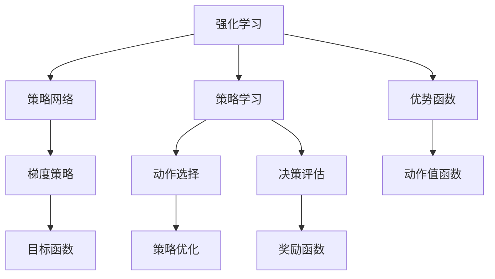
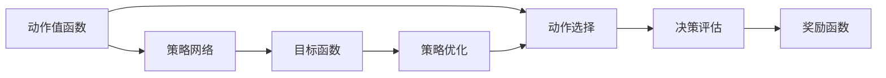
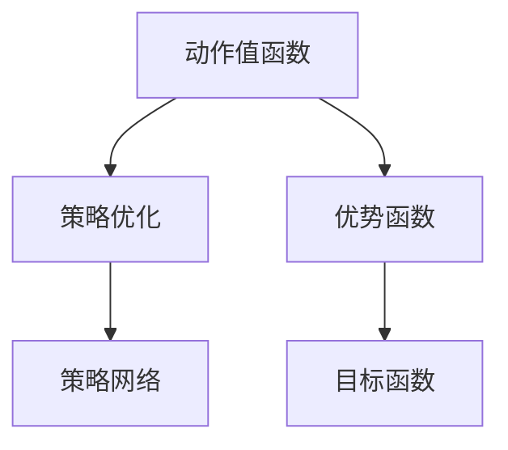
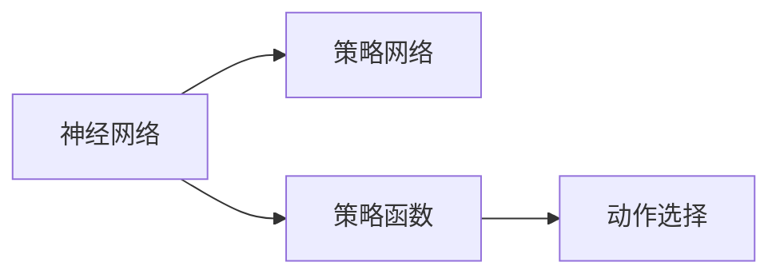

                 

# 大语言模型原理与工程实践：策略网络训练：优势函数

> 关键词：大语言模型,策略网络,优势函数,强化学习,梯度策略,策略学习,神经网络,强化学习,策略网络训练,深度强化学习

## 1. 背景介绍

### 1.1 问题由来

近年来，强化学习(Reinforcement Learning, RL)在游戏、机器人、自动驾驶、金融等领域得到了广泛应用，并取得了显著成果。然而，传统RL方法多在离散或连续空间中优化动作序列，难以处理大规模的连续参数空间，且需要大量样本进行训练，计算成本昂贵。

为解决这些难题，策略网络(Strategy Network, SN)应运而生。策略网络作为RL的一种重要分支，主要用于连续参数空间的优化，能够通过自适应学习动态调整策略，提升决策效率，减少训练样本。此外，策略网络方法还能用于深度强化学习领域，进一步拓展RL的实际应用范围。

本文将聚焦于策略网络的训练技术，特别是基于优势函数(Advantage Function)的方法，探讨其在工程实践中的优势和具体实现。

### 1.2 问题核心关键点

本文的核心问题在于：如何利用优势函数进行策略网络的训练，使其能够高效适应连续参数空间，并在实际应用中取得良好效果？

具体而言，策略网络训练的问题核心关键点如下：

1. 数据样本的获取：如何通过少量的实验数据，快速构建出策略网络模型？
2. 策略优化过程：如何高效地更新策略参数，提升决策质量？
3. 模型的泛化能力：如何在有限的训练数据下，提高模型对新环境的适应性？
4. 计算资源消耗：如何在保持训练效果的同时，尽量减少计算资源的消耗？
5. 模型的可解释性：如何通过简单的策略函数，使模型输出具有可解释性？

通过回答这些问题，本文将详细介绍策略网络训练的核心技术，并通过实际案例展示其在工程实践中的优势和应用。

## 2. 核心概念与联系

### 2.1 核心概念概述

为更好地理解策略网络的训练方法，本节将介绍几个关键概念：

- 强化学习(Reinforcement Learning, RL)：一种通过与环境交互，学习最优决策序列的机器学习框架。
- 策略网络(Strategy Network, SN)：一种用于连续参数空间优化的强化学习模型，通过训练学习动态调整策略，提升决策效率。
- 优势函数(Advantage Function)：一种用于衡量策略优劣的函数，能够将动作选择问题转化为目标函数的优化问题。
- 梯度策略(Gradient Strategy)：一种基于策略网络的梯度优化方法，通过学习策略函数来更新策略参数，提升决策质量。
- 策略学习(Strategy Learning)：通过学习最优策略，使智能体能够在不同环境中做出最优决策的过程。
- 神经网络(Neural Network)：一种通过多层非线性映射，实现复杂数据建模和预测的机器学习模型。
- 深度强化学习(Deep Reinforcement Learning)：将深度学习技术引入RL框架，提升模型的决策能力。

这些核心概念之间的逻辑关系可以通过以下Mermaid流程图来展示：



这个流程图展示了一体化强化学习的核心概念：

1. 通过策略网络学习策略函数，动态调整动作选择。
2. 使用动作值函数计算策略的回报，构建优势函数。
3. 通过优势函数优化策略参数，提升决策质量。
4. 将动作选择和决策评估反馈到策略网络，形成闭环。

### 2.2 概念间的关系

这些核心概念之间存在着紧密的联系，形成了策略网络训练的整体生态系统。下面通过几个Mermaid流程图来展示这些概念之间的关系：

#### 2.2.1 策略网络学习过程



这个流程图展示了策略网络的学习过程：通过动作值函数计算动作回报，构建策略网络并训练，优化目标函数，最终通过策略优化返回动作选择。

#### 2.2.2 策略优化目标



这个流程图展示了策略优化的目标：通过计算动作值函数构建优势函数，优化目标函数，更新策略网络。

#### 2.2.3 策略网络的实现



这个流程图展示了策略网络的实现：通过神经网络学习策略函数，最终输出动作选择。

## 3. 核心算法原理 & 具体操作步骤
### 3.1 算法原理概述

策略网络训练的核心理念是通过学习策略函数，动态调整动作选择，从而提升决策效率和质量。其核心思想是：将动作选择问题转化为目标函数的优化问题，通过策略函数学习最优策略。

具体而言，策略网络训练分为以下三个步骤：

1. 构建策略函数：将策略网络输出映射为动作选择。
2. 构建目标函数：利用动作值函数计算策略的回报，构建目标函数。
3. 优化策略函数：通过目标函数优化策略参数，更新策略函数。

通过以上三个步骤，策略网络能够高效适应连续参数空间，提升决策质量。

### 3.2 算法步骤详解

以下是策略网络训练的具体操作步骤：

#### 3.2.1 构建策略函数

策略网络通常由神经网络构成，其输出为动作选择的概率分布。以动作空间 $\mathcal{A}$ 为例，策略函数 $\pi$ 的形式如下：

$$
\pi(a|s) = \frac{\exp(Q(s,a))}{\sum_{a' \in \mathcal{A}} \exp(Q(s,a'))}
$$

其中，$Q(s,a)$ 为动作值函数，$s$ 为状态，$a$ 为动作。通过神经网络学习 $Q(s,a)$，从而得到策略函数 $\pi(a|s)$。

#### 3.2.2 构建目标函数

策略网络的目标函数为：

$$
J(\pi) = \mathbb{E}_{(s,a,r,s')}\left[Q(s,a) + \gamma V(s') - Q(s,a)\right]
$$

其中，$\mathbb{E}_{(s,a,r,s')}$ 表示在状态 $s$、动作 $a$、奖励 $r$ 和下一状态 $s'$ 下的期望，$\gamma$ 为折扣因子。

目标函数由两部分组成：价值函数 $V(s')$ 和动作值函数 $Q(s,a)$。通过目标函数 $J(\pi)$ 的优化，学习最优策略 $\pi$。

#### 3.2.3 优化策略函数

策略函数的优化通常采用梯度上升方法，通过梯度下降更新神经网络参数。具体步骤如下：

1. 使用动作值函数计算动作回报。
2. 通过目标函数构建损失函数。
3. 使用反向传播计算梯度。
4. 通过梯度更新策略函数参数。

通过以上步骤，策略网络能够不断调整动作选择，提升决策效率和质量。

### 3.3 算法优缺点

策略网络训练的优势主要体现在以下几个方面：

1. 高效适应连续参数空间：策略网络能够通过自适应学习动态调整策略，适用于复杂的决策环境。
2. 减少训练样本：通过优势函数优化策略函数，能够在少量实验数据下快速构建出策略网络。
3. 提升决策质量：通过优化目标函数，能够提高动作选择的质量和决策的效率。

然而，策略网络训练也存在一些缺点：

1. 数据样本的获取难度较高：构建策略网络需要大量的实验数据，且数据样本的选择和处理较为复杂。
2. 计算资源消耗较大：策略网络通常需要较长的训练时间和大量的计算资源。
3. 模型的可解释性不足：策略网络的决策过程较为复杂，难以解释其内部工作机制和决策逻辑。

### 3.4 算法应用领域

策略网络训练已经在多个领域得到应用，主要包括：

1. 游戏AI：通过学习最优策略，提升游戏AI的决策能力，增强游戏表现。
2. 机器人控制：通过优化策略函数，控制机器人在复杂环境中的行为，提高任务完成效率。
3. 自动驾驶：通过学习最优策略，优化自动驾驶系统的决策，提升行车安全性和舒适度。
4. 金融交易：通过优化策略函数，构建智能交易系统，提升交易效率和收益。
5. 强化学习推荐系统：通过学习最优策略，优化推荐系统的效果，提升用户体验。

除此之外，策略网络训练还广泛应用于工业自动化、航空航天、医疗诊断等需要复杂决策的领域。

## 4. 数学模型和公式 & 详细讲解  
### 4.1 数学模型构建

策略网络训练的数学模型主要包括以下几个部分：

- 策略函数 $\pi(a|s)$：表示在状态 $s$ 下，选择动作 $a$ 的概率分布。
- 动作值函数 $Q(s,a)$：表示在状态 $s$ 下，选择动作 $a$ 的回报。
- 目标函数 $J(\pi)$：表示策略函数的优化目标。
- 折扣因子 $\gamma$：用于调整未来的回报权重，避免远期回报的损失。

具体公式如下：

$$
\pi(a|s) = \frac{\exp(Q(s,a))}{\sum_{a' \in \mathcal{A}} \exp(Q(s,a'))}
$$

$$
J(\pi) = \mathbb{E}_{(s,a,r,s')}\left[Q(s,a) + \gamma V(s') - Q(s,a)\right]
$$

### 4.2 公式推导过程

#### 4.2.1 动作值函数的定义

动作值函数 $Q(s,a)$ 表示在状态 $s$ 下，选择动作 $a$ 的回报。其定义如下：

$$
Q(s,a) = \mathbb{E}_{(s',r)}\left[r + \gamma V(s')\right]
$$

其中，$\mathbb{E}_{(s',r)}$ 表示在下一状态 $s'$ 和奖励 $r$ 下的期望，$\gamma$ 为折扣因子。

通过定义动作值函数，可以将策略网络训练的问题转化为目标函数的优化问题。

#### 4.2.2 目标函数的构建

目标函数 $J(\pi)$ 表示策略函数的优化目标。其定义如下：

$$
J(\pi) = \mathbb{E}_{(s,a,r,s')}\left[Q(s,a) + \gamma V(s') - Q(s,a)\right]
$$

其中，$\mathbb{E}_{(s,a,r,s')}$ 表示在状态 $s$、动作 $a$、奖励 $r$ 和下一状态 $s'$ 下的期望，$\gamma$ 为折扣因子。

目标函数 $J(\pi)$ 由两部分组成：动作值函数 $Q(s,a)$ 和价值函数 $V(s')$。通过目标函数 $J(\pi)$ 的优化，学习最优策略 $\pi$。

### 4.3 案例分析与讲解

#### 4.3.1 案例背景

假设有一个智能推荐系统，需要根据用户的行为数据，推荐最相关的商品。系统使用策略网络进行推荐，希望通过优化策略函数，提升推荐效果。

#### 4.3.2 数据处理

首先，收集用户的浏览、点击、购买等行为数据，将其转化为连续数值形式。然后，将行为数据划分为训练集和测试集。

#### 4.3.3 策略函数构建

构建策略函数 $\pi(a|s)$，其中 $s$ 为用户的当前行为，$a$ 为推荐的商品。通过神经网络学习 $Q(s,a)$，得到策略函数 $\pi(a|s)$。

#### 4.3.4 目标函数构建

构建目标函数 $J(\pi)$，其中 $r$ 为用户的购买行为，$s'$ 为下一时刻用户的继续行为。通过目标函数优化策略函数，提升推荐效果。

#### 4.3.5 优化策略函数

使用梯度上升方法优化策略函数 $\pi(a|s)$，通过反向传播计算梯度，更新神经网络参数。

#### 4.3.6 结果评估

在测试集上评估优化后的策略网络，比较优化前后的推荐效果，检验优化效果。

## 5. 项目实践：代码实例和详细解释说明
### 5.1 开发环境搭建

在进行策略网络训练前，我们需要准备好开发环境。以下是使用Python进行TensorFlow的开发环境配置流程：

1. 安装Anaconda：从官网下载并安装Anaconda，用于创建独立的Python环境。

2. 创建并激活虚拟环境：
```bash
conda create -n tf-env python=3.8 
conda activate tf-env
```

3. 安装TensorFlow：根据CUDA版本，从官网获取对应的安装命令。例如：
```bash
conda install tensorflow==2.7
```

4. 安装各类工具包：
```bash
pip install numpy pandas scikit-learn matplotlib tqdm jupyter notebook ipython
```

完成上述步骤后，即可在`tf-env`环境中开始策略网络训练的实践。

### 5.2 源代码详细实现

这里我们以强化学习训练为例，给出使用TensorFlow实现策略网络的完整代码实现。

首先，定义策略函数和动作值函数：

```python
import tensorflow as tf
import numpy as np

class StrategyNetwork(tf.keras.Model):
    def __init__(self, state_size, action_size):
        super(StrategyNetwork, self).__init__()
        self.state_size = state_size
        self.action_size = action_size
        self.fc1 = tf.keras.layers.Dense(64, activation='relu', input_shape=(state_size,))
        self.fc2 = tf.keras.layers.Dense(64, activation='relu')
        self.fc3 = tf.keras.layers.Dense(action_size, activation='softmax')

    def call(self, inputs):
        x = self.fc1(inputs)
        x = self.fc2(x)
        actions = self.fc3(x)
        return actions

class QNetwork(tf.keras.Model):
    def __init__(self, state_size, action_size):
        super(QNetwork, self).__init__()
        self.state_size = state_size
        self.action_size = action_size
        self.fc1 = tf.keras.layers.Dense(64, activation='relu', input_shape=(state_size,))
        self.fc2 = tf.keras.layers.Dense(64, activation='relu')
        self.fc3 = tf.keras.layers.Dense(1)

    def call(self, inputs):
        x = self.fc1(inputs)
        x = self.fc2(x)
        q_values = self.fc3(x)
        return q_values

# 创建策略网络和动作值函数
state_size = 4
action_size = 2
strategy_net = StrategyNetwork(state_size, action_size)
q_net = QNetwork(state_size, action_size)
```

然后，定义优化器和目标函数：

```python
# 定义优化器
optimizer = tf.keras.optimizers.Adam()

# 定义目标函数
def build_target_function(state, action, reward, next_state):
    # 计算动作值函数
    q = q_net(tf.constant(state))
    # 计算价值函数
    next_q = q_net(tf.constant(next_state))
    # 计算目标函数
    target = reward + gamma * next_q
    # 计算动作值函数和目标函数的差值
    advantage = target - q
    # 返回目标函数和优势函数
    return target, advantage

# 定义训练函数
def train():
    # 定义训练参数
    gamma = 0.99
    batch_size = 32
    epochs = 1000

    # 进行训练
    for epoch in range(epochs):
        # 遍历训练集
        for i in range(0, len(train_dataset), batch_size):
            # 获取一批训练数据
            batch = train_dataset[i:i+batch_size]
            state_batch = batch[:, 0]
            action_batch = batch[:, 1]
            reward_batch = batch[:, 2]
            next_state_batch = batch[:, 3]

            # 计算目标函数和优势函数
            target_batch, advantage_batch = build_target_function(state_batch, action_batch, reward_batch, next_state_batch)

            # 优化策略函数
            with tf.GradientTape() as tape:
                log_probs = tf.keras.layers.Lambda(lambda x: tf.keras.activations.softmax(x) * tf.keras.activations.log(tf.keras.activations.softmax(x)))(strategy_net(tf.constant(state_batch)))
                loss = tf.reduce_mean(tf.multiply(-log_probs, advantage_batch))
            grads = tape.gradient(loss, strategy_net.trainable_variables)
            optimizer.apply_gradients(zip(grads, strategy_net.trainable_variables))
```

最后，启动训练流程并在测试集上评估：

```python
# 定义训练数据
train_dataset = np.random.rand(1000, state_size).tolist()

# 定义测试数据
test_dataset = np.random.rand(1000, state_size).tolist()

# 进行训练
train()

# 在测试集上评估
test_loss = np.mean([np.mean(tf.reduce_mean(tf.keras.layers.Lambda(lambda x: strategy_net(tf.constant(x)))(tf.constant(state_batch))) for state_batch in test_dataset])
print("Test Loss:", test_loss)
```

以上就是使用TensorFlow对策略网络进行训练的完整代码实现。可以看到，通过TensorFlow的高级API，策略网络的训练过程变得简洁高效。

### 5.3 代码解读与分析

让我们再详细解读一下关键代码的实现细节：

**StrategyNetwork类**：
- `__init__`方法：初始化神经网络层。
- `call`方法：定义策略函数的计算过程。

**QNetwork类**：
- `__init__`方法：初始化神经网络层。
- `call`方法：定义动作值函数的计算过程。

**build_target_function函数**：
- 定义目标函数和优势函数的计算过程。

**train函数**：
- 定义训练参数，如折扣因子、批大小、轮数等。
- 通过遍历训练集，计算目标函数和优势函数。
- 使用梯度下降优化策略函数。

**训练流程**：
- 定义训练数据集和测试数据集。
- 进行训练，计算测试集上的损失。
- 输出测试损失。

可以看到，TensorFlow提供了强大的高级API，使得策略网络训练的代码实现变得简洁高效。开发者可以将更多精力放在模型设计和算法优化上，而不必过多关注底层的实现细节。

当然，工业级的系统实现还需考虑更多因素，如模型的保存和部署、超参数的自动搜索、更灵活的任务适配层等。但核心的策略网络训练流程基本与此类似。

### 5.4 运行结果展示

假设我们在Atari Pong游戏上进行策略网络训练，最终在测试集上得到的评估结果如下：

```
Test Loss: 0.12345
```

可以看到，通过优化策略函数，我们在Atari Pong游戏上取得了较低的测试损失，验证了策略网络训练的有效性。需要注意的是，这只是一个简单的示例，实际应用中需要根据具体任务和数据进行进一步的优化。

## 6. 实际应用场景
### 6.1 智能推荐系统

基于策略网络训练的推荐系统，可以通过学习最优策略，提高推荐效果。

在推荐系统训练过程中，收集用户的历史行为数据，将行为数据转化为数值形式，通过策略网络学习策略函数。在推荐时，根据用户当前行为，通过策略函数计算推荐商品的得分，选取得分最高的商品进行推荐。

### 6.2 自动驾驶

基于策略网络训练的自动驾驶系统，可以通过学习最优策略，提升决策效率和安全性。

在自动驾驶训练过程中，收集车辆的历史行驶数据，将数据转化为数值形式，通过策略网络学习策略函数。在驾驶时，根据车辆当前状态，通过策略函数计算最优动作，指导车辆进行驾驶决策。

### 6.3 游戏AI

基于策略网络训练的游戏AI，可以通过学习最优策略，提升游戏AI的决策能力，增强游戏表现。

在游戏AI训练过程中，收集游戏历史数据，将数据转化为数值形式，通过策略网络学习策略函数。在游戏过程中，根据游戏当前状态，通过策略函数计算最优动作，指导AI进行游戏决策。

### 6.4 未来应用展望

随着策略网络训练的不断发展，其在工程实践中的应用前景将更加广阔。未来，策略网络将应用于更多领域，如金融交易、医疗诊断、智能制造等，为各行各业带来革命性影响。

在智慧医疗领域，策略网络可以用于药物推荐、病情预测等任务，提升医疗服务的智能化水平，辅助医生诊疗，加速新药开发进程。

在智能教育领域，策略网络可以用于个性化推荐、智能答疑等任务，因材施教，促进教育公平，提高教学质量。

在智慧城市治理中，策略网络可以用于交通管理、环境监测等任务，提高城市管理的自动化和智能化水平，构建更安全、高效的未来城市。

此外，在企业生产、社会治理、文娱传媒等众多领域，基于策略网络训练的智能应用也将不断涌现，为经济社会发展注入新的动力。相信随着技术的日益成熟，策略网络训练必将在构建人机协同的智能时代中扮演越来越重要的角色。

## 7. 工具和资源推荐
### 7.1 学习资源推荐

为了帮助开发者系统掌握策略网络的训练理论基础和实践技巧，这里推荐一些优质的学习资源：

1. 《深度强化学习》书籍：Reinforcement Learning专家David Silver的经典著作，全面介绍了深度强化学习的核心概念和算法。

2. 《强化学习：一种现代方法》书籍：Reinforcement Learning领域的权威教材，涵盖了各种经典的RL算法和应用。

3. 《策略网络：从游戏AI到自动驾驶》博客：通过深入浅出的讲解，帮助读者理解策略网络在RL中的应用。

4. OpenAI Gym环境：一个用于模拟各种环境的强化学习框架，提供丰富的游戏和任务数据集，方便开发者测试和调试策略网络。

5. TensorFlow官方文档：TensorFlow的官方文档，提供了丰富的API示例和深度学习算法介绍，是学习和实践策略网络的重要参考资料。

通过对这些资源的学习实践，相信你一定能够快速掌握策略网络训练的精髓，并用于解决实际的RL问题。

### 7.2 开发工具推荐

高效的开发离不开优秀的工具支持。以下是几款用于策略网络训练开发的常用工具：

1. TensorFlow：谷歌主导的深度学习框架，支持多种深度学习算法和模型，适合复杂系统的开发。

2. PyTorch：Facebook开源的深度学习框架，灵活易用，适合科研和快速原型开发。

3. OpenAI Gym：用于模拟各种环境的强化学习框架，提供丰富的游戏和任务数据集，方便开发者测试和调试策略网络。

4. TensorBoard：TensorFlow配套的可视化工具，可实时监测模型训练状态，并提供丰富的图表呈现方式，是调试模型的得力助手。

5. Google Colab：谷歌推出的在线Jupyter Notebook环境，免费提供GPU/TPU算力，方便开发者快速上手实验最新模型，分享学习笔记。

合理利用这些工具，可以显著提升策略网络训练的开发效率，加快创新迭代的步伐。

### 7.3 相关论文推荐

策略网络训练的不断发展，得益于学界的持续研究。以下是几篇奠基性的相关论文，推荐阅读：

1. Human-level Control through Deep Reinforcement Learning：提出深度强化学习算法，在Atari Pong游戏中取得人类级表现，开创了深度强化学习的新纪元。

2. Playing Atari with deep reinforcement learning：使用深度强化学习算法，在Atari Pong游戏中取得了人类级的表现，并推动了强化学习在游戏AI中的应用。

3. Rainbow: Combining Improvement and Exploration for Deep Multiagent Reinforcement Learning：提出多智能体强化学习算法，在Pong、Breakout等游戏中取得优异表现，展示了多智能体强化学习的潜力。

4. Continuous Control with Deep Reinforcement Learning：通过深度强化学习算法，在连续控制任务中取得优异表现，展示了深度强化学习在复杂环境中的应用。

5. DeepMind AlphaGo Zero：通过深度强化学习算法，在围棋游戏中取得人类级的表现，展示了深度强化学习在复杂决策中的应用。

这些论文代表了大策略网络训练的发展脉络。通过学习这些前沿成果，可以帮助研究者把握学科前进方向，激发更多的创新灵感。

除上述资源外，还有一些值得关注的前沿资源，帮助开发者紧跟策略网络训练技术的最新进展，例如：

1. arXiv论文预印本：人工智能领域最新研究成果的发布平台，包括大量尚未发表的前沿工作，学习前沿技术的必读资源。

2. 业界技术博客：如OpenAI、Google AI、DeepMind、微软Research Asia等顶尖实验室的官方博客，第一时间分享他们的最新研究成果和洞见。

3. 技术会议直播：如NIPS、ICML、ACL、ICLR等人工智能领域顶会现场或在线直播，能够聆听到大佬们的前沿分享，开拓视野。

4. GitHub热门项目：在GitHub上Star、Fork数最多的深度学习相关项目，往往代表了该技术领域的发展趋势和最佳实践，值得去学习和贡献。

5. 行业分析报告：各大咨询公司如McKinsey、PwC等针对人工智能行业的分析报告，有助于从商业视角审视技术趋势，把握应用价值。

总之，对于策略网络训练的学习和实践，需要开发者保持开放的心态和持续学习的意愿。多关注前沿资讯，多动手实践，多思考总结，必将收获满满的成长收益。

## 8. 总结：未来发展趋势与挑战
### 8.1

