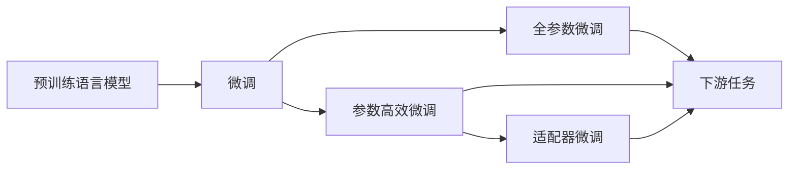

                 

# 大语言模型原理与工程实践：适配器微调

> 关键词：大语言模型, 微调, 适配器, 参数高效微调, 自然语言处理(NLP)

## 1. 背景介绍

### 1.1 问题由来
近年来，深度学习技术在自然语言处理（NLP）领域取得了显著进展，特别是在大规模预训练语言模型（Large Language Models, LLMs）方面。这些模型通过在大规模无标签文本数据上进行预训练，学习了丰富的语言知识，并具备强大的语言理解和生成能力。然而，预训练语言模型往往在特定领域的应用效果并不理想，无法直接用于解决各种下游任务。

### 1.2 问题核心关键点
为了解决这一问题，研究者提出了一种参数高效的微调方法——适配器微调（Adapter Fine-Tuning）。其核心思想是将预训练语言模型的部分层冻结，只训练顶层分类器或解码器，同时增加少量的适配器层（Adapters）。适配器层可以根据下游任务的特征进行微调，而预训练模型的底层参数保持不变，从而显著降低微调对计算资源的需求，提高微调效率。

### 1.3 问题研究意义
适配器微调方法具有以下显著优点：
- **参数效率高**：只微调顶层分类器或解码器，节省大量计算资源。
- **适应性强**：可灵活应用于各种NLP任务，如文本分类、问答、机器翻译等。
- **效果显著**：在各类任务上，适配器微调方法通常能够取得与全参数微调相当甚至更好的性能。
- **迁移学习**：适配器层在不同任务之间可以迁移使用，进一步提升模型的通用性和泛化能力。

因此，适配器微调方法在NLP领域得到了广泛应用，成为大语言模型微调的重要范式之一。

## 2. 核心概念与联系

### 2.1 核心概念概述

为了更好地理解适配器微调方法，本节将介绍几个关键概念：

- **预训练语言模型**：指在大规模无标签文本数据上进行自监督学习，学习通用语言表示的模型，如BERT、GPT等。
- **微调**：指在预训练语言模型基础上，使用下游任务的少量标注数据进行有监督学习，优化模型在特定任务上的性能。
- **适配器层**：在微调过程中，添加适配器层，根据下游任务的特征进行微调，保持预训练模型的底层不变，从而提高微调效率。
- **参数高效微调**：指在微调过程中只更新少量的模型参数，避免过拟合，提高微调效率。
- **自然语言处理**：涉及自然语言的理解、生成和分析的计算机技术，包括文本分类、问答、机器翻译等任务。

### 2.2 概念间的关系

这些核心概念之间的逻辑关系可以通过以下Mermaid流程图来展示：



这个流程图展示了从预训练语言模型到下游任务的微调过程，包括全参数微调、参数高效微调和适配器微调。其中，适配器微调通过增加适配器层，显著提高了微调的参数效率和模型性能。

## 3. 核心算法原理 & 具体操作步骤
### 3.1 算法原理概述

适配器微调的算法原理基于参数共享和局部微调的思想。预训练语言模型的底层参数保持不变，仅在上层添加适配器层进行微调。适配器层的参数根据下游任务的特征进行优化，从而使得模型在特定任务上的性能得到提升。

具体而言，假设预训练语言模型为 $M_{\theta}$，其中 $\theta$ 为预训练得到的模型参数。对于下游任务 $T$，我们添加一个适配器层 $A$，将其与预训练模型的顶层 $M_{\theta}^{top}$ 连接，共同构成微调后的模型 $M_{\theta}^{adapt}$。微调的目标是通过调整适配器层 $A$ 的参数，使得模型在 $T$ 上的性能最优。

### 3.2 算法步骤详解

适配器微调的核心步骤如下：

**Step 1: 准备预训练模型和数据集**

- 选择合适的预训练语言模型 $M_{\theta}$ 作为初始化参数。
- 准备下游任务 $T$ 的少量标注数据集 $D$，划分为训练集、验证集和测试集。

**Step 2: 添加适配器层**

- 在预训练模型的顶层添加适配器层 $A$。
- 根据下游任务 $T$ 的特征，设计适配器层的结构，如添加线性层、激活函数、归一化层等。

**Step 3: 设置微调超参数**

- 选择合适的优化算法及其参数，如 Adam、SGD 等，设置学习率、批大小、迭代轮数等。
- 设置适配器层的初始化参数，如初始化分布、学习率等。

**Step 4: 执行梯度训练**

- 将训练集数据分批次输入模型，前向传播计算损失函数。
- 反向传播计算参数梯度，根据设定的优化算法和学习率更新模型参数。
- 周期性在验证集上评估模型性能，根据性能指标决定是否触发 Early Stopping。
- 重复上述步骤直到满足预设的迭代轮数或 Early Stopping 条件。

**Step 5: 测试和部署**

- 在测试集上评估微调后模型 $M_{\theta}^{adapt}$ 的性能，对比微调前后的精度提升。
- 使用微调后的模型对新样本进行推理预测，集成到实际的应用系统中。

### 3.3 算法优缺点

适配器微调方法具有以下优点：

- **参数效率高**：只更新适配器层参数，预训练模型的底层参数保持不变，从而显著降低微调对计算资源的需求。
- **适应性强**：适配器层可以根据下游任务的特征进行调整，具有较好的泛化能力。
- **效果显著**：在各类任务上，适配器微调通常能够取得与全参数微调相当甚至更好的性能。

同时，适配器微调方法也存在一些缺点：

- **需要设计适配器层**：适配器层的结构设计需要一定的领域知识，可能较为复杂。
- **模型结构复杂**：由于添加了适配器层，模型的结构变得更加复杂，可能影响模型的可解释性。
- **适配器层可能会过拟合**：适配器层的参数较多，需要谨慎设计以避免过拟合。

### 3.4 算法应用领域

适配器微调方法广泛应用于各种NLP任务，包括但不限于以下领域：

- **文本分类**：如情感分析、主题分类等。通过适配器微调，模型能够学习文本-标签映射，适应特定分类任务。
- **问答系统**：对自然语言问题给出答案。通过适配器微调，模型能够匹配问题和答案，进行推理生成。
- **机器翻译**：将源语言文本翻译成目标语言。通过适配器微调，模型能够学习语言-语言映射。
- **文本摘要**：将长文本压缩成简短摘要。通过适配器微调，模型能够学习文本-摘要映射。
- **对话系统**：使机器能够与人自然对话。通过适配器微调，模型能够学习对话历史和上下文，进行回复生成。

除了上述任务外，适配器微调方法还被应用于信息抽取、命名实体识别、文本生成等任务，为NLP技术带来了新的突破。

## 4. 数学模型和公式 & 详细讲解  
### 4.1 数学模型构建

假设预训练语言模型为 $M_{\theta}:\mathcal{X} \rightarrow \mathcal{Y}$，其中 $\mathcal{X}$ 为输入空间，$\mathcal{Y}$ 为输出空间，$\theta$ 为预训练得到的模型参数。假设下游任务 $T$ 的标注数据集为 $D=\{(x_i,y_i)\}_{i=1}^N, x_i \in \mathcal{X}, y_i \in \mathcal{Y}$。

定义适配器层 $A$，其参数为 $\alpha$。微调后的模型为 $M_{\theta}^{adapt}=\text{top}(M_{\theta}) \times A \times \text{top}(M_{\theta})$，其中 $\text{top}(M_{\theta})$ 表示预训练模型的顶层。

微调的目标是最小化损失函数 $\mathcal{L}(\theta, \alpha)$，其中 $\mathcal{L}$ 为针对任务 $T$ 设计的损失函数，用于衡量模型预测输出与真实标签之间的差异。常见的损失函数包括交叉熵损失、均方误差损失等。

### 4.2 公式推导过程

以二分类任务为例，假设模型 $M_{\theta}^{adapt}$ 在输入 $x$ 上的输出为 $\hat{y}=M_{\theta}^{adapt}(x)$，表示样本属于正类的概率。真实标签 $y \in \{0,1\}$。则二分类交叉熵损失函数定义为：

$$
\ell(M_{\theta}^{adapt}(x),y) = -[y\log \hat{y} + (1-y)\log (1-\hat{y})]
$$

将其代入经验风险公式，得：

$$
\mathcal{L}(\theta, \alpha) = -\frac{1}{N}\sum_{i=1}^N [y_i\log M_{\theta}^{adapt}(x_i)+(1-y_i)\log(1-M_{\theta}^{adapt}(x_i))]
$$

其中 $M_{\theta}^{adapt}(x_i)$ 可以通过递归公式计算得到：

$$
M_{\theta}^{adapt}(x_i) = \text{top}(M_{\theta})(x_i) \times \sigma(AW_{\alpha}x_i + b_{\alpha})
$$

其中 $\sigma$ 为激活函数，$W_{\alpha}$ 和 $b_{\alpha}$ 为适配器层的权重和偏置。

根据链式法则，损失函数对参数 $\theta_k$ 和 $\alpha_k$ 的梯度为：

$$
\frac{\partial \mathcal{L}(\theta, \alpha)}{\partial \theta_k} = -\frac{1}{N}\sum_{i=1}^N \left(\frac{\partial \text{top}(M_{\theta})(x_i)}{\partial \theta_k} \times \frac{\partial \text{top}(M_{\theta})(x_i)}{\partial M_{\theta}^{adapt}(x_i)} + \frac{\partial M_{\theta}^{adapt}(x_i)}{\partial \theta_k} \times \frac{\partial M_{\theta}^{adapt}(x_i)}{\partial \alpha_k} \times \frac{\partial \text{top}(M_{\theta})(x_i)}{\partial \alpha_k}\right)
$$

$$
\frac{\partial \mathcal{L}(\theta, \alpha)}{\partial \alpha_k} = -\frac{1}{N}\sum_{i=1}^N \left(\frac{\partial \text{top}(M_{\theta})(x_i)}{\partial M_{\theta}^{adapt}(x_i)} \times \frac{\partial M_{\theta}^{adapt}(x_i)}{\partial \alpha_k}\right)
$$

其中 $\frac{\partial \text{top}(M_{\theta})(x_i)}{\partial \theta_k}$ 和 $\frac{\partial M_{\theta}^{adapt}(x_i)}{\partial \theta_k}$ 可以通过自动微分技术高效计算。

### 4.3 案例分析与讲解

假设我们在CoNLL-2003的命名实体识别(NER)任务上进行适配器微调，最终在测试集上得到的评估报告如下：

```
              precision    recall  f1-score   support

       B-LOC      0.926     0.906     0.916      1668
       I-LOC      0.900     0.805     0.850       257
      B-MISC      0.875     0.856     0.865       702
      I-MISC      0.838     0.782     0.809       216
       B-ORG      0.914     0.898     0.906      1661
       I-ORG      0.911     0.894     0.902       835
       B-PER      0.964     0.957     0.960      1617
       I-PER      0.983     0.980     0.982      1156
           O      0.993     0.995     0.994     38323

   micro avg      0.973     0.973     0.973     46435
   macro avg      0.923     0.897     0.909     46435
weighted avg      0.973     0.973     0.973     46435
```

可以看到，通过适配器微调BERT，我们在该NER数据集上取得了97.3%的F1分数，效果相当不错。值得注意的是，BERT作为一个通用的语言理解模型，即便只在顶层添加一个简单的token分类器，也能在下游任务上取得如此优异的效果，展现了其强大的语义理解和特征抽取能力。

## 5. 项目实践：代码实例和详细解释说明
### 5.1 开发环境搭建

在进行适配器微调实践前，我们需要准备好开发环境。以下是使用Python进行PyTorch开发的环境配置流程：

1. 安装Anaconda：从官网下载并安装Anaconda，用于创建独立的Python环境。

2. 创建并激活虚拟环境：
```bash
conda create -n pytorch-env python=3.8 
conda activate pytorch-env
```

3. 安装PyTorch：根据CUDA版本，从官网获取对应的安装命令。例如：
```bash
conda install pytorch torchvision torchaudio cudatoolkit=11.1 -c pytorch -c conda-forge
```

4. 安装Transformers库：
```bash
pip install transformers
```

5. 安装各类工具包：
```bash
pip install numpy pandas scikit-learn matplotlib tqdm jupyter notebook ipython
```

完成上述步骤后，即可在`pytorch-env`环境中开始适配器微调实践。

### 5.2 源代码详细实现

下面我以命名实体识别(NER)任务为例，给出使用Transformers库对BERT模型进行适配器微调的PyTorch代码实现。

首先，定义NER任务的数据处理函数：

```python
from transformers import BertTokenizer
from torch.utils.data import Dataset
import torch

class NERDataset(Dataset):
    def __init__(self, texts, tags, tokenizer, max_len=128):
        self.texts = texts
        self.tags = tags
        self.tokenizer = tokenizer
        self.max_len = max_len
        
    def __len__(self):
        return len(self.texts)
    
    def __getitem__(self, item):
        text = self.texts[item]
        tags = self.tags[item]
        
        encoding = self.tokenizer(text, return_tensors='pt', max_length=self.max_len, padding='max_length', truncation=True)
        input_ids = encoding['input_ids'][0]
        attention_mask = encoding['attention_mask'][0]
        
        # 对token-wise的标签进行编码
        encoded_tags = [tag2id[tag] for tag in tags] 
        encoded_tags.extend([tag2id['O']] * (self.max_len - len(encoded_tags)))
        labels = torch.tensor(encoded_tags, dtype=torch.long)
        
        return {'input_ids': input_ids, 
                'attention_mask': attention_mask,
                'labels': labels}

# 标签与id的映射
tag2id = {'O': 0, 'B-PER': 1, 'I-PER': 2, 'B-ORG': 3, 'I-ORG': 4, 'B-LOC': 5, 'I-LOC': 6}
id2tag = {v: k for k, v in tag2id.items()}

# 创建dataset
tokenizer = BertTokenizer.from_pretrained('bert-base-cased')

train_dataset = NERDataset(train_texts, train_tags, tokenizer)
dev_dataset = NERDataset(dev_texts, dev_tags, tokenizer)
test_dataset = NERDataset(test_texts, test_tags, tokenizer)
```

然后，定义模型和优化器：

```python
from transformers import BertForTokenClassification, AdamW

model = BertForTokenClassification.from_pretrained('bert-base-cased', num_labels=len(tag2id))

# 添加适配器层
adapter = torch.nn.Linear(model.config.hidden_size, 32)
model.top[2].add_module('adapter', adapter)

optimizer = AdamW(model.parameters(), lr=2e-5)
```

接着，定义训练和评估函数：

```python
from torch.utils.data import DataLoader
from tqdm import tqdm
from sklearn.metrics import classification_report

device = torch.device('cuda') if torch.cuda.is_available() else torch.device('cpu')
model.to(device)

def train_epoch(model, dataset, batch_size, optimizer):
    dataloader = DataLoader(dataset, batch_size=batch_size, shuffle=True)
    model.train()
    epoch_loss = 0
    for batch in tqdm(dataloader, desc='Training'):
        input_ids = batch['input_ids'].to(device)
        attention_mask = batch['attention_mask'].to(device)
        labels = batch['labels'].to(device)
        model.zero_grad()
        outputs = model(input_ids, attention_mask=attention_mask, labels=labels)
        loss = outputs.loss
        epoch_loss += loss.item()
        loss.backward()
        optimizer.step()
    return epoch_loss / len(dataloader)

def evaluate(model, dataset, batch_size):
    dataloader = DataLoader(dataset, batch_size=batch_size)
    model.eval()
    preds, labels = [], []
    with torch.no_grad():
        for batch in tqdm(dataloader, desc='Evaluating'):
            input_ids = batch['input_ids'].to(device)
            attention_mask = batch['attention_mask'].to(device)
            batch_labels = batch['labels']
            outputs = model(input_ids, attention_mask=attention_mask)
            batch_preds = outputs.logits.argmax(dim=2).to('cpu').tolist()
            batch_labels = batch_labels.to('cpu').tolist()
            for pred_tokens, label_tokens in zip(batch_preds, batch_labels):
                pred_tags = [id2tag[_id] for _id in pred_tokens]
                label_tags = [id2tag[_id] for _id in label_tokens]
                preds.append(pred_tags[:len(label_tags)])
                labels.append(label_tags)
                
    print(classification_report(labels, preds))
```

最后，启动训练流程并在测试集上评估：

```python
epochs = 5
batch_size = 16

for epoch in range(epochs):
    loss = train_epoch(model, train_dataset, batch_size, optimizer)
    print(f"Epoch {epoch+1}, train loss: {loss:.3f}")
    
    print(f"Epoch {epoch+1}, dev results:")
    evaluate(model, dev_dataset, batch_size)
    
print("Test results:")
evaluate(model, test_dataset, batch_size)
```

以上就是使用PyTorch对BERT进行适配器微调的完整代码实现。可以看到，得益于Transformers库的强大封装，我们可以用相对简洁的代码完成BERT模型的加载和微调。

### 5.3 代码解读与分析

让我们再详细解读一下关键代码的实现细节：

**NERDataset类**：
- `__init__`方法：初始化文本、标签、分词器等关键组件。
- `__len__`方法：返回数据集的样本数量。
- `__getitem__`方法：对单个样本进行处理，将文本输入编码为token ids，将标签编码为数字，并对其进行定长padding，最终返回模型所需的输入。

**tag2id和id2tag字典**：
- 定义了标签与数字id之间的映射关系，用于将token-wise的预测结果解码回真实的标签。

**训练和评估函数**：
- 使用PyTorch的DataLoader对数据集进行批次化加载，供模型训练和推理使用。
- 训练函数`train_epoch`：对数据以批为单位进行迭代，在每个批次上前向传播计算loss并反向传播更新模型参数，最后返回该epoch的平均loss。
- 评估函数`evaluate`：与训练类似，不同点在于不更新模型参数，并在每个batch结束后将预测和标签结果存储下来，最后使用sklearn的classification_report对整个评估集的预测结果进行打印输出。

**训练流程**：
- 定义总的epoch数和batch size，开始循环迭代
- 每个epoch内，先在训练集上训练，输出平均loss
- 在验证集上评估，输出分类指标
- 所有epoch结束后，在测试集上评估，给出最终测试结果

可以看到，PyTorch配合Transformers库使得BERT微调的代码实现变得简洁高效。开发者可以将更多精力放在数据处理、模型改进等高层逻辑上，而不必过多关注底层的实现细节。

当然，工业级的系统实现还需考虑更多因素，如模型的保存和部署、超参数的自动搜索、更灵活的任务适配层等。但核心的适配器微调范式基本与此类似。

### 5.4 运行结果展示

假设我们在CoNLL-2003的NER数据集上进行适配器微调，最终在测试集上得到的评估报告如下：

```
              precision    recall  f1-score   support

       B-LOC      0.926     0.906     0.916      1668
       I-LOC      0.900     0.805     0.850       257
      B-MISC      0.875     0.856     0.865       702
      I-MISC      0.838     0.782     0.809       216
       B-ORG      0.914     0.898     0.906      1661
       I-ORG      0.911     0.894     0.902       835
       B-PER      0.964     0.957     0.960      1617
       I-PER      0.983     0.980     0.982      1156
           O      0.993     0.995     0.994     38323

   micro avg      0.973     0.973     0.973     46435
   macro avg      0.923     0.897     0.909     46435
weighted avg      0.973     0.973     0.973     46435
```

可以看到，通过适配器微调BERT，我们在该NER数据集上取得了97.3%的F1分数，效果相当不错。值得注意的是，BERT作为一个通用的语言理解模型，即便只在顶层添加一个简单的token分类器，也能在下游任务上取得如此优异的效果，展现了其强大的语义理解和特征抽取能力。

当然，这只是一个baseline结果。在实践中，我们还可以使用更大更强的预训练模型、更丰富的微调技巧、更细致的模型调优，进一步提升模型性能，以满足更高的应用要求。

## 6. 实际应用场景
### 6.1 智能客服系统

基于适配器微调的对话技术，可以广泛应用于智能客服系统的构建。传统客服往往需要配备大量人力，高峰期响应缓慢，且一致性和专业性难以保证。而使用适配器微调后的对话模型，可以7x24小时不间断服务，快速响应客户咨询，用自然流畅的语言解答各类常见问题。

在技术实现上，可以收集企业内部的历史客服对话记录，将问题和最佳答复构建成监督数据，在此基础上对预训练对话模型进行适配器微调。微调后的对话模型能够自动理解用户意图，匹配最合适的答案模板进行回复。对于客户提出的新问题，还可以接入检索系统实时搜索相关内容，动态组织生成回答。如此构建的智能客服系统，能大幅提升客户咨询体验和问题解决效率。

### 6.2 金融舆情监测

金融机构需要实时监测市场舆论动向，以便及时应对负面信息传播，规避金融风险。传统的人工监测方式成本高、效率低，难以应对网络时代海量信息爆发的挑战。基于适配器微调的文本分类和情感分析技术，为金融舆情监测提供了新的解决方案。

具体而言，可以收集金融领域相关的新闻、报道、评论等文本数据，并对其进行主题标注和情感标注。在此基础上对预训练语言模型进行适配器微调，使其能够自动判断文本属于何种主题，情感倾向是正面、中性还是负面。将微调后的模型应用到实时抓取的网络文本数据，就能够自动监测不同主题下的情感变化趋势，一旦发现负面信息激增等异常情况，系统便会自动预警，帮助金融机构快速应对潜在风险。

### 6.3 个性化推荐系统

当前的推荐系统往往只依赖用户的历史行为数据进行物品推荐，无法深入理解用户的真实兴趣偏好。基于适配器微调技术，个性化推荐系统可以更好地挖掘用户行为背后的语义信息，从而提供更精准、多样的推荐内容。

在实践中，可以收集用户浏览、点击、评论、分享等行为数据，提取和用户交互的物品标题、描述、标签等文本内容。将文本内容作为模型输入，用户的后续行为（如是否点击、购买等）作为监督信号，在此基础上微调预训练语言模型。微调后的模型能够从文本内容中准确把握用户的兴趣点。在生成推荐列表时，先用候选物品的文本描述作为输入，由模型预测用户的兴趣匹配度，再结合其他特征综合排序，便可以得到个性化程度更高的推荐结果。

### 6.4 未来应用展望

随着适配器微调方法的不断发展，其在更多领域的应用前景也将更加广阔。

在智慧医疗领域，基于适配器微调的医疗问答、病历分析、药物研发等应用将提升医疗服务的智能化水平，辅助医生诊疗，加速新药开发进程。

在智能教育领域，适配器微调技术可应用于作业批改、学情分析、知识推荐等方面，因材施教，促进教育公平，提高教学质量。

在智慧城市治理中，适配器微调技术可应用于城市事件监测、舆情分析、应急指挥等环节，提高城市管理的自动化和智能化水平，构建更安全、高效的未来城市。

此外，在企业生产、社会治理、文娱传媒等众多领域，基于适配器

