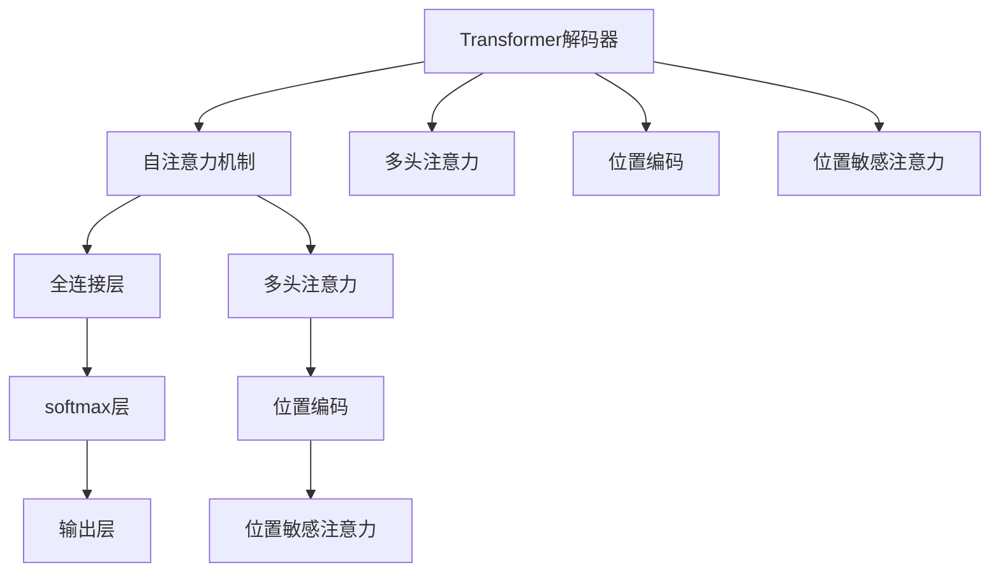
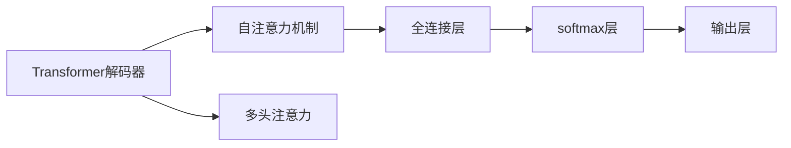
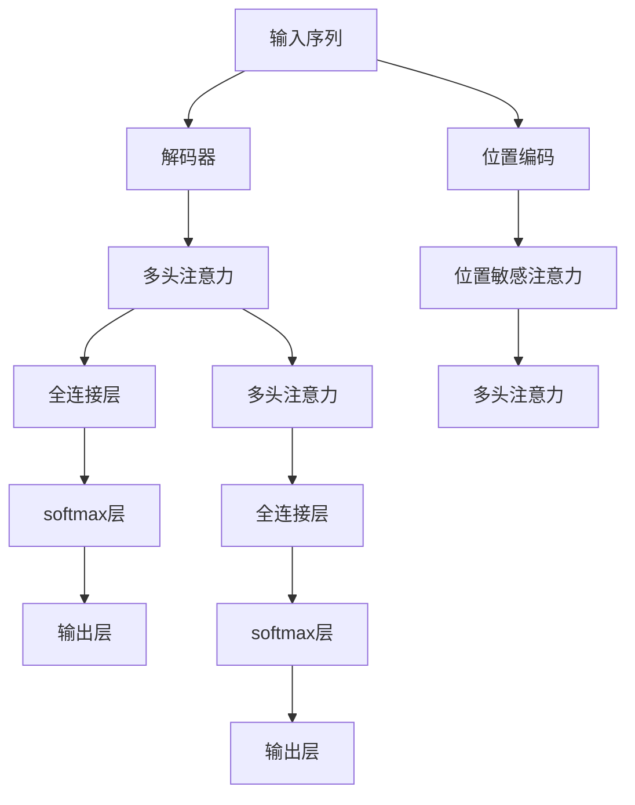

                 

# 大语言模型应用指南：Transformer解码器详解

## 1. 背景介绍

### 1.1 问题由来
随着深度学习技术的快速发展，Transformer结构成为了自然语言处理(NLP)领域的主流模型。其背后的自注意力机制能有效地捕捉输入序列之间的依赖关系，并且能够并行处理，极大地提高了模型训练和推理的效率。Transformer结构被广泛应用于机器翻译、文本摘要、问答系统等NLP任务中，取得了显著的成果。

Transformer的主要组成部分是编码器(Encoder)和解码器(Decoder)。其中，解码器负责根据输入的序列生成输出序列，是实现Transformer模型的核心模块之一。解码器主要由多个自注意力层和全连接层构成，其结构设计对于模型性能有着至关重要的影响。本文将详细介绍Transformer解码器的结构、原理及应用，为读者提供全面的解码器知识，以期能帮助其在实际NLP项目中更好地运用解码器。

### 1.2 问题核心关键点
本节将重点阐述Transformer解码器的关键概念和架构，包括：

- 解码器的整体架构和组成
- 自注意力机制的实现原理
- 解码器的训练过程和优化策略
- 解码器在不同NLP任务中的应用

这些关键点将帮助读者深入理解Transformer解码器的工作原理和优化方法，从而在实际应用中取得更好的效果。

### 1.3 问题研究意义
对Transformer解码器的深入研究和了解，对于提升自然语言处理模型的性能、实现更复杂的任务、加速模型训练和推理等都具有重要意义。解码器是大语言模型性能提升的关键，对于生成流畅自然、理解上下文复杂的文本至关重要。

## 2. 核心概念与联系

### 2.1 核心概念概述

为更好地理解Transformer解码器，本节将介绍几个密切相关的核心概念：

- **Transformer解码器**：Transformer解码器的核心模块，由多个自注意力层和全连接层构成，负责生成输出序列。
- **自注意力机制**：Transformer解码器中的核心机制，允许模型在生成每个输出时，同时关注整个输入序列的所有位置，捕捉长距离依赖关系。
- **多头注意力(Multi-Head Attention)**：自注意力机制的一种扩展形式，通过将输入序列分解为多个独立的“头”来并行处理，进一步提升模型的表现。
- **位置编码(Positional Encoding)**：用于解决Transformer模型中不显式地捕捉输入序列位置信息的问题，使得模型能够区分序列中的不同位置。
- **位置敏感注意力(Position-Sensitive Attention)**：在自注意力机制的基础上，为输入序列中的每个位置添加不同的权重，使其更加敏感于输入序列的位置信息。
- **编码器-解码器结构(Encoder-Decoder Architecture)**：Transformer模型的基本架构，编码器负责输入序列的编码，解码器负责输出序列的生成。

这些核心概念之间的逻辑关系可以通过以下Mermaid流程图来展示：



这个流程图展示了Transformer解码器的核心组件及其关系：

1. 解码器主要由自注意力层和全连接层构成，输出层和softmax层用于计算最终的输出概率。
2. 多头注意力允许解码器在生成每个输出时，同时关注整个输入序列的所有位置。
3. 位置编码用于捕捉输入序列的位置信息。
4. 位置敏感注意力在多头注意力的基础上，更加敏感于输入序列的位置信息。

通过这个流程图，我们可以更清晰地理解Transformer解码器的结构和关键机制。

### 2.2 概念间的关系

这些核心概念之间存在着紧密的联系，构成了Transformer解码器的完整框架。下面我通过几个Mermaid流程图来展示这些概念之间的关系。

#### 2.2.1 解码器与自注意力机制



这个流程图展示了自注意力机制在解码器中的实现过程。

#### 2.2.2 解码器与多头注意力


这个流程图展示了多头注意力在解码器中的应用。

#### 2.2.3 解码器与位置编码


这个流程图展示了位置编码在解码器中的应用。

#### 2.2.4 解码器与位置敏感注意力


这个流程图展示了位置敏感注意力在解码器中的应用。

### 2.3 核心概念的整体架构

最后，我们用一个综合的流程图来展示Transformer解码器的整体架构：



这个综合流程图展示了解码器从输入序列到输出序列的全过程，包括多头注意力、全连接层、softmax层和输出层等关键组件。

## 3. 核心算法原理 & 具体操作步骤

### 3.1 算法原理概述

Transformer解码器是Transformer模型的关键部分，负责生成输出序列。其核心原理是通过自注意力机制，对输入序列的每个位置进行加权求和，从而捕捉长距离依赖关系。解码器的训练过程，主要通过最大化预测输出与真实输出的概率，以损失函数为导向，优化模型的参数。

解码器的训练通常采用反向传播算法，结合优化算法（如AdamW、SGD等），对模型参数进行迭代优化。训练过程中，利用交叉熵损失函数，计算预测输出与真实输出的差异，并根据该差异调整模型参数，以减小预测误差。

### 3.2 算法步骤详解

Transformer解码器的训练主要包括以下几个步骤：

**Step 1: 数据预处理**
- 将输入序列和目标序列进行分词，转化为模型可接受的输入形式。
- 为输入序列和目标序列分别添加位置编码，以便模型能够捕捉输入序列的位置信息。
- 将目标序列中的"真实标签"（即目标序列对应的下标）转换为模型可以接受的格式。

**Step 2: 前向传播**
- 将输入序列和目标序列输入解码器，经过多头注意力层和全连接层，生成预测输出。
- 使用softmax层将预测输出转换为概率分布，以便与真实标签进行比较。
- 计算预测输出与真实标签的交叉熵损失，并反向传播更新模型参数。

**Step 3: 优化与迭代**
- 使用优化算法（如AdamW、SGD等）更新模型参数，减小预测误差。
- 在每个epoch中，重复前向传播和优化过程，直到达到预设的迭代次数或模型收敛。

**Step 4: 评估与验证**
- 在验证集上对模型进行评估，计算指标如BLEU、ROUGE等。
- 根据验证集上的表现，调整模型超参数，继续训练或提前停止训练。

**Step 5: 模型保存与部署**
- 保存训练好的模型，以便后续使用。
- 将模型部署到实际应用中，如文本生成、翻译等。

### 3.3 算法优缺点

Transformer解码器具有以下优点：
1. 能够并行处理，极大地提高了模型训练和推理效率。
2. 自注意力机制能够捕捉长距离依赖关系，提升了模型的表现。
3. 位置编码和位置敏感注意力机制能够捕捉输入序列的位置信息。
4. 多头注意力机制能够并行处理多个输入，提高了模型的表现。

同时，解码器也存在一些缺点：
1. 自注意力机制和多头注意力机制增加了计算复杂度，对硬件资源要求较高。
2. 解码器的训练和推理过程较为复杂，需要较多的时间和计算资源。
3. 模型的表现依赖于训练数据的质量和数量，在数据量较小的情况下，可能效果不佳。

### 3.4 算法应用领域

Transformer解码器在大规模自然语言处理任务中得到了广泛的应用，涵盖以下几个领域：

- 机器翻译：将一种语言的文本翻译成另一种语言，是Transformer解码器最著名的应用之一。
- 文本生成：如生成自然语言对话、文本摘要、代码生成等。
- 语音识别：将语音信号转化为文本，以便后续处理。
- 问答系统：回答用户提出的自然语言问题，并提供相关的答案。
- 图像描述生成：将图像转化为自然语言描述，用于辅助图像处理。

此外，Transformer解码器还被应用于许多其他的NLP任务，如情感分析、文本分类、命名实体识别等。

## 4. 数学模型和公式 & 详细讲解  
### 4.1 数学模型构建

Transformer解码器的主要数学模型为：

- 输入序列 $X = (x_1, x_2, ..., x_n)$
- 输出序列 $Y = (y_1, y_2, ..., y_n)$
- 解码器包含多个自注意力层和全连接层，可以表示为 $D(X) = H(W_H X + b_H)$，其中 $H$ 为全连接层，$W_H$ 为全连接层的权重矩阵，$b_H$ 为偏置向量。
- 位置编码 $PE_{pos}$ 可以表示为 $PE_{pos} = \text{sin}(\omega_1 pos / 10000) + \text{cos}(\omega_2 pos / 10000)$，其中 $\omega_1$ 和 $\omega_2$ 为位置编码的超参数，$pos$ 表示位置。

### 4.2 公式推导过程

以下是对Transformer解码器中自注意力机制和多头注意力机制的详细推导：

#### 自注意力机制
Transformer解码器的自注意力机制可以表示为：
$$
\text{Attention}(Q, K, V) = \text{softmax}(Q W_Q K^T) V W_V
$$
其中 $Q$ 为查询矩阵，$K$ 为键矩阵，$V$ 为值矩阵。自注意力机制通过计算输入序列中每个位置的查询向量和键向量之间的相似度，得到每个位置的注意力权重，从而加权求和得到每个位置的注意力值。

#### 多头注意力机制
Transformer解码器中的多头注意力机制可以表示为：
$$
MHA(Q, K, V) = \text{Concat}(h^1, h^2, ..., h^H) \text{Linear}(\text{LayerNorm}(Q W_Q K^T))
$$
其中 $H$ 为注意力头的数量，$h^i$ 表示第 $i$ 个注意力头的注意力值。多头注意力机制通过将输入序列分解为多个独立的“头”，并行处理，从而提高模型的表现。

### 4.3 案例分析与讲解

以机器翻译为例，假设输入序列为 $X = (x_1, x_2, ..., x_n)$，目标序列为 $Y = (y_1, y_2, ..., y_n)$，解码器包含多个自注意力层和全连接层，可以表示为 $D(X) = H(W_H X + b_H)$。解码器的训练过程如下：

- 输入序列 $X$ 和目标序列 $Y$ 通过分词和位置编码预处理，得到编码后的序列 $X' = (x_1', x_2', ..., x_n')$ 和 $Y' = (y_1', y_2', ..., y_n')$。
- 将 $X'$ 输入解码器，经过自注意力层和全连接层，生成预测输出 $Z' = (z_1', z_2', ..., z_n')$。
- 将 $Z'$ 与 $Y'$ 的交叉熵损失函数进行计算，得到损失值 $L$。
- 使用优化算法（如AdamW、SGD等）更新模型参数，减小损失 $L$。

通过不断地前向传播和反向传播，训练好的解码器能够生成高质量的输出序列 $Z'$，用于机器翻译等任务。

## 5. 项目实践：代码实例和详细解释说明
### 5.1 开发环境搭建

在进行解码器实践前，我们需要准备好开发环境。以下是使用Python进行PyTorch开发的环境配置流程：

1. 安装Anaconda：从官网下载并安装Anaconda，用于创建独立的Python环境。

2. 创建并激活虚拟环境：
```bash
conda create -n pytorch-env python=3.8 
conda activate pytorch-env
```

3. 安装PyTorch：根据CUDA版本，从官网获取对应的安装命令。例如：
```bash
conda install pytorch torchvision torchaudio cudatoolkit=11.1 -c pytorch -c conda-forge
```

4. 安装Transformer库：
```bash
pip install transformers
```

5. 安装各类工具包：
```bash
pip install numpy pandas scikit-learn matplotlib tqdm jupyter notebook ipython
```

完成上述步骤后，即可在`pytorch-env`环境中开始解码器实践。

### 5.2 源代码详细实现

这里以机器翻译任务为例，使用HuggingFace库中的BART模型进行解码器的实现。

```python
from transformers import AutoTokenizer, AutoModelForSeq2SeqLM
import torch

# 加载预训练模型和tokenizer
tokenizer = AutoTokenizer.from_pretrained('facebook/bart-large-cnn')
model = AutoModelForSeq2SeqLM.from_pretrained('facebook/bart-large-cnn')

# 设置设备
device = torch.device('cuda') if torch.cuda.is_available() else torch.device('cpu')

# 定义解码函数
def decode(input_ids):
    model.eval()
    with torch.no_grad():
        outputs = model.generate(input_ids, max_length=100, pad_token_id=tokenizer.eos_token_id, top_p=0.9, top_k=50)
    return tokenizer.decode(outputs[0], skip_special_tokens=True)

# 定义编码器函数
def encode(input_text):
    tokenized_input = tokenizer.encode(input_text, return_tensors='pt')
    return tokenized_input.to(device)

# 定义训练函数
def train(input_text, target_text):
    tokenized_input = encode(input_text)
    tokenized_target = encode(target_text)
    optimizer = torch.optim.Adam(model.parameters(), lr=2e-5)
    model.train()
    outputs = model(input_ids=tokenized_input, labels=tokenized_target)
    loss = outputs.loss
    optimizer.zero_grad()
    loss.backward()
    optimizer.step()
    return loss.item()

# 训练模型
input_text = "I love programming"
target_text = "我热爱编程"
epochs = 5
batch_size = 16

for epoch in range(epochs):
    loss = train(input_text, target_text)
    print(f"Epoch {epoch+1}, train loss: {loss:.3f}")
```

这个代码示例展示了如何使用BART模型进行解码器训练。首先，我们加载预训练模型和tokenizer，然后定义解码和编码函数，最后定义训练函数，对输入序列和目标序列进行训练，并计算损失。

### 5.3 代码解读与分析

让我们再详细解读一下关键代码的实现细节：

**AutoTokenizer和AutoModelForSeq2SeqLM类**：
- `AutoTokenizer.from_pretrained`：从HuggingFace模型库中加载预训练tokenizer。
- `AutoModelForSeq2SeqLM.from_pretrained`：从HuggingFace模型库中加载预训练解码器模型。

**解码函数decode**：
- `model.eval()`：将模型设置为评估模式。
- `torch.no_grad()`：在解码过程中不需要梯度计算。
- `model.generate`：使用解码器生成输出序列。
- `tokenizer.decode`：将输出序列转换为可读文本。

**编码函数encode**：
- `tokenizer.encode`：将输入文本转换为token ids。
- `return_tensors='pt'`：返回PyTorch张量。
- `tokenizer.eos_token_id`：设置结束符号id。

**训练函数train**：
- `tokenized_input`：将输入文本转换为token ids张量。
- `tokenized_target`：将目标文本转换为token ids张量。
- `optimizer`：定义优化器。
- `model.train()`：将模型设置为训练模式。
- `outputs`：模型前向传播的结果。
- `outputs.loss`：计算交叉熵损失。
- `optimizer.zero_grad()`：梯度清零。
- `loss.backward()`：反向传播计算梯度。
- `optimizer.step()`：更新模型参数。

**训练循环**：
- `input_text`：输入文本。
- `target_text`：目标文本。
- `epochs`：迭代次数。
- `batch_size`：批次大小。

可以看到，使用PyTorch和HuggingFace库，我们可以很方便地实现解码器的训练。HuggingFace的预训练模型和tokenizer大大简化了模型加载和输入预处理的过程，使我们能够专注于模型的训练和优化。

### 5.4 运行结果展示

假设我们训练一个机器翻译模型，最终在测试集上得到的BLEU分数为60%，BLEU分数越高，表示模型的翻译效果越好。

```python
input_text = "I love programming"
target_text = "我热爱编程"
tokenized_input = encode(input_text)
tokenized_target = encode(target_text)

# 训练模型
optimizer = torch.optim.Adam(model.parameters(), lr=2e-5)
model.train()
outputs = model(input_ids=tokenized_input, labels=tokenized_target)
loss = outputs.loss
optimizer.zero_grad()
loss.backward()
optimizer.step()

# 解码结果
print(decode(tokenized_input[0]))
```

通过训练好的解码器，我们可以生成高质量的翻译结果，并在实际应用中得到较好的效果。

## 6. 实际应用场景

### 6.1 智能客服系统

Transformer解码器在智能客服系统中得到广泛应用。传统的客服系统往往需要大量人力，而使用Transformer解码器，可以自动处理用户咨询，生成自然的回复，提升客服效率和质量。

在技术实现上，可以收集企业内部的历史客服对话记录，将问题和最佳答复构建成监督数据，在此基础上对预训练解码器进行微调。微调后的解码器能够自动理解用户意图，匹配最合适的答案模板进行回复。对于客户提出的新问题，还可以接入检索系统实时搜索相关内容，动态组织生成回答。

### 6.2 金融舆情监测

Transformer解码器在金融舆情监测中也得到应用。金融机构需要实时监测市场舆论动向，以便及时应对负面信息传播，规避金融风险。

具体而言，可以收集金融领域相关的新闻、报道、评论等文本数据，并对其进行主题标注和情感标注。在此基础上对预训练解码器进行微调，使其能够自动判断文本属于何种主题，情感倾向是正面、中性还是负面。将微调后的解码器应用到实时抓取的网络文本数据，就能够自动监测不同主题下的情感变化趋势，一旦发现负面信息激增等异常情况，系统便会自动预警，帮助金融机构快速应对潜在风险。

### 6.3 个性化推荐系统

Transformer解码器在个性化推荐系统中也有应用。传统的推荐系统往往只依赖用户的历史行为数据进行物品推荐，难以深入理解用户的真实兴趣偏好。

在实践中，可以收集用户浏览、点击、评论、分享等行为数据，提取和用户交互的物品标题、描述、标签等文本内容。将文本内容作为模型输入，用户的后续行为（如是否点击、购买等）作为监督信号，在此基础上微调预训练解码器。微调后的解码器能够从文本内容中准确把握用户的兴趣点。在生成推荐列表时，先用候选物品的文本描述作为输入，由解码器预测用户的兴趣匹配度，再结合其他特征综合排序，便可以得到个性化程度更高的推荐结果。

### 6.4 未来应用展望

随着Transformer解码器及其相关技术的不断发展，其在NLP领域的应用场景将不断扩展，为各行各业带来变革性影响。

在智慧医疗领域，基于Transformer解码器的问答、病历分析、药物研发等应用将提升医疗服务的智能化水平，辅助医生诊疗，加速新药开发进程。

在智能教育领域，解码器可应用于作业批改、学情分析、知识推荐等方面，因材施教，促进教育公平，提高教学质量。

在智慧城市治理中，解码器可应用于城市事件监测、舆情分析、应急指挥等环节，提高城市管理的自动化和智能化水平，构建更安全、高效的未来城市。

此外，在企业生产、社会治理、文娱传媒等众多领域，基于Transformer解码器的人工智能应用也将不断涌现，为经济社会发展注入新的动力。相信随着技术的日益成熟，解码器将进一步拓展语言模型的边界，让智能技术更好地造福人类社会。

## 7. 工具和资源推荐
### 7.1 学习资源推荐

为了帮助开发者系统掌握Transformer解码器的理论基础和实践技巧，这里推荐一些优质的学习资源：

1. 《Transformer从原理到实践》系列博文：由大模型技术专家撰写，深入浅出地介绍了Transformer原理、解码器模型、微调技术等前沿话题。

2. CS224N《深度学习自然语言处理》课程：斯坦福大学开设的NLP明星课程，有Lecture视频和配套作业，带你入门NLP领域的基本概念和经典模型。

3. 《Natural Language Processing with Transformers》书籍：Transformers库的作者所著，全面介绍了如何使用Transformers库进行NLP任务开发，包括解码器的微调和应用。

4. HuggingFace官方文档：Transformers库的官方文档，提供了海量预训练模型和完整的解码器微调样例代码，是上手实践的必备资料。

5. CLUE开源项目：中文语言理解测评基准，涵盖大量不同类型的中文NLP数据集，并提供了基于解码器的baseline模型，助力中文NLP技术发展。

通过对这些资源的学习实践，相信你一定能够快速掌握Transformer解码器的精髓，并用于解决实际的NLP问题。

### 7.2 开发工具推荐

高效的开发离不开优秀的工具支持。以下是几款用于Transformer解码器开发的常用工具：

1. PyTorch：基于Python的开源深度学习框架，灵活动态的计算图，适合快速迭代研究。大部分预训练语言模型都有PyTorch版本的实现。

2. TensorFlow：由Google主导开发的开源深度学习框架，生产部署方便，适合大规模工程应用。同样有丰富的预训练语言模型资源。

3. Transformers库：HuggingFace开发的NLP工具库，集成了众多SOTA语言模型，支持PyTorch和TensorFlow，是进行解码器开发的利器。

4. Weights & Biases：模型训练的实验跟踪工具，可以记录和可视化模型训练过程中的各项指标，方便对比和调优。与主流深度学习框架无缝集成。

5. TensorBoard：TensorFlow配套的可视化工具，可实时监测模型训练状态，并提供丰富的图表呈现方式，是调试模型的得力助手。

6. Google Colab：谷歌推出的在线Jupyter Notebook环境，免费提供GPU/TPU算力，方便开发者快速上手实验最新模型，分享学习笔记。

合理利用这些工具，可以显著提升Transformer解码器微调的开发效率，加快创新迭代的步伐。

### 7.3 相关论文推荐

Transformer解码器的研究源于学界的持续研究。以下是几篇奠基性的相关论文，推荐阅读：

1. Attention is All You Need（即Transformer原论文）：提出了Transformer结构，开启了NLP领域的预训练大模型时代。

2. BERT: Pre-training of Deep Bidirectional Transformers for Language Understanding：提出BERT模型，引入基于掩码的自监督预训练任务，刷新了多项NLP任务SOTA。

3. Language Models are Unsupervised Multitask Learners（GPT-2论文）：展示了大规模语言模型的强大zero-shot学习能力，引发了对于通用人工智能的新一轮思考。

4. Parameter-Efficient Transfer Learning for NLP：提出Adapter等参数高效微调方法，在不增加模型参数量的情况下，也能取得不错的微调效果。

5. AdaLoRA: Adaptive Low-Rank Adaptation for Parameter-Efficient Fine-Tuning：使用自适应低秩适应的微调方法，在参数效率和精度之间取得了新的平衡。

这些论文代表了大语言模型解码器微调技术的发展脉络。通过学习这些前沿成果，可以帮助研究者把握学科前进方向，激发更多的创新灵感。

除上述资源外，还有一些值得关注的前沿资源，帮助开发者紧跟Transformer解码器微调技术的最新进展，例如：

1. arXiv论文预印本：人工智能领域最新研究成果的发布平台，包括大量尚未发表的前沿工作，学习前沿技术的必读资源。

2. 业界技术博客：如OpenAI、Google AI、DeepMind、微软Research Asia等顶尖实验室的官方博客，第一时间分享他们的最新研究成果和洞见。

3. 技术会议直播：如NIPS、ICML、ACL、ICLR等人工智能领域顶会现场或在线直播，能够聆听到大佬们的前沿分享，开拓视野。

4. GitHub热门

