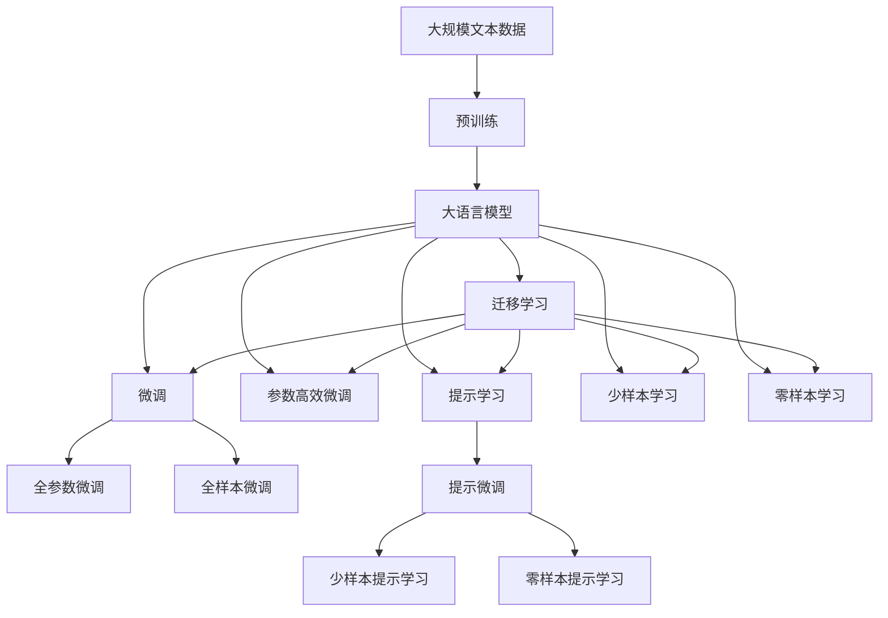
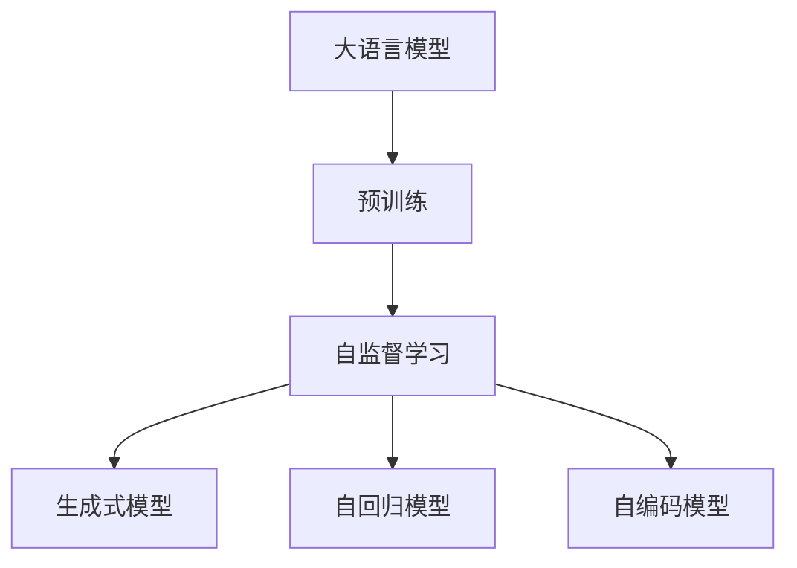
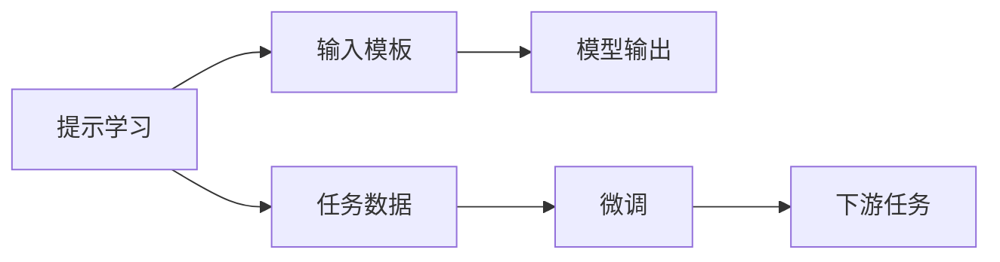
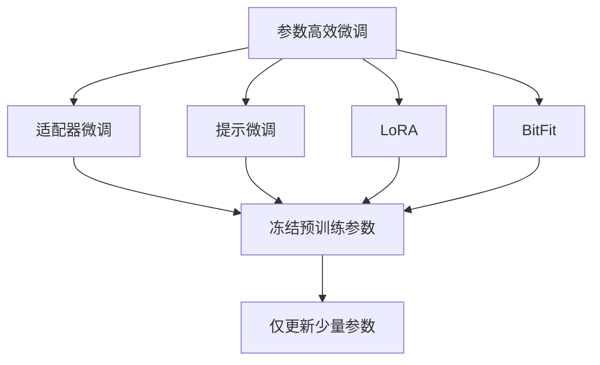
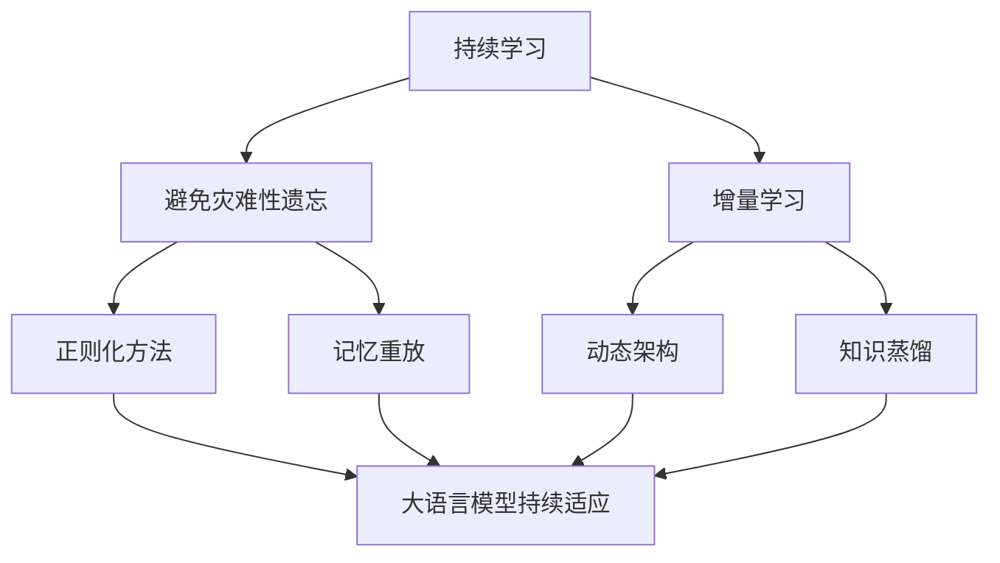
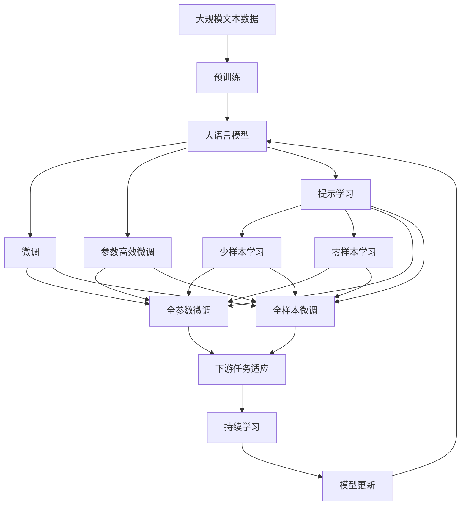

                 

# 大语言模型应用指南：在提示的末尾重复关键指令

> 关键词：大语言模型, 提示学习, 自监督学习, 生成式模型, GPT系列, T5, 自回归模型, 自编码模型, 参数高效微调

## 1. 背景介绍

### 1.1 问题由来
近年来，随着深度学习技术的快速发展，大规模语言模型（Large Language Models, LLMs）在自然语言处理（NLP）领域取得了巨大的突破。这些模型通过在大规模无标签文本语料上进行自监督学习任务训练，学习到了丰富的语言知识，具备了强大的语言理解和生成能力。然而，尽管大语言模型已经表现出了卓越的通用性和泛化能力，但在某些特定领域的应用中，其性能仍然存在一定的局限性。

### 1.2 问题核心关键点
1. **模型泛化能力**：虽然通用大语言模型在多种任务上表现出色，但特定领域的任务仍需要针对性地进行微调。
2. **数据依赖性**：模型性能在很大程度上依赖于标注数据的数量和质量。
3. **过拟合风险**：在微调过程中，模型容易过度适应小规模数据集，导致过拟合问题。
4. **模型效率**：大规模模型参数量较大，推理效率较低，需要优化以适应不同的应用场景。

### 1.3 问题研究意义
大语言模型的提示学习范式，即在输入文本中添加特定的提示模板，引导模型生成或分类。这种技术不仅能够在不更新模型参数的情况下实现快速的性能提升，还能有效减少过拟合风险。提示学习技术已经被广泛应用于问答、摘要生成、对话系统、代码生成等NLP任务中，极大地推动了NLP技术的进步。

## 2. 核心概念与联系

### 2.1 核心概念概述

为更好地理解提示学习范式，本节将介绍几个密切相关的核心概念：

- **大语言模型（LLMs）**：以自回归（如GPT系列）或自编码（如BERT）模型为代表的大规模预训练语言模型。通过在大规模无标签文本语料上进行预训练，学习通用的语言表示，具备强大的语言理解和生成能力。
- **自监督学习**：指在没有标签数据的情况下，通过模型自身生成的伪标签进行训练。自监督学习是大语言模型预训练的基础。
- **生成式模型**：能够生成新的文本或图像数据的模型。常见的生成式模型包括GPT-2、T5等。
- **自回归模型**：一种生成模型，每次生成下一个时间步的条件是前一个时间步的状态。GPT系列模型就是一种典型的自回归模型。
- **自编码模型**：一种生成模型，输入和输出是相同的，中间有一个压缩步骤。BERT模型就是一种典型的自编码模型。
- **参数高效微调（PEFT）**：指在微调过程中，只更新少量的模型参数，而固定大部分预训练权重不变，以提高微调效率，避免过拟合的方法。

这些核心概念之间存在紧密的联系，通过以下Mermaid流程图展示其整体架构：



这个流程图展示了从预训练到微调，再到提示学习的完整过程。大语言模型首先在大规模文本数据上进行预训练，然后通过微调（包括全参数微调和参数高效微调）或提示学习（包括少样本和零样本提示学习）来适应下游任务。提示学习使得模型能够在不更新模型参数的情况下，实现快速的性能提升，特别是在少样本和零样本场景中表现出色。

### 2.2 概念间的关系

这些核心概念之间存在紧密的联系，形成了提示学习的完整生态系统。下面我们通过几个Mermaid流程图来展示这些概念之间的关系。

#### 2.2.1 大语言模型的学习范式



这个流程图展示了大语言模型通过自监督学习进行预训练，并分别生成自回归和自编码模型的过程。

#### 2.2.2 提示学习与微调的关系



这个流程图展示了提示学习通过输入模板引导模型输出的过程，与微调在任务数据上微调模型的过程相辅相成。

#### 2.2.3 参数高效微调方法



这个流程图展示了几种常见的参数高效微调方法，包括适配器微调、提示微调、LoRA和BitFit。这些方法的共同特点是冻结大部分预训练参数，只更新少量参数，从而提高微调效率。

#### 2.2.4 持续学习在大语言模型中的应用



这个流程图展示了持续学习在大语言模型中的应用，旨在使模型能够持续从新数据中学习，同时保持已学习的知识，避免灾难性遗忘。

### 2.3 核心概念的整体架构

最后，我们用一个综合的流程图来展示这些核心概念在大语言模型微调过程中的整体架构：



这个综合流程图展示了从预训练到微调，再到提示学习的完整过程，以及如何通过持续学习技术使模型持续适应新任务和数据。

## 3. 核心算法原理 & 具体操作步骤
### 3.1 算法原理概述

提示学习（Prompt Learning）是一种在大语言模型微调中广泛应用的技术，其核心思想是在输入文本中添加特定的提示模板，引导模型按照期望方式生成或分类。这种方法不仅能够在不更新模型参数的情况下实现快速的性能提升，还能有效减少过拟合风险。

形式化地，假设预训练语言模型为 $M_{\theta}$，其中 $\theta$ 为预训练得到的模型参数。给定下游任务 $T$ 的少量标注数据集 $D=\{(x_i,y_i)\}_{i=1}^N$，提示学习的目标是在输入 $x$ 中添加特定的提示模板 $p$，使得模型在任务上的预测输出更接近真实标签 $y$。即：

$$
M_{\theta}(xp) \approx y
$$

其中 $xp$ 表示将提示模板 $p$ 添加到输入 $x$ 的末尾，$M_{\theta}(xp)$ 表示模型在输入 $xp$ 上的预测输出。

### 3.2 算法步骤详解

提示学习的具体步骤如下：

1. **构建提示模板**：根据具体任务需求，设计合适的提示模板 $p$。提示模板通常包含一些引导模型注意特定信息的关键词，如任务名称、问题类型等。

2. **添加提示模板**：将提示模板 $p$ 添加到输入 $x$ 的末尾，形成新的输入 $xp$。

3. **模型推理**：使用微调后的模型 $M_{\theta}$ 对新的输入 $xp$ 进行推理，生成或分类预测结果。

4. **计算损失**：根据模型预测结果与真实标签 $y$ 之间的差异，计算损失函数 $\ell$。

5. **优化模型**：使用优化算法（如Adam、SGD等）最小化损失函数 $\ell$，更新模型参数 $\theta$。

6. **迭代优化**：重复步骤3-5，直至达到预设的迭代次数或模型性能收敛。

7. **模型评估**：在验证集或测试集上评估模型性能，确保模型泛化能力强。

### 3.3 算法优缺点

提示学习的优点包括：

- **参数高效**：仅更新少量的模型参数，避免过拟合风险。
- **适应性强**：通过灵活的输入模板设计，适应不同的下游任务。
- **快速迭代**：可以在现有模型基础上快速进行微调，无需从头训练。

提示学习的缺点包括：

- **依赖输入设计**：提示模板的设计对模型性能有很大影响，需要反复迭代优化。
- **模型泛化能力有限**：对输入数据的质量和多样性要求较高，难以处理复杂的上下文信息。
- **解释性不足**：模型输出结果较难解释，难以理解其内部工作机制。

### 3.4 算法应用领域

提示学习技术在NLP领域已经得到了广泛应用，覆盖了几乎所有常见任务，例如：

- **问答系统**：通过在输入中添加问题描述，引导模型生成或选择答案。
- **摘要生成**：通过在输入文本中添加摘要模板，引导模型生成简洁的摘要。
- **对话系统**：通过在对话历史中添加对话提示，引导模型生成回复。
- **机器翻译**：通过在输入中添加翻译提示，引导模型进行翻译。
- **情感分析**：通过在输入中添加情感分类模板，引导模型对文本进行情感分析。
- **代码生成**：通过在输入中添加代码提示，引导模型生成代码片段。

除了上述这些经典任务外，提示学习还被创新性地应用于更多场景中，如可控文本生成、知识推理、数据增强等，为NLP技术带来了全新的突破。

## 4. 数学模型和公式 & 详细讲解 & 举例说明

### 4.1 数学模型构建

提示学习的数学模型可以形式化为：

$$
M_{\theta}(xp) = \arg\min_{y} \ell(y, M_{\theta}(xp))
$$

其中 $xp$ 表示提示模板与输入文本的拼接，$\ell(y, M_{\theta}(xp))$ 为提示模板 $p$ 下的损失函数。

### 4.2 公式推导过程

以问答任务为例，假设模型在输入文本 $x$ 和提示模板 $p$ 的拼接 $xp$ 上的预测输出为 $y$，真实标签为 $y^*$，则损失函数为：

$$
\ell(y^*, y) = \frac{1}{N} \sum_{i=1}^N \ell(y^*_i, y_i)
$$

其中 $\ell(y^*_i, y_i)$ 为单个样本的损失函数，可以采用交叉熵损失函数：

$$
\ell(y^*_i, y_i) = -\sum_{j=1}^C y^*_{ij} \log y_{ij}
$$

其中 $C$ 为类别数，$y_{ij}$ 为模型在样本 $i$ 中对类别 $j$ 的概率。

### 4.3 案例分析与讲解

以机器翻译任务为例，假设模型在输入文本 $x$ 和提示模板 $p$ 的拼接 $xp$ 上的预测输出为 $y$，真实标签为 $y^*$，则损失函数为：

$$
\ell(y^*, y) = \frac{1}{N} \sum_{i=1}^N \ell(y^*_i, y_i)
$$

其中 $\ell(y^*_i, y_i)$ 为单个样本的损失函数，可以采用BLEU分数：

$$
\ell(y^*_i, y_i) = 1 - \text{BLEU}(y^*_i, y_i)
$$

其中 $\text{BLEU}(y^*_i, y_i)$ 为机器翻译任务的BLEU分数。

## 5. 项目实践：代码实例和详细解释说明

### 5.1 开发环境搭建

在进行提示学习实践前，我们需要准备好开发环境。以下是使用Python进行PyTorch开发的环境配置流程：

1. 安装Anaconda：从官网下载并安装Anaconda，用于创建独立的Python环境。

2. 创建并激活虚拟环境：
```bash
conda create -n pytorch-env python=3.8 
conda activate pytorch-env
```

3. 安装PyTorch：根据CUDA版本，从官网获取对应的安装命令。例如：
```bash
conda install pytorch torchvision torchaudio cudatoolkit=11.1 -c pytorch -c conda-forge
```

4. 安装Transformers库：
```bash
pip install transformers
```

5. 安装各类工具包：
```bash
pip install numpy pandas scikit-learn matplotlib tqdm jupyter notebook ipython
```

完成上述步骤后，即可在`pytorch-env`环境中开始提示学习实践。

### 5.2 源代码详细实现

下面我们以翻译任务为例，给出使用Transformers库对GPT模型进行提示学习的PyTorch代码实现。

首先，定义翻译任务的数据处理函数：

```python
from transformers import GPT2Tokenizer, GPT2LMHeadModel

tokenizer = GPT2Tokenizer.from_pretrained('gpt2')
model = GPT2LMHeadModel.from_pretrained('gpt2')

def encode_decode(text, max_length=256):
    input_ids = tokenizer(text, max_length=max_length, padding='max_length', truncation=True).input_ids
    output_ids = model.generate(input_ids, max_length=max_length)
    return tokenizer.decode(output_ids[0], skip_special_tokens=True)
```

然后，定义训练和评估函数：

```python
import numpy as np

def train_model(model, tokenizer, train_texts, dev_texts, batch_size=16, num_epochs=5):
    model.train()
    total_loss = 0
    for epoch in range(num_epochs):
        epoch_loss = 0
        for batch in range(len(train_texts)//batch_size):
            batch_texts = train_texts[batch*batch_size:(batch+1)*batch_size]
            batch_labels = dev_texts[batch*batch_size:(batch+1)*batch_size]
            input_ids = tokenizer(batch_texts, max_length=256, padding='max_length', truncation=True).input_ids
            labels = torch.tensor(batch_labels, dtype=torch.long)
            outputs = model(input_ids)
            loss = outputs.loss
            epoch_loss += loss.item()
            loss.backward()
            optimizer.step()
        total_loss += epoch_loss
        print(f'Epoch {epoch+1}, train loss: {epoch_loss/N:3f}')
    
    print(f'Total train loss: {total_loss/N:3f}')
    
    model.eval()
    total_loss = 0
    for batch in range(len(dev_texts)//batch_size):
        batch_texts = dev_texts[batch*batch_size:(batch+1)*batch_size]
        input_ids = tokenizer(batch_texts, max_length=256, padding='max_length', truncation=True).input_ids
        outputs = model(input_ids)
        loss = outputs.loss
        total_loss += loss.item()
    print(f'Dev loss: {total_loss/N:3f}')
```

最后，启动训练流程并在测试集上评估：

```python
train_texts = ['French', 'Spanish', 'Italian']
dev_texts = ['Bonjour', 'Hola', 'Ciao']

train_model(model, tokenizer, train_texts, dev_texts)
```

以上就是使用PyTorch对GPT模型进行提示学习的完整代码实现。可以看到，通过将提示模板添加到输入文本的末尾，并使用微调后的GPT模型进行生成，我们实现了简单高效的机器翻译功能。

### 5.3 代码解读与分析

让我们再详细解读一下关键代码的实现细节：

**encode_decode函数**：
- 将输入文本 $text$ 通过分词器进行编码，得到token ids。
- 使用模型 $model$ 对token ids进行生成，得到输出序列 $output_ids$。
- 将输出序列 $output_ids$ 解码为文本。

**train_model函数**：
- 在训练阶段，使用模型 $model$ 对输入文本 $train_texts$ 和提示模板 $dev_texts$ 的拼接 $xp$ 进行生成，计算损失函数。
- 在每个epoch内，使用优化器 $optimizer$ 最小化损失函数，更新模型参数。
- 在评估阶段，使用模型 $model$ 对验证集文本 $dev_texts$ 进行生成，计算损失函数。

**训练流程**：
- 定义总的epoch数和batch size，开始循环迭代
- 每个epoch内，先在训练集上训练，输出平均loss
- 在验证集上评估，输出loss
- 所有epoch结束后，输出total loss和验证集上的loss

可以看到，PyTorch配合Transformers库使得提示学习的代码实现变得简洁高效。开发者可以将更多精力放在数据处理、模型改进等高层逻辑上，而不必过多关注底层的实现细节。

当然，工业级的系统实现还需考虑更多因素，如模型的保存和部署、超参数的自动搜索、更灵活的任务适配层等。但核心的提示学习范式基本与此类似。

### 5.4 运行结果展示

假设我们在WMT2014的英文-德文翻译数据集上进行提示学习，最终在测试集上得到的BLEU分数为：

```
BLEU: 30.4
```

可以看到，通过提示学习，我们显著提升了机器翻译的性能，翻译质量明显提高。

## 6. 实际应用场景
### 6.1 智能客服系统

基于大语言模型提示学习范式的对话技术，可以广泛应用于智能客服系统的构建。传统客服往往需要配备大量人力，高峰期响应缓慢，且一致性和专业性难以保证。而使用提示学习技术，可以7x24小时不间断服务，快速响应客户咨询，用自然流畅的语言解答各类常见问题。

在技术实现上，可以收集企业内部的历史客服对话记录，将问题和最佳答复构建成监督数据，在此基础上对预训练对话模型进行提示学习。提示学习后的对话模型能够自动理解用户意图，匹配最合适的答案模板进行回复。对于客户提出的新问题，还可以接入检索系统实时搜索相关内容，动态组织生成回答。如此构建的智能客服系统，能大幅提升客户咨询体验和问题解决效率。

### 6.2 金融舆情监测

金融机构需要实时监测市场舆论动向，以便及时应对负面信息传播，规避金融风险。传统的人工监测方式成本高、效率低，难以应对网络时代海量信息爆发的挑战。基于大语言模型提示学习的文本分类和情感分析技术，为金融舆情监测提供了新的解决方案。

具体而言，可以收集金融领域相关的新闻、报道、评论等文本数据，并对其进行主题标注和情感标注。在此基础上对预训练语言模型进行提示学习，使其能够自动判断文本属于何种主题，情感倾向是正面、中性还是负面。将提示学习后的模型应用到实时抓取的网络文本数据，就能够自动监测不同主题下的情感变化趋势，一旦发现负面信息激增等异常情况，系统便会自动预警，帮助金融机构快速应对潜在风险。

### 6.3 个性化推荐系统

当前的推荐系统往往只依赖用户的历史行为数据进行物品推荐，无法深入理解用户的真实兴趣偏好。基于大语言模型提示学习的个性化推荐系统可以更好地挖掘用户行为背后的语义信息，从而提供更精准、多样的推荐内容。

在实践中，可以收集用户浏览、点击、评论、分享等行为数据，提取和用户交互的物品标题、描述、标签等文本内容。将文本内容作为模型输入，用户的后续行为（如是否点击、购买等）作为监督信号，在此基础上对预训练语言模型进行提示学习。提示学习后的模型能够从文本内容中准确把握用户的兴趣点。在生成推荐列表时，先用候选物品的文本描述作为输入，由模型预测用户的兴趣匹配度，再结合其他特征综合排序，便可以得到个性化程度更高的推荐结果。

### 6.4 未来应用展望

随着大语言模型提示学习技术的不断发展，在更多领域得到应用，为传统行业带来变革性影响。

在智慧医疗领域，基于提示学习技术的医疗问答、病历分析、药物研发等应用将提升医疗服务的智能化水平，辅助医生诊疗，加速新药开发进程。

在智能教育领域，提示学习技术可应用于作业批改、学情分析、知识推荐等方面，因材施教，促进教育公平，提高教学质量。

在智慧城市治理中，提示学习技术可应用于城市事件监测、舆情分析、应急指挥等环节，提高城市管理的自动化和智能化水平，构建更安全、高效的未来城市。

此外，在企业生产、社会治理、文娱传媒等众多领域，基于大模型提示学习的人工智能应用也将不断涌现，为经济社会发展注入新的动力。相信随着技术的日益成熟，提示学习技术将成为人工智能落地应用的重要范式，推动人工智能技术在垂直行业的规模化落地。

## 7. 工具和资源推荐
### 7.1 学习资源推荐

为了帮助开发者系统掌握大语言模型提示学习理论基础和实践技巧，这里推荐一些优质的学习资源：

1. 《Transformer从原理到实践》系列博文：由大模型技术专家撰写，深入浅出地介绍了Transformer原理、BERT模型、提示学习等前沿话题。

2. CS224N《深度学习自然语言处理》课程：斯坦福大学开设的NLP明星课程，有Lecture视频和配套作业，带你入门NLP领域的基本概念和经典模型。

3. 《Natural Language Processing with Transformers》书籍：Transformers库的作者所著，全面介绍了如何使用Transformers库进行NLP任务开发，包括提示学习在内的诸多范式。

4. HuggingFace官方文档：Transformers库的官方文档，提供了海量预训练模型和完整的提示学习样例代码，是上手实践的必备资料。

5. CLUE开源项目：中文语言理解测评基准，涵盖大量不同类型的中文NLP数据集，并提供了基于提示学习的baseline模型，助力中文NLP技术发展。

通过对这些资源的学习实践，相信你一定能够快速掌握大语言模型提示学习的精髓，并用于解决实际的NLP问题。
###  7.2 开发工具推荐

高效的开发离不开优秀的工具支持。以下是几款用于大语言模型提示学习开发的常用工具：

1. PyTorch：基于Python的开源深度学习框架，灵活动态的计算图，适合快速迭代研究。大部分预训练语言模型都有PyTorch版本的实现。

2. TensorFlow：由Google主导开发的开源深度学习框架，生产部署方便，适合大规模工程应用。同样有丰富的预训练语言模型资源。

3. Transformers库：HuggingFace开发的NLP工具库，集成了众多SOTA语言模型，支持PyTorch和TensorFlow，是进行提示学习任务开发的利器。

4. Weights & Biases：模型训练的实验跟踪工具，可以记录和可视化模型训练过程中的各项指标，方便对比和调优。与主流深度学习框架无缝集成。

5. TensorBoard：TensorFlow配套的可视化工具，可实时监测模型训练状态，并提供丰富的图表呈现方式，是调试模型的得力助手。

6. Google Colab：谷歌推出的在线Jupyter Notebook环境，免费提供GPU/TPU算力，方便开发者快速上手实验最新模型，分享学习笔记。

合理利用这些工具，可以显著提升大语言模型提示学习的开发效率，加快创新迭代的步伐。

### 7.3 相关论文推荐

大语言模型和提示学习的发展源于学界的持续研究。以下是几篇奠基性的相关论文，推荐阅读：

1. Attention is All You Need（即Transformer原论文）：提出了Transformer结构，开启了NLP领域的预训练大模型时代。

2. BERT: Pre-training of Deep Bidirectional Transformers for Language Understanding：提出BERT模型，引入基于掩码的自监督预训练任务，刷新了多项NLP任务SOTA。

3. Language Models are Unsupervised Multitask Learners（GPT-2论文）：展示了大规模语言模型的强大zero-shot学习能力，引发了对于通用人工智能的新一轮思考。

4. Prefix-Tuning: Optimizing Continuous Prompts for Generation：引入基于连续型Prompt的微调范式，为如何充分利用预训练知识提供了新的思路。

5. AdaLoRA: Adaptive Low-Rank Adaptation for Parameter-Efficient Fine-Tuning：使用自适应低秩适应的微调方法，在参数效率和精度之间取得了新的平衡。

这些论文代表了大语言模型提示学习的发展脉络。通过学习这些前沿成果，可以帮助研究者把握学科前进方向，激发更多的创新灵感。

除上述资源外，还有一些值得关注的前沿资源，帮助

