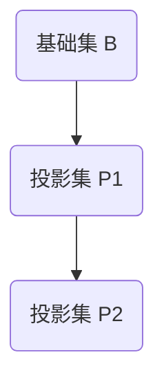

# 集合论导引：投影集层次

## 1. 背景介绍

### 1.1 问题的由来

集合论是数学的一个基础分支,它研究集合的概念、性质和运算。集合论在数学、逻辑学、计算机科学等领域有着广泛的应用。然而,传统的集合论主要关注集合的内涵,而忽视了集合之间的关系和层次结构。

投影集(Projection Set)是集合论的一个新兴分支,它引入了一种新的集合观念,将集合视为一种投影,并研究集合之间的层次关系。这种新的观点为集合论带来了新的视角和发展方向。

### 1.2 研究现状

投影集理论最早由著名数学家约翰·冯·诺伊曼(John von Neumann)在20世纪30年代提出。他将集合视为一种投影,并研究了集合之间的层次关系。后来,这一理论被进一步发展和完善。

近年来,投影集理论在计算机科学、人工智能、量子计算等领域得到了广泛的应用。它为解决一些复杂问题提供了新的思路和方法。

### 1.3 研究意义

投影集理论为集合论带来了新的视角和发展方向,它将集合视为一种投影,并研究集合之间的层次关系。这种新的观点有助于我们更好地理解和处理复杂系统中的层次结构和嵌套关系。

此外,投影集理论在计算机科学、人工智能、量子计算等领域有着广泛的应用前景,为解决一些复杂问题提供了新的思路和方法。

### 1.4 本文结构

本文将从投影集的基本概念出发,逐步介绍投影集层次的理论基础、数学模型、算法原理和实际应用。文章结构如下:

1. 背景介绍
2. 核心概念与联系
3. 核心算法原理与具体操作步骤
4. 数学模型和公式详细讲解与举例说明
5. 项目实践:代码实例和详细解释说明
6. 实际应用场景
7. 工具和资源推荐
8. 总结:未来发展趋势与挑战
9. 附录:常见问题与解答

## 2. 核心概念与联系

投影集(Projection Set)是集合论的一个新兴分支,它将集合视为一种投影,并研究集合之间的层次关系。投影集理论的核心概念包括:

1. **投影集(Projection Set)**: 投影集是一种新的集合观念,它将集合视为一种投影。每个投影集都对应一个基础集,基础集中的元素通过某种投影规则映射到投影集中。

2. **投影规则(Projection Rule)**: 投影规则定义了基础集中的元素如何映射到投影集中。不同的投影规则会产生不同的投影集。

3. **层次关系(Hierarchical Relation)**: 投影集之间存在着层次关系。一个投影集可以基于另一个投影集进行构建,形成层级结构。

4. **嵌套关系(Nested Relation)**: 投影集之间还可能存在嵌套关系。一个投影集可以包含另一个投影集作为子集。

这些核心概念相互关联,共同构成了投影集理论的理论基础。通过研究投影集的层次关系和嵌套关系,我们可以更好地理解和处理复杂系统中的层次结构和嵌套关系。

## 3. 核心算法原理与具体操作步骤

### 3.1 算法原理概述

投影集层次算法的核心原理是基于投影规则和层次关系,构建投影集之间的层级结构。算法的主要步骤如下:

1. 确定基础集和初始投影集
2. 定义投影规则
3. 根据投影规则构建新的投影集
4. 确定投影集之间的层次关系
5. 构建投影集层次结构

### 3.2 算法步骤详解

1. **确定基础集和初始投影集**

   基础集是算法的输入,它是一个包含元素的集合。初始投影集是基于基础集构建的第一个投影集,通常与基础集相同。

2. **定义投影规则**

   投影规则定义了基础集中的元素如何映射到投影集中。投影规则可以是简单的映射关系,也可以是复杂的函数或算法。

3. **根据投影规则构建新的投影集**

   根据定义的投影规则,从初始投影集出发,构建新的投影集。新的投影集中的元素是基础集元素通过投影规则映射得到的。

4. **确定投影集之间的层次关系**

   确定新构建的投影集与已有投影集之间的层次关系。如果新的投影集是基于已有投影集构建的,那么它就位于已有投影集的上一层。

5. **构建投影集层次结构**

   根据确定的层次关系,构建投影集之间的层级结构。层级结构可以用树形结构或其他适当的数据结构表示。

该算法可以递归执行,不断构建新的投影集和层次关系,形成复杂的投影集层次结构。

### 3.3 算法优缺点

**优点:**

- 能够有效地表示和处理复杂系统中的层次结构和嵌套关系
- 算法思路清晰,易于理解和实现
- 具有良好的扩展性,可以根据需求定义不同的投影规则

**缺点:**

- 对于大规模的基础集和复杂的投影规则,算法的计算复杂度可能较高
- 需要事先定义好投影规则,对于动态变化的系统可能不太适用
- 算法的正确性和完备性需要进一步的理论分析和验证

### 3.4 算法应用领域

投影集层次算法可以应用于以下领域:

- **计算机科学:** 用于表示和处理软件系统中的模块化结构、继承关系等层次结构
- **人工智能:** 用于构建知识表示和推理系统中的概念层次结构
- **数据库系统:** 用于表示和管理数据库中的层次化数据结构
- **量子计算:** 用于表示和处理量子态的层次结构
- **系统建模:** 用于建模和分析复杂系统中的层次结构和嵌套关系

## 4. 数学模型和公式详细讲解与举例说明

### 4.1 数学模型构建

为了更好地理解和研究投影集层次,我们需要构建相应的数学模型。投影集层次的数学模型可以用一个四元组表示:

$$\langle B, P, R, H \rangle$$

其中:

- $B$ 表示基础集,是一个包含元素的集合
- $P$ 表示投影集的集合,每个投影集都是基于基础集 $B$ 构建的
- $R$ 表示投影规则的集合,定义了基础集元素如何映射到投影集中
- $H$ 表示投影集之间的层次关系,是一个偏序关系

我们可以用集合论的符号和概念来定义这个四元组中的各个元素。

### 4.2 公式推导过程

下面我们来推导投影集层次模型中的一些重要公式。

首先,定义投影规则 $r \in R$ 为一个函数:

$$r: B \rightarrow P_i$$

其中 $P_i \in P$ 表示某个投影集。

根据投影规则 $r$,我们可以构建一个新的投影集 $P_j$:

$$P_j = \{r(x) | x \in B\}$$

也就是说,投影集 $P_j$ 中的元素是基础集 $B$ 中元素通过投影规则 $r$ 映射得到的。

接下来,我们定义投影集之间的层次关系 $H$。对于任意两个投影集 $P_i$ 和 $P_j$,如果存在投影规则 $r$ 使得 $P_j = \{r(x) | x \in P_i\}$,那么我们说 $P_j$ 位于 $P_i$ 的上一层,记作 $P_i \prec P_j$。

层次关系 $H$ 是一个偏序关系,满足以下性质:

1. 反身性: $\forall P_i \in P, P_i \prec P_i$
2. 反对称性: $\forall P_i, P_j \in P, 如果 P_i \prec P_j 且 P_j \prec P_i,则 P_i = P_j$
3. 传递性: $\forall P_i, P_j, P_k \in P, 如果 P_i \prec P_j 且 P_j \prec P_k,则 P_i \prec P_k$

通过这些公式和性质,我们可以精确地描述和研究投影集层次结构。

### 4.3 案例分析与讲解

为了更好地理解投影集层次的概念和数学模型,我们来看一个具体的案例。

假设我们有一个基础集 $B = \{1, 2, 3, 4, 5, 6\}$,并定义两个投影规则:

1. $r_1: x \mapsto x \bmod 3$
2. $r_2: x \mapsto \lfloor x/3 \rfloor$

根据投影规则 $r_1$,我们可以构建一个新的投影集:

$$P_1 = \{r_1(x) | x \in B\} = \{0, 1, 2\}$$

根据投影规则 $r_2$,我们可以构建另一个投影集:

$$P_2 = \{r_2(x) | x \in B\} = \{0, 1\}$$

现在,我们来确定 $P_1$ 和 $P_2$ 之间的层次关系。由于存在投影规则 $r_3: x \mapsto x \bmod 2$,使得 $P_2 = \{r_3(x) | x \in P_1\}$,因此我们可以得出 $P_1 \prec P_2$。

因此,投影集层次结构为:



在这个案例中,我们可以清楚地看到投影集层次的构建过程,以及投影集之间的层次关系。通过这种方式,我们可以表示和处理复杂系统中的层次结构和嵌套关系。

### 4.4 常见问题解答

1. **投影规则是如何定义的?**

   投影规则可以是简单的映射关系,也可以是复杂的函数或算法。投影规则的定义取决于具体的应用场景和需求。在实践中,我们需要根据问题的特点来设计合适的投影规则。

2. **如何确定投影集之间的层次关系?**

   投影集之间的层次关系是根据投影规则来确定的。如果存在投影规则 $r$,使得投影集 $P_j$ 可以由投影集 $P_i$ 通过 $r$ 构建,那么 $P_j$ 就位于 $P_i$ 的上一层。

3. **投影集层次结构是否唯一?**

   对于给定的基础集和投影规则集合,投影集层次结构可能不是唯一的。不同的投影规则组合会导致不同的层次结构。因此,在实际应用中,我们需要根据具体需求来选择合适的投影规则和层次结构。

4. **投影集层次算法的时间复杂度和空间复杂度如何?**

   投影集层次算法的时间复杂度和空间复杂度取决于基础集的大小、投影规则的复杂度以及构建的层次结构的深度和宽度。在最坏情况下,时间复杂度可能是指数级的。因此,对于大规模的基础集和复杂的投影规则,我们需要设计更加高效的算法和优化策略。

## 5. 项目实践:代码实例和详细解释说明

### 5.1 开发环境搭建

在实现投影集层次算法之前,我们需要先搭建开发环境。本例中,我们将使用 Python 作为编程语言,并使用 Jupyter Notebook 作为开发环境。

1. 安装 Python 和 Jupyter Notebook

   如果您还没有安装 Python 和 Jupyter Notebook,可以按照以下步骤进行安装:

   - 访问 [Python 官网](https://www.python.org/downloads/) 下载最新版本的 Python
   - 按照提示完成安装过程
   - 在终端或命令提示符中运行以下命令安装 Jupyter Notebook:

     ```
     pip install notebook
     ```

2. 创建新的 Jupyter Notebook

   安装完成后,在终端或