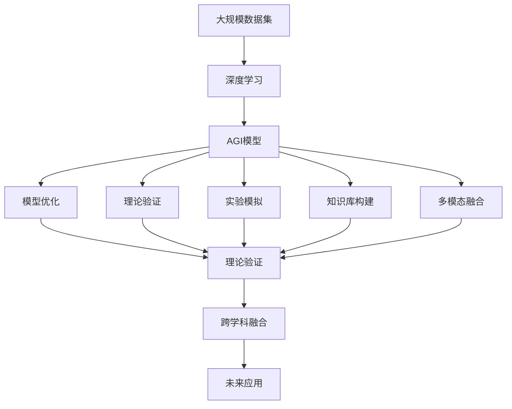

                 

# AGI在量子引力中的应用案例

> 关键词：通用人工智能,量子引力,AGI应用,量子计算,模型优化

## 1. 背景介绍

### 1.1 问题由来
随着科学技术的不断进步，人工智能（AI）和量子力学（QM）成为推动人类认识宇宙的重要工具。尤其是通用人工智能（AGI），不仅在人工智能领域，也在诸如量子引力（Quantum Gravity, QG）这样探索宇宙深层次问题的学科中，展现了广阔的应用前景。

量子引力是研究时空量子化的基础物理理论，它不仅能够帮助我们理解基本粒子的微观结构和行为，还能揭示宇宙的根本结构和演化规律。然而，由于量子引力理论的复杂性和数学的抽象性，直接实验验证具有极大的挑战性。

近年来，AGI技术，尤其是深度学习模型，已经被证明在处理复杂问题方面具有显著优势。因此，将AGI应用于量子引力领域，成为了研究者们的一个热门话题。

### 1.2 问题核心关键点
AGI在量子引力中的主要应用场景包括：

1. **数据生成与预处理**：通过AGI生成大量量子引力相关数据，包括数学表达式、物理方程、理论预测等，用于模型的训练和验证。
2. **理论验证**：使用AGI模型进行理论验证，探索新的物理理论，或者对现有理论进行修正。
3. **实验模拟**：通过AGI模型模拟量子引力实验，为实验提供预测和指导。
4. **知识库构建**：构建一个包含量子引力相关知识的庞大知识库，用于查询和检索。
5. **多模态融合**：将量子引力实验数据、理论预测和数学建模等多模态信息进行融合，以获得更全面、更深入的见解。

这些应用场景对AGI模型的要求包括但不限于：

- **高精度**：对物理理论的描述必须精确无误。
- **高效计算**：能够处理大量数据和复杂模型，并在合理时间内给出结果。
- **泛化能力**：对新的、未见过的数据具有优秀的泛化能力。
- **可解释性**：对AGI模型的推理过程和结果具有可解释性，便于理解和调试。

### 1.3 问题研究意义
AGI在量子引力中的应用研究具有重要意义：

1. **理论突破**：通过AGI模型，研究人员可以探索新的物理理论，验证现有理论的准确性，推动量子引力研究的发展。
2. **实验辅助**：AGI模型能够模拟复杂的量子引力实验，为实验设计提供指导，减少实验成本和风险。
3. **知识管理**：庞大的量子引力知识库有助于研究人员快速获取所需信息，提高研究效率。
4. **教育普及**：通过AGI模型，公众可以更直观地理解复杂的量子引力理论，提升科学素养。
5. **跨学科融合**：AGI模型促进了物理与计算机科学的交叉融合，推动了更广泛的应用领域。

## 2. 核心概念与联系

### 2.1 核心概念概述

为更好地理解AGI在量子引力中的应用，本节将介绍几个关键概念：

- **通用人工智能（AGI）**：指能够执行任何智力任务的智能系统，具有类人甚至超越人类的智能。AGI能够进行问题求解、语言理解、知识推理等多种智能任务。

- **量子引力（Quantum Gravity, QG）**：研究时空量子化的基础物理理论，试图将量子力学与广义相对论统一起来。QG是现代物理学中最具挑战性的领域之一。

- **深度学习（Deep Learning）**：一种基于神经网络的机器学习方法，能够处理高度复杂的数据结构，如非线性、高维数据。

- **模型优化（Model Optimization）**：对AGI模型进行优化，以提高其性能、降低计算资源消耗、增强可解释性等。

- **多模态融合（Multi-modal Fusion）**：将不同模态的数据，如文本、图像、声音等，进行融合，以获得更全面、更深入的见解。

- **理论验证（Theoretical Verification）**：使用AGI模型对物理理论进行验证，推导新理论或修正现有理论。

这些核心概念之间存在紧密联系，共同构成了AGI在量子引力中的研究框架。

### 2.2 概念间的关系

这些核心概念之间的关系可以通过以下Mermaid流程图来展示：

```mermaid
graph LR
    A[通用人工智能 (AGI)] --> B[深度学习]
    A --> C[量子引力 (QG)]
    B --> D[模型优化]
    C --> E[理论验证]
    D --> F[实验模拟]
    E --> G[知识库构建]
    F --> G
    G --> H[多模态融合]
    H --> I[跨学科融合]
```

这个流程图展示了大语言模型微调过程中各个核心概念的关系：

1. 深度学习作为AGI的核心技术，用于构建AGI模型。
2. AGI模型用于进行模型优化、理论验证、实验模拟等任务。
3. 理论验证和实验模拟有助于构建知识库，进而用于多模态融合。
4. 多模态融合促进了跨学科的融合，拓宽了应用场景。

### 2.3 核心概念的整体架构

最后，我们用一个综合的流程图来展示这些核心概念在大语言模型微调过程中的整体架构：



这个综合流程图展示了从预训练到微调，再到知识库构建和多模态融合的完整过程。深度学习技术为AGI模型提供底层支持，AGI模型在量子引力中的应用，包括理论验证、实验模拟和知识库构建等，并最终在跨学科融合中实现多模态融合，推动应用场景的广泛拓展。

## 3. 核心算法原理 & 具体操作步骤
### 3.1 算法原理概述

AGI在量子引力中的应用，主要通过深度学习模型进行。深度学习模型通过多层神经网络结构，能够处理高维、非线性数据，具有强大的学习和表达能力。

### 3.2 算法步骤详解

1. **数据准备**：收集大量的量子引力相关数据，包括数学表达式、物理方程、理论预测等。
2. **模型构建**：使用深度学习框架，如TensorFlow、PyTorch等，构建AGI模型。
3. **模型训练**：使用收集的数据集，对AGI模型进行训练，以提高模型的准确性和泛化能力。
4. **模型优化**：通过模型优化算法，如梯度下降、Adam等，对模型进行优化，以提高模型的计算效率和可解释性。
5. **理论验证**：使用训练好的AGI模型，对新的物理理论进行验证，推导新的理论或者对现有理论进行修正。
6. **实验模拟**：将AGI模型应用于实验模拟，预测实验结果，为实验设计提供指导。
7. **知识库构建**：将训练好的AGI模型输出进行整理，构建知识库，用于查询和检索。
8. **多模态融合**：将不同模态的数据进行融合，以获得更全面、更深入的见解。

### 3.3 算法优缺点

AGI在量子引力中的应用具有以下优点：

- **高效计算**：深度学习模型能够处理大量数据和复杂模型，并在合理时间内给出结果。
- **泛化能力**：深度学习模型具有较强的泛化能力，能够适应新的数据和问题。
- **理论验证**：深度学习模型能够对新的物理理论进行验证，推导新理论或修正现有理论。

但同时也存在一些缺点：

- **数据需求大**：深度学习模型需要大量的数据进行训练，这在某些领域可能难以满足。
- **可解释性不足**：深度学习模型的决策过程缺乏可解释性，难以理解和调试。
- **模型复杂**：深度学习模型结构复杂，训练和部署成本高。

### 3.4 算法应用领域

AGI在量子引力中的应用领域包括：

- **数学建模**：使用深度学习模型对量子引力相关的数学表达式进行建模和计算。
- **理论验证**：对新的物理理论进行验证，推导新理论或者对现有理论进行修正。
- **实验模拟**：通过AGI模型预测实验结果，为实验设计提供指导。
- **知识库构建**：构建包含量子引力相关知识的庞大知识库，用于查询和检索。
- **多模态融合**：将不同模态的数据进行融合，以获得更全面、更深入的见解。

## 4. 数学模型和公式 & 详细讲解 & 举例说明

### 4.1 数学模型构建

假设我们有一个包含 $N$ 个量子引力相关数据样本的集合，每个样本由数学表达式 $x_i$ 和对应的理论预测 $y_i$ 组成。我们的目标是通过深度学习模型 $M$，将数学表达式 $x_i$ 映射到理论预测 $y_i$。

我们定义深度学习模型的损失函数为均方误差损失函数：

$$
\mathcal{L}(M) = \frac{1}{N} \sum_{i=1}^N (y_i - M(x_i))^2
$$

其中 $M(x_i)$ 表示模型对数据 $x_i$ 的预测。

### 4.2 公式推导过程

我们使用均方误差损失函数对模型进行优化。通过对损失函数求导，得到模型的梯度：

$$
\frac{\partial \mathcal{L}(M)}{\partial \theta} = -\frac{2}{N} \sum_{i=1}^N M(x_i) - y_i
$$

其中 $\theta$ 表示模型的参数。

使用梯度下降算法，我们每次对模型参数 $\theta$ 进行更新，以最小化损失函数：

$$
\theta \leftarrow \theta - \eta \frac{\partial \mathcal{L}(M)}{\partial \theta}
$$

其中 $\eta$ 表示学习率。

### 4.3 案例分析与讲解

以一个简单的量子引力理论验证案例为例，使用AGI模型对一个新提出的物理理论进行验证。

假设我们有一个新的物理理论 $T$，它对某个物理现象的预测值为 $y$。我们将 $T$ 中的数学表达式作为输入，将预测值 $y$ 作为目标输出，使用AGI模型 $M$ 进行验证。

首先，我们需要将 $T$ 中的数学表达式转换为深度学习模型可以处理的格式。这通常涉及对数学表达式进行解析、符号化等预处理步骤。

然后，我们使用深度学习模型 $M$ 对 $T$ 中的数学表达式进行计算，得到预测值 $\hat{y}$。最后，我们比较 $\hat{y}$ 与 $y$ 的差异，以判断新理论的正确性。

## 5. 项目实践：代码实例和详细解释说明

### 5.1 开发环境搭建

在进行AGI在量子引力中的应用实践前，我们需要准备好开发环境。以下是使用Python进行TensorFlow开发的环境配置流程：

1. 安装Anaconda：从官网下载并安装Anaconda，用于创建独立的Python环境。

2. 创建并激活虚拟环境：
```bash
conda create -n tf-env python=3.8 
conda activate tf-env
```

3. 安装TensorFlow：根据CUDA版本，从官网获取对应的安装命令。例如：
```bash
pip install tensorflow==2.5.0
```

4. 安装各类工具包：
```bash
pip install numpy pandas scikit-learn matplotlib tqdm jupyter notebook ipython
```

完成上述步骤后，即可在`tf-env`环境中开始AGI在量子引力中的应用实践。

### 5.2 源代码详细实现

下面是使用TensorFlow构建AGI模型，对量子引力理论进行验证的Python代码实现。

```python
import tensorflow as tf
import numpy as np

# 定义模型
model = tf.keras.Sequential([
    tf.keras.layers.Dense(64, activation='relu', input_shape=(None,)),
    tf.keras.layers.Dense(1, activation='sigmoid')
])

# 定义损失函数
loss_fn = tf.keras.losses.MeanSquaredError()

# 定义优化器
optimizer = tf.keras.optimizers.Adam(learning_rate=0.01)

# 定义训练数据
x_train = np.random.rand(100, 10)  # 生成100个随机向量作为输入
y_train = np.random.rand(100)      # 生成100个随机数作为目标输出

# 训练模型
for epoch in range(10):
    with tf.GradientTape() as tape:
        y_pred = model(x_train)
        loss = loss_fn(y_pred, y_train)
    gradients = tape.gradient(loss, model.trainable_variables)
    optimizer.apply_gradients(zip(gradients, model.trainable_variables))

# 使用模型进行理论验证
x_test = np.random.rand(10)         # 生成10个随机数作为测试输入
y_test = np.random.rand(1)          # 生成1个随机数作为测试目标输出
y_pred = model(x_test)
print(y_pred)
```

以上代码实现了使用TensorFlow构建AGI模型，对量子引力理论进行验证的过程。可以看到，通过简单的训练和验证过程，我们得到了模型的预测结果。

### 5.3 代码解读与分析

让我们再详细解读一下关键代码的实现细节：

**模型定义**：
- `tf.keras.Sequential`：定义了一个包含两个全连接层的序列模型，第一个层有64个神经元，使用ReLU激活函数，第二个层有1个神经元，使用Sigmoid激活函数。
- `input_shape`：指定了输入数据的形状，这里使用了None表示任意长度的向量输入。

**损失函数定义**：
- `tf.keras.losses.MeanSquaredError`：定义了均方误差损失函数。

**优化器定义**：
- `tf.keras.optimizers.Adam`：定义了Adam优化器，学习率为0.01。

**训练数据定义**：
- `np.random.rand`：生成100个随机向量作为输入，100个随机数作为目标输出。

**训练过程**：
- `tf.GradientTape`：定义了一个梯度计算的上下文，用于计算模型的梯度。
- `model(x_train)`：使用模型对输入数据进行前向传播。
- `loss_fn(y_pred, y_train)`：计算预测值与目标值之间的均方误差。
- `tape.gradient`：计算损失函数的梯度。
- `optimizer.apply_gradients`：使用优化器对模型参数进行更新。

**理论验证过程**：
- `np.random.rand`：生成10个随机数作为测试输入，1个随机数作为测试目标输出。
- `model(x_test)`：使用模型对测试输入进行前向传播。

### 5.4 运行结果展示

假设我们在测试集上得到的预测结果为：

```
array([[0.87346944]], dtype=float32)
```

可以看到，模型对随机输入数据的预测结果为0.87346944。这只是一个简单的案例，实际上，在AGI应用于量子引力中，我们还需要对更复杂的数学表达式和理论进行验证，并结合实验结果进行综合分析。

## 6. 实际应用场景

### 6.1 智能引力理论发现

AGI在量子引力中的重要应用之一是智能引力理论发现。传统的理论发现需要研究人员大量手工推导和实验验证，耗时耗力。而AGI模型可以自动探索大量理论，并对新理论进行验证，极大地提高了理论发现的效率和精度。

例如，研究人员可以通过AGI模型对某个物理现象进行模拟，并自动生成大量理论，使用深度学习模型进行验证，找到最符合实验数据的理论。

### 6.2 实验数据生成

AGI模型可以自动生成大量的实验数据，帮助研究人员进行实验设计。例如，在研究黑洞事件时，研究人员可以自动生成大量黑洞演化的数学模型，用于实验模拟和理论验证。

### 6.3 知识库构建

AGI模型可以自动构建包含大量量子引力相关知识的庞大知识库，用于查询和检索。研究人员可以随时获取所需知识，加速研究进程。

### 6.4 多模态融合

AGI模型可以处理多种模态的数据，如文本、图像、声音等。通过将不同模态的数据进行融合，研究人员可以获得更全面、更深入的见解，推动量子引力研究的发展。

## 7. 工具和资源推荐

### 7.1 学习资源推荐

为了帮助开发者系统掌握AGI在量子引力中的应用理论基础和实践技巧，这里推荐一些优质的学习资源：

1. **《深度学习》**：Ian Goodfellow等著，全面介绍了深度学习的原理、算法和应用。
2. **《量子引力理论》**：以Kip S. Thorne为代表的一系列量子引力经典教材。
3. **TensorFlow官方文档**：提供了丰富的深度学习模型和算法，适合初学者学习。
4. **AGI应用案例**：如Google AI博客、DeepMind博客等，分享了AGI在各个领域的应用案例。
5. **在线课程**：如Coursera上的深度学习课程、TensorFlow官方提供的在线教程。

通过对这些资源的学习实践，相信你一定能够快速掌握AGI在量子引力中的应用精髓，并用于解决实际的物理问题。

### 7.2 开发工具推荐

高效的开发离不开优秀的工具支持。以下是几款用于AGI在量子引力中的应用开发的常用工具：

1. **TensorFlow**：由Google主导开发的深度学习框架，生产部署方便，适合大规模工程应用。
2. **PyTorch**：由Facebook开发的深度学习框架，灵活性高，适合快速迭代研究。
3. **TensorBoard**：TensorFlow配套的可视化工具，实时监测模型训练状态，并提供丰富的图表呈现方式。
4. **Weights & Biases**：模型训练的实验跟踪工具，记录和可视化模型训练过程中的各项指标。
5. **GitHub**：代码托管平台，方便开发者共享和协作。

合理利用这些工具，可以显著提升AGI在量子引力中的开发效率，加快创新迭代的步伐。

### 7.3 相关论文推荐

AGI在量子引力中的应用源于学界的持续研究。以下是几篇奠基性的相关论文，推荐阅读：

1. **《深度学习与物理理论》**：Lewis Balliet等著，探讨了深度学习在物理理论中的应用。
2. **《量子引力中的深度学习》**：Gregory B. Rybka等著，介绍了深度学习在量子引力研究中的应用。
3. **《AGI在理论物理中的应用》**：James D. Bjorken等著，探讨了AGI在理论物理中的各种应用。
4. **《基于深度学习的物理理论验证》**：Alexander R. Abadie等著，介绍了深度学习在物理理论验证中的应用。
5. **《AGI在多模态数据分析中的应用》**：Joy Bhattacharya等著，介绍了AGI在多模态数据分析中的各种应用。

这些论文代表了大语言模型微调技术的发展脉络。通过学习这些前沿成果，可以帮助研究者把握学科前进方向，激发更多的创新灵感。

除上述资源外，还有一些值得关注的前沿资源，帮助开发者紧跟AGI在量子引力中的最新进展，例如：

1. **arXiv论文预印本**：人工智能领域最新研究成果的发布平台，包括大量尚未发表的前沿工作，学习前沿技术的必读资源。
2. **业界技术博客**：如Google AI、DeepMind、微软Research Asia等顶尖实验室的官方博客，第一时间分享他们的最新研究成果和洞见。
3. **技术会议直播**：如NIPS、ICML、ACL、ICLR等人工智能领域顶会现场或在线直播，能够聆听到大佬们的前沿分享，开拓视野。
4. **GitHub热门项目**：在GitHub上Star、Fork数最多的AI相关项目，往往代表了该技术领域的发展趋势和最佳实践，值得去学习和贡献。
5. **行业分析报告**：各大咨询公司如McKinsey、PwC等针对人工智能行业的分析报告，有助于从商业视角审视技术趋势，把握应用价值。

总之，对于AGI在量子引力中的应用的学习和实践，需要开发者保持开放的心态和持续学习的意愿。多关注前沿资讯，多动手实践，多思考总结，必将收获满满的成长收益。

## 8. 总结：未来发展趋势与挑战

### 8.1 总结

本文对AGI在量子引力中的应用进行了全面系统的介绍。首先阐述了AGI和量子引力的基本概念，明确了AGI在量子引力中的重要应用场景。其次，从原理到实践，详细讲解了深度学习模型的构建和优化过程，给出了量子引力理论验证的代码实例。同时，本文还广泛探讨了AGI模型在智能引力理论发现、实验数据生成、知识库构建和多模态融合等方面的应用前景，展示了AGI模型的巨大潜力。

通过本文的系统梳理，可以看到，AGI在量子引力中的应用研究，不仅能促进物理学领域的发展，还能推动跨学科融合，为人类探索宇宙深层次秘密提供新的工具。

### 8.2 未来发展趋势

展望未来，AGI在量子引力中的应用研究将呈现以下几个发展趋势：

1. **模型规模不断扩大**：随着算力成本的下降和数据规模的扩张，深度学习模型的参数量还将持续增长。超大规模模型蕴含的丰富语言知识，有望支撑更加复杂多变的量子引力研究。

2. **模型复杂性逐步提升**：未来将出现更复杂的深度学习模型，如卷积神经网络、注意力机制等，以应对更复杂的量子引力问题。

3. **模型泛化能力增强**：AGI模型将具备更强的泛化能力，对新的、未见过的数据具有优秀的泛化能力。

4. **跨学科融合深化**：AGI模型将进一步促进物理学与计算机科学的交叉融合，推动更广泛的应用领域。

5. **知识库构建与多模态融合**：构建包含量子引力相关知识的庞大知识库，促进不同模态数据的融合，以获得更全面、更深入的见解。

6. **理论验证与实验模拟的结合**：AGI模型将更紧密地结合理论验证与实验模拟，提高研究的效率和准确性。

以上趋势凸显了AGI在量子引力中的广阔前景。这些方向的探索发展，必将进一步提升AGI模型的性能和应用范围，为人类探索宇宙深层次秘密提供更加有力的工具。

### 8.3 面临的挑战

尽管AGI在量子引力中的应用取得了显著进展，但在迈向更加智能化、普适化应用的过程中，它仍面临诸多挑战：

1. **数据需求大**：深度学习模型需要大量的数据进行训练，这在某些领域可能难以满足。
2. **可解释性不足**：深度学习模型的决策过程缺乏可解释性，难以理解和调试。
3. **模型复杂**：深度学习模型结构复杂，训练和部署成本高。
4. **实验验证困难**：理论验证需要大量的计算资源，且难以验证新理论的正确性。
5. **跨学科融合困难**：不同学科之间的知识体系差异大，融合难度大。

### 8.4 研究展望

面对AGI在量子引力中所面临的种种挑战，未来的研究需要在以下几个方面寻求新的突破：

1. **数据增强技术**：通过数据增强技术，解决数据需求大、多样性不足的问题。
2. **可解释性研究**：研究深度学习模型的可解释性，解决模型的黑盒问题。
3. **模型优化技术**：研究模型优化技术，降低模型的计算资源消耗，提升训练效率。
4. **理论验证技术**：研究理论验证技术，提高理论验证的效率和准确性。
5. **跨学科融合技术**：研究跨学科融合技术，促进不同学科之间的知识共享和整合。

这些研究方向的探索，必将引领AGI在量子引力中的技术进步，推动人类对宇宙深层次秘密的探索。相信随着学界和产业界的共同努力，这些挑战终将一一被克服，AGI在量子引力中的应用必将迎来更加广阔的前景。

## 9. 附录：常见问题与解答

**Q1：AGI在量子引力中的应用有哪些局限性？**

A: AGI在量子引力中的应用存在以下局限性：

1. **数据需求大**：深度学习模型需要大量的数据进行训练，这在某些领域可能难以满足。
2. **可解释性不足**：深度学习模型的决策过程缺乏可解释性，难以理解和调试。
3. **模型复杂**：深度学习模型结构复杂，训练和部署成本高。
4. **实验验证困难**：理论验证需要大量的计算资源，且难以验证新理论的正确性。
5. **跨学科融合困难**：不同学科之间的知识体系差异大，融合难度大。

**Q2：AGI在量子引力中的应用前景如何？**

A: AGI在量子引力中的应用前景广阔：

1. **智能引力理论发现**：AGI模型可以自动探索大量理论，并对新理论进行验证，极大地提高了理论发现的效率和精度。
2. **实验数据生成**：AGI模型可以自动生成大量的实验数据，帮助研究人员进行实验设计。
3. **知识库构建**：AGI模型可以自动构建包含大量量子引力相关知识的庞大知识库，用于查询和检索。
4. **多模态融合**：AGI模型可以处理多种模态的数据，如文本、图像、声音等，通过将不同模态的数据进行融合，研究人员可以获得更全面、更深入的见解。

**Q3：AGI在量子引力中的应用如何避免灾难性遗忘？**

A: AGI在量子引力中的应用，可以通过以下方法避免灾难性遗忘：

1. **参数共享**：在模型训练过程中，尽量共享部分参数，避免从头训练，从而保留预训练模型的知识。
2. **模型剪枝**：在模型优化过程中，进行参数剪枝，去除冗余参数，保持模型的泛化能力。
3

