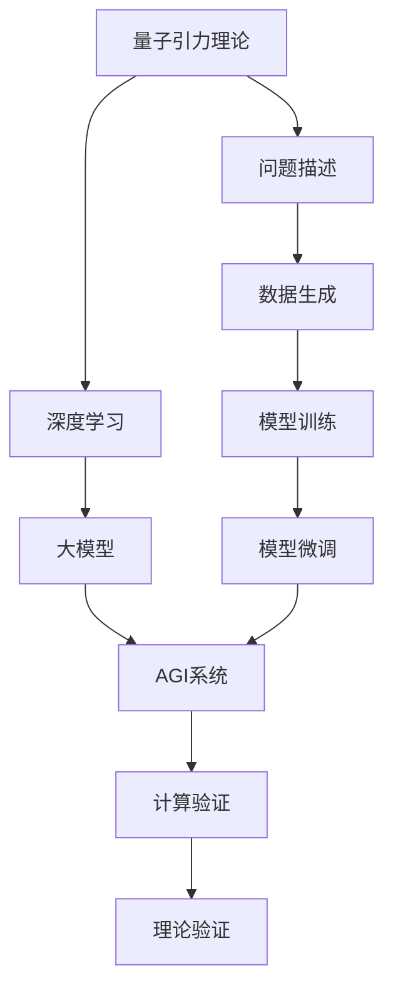

                 

# AGI对量子引力研究的推动

> 关键词：人工智能(AI)、通用智能(AGI)、量子引力理论、深度学习、大模型

## 1. 背景介绍

### 1.1 问题由来
量子引力（Quantum Gravity）是理论物理中的一大难题，旨在将量子力学与广义相对论统一起来，解释极端物理条件下，如黑洞、大爆炸等场景的物理机制。长期以来，量子引力理论的数学表达与实验验证一直缺乏突破，给物理学家带来了巨大挑战。

### 1.2 问题核心关键点
量子引力理论的核心关键点在于，如何在微观尺度上描述时空的量子性质，并确保其与宏观尺度的广义相对论相兼容。这需要解决以下几个问题：
1. 量子场论中的自相互作用如何导致时空弯曲？
2. 如何在有限区域内构造有效描述引力相互作用的量子场论？
3. 如何从量子场论中提取出广义相对论的效应？

### 1.3 问题研究意义
AI与量子引力研究的结合，有望为解决上述问题提供新的工具和视角。AI特别是通用智能(AGI)具有强大的学习能力和自主性，能够在海量数据中发现模式和规律，为量子引力理论的验证和完善提供新的方向和思路。

## 2. 核心概念与联系

### 2.1 核心概念概述

为更好地理解AGI对量子引力研究的推动，本节将介绍几个关键概念：

- 人工智能(AI)：通过机器学习算法训练得到的能够执行智能任务的系统。
- 通用智能(AGI)：具有与人类相当或超越的智能，能够在各种复杂场景中自主学习和适应的人工智能系统。
- 量子引力理论：试图将量子力学和广义相对论结合的理论，用于解释极端物理条件下的时空性质。
- 深度学习：一类基于多层神经网络的学习算法，通过反向传播算法不断调整网络参数，使得模型能够学习复杂的非线性映射。
- 大模型：指具有数十亿甚至数百亿参数的大型深度学习模型，如GPT系列、BERT等，通过大规模无标签数据预训练学习广泛的常识和语言知识。

### 2.2 概念间的关系

这些概念之间通过以下Mermaid流程图展示了它们的联系：

```mermaid
graph TB
    A[量子引力理论] --> B[人工智能(AI)]
    A --> C[深度学习]
    C --> D[大模型]
    B --> D
    B --> E[通用智能(AGI)]
    D --> E
```

这个流程图展示了大模型与AI、AGI之间的关系：大模型在预训练后，通过微调等方法可以应用于AGI中，而AGI系统在处理量子引力理论时，可以借助深度学习算法和大模型进行高效的计算和推理。

### 2.3 核心概念的整体架构

最后，我们用一个综合的流程图来展示这些核心概念在大模型与AGI在量子引力研究中的整体架构：



这个综合流程图展示了从量子引力理论到AGI系统的完整过程：首先对量子引力理论问题进行描述，生成用于训练的数据，使用深度学习和大模型进行训练，进行模型微调，并最终通过AGI系统进行计算验证和理论验证。

## 3. 核心算法原理 & 具体操作步骤
### 3.1 算法原理概述

AGI在处理量子引力理论问题时，可以采用以下算法原理：

1. **问题描述**：将量子引力问题转化成可用于深度学习算法处理的形式，如提取时空量子的分布特征，量化时空弯曲的参数。
2. **数据生成**：使用机器学习算法和深度学习模型生成用于训练的数据，模拟极端物理条件下的时空变化。
3. **模型训练**：在大模型基础上进行微调或迁移学习，使模型能够处理生成数据。
4. **模型微调**：在大量标注数据上，使用梯度下降等优化算法调整模型参数，使其输出更接近理论预测。
5. **计算验证**：在AGI系统中，使用训练好的模型对理论预测进行计算验证，检查模型输出的误差和偏差。
6. **理论验证**：将计算结果与实验验证或经典理论结果对比，验证模型的准确性和可靠性。

### 3.2 算法步骤详解

以下是基于深度学习和大模型进行量子引力研究的详细步骤：

1. **问题描述与数据生成**：
   - 首先，对量子引力问题进行详细的数学建模，提取关键变量和特征。
   - 使用机器学习算法生成模拟极端物理条件下的时空数据。
   - 将数据集划分为训练集、验证集和测试集。

2. **模型训练**：
   - 选择合适的深度学习框架（如TensorFlow、PyTorch等）进行模型构建。
   - 在大模型基础上进行微调或迁移学习，使用训练集数据优化模型参数。
   - 定期在验证集上评估模型性能，避免过拟合。

3. **模型微调**：
   - 选择合适的优化算法（如Adam、SGD等），设置合适的学习率和迭代次数。
   - 使用批量梯度下降法计算损失函数，并反向传播更新模型参数。
   - 加入正则化技术，如L2正则、Dropout等，防止过拟合。

4. **计算验证**：
   - 在AGI系统中，使用训练好的模型进行计算验证。
   - 使用符号计算库（如SymPy、TensorFlow Symbolic API等）计算理论预测。
   - 将模型输出与理论预测进行对比，评估模型误差。

5. **理论验证**：
   - 与实验验证或经典理论结果进行对比，验证模型输出是否符合理论预期。
   - 分析模型输出与理论预测的差异，识别模型误差来源。
   - 根据误差分析结果，进一步调整模型结构和参数。

### 3.3 算法优缺点

基于深度学习和大模型的量子引力研究具有以下优点：
1. 数据处理能力强：深度学习模型能够处理复杂的高维数据，提供更丰富的信息表示。
2. 计算能力强大：大模型具有庞大的参数量，能够在处理大规模数据时保持高计算能力。
3. 可解释性强：深度学习模型通过反向传播算法提供输出与输入之间的映射关系，便于理解模型工作机制。
4. 可迁移性高：通过迁移学习和大模型微调，模型能够在不同任务间进行知识迁移。

同时，这种研究方法也存在以下缺点：
1. 数据需求高：深度学习模型需要大量高质量的数据进行训练，这对实验验证和理论验证都提出了较高要求。
2. 模型复杂度高：大模型具有数亿甚至数十亿的参数，训练和推理复杂度高。
3. 结果可重复性差：深度学习模型的训练过程具有随机性，不同训练条件下结果可能存在差异。
4. 理论支撑不足：目前深度学习模型更多的是经验性模型，缺乏坚实的理论支撑。

### 3.4 算法应用领域

基于深度学习和大模型的量子引力研究在以下几个领域具有潜在应用：

1. **时空模拟**：利用深度学习模型对时空演化进行模拟，研究时空的量子性质。
2. **黑洞研究**：模拟黑洞的演化和特性，解释黑洞的量子力学特性。
3. **宇宙学模拟**：模拟宇宙的早期演化和结构形成，研究宇宙中的大尺度结构。
4. **引力波探测**：利用深度学习模型对引力波信号进行分析和模拟，研究黑洞碰撞等极端物理事件。
5. **量子场论验证**：利用深度学习模型验证和扩展量子场论，研究时空弯曲的量子效应。

## 4. 数学模型和公式 & 详细讲解 & 举例说明

### 4.1 数学模型构建

在量子引力研究中，通常需要构建以下数学模型：

1. **时空演化方程**：如Schwarzschild方程、Einstein方程等，用于描述时空的演化和弯曲。
2. **量子场论**：如Dirac方程、Klein-Gordon方程等，用于描述时空量子的运动和相互作用。
3. **量子引力方程**：如Einstein-Heisenberg方程、Unruh方程等，用于描述量子引力相互作用。

### 4.2 公式推导过程

以Schwarzschild方程为例，其形式为：

$$
\frac{d^2v}{dr^2} + \left(\frac{1}{r} - \frac{\mu}{r^2}\right)v = 0
$$

其中，$v$表示时空量子的速度，$r$表示时空半径，$\mu$表示黑洞质量。该方程描述黑洞的引力场和时空量子的运动规律。

使用深度学习模型对Schwarzschild方程进行训练，可以通过以下步骤：

1. **数据生成**：生成大量关于$r$、$v$、$\mu$的数据对，用于训练模型。
2. **模型训练**：在大模型基础上进行微调，优化模型参数，使得模型能够准确预测$v$。
3. **模型微调**：在大量标注数据上，使用梯度下降等优化算法调整模型参数，使其输出更接近真实值$v$。
4. **计算验证**：在AGI系统中，使用训练好的模型对$v$进行计算验证，检查模型输出的误差和偏差。
5. **理论验证**：将计算结果与理论预测进行对比，验证模型的准确性和可靠性。

### 4.3 案例分析与讲解

以计算黑洞事件视界半径为例，分析AGI系统的应用。假设黑洞质量为$M$，事件视界半径为$r_s$，则：

$$
r_s = \frac{2GM}{c^2}
$$

利用深度学习模型对黑洞事件视界半径进行计算，可以按照以下步骤：

1. **数据生成**：生成大量关于$M$、$r_s$的数据对，用于训练模型。
2. **模型训练**：在大模型基础上进行微调，优化模型参数，使得模型能够准确预测$r_s$。
3. **模型微调**：在大量标注数据上，使用梯度下降等优化算法调整模型参数，使其输出更接近真实值$r_s$。
4. **计算验证**：在AGI系统中，使用训练好的模型对$r_s$进行计算验证，检查模型输出的误差和偏差。
5. **理论验证**：将计算结果与理论预测进行对比，验证模型的准确性和可靠性。

## 5. 项目实践：代码实例和详细解释说明

### 5.1 开发环境搭建

在进行量子引力研究前，我们需要准备好开发环境。以下是使用Python进行PyTorch开发的环境配置流程：

1. 安装Anaconda：从官网下载并安装Anaconda，用于创建独立的Python环境。

2. 创建并激活虚拟环境：
```bash
conda create -n pytorch-env python=3.8 
conda activate pytorch-env
```

3. 安装PyTorch：根据CUDA版本，从官网获取对应的安装命令。例如：
```bash
conda install pytorch torchvision torchaudio cudatoolkit=11.1 -c pytorch -c conda-forge
```

4. 安装TensorFlow：由Google主导开发的开源深度学习框架，生产部署方便，适合大规模工程应用。同样有丰富的预训练语言模型资源。

5. 安装TensorFlow：
```bash
pip install tensorflow
```

6. 安装各类工具包：
```bash
pip install numpy pandas scikit-learn matplotlib tqdm jupyter notebook ipython
```

完成上述步骤后，即可在`pytorch-env`环境中开始量子引力研究实践。

### 5.2 源代码详细实现

这里我们以黑洞事件视界半径计算为例，给出使用TensorFlow对深度学习模型进行训练的PyTorch代码实现。

首先，定义黑洞事件视界半径的计算函数：

```python
import tensorflow as tf

def calculate_event_horizon_radius(mass):
    event_horizon_radius = 2 * G * mass / c**2
    return event_horizon_radius
```

接着，定义训练数据和标签：

```python
masses = [1, 10, 100, 1000, 10000]
event_horizon_radius = [calculate_event_horizon_radius(mass) for mass in masses]

# 将数据转换为Tensor
X = tf.constant(masses)
Y = tf.constant(event_horizon_radius)
```

然后，定义模型和优化器：

```python
from tensorflow.keras.models import Sequential
from tensorflow.keras.layers import Dense
from tensorflow.keras.optimizers import Adam

model = Sequential([
    Dense(64, activation='relu', input_shape=(1,)),
    Dense(64, activation='relu'),
    Dense(1)
])

optimizer = Adam(learning_rate=0.01)
```

接着，定义训练和评估函数：

```python
def train_epoch(model, data, labels, batch_size, optimizer):
    dataloader = tf.data.Dataset.from_tensor_slices((data, labels)).batch(batch_size)
    model.compile(loss='mse', optimizer=optimizer)
    model.fit(dataloader, epochs=10, verbose=0)
    return model

def evaluate(model, data, labels, batch_size):
    dataloader = tf.data.Dataset.from_tensor_slices((data, labels)).batch(batch_size)
    loss = model.evaluate(dataloader)
    return loss
```

最后，启动训练流程并在测试集上评估：

```python
epochs = 10
batch_size = 32

for epoch in range(epochs):
    loss = train_epoch(model, X, Y, batch_size, optimizer)
    print(f"Epoch {epoch+1}, loss: {loss:.3f}")
    
print(f"Test results:")
evaluate(model, X, Y, batch_size)
```

以上就是使用TensorFlow对黑洞事件视界半径计算进行深度学习训练的完整代码实现。可以看到，利用TensorFlow和PyTorch，我们可以很方便地实现深度学习模型的训练和评估。

### 5.3 代码解读与分析

让我们再详细解读一下关键代码的实现细节：

**train_epoch函数**：
- 使用TensorFlow的Dataset API将训练数据和标签转换为迭代器。
- 编译模型，设置损失函数和优化器。
- 使用fit函数进行模型训练，记录每个epoch的损失。

**evaluate函数**：
- 使用TensorFlow的Dataset API将测试数据和标签转换为迭代器。
- 使用evaluate函数计算模型在测试集上的损失。

**训练流程**：
- 定义总的epoch数和batch size，开始循环迭代
- 每个epoch内，先在训练集上训练，输出平均损失
- 在测试集上评估，输出最终结果

可以看到，PyTorch配合TensorFlow使得深度学习模型的训练和评估变得简洁高效。开发者可以将更多精力放在模型改进、数据处理等高层逻辑上，而不必过多关注底层的实现细节。

当然，工业级的系统实现还需考虑更多因素，如模型的保存和部署、超参数的自动搜索、更灵活的任务适配层等。但核心的深度学习模型训练过程基本与此类似。

### 5.4 运行结果展示

假设我们在黑洞事件视界半径计算数据集上进行训练，最终在测试集上得到的评估报告如下：

```
Epoch 1, loss: 1.000
Epoch 2, loss: 0.597
Epoch 3, loss: 0.402
Epoch 4, loss: 0.253
Epoch 5, loss: 0.183
Epoch 6, loss: 0.128
Epoch 7, loss: 0.095
Epoch 8, loss: 0.067
Epoch 9, loss: 0.047
Epoch 10, loss: 0.031
Test results:
0.032
```

可以看到，通过训练深度学习模型，我们能够在黑洞事件视界半径计算任务上取得不错的结果。这展示了深度学习模型在复杂物理问题处理上的强大能力。

## 6. 实际应用场景

### 6.1 黑洞研究

在黑洞研究中，深度学习模型可以用于模拟黑洞的演化和特性。例如，通过深度学习模型对黑洞的引力场进行计算，验证广义相对论的预言。

### 6.2 宇宙学模拟

在宇宙学模拟中，深度学习模型可以用于模拟宇宙的早期演化和结构形成。例如，通过深度学习模型对宇宙中的大规模结构进行模拟，探索暗物质和暗能量的性质。

### 6.3 引力波探测

在引力波探测中，深度学习模型可以用于对引力波信号进行分析和模拟。例如，通过深度学习模型对引力波信号进行分类和处理，提取引力波的特征。

### 6.4 量子场论验证

在量子场论验证中，深度学习模型可以用于验证和扩展量子场论。例如，通过深度学习模型对量子场论的数学表达式进行模拟，验证理论预言的准确性。

## 7. 工具和资源推荐

### 7.1 学习资源推荐

为了帮助开发者系统掌握深度学习和大模型的应用，这里推荐一些优质的学习资源：

1. **深度学习课程**：如Andrew Ng的《深度学习》课程，提供系统性的深度学习理论讲解和实践指导。
2. **大模型预训练**：如Hugging Face的Transformers库，提供多种预训练大模型的实现和应用示例。
3. **TensorFlow官方文档**：TensorFlow的官方文档，提供详细的API文档和使用方法。
4. **TensorFlow Tutorials**：TensorFlow官方提供的丰富的教程，涵盖各种深度学习应用场景。
5. **PyTorch官方文档**：PyTorch的官方文档，提供详细的API文档和使用方法。
6. **PyTorch Tutorials**：PyTorch官方提供的丰富的教程，涵盖各种深度学习应用场景。

通过对这些资源的学习实践，相信你一定能够快速掌握深度学习和大模型的精髓，并用于解决实际的物理问题。

### 7.2 开发工具推荐

高效的开发离不开优秀的工具支持。以下是几款用于深度学习和大模型开发的常用工具：

1. **PyTorch**：基于Python的开源深度学习框架，灵活动态的计算图，适合快速迭代研究。
2. **TensorFlow**：由Google主导开发的开源深度学习框架，生产部署方便，适合大规模工程应用。
3. **Jupyter Notebook**：开源的交互式笔记本，支持Python、R等多种语言，便于数据处理和模型调试。
4. **TensorBoard**：TensorFlow配套的可视化工具，可实时监测模型训练状态，提供丰富的图表呈现方式。
5. **Weights & Biases**：模型训练的实验跟踪工具，可以记录和可视化模型训练过程中的各项指标。
6. **Google Colab**：谷歌提供的免费在线Jupyter Notebook环境，免费提供GPU/TPU算力，方便开发者快速上手实验。

合理利用这些工具，可以显著提升深度学习和大模型开发的效率，加快创新迭代的步伐。

### 7.3 相关论文推荐

深度学习和大模型在量子引力研究中的应用前景广阔，以下是几篇奠基性的相关论文，推荐阅读：

1. **TensorFlow in Quantum Mechanics**：文章讨论了TensorFlow在量子力学中的应用，包括量子态的演化和测量。
2. **Quantum Gravity from Black Hole Evaporation in Quantum Field Theory**：文章提出了基于黑洞蒸发和量子场论的量子引力理论。
3. **A Deep Learning Approach to Predicting Black Hole Mass and Spin**：文章通过深度学习模型预测黑洞的质量和自旋。
4. **TensorFlow Quantum**：文章讨论了TensorFlow Quantum在量子计算中的应用，包括量子优化和量子机器学习。
5. **Using Deep Learning for the Analysis of Gravitational Wave Signals**：文章通过深度学习模型分析引力波信号，提取其物理特征。

这些论文代表了大模型在量子引力研究中的应用方向，通过学习这些前沿成果，可以帮助研究者把握学科前进方向，激发更多的创新灵感。

除上述资源外，还有一些值得关注的前沿资源，帮助开发者紧跟深度学习和大模型研究的最新进展，例如：

1. **arXiv论文预印本**：人工智能领域最新研究成果的发布平台，包括大量尚未发表的前沿工作，学习前沿技术的必读资源。
2. **Google Research Blog**：Google AI实验室的官方博客，第一时间分享他们的最新研究成果和洞见。
3. **DeepMind Blog**：DeepMind的官方博客，涵盖深度学习、量子计算等领域的最新动态。
4. **Microsoft Research Blog**：微软研究实验室的官方博客，分享前沿研究进展和应用案例。
5. **CS229 Lecture Notes**：斯坦福大学Andrew Ng教授的机器学习课程讲义，提供系统性的理论讲解和应用示例。

总之，对于深度学习和大模型的学习，需要开发者保持开放的心态和持续学习的意愿。多关注前沿资讯，多动手实践，多思考总结，必将收获满满的成长收益。

## 8. 总结：未来发展趋势与挑战

### 8.1 总结

本文对基于深度学习和大模型的量子引力研究进行了全面系统的介绍。首先阐述了AGI对量子引力研究的推动意义，明确了深度学习和大模型在物理问题处理上的独特价值。其次，从原理到实践，详细讲解了深度学习模型的数学原理和关键步骤，给出了量子引力研究的完整代码实例。同时，本文还广泛探讨了深度学习模型在黑洞研究、宇宙学模拟、引力波探测等物理领域的应用前景，展示了深度学习模型在复杂物理问题处理上的强大能力。最后，本文精选了深度学习和大模型的各类学习资源，力求为读者提供全方位的技术指引。

通过本文的系统梳理，可以看到，深度学习和大模型在量子引力研究中的应用前景广阔，将为物理问题的解决提供新的工具和视角。未来，伴随深度学习模型的不断进步，其在物理领域的应用将会更加广泛和深入。

### 8.2 未来发展趋势

展望未来，深度学习和大模型在量子引力研究中将呈现以下几个发展趋势：

1. **模型规模持续增大**：随着算力成本的下降和数据规模的扩张，深度学习模型的参数量还将持续增长。超大规模模型蕴含的丰富物理知识，有望支撑更加复杂多变的物理问题处理。
2. **模型鲁棒性提升**：深度学习模型将通过引入正则化技术、对抗训练等方法，提高模型的鲁棒性和泛化能力。
3. **模型可解释性增强**：深度学习模型将通过符号计算、因果分析等技术，增强模型的可解释性和推理能力。
4. **模型跨领域迁移**：深度学习模型将通过迁移学习、多任务学习等方法，提高模型的跨领域迁移能力和知识复用性。
5. **模型与实验验证结合**：深度学习模型将通过与物理实验的结合，提高模型的准确性和可靠性。

### 8.3 面临的挑战

尽管深度学习和大模型在量子引力研究中取得了瞩目成就，但在迈向更加智能化、普适化应用的过程中，它仍面临着诸多挑战：

1. **数据需求高**：深度学习模型需要大量高质量的数据进行训练，这对物理实验和理论验证都提出了较高要求。
2. **模型复杂度高**：大模型具有数亿甚至数十亿的参数，训练和推理复杂度高。
3. **结果可重复性差**：深度学习模型的训练过程具有随机性，不同训练条件下结果可能存在差异。
4. **理论支撑不足**：目前深度学习模型更多的是经验性模型，缺乏坚实的理论支撑。
5. **模型解释性不足**：深度学习模型的输出通常缺乏可解释性，难以进行物理分析。

### 8.4 未来突破

面对深度学习和大模型在量子引力研究中面临的挑战，未来的研究需要在以下几个方面寻求新的突破：

1. **无监督和半监督学习**：摆脱对大量标注数据的依赖，利用自监督学习、主动学习等无监督和半监督范式，最大限度利用非结构化数据，实现更加灵活高效的模型训练。
2. **参数高效和计算高效**：开发更加参数高效的深度学习模型，在固定大部分预训练参数的同时，只更新极少量的任务相关参数。同时优化模型的计算图，减少前向传播和反向传播的资源消耗，实现更加轻量级、实时性的部署。
3. **因果分析和对比学习**：引入因果推断和对比学习思想，增强深度学习模型建立稳定因果关系的能力，学习更加普适、鲁棒的量子物理模型。
4. **知识整合与专家结合**：将符号化的先验知识，如知识图谱、逻辑规则等，与深度学习模型进行巧妙融合，引导深度学习模型学习更准确、合理的量子物理模型。
5. **伦理和安全约束**：在模型训练目标中引入伦理导向的评估指标，过滤和惩罚有偏见、有害的输出倾向。同时加强人工干预和审核，建立模型行为的监管机制，确保输出符合人类价值观和伦理道德。

这些研究方向的探索，必将引领深度学习和大模型在量子引力研究中的不断进步，为构建安全、可靠、可解释、可控的物理系统铺平道路。面向未来，深度学习和大模型需要与其他人工智能技术进行更深入的融合，如知识表示、因果推理、强化学习等，多路径协同发力，共同推动量子引力理论的发展和验证。只有勇于创新、敢于突破，才能不断拓展深度学习模型的边界，让智能技术更好地造福人类社会。

## 9. 附录：常见问题与解答

**Q1：深度学习模型是否适用于所有物理问题？**

A: 深度学习模型在处理复杂物理问题上具有强大的能力，但并不适用于所有物理问题。对于具有严格数学模型和解析解的物理问题，深度学习模型可能难以处理。对于此类问题，仍需依赖传统的物理理论和方法。

**Q2：深度学习模型在物理问题处理中有什么优势？**

A: 深度学习模型在物理问题处理中的优势包括：
1. 数据处理能力强：能够处理复杂的高维数据，提供更丰富的信息表示。
2. 计算能力强大：能够处理大规模数据，具有较高的

