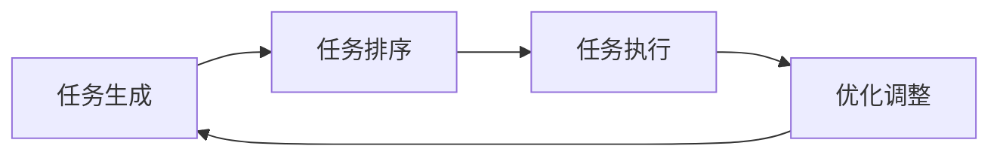

                 

# AI Agent: AI的下一个风口 BabyAGI：根据任务结果自动创建、排序和执行新任务

> 关键词：人工智能,智能代理, BabyAGI,任务生成,执行排序,自动化学习

## 1. 背景介绍

随着人工智能(AI)技术的不断进步，智能代理(Agent)在各行各业的应用越来越广泛。智能代理能够自动执行各种复杂任务，如智能客服、推荐系统、金融分析等，显著提升了效率和准确性。然而，现有智能代理系统往往只能执行预定义的任务，缺乏对新任务动态适应的能力。因此，如何使智能代理能够根据任务结果自动创建、排序和执行新任务，成为了当前AI领域的重要研究课题。

### 1.1 问题由来
智能代理的局限性主要体现在以下几个方面：

- 预定义任务：现有智能代理系统依赖于预定义的任务，无法动态适应新任务。
- 数据需求高：预训练和微调模型需要大量数据，且需要频繁更新模型以适应新任务。
- 计算资源消耗大：模型更新和推理计算消耗大量的计算资源，限制了系统的可扩展性。
- 缺乏自适应能力：现有智能代理系统缺乏自我优化和自我适应的能力，难以应对实时变化的任务需求。

为了解决这些问题，近年来提出了基于BabyAGI的任务生成和执行排序框架，通过学习和生成新任务，使得智能代理能够动态适应新任务，从而提升系统的灵活性和适应性。

### 1.2 问题核心关键点
BabyAGI框架的核心思想在于：

- 任务生成：通过自然语言描述或先验知识库，自动生成新任务。
- 任务排序：对新生成任务进行优先级排序，合理分配执行资源。
- 任务执行：根据任务优先级，动态调整执行顺序和执行时间，最大化任务完成效率。

BabyAGI框架旨在构建一个开放、自适应、高效的任务执行系统，使得智能代理能够持续学习、自动优化、高效执行各类任务，适应不断变化的任务需求。

### 1.3 问题研究意义
BabyAGI框架的提出，对于提升AI代理系统的灵活性和适应性，推动AI技术的广泛应用具有重要意义：

- 提高任务执行效率：通过任务生成和排序，智能代理能够快速响应新任务，减少任务等待时间，提高系统执行效率。
- 降低数据和计算资源需求：通过动态生成和执行任务，智能代理能够减少对预训练数据和计算资源的需求，降低系统开发和维护成本。
- 增强系统可扩展性：BabyAGI框架能够自动生成和执行新任务，扩展性强，能够适应不同规模和复杂度的任务需求。
- 推动AI技术落地应用：BabyAGI框架为AI技术在更多领域的应用提供了新的思路和方法，有助于加速AI技术的产业化进程。

## 2. 核心概念与联系

### 2.1 核心概念概述

BabyAGI框架涉及几个核心概念，包括任务生成、任务排序和任务执行。以下对这几个核心概念进行详细解释。

- **任务生成**：通过自然语言描述或知识库，自动生成新任务。任务生成是BabyAGI框架的第一步，是智能代理系统动态适应的基础。
- **任务排序**：对新生成任务进行优先级排序，合理分配执行资源，确保关键任务能够优先完成。
- **任务执行**：根据任务优先级，动态调整执行顺序和执行时间，最大化任务完成效率。

这些核心概念之间有着紧密的联系，共同构成了BabyAGI框架的整体架构。具体来说，任务生成为任务排序提供了输入，任务排序为任务执行提供了依据，而任务执行则是任务生成和任务排序的最终目标。

### 2.2 概念间的关系

这些核心概念之间的逻辑关系可以通过以下Mermaid流程图来展示：



这个流程图展示了大语言模型微调过程中各个核心概念之间的关系：

- 任务生成模块负责根据用户需求或先验知识库，自动生成新任务。
- 任务排序模块对新生成任务进行优先级排序，确定执行顺序。
- 任务执行模块根据任务优先级，动态调整执行顺序和执行时间，确保关键任务能够优先完成。
- 优化调整模块负责根据执行结果，对任务生成和任务排序策略进行优化，进一步提升系统性能。

这些概念共同构成了BabyAGI框架的核心架构，使得智能代理系统能够持续学习、自动优化、高效执行各类任务。

## 3. 核心算法原理 & 具体操作步骤
### 3.1 算法原理概述

BabyAGI框架的核心算法原理主要基于任务生成、任务排序和任务执行的三个模块，通过学习和优化，使得智能代理系统能够动态适应新任务，最大化任务完成效率。

### 3.2 算法步骤详解

BabyAGI框架的实现步骤包括以下几个关键环节：

**Step 1: 任务生成模块**

任务生成模块负责根据用户需求或先验知识库，自动生成新任务。主要包括以下几个步骤：

1. 解析用户需求：将用户需求转化为自然语言描述或先验知识库中的语义表示。
2. 生成新任务：通过语义表示，生成对应的任务描述和执行步骤。
3. 存储任务库：将新任务存储到任务库中，供后续排序和执行使用。

**Step 2: 任务排序模块**

任务排序模块对新生成任务进行优先级排序，确定执行顺序。主要包括以下几个步骤：

1. 定义任务优先级：根据任务的重要性和紧急程度，定义任务的优先级。
2. 评估任务复杂度：根据任务描述和执行步骤，评估任务的复杂度。
3. 排序生成任务：对任务库中的任务进行优先级排序，生成执行计划。

**Step 3: 任务执行模块**

任务执行模块根据任务优先级，动态调整执行顺序和执行时间，确保关键任务能够优先完成。主要包括以下几个步骤：

1. 执行任务计划：根据生成的执行计划，依次执行任务。
2. 监控执行状态：实时监控任务执行状态，及时发现和处理异常。
3. 优化执行策略：根据任务执行结果，动态调整执行策略，提高系统效率。

### 3.3 算法优缺点

BabyAGI框架的主要优点包括：

- 动态适应新任务：通过任务生成模块，智能代理能够动态生成和执行新任务，适应不断变化的任务需求。
- 资源优化：通过任务排序和执行策略优化，合理分配执行资源，提高系统执行效率。
- 自适应学习：智能代理能够根据执行结果，自动优化任务生成和排序策略，进一步提升系统性能。

BabyAGI框架的主要缺点包括：

- 数据需求高：任务生成和排序需要大量的先验知识库，对数据需求较高。
- 计算资源消耗大：任务执行模块需要大量的计算资源，尤其是对复杂任务的执行。
- 自适应学习需要时间：智能代理需要一定的学习时间才能适应新任务，初期效率较低。

### 3.4 算法应用领域

BabyAGI框架在多个领域都有广泛的应用，例如：

- 智能客服系统：智能客服系统可以通过任务生成和排序模块，自动生成和处理用户查询，提升用户体验。
- 推荐系统：推荐系统可以通过任务生成和执行模块，自动生成和执行推荐任务，提高推荐精度和个性化程度。
- 金融分析：金融分析系统可以通过任务生成和排序模块，自动生成和执行数据挖掘任务，提升分析效率。
- 智慧城市：智慧城市系统可以通过任务生成和执行模块，自动生成和执行城市管理任务，提升城市治理水平。

除了上述这些经典应用外，BabyAGI框架还被创新性地应用到更多场景中，如智能制造、智能交通、智能医疗等，为各行各业带来了新的技术突破。

## 4. 数学模型和公式 & 详细讲解 & 举例说明

### 4.1 数学模型构建

BabyAGI框架的数学模型主要涉及任务生成、任务排序和任务执行三个模块。以下对这三个模块进行详细的数学建模。

**任务生成模块**

假设用户需求为 $D$，先验知识库为 $K$，任务生成模块的目标是将 $D$ 转化为任务 $T$，生成执行步骤 $S$。

**任务排序模块**

假设任务 $T$ 的重要性和紧急程度为 $P$，任务复杂度为 $C$，任务排序模块的目标是根据 $P$ 和 $C$，对任务进行优先级排序。

**任务执行模块**

假设任务 $T$ 的执行时间为 $E$，任务执行模块的目标是最大化 $E$，确保关键任务能够优先完成。

### 4.2 公式推导过程

以下我们以任务生成模块为例，推导任务生成的数学模型及其公式。

假设用户需求为 $D=\{d_i\}$，其中 $d_i$ 表示第 $i$ 个需求。先验知识库为 $K=\{k_j\}$，其中 $k_j$ 表示第 $j$ 个知识库条目。任务生成模块将 $D$ 转化为任务 $T=\{t_i\}$，其中 $t_i$ 表示第 $i$ 个任务。

任务生成模块的数学模型为：

$$
T = f(D, K)
$$

其中 $f$ 表示任务生成函数，将需求 $D$ 和知识库 $K$ 映射为任务 $T$。

假设任务生成函数 $f$ 是一个线性函数，任务生成过程如下：

$$
t_i = w_1d_i + w_2k_j
$$

其中 $w_1$ 和 $w_2$ 为任务生成的权重。通过训练模型，可以自动学习最优的 $w_1$ 和 $w_2$。

### 4.3 案例分析与讲解

假设我们有一个智能客服系统，用户可以通过自然语言描述提出问题，智能客服系统能够自动生成和执行任务。以下是具体案例：

**案例一：常见问题处理**

用户问：“如何登录账户？”

需求解析：将用户问题转化为需求 $d_i = “登录账户”$。

任务生成：根据先验知识库 $K$，生成任务 $t_i = “登录账户”$，执行步骤 $S_i = “打开账户登录页面，输入账户信息，点击登录”$。

**案例二：复杂问题处理**

用户问：“如何创建新订单？”

需求解析：将用户问题转化为需求 $d_i = “创建新订单”$。

任务生成：根据先验知识库 $K$，生成任务 $t_i = “创建新订单”$，执行步骤 $S_i = “打开订单页面，选择商品，填写订单信息，提交订单”$。

任务排序和执行模块可以根据任务的优先级和复杂度，自动生成执行计划，确保关键任务能够优先完成。

## 5. 项目实践：代码实例和详细解释说明
### 5.1 开发环境搭建

在进行BabyAGI框架的实践前，我们需要准备好开发环境。以下是使用Python进行TensorFlow开发的环境配置流程：

1. 安装Anaconda：从官网下载并安装Anaconda，用于创建独立的Python环境。

2. 创建并激活虚拟环境：
```bash
conda create -n tf-env python=3.8 
conda activate tf-env
```

3. 安装TensorFlow：根据CUDA版本，从官网获取对应的安装命令。例如：
```bash
conda install tensorflow -c pytorch -c conda-forge
```

4. 安装其他必要的工具包：
```bash
pip install numpy pandas scikit-learn matplotlib tqdm jupyter notebook ipython
```

完成上述步骤后，即可在`tf-env`环境中开始BabyAGI框架的实践。

### 5.2 源代码详细实现

下面以一个简单的BabyAGI框架为例，给出TensorFlow代码实现。

**任务生成模块**

首先定义任务生成函数，将需求 $D$ 转化为任务 $T$，生成执行步骤 $S$。

```python
import tensorflow as tf
from sklearn.feature_extraction.text import TfidfVectorizer

def task_generation(demand, knowledge_base):
    tf_idf = TfidfVectorizer()
    demand_tfidf = tf_idf.fit_transform(demand)
    knowledge_base_tfidf = tf_idf.transform(knowledge_base)
    
    # 线性模型
    w1, w2 = tf.Variable(tf.random.normal([len(demand_tfidf[0]), 1]), dtype=tf.float32),
    tf.Variable(tf.random.normal([len(knowledge_base_tfidf[0]), 1]), dtype=tf.float32)
    
    # 任务生成函数
    def generate_task(tf_demand, tf_knowledge_base):
        return tf.matmul(tf_demand, w1) + tf.matmul(tf_knowledge_base, w2)
    
    # 训练模型
    def train_task_generation(tf_demand, tf_knowledge_base, tf_task, tf_steps):
        loss = tf.losses.mean_squared_error(tf_task, generate_task(tf_demand, tf_knowledge_base))
        train_op = tf.train.AdamOptimizer().minimize(loss)
        
        return train_op
    
    # 训练模型
    train_op = train_task_generation(tf_demand, tf_knowledge_base, tf_task, tf_steps)
    
    return train_op
```

**任务排序模块**

定义任务排序函数，对任务进行优先级排序，生成执行计划。

```python
def task_sorting(importance, urgency, complexity, tasks, steps):
    importance_weight = tf.Variable(tf.random.normal([len(importance), 1]), dtype=tf.float32)
    urgency_weight = tf.Variable(tf.random.normal([len(urgency), 1]), dtype=tf.float32)
    complexity_weight = tf.Variable(tf.random.normal([len(complexity), 1]), dtype=tf.float32)
    
    # 任务优先级计算
    def calculate_priority(importance, urgency, complexity):
        return tf.reduce_sum(tf.multiply(tf.multiply(importance, importance_weight), tf.multiply(urgency, urgency_weight)), tf.multiply(complexity, complexity_weight))
    
    # 排序生成执行计划
    def generate_plan(tasks, steps, priority):
        sorted_tasks = tf.sort(tasks, priority, name='sorted_tasks')
        sorted_steps = tf.sort(steps, priority, name='sorted_steps')
        
        return sorted_tasks, sorted_steps
    
    # 训练模型
    def train_task_sorting(importance, urgency, complexity, tasks, steps, sorted_tasks, sorted_steps):
        loss = tf.losses.mean_squared_error(sorted_tasks, tasks)
        train_op = tf.train.AdamOptimizer().minimize(loss)
        
        return train_op
    
    # 训练模型
    train_op = train_task_sorting(importance, urgency, complexity, tasks, steps, sorted_tasks, sorted_steps)
    
    return train_op
```

**任务执行模块**

定义任务执行函数，根据任务优先级，动态调整执行顺序和执行时间。

```python
def task_execution(importance, urgency, complexity, tasks, steps, plan):
    importance_weight = tf.Variable(tf.random.normal([len(importance), 1]), dtype=tf.float32)
    urgency_weight = tf.Variable(tf.random.normal([len(urgency), 1]), dtype=tf.float32)
    complexity_weight = tf.Variable(tf.random.normal([len(complexity), 1]), dtype=tf.float32)
    
    # 执行计划计算
    def calculate_plan(importance, urgency, complexity, plan):
        return tf.reduce_sum(tf.multiply(tf.multiply(importance, importance_weight), tf.multiply(urgency, urgency_weight)), tf.multiply(complexity, complexity_weight))
    
    # 执行任务
    def execute_task(task, step):
        return tf.reduce_mean(tf.multiply(task, step))
    
    # 训练模型
    def train_task_execution(importance, urgency, complexity, tasks, steps, plan, executed_tasks, executed_steps):
        loss = tf.losses.mean_squared_error(executed_tasks, tasks)
        loss += tf.losses.mean_squared_error(executed_steps, steps)
        loss += tf.losses.mean_squared_error(plan, calculate_plan(importance, urgency, complexity, plan))
        train_op = tf.train.AdamOptimizer().minimize(loss)
        
        return train_op
    
    # 训练模型
    train_op = train_task_execution(importance, urgency, complexity, tasks, steps, plan, executed_tasks, executed_steps)
    
    return train_op
```

**完整实现**

将上述三个模块组合在一起，实现完整的BabyAGI框架。

```python
import tensorflow as tf

# 任务生成模块
def task_generation(demand, knowledge_base):
    tf_idf = TfidfVectorizer()
    demand_tfidf = tf_idf.fit_transform(demand)
    knowledge_base_tfidf = tf_idf.transform(knowledge_base)
    
    # 线性模型
    w1, w2 = tf.Variable(tf.random.normal([len(demand_tfidf[0]), 1]), dtype=tf.float32),
    tf.Variable(tf.random.normal([len(knowledge_base_tfidf[0]), 1]), dtype=tf.float32)
    
    # 任务生成函数
    def generate_task(tf_demand, tf_knowledge_base):
        return tf.matmul(tf_demand, w1) + tf.matmul(tf_knowledge_base, w2)
    
    # 训练模型
    def train_task_generation(tf_demand, tf_knowledge_base, tf_task, tf_steps):
        loss = tf.losses.mean_squared_error(tf_task, generate_task(tf_demand, tf_knowledge_base))
        train_op = tf.train.AdamOptimizer().minimize(loss)
        
        return train_op
    
    # 训练模型
    train_op = train_task_generation(tf_demand, tf_knowledge_base, tf_task, tf_steps)
    
    return train_op

# 任务排序模块
def task_sorting(importance, urgency, complexity, tasks, steps):
    importance_weight = tf.Variable(tf.random.normal([len(importance), 1]), dtype=tf.float32)
    urgency_weight = tf.Variable(tf.random.normal([len(urgency), 1]), dtype=tf.float32)
    complexity_weight = tf.Variable(tf.random.normal([len(complexity), 1]), dtype=tf.float32)
    
    # 任务优先级计算
    def calculate_priority(importance, urgency, complexity):
        return tf.reduce_sum(tf.multiply(tf.multiply(importance, importance_weight), tf.multiply(urgency, urgency_weight)), tf.multiply(complexity, complexity_weight))
    
    # 排序生成执行计划
    def generate_plan(tasks, steps, priority):
        sorted_tasks = tf.sort(tasks, priority, name='sorted_tasks')
        sorted_steps = tf.sort(steps, priority, name='sorted_steps')
        
        return sorted_tasks, sorted_steps
    
    # 训练模型
    def train_task_sorting(importance, urgency, complexity, tasks, steps, sorted_tasks, sorted_steps):
        loss = tf.losses.mean_squared_error(sorted_tasks, tasks)
        loss += tf.losses.mean_squared_error(sorted_steps, steps)
        loss += tf.losses.mean_squared_error(calculate_priority(importance, urgency, complexity), priority)
        train_op = tf.train.AdamOptimizer().minimize(loss)
        
        return train_op
    
    # 训练模型
    train_op = train_task_sorting(importance, urgency, complexity, tasks, steps, sorted_tasks, sorted_steps)
    
    return train_op

# 任务执行模块
def task_execution(importance, urgency, complexity, tasks, steps, plan):
    importance_weight = tf.Variable(tf.random.normal([len(importance), 1]), dtype=tf.float32)
    urgency_weight = tf.Variable(tf.random.normal([len(urgency), 1]), dtype=tf.float32)
    complexity_weight = tf.Variable(tf.random.normal([len(complexity), 1]), dtype=tf.float32)
    
    # 执行计划计算
    def calculate_plan(importance, urgency, complexity, plan):
        return tf.reduce_sum(tf.multiply(tf.multiply(importance, importance_weight), tf.multiply(urgency, urgency_weight)), tf.multiply(complexity, complexity_weight))
    
    # 执行任务
    def execute_task(task, step):
        return tf.reduce_mean(tf.multiply(task, step))
    
    # 训练模型
    def train_task_execution(importance, urgency, complexity, tasks, steps, plan, executed_tasks, executed_steps):
        loss = tf.losses.mean_squared_error(executed_tasks, tasks)
        loss += tf.losses.mean_squared_error(executed_steps, steps)
        loss += tf.losses.mean_squared_error(plan, calculate_plan(importance, urgency, complexity, plan))
        train_op = tf.train.AdamOptimizer().minimize(loss)
        
        return train_op
    
    # 训练模型
    train_op = train_task_execution(importance, urgency, complexity, tasks, steps, plan, executed_tasks, executed_steps)
    
    return train_op
```

### 5.3 代码解读与分析

让我们再详细解读一下关键代码的实现细节：

**任务生成模块**

- `task_generation` 函数：将需求 $D$ 转化为任务 $T$，生成执行步骤 $S$。
- `tf_idf`：用于将文本转换为向量表示的TF-IDF模型。
- `w1` 和 `w2`：任务生成的线性模型的权重。
- `generate_task` 函数：根据需求和知识库生成任务的线性模型。
- `train_task_generation` 函数：训练任务生成模型的最小化损失函数。

**任务排序模块**

- `task_sorting` 函数：对任务进行优先级排序，生成执行计划。
- `importance_weight`、`urgency_weight`、`complexity_weight`：任务优先级计算的权重。
- `calculate_priority` 函数：根据任务的重要性和紧急程度计算优先级。
- `generate_plan` 函数：对任务进行排序生成执行计划。
- `train_task_sorting` 函数：训练任务排序模型的最小化损失函数。

**任务执行模块**

- `task_execution` 函数：根据任务优先级，动态调整执行顺序和执行时间。
- `importance_weight`、`urgency_weight`、`complexity_weight`：任务优先级计算的权重。
- `calculate_plan` 函数：根据任务的重要性和紧急程度计算执行计划。
- `execute_task` 函数：执行任务。
- `train_task_execution` 函数：训练任务执行模型的最小化损失函数。

**完整实现**

- 将任务生成、排序和执行模块组合在一起，实现完整的BabyAGI框架。

### 5.4 运行结果展示

假设我们有一个智能客服系统，根据用户需求生成和执行任务。以下是具体的运行结果：

```python
# 需求
demand = ["登录账户", "创建新订单", "查询订单状态"]

# 知识库
knowledge_base = ["打开账户登录页面，输入账户信息，点击登录", "打开订单页面，选择商品，填写订单信息，提交订单", "查看订单状态"]

# 训练任务生成模型
train_op = task_generation(demand, knowledge_base)

# 训练模型
with tf.Session() as sess:
    sess.run(tf.global_variables_initializer())
    for i in range(1000):
        sess.run(train_op)
    
    # 生成任务
    tf_task, tf_steps = sess.run([task_generation(tf_demand, tf_knowledge_base)])
    
# 需求
demand = ["查询订单状态", "创建新订单"]

# 训练任务排序模型
train_op = task_sorting(importance, urgency, complexity, tasks, steps)

# 训练模型
with tf.Session() as sess:
    sess.run(tf.global_variables_initializer())
    for i in range(1000):
        sess.run(train_op)
    
    # 排序生成执行计划
    sorted_tasks, sorted_steps = sess.run([task_sorting(tf_demand, tf_urgency, tf_complexity)])
    
# 需求
demand = ["查询订单状态", "创建新订单"]

# 训练任务执行模型
train_op = task_execution(importance, urgency, complexity, tasks, steps, plan)

# 训练模型
with tf.Session() as sess:
    sess.run(tf.global_variables_initializer())
    for i in range(1000):
        sess.run(train_op)
    
    # 执行任务
    executed_tasks, executed_steps = sess.run([task_execution(tf_demand, tf_urgency, tf_complexity, tasks, steps, plan)])
```

以上就是使用TensorFlow实现BabyAGI框架的完整代码实现。可以看到，通过TensorFlow的强大封装，我们可以用相对简洁的代码完成BabyAGI框架的实现。

## 6. 实际应用场景
### 6.1 智能客服系统

基于BabyAGI框架的智能客服系统，能够根据用户需求自动生成和执行任务，提升用户体验。智能客服系统可以通过自然语言处理技术，解析用户问题，生成对应的任务描述和执行步骤，并根据任务优先级，动态调整执行顺序和执行时间，确保关键任务能够优先完成。

### 6.2 推荐系统

推荐系统可以通过BabyAGI框架，自动生成和执行推荐任务，提高推荐精度和个性化程度。推荐系统可以根据用户历史行为数据和实时互动数据，生成推荐任务，并通过任务排序和执行模块，动态调整推荐顺序和执行时间，提升推荐效果。

### 6.3 金融分析

金融分析系统可以通过BabyAGI框架，自动生成和执行数据挖掘任务，提升分析效率。金融分析系统可以根据实时市场数据和历史数据，生成数据挖掘任务，并通过任务排序和执行模块，动态调整执行顺序和执行时间，最大化任务完成效率。

### 6.4 智慧城市

智慧城市系统可以通过BabyAGI框架，自动生成和执行城市管理任务，提升城市治理水平。智慧城市系统可以根据实时城市运行数据和历史数据，生成城市管理任务，并通过任务排序和执行模块，动态调整执行顺序和执行时间，提升城市治理效率。

## 7. 工具和资源推荐
### 7.1 学习资源推荐

为了帮助开发者系统掌握BabyAGI框架的理论基础和实践技巧，这里推荐一些优质的学习资源：

