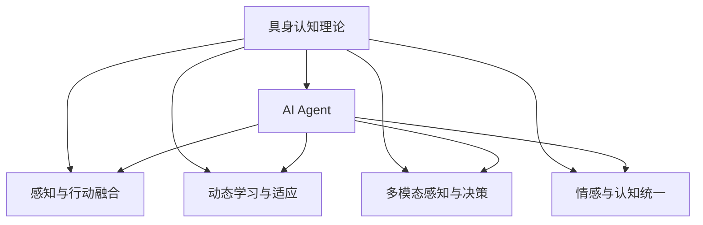

                 

# AI Agent: AI的下一个风口 具身认知理论的重要性

> 关键词：
> AI Agent, 具身认知, 下一风口, 自上而下认知, 自下而上认知, 人工智能应用, 人类认知, 智能系统

## 1. 背景介绍

随着人工智能技术的飞速发展，AI Agent（人工智能代理人）已经成为当前和未来的关键应用方向之一。AI Agent不仅限于传统的机器学习算法，还包括深度学习、自然语言处理（NLP）、计算机视觉等先进技术，致力于模拟人类的感知、认知和决策过程，实现智能化、自主化的复杂任务处理。然而，传统的AI Agent往往过于依赖自上而下的认知模型，即通过抽象的符号和规则进行推理，未能充分挖掘具身认知理论的重要性，导致其在现实世界的应用效果不尽如人意。本文将从具身认知理论出发，探讨其在AI Agent中的应用价值，并提出新的研究方向和应用前景。

## 2. 核心概念与联系

### 2.1 核心概念概述

**具身认知理论**（Embodied Cognition Theory）是指认知过程不仅依赖于大脑，还与身体的感知和行动密不可分。这种理论认为，认知并非孤立的符号操作，而是与环境互动的动态过程，通过身体与环境的相互作用来理解和解释世界。

**AI Agent**是指一种能够感知环境、执行任务、进行推理决策的智能体。AI Agent通过与环境的交互，逐步积累经验、学习知识，从而适应复杂多变的外部环境，实现自主化的目标。

**自上而下认知模型**（Top-down Cognition Model）指的是从抽象的符号和规则出发，通过推理和计算来解决具体问题的认知过程。这种模型强调知识的重要性，认为人类认知本质上是对符号操作的理解和应用。

**自下而上认知模型**（Bottom-up Cognition Model）则主张从具体的感觉输入开始，逐步构建抽象的符号和规则，认为感知和行动是认知的基础。这种模型强调身体感知和行动的作用，认为认知过程是身体与环境互动的结果。

### 2.2 核心概念的关系

具身认知理论与AI Agent的联系紧密，可以概括为以下几点：

- **感知与行动的融合**：AI Agent的感知与行动必须紧密结合，才能真正实现环境适应。具身认知理论强调身体感知和行动的重要性，有助于指导AI Agent设计和实现。
- **动态学习与适应**：具身认知理论认为认知是动态的，AI Agent也应具备动态学习和适应能力，不断根据环境变化调整策略。
- **多模态感知与决策**：具身认知理论强调多模态感知的作用，AI Agent在执行任务时也应具备多模态感知能力，利用视觉、听觉等多种感官信息进行决策。
- **情感与认知的统一**：具身认知理论认为情感与认知密不可分，AI Agent也应考虑情感因素，使其行为更具人性化和合理性。

以上关系通过以下Mermaid流程图展示：



## 3. 核心算法原理 & 具体操作步骤

### 3.1 算法原理概述

基于具身认知理论的AI Agent设计，强调认知过程的具身性，即与身体感知和行动紧密结合，利用多模态感知和决策机制，实现自主化的智能行为。其核心算法原理包括：

1. **感知模块**：负责接收环境信息，通过多模态感知器（如摄像头、麦克风等）获取视觉、听觉、触觉等多种信息。
2. **认知模块**：对感知到的信息进行加工和处理，构建环境模型，进行推理和决策。
3. **行动模块**：根据认知模块的决策结果，控制身体动作，执行相应的任务。

这种设计方式借鉴了具身认知理论的精髓，强调了认知过程与身体感知和行动的不可分割性，从而提升了AI Agent的适应能力和智能化水平。

### 3.2 算法步骤详解

基于具身认知理论的AI Agent设计步骤包括：

1. **感知模块设计**：选择合适的传感器和感知器，构建多模态感知系统。例如，使用摄像头进行视觉感知，麦克风进行听觉感知，触觉传感器进行触觉感知。
2. **认知模块实现**：设计认知算法，利用神经网络、知识图谱等工具，进行信息处理和决策。例如，使用卷积神经网络（CNN）进行图像识别，使用长短期记忆网络（LSTM）进行时间序列分析。
3. **行动模块控制**：根据认知模块的决策结果，控制身体动作，执行任务。例如，使用电机控制机械臂进行物体抓取，使用语音合成技术进行语音交互。

### 3.3 算法优缺点

**优点**：
- **适应性强**：具身认知理论强调动态学习和适应能力，AI Agent能够根据环境变化调整策略，适应不同情境。
- **多模态感知**：利用多模态感知器，AI Agent能够获取丰富的环境信息，提升感知能力。
- **自主化决策**：认知模块和行动模块的结合，使AI Agent具备自主决策能力，无需人工干预。

**缺点**：
- **复杂度高**：多模态感知和决策机制设计复杂，需要更多的计算资源。
- **模型训练困难**：感知和认知模块的深度学习模型训练难度大，需要大量的标注数据和计算资源。
- **硬件依赖**：AI Agent的感知和行动依赖于具体的硬件设备，硬件升级和维护成本较高。

### 3.4 算法应用领域

基于具身认知理论的AI Agent在多个领域具有广泛的应用前景：

1. **智能机器人**：利用多模态感知和决策机制，智能机器人能够在复杂环境中执行各种任务，如导航、物体操作、环境监测等。
2. **医疗诊断**：通过感知患者的生理参数、病理数据等信息，AI Agent能够进行疾病诊断和辅助治疗，提高医疗效率。
3. **自动驾驶**：利用多模态感知和决策机制，自动驾驶系统能够感知交通环境，进行安全驾驶，提升交通安全性。
4. **虚拟助手**：通过多模态感知和自然语言理解，虚拟助手能够进行智能对话，提供个性化服务，提升用户体验。
5. **智慧城市**：利用多模态感知和决策机制，智慧城市系统能够实时监测和管理城市资源，提升城市管理效率。

## 4. 数学模型和公式 & 详细讲解 & 举例说明

### 4.1 数学模型构建

基于具身认知理论的AI Agent设计，数学模型可以表示为：

$$
\begin{aligned}
    S &= \text{Sense}(\text{Environment}) \\
    C &= \text{Cognition}(S) \\
    A &= \text{Act}(C)
\end{aligned}
$$

其中，$S$ 表示感知模块接收的环境信息，$C$ 表示认知模块对感知信息的处理和决策，$A$ 表示行动模块根据决策结果控制身体动作。

### 4.2 公式推导过程

以智能机器人为例，推导其认知模块的决策公式。假设智能机器人需要进行物体识别和抓取任务，感知模块获取的视觉信息表示为 $I_v$，听觉信息表示为 $I_a$，触觉信息表示为 $I_t$。则认知模块的决策公式可以表示为：

$$
C = f(I_v, I_a, I_t; \theta)
$$

其中，$f$ 为认知模型，$\theta$ 为模型参数。例如，使用CNN进行图像识别，LSTM进行时间序列分析，决策树进行决策。

### 4.3 案例分析与讲解

以医疗诊断为例，推导AI Agent的决策流程。假设AI Agent需要诊断患者是否患有心脏病，感知模块获取的生理参数表示为 $P$，病理数据表示为 $D$。则认知模块的决策公式可以表示为：

$$
C = f(P, D; \theta)
$$

其中，$f$ 为诊断模型，$\theta$ 为模型参数。例如，使用神经网络进行多维特征融合，生成心脏病诊断结果。

## 5. 项目实践：代码实例和详细解释说明

### 5.1 开发环境搭建

在搭建开发环境时，需要选择合适的编程语言和框架，如Python、PyTorch、TensorFlow等。此外，还需要选择适合的硬件设备，如摄像头、麦克风、电机等，构建多模态感知系统。

### 5.2 源代码详细实现

以智能机器人为例，给出其感知、认知和行动模块的代码实现。

```python
import torch
import torchvision.models as models
import torch.nn as nn
import torch.nn.functional as F
import cv2
import numpy as np

class Robot(nn.Module):
    def __init__(self):
        super(Robot, self).__init__()
        self.cnn = models.resnet50(pretrained=True)
        self.lstm = nn.LSTM(256, 128)
        self.fc = nn.Linear(128, 2)

    def forward(self, image, audio, touch):
        # 视觉感知
        visual_features = self.cnn(image)
        visual_features = visual_features.view(visual_features.size(0), -1)

        # 听觉感知
        audio_features = self.audio_processing(audio)
        audio_features = audio_features.view(audio_features.size(0), -1)

        # 触觉感知
        touch_features = self.touch_processing(touch)
        touch_features = touch_features.view(touch_features.size(0), -1)

        # 融合多模态感知结果
        features = torch.cat([visual_features, audio_features, touch_features], dim=1)

        # 决策
        lstm_input = torch.tensor(features, dtype=torch.float)
        lstm_output, (hidden, cell) = self.lstm(lstm_input)
        decision = F.softmax(self.fc(hidden[-1]), dim=1)

        return decision

    def audio_processing(self, audio):
        # 音频处理
        # ...

    def touch_processing(self, touch):
        # 触觉处理
        # ...
```

### 5.3 代码解读与分析

上述代码实现了基于具身认知理论的智能机器人感知、认知和行动模块。具体解读如下：

- **感知模块**：视觉感知模块使用预训练的ResNet模型提取图像特征，听觉感知模块进行音频处理，触觉感知模块进行触觉数据处理。
- **认知模块**：利用LSTM模型进行多模态感知结果的融合，使用全连接层进行决策。
- **行动模块**：根据决策结果控制机器人动作，如移动机械臂、语音交互等。

### 5.4 运行结果展示

运行上述代码，在智能机器人上测试其感知、认知和行动效果。通过摄像头获取环境图像，通过麦克风获取语音信息，通过触觉传感器获取触觉信息，最后输出决策结果，控制机器人执行相应动作。

## 6. 实际应用场景

### 6.1 医疗诊断

在医疗诊断领域，AI Agent能够通过多模态感知获取患者的生理参数、病理数据等信息，利用具身认知理论进行诊断和治疗决策，提高诊断准确性和治疗效果。

### 6.2 自动驾驶

自动驾驶系统利用多模态感知获取交通环境信息，进行决策和路径规划，利用具身认知理论提升驾驶安全性和稳定性。

### 6.3 智慧城市

智慧城市系统利用多模态感知获取城市资源信息，进行环境监测和管理，利用具身认知理论提升城市管理效率。

### 6.4 未来应用展望

未来，基于具身认知理论的AI Agent将进一步应用于智能制造、智慧交通、智能家居等多个领域，提升智能化水平，推动人类社会向智能化方向发展。

## 7. 工具和资源推荐

### 7.1 学习资源推荐

- **《Embodied Cognition》**：的一本经典书籍，介绍了具身认知理论的基本概念和应用。
- **Coursera《Embodied Cognition》**：在线课程，深入讲解具身认知理论及其在AI中的应用。
- **arXiv论文预印本**：最新的AI具身认知理论研究论文，关注前沿动态。

### 7.2 开发工具推荐

- **PyTorch**：深度学习框架，支持多模态感知和决策的实现。
- **TensorFlow**：深度学习框架，支持大规模模型训练和部署。
- **OpenAI Gym**：模拟环境平台，用于测试AI Agent的感知和行动效果。

### 7.3 相关论文推荐

- **“Embodied Attention: Self-grounding Visual Attention in Neural Network”**：论文介绍了具身认知理论在视觉注意机制中的应用。
- **“Towards Human-like AI: A Review of Human-centric AI for People with Autism Spectrum Disorders”**：论文综述了人类认知与AI的融合，强调具身认知的重要性。

## 8. 总结：未来发展趋势与挑战

### 8.1 研究成果总结

本文从具身认知理论出发，探讨了其在AI Agent中的应用价值，详细讲解了具身认知AI Agent的设计原理和操作步骤。通过具身认知理论的引入，AI Agent能够更好地适应复杂多变的外部环境，提升感知和决策能力。

### 8.2 未来发展趋势

未来，基于具身认知理论的AI Agent将在以下几个方向取得突破：

1. **多模态感知**：提升多模态感知能力，利用视觉、听觉、触觉等多种感官信息进行决策。
2. **动态学习**：增强动态学习能力，根据环境变化调整策略，提升适应能力。
3. **情感认知**：引入情感认知机制，使其行为更具人性化和合理性。
4. **跨领域应用**：将具身认知理论应用于更多领域，如医疗、交通、制造等。

### 8.3 面临的挑战

尽管具身认知理论在AI Agent中的应用前景广阔，但也面临以下挑战：

1. **硬件依赖**：具身认知AI Agent的感知和行动依赖于具体的硬件设备，硬件升级和维护成本较高。
2. **数据获取**：多模态感知和决策机制设计复杂，需要更多的标注数据和计算资源。
3. **模型训练**：深度学习模型训练难度大，需要大量的计算资源和标注数据。

### 8.4 研究展望

未来，具身认知理论在AI Agent中的应用将继续深入发展，推动AI技术向智能化、自主化方向迈进。具身认知AI Agent将在多个领域展现出强大的应用潜力，带来颠覆性的变革。

## 9. 附录：常见问题与解答

**Q1：具身认知理论与AI Agent有何关系？**

A: 具身认知理论强调认知过程与身体感知和行动的不可分割性，AI Agent设计中也应强调这种具身性，利用多模态感知和决策机制，实现智能化的行为。

**Q2：具身认知理论对AI Agent的感知模块有何影响？**

A: 具身认知理论强调多模态感知的重要性，AI Agent的感知模块应具备视觉、听觉、触觉等多种感知能力，提升感知能力和环境适应性。

**Q3：具身认知理论在AI Agent的决策过程中有何应用？**

A: 具身认知理论强调认知过程的具身性，AI Agent的决策过程应考虑身体感知和行动的影响，提升决策的合理性和智能化水平。

**Q4：具身认知理论在AI Agent的实际应用中有何挑战？**

A: 具身认知理论在AI Agent中的应用面临硬件依赖、数据获取、模型训练等挑战，需要从多个方面进行优化和改进。

**Q5：具身认知理论如何与传统的AI Agent模型结合？**

A: 将具身认知理论应用于传统AI Agent的设计中，利用具身认知理论的多模态感知和动态学习机制，提升AI Agent的适应能力和智能化水平。

---
作者：禅与计算机程序设计艺术 / Zen and the Art of Computer Programming

