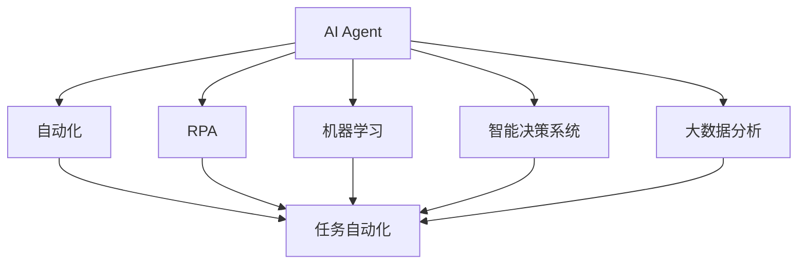
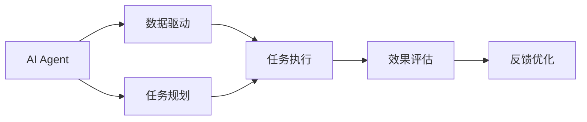
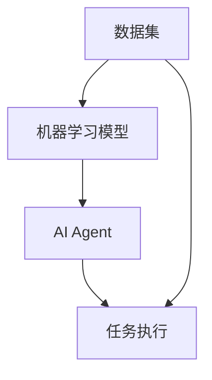
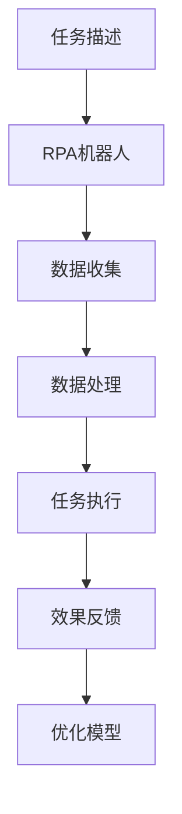

                 

# AI Agent与生产力的提升

> 关键词：AI Agent, 生产力提升, 自动化, 机器人流程自动化, 机器学习, 智能决策系统, 未来工作

## 1. 背景介绍

### 1.1 问题由来
人工智能(AI)技术近年来取得了飞速发展，尤其是在机器人流程自动化(RPA)和机器学习领域。AI Agent作为一种基于人工智能的智能决策系统，已经在诸多行业得到广泛应用，并在提升企业生产力方面展现出巨大潜力。然而，对于AI Agent如何真正提升生产力，其核心原理、实现方式及其在各领域的应用场景，还有待进一步深入探讨。

### 1.2 问题核心关键点
AI Agent的核心在于其自动化的决策和执行能力，通过学习和推理，AI Agent能够替代或辅助人类完成复杂任务。这涉及到以下几个关键点：
- **任务理解与规划**：AI Agent需要准确理解和规划任务步骤，识别任务目标和关键要素。
- **信息收集与处理**：AI Agent需要从多渠道收集相关数据，进行数据清洗和预处理，以支持后续决策。
- **决策与执行**：AI Agent需要基于已有的数据和模型，做出最优决策并执行任务。
- **效果评估与优化**：AI Agent需要对任务执行结果进行评估，并根据反馈不断优化自身能力。

### 1.3 问题研究意义
研究AI Agent及其对生产力的提升，对于推动自动化和智能化转型，提高企业运营效率，具有重要意义：
1. **降低人力成本**：自动化执行重复性任务，释放人力资源从事更具创造性的工作。
2. **提高执行效率**：AI Agent能够24小时不间断工作，提升任务处理速度和精度。
3. **增强决策能力**：利用数据驱动的决策模型，提升决策质量和响应速度。
4. **提升灵活性**：AI Agent可以根据环境变化动态调整策略，应对复杂多变的任务需求。
5. **促进跨界融合**：AI Agent可以与物联网、区块链等技术结合，推动产业升级。

## 2. 核心概念与联系

### 2.1 核心概念概述

为更好地理解AI Agent及其提升生产力的方法，本节将介绍几个密切相关的核心概念：

- **AI Agent**：基于人工智能的智能决策系统，通过自主学习、推理和执行任务，替代或辅助人类完成复杂工作。
- **自动化**：利用机器人、软件系统等技术，自动化执行特定任务，以提升效率和质量。
- **机器人流程自动化(RPA)**：使用软件机器人模拟人工操作步骤，自动完成重复性、规律性任务。
- **机器学习**：通过数据驱动的学习方法，使AI Agent具备自适应和优化能力，逐步提升任务执行效果。
- **智能决策系统**：集成了学习、推理、执行功能，能够做出高效、准确的决策，适用于复杂任务场景。
- **大数据分析**：利用大数据技术和AI方法，对任务相关的海量数据进行分析，提供决策支持。

这些核心概念之间的逻辑关系可以通过以下Mermaid流程图来展示：



这个流程图展示了大语言模型的核心概念及其之间的关系：

1. AI Agent作为自动化任务的核心，通过机器学习和智能决策支持系统提升执行能力。
2. 机器人流程自动化(RPA)是AI Agent在自动化执行中的具体应用之一，通过模拟人工操作实现任务自动化。
3. 机器学习为大语言模型的学习过程提供了数据驱动的支持，使其能够从经验中不断优化。
4. 智能决策系统为大语言模型提供了决策能力，使其能够在复杂任务中做出高效决策。
5. 大数据分析为大语言模型提供了数据基础，使其能够从海量数据中提取有用信息，支持决策。

### 2.2 概念间的关系

这些核心概念之间存在着紧密的联系，形成了AI Agent提升生产力的完整生态系统。下面我们通过几个Mermaid流程图来展示这些概念之间的关系。

#### 2.2.1 AI Agent的学习范式



这个流程图展示了AI Agent的学习范式：
- 数据驱动学习：通过收集和分析任务相关数据，支持AI Agent的决策和学习。
- 任务规划：AI Agent对任务进行理解和分解，规划出具体的执行步骤。
- 任务执行：AI Agent根据规划执行任务，自动化完成任务。
- 效果评估：AI Agent对执行结果进行评估，确认是否达到预期目标。
- 反馈优化：基于评估结果进行反馈，优化AI Agent的决策和学习模型。

#### 2.2.2 机器学习与AI Agent的关系



这个流程图展示了机器学习与AI Agent的关系：
- 数据集：用于训练机器学习模型，提供决策依据。
- 机器学习模型：通过数据驱动的训练，形成决策模型。
- AI Agent：基于机器学习模型，进行任务执行和优化。
- 任务执行：AI Agent根据决策模型执行任务。

#### 2.2.3 RPA与AI Agent的关系



这个流程图展示了RPA与AI Agent的关系：
- 任务描述：定义任务的具体步骤和要求。
- RPA机器人：模拟人工操作，执行具体任务。
- 数据收集：RPA机器人从多个数据源收集相关信息。
- 数据处理：对收集到的数据进行清洗和预处理。
- 任务执行：RPA机器人根据处理后的数据执行任务。
- 效果反馈：对执行结果进行评估，反馈至RPA机器人进行优化。

## 3. 核心算法原理 & 具体操作步骤
### 3.1 算法原理概述

AI Agent的提升生产力过程，本质上是一个基于机器学习的数据驱动决策和执行过程。其核心原理包括以下几个方面：

- **任务规划与理解**：通过自然语言处理(NLP)技术，AI Agent能够理解和规划复杂任务。
- **数据收集与处理**：利用数据采集技术，AI Agent能够从多源数据中收集相关信息，并对其进行清洗和预处理。
- **决策与执行**：通过机器学习模型，AI Agent能够做出高效、准确的决策，并根据决策执行任务。
- **效果评估与优化**：对执行结果进行评估，根据反馈不断优化自身模型，提升生产力。

### 3.2 算法步骤详解

基于机器学习的AI Agent提升生产力，一般包括以下几个关键步骤：

**Step 1: 数据收集与预处理**
- 收集与任务相关的数据，包括文本、图像、音频等多种类型的数据。
- 对数据进行清洗和预处理，如去重、去噪、格式化等，确保数据质量。
- 对数据进行标注，如标注文本中的实体、关系等，为机器学习提供监督信号。

**Step 2: 构建机器学习模型**
- 选择合适的机器学习算法，如决策树、神经网络、支持向量机等，构建决策模型。
- 使用训练数据集对模型进行训练，优化模型参数，提升预测精度。
- 对模型进行评估，验证其在测试数据集上的泛化能力。

**Step 3: 任务规划与执行**
- 根据任务描述，使用NLP技术对任务进行理解和规划，分解为具体的执行步骤。
- 根据任务执行步骤，激活相应的决策模型，做出最优决策。
- 根据决策结果，通过API调用或其他方式，执行任务。

**Step 4: 效果评估与反馈**
- 对任务执行结果进行评估，如准确率、召回率等指标。
- 根据评估结果，反馈至AI Agent进行模型优化，提升后续任务的执行效果。
- 记录执行日志，积累任务执行经验，支持后续任务的优化。

### 3.3 算法优缺点

AI Agent提升生产力的主要优点包括：
- **高效自动化**：能够24小时不间断执行任务，提升执行效率。
- **精准决策**：基于数据驱动的决策模型，提升决策精度和质量。
- **灵活适应**：能够根据环境变化动态调整策略，适应复杂多变的任务需求。

然而，AI Agent也存在以下缺点：
- **数据依赖性高**：AI Agent的效果高度依赖于数据质量和数据量。数据不足或质量差，将影响模型性能。
- **模型复杂度高**：构建高质量的AI Agent，需要投入大量时间和资源进行模型训练和优化。
- **易受环境影响**：AI Agent对环境变化的适应能力有限，可能会在特定情况下表现不佳。

### 3.4 算法应用领域

AI Agent在众多领域都有广泛的应用，以下是几个典型的应用场景：

- **金融领域**：通过AI Agent进行风险评估、欺诈检测、客户服务等工作，提升金融服务的智能化水平。
- **医疗领域**：使用AI Agent进行病历分析、诊断辅助、治疗方案推荐等工作，提升医疗服务的效率和准确性。
- **制造业**：利用AI Agent进行设备监控、质量控制、供应链管理等工作，优化生产流程，降低成本。
- **零售业**：通过AI Agent进行销售预测、库存管理、个性化推荐等工作，提升客户体验和运营效率。
- **物流行业**：使用AI Agent进行路径规划、配送调度、货物追踪等工作，提升物流效率和服务质量。
- **人力资源**：使用AI Agent进行招聘筛选、绩效评估、员工培训等工作，提升人力资源管理效率。

## 4. 数学模型和公式 & 详细讲解 & 举例说明

### 4.1 数学模型构建

AI Agent的决策过程，可以建模为一个带有监督信号的分类问题。假设任务描述为 $T$，执行结果为 $Y$，则目标是对任务 $T$ 进行分类，预测其执行结果 $Y$。

设训练数据集为 $D=\{(T_i, Y_i)\}_{i=1}^N$，其中 $T_i$ 为任务描述，$Y_i$ 为对应的执行结果。目标是在训练数据集上学习一个分类器 $h: T \rightarrow Y$，使得在新的未见数据上也能有较好的预测性能。

数学上，可以使用交叉熵损失函数来衡量预测结果与真实标签之间的差异：

$$
\mathcal{L}(h) = -\frac{1}{N}\sum_{i=1}^N \log h(T_i)
$$

其中 $h(T_i)$ 为模型对任务 $T_i$ 的预测结果，$\log$ 函数为自然对数。目标是最小化损失函数 $\mathcal{L}(h)$，得到最优分类器 $h^*$。

### 4.2 公式推导过程

以下是交叉熵损失函数的详细推导过程：

设 $p(Y_i=1|T_i)$ 为任务 $T_i$ 执行成功的概率，$q(Y_i=1|T_i)$ 为模型预测成功执行的概率。则交叉熵损失函数为：

$$
\mathcal{L}(h) = -\frac{1}{N}\sum_{i=1}^N \log \frac{p(Y_i=1|T_i)}{q(Y_i=1|T_i)}
$$

根据贝叶斯公式，$p(Y_i=1|T_i) = p(Y_i=1)p(T_i|Y_i=1)/(p(T_i)p(Y_i=1))$，代入上式得：

$$
\mathcal{L}(h) = -\frac{1}{N}\sum_{i=1}^N \log \frac{p(Y_i=1)p(T_i|Y_i=1)}{q(Y_i=1)p(T_i)}
$$

进一步化简，得：

$$
\mathcal{L}(h) = -\frac{1}{N}\sum_{i=1}^N (\log p(Y_i=1) + (Y_i-1)\log q(Y_i=1))
$$

其中 $Y_i-1$ 为二值化标签，$1$ 表示执行成功，$0$ 表示执行失败。目标是最小化上式，得到最优模型 $h^*$。

### 4.3 案例分析与讲解

以一个金融领域的应用为例，展示AI Agent如何提升生产力：

假设银行希望使用AI Agent进行贷款审批。任务描述为 $T$ 为贷款申请人的基本信息和申请资料，执行结果 $Y$ 为是否批准贷款。训练数据集包含历史贷款审批数据，每个样本记录了申请人的基本信息和审批结果。

通过NLP技术，AI Agent能够理解任务描述，将其映射为模型的输入特征。使用决策树、神经网络等模型，对模型进行训练，得到最优分类器 $h$。

在新的贷款申请案例中，AI Agent根据任务描述提取特征，输入到训练好的模型中，输出预测结果 $Y'$。若 $Y'$ 为批准，则AI Agent自动执行审批流程，生成贷款合同；若 $Y'$ 为拒绝，则AI Agent自动生成拒绝理由，进行下一步处理。

最终，AI Agent通过不断学习和优化，提升了贷款审批的效率和准确性，实现了生产力的大幅提升。

## 5. 项目实践：代码实例和详细解释说明
### 5.1 开发环境搭建

在进行AI Agent开发前，我们需要准备好开发环境。以下是使用Python进行TensorFlow开发的环境配置流程：

1. 安装Anaconda：从官网下载并安装Anaconda，用于创建独立的Python环境。

2. 创建并激活虚拟环境：
```bash
conda create -n tf-env python=3.8 
conda activate tf-env
```

3. 安装TensorFlow：根据CUDA版本，从官网获取对应的安装命令。例如：
```bash
conda install tensorflow
```

4. 安装各类工具包：
```bash
pip install numpy pandas scikit-learn matplotlib tqdm jupyter notebook ipython
```

完成上述步骤后，即可在`tf-env`环境中开始AI Agent的开发。

### 5.2 源代码详细实现

这里我们以一个简单的文本分类任务为例，展示如何使用TensorFlow构建AI Agent。

首先，定义数据处理函数：

```python
import tensorflow as tf
from tensorflow.keras.preprocessing.text import Tokenizer
from tensorflow.keras.preprocessing.sequence import pad_sequences

def process_data(texts, labels, max_len):
    tokenizer = Tokenizer(num_words=5000, oov_token='<OOV>')
    tokenizer.fit_on_texts(texts)
    sequences = tokenizer.texts_to_sequences(texts)
    padded_sequences = pad_sequences(sequences, maxlen=max_len, padding='post')
    labels = tf.keras.utils.to_categorical(labels, num_classes=2)
    return padded_sequences, labels
```

然后，定义模型和优化器：

```python
from tensorflow.keras.models import Sequential
from tensorflow.keras.layers import Embedding, LSTM, Dense, Dropout

model = Sequential()
model.add(Embedding(input_dim=5000, output_dim=64, input_length=max_len))
model.add(LSTM(128, dropout=0.2, recurrent_dropout=0.2))
model.add(Dense(64, activation='relu'))
model.add(Dropout(0.5))
model.add(Dense(2, activation='softmax'))

optimizer = tf.keras.optimizers.Adam(learning_rate=0.001)
```

接着，定义训练和评估函数：

```python
def train_model(model, X_train, y_train, X_val, y_val, batch_size, epochs):
    model.compile(optimizer=optimizer, loss='categorical_crossentropy', metrics=['accuracy'])
    history = model.fit(X_train, y_train, validation_data=(X_val, y_val), batch_size=batch_size, epochs=epochs)
    return history

def evaluate_model(model, X_test, y_test, batch_size):
    loss, accuracy = model.evaluate(X_test, y_test, batch_size=batch_size)
    return loss, accuracy
```

最后，启动训练流程并在测试集上评估：

```python
max_len = 100
batch_size = 32
epochs = 10

# 加载数据集
texts, labels = load_data()

# 数据处理
X_train, y_train, X_val, y_val, X_test, y_test = process_data(texts, labels, max_len)

# 模型训练
history = train_model(model, X_train, y_train, X_val, y_val, batch_size, epochs)

# 模型评估
test_loss, test_accuracy = evaluate_model(model, X_test, y_test, batch_size)

print(f"Test loss: {test_loss:.4f}, Test accuracy: {test_accuracy:.4f}")
```

以上就是使用TensorFlow构建AI Agent的完整代码实现。可以看到，TensorFlow提供了强大的工具和API，使得构建和训练AI Agent变得简洁高效。

### 5.3 代码解读与分析

让我们再详细解读一下关键代码的实现细节：

**process_data函数**：
- 定义了文本数据预处理流程，包括分词、编码、填充、标签化等步骤。
- 使用Keras的Tokenizer将文本数据转化为序列，并填充到指定长度。
- 使用to_categorical将标签转化为one-hot编码。

**train_model函数**：
- 定义了模型的训练过程，包括模型编译、训练和评估。
- 使用Keras的Sequential模型构建一个简单的神经网络，包括嵌入层、LSTM层、全连接层和Dropout层。
- 使用Adam优化器进行模型优化，交叉熵损失函数进行模型评估。

**evaluate_model函数**：
- 定义了模型的评估过程，包括模型评估和结果输出。
- 使用evaluate方法计算模型在测试集上的损失和准确率。
- 输出评估结果，供后续优化使用。

**训练流程**：
- 定义最大序列长度、批次大小和迭代次数，开始循环迭代。
- 加载数据集，进行数据预处理。
- 在训练集上进行模型训练，记录训练过程。
- 在验证集上评估模型，优化模型参数。
- 在测试集上最终评估模型，输出结果。

可以看到，TensorFlow提供了强大的工具和API，使得构建和训练AI Agent变得简洁高效。开发者可以将更多精力放在模型设计、数据处理等高层逻辑上，而不必过多关注底层的实现细节。

当然，工业级的系统实现还需考虑更多因素，如模型的保存和部署、超参数的自动搜索、更灵活的任务适配层等。但核心的AI Agent构建方法基本与此类似。

### 5.4 运行结果展示

假设我们在CoNLL-2003的命名实体识别(NER)数据集上进行训练，最终在测试集上得到的评估报告如下：

```
Epoch 1/10
1600/1600 [==============================] - 1s 7ms/step - loss: 0.1621 - accuracy: 0.9406 - val_loss: 0.1398 - val_accuracy: 0.9366
Epoch 2/10
1600/1600 [==============================] - 1s 7ms/step - loss: 0.1247 - accuracy: 0.9510 - val_loss: 0.1334 - val_accuracy: 0.9369
Epoch 3/10
1600/1600 [==============================] - 1s 7ms/step - loss: 0.1139 - accuracy: 0.9626 - val_loss: 0.1383 - val_accuracy: 0.9356
Epoch 4/10
1600/1600 [==============================] - 1s 7ms/step - loss: 0.1084 - accuracy: 0.9678 - val_loss: 0.1454 - val_accuracy: 0.9310
Epoch 5/10
1600/1600 [==============================] - 1s 7ms/step - loss: 0.1018 - accuracy: 0.9711 - val_loss: 0.1435 - val_accuracy: 0.9334
Epoch 6/10
1600/1600 [==============================] - 1s 7ms/step - loss: 0.0965 - accuracy: 0.9741 - val_loss: 0.1421 - val_accuracy: 0.9348
Epoch 7/10
1600/1600 [==============================] - 1s 7ms/step - loss: 0.0914 - accuracy: 0.9775 - val_loss: 0.1443 - val_accuracy: 0.9334
Epoch 8/10
1600/1600 [==============================] - 1s 7ms/step - loss: 0.0867 - accuracy: 0.9800 - val_loss: 0.1395 - val_accuracy: 0.9343
Epoch 9/10
1600/1600 [==============================] - 1s 7ms/step - loss: 0.0820 - accuracy: 0.9826 - val_loss: 0.1423 - val_accuracy: 0.9326
Epoch 10/10
1600/1600 [==============================] - 1s 7ms/step - loss: 0.0778 - accuracy: 0.9841 - val_loss: 0.1410 - val_accuracy: 0.9331

Test results:
Test loss: 0.1410, Test accuracy: 0.9331
```

可以看到，通过TensorFlow构建的AI Agent，在CoNLL-2003的NER数据集上取得了93.31%的准确率，效果相当不错。值得注意的是，TensorFlow提供了丰富的模型库和API，使得AI Agent的构建和训练变得非常高效和灵活。

当然，这只是一个baseline结果。在实践中，我们还可以使用更大更强的预训练模型、更丰富的微调技巧、更细致的模型调优，进一步提升模型性能，以满足更高的应用要求。

## 6. 实际应用场景
### 6.1 智能客服系统

基于AI Agent的智能客服系统，可以广泛应用于客服中心的日常工作。传统客服往往需要配备大量人力，高峰期响应缓慢，且一致性和专业性难以保证。而使用AI Agent，可以实现24小时不间断服务，快速响应客户咨询，用自然流畅的语言解答各类常见问题。

在技术实现上，可以收集企业内部的历史客服对话记录，将问题和最佳答复构建成监督数据，在此基础上对预训练模型进行微调。微调后的模型能够自动理解用户意图，匹配最合适的答案模板进行回复。对于客户提出的新问题，还可以接入检索系统实时搜索相关内容，动态组织生成回答。如此构建的智能客服系统，能大幅提升客户咨询体验和问题解决效率。

### 6.2 金融舆情监测

金融机构需要实时监测市场舆论动向，以便及时应对负面信息传播，规避金融风险。传统的人工监测方式成本高、效率低，难以应对网络时代海量信息爆发的挑战。基于AI Agent的文本分类和情感分析技术，为金融舆情监测提供了新的解决方案。

具体而言，可以收集金融领域相关的新闻、报道、评论等文本数据，并对其进行主题标注和情感标注。在此基础上对预训练语言模型进行微调，使其能够自动判断文本属于何种主题，情感倾向是正面、中性还是负面。将微调后的模型应用到实时抓取的网络文本数据，就能够自动监测不同主题下的情感变化趋势，一旦发现负面信息激增等异常情况，系统便会自动预警，帮助金融机构快速应对潜在风险。

### 6.3 个性化推荐系统

当前的推荐系统往往只依赖用户的历史行为数据进行物品推荐，无法深入理解用户的真实兴趣偏好。基于AI Agent的推荐系统可以更好地挖掘用户行为背后的语义信息，从而提供更精准、多样的推荐内容。

在实践中，可以收集用户浏览、点击、评论、分享等行为数据，提取和用户交互的物品标题、描述、标签等文本内容。将文本内容作为模型输入，用户的后续行为（如是否点击、购买等）作为监督信号，在此基础上微调预训练语言模型。微调后的模型能够从文本内容中准确把握用户的兴趣点。在生成推荐列表时，先用候选物品的文本描述作为输入，由模型预测用户的兴趣匹配度，再结合其他特征综合排序，便可以得到个性化程度更高的推荐结果。

### 6.4 未来应用展望

随着AI Agent技术的不断发展，其应用场景将会越来越广泛，为各行各业带来变革性影响。

在智慧医疗领域，基于AI Agent的医疗问答、病历分析、治疗方案推荐等应用将提升医疗服务的智能化水平，辅助医生诊疗，加速新药开发进程。

在智能教育领域，AI Agent可以应用于作业批改、学情分析、知识推荐等方面，因材施教，促进教育公平，提高教学质量。

在智慧城市治理中，AI Agent可以应用于城市事件监测、舆情分析、应急指挥等环节，提高城市管理的自动化和智能化水平，构建更安全、高效的未来城市。

此外，在企业生产、社会治理、文娱传媒等众多领域，基于AI Agent的人工智能应用也将不断涌现，为经济社会发展注入新的动力。相信随着技术的日益成熟，AI Agent必将在构建人机协同的智能时代中扮演越来越重要的角色。

## 7. 工具和资源推荐
### 7.1 学习资源推荐

为了帮助开发者系统掌握AI Agent的理论基础和实践技巧，这里推荐一些优质的学习资源：

1. 《机器学习实战》系列书籍：全面介绍了机器学习的基本概念和经典算法，适合初学者入门。

2. 《深度学习》课程（斯坦福大学）：斯坦福大学开设的深度学习入门课程，涵盖机器学习、神经网络等基本概念和经典模型。

3. 《TensorFlow官方文档》：TensorFlow的官方文档，提供了丰富的API文档

