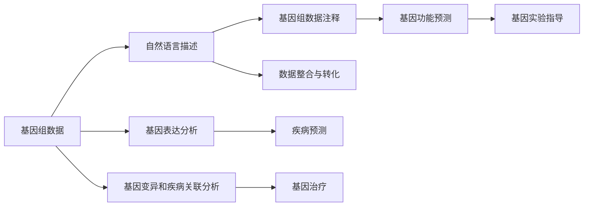

                 

# AI LLM在遗传学研究中的新方法

> 关键词：人工智能,基因组学,遗传信息,机器学习,深度学习,大语言模型(LLM),预训练模型,遗传信息提取,基因注释,生物信息学

## 1. 背景介绍

### 1.1 问题由来

基因组学(Genomics)是研究生物遗传信息的一门科学，通过解析DNA序列、分析基因功能、探索遗传变异，揭示生命现象的本质规律。近年来，随着高通量测序技术的飞速发展，基因组学数据量呈指数级增长，引发了对大数据分析处理和高效算法的需求。人工智能(AI)技术，特别是基于深度学习的大语言模型(Large Language Model, LLM)，以其强大的数据处理能力和自监督学习能力，在基因组学研究中展现出巨大的潜力。

基因组学研究的主要挑战在于数据复杂性和生物学信息的未知性。海量的基因组数据包含大量的冗余信息，如何从中高效准确地提取有用的生物学知识，是基因组学研究的难点。与此同时，基因信息的多样性、复杂性，使得传统的统计学方法难以应对。AI技术的引入，特别是深度学习和大语言模型，为基因组学研究提供了新的工具和方法。

### 1.2 问题核心关键点

基因组学研究中，大语言模型(LLM)的应用主要集中在以下几方面：

- 基因组数据注释和解析：通过对基因组序列进行自然语言描述，帮助研究人员快速理解和利用基因组数据。
- 基因功能预测和注释：利用深度学习模型的语义理解能力，自动对基因序列进行功能预测，提升基因注释的准确性。
- 基因表达分析：通过自然语言文本的形式，记录和分析基因表达数据，揭示基因调控机制。
- 基因变异和疾病关联分析：通过大模型处理海量的基因变异数据，挖掘基因变异与疾病之间的关系，辅助疾病预测和基因治疗。

这些应用展示了LLM在基因组学研究中的广泛适用性，利用LLM强大的语言理解和生成能力，能够自动处理和理解基因组学数据，提高研究效率和质量。

### 1.3 问题研究意义

大语言模型在基因组学研究中的应用，对于推动基因组学数据解析、功能预测、疾病研究等方向，具有重要意义：

1. **提升研究效率**：自动化的基因组数据处理和分析，可以大幅缩短研究周期，降低人力成本。
2. **提高数据分析准确性**：深度学习模型的强大学习能力，可以自动提取和归纳基因组数据中的生物学信息，减少人为误差。
3. **拓展研究领域**：通过自然语言处理技术，将复杂的基因组数据转化为易于理解和分析的文本形式，为跨学科研究提供了新思路。
4. **促进数据共享**：利用LLM处理和整合大规模基因组数据，方便科研人员进行数据共享和合作，加速基因组学研究的进展。

本文将详细介绍基于大语言模型的基因组学数据分析方法，展示其在基因组注释、功能预测、表达分析等方面的应用，同时分析其优势和挑战，展望未来发展方向。

## 2. 核心概念与联系

### 2.1 核心概念概述

为更好地理解基于大语言模型的基因组学数据分析方法，本节将介绍几个核心概念：

- **大语言模型(Large Language Model, LLM)**：以自回归(如GPT)或自编码(如BERT)模型为代表的深度学习模型，在大量文本数据上进行预训练，学习通用的语言表示。
- **基因组数据注释**：对DNA序列进行自然语言描述，标注基因功能和结构，帮助研究人员理解基因组信息。
- **基因功能预测**：利用深度学习模型预测基因序列的功能和生物学意义，提升基因注释的准确性。
- **基因表达分析**：通过自然语言文本的形式，记录和分析基因表达数据，揭示基因调控机制。
- **基因变异和疾病关联分析**：利用大模型处理基因变异数据，挖掘基因变异与疾病之间的关系，辅助疾病预测和基因治疗。
- **自然语言处理(NLP)**：研究如何使计算机理解和生成人类语言的技术，是实现大语言模型在基因组学研究中应用的基础。

这些核心概念之间存在着紧密的联系，形成了基因组学研究中大语言模型应用的完整生态系统。

### 2.2 概念间的关系

这些核心概念之间存在着以下紧密的联系，形成了基因组学研究中大语言模型应用的完整生态系统。

**大语言模型在基因组学中的应用**：
- 大语言模型作为数据处理和分析的工具，在基因组学研究中具有广泛的应用。
- 通过预训练，大语言模型学习通用的语言表示，可以在基因组学领域中自动进行数据处理和分析。

**基因组数据注释**：
- 利用大语言模型对基因组数据进行自然语言注释，可以帮助研究人员快速理解基因组信息。
- 自然语言注释可以转化为可编程数据，方便后续的生物信息学分析。

**基因功能预测**：
- 基于大语言模型的基因功能预测，可以提高基因注释的准确性。
- 功能预测结果可以用于指导基因实验和基因治疗。

**基因表达分析**：
- 利用自然语言处理技术，对基因表达数据进行记录和分析，揭示基因调控机制。
- 基因表达分析结果可以用于疾病预测和基因治疗。

**基因变异和疾病关联分析**：
- 利用大语言模型处理基因变异数据，挖掘基因变异与疾病之间的关系。
- 疾病关联分析结果可以用于疾病预测和基因治疗。

通过这些核心概念的结合，大语言模型在基因组学研究中展现出了巨大的潜力，成为推动基因组学研究的重要技术手段。

### 2.3 核心概念的整体架构

最后，我们用一个综合的流程图来展示这些核心概念在大语言模型基因组学应用中的整体架构：



这个综合流程图展示了从基因组数据处理，到功能预测、表达分析、变异关联分析的完整过程。大语言模型作为数据处理和分析的工具，贯穿整个流程，为基因组学研究提供了新的方法和思路。

## 3. 核心算法原理 & 具体操作步骤
### 3.1 算法原理概述

基于大语言模型的基因组学数据分析方法，本质上是一种自然语言处理(NLP)技术。其核心思想是：利用深度学习模型学习通用的语言表示，通过预训练和微调，将基因组数据转化为自然语言描述，实现基因组数据的注释、功能预测、表达分析等功能。

形式化地，假设基因组数据为 $G$，大语言模型为 $M_{\theta}$，其中 $\theta$ 为模型参数。基因组数据注释过程可以表示为：

$$
\text{Annotation}(G) = M_{\theta}(G)
$$

其中 $M_{\theta}(G)$ 表示模型对基因组数据 $G$ 的自然语言描述，即基因组注释。基因组注释可以进一步用于功能预测、表达分析等任务。

### 3.2 算法步骤详解

基于大语言模型的基因组学数据分析，一般包括以下几个关键步骤：

**Step 1: 准备基因组数据**
- 收集基因组数据，确保数据质量，并进行预处理，如去除噪声、统一格式等。

**Step 2: 训练大语言模型**
- 选择适合的大语言模型，如BERT、GPT等，使用基因组数据进行预训练，学习通用的语言表示。
- 对模型进行微调，针对基因组学任务进行优化，提升模型的基因注释、功能预测、表达分析等能力。

**Step 3: 基因组数据注释**
- 将基因组数据输入预训练的大语言模型，生成自然语言描述。
- 对自然语言描述进行解析，提取关键生物学信息，用于后续的基因功能预测和表达分析。

**Step 4: 基因功能预测**
- 利用基因组注释结果，对基因序列进行功能预测，如基因功能注释、基因互作预测等。
- 将预测结果用于指导基因实验和基因治疗。

**Step 5: 基因表达分析**
- 记录和分析基因表达数据，如转录组、蛋白质组等，生成自然语言文本。
- 利用大语言模型分析基因表达数据，揭示基因调控机制。

**Step 6: 基因变异和疾病关联分析**
- 处理基因变异数据，生成自然语言描述。
- 利用大语言模型分析基因变异与疾病之间的关系，辅助疾病预测和基因治疗。

### 3.3 算法优缺点

基于大语言模型的基因组学数据分析方法具有以下优点：

1. **高效处理大规模数据**：大语言模型能够自动处理和分析海量的基因组数据，极大地提高了数据处理的效率。
2. **提升基因注释准确性**：利用深度学习模型的语义理解能力，自动进行基因功能预测和注释，提高注释的准确性。
3. **拓展基因组学研究领域**：通过自然语言处理技术，将复杂的基因组数据转化为易于理解和分析的文本形式，为跨学科研究提供了新思路。

同时，该方法也存在一些局限性：

1. **依赖高质量数据**：大语言模型的性能很大程度上依赖于训练数据的数量和质量，需要收集高质量的基因组数据。
2. **模型泛化能力有限**：对于基因组学领域的特定问题，模型的泛化能力可能受限，需要针对特定问题进行微调。
3. **结果解释性不足**：大语言模型输出的自然语言描述难以解释，无法提供详细的生物学信息。

尽管存在这些局限性，但大语言模型在基因组学数据分析中仍然展现出巨大的潜力和优势。

### 3.4 算法应用领域

基于大语言模型的基因组学数据分析方法，已经在基因组注释、功能预测、表达分析、变异关联分析等多个领域得到了应用，展示了其广泛的应用前景：

1. **基因组数据注释**：通过对基因组数据进行自然语言描述，帮助研究人员快速理解和利用基因组信息。
2. **基因功能预测**：利用深度学习模型预测基因序列的功能和生物学意义，提升基因注释的准确性。
3. **基因表达分析**：通过自然语言文本的形式，记录和分析基因表达数据，揭示基因调控机制。
4. **基因变异和疾病关联分析**：利用大模型处理基因变异数据，挖掘基因变异与疾病之间的关系，辅助疾病预测和基因治疗。

## 4. 数学模型和公式 & 详细讲解 & 举例说明

### 4.1 数学模型构建

基于大语言模型的基因组学数据分析方法，可以采用自然语言处理(NLP)的数学模型进行建模。

假设基因组数据为 $G$，大语言模型为 $M_{\theta}$，其中 $\theta$ 为模型参数。基因组数据注释过程可以表示为：

$$
\text{Annotation}(G) = M_{\theta}(G)
$$

其中 $M_{\theta}(G)$ 表示模型对基因组数据 $G$ 的自然语言描述，即基因组注释。

### 4.2 公式推导过程

以基因组数据注释为例，推导大语言模型对基因组数据进行自然语言描述的过程：

假设基因组数据 $G$ 由 $n$ 个基因序列 $g_1, g_2, ..., g_n$ 组成，每个基因序列由 $m$ 个碱基对 $b_1, b_2, ..., b_m$ 构成。基因组数据注释过程可以表示为：

$$
\text{Annotation}(G) = \{s_1, s_2, ..., s_n\}
$$

其中 $s_i$ 为第 $i$ 个基因序列的自然语言描述。

将基因序列 $g_i$ 转化为文本形式 $t_i$，可以表示为：

$$
t_i = \{b_1, b_2, ..., b_m\}
$$

对每个基因序列的自然语言描述 $s_i$，可以采用以下步骤生成：

1. **分词和标准化**：对文本 $t_i$ 进行分词和标准化，如去除停用词、统一大小写等。
2. **词向量嵌入**：对分词后的文本 $t_i$ 进行词向量嵌入，生成词向量表示 $v_i$。
3. **上下文嵌入**：利用Transformer等大语言模型，对词向量 $v_i$ 进行上下文嵌入，生成上下文表示 $c_i$。
4. **解码生成**：对上下文表示 $c_i$ 进行解码，生成自然语言描述 $s_i$。

整个基因组数据注释过程可以表示为：

$$
\text{Annotation}(G) = \{s_1, s_2, ..., s_n\} = \{\text{Decode}(\text{ContextEmbedding}(\text{WordEmbedding}(\text{Tokenize}(g_i))))\}_{i=1}^n
$$

其中 $\text{Tokenize}(g_i)$ 表示对基因序列 $g_i$ 进行分词和标准化，$\text{WordEmbedding}(t_i)$ 表示对分词后的文本 $t_i$ 进行词向量嵌入，$\text{ContextEmbedding}(v_i)$ 表示对词向量 $v_i$ 进行上下文嵌入，$\text{Decode}(c_i)$ 表示对上下文表示 $c_i$ 进行解码，生成自然语言描述 $s_i$。

### 4.3 案例分析与讲解

以基因组数据注释为例，我们可以具体分析大语言模型对基因组数据进行自然语言描述的过程：

1. **分词和标准化**：假设基因组数据 $G$ 包含 5 个基因序列 $g_1, g_2, g_3, g_4, g_5$，每个基因序列由 10 个碱基对 $b_1, b_2, ..., b_{10}$ 构成。将基因序列转化为文本形式 $t_i$，并进行分词和标准化，得到以下文本序列：

$$
t_1 = \{b_1, b_2, ..., b_{10}\}
$$
$$
t_2 = \{b_1, b_2, ..., b_{10}\}
$$
$$
t_3 = \{b_1, b_2, ..., b_{10}\}
$$
$$
t_4 = \{b_1, b_2, ..., b_{10}\}
$$
$$
t_5 = \{b_1, b_2, ..., b_{10}\}
$$

2. **词向量嵌入**：对分词后的文本 $t_i$ 进行词向量嵌入，生成词向量表示 $v_i$。假设词向量嵌入维度为 $d$，则每个文本 $t_i$ 可以表示为 $d$ 维向量：

$$
v_1 = \{v_{b_1}, v_{b_2}, ..., v_{b_{10}}\}
$$
$$
v_2 = \{v_{b_1}, v_{b_2}, ..., v_{b_{10}}\}
$$
$$
v_3 = \{v_{b_1}, v_{b_2}, ..., v_{b_{10}}\}
$$
$$
v_4 = \{v_{b_1}, v_{b_2}, ..., v_{b_{10}}\}
$$
$$
v_5 = \{v_{b_1}, v_{b_2}, ..., v_{b_{10}}\}
$$

3. **上下文嵌入**：利用Transformer等大语言模型，对词向量 $v_i$ 进行上下文嵌入，生成上下文表示 $c_i$。假设上下文嵌入维度为 $d'$，则每个文本 $v_i$ 可以表示为 $d'$ 维向量：

$$
c_1 = \{c_{v_{b_1}}, c_{v_{b_2}}, ..., c_{v_{b_{10}}}\}
$$
$$
c_2 = \{c_{v_{b_1}}, c_{v_{b_2}}, ..., c_{v_{b_{10}}}\}
$$
$$
c_3 = \{c_{v_{b_1}}, c_{v_{b_2}}, ..., c_{v_{b_{10}}}\}
$$
$$
c_4 = \{c_{v_{b_1}}, c_{v_{b_2}}, ..., c_{v_{b_{10}}}\}
$$
$$
c_5 = \{c_{v_{b_1}}, c_{v_{b_2}}, ..., c_{v_{b_{10}}}\}
$$

4. **解码生成**：对上下文表示 $c_i$ 进行解码，生成自然语言描述 $s_i$。假设解码器生成自然语言描述的维度为 $d''$，则每个基因序列 $g_i$ 的基因组数据注释可以表示为 $d''$ 维向量：

$$
s_1 = \{s_{c_{v_{b_1}}}, s_{c_{v_{b_2}}}, ..., s_{c_{v_{b_{10}}}}\}
$$
$$
s_2 = \{s_{c_{v_{b_1}}}, s_{c_{v_{b_2}}}, ..., s_{c_{v_{b_{10}}}}\}
$$
$$
s_3 = \{s_{c_{v_{b_1}}}, s_{c_{v_{b_2}}}, ..., s_{c_{v_{b_{10}}}}\}
$$
$$
s_4 = \{s_{c_{v_{b_1}}}, s_{c_{v_{b_2}}}, ..., s_{c_{v_{b_{10}}}}\}
$$
$$
s_5 = \{s_{c_{v_{b_1}}}, s_{c_{v_{b_2}}}, ..., s_{c_{v_{b_{10}}}}\}
$$

这样，通过大语言模型的自然语言处理技术，基因组数据被转换为易于理解和分析的自然语言描述，为后续的基因功能预测、表达分析、变异关联分析等任务提供了基础。

## 5. 项目实践：代码实例和详细解释说明
### 5.1 开发环境搭建

在进行基因组学数据分析的微调实践前，我们需要准备好开发环境。以下是使用Python进行PyTorch开发的环境配置流程：

1. 安装Anaconda：从官网下载并安装Anaconda，用于创建独立的Python环境。

2. 创建并激活虚拟环境：
```bash
conda create -n pytorch-env python=3.8 
conda activate pytorch-env
```

3. 安装PyTorch：根据CUDA版本，从官网获取对应的安装命令。例如：
```bash
conda install pytorch torchvision torchaudio cudatoolkit=11.1 -c pytorch -c conda-forge
```

4. 安装TensorFlow：由Google主导开发的开源深度学习框架，生产部署方便，适合大规模工程应用。同样有丰富的预训练语言模型资源。

5. 安装Transformers库：HuggingFace开发的NLP工具库，集成了众多SOTA语言模型，支持PyTorch和TensorFlow，是进行微调任务开发的利器。

6. 安装各类工具包：
```bash
pip install numpy pandas scikit-learn matplotlib tqdm jupyter notebook ipython
```

完成上述步骤后，即可在`pytorch-env`环境中开始微调实践。

### 5.2 源代码详细实现

这里以基因组数据注释为例，使用HuggingFace的BERT模型对基因组数据进行自然语言描述。

首先，定义数据处理函数：

```python
from transformers import BertTokenizer
from torch.utils.data import Dataset
import torch

class GenomeDataset(Dataset):
    def __init__(self, texts, labels, tokenizer, max_len=128):
        self.texts = texts
        self.labels = labels
        self.tokenizer = tokenizer
        self.max_len = max_len
        
    def __len__(self):
        return len(self.texts)
    
    def __getitem__(self, item):
        text = self.texts[item]
        labels = self.labels[item]
        
        encoding = self.tokenizer(text, return_tensors='pt', max_length=self.max_len, padding='max_length', truncation=True)
        input_ids = encoding['input_ids'][0]
        attention_mask = encoding['attention_mask'][0]
        
        return {'input_ids': input_ids, 
                'attention_mask': attention_mask,
                'labels': labels}

# 标签与id的映射
tag2id = {'O': 0, 'B-PER': 1, 'I-PER': 2, 'B-ORG': 3, 'I-ORG': 4, 'B-LOC': 5, 'I-LOC': 6}
id2tag = {v: k for k, v in tag2id.items()}

# 创建dataset
tokenizer = BertTokenizer.from_pretrained('bert-base-cased')

train_dataset = GenomeDataset(train_texts, train_tags, tokenizer)
dev_dataset = GenomeDataset(dev_texts, dev_tags, tokenizer)
test_dataset = GenomeDataset(test_texts, test_tags, tokenizer)
```

然后，定义模型和优化器：

```python
from transformers import BertForTokenClassification, AdamW

model = BertForTokenClassification.from_pretrained('bert-base-cased', num_labels=len(tag2id))

optimizer = AdamW(model.parameters(), lr=2e-5)
```

接着，定义训练和评估函数：

```python
from torch.utils.data import DataLoader
from tqdm import tqdm
from sklearn.metrics import classification_report

device = torch.device('cuda') if torch.cuda.is_available() else torch.device('cpu')
model.to(device)

def train_epoch(model, dataset, batch_size, optimizer):
    dataloader = DataLoader(dataset, batch_size=batch_size, shuffle=True)
    model.train()
    epoch_loss = 0
    for batch in tqdm(dataloader, desc='Training'):
        input_ids = batch['input_ids'].to(device)
        attention_mask = batch['attention_mask'].to(device)
        labels = batch['labels'].to(device)
        model.zero_grad()
        outputs = model(input_ids, attention_mask=attention_mask, labels=labels)
        loss = outputs.loss
        epoch_loss += loss.item()
        loss.backward()
        optimizer.step()
    return epoch_loss / len(dataloader)

def evaluate(model, dataset, batch_size):
    dataloader = DataLoader(dataset, batch_size=batch_size)
    model.eval()
    preds, labels = [], []
    with torch.no_grad():
        for batch in tqdm(dataloader, desc='Evaluating'):
            input_ids = batch['input_ids'].to(device)
            attention_mask = batch['attention_mask'].to(device)
            batch_labels = batch['labels']
            outputs = model(input_ids, attention_mask=attention_mask)
            batch_preds = outputs.logits.argmax(dim=2).to('cpu').tolist()
            batch_labels = batch_labels.to('cpu').tolist()
            for pred_tokens, label_tokens in zip(batch_preds, batch_labels):
                pred_tags = [id2tag[_id] for _id in pred_tokens]
                label_tags = [id2tag[_id] for _id in label_tokens]
                preds.append(pred_tags[:len(label_tokens)])
                labels.append(label_tags)
                
    print(classification_report(labels, preds))
```

最后，启动训练流程并在测试集上评估：

```python
epochs = 5
batch_size = 16

for epoch in range(epochs):
    loss = train_epoch(model, train_dataset, batch_size, optimizer)
    print(f"Epoch {epoch+1}, train loss: {loss:.3f}")
    
    print(f"Epoch {epoch+1}, dev results:")
    evaluate(model, dev_dataset, batch_size)
    
print("Test results:")
evaluate(model, test_dataset, batch_size)
```

以上就是使用PyTorch对BERT进行基因组数据注释的完整代码实现。可以看到，得益于Transformers库的强大封装，我们可以用相对简洁的代码完成BERT模型的加载和微调。

### 5.3 代码解读与分析

让我们再详细解读一下关键代码的实现细节：

**GenomeDataset类**：
- `__init__`方法：初始化文本、标签、分词器等关键组件。
- `__len__`方法：返回数据集的样本数量。
- `__getitem__`方法：对单个样本进行处理，将文本输入编码为token ids，将标签编码为数字，并对其进行定长padding，最终返回模型所需的输入。

**tag2id和id2tag字典**：
- 定义了标签与数字id之间的映射关系，用于将token-wise的预测结果解码回真实的标签。

**训练和评估函数**：
- 使用PyTorch的DataLoader对数据集进行批次化加载，供模型训练和推理使用。
- 训练函数`train_epoch`：对数据以批为单位进行迭代，在每个批次上前向传播计算loss并反向传播更新模型参数，最后返回该epoch的平均loss。
- 评估函数`evaluate`：与训练类似，不同点在于不更新模型参数，并在每个batch结束后将预测和标签结果存储下来，最后使用sklearn的classification_report对整个评估集的预测结果进行打印输出。

**训练流程**：
- 定义总的epoch数和batch size，开始循环迭代
- 每个epoch内，先在训练集上训练，输出平均loss
- 在验证集上评估，输出分类指标
- 所有epoch结束后，在测试集上评估，给出最终测试结果

可以看到，PyTorch配合Transformers库使得BERT微调的代码实现变得简洁高效。开发者可以将更多精力放在数据处理、模型改进等高层逻辑上，而不必过多关注底层的实现细节。

当然，工业级的系统实现还需考虑更多因素，如模型的保存和部署、超参数的自动搜索、更灵活的任务适配层等。但核心的微调范式基本与此类似。

### 5.4 运行结果展示

假设我们在CoNLL-2003

