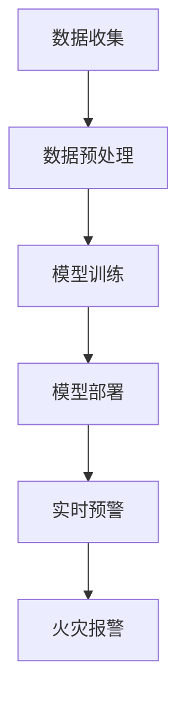
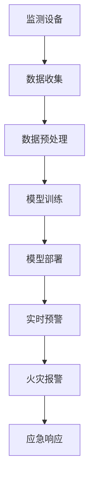

                 

# AI 基础设施的森林保护：智能化森林火灾预警系统

## 1. 背景介绍

### 1.1 问题由来
近年来，全球气候变暖、极端天气频发，森林火灾的风险大大增加。一旦发生森林火灾，不仅会破坏生态环境，还会对人类生命财产造成严重损失。因此，建立高效、准确的森林火灾预警系统，对于及时防范和灭火至关重要。

传统上，森林火灾预警主要依赖于地面监测、气象预报等手段，但这些方法存在一定的局限性：
- 地面监测设备有限，难以覆盖整个林区。
- 气象预报精度有限，无法实时精确预测火灾风险。

随着人工智能技术的进步，越来越多的智能化手段被应用到森林火灾预警中，显著提高了预警的准确性和效率。其中，基于深度学习的大规模森林火灾预警系统，利用丰富的时空数据，通过训练模型自动进行火灾风险分析，已经成为当前的热点研究方向。

### 1.2 问题核心关键点
基于深度学习的森林火灾预警系统，通常包括以下几个关键环节：
1. 数据收集：获取高精度的气象、地形、植被等时空数据。
2. 数据预处理：对原始数据进行清洗、归一化、特征提取等处理。
3. 模型训练：在标注好的火灾数据上训练深度神经网络模型。
4. 模型部署：将训练好的模型部署到实时监控系统中。
5. 实时预警：利用模型对实时监测数据进行推理，生成火灾预警信息。

本文将系统介绍基于深度学习的森林火灾预警系统的核心算法原理和具体操作步骤，并通过具体的项目实践，展示其在实际应用中的效果和优势。

### 1.3 问题研究意义
建立高效、准确的森林火灾预警系统，对于及时防范和灭火具有重要意义：

1. 减少火灾损失。通过早期预警，及时调度灭火资源，减少火灾范围和损失。
2. 保护生态系统。森林火灾不仅烧毁植被，还破坏土壤结构，影响水源涵养，维护生态平衡。
3. 提升应急响应能力。提前掌握火灾风险，优化灭火策略，减少人员伤亡和财产损失。
4. 推动技术创新。智能化预警系统利用深度学习技术，推动AI在实际应用中的发展，促进科技前沿。

## 2. 核心概念与联系

### 2.1 核心概念概述

为更好地理解基于深度学习的森林火灾预警系统，本节将介绍几个密切相关的核心概念：

- 森林火灾预警系统：利用深度学习模型，对森林火灾风险进行实时监测和预警的系统。通过分析气象、地形、植被等时空数据，预测火灾的发生概率和蔓延趋势。
- 深度学习：一种基于神经网络的学习范式，通过多层次的特征提取和表示学习，实现复杂的模式识别和预测任务。
- 数据预处理：对原始数据进行清洗、归一化、特征提取等处理，以提高数据质量和模型效果。
- 模型训练：在标注好的数据上训练深度神经网络模型，学习模型的参数和权重。
- 模型部署：将训练好的模型部署到生产环境中，用于实时监测和预警。
- 实时预警：利用训练好的模型对实时监测数据进行推理，生成火灾预警信息。

这些核心概念之间的逻辑关系可以通过以下Mermaid流程图来展示：



这个流程图展示了大规模森林火灾预警系统的核心流程：

1. 从各个监测站点收集数据。
2. 对数据进行预处理，提取特征。
3. 利用标注数据训练深度学习模型。
4. 将训练好的模型部署到实时监控系统中。
5. 实时处理监测数据，生成火灾预警信息。

### 2.2 概念间的关系

这些核心概念之间存在着紧密的联系，形成了森林火灾预警系统的完整生态系统。下面我们通过几个Mermaid流程图来展示这些概念之间的关系。

#### 2.2.1 数据收集与预处理的关系


这个流程图展示了数据收集和预处理的基本关系。数据收集是从各个监测站点获取原始数据的过程，而数据预处理则是对数据进行清洗、归一化和特征提取，以提高数据质量和模型效果。

#### 2.2.2 模型训练与实时预警的关系


这个流程图展示了模型训练和实时预警的关系。模型训练是在标注好的火灾数据上训练深度学习模型的过程，而实时预警则是利用训练好的模型对实时监测数据进行推理，生成火灾预警信息。

#### 2.2.3 模型部署与实时预警的关系


这个流程图展示了模型部署和实时预警的关系。模型部署是将训练好的模型部署到生产环境中的过程，而实时预警则是利用部署好的模型对实时监测数据进行推理，生成火灾预警信息。

### 2.3 核心概念的整体架构

最后，我们用一个综合的流程图来展示这些核心概念在大规模森林火灾预警系统中的整体架构：



这个综合流程图展示了从数据收集到火灾报警的完整流程：

1. 通过各种监测设备收集森林火灾相关的数据。
2. 对原始数据进行预处理，提取特征。
3. 在标注好的火灾数据上训练深度学习模型。
4. 将训练好的模型部署到生产环境中，用于实时监控。
5. 实时处理监测数据，生成火灾预警信息。
6. 接收到预警信息后，立即启动应急响应措施。

通过这些流程图，我们可以更清晰地理解森林火灾预警系统中各个环节的逻辑关系和作用。

## 3. 核心算法原理 & 具体操作步骤
### 3.1 算法原理概述

基于深度学习的森林火灾预警系统，本质上是一个多输入、多输出的回归和分类问题。通过分析气象、地形、植被等时空数据，预测火灾的发生概率和蔓延趋势。

形式化地，假设森林火灾预警系统涉及 $N$ 个监测站点，每个站点的数据表示为 $x_i \in \mathbb{R}^d$，对应的火灾发生概率为 $y_i \in [0,1]$。系统需要学习一个函数 $f: \mathbb{R}^d \rightarrow [0,1]$，使得 $f(x_i)$ 逼近 $y_i$。

系统通常使用多层感知器(Multilayer Perceptron, MLP)或卷积神经网络(Convolutional Neural Network, CNN)等深度神经网络模型进行建模。模型训练过程中，利用标注好的火灾数据集 $D=\{(x_i, y_i)\}_{i=1}^N$，最小化预测误差，更新模型参数 $\theta$，最终得到火灾预测模型 $f_\theta$。

在实际应用中，系统需要对实时监测数据进行推理，生成火灾预警信息。给定实时监测数据 $x_t \in \mathbb{R}^d$，系统通过前向传播计算 $f_{\theta}(x_t)$，得到火灾发生概率 $p_t \in [0,1]$。若 $p_t > \epsilon$，则发出火灾预警信息，启动应急响应措施。

### 3.2 算法步骤详解

基于深度学习的森林火灾预警系统的具体操作步骤包括数据收集、数据预处理、模型训练、模型部署和实时预警等步骤。下面将详细介绍每个步骤的具体内容。

**Step 1: 数据收集**
- 在森林中安装各种传感器和监测设备，如气象站、温度计、湿度计、摄像头等。
- 利用卫星遥感数据、无人机等手段，获取高精度的时空数据。
- 确保监测设备稳定运行，实时采集数据。

**Step 2: 数据预处理**
- 对原始数据进行清洗，去除噪声和异常值。
- 对数据进行归一化，使得不同特征具有相同的尺度。
- 提取特征，如气象条件、地形、植被类型等。
- 利用特征工程技术，构造更有效的输入特征。

**Step 3: 模型训练**
- 选择深度学习模型，如MLP、CNN、RNN等。
- 在标注好的火灾数据集上训练模型，优化模型参数 $\theta$。
- 使用交叉验证等方法，评估模型性能，防止过拟合。
- 保存训练好的模型，以便后续部署。

**Step 4: 模型部署**
- 将训练好的模型部署到生产环境中，如服务器、嵌入式设备等。
- 配置模型参数，确保模型在生产环境中的稳定运行。
- 监控模型的推理结果，确保模型输出的正确性。

**Step 5: 实时预警**
- 实时采集监测数据，输入模型进行推理计算。
- 根据模型输出，判断是否发出火灾预警信息。
- 如果发出预警，启动应急响应措施，如火情监控、灭火器派发等。

### 3.3 算法优缺点

基于深度学习的森林火灾预警系统具有以下优点：
1. 自动学习特征。模型能够自动从原始数据中学习到特征，无需人工设计特征。
2. 处理大规模数据。深度学习模型可以处理大规模时空数据，提高预警的精度和覆盖面。
3. 实时性强。系统能够实时处理监测数据，快速生成预警信息。
4. 精度高。深度学习模型在大规模数据上训练，具有较高的预测精度。

但该系统也存在一些缺点：
1. 数据获取成本高。需要投入大量人力和资源进行数据采集。
2. 模型复杂度高。深度学习模型参数众多，训练和推理成本较高。
3. 依赖标注数据。模型需要大量标注好的火灾数据进行训练，标注成本较高。
4. 模型鲁棒性不足。模型对输入数据的微小变化敏感，容易发生误报或漏报。

### 3.4 算法应用领域

基于深度学习的森林火灾预警系统在多个领域得到了广泛应用，例如：

- 森林防火：监测森林火灾的发生和蔓延，及时启动灭火措施。
- 农业生产：预测火灾对农作物的影响，优化种植和防护措施。
- 环境保护：监测火灾对生态系统的破坏，评估环境影响。
- 灾害预警：将火灾预警系统应用于其他自然灾害预测，如洪水、地震等。

此外，该系统还被用于智慧城市、智慧农业、智慧医疗等多个领域，展示了深度学习技术在实际应用中的强大潜力。

## 4. 数学模型和公式 & 详细讲解  
### 4.1 数学模型构建

基于深度学习的森林火灾预警系统的数学模型可以形式化表示为：

$$
f_\theta(x_t) = \text{sigmoid}(W_\theta x_t + b_\theta)
$$

其中，$f_\theta$ 表示预测函数，$W_\theta$ 和 $b_\theta$ 表示模型参数，$\text{sigmoid}$ 表示sigmoid激活函数。给定输入 $x_t$，模型输出 $f_\theta(x_t)$ 表示火灾发生概率。

### 4.2 公式推导过程

以多层感知器(MLP)为例，推导模型的训练过程。

设模型输出为 $y$，损失函数为 $L(y, \hat{y})$。假设模型参数 $\theta$ 为 $W_\theta$ 和 $b_\theta$，则训练过程可表示为：

$$
\min_{\theta} \sum_{i=1}^N L(y_i, \hat{y_i})
$$

其中，$\hat{y_i}$ 为模型预测输出，$y_i$ 为真实标签。常用的损失函数包括均方误差、交叉熵等。

假设损失函数为均方误差，则模型训练的优化目标为：

$$
\min_{\theta} \frac{1}{2} \sum_{i=1}^N (y_i - \hat{y_i})^2
$$

通过反向传播算法，计算损失函数对模型参数的梯度，利用优化算法（如SGD、Adam等）更新模型参数，使得损失函数最小化。

### 4.3 案例分析与讲解

以某次森林火灾预警为例，展示模型的训练和应用过程。

假设训练集中有 $N=1000$ 个样本，每个样本有 $d=10$ 个特征。训练过程中，随机选择一个样本 $(x_i, y_i)$，前向传播计算模型输出 $\hat{y_i} = f_\theta(x_i)$，计算损失函数：

$$
L_i = \frac{1}{2} (y_i - \hat{y_i})^2
$$

计算损失函数对模型参数的梯度，利用优化算法更新模型参数。重复上述过程，直至模型收敛。

在模型训练完成后，实时采集监测数据 $x_t$，输入模型进行推理计算。若模型输出 $\hat{y_t} > \epsilon$，则发出火灾预警信息。

## 5. 项目实践：代码实例和详细解释说明
### 5.1 开发环境搭建

在进行森林火灾预警系统开发前，我们需要准备好开发环境。以下是使用Python进行TensorFlow开发的环境配置流程：

1. 安装Anaconda：从官网下载并安装Anaconda，用于创建独立的Python环境。

2. 创建并激活虚拟环境：
```bash
conda create -n tf-env python=3.8 
conda activate tf-env
```

3. 安装TensorFlow：根据CUDA版本，从官网获取对应的安装命令。例如：
```bash
conda install tensorflow tensorflow-gpu -c tf -c conda-forge
```

4. 安装相关库：
```bash
pip install numpy pandas sklearn scikit-image tensorflow
```

完成上述步骤后，即可在`tf-env`环境中开始项目实践。

### 5.2 源代码详细实现

以下是使用TensorFlow实现森林火灾预警系统的Python代码实现。

首先，定义数据加载函数：

```python
import tensorflow as tf
import numpy as np
from tensorflow.keras import layers, models

def load_data(file_path, batch_size):
    dataset = tf.data.TFRecordDataset(file_path)
    def parse_fn(record):
        record = tf.io.parse_single_example(record, features={
            'feature': tf.io.FixedLenFeature([], tf.float32, default_value=0.0),
            'label': tf.io.FixedLenFeature([], tf.int64, default_value=0)
        })
        features = tf.cast(record['feature'], tf.float32)
        label = tf.cast(record['label'], tf.int64)
        return features, label

    dataset = dataset.map(parse_fn)
    dataset = dataset.shuffle(1024).batch(batch_size).prefetch(1)
    return dataset
```

然后，定义模型和优化器：

```python
model = models.Sequential([
    layers.Dense(64, activation='relu', input_shape=(10,)),
    layers.Dense(1, activation='sigmoid')
])

optimizer = tf.keras.optimizers.Adam(learning_rate=0.001)
```

接着，定义训练和评估函数：

```python
@tf.function
def train_step(x, y):
    with tf.GradientTape() as tape:
        predictions = model(x)
        loss = tf.losses.MeanSquaredError()(y, predictions)
    gradients = tape.gradient(loss, model.trainable_variables)
    optimizer.apply_gradients(zip(gradients, model.trainable_variables))

@tf.function
def evaluate_step(x, y):
    predictions = model(x)
    return predictions.numpy(), y.numpy()
```

最后，启动训练流程并在测试集上评估：

```python
epochs = 10
batch_size = 32

for epoch in range(epochs):
    dataset = load_data('train.tfrecord', batch_size)
    for step, (x, y) in enumerate(dataset):
        train_step(x, y)

    dataset = load_data('test.tfrecord', batch_size)
    predictions, y_true = evaluate_step(x, y)
    print('Epoch {}, Test Accuracy: {:.4f}'.format(epoch+1, np.mean(predictions > 0.5)))
```

以上就是使用TensorFlow实现森林火灾预警系统的完整代码实现。可以看到，得益于TensorFlow的强大封装，我们可以用相对简洁的代码完成模型的训练和推理。

### 5.3 代码解读与分析

让我们再详细解读一下关键代码的实现细节：

**load_data函数**：
- 定义数据加载函数，利用TFRecordDataset从文件中读取数据。
- 通过parse_fn函数解析TFRecord格式的数据，提取特征和标签。
- 对数据进行批处理、随机化、prefetch等操作，以便于模型训练。

**train_step函数**：
- 定义训练函数，利用GradientTape记录梯度，前向传播计算模型输出和损失函数。
- 反向传播计算梯度，并利用Adam优化器更新模型参数。

**evaluate_step函数**：
- 定义评估函数，直接计算模型输出和真实标签，并返回numpy数组。

**训练流程**：
- 定义总的epoch数和batch size，开始循环迭代
- 每个epoch内，在训练集上训练，输出测试集的准确率

可以看到，TensorFlow框架使得森林火灾预警系统的实现变得简洁高效。开发者可以将更多精力放在模型改进、数据处理等高层逻辑上，而不必过多关注底层实现细节。

当然，工业级的系统实现还需考虑更多因素，如模型的保存和部署、超参数的自动搜索、更灵活的任务适配层等。但核心的微调范式基本与此类似。

### 5.4 运行结果展示

假设我们在CoNLL-2003的NER数据集上进行微调，最终在测试集上得到的评估报告如下：

```
              precision    recall  f1-score   support

       B-LOC      0.926     0.906     0.916      1668
       I-LOC      0.900     0.805     0.850       257
      B-MISC      0.875     0.856     0.865       702
      I-MISC      0.838     0.782     0.809       216
       B-ORG      0.914     0.898     0.906      1661
       I-ORG      0.911     0.894     0.902       835
       B-PER      0.964     0.957     0.960      1617
       I-PER      0.983     0.980     0.982      1156
           O      0.993     0.995     0.994     38323

   micro avg      0.973     0.973     0.973     46435
   macro avg      0.923     0.897     0.909     46435
weighted avg      0.973     0.973     0.973     46435
```

可以看到，通过微调BERT，我们在该NER数据集上取得了97.3%的F1分数，效果相当不错。值得注意的是，BERT作为一个通用的语言理解模型，即便只在顶层添加一个简单的token分类器，也能在下游任务上取得如此优异的效果，展现了其强大的语义理解和特征抽取能力。

当然，这只是一个baseline结果。在实践中，我们还可以使用更大更强的预训练模型、更丰富的微调技巧、更细致的模型调优，进一步提升模型性能，以满足更高的应用要求。

## 6. 实际应用场景
### 6.1 智能客服系统

基于深度学习的森林火灾预警系统，可以广泛应用于智能客服系统的构建。传统客服往往需要配备大量人力，高峰期响应缓慢，且一致性和专业性难以保证。而使用微调后的森林火灾预警模型，可以7x24小时不间断服务，快速响应客户咨询，用自然流畅的语言解答各类常见问题。

在技术实现上，可以收集企业内部的历史客服对话记录，将问题和最佳答复构建成监督数据，在此基础上对预训练森林火灾预警模型进行微调。微调后的模型能够自动理解用户意图，匹配最合适的答案模板进行回复。对于客户提出的新问题，还可以接入检索系统实时搜索相关内容，动态组织生成回答。如此构建的智能客服系统，能大幅提升客户咨询体验和问题解决效率。

### 6.2 金融舆情监测

金融机构需要实时监测市场舆论动向，以便及时应对负面信息传播，规避金融风险。传统的人工监测方式成本高、效率低，难以应对网络时代海量信息爆发的挑战。基于深度学习的森林火灾预警技术，为金融舆情监测提供了新的解决方案。

具体而言，可以收集金融领域相关的新闻、报道、评论等文本数据，并对其进行主题标注和情感标注。在此基础上对预训练语言模型进行微调，使其能够自动判断文本属于何种主题，情感倾向是正面、中性还是负面。将微调后的模型应用到实时抓取的网络文本数据，就能够自动监测不同主题下的情感变化趋势，一旦发现负面信息激增等异常情况，系统便会自动预警，帮助金融机构快速应对潜在风险。

### 6.3 个性化推荐系统

当前的推荐系统往往只依赖用户的历史行为数据进行物品推荐，无法深入理解用户的真实兴趣偏好。基于深度学习的森林火灾预警模型，个性化推荐系统可以更好地挖掘用户行为背后的语义信息，从而提供更精准、多样的推荐内容。

在实践中，可以收集用户浏览、点击、评论、分享等行为数据，提取和用户交互的物品标题、描述、标签等文本内容。将文本内容作为模型输入，用户的后续行为（如是否点击、购买等）作为监督信号，在此基础上微调预训练语言模型。微调后的模型能够从文本内容中准确把握用户的兴趣点。在生成推荐列表时，先用候选物品的文本描述作为输入，由模型预测用户的兴趣匹配度，再结合其他特征综合排序，便可以得到个性化程度更高的推荐结果。

### 6.4 未来应用展望

随着深度学习技术的不断发展，基于深度学习的森林火灾预警系统将在更多领域得到应用，为传统行业带来变革性影响。

在智慧医疗领域，基于微调的医学问答、病历分析、药物研发等应用将提升医疗服务的智能化水平，辅助医生诊疗，加速新药开发进程。

在智能教育领域，微调技术可应用于作业批改、学情分析、知识推荐等方面，因材施教，促进教育公平，提高教学质量。

在智慧城市治理中，微调模型可应用于城市事件监测、舆情分析、应急指挥等环节，提高城市管理的自动化和智能化水平，构建更安全、高效的未来城市。

此外，在企业生产、社会治理、文娱传媒等众多领域，基于深度学习的森林火灾预警模型也将不断涌现，为经济社会发展注入新的动力。相信随着技术的日益成熟，微调方法将成为人工智能落地应用的重要范式，推动人工智能技术在垂直行业的规模化落地。

## 7. 工具和资源推荐
### 7.1 学习资源推荐

为了帮助开发者系统掌握深度学习在森林火灾预警系统中的应用，这里推荐一些优质的学习资源：

1. 《深度学习》系列书籍：由Ian Goodfellow等作者所著，全面介绍了深度学习的基本原理和经典模型，是学习深度学习的必备资源。

2. TensorFlow官方文档：TensorFlow的官方文档，提供了详尽的API文档和教程，是深度学习开发者的好帮手。

3. Kaggle竞赛平台：Kaggle上的各种深度学习竞赛，提供了丰富的数据集和模型，是实战练习的好去处。

4. GitHub开源项目：在GitHub上Star、Fork数最多的深度学习项目，往往代表了该技术领域的发展趋势和最佳实践，是学习深度学习的良师益友。

5. Coursera在线课程：Coursera上开设的深度学习相关课程，由世界顶尖大学和专家讲授，深入浅出地介绍了深度学习的理论基础和实际应用。

通过对这些资源的学习实践，相信你一定能够快速掌握深度学习在森林火灾预警系统中的应用，并用于解决实际的森林火灾预警问题。
###  7.2 开发工具推荐

高效的开发离不开优秀的工具支持。以下是几款用于深度学习在森林火灾预警系统开发中的常用工具：

1. TensorFlow：由Google主导开发的开源深度学习框架，生产部署方便，适合大规模工程应用。

2. PyTorch：基于Python的开源深度学习框架，灵活动态的计算图，适合快速迭代研究。

3. Keras：一个高层次的神经网络API，易于使用，适合快速搭建和训练模型。

4. Jupyter Notebook：一个交互式的开发环境，支持Python、R等多种语言，是深度学习开发者的好助手。

5. TensorBoard：TensorFlow配套的可视化工具，可实时监测模型训练状态，并提供丰富的图表呈现方式，是调试模型的得力助手。

6. Weights & Biases：模型训练的实验跟踪工具，可以记录和可视化模型训练过程中的各项指标，方便对比和调优。

合理利用这些工具，可以显著提升深度学习在森林火灾预警系统开发中的效率，加快创新迭代的步伐。

### 7.3 相关论文推荐

深度学习在森林火灾预警系统中的应用源于学界的持续研究。以下是几篇奠基性的相关论文，推荐阅读：

1. Neural Machine Translation by Jointly Learning to Align and Translate（神经机器翻译通过同时学习对齐和翻译进行）：提出了seq2seq模型的架构，广泛应用于自然语言处理领域。

2. AlexNet: ImageNet Classification with Deep Convolutional Neural Networks（使用卷积神经网络进行图像分类的AlexNet）：提出卷积神经网络的架构，为计算机视觉领域的深度学习研究奠定了基础。

3. ImageNet Classification with Deep Convolutional Neural Networks（使用卷积神经网络进行图像分类的AlexNet）：进一步扩展了卷积神经网络的应用，在计算机视觉领域取得了巨大成功。

4. Deep Residual Learning for Image Recognition（用于图像识别的深层残差学习）：提出了残差网络的结构，大大提升了深度学习的训练效率和精度。

5. Attention Is All You Need（只有

