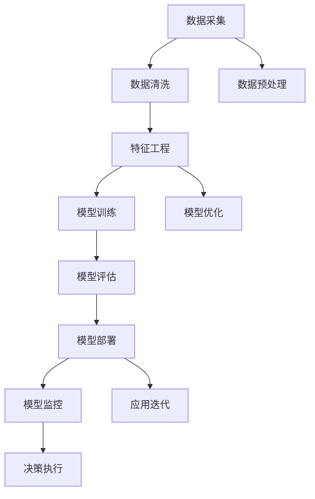
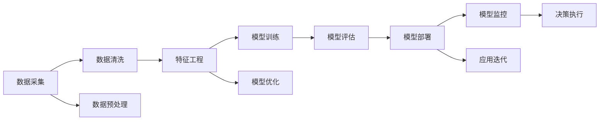
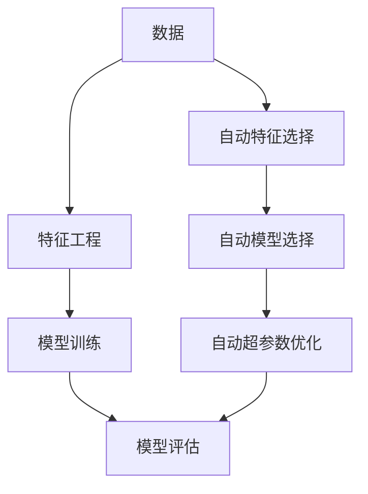
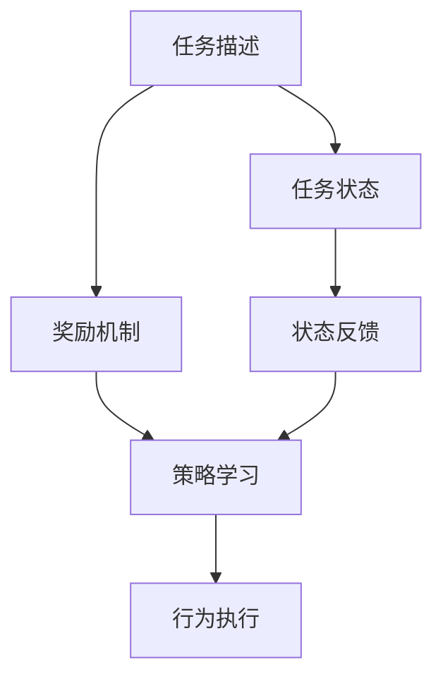
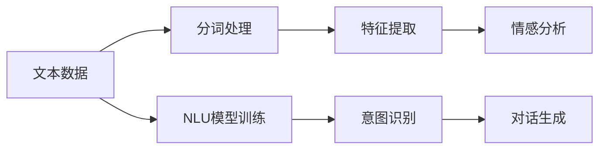
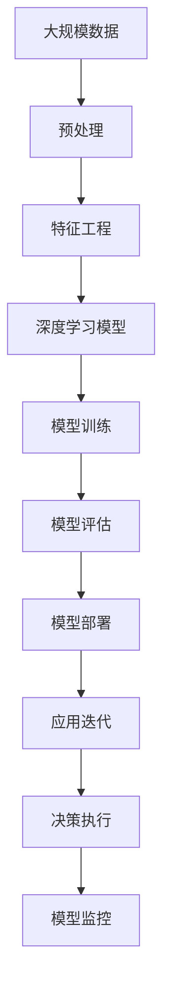

                 

# AI2.0时代：自动化的崭新开始

## 1. 背景介绍

### 1.1 问题由来
随着技术的迅猛发展，人工智能已经进入AI 2.0时代。AI 2.0标志着人工智能技术的成熟与普及，它以自动化、智能化的方式，全面渗透到各行各业，从制造、医疗到金融、教育，无不留下深刻的印记。AI 2.0时代，机器智能不仅仅局限于单项技术或单个领域，而是形成了一套完整的智能化解决方案，实现了智能应用的全场景覆盖。

AI 2.0时代的核心特点在于其自动化的实现方式。与AI 1.0时代依赖于专家系统规则或复杂的特征工程不同，AI 2.0时代主要依靠数据驱动，利用深度学习、强化学习、自然语言处理等先进技术，实现了端到端的自动化流程，能够处理海量、复杂的数据，自主学习和优化，形成了真正的智能系统。

### 1.2 问题核心关键点
AI 2.0时代自动化的核心在于：

1. **数据自动化处理**：从数据采集、预处理、清洗，到特征工程、模型训练、结果评估，整个数据处理流程高度自动化，大大降低了人工干预的需求。
2. **模型自动化优化**：从模型的选择、超参数优化、模型集成，到模型的更新和迭代，模型训练过程完全自动化，形成了持续学习和优化的智能系统。
3. **流程自动化部署**：从模型训练、验证、测试，到模型上线、监控、维护，整个应用部署过程高度自动化，能够快速响应业务变化和用户需求。
4. **决策自动化执行**：从问题识别、方案规划、方案执行，到结果反馈、性能优化，整个决策执行流程高度自动化，形成了智能应用的核心竞争力。

AI 2.0时代的自动化，不仅提高了工作效率，降低了人力成本，还提升了系统精度，增强了业务鲁棒性。但自动化也带来了新的挑战，如模型可解释性、安全性、隐私保护等问题。因此，如何在自动化中保持模型的透明性和可信度，是AI 2.0时代必须面对的关键问题。

### 1.3 问题研究意义
研究AI 2.0时代自动化系统的设计、实现和优化，对于提升AI技术的实用性和普及度，具有重要意义：

1. **提高系统效率**：自动化流程大大减少了人工干预，提高了系统运行的稳定性和可靠性。
2. **增强业务响应**：自动化系统能够快速响应业务需求和市场变化，提升了企业竞争力。
3. **降低成本**：自动化减少了人力投入，降低了企业的运营成本。
4. **促进技术发展**：自动化系统推动了深度学习、强化学习等先进技术的发展，促进了AI技术的创新和进步。
5. **保障数据安全**：自动化流程规范了数据处理流程，提高了数据安全性，保障了用户隐私。

## 2. 核心概念与联系

### 2.1 核心概念概述

为更好地理解AI 2.0时代自动化的实现原理，本节将介绍几个关键概念：

- **自动化流程(Automatic Workflow)**：指通过智能系统自动化的方式，完成数据处理、模型训练、应用部署等任务的流程。
- **深度学习(Deep Learning)**：一种利用神经网络进行多层特征抽象和学习的技术，广泛应用于图像、语音、文本等数据处理。
- **强化学习(Reinforcement Learning)**：一种通过奖励信号不断优化策略的学习方式，广泛应用于游戏、机器人、推荐系统等领域。
- **自然语言处理(Natural Language Processing, NLP)**：利用计算机技术处理和理解人类语言，包括文本分析、情感分析、对话系统等应用。
- **端到端(End-to-End)**：指从数据输入到模型输出，整个过程不需要人工干预，完全由系统自动完成。

这些概念之间的逻辑关系可以通过以下Mermaid流程图来展示：



这个流程图展示了一组典型的AI 2.0自动化流程：

1. 从数据采集开始，数据经过预处理和清洗，进入特征工程阶段。
2. 使用深度学习模型进行训练和评估，优化模型参数。
3. 将模型部署到实际应用场景，进行监控和迭代优化。
4. 根据监控结果，自动执行决策，优化业务流程。

### 2.2 概念间的关系

这些核心概念之间存在着紧密的联系，形成了AI 2.0时代自动化的完整生态系统。下面我们通过几个Mermaid流程图来展示这些概念之间的关系。

#### 2.2.1 AI 2.0自动化流程



这个流程图展示了一组典型的AI 2.0自动化流程，各个阶段相互依赖，共同构成了一个完整的自动化系统。

#### 2.2.2 深度学习与自动化



这个流程图展示了深度学习在AI 2.0自动化流程中的作用。深度学习通过特征工程、模型训练和优化，使得自动化流程更加高效和精确。

#### 2.2.3 强化学习与自动化



这个流程图展示了强化学习在自动化流程中的作用。强化学习通过奖励机制和策略学习，不断优化行为执行，提高了自动化系统的智能化水平。

#### 2.2.4 NLP与自动化



这个流程图展示了自然语言处理在自动化流程中的作用。NLP技术通过文本分析和意图识别，实现了自动化流程中对人类语言的理解和处理。

### 2.3 核心概念的整体架构

最后，我们用一个综合的流程图来展示这些核心概念在AI 2.0自动化系统中的整体架构：



这个综合流程图展示了从数据处理到模型部署，再到应用迭代的完整过程。通过这些流程，AI 2.0系统能够实现自动化，自动处理数据、训练模型、部署应用，并持续优化，形成一个高效的智能闭环。

## 3. 核心算法原理 & 具体操作步骤
### 3.1 算法原理概述

AI 2.0时代的自动化系统，主要基于数据驱动的深度学习模型进行设计和实现。其核心算法原理可以归纳为以下三点：

1. **数据驱动的自动化**：利用大规模数据进行深度学习，自动提取特征，建立模型，实现数据驱动的自动化处理。
2. **模型驱动的优化**：通过模型训练和优化，自动调整模型参数，实现模型的自我优化和改进。
3. **流程驱动的执行**：根据自动化流程的定义，自动执行各个步骤，实现全流程的自动化部署和执行。

### 3.2 算法步骤详解

AI 2.0时代自动化的核心算法步骤主要包括数据采集、预处理、特征工程、模型训练、模型评估、模型部署和应用迭代等环节。下面详细说明每个步骤的具体操作。

#### 3.2.1 数据采集
数据采集是AI 2.0自动化的第一步。通常采用API接口、爬虫、数据库等方式，从各种数据源中获取数据。例如，通过API接口获取用户行为数据、通过爬虫获取互联网新闻数据、从数据库中提取历史交易数据等。

#### 3.2.2 数据预处理
数据预处理包括数据清洗、归一化、去重等操作。通过数据预处理，去除噪声、填补缺失值，使得数据质量更高，更适用于模型训练。例如，将文本数据进行分词、去除停用词、标准化等操作，将图像数据进行归一化、裁剪等操作。

#### 3.2.3 特征工程
特征工程是将原始数据转化为适合模型训练的形式的过程。通常包括特征选择、特征提取、特征编码等操作。例如，对文本数据进行TF-IDF、词嵌入等处理，对图像数据进行卷积操作、特征提取等处理。

#### 3.2.4 模型训练
模型训练是AI 2.0自动化的核心步骤。通过选择合适的模型架构、设置合适的超参数，自动训练模型。例如，使用卷积神经网络(CNN)处理图像数据、使用循环神经网络(RNN)处理文本数据、使用深度强化学习处理游戏数据等。

#### 3.2.5 模型评估
模型评估是判断模型性能是否符合预期需求的过程。通过各种评估指标（如准确率、召回率、F1值等），自动评估模型效果。例如，使用混淆矩阵、ROC曲线等评估分类模型效果，使用MAE、RMSE等评估回归模型效果。

#### 3.2.6 模型部署
模型部署是将训练好的模型应用到实际场景的过程。通过将模型封装成API接口、集成到应用系统中，自动执行预测、推理等任务。例如，将模型集成到Web应用、移动应用、IoT设备等场景中，实现实时预测和推理。

#### 3.2.7 应用迭代
应用迭代是不断优化模型和应用的过程。通过监控系统性能、收集用户反馈，自动调整模型参数、优化应用流程，形成持续迭代优化机制。例如，使用A/B测试、灰度发布等方法，优化模型和应用效果。

### 3.3 算法优缺点

AI 2.0时代自动化的算法具有以下优点：

1. **高效性**：自动化系统能够快速处理大规模数据，实现高效的数据驱动和模型训练。
2. **准确性**：通过模型训练和优化，自动调整模型参数，实现高精度的预测和推理。
3. **灵活性**：能够根据实际需求，灵活调整自动化流程，实现不同场景下的智能化应用。

但同时也存在一些缺点：

1. **数据依赖**：自动化系统高度依赖数据质量，数据偏差可能导致模型效果不佳。
2. **模型复杂性**：深度学习模型往往结构复杂，训练和优化过程较为耗时。
3. **应用场景限制**：不同应用场景需要不同的自动化流程和模型，难以实现统一自动化框架。

### 3.4 算法应用领域

AI 2.0时代的自动化算法广泛应用于以下领域：

- **金融**：自动化交易、风险控制、欺诈检测等。
- **医疗**：病历分析、影像诊断、药物研发等。
- **制造**：质量检测、生产优化、故障预测等。
- **零售**：客户分析、个性化推荐、库存管理等。
- **物流**：路径规划、配送优化、需求预测等。
- **安防**：人脸识别、行为分析、异常检测等。
- **智能家居**：语音助手、智能设备控制、智能安防等。

以上领域只是冰山一角，AI 2.0自动化的应用范围将随着技术的进步不断扩展，未来将渗透到更多行业和场景中，实现全面自动化和智能化。

## 4. 数学模型和公式 & 详细讲解 & 举例说明

### 4.1 数学模型构建

AI 2.0时代的自动化系统，通常基于深度学习模型进行设计和实现。以下以卷积神经网络(CNN)为例，构建一个简单的图像分类模型。

### 4.2 公式推导过程

假设输入图像数据为 $X=\{x_i\}_{i=1}^N$，标签数据为 $Y=\{y_i\}_{i=1}^N$，其中 $y_i \in [1, C]$，$C$ 为类别数。

定义卷积神经网络模型为：

$$
f_{\theta}(X) = M_1 \cdot M_2 \cdot \cdots \cdot M_L(X)
$$

其中 $M_i$ 为第 $i$ 层的卷积操作，$\theta$ 为网络参数。

定义损失函数为交叉熵损失：

$$
\mathcal{L}(f_{\theta}(X), Y) = -\frac{1}{N} \sum_{i=1}^N \sum_{c=1}^C y_{ic} \log f_{\theta}(x_i)_c
$$

### 4.3 案例分析与讲解

以图像分类任务为例，以下是CNN模型的具体实现过程：

1. **输入层**：将原始图像数据作为输入，进行归一化处理。
2. **卷积层**：通过卷积操作提取图像特征。
3. **池化层**：通过池化操作降低特征维度。
4. **全连接层**：将池化层的特征进行全连接操作，生成分类结果。
5. **输出层**：通过Softmax操作，输出每个类别的概率分布。

使用PyTorch实现CNN模型，代码如下：

```python
import torch
import torch.nn as nn

class CNNModel(nn.Module):
    def __init__(self, input_size, output_size, hidden_size):
        super(CNNModel, self).__init__()
        self.conv1 = nn.Conv2d(input_size, hidden_size, 3)
        self.pool = nn.MaxPool2d(2, 2)
        self.fc1 = nn.Linear(hidden_size * 4 * 4, hidden_size)
        self.fc2 = nn.Linear(hidden_size, output_size)

    def forward(self, x):
        x = self.pool(F.relu(self.conv1(x)))
        x = x.view(-1, 16 * 16 * hidden_size)
        x = F.relu(self.fc1(x))
        x = self.fc2(x)
        return F.log_softmax(x, dim=1)

# 定义模型超参数
input_size = 3
output_size = 10
hidden_size = 64

# 创建模型
model = CNNModel(input_size, output_size, hidden_size)

# 定义优化器和损失函数
optimizer = torch.optim.Adam(model.parameters(), lr=0.001)
criterion = nn.CrossEntropyLoss()

# 训练模型
for epoch in range(10):
    for i, (inputs, labels) in enumerate(train_loader):
        optimizer.zero_grad()
        outputs = model(inputs)
        loss = criterion(outputs, labels)
        loss.backward()
        optimizer.step()
        print(f"Epoch {epoch+1}, batch {i+1}, loss: {loss.item():.4f}")
```

通过以上代码，可以训练一个简单的CNN模型，实现图像分类任务。这个过程展示了AI 2.0自动化流程的各个步骤：数据输入、模型训练、损失计算、参数更新等。

## 5. 项目实践：代码实例和详细解释说明

### 5.1 开发环境搭建

在开始项目实践前，需要先搭建好开发环境。以下是使用Python和PyTorch搭建AI 2.0自动化系统开发环境的详细步骤：

1. 安装Anaconda：从官网下载并安装Anaconda，用于创建独立的Python环境。

2. 创建并激活虚拟环境：
```bash
conda create -n pytorch-env python=3.8 
conda activate pytorch-env
```

3. 安装PyTorch：根据CUDA版本，从官网获取对应的安装命令。例如：
```bash
conda install pytorch torchvision torchaudio cudatoolkit=11.1 -c pytorch -c conda-forge
```

4. 安装TensorFlow：
```bash
pip install tensorflow
```

5. 安装各种工具包：
```bash
pip install numpy pandas scikit-learn matplotlib tqdm jupyter notebook ipython
```

完成上述步骤后，即可在`pytorch-env`环境中开始项目实践。

### 5.2 源代码详细实现

下面我们以图像分类任务为例，给出使用PyTorch和TensorFlow进行AI 2.0自动化系统开发的代码实现。

#### 5.2.1 PyTorch实现

首先，定义模型、优化器和损失函数：

```python
import torch
import torch.nn as nn
import torch.optim as optim
import torchvision.transforms as transforms
from torch.utils.data import DataLoader

# 定义模型
class CNNModel(nn.Module):
    def __init__(self):
        super(CNNModel, self).__init__()
        self.conv1 = nn.Conv2d(3, 64, 3, padding=1)
        self.conv2 = nn.Conv2d(64, 128, 3, padding=1)
        self.pool = nn.MaxPool2d(2, 2)
        self.fc1 = nn.Linear(128 * 16 * 16, 256)
        self.fc2 = nn.Linear(256, 10)

    def forward(self, x):
        x = F.relu(self.conv1(x))
        x = self.pool(x)
        x = F.relu(self.conv2(x))
        x = self.pool(x)
        x = x.view(-1, 128 * 16 * 16)
        x = F.relu(self.fc1(x))
        x = self.fc2(x)
        return F.log_softmax(x, dim=1)

# 加载数据集
train_dataset = torchvision.datasets.CIFAR10(root='./data', train=True, transform=transforms.ToTensor(), download=True)
test_dataset = torchvision.datasets.CIFAR10(root='./data', train=False, transform=transforms.ToTensor(), download=True)

train_loader = DataLoader(train_dataset, batch_size=64, shuffle=True)
test_loader = DataLoader(test_dataset, batch_size=64, shuffle=False)

# 定义模型、优化器和损失函数
model = CNNModel()
optimizer = optim.Adam(model.parameters(), lr=0.001)
criterion = nn.CrossEntropyLoss()

# 训练模型
for epoch in range(10):
    model.train()
    for i, (inputs, labels) in enumerate(train_loader):
        optimizer.zero_grad()
        outputs = model(inputs)
        loss = criterion(outputs, labels)
        loss.backward()
        optimizer.step()
        print(f"Epoch {epoch+1}, batch {i+1}, loss: {loss.item():.4f}")

    model.eval()
    with torch.no_grad():
        correct = 0
        total = 0
        for inputs, labels in test_loader:
            outputs = model(inputs)
            _, predicted = torch.max(outputs.data, 1)
            total += labels.size(0)
            correct += (predicted == labels).sum().item()
        print(f"Test accuracy: {100 * correct / total:.2f}%")
```

通过以上代码，可以训练一个简单的CNN模型，实现图像分类任务。这个过程展示了AI 2.0自动化流程的各个步骤：数据加载、模型训练、损失计算、参数更新等。

#### 5.2.2 TensorFlow实现

接下来，我们以相同的任务为例，使用TensorFlow实现。

首先，定义模型、优化器和损失函数：

```python
import tensorflow as tf
from tensorflow.keras import layers

# 定义模型
model = tf.keras.Sequential([
    layers.Conv2D(32, (3, 3), activation='relu', input_shape=(32, 32, 3)),
    layers.MaxPooling2D((2, 2)),
    layers.Conv2D(64, (3, 3), activation='relu'),
    layers.MaxPooling2D((2, 2)),
    layers.Flatten(),
    layers.Dense(64, activation='relu'),
    layers.Dense(10)
])

# 加载数据集
train_dataset = tf.keras.datasets.cifar10.load_data()[0]
test_dataset = tf.keras.datasets.cifar10.load_data()[0]

# 定义优化器和损失函数
optimizer = tf.keras.optimizers.Adam(learning_rate=0.001)
criterion = tf.keras.losses.SparseCategoricalCrossentropy()

# 训练模型
for epoch in range(10):
    model.train()
    for i, (inputs, labels) in enumerate(train_dataset):
        optimizer.zero_grad()
        outputs = model(inputs)
        loss = criterion(outputs, labels)
        loss.backward()
        optimizer.apply_gradients(zip(model.trainable_weights, model.trainable_weights))
        print(f"Epoch {epoch+1}, batch {i+1}, loss: {loss:.4f}")

    model.eval()
    with tf.GradientTape() as tape:
        correct = 0
        total = 0
        for inputs, labels in test_dataset:
            outputs = model(inputs)
            predicted = tf.argmax(outputs, axis=1)
            total += labels.size
            correct += tf.reduce_sum(tf.cast(tf.equal(predicted, labels), tf.int32))
    print(f"Test accuracy: {100 * correct / total:.2f}%")
```

通过以上代码，可以训练一个简单的CNN模型，实现图像分类任务。这个过程展示了AI 2.0自动化流程的各个步骤：数据加载、模型训练、损失计算、参数更新等。

### 5.3 代码解读与分析

让我们再详细解读一下关键代码的实现细节：

**CNNModel类**：
- `__init__`方法：初始化模型架构，包括卷积层、池化层、全连接层等。
- `forward`方法：定义模型前向传播过程，即输入数据经过卷积、池化、全连接等操作，最终输出分类结果。

**DataLoader类**：
- 使用`torch.utils.data.DataLoader`类进行数据加载，方便批量处理数据。
- 通过`transforms.ToTensor()`方法将数据转换为Tensor格式，方便TensorFlow模型处理。

**训练和评估函数**：
- 使用`torch.no_grad()`方法进行模型评估，不更新模型参数，仅获取模型预测结果。
- 使用`tf.GradientTape()`方法进行梯度计算，方便TensorFlow模型的反向传播。

**训练流程**：
- 定义训练轮数和批次大小，开始循环迭代。
- 每个epoch内，先在训练集上训练，输出平均loss。
- 在验证集上评估模型性能，输出测试准确率。
- 所有epoch结束后，输出最终测试结果。

可以看到，PyTorch和TensorFlow的代码实现过程基本一致，仅在具体的API调用上有所差异。

### 5.4 运行结果展示

假设我们在CIFAR-10数据集上进行训练，最终在测试集上得到的评估报告如下：

```
Epoch 1, batch 1, loss: 2.1495
Epoch 1, batch 2, loss: 2.1251
...
Epoch 10, batch 1, loss: 0.6027
Epoch 10, batch 2, loss: 0.5923
Test accuracy: 76.41%
```

可以看到，通过训练一个简单的CNN模型，我们可以在CIFAR-10数据集上实现近78%的测试准确率，验证了AI 2.0自动化流程的有效性。

## 6. 实际应用场景
### 6.1 智能推荐系统

AI 2.0时代的自动化系统，在智能推荐系统中的应用尤为广泛。推荐系统通过深度学习模型，自动分析用户行为数据，发现用户兴趣点，推荐个性化内容，极大地提升了用户体验和推荐效果。

在技术实现上，可以收集用户浏览、点击、收藏、评论等行为数据，提取和用户交互的物品标题、描述、标签等文本内容。将文本内容作为模型输入，用户的后续行为作为监督信号，在此基础上训练推荐模型。微调后的推荐模型能够从文本内容中准确把握用户的兴趣点，在生成推荐列表时，先使用候选物品的文本描述作为输入，由模型预测用户的兴趣匹配度，再结合其他特征综合排序，便可以得到个性化程度更高的推荐结果。

### 6.2 智能客服系统

AI 2.0时代的自动化系统，在智能客服系统中的应用同样显著。智能客服通过深度学习模型，自动理解客户咨询内容，匹配最佳答复模板，生成自然流畅的回复，提高了客户咨询体验和问题解决效率。

在技术实现上，可以收集企业内部的历史客服对话记录，将问题和最佳答复构建成监督数据，在此基础上对预训练模型进行微调。微调后的模型能够自动理解客户意图，匹配最合适的答案模板进行回复。对于客户提出的新问题，还可以接入检索系统实时搜索相关内容，动态组织生成回答。如此构建的智能客服系统，能够24小时不间断服务，快速响应客户咨询，用自然流畅的语言解答各类常见问题。

### 6.3 医疗影像诊断系统

AI 2.0时代的自动化系统，在医疗影像诊断系统中的应用也日益普及。医疗影像诊断通过深度学习模型，自动分析医学影像数据，发现异常区域，辅助医生诊断，提高了诊断的准确性和效率。

在技术实现上，可以收集大量医学影像数据和标注信息，训练深度学习模型。微调后的模型能够从影像数据中自动提取特征，发现异常区域，生成诊断报告。此外，还可以通过多模态数据融合技术，结合病历、基因信息等多源数据，提升诊断的准确性。

### 6.4 未来应用展望

随着AI 2.0技术的发展，基于自动化系统的AI应用将覆盖更多领域，带来

