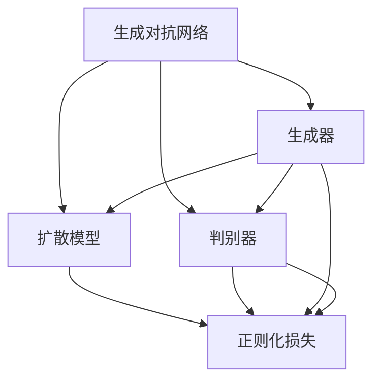
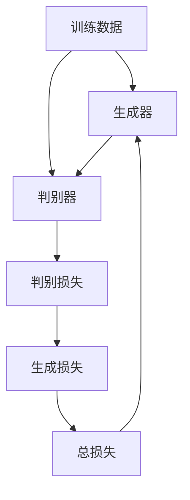
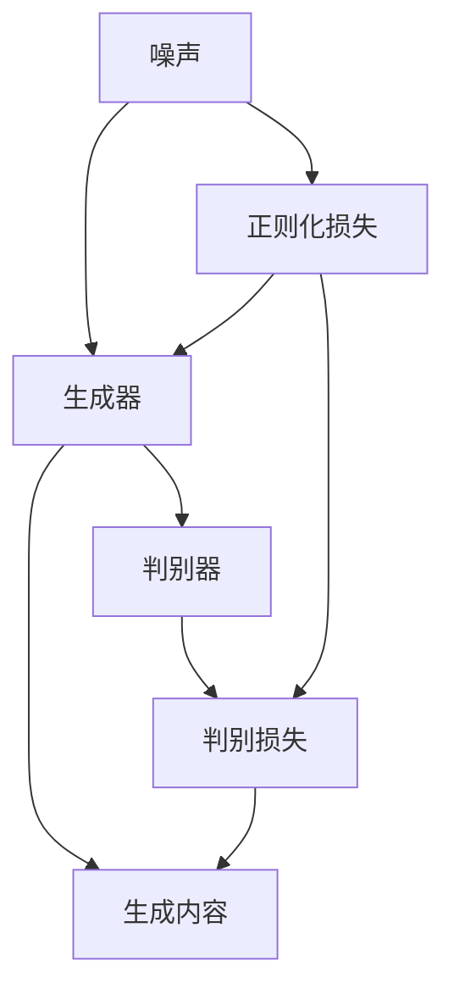
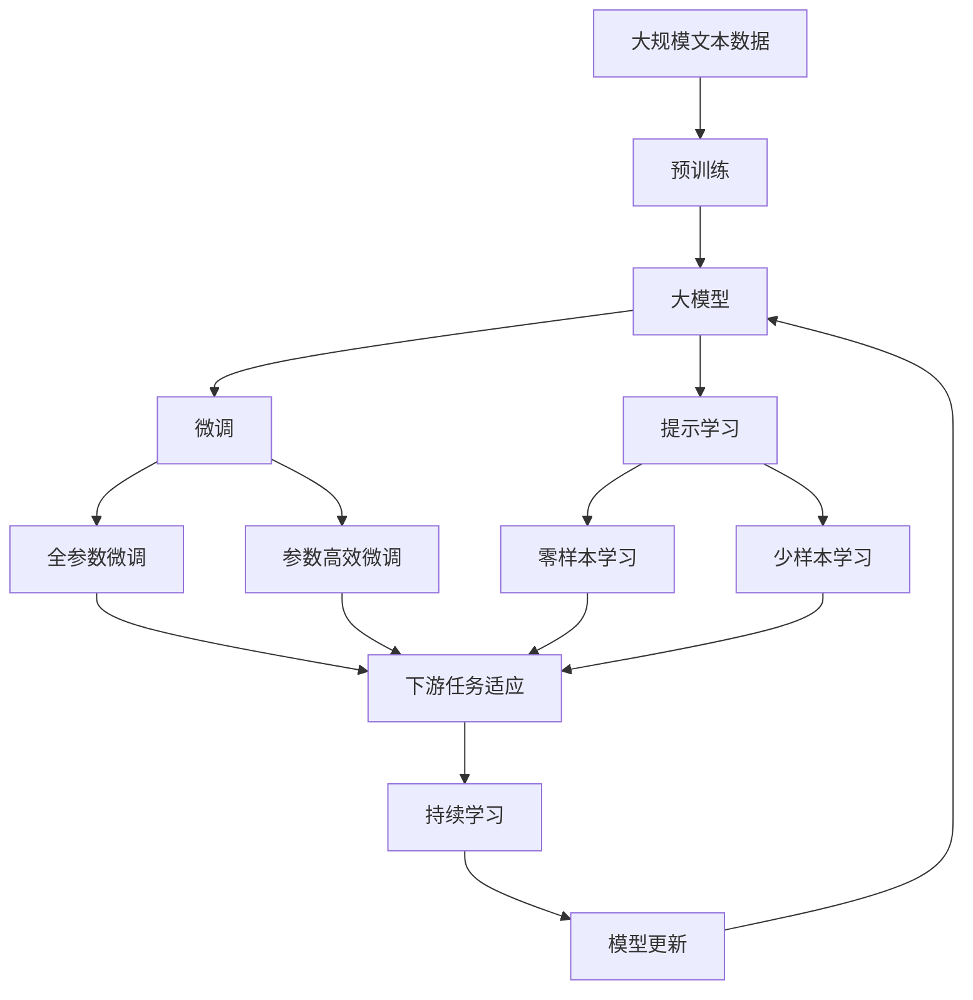

                 

# AIGC 原理与代码实例讲解

> 关键词：AIGC, 生成对抗网络, GAN, 扩散模型, DDIM, 代码生成, 图像生成, 语音生成

## 1. 背景介绍

### 1.1 问题由来
人工智能生成内容（Artificial Intelligence Generated Content, AIGC）是目前人工智能领域中最为热门的话题之一。随着深度学习技术的不断进步，AIGC 已经在图像生成、语音合成、文本生成等多个领域取得了显著成果，并在内容创作、广告营销、教育娱乐等多个场景中得到了广泛应用。生成对抗网络（Generative Adversarial Networks, GAN）作为 AIGC 技术的主流方法，通过训练一个生成器（Generator）和一个判别器（Discriminator）来对立生成内容，已经在图像生成、语音合成等任务上取得了卓越的效果。

然而，由于 GAN 训练过程中存在诸多不稳定因素，如梯度消失、模式崩溃等问题，导致生成的内容质量难以稳定保证，同时也存在计算资源消耗大、模型复杂等问题。近年来，扩散模型（Diffusion Models）逐渐崭露头角，以其更好的训练稳定性和更小的计算资源消耗成为 AIGC 领域的新宠。

本博客将详细讲解 AIGC 技术中的生成对抗网络和扩散模型，并结合代码实例介绍这两种方法的原理与实现细节，帮助读者全面掌握 AIGC 的核心技术，为后续深入探索 AIGC 提供坚实的基础。

### 1.2 问题核心关键点
AIGC 技术的核心在于如何通过深度学习技术生成高质量的内容，常见技术包括生成对抗网络（GAN）、扩散模型（DDIM）、自回归模型（VAE）等。这些技术中，GAN 和 DDIM 是当前最为热门的方法，分别代表了深度生成技术和基于正则化技术的扩散模型。

GAN 的核心思想是训练一个生成器和一个判别器，生成器通过生成与训练数据分布相似的内容来对抗判别器的判定，从而使得生成的内容越来越逼真。然而，GAN 的训练过程不稳定，容易陷入模式崩溃，生成的内容质量难以保证。

扩散模型则通过将噪声逐渐引入内容中，然后通过正则化技术将其扩散到真实内容的分布中，从而生成高质量的内容。扩散模型的训练过程相对稳定，生成的内容质量更高，但需要更大的计算资源。

此外，AIGC 技术还可以与其他深度学习技术结合，如自回归模型、注意力机制等，以提升内容的生成效果。

## 2. 核心概念与联系

### 2.1 核心概念概述

为更好地理解 AIGC 技术的核心概念，本节将介绍几个密切相关的核心概念：

- 生成对抗网络（GAN）：一种深度学习模型，通过训练一个生成器（Generator）和一个判别器（Discriminator），对立生成内容，使得生成的内容越来越逼真。

- 扩散模型（Diffusion Models）：一种基于正则化技术的生成模型，通过将噪声逐渐引入内容中，然后通过正则化技术将其扩散到真实内容的分布中，从而生成高质量的内容。

- 生成器（Generator）：GAN 和 DDIM 中用于生成内容的模型。生成器接收随机噪声作为输入，输出生成内容。

- 判别器（Discriminator）：GAN 中用于判别生成的内容是否真实。判别器接收生成器和真实内容作为输入，输出判别结果。

- 生成损失（Generator Loss）：GAN 中用于衡量生成器生成的内容质量。

- 判别损失（Discriminator Loss）：GAN 中用于衡量判别器对生成内容的判别能力。

- 正则化损失（Regularization Loss）：DDIM 中用于确保生成内容的稳定性。

这些核心概念之间的逻辑关系可以通过以下 Mermaid 流程图来展示：



这个流程图展示了 AIGC 技术中的几种主要模型及其之间的关系：

1. GAN 由生成器和判别器组成，生成器生成内容，判别器判别生成的内容。
2. DDIM 基于正则化技术，生成器接收噪声，判别器评估生成内容的真实性。
3. DDIM 在生成过程中，正则化损失保证生成的内容稳定，判别器损失和生成损失保证生成的内容逼真。

### 2.2 概念间的关系

这些核心概念之间存在着紧密的联系，形成了 AIGC 技术的完整生态系统。下面我们通过几个 Mermaid 流程图来展示这些概念之间的关系。

#### 2.2.1 GAN 的基本原理



这个流程图展示了 GAN 的基本训练流程。首先，从训练数据中抽取样本，生成器接收噪声，生成内容。判别器接收生成内容和真实内容，输出判别结果。判别损失衡量判别器对生成内容的判别能力，生成损失衡量生成器生成的内容质量，总损失是判别损失和生成损失的加权和。通过优化总损失，生成器生成的内容越来越逼真。

#### 2.2.2 DDIM 的基本原理



这个流程图展示了 DDIM 的基本训练流程。首先，生成器接收噪声，生成内容。判别器接收生成内容和真实内容，输出判别结果。正则化损失保证生成内容的稳定性，判别损失衡量判别器对生成内容的判别能力。生成内容通过正则化技术逐渐扩散到真实内容的分布中，从而生成高质量的内容。

### 2.3 核心概念的整体架构

最后，我们用一个综合的流程图来展示这些核心概念在大模型微调过程中的整体架构：



这个综合流程图展示了从预训练到微调，再到持续学习的完整过程。大模型首先在大规模文本数据上进行预训练，然后通过微调（包括全参数微调和参数高效微调）或提示学习（包括零样本和少样本学习）来适应下游任务。最后，通过持续学习技术，模型可以不断学习新知识，同时避免遗忘旧知识。

## 3. 核心算法原理 & 具体操作步骤

### 3.1 算法原理概述

生成对抗网络（GAN）和扩散模型（DDIM）是当前 AIGC 技术中最为主流的方法。下面将详细介绍这两种方法的原理与具体操作步骤。

#### 3.1.1 GAN 原理概述

GAN 的核心思想是训练一个生成器和一个判别器，通过二者之间的对抗生成高质量的内容。GAN 的训练过程可以总结如下：

1. 生成器接收随机噪声 $z$，生成内容 $G(z)$。
2. 判别器接收内容 $x$，输出判别结果 $D(x)$。
3. 判别器接收生成器生成的内容 $G(z)$，输出判别结果 $D(G(z))$。
4. 生成器的损失函数为：
   $$
   \mathcal{L}_G = \mathbb{E}_{z \sim p(z)}[\log(1 - D(G(z)))] + \mathbb{E}_{x \sim p(x)}[\log(D(x))]
   $$
   其中 $p(z)$ 和 $p(x)$ 分别为噪声分布和真实数据分布。
5. 判别器的损失函数为：
   $$
   \mathcal{L}_D = \mathbb{E}_{x \sim p(x)}[\log(D(x))] + \mathbb{E}_{z \sim p(z)}[\log(1 - D(G(z)))]
   $$
6. 总损失函数为：
   $$
   \mathcal{L} = \mathcal{L}_G + \lambda \mathcal{L}_D
   $$
   其中 $\lambda$ 为生成损失和判别损失的权重。

#### 3.1.2 DDIM 原理概述

DDIM 是一种基于正则化技术的生成模型，通过将噪声逐渐引入内容中，然后通过正则化技术将其扩散到真实内容的分布中，从而生成高质量的内容。DDIM 的训练过程可以总结如下：

1. 生成器接收噪声 $z$，生成内容 $G(z)$。
2. 判别器接收内容 $x$，输出判别结果 $D(x)$。
3. 判别器接收生成器生成的内容 $G(z)$，输出判别结果 $D(G(z))$。
4. 生成器的损失函数为：
   $$
   \mathcal{L}_G = \mathbb{E}_{z \sim p(z)}[\log(1 - D(G(z)))] + \mathbb{E}_{x \sim p(x)}[\log(D(x))]
   $$
   其中 $p(z)$ 和 $p(x)$ 分别为噪声分布和真实数据分布。
5. 判别器的损失函数为：
   $$
   \mathcal{L}_D = \mathbb{E}_{x \sim p(x)}[\log(D(x))] + \mathbb{E}_{z \sim p(z)}[\log(1 - D(G(z)))]
   $$
6. 正则化损失函数为：
   $$
   \mathcal{L}_{reg} = \mathbb{E}_{z \sim p(z)}[(G(z) - x)^2]
   $$
   其中 $G(z)$ 为生成器生成的内容，$x$ 为真实内容。
7. 总损失函数为：
   $$
   \mathcal{L} = \mathcal{L}_G + \alpha \mathcal{L}_D + \beta \mathcal{L}_{reg}
   $$
   其中 $\alpha$ 和 $\beta$ 分别为生成损失、判别损失和正则化损失的权重。

### 3.2 算法步骤详解

下面详细介绍 GAN 和 DDIM 的具体操作步骤，包括模型的选择、超参数设置、损失函数设计、优化器选择等关键步骤。

#### 3.2.1 GAN 操作步骤

1. **选择模型**：选择合适的生成器（如 DCGAN、WGAN）和判别器（如 LeakyReLU、Sigmoid）。
2. **超参数设置**：设置生成器和学习率等超参数。
3. **损失函数设计**：设计生成器损失函数和判别器损失函数。
4. **优化器选择**：选择优化器（如 Adam、RMSprop）。
5. **训练流程**：通过交替优化生成器和判别器，最小化总损失函数。

#### 3.2.2 DDIM 操作步骤

1. **选择模型**：选择合适的扩散模型和判别器（如 UNet、PatchGAN）。
2. **超参数设置**：设置噪声分布、正则化强度等超参数。
3. **损失函数设计**：设计生成器损失函数、判别器损失函数和正则化损失函数。
4. **优化器选择**：选择优化器（如 Adam、RMSprop）。
5. **训练流程**：通过交替优化生成器和判别器，最小化总损失函数。

### 3.3 算法优缺点

#### 3.3.1 GAN 优缺点

GAN 的优点在于生成的内容质量高，能够逼真地复制真实数据。同时，GAN 的结构简单，易于实现。

GAN 的缺点在于训练过程不稳定，容易陷入模式崩溃，生成的内容质量难以保证。此外，GAN 的计算资源消耗大，训练过程复杂。

#### 3.3.2 DDIM 优缺点

DDIM 的优点在于生成的内容质量高，能够逼真地复制真实数据。同时，DDIM 的训练过程稳定，生成的内容质量高。

DDIM 的缺点在于计算资源消耗大，训练过程复杂。此外，DDIM 的生成器参数多，模型复杂。

### 3.4 算法应用领域

GAN 和 DDIM 已经在图像生成、语音合成、文本生成等多个领域得到了广泛应用。以下是几种常见的应用场景：

- **图像生成**：GAN 和 DDIM 可以用于生成高分辨率、逼真的图像，如人像、风景等。
- **语音合成**：GAN 和 DDIM 可以用于生成逼真的语音，如语音助手、虚拟主播等。
- **文本生成**：GAN 和 DDIM 可以用于生成自然流畅的文本，如文章、对话等。
- **视频生成**：GAN 和 DDIM 可以用于生成逼真的视频，如动画、电影等。

## 4. 数学模型和公式 & 详细讲解 & 举例说明

### 4.1 数学模型构建

#### 4.1.1 GAN 数学模型

GAN 的数学模型可以表示为：

$$
G: z \sim p(z) \rightarrow x \sim p(x|G(z))
$$
$$
D: x \sim p(x) \rightarrow \hat{y} \in [0,1]
$$

其中，$z$ 为随机噪声，$x$ 为真实数据，$\hat{y}$ 为判别器输出。

#### 4.1.2 DDIM 数学模型

DDIM 的数学模型可以表示为：

$$
G: z \sim p(z) \rightarrow x \sim p(x|G(z))
$$
$$
D: x \sim p(x) \rightarrow \hat{y} \in [0,1]
$$

其中，$z$ 为随机噪声，$x$ 为真实数据，$\hat{y}$ 为判别器输出。

### 4.2 公式推导过程

#### 4.2.1 GAN 公式推导

GAN 的生成器接收随机噪声 $z$，生成内容 $x$。判别器接收内容 $x$，输出判别结果 $\hat{y}$。生成器的损失函数为：

$$
\mathcal{L}_G = \mathbb{E}_{z \sim p(z)}[\log(1 - D(G(z)))] + \mathbb{E}_{x \sim p(x)}[\log(D(x))]
$$

判别器的损失函数为：

$$
\mathcal{L}_D = \mathbb{E}_{x \sim p(x)}[\log(D(x))] + \mathbb{E}_{z \sim p(z)}[\log(1 - D(G(z)))]
$$

总损失函数为：

$$
\mathcal{L} = \mathcal{L}_G + \lambda \mathcal{L}_D
$$

#### 4.2.2 DDIM 公式推导

DDIM 的生成器接收随机噪声 $z$，生成内容 $x$。判别器接收内容 $x$，输出判别结果 $\hat{y}$。生成器的损失函数为：

$$
\mathcal{L}_G = \mathbb{E}_{z \sim p(z)}[\log(1 - D(G(z)))] + \mathbb{E}_{x \sim p(x)}[\log(D(x))]
$$

判别器的损失函数为：

$$
\mathcal{L}_D = \mathbb{E}_{x \sim p(x)}[\log(D(x))] + \mathbb{E}_{z \sim p(z)}[\log(1 - D(G(z)))]
$$

正则化损失函数为：

$$
\mathcal{L}_{reg} = \mathbb{E}_{z \sim p(z)}[(G(z) - x)^2]
$$

总损失函数为：

$$
\mathcal{L} = \mathcal{L}_G + \alpha \mathcal{L}_D + \beta \mathcal{L}_{reg}
$$

### 4.3 案例分析与讲解

#### 4.3.1 GAN 案例分析

下面以 DCGAN 为例，介绍 GAN 的实际应用。

假设我们有一个 MNIST 手写数字数据集，希望通过 GAN 生成逼真的手写数字图像。首先，我们定义生成器和判别器的架构：

- 生成器：使用 3 层卷积神经网络（CNN），每一层包含多个卷积核和激活函数。
- 判别器：使用 3 层卷积神经网络，每一层包含多个卷积核和激活函数。

接着，我们定义生成器和判别器的损失函数：

- 生成器的损失函数为：
  $$
  \mathcal{L}_G = \mathbb{E}_{z \sim p(z)}[\log(1 - D(G(z)))] + \mathbb{E}_{x \sim p(x)}[\log(D(x))]
  $$
- 判别器的损失函数为：
  $$
  \mathcal{L}_D = \mathbb{E}_{x \sim p(x)}[\log(D(x))] + \mathbb{E}_{z \sim p(z)}[\log(1 - D(G(z)))]
  $$

最后，我们通过交替优化生成器和判别器，最小化总损失函数：

1. 生成器生成内容 $G(z)$。
2. 判别器接收内容 $G(z)$，输出判别结果 $D(G(z))$。
3. 生成器接收判别器的反馈，更新生成器参数。
4. 判别器接收内容 $G(z)$ 和真实内容 $x$，输出判别结果 $D(G(z))$ 和 $D(x)$。
5. 判别器接收生成器的反馈，更新判别器参数。

#### 4.3.2 DDIM 案例分析

下面以 UNet 为例，介绍 DDIM 的实际应用。

假设我们有一个CelebA人脸数据集，希望通过 DDIM 生成逼真的人脸图像。首先，我们定义扩散模型和判别器的架构：

- 扩散模型：使用 UNet 架构，包含多个卷积核和激活函数。
- 判别器：使用 PatchGAN 架构，包含多个卷积核和激活函数。

接着，我们定义扩散模型和判别器的损失函数：

- 生成器的损失函数为：
  $$
  \mathcal{L}_G = \mathbb{E}_{z \sim p(z)}[\log(1 - D(G(z)))] + \mathbb{E}_{x \sim p(x)}[\log(D(x))]
  $$
- 判别器的损失函数为：
  $$
  \mathcal{L}_D = \mathbb{E}_{x \sim p(x)}[\log(D(x))] + \mathbb{E}_{z \sim p(z)}[\log(1 - D(G(z)))]
  $$
- 正则化损失函数为：
  $$
  \mathcal{L}_{reg} = \mathbb{E}_{z \sim p(z)}[(G(z) - x)^2]
  $$

最后，我们通过交替优化生成器和判别器，最小化总损失函数：

1. 扩散模型接收噪声 $z$，生成内容 $G(z)$。
2. 判别器接收内容 $G(z)$，输出判别结果 $D(G(z))$。
3. 扩散模型接收判别器的反馈，更新扩散模型参数。
4. 判别器接收内容 $G(z)$ 和真实内容 $x$，输出判别结果 $D(G(z))$ 和 $D(x)$。
5. 判别器接收扩散模型的反馈，更新判别器参数。

## 5. 项目实践：代码实例和详细解释说明

### 5.1 开发环境搭建

在进行 AIGC 实践前，我们需要准备好开发环境。以下是使用Python进行PyTorch开发的环境配置流程：

1. 安装Anaconda：从官网下载并安装Anaconda，用于创建独立的Python环境。

2. 创建并激活虚拟环境：
```bash
conda create -n pytorch-env python=3.8 
conda activate pytorch-env
```

3. 安装PyTorch：根据CUDA版本，从官网获取对应的安装命令。例如：
```bash
conda install pytorch torchvision torchaudio cudatoolkit=11.1 -c pytorch -c conda-forge
```

4. 安装Transformers库：
```bash
pip install transformers
```

5. 安装各类工具包：
```bash
pip install numpy pandas scikit-learn matplotlib tqdm jupyter notebook ipython
```

完成上述步骤后，即可在`pytorch-env`环境中开始AIGC实践。

### 5.2 源代码详细实现

下面我们以图像生成为例，使用PyTorch和Transformers库对GAN和DDIM进行实际应用。

#### 5.2.1 GAN 代码实现

首先，定义生成器和判别器的架构：

```python
import torch
import torch.nn as nn
import torch.optim as optim
from torchvision import datasets, transforms

class Generator(nn.Module):
    def __init__(self):
        super(Generator, self).__init__()
        self.main = nn.Sequential(
            nn.ConvTranspose2d(100, 256, 4, 1, 0, bias=False),
            nn.BatchNorm2d(256),
            nn.ReLU(True),
            nn.ConvTranspose2d(256, 128, 4, 2, 1, bias=False),
            nn.BatchNorm2d(128),
            nn.ReLU(True),
            nn.ConvTranspose2d(128, 64, 4, 2, 1, bias=False),
            nn.BatchNorm2d(64),
            nn.ReLU(True),
            nn.ConvTranspose2d(64, 3, 4, 2, 1, bias=False),
            nn.Tanh()
        )

    def forward(self, input):
        return self.main(input)

class Discriminator(nn.Module):
    def __init__(self):
        super(Discriminator, self).__init__()
        self.main = nn.Sequential(
            nn.Conv2d(3, 64, 4, 2, 1, bias=False),
            nn.LeakyReLU(0.2, inplace=True),
            nn.Conv2d(64, 128, 4, 2, 1, bias=False),
            nn.LeakyReLU(0.2, inplace=True),
            nn.Conv2d(128, 256, 4, 2, 1, bias=False),
            nn.LeakyReLU(0.2, inplace=True),
            nn.Conv2d(256, 1, 4, 1, 0, bias=False),
            nn.Sigmoid()
        )

    def forward(self, input):
        return self.main(input).view(-1, 1).squeeze(1)
```

然后，定义训练函数：

```python
def train_generator(discriminator, generator, dataloader, optimizer, num_epochs):
    for epoch in range(num_epochs):
        for i, (images, _) in enumerate(dataloader):
            batches_per_sample = images.size(0)
            z = torch.randn(batches_per_sample, 100, 1, 1).to(device)
            fake_images = generator(z).detach()
            real_images = images.to(device)
            d_loss_real = discriminator(real_images).mean()
            d_loss_fake = discriminator(fake_images).mean()
            g_loss = -d_loss_fake
            d_loss = d_loss_real + d_loss_fake
            optimizer_D.zero_grad()
            d_loss.backward()
            optimizer_D.step()
            optimizer_G.zero_grad()
            g_loss.backward()
            optimizer_G.step()
```

最后，启动训练流程：

```python
device = torch.device('cuda' if torch.cuda.is_available() else 'cpu')
dataloader = torch.utils.data.DataLoader(
    datasets.MNIST('../data', train=True, download=True, transform=transforms.ToTensor()),
    batch_size=128,
    shuffle=True,
    num_workers=2
)

discriminator = Discriminator().to(device)
generator = Generator().to(device)
optimizer_D = optim.Adam(discriminator.parameters(), lr=0.0002)
optimizer_G = optim.Adam(generator.parameters(), lr=0.0002)
train_generator(discriminator, generator, dataloader, optimizer_D, optimizer_G, num_epochs=200)
```

#### 5.2.2 DDIM 代码实现

首先，定义扩散模型和判别器的架构：

```python
import torch
import torch.nn as nn
import torch.optim as optim
from torchvision import datasets, transforms

class UNet(nn.Module):
    def __init__(self):
        super(UNet, self).__init__()
        self downsample = nn.ModuleList([
            nn.Conv2d(3, 64, 3, 2, 1),
            nn.LeakyReLU(0.2, inplace=True),
            nn.Conv2d(64, 128, 3, 2, 1),
            nn.LeakyReLU(0.2, inplace=True),
            nn.Conv2d(128, 256, 3, 2, 1),
            nn.LeakyReLU(0.2, inplace=True),
            nn.Conv2d(256, 

