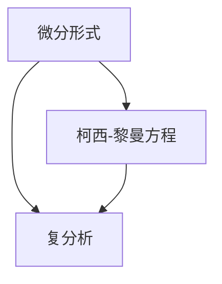
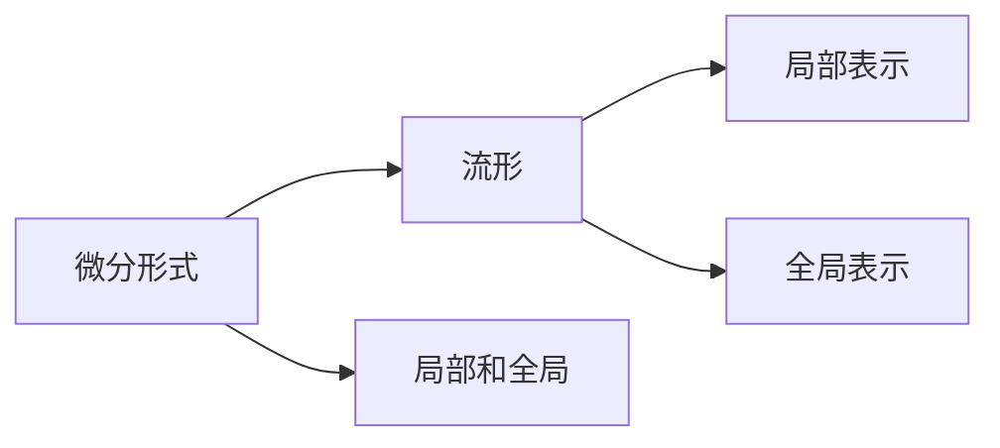
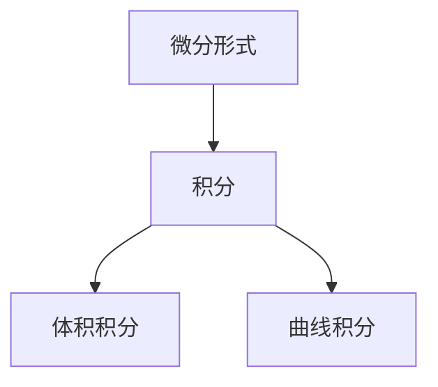
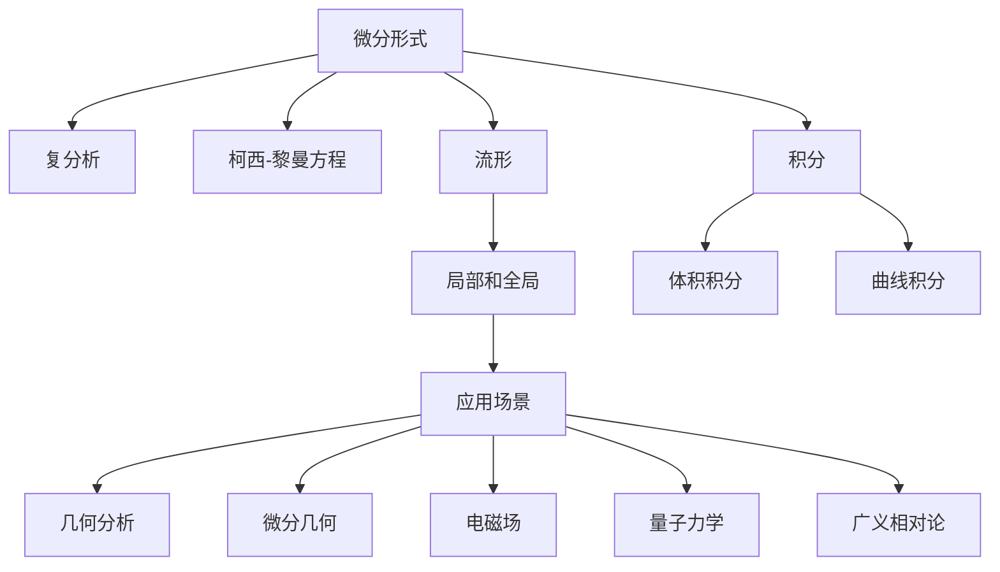

                 

# 代数拓扑中的微分形式应用方法

> 关键词：代数拓扑,微分形式,柯西-黎曼方程,复分析,流形

## 1. 背景介绍

### 1.1 问题由来
代数拓扑学是现代数学中的一个重要分支，研究拓扑空间和其性质。其中微分形式是代数拓扑学的一个重要工具，通过研究函数的微分性质，揭示了拓扑空间的复杂结构和几何特征。微分形式的理论和应用，已经在几何分析、微分几何、复分析等领域得到广泛的应用。

然而，由于微分形式的理论抽象性强，其应用范围和方法也较为复杂。为了更好地理解微分形式的理论，并灵活应用到实际问题中，本文将详细探讨微分形式的理论基础和应用方法。

### 1.2 问题核心关键点
微分形式的理论核心在于利用微分和积分的工具，研究函数的性质和拓扑空间的特征。其应用涵盖了从经典分析到现代几何的诸多领域。

微分形式方法的关键点包括：
- 微分形式的定义：作为光滑函数的全微分形式，描述了函数在任意点的切空间中的性质。
- 积分定理：如Stokes定理和Gauss散度定理，是微分形式理论的重要基础。
- 柯西-黎曼方程：在复分析中的应用，反映了实部和虚部之间的局部和整体关系。
- 流形理论：为微分形式提供了一个重要的应用场景，在几何和物理领域广泛应用。

这些关键点将帮助我们深入理解微分形式的理论，并掌握其应用方法。

### 1.3 问题研究意义
微分形式的理论和方法，是现代数学和物理中的重要工具。在数学上，微分形式理论为研究函数和拓扑空间的局部和整体性质提供了强大的手段。在物理上，微分形式方法广泛应用于电磁场、量子力学、广义相对论等领域，对现代物理的发展产生了深远影响。

通过系统学习微分形式的理论，掌握其应用方法，将有助于理解和解决复杂的数学和物理问题，推动相关学科的发展。

## 2. 核心概念与联系

### 2.1 核心概念概述

在微分形式理论中，核心概念主要包括微分形式、积分、流形和复分析等。以下我们将对这些概念进行详细的介绍。

#### 2.1.1 微分形式
微分形式 $ \omega $ 是一个光滑函数的全体全微分，可以表示为：
$$
\omega = \sum_{i=1}^n f_i dx_i
$$
其中 $ f_i $ 为光滑函数，$ dx_i $ 为 $ x_i $ 的微分形式。

微分形式的阶数定义为：$ \deg(\omega) = n $，其中 $ n $ 是 $ \omega $ 中 $ dx_i $ 的个数。高阶微分形式 $ d\omega $ 和低阶微分形式 $ \omega $ 的关系为：
$$
d\omega = (-1)^n \sum_{i=1}^n \frac{\partial f_i}{\partial x_j} dx_j \wedge dx_i
$$
其中 $ \wedge $ 表示外积。

#### 2.1.2 积分
积分是微分形式理论中的重要工具，分为体积积分和曲线积分。体积积分为：
$$
\int_M \omega = \int_{x \in M} \omega(x)
$$
曲线积分为：
$$
\int_C \omega = \int_{\gamma \in C} \omega(\gamma)
$$
其中 $ M $ 是光滑流形，$ C $ 是光滑曲线，$ \gamma $ 是 $ C $ 上的参数化曲线。

#### 2.1.3 流形
流形是微分形式理论中的一个重要概念，可以理解为局部和全局性质相结合的拓扑空间。流形的局部可以表示为欧几里得空间，全局则是拓扑空间。

流形的局部表示为：
$$
U \subseteq M \quad \text{and} \quad U \approx \mathbb{R}^n
$$
其中 $ U $ 是流形的一个局部，$ \approx $ 表示同胚。

流形的全局表示为：
$$
M = \bigcup_{\alpha \in \Lambda} U_\alpha
$$
其中 $ \Lambda $ 是流形上的局部集，$ U_\alpha $ 是流形的局部。

#### 2.1.4 复分析
复分析是微分形式的重要应用领域之一，主要研究复函数和复变量的性质。复函数 $ f(z) $ 可以表示为：
$$
f(z) = u(z) + iv(z)
$$
其中 $ u(z) $ 和 $ v(z) $ 是实函数，分别表示复函数 $ f(z) $ 的实部和虚部。

柯西-黎曼方程描述了实部和虚部之间的关系：
$$
\frac{\partial u}{\partial x} = \frac{\partial v}{\partial y} \quad \text{and} \quad \frac{\partial u}{\partial y} = -\frac{\partial v}{\partial x}
$$

### 2.2 概念间的关系

微分形式的理论涉及多个概念，以下我们将通过几个Mermaid流程图来展示这些概念之间的关系。

#### 2.2.1 微分形式与复分析


这个流程图展示了微分形式与复分析之间的联系。微分形式可以通过柯西-黎曼方程转化为复分析中的实部和虚部函数，从而研究复函数的性质。

#### 2.2.2 微分形式与流形


这个流程图展示了微分形式与流形之间的关系。微分形式可以在流形的局部和全局表示上得到应用，用于研究流形的性质和几何特征。

#### 2.2.3 积分与微分形式


这个流程图展示了积分与微分形式之间的关系。微分形式的积分可以计算体积和曲线的积分值，从而研究函数的局部和整体性质。

### 2.3 核心概念的整体架构

最后，我们用一个综合的流程图来展示微分形式的整体架构，以及其在不同领域的应用：



这个综合流程图展示了微分形式的理论框架及其在不同领域的应用。微分形式可以在复分析、几何分析、微分几何、电磁场、量子力学、广义相对论等多个领域得到广泛应用。

## 3. 核心算法原理 & 具体操作步骤

### 3.1 算法原理概述

微分形式的理论基础是其在拓扑空间上的定义和性质，通过研究函数的微分和积分性质，揭示了拓扑空间的局部和整体结构。其核心算法原理主要包括以下几个方面：

1. 微分形式的定义和性质：定义微分形式并研究其性质，包括外积、内积等基本运算。
2. 积分定理：如Stokes定理和Gauss散度定理，用于计算微分形式的积分值。
3. 柯西-黎曼方程：在复分析中的应用，用于研究复函数的局部和整体性质。
4. 流形的局部和全局表示：研究流形的局部和全局性质，理解微分形式的局部和全局特征。

### 3.2 算法步骤详解

微分形式的算法步骤主要包括以下几个关键步骤：

**Step 1: 定义微分形式**
- 定义微分形式 $ \omega $，包括它的阶数和每个成分 $ f_i $。
- 计算微分形式 $ d\omega $，使用公式 $ d\omega = (-1)^n \sum_{i=1}^n \frac{\partial f_i}{\partial x_j} dx_j \wedge dx_i $。

**Step 2: 计算积分**
- 计算微分形式的体积积分，使用公式 $ \int_M \omega = \int_{x \in M} \omega(x) $。
- 计算微分形式的曲线积分，使用公式 $ \int_C \omega = \int_{\gamma \in C} \omega(\gamma) $。

**Step 3: 应用柯西-黎曼方程**
- 定义复函数 $ f(z) = u(z) + iv(z) $，其中 $ u(z) $ 和 $ v(z) $ 为实函数。
- 应用柯西-黎曼方程 $ \frac{\partial u}{\partial x} = \frac{\partial v}{\partial y} $ 和 $ \frac{\partial u}{\partial y} = -\frac{\partial v}{\partial x} $。

**Step 4: 应用流形理论**
- 定义流形的局部表示 $ U \subseteq M $ 和全局表示 $ M = \bigcup_{\alpha \in \Lambda} U_\alpha $。
- 研究流形的局部和全局性质，理解微分形式的局部和全局特征。

### 3.3 算法优缺点

微分形式的算法具有以下优点：
1. 能够揭示函数和拓扑空间的局部和整体性质，提供强大的工具和方法。
2. 在复分析、几何分析、电磁场、量子力学等多个领域得到了广泛应用，推动了相关学科的发展。
3. 算法简单易懂，适合广泛的学习和应用。

其缺点包括：
1. 理论抽象性强，需要一定的数学基础才能理解。
2. 在实际应用中，需要较多的计算资源和时间。
3. 需要理解复分析、几何分析等多个领域的知识，学习成本较高。

### 3.4 算法应用领域

微分形式的理论和方法，广泛应用于数学和物理的多个领域，以下列举了几个主要的应用领域：

#### 3.4.1 几何分析
微分形式在几何分析中用于研究流形的局部和全局性质，揭示流形的几何结构。例如，Ricci流和Einstein方程中，微分形式用于描述流形的几何性质和度规张量。

#### 3.4.2 微分几何
微分几何中，微分形式用于研究流形的曲率和度规，揭示流形的几何结构。例如，基于微分形式的Hodge分解定理，用于研究流形的Laplace算子。

#### 3.4.3 电磁场
电磁场中的麦克斯韦方程组，可以表示为微分形式 $ F = dA $ 和 $ *F = H $，其中 $ F $ 为电磁场强，$ A $ 为电磁势，$ H $ 为磁场强度。微分形式提供了电磁场的基本描述和计算方法。

#### 3.4.4 量子力学
量子力学中，薛定谔方程可以表示为微分形式 $ i\hbar\partial_t\psi = -\frac{\hbar^2}{2m}\nabla^2\psi + V\psi $，其中 $ \psi $ 为波函数，$ \nabla $ 为梯度运算符。微分形式提供了量子力学的基本描述和计算方法。

#### 3.4.5 广义相对论
广义相对论中，爱因斯坦场方程可以表示为微分形式 $ G_{\mu\nu} = \frac{8\pi G}{c^4}T_{\mu\nu} $，其中 $ G_{\mu\nu} $ 为爱因斯坦张量，$ T_{\mu\nu} $ 为应力-能量张量。微分形式提供了广义相对论的基本描述和计算方法。

## 4. 数学模型和公式 & 详细讲解 & 举例说明

### 4.1 数学模型构建

微分形式的数学模型主要包括微分形式、积分和柯西-黎曼方程等，以下我们将对这些模型进行详细的构建。

#### 4.1.1 微分形式
微分形式 $ \omega $ 定义为：
$$
\omega = \sum_{i=1}^n f_i dx_i
$$
其中 $ f_i $ 为光滑函数，$ dx_i $ 为 $ x_i $ 的微分形式。

#### 4.1.2 柯西-黎曼方程
柯西-黎曼方程 $ \frac{\partial u}{\partial x} = \frac{\partial v}{\partial y} $ 和 $ \frac{\partial u}{\partial y} = -\frac{\partial v}{\partial x} $，描述了复函数的实部和虚部之间的关系。

#### 4.1.3 流形
流形的局部表示 $ U \subseteq M $ 和全局表示 $ M = \bigcup_{\alpha \in \Lambda} U_\alpha $。

### 4.2 公式推导过程

以下是微分形式理论中几个重要公式的推导过程。

#### 4.2.1 柯西-黎曼方程
$$
\frac{\partial u}{\partial x} = \frac{\partial v}{\partial y} \quad \text{and} \quad \frac{\partial u}{\partial y} = -\frac{\partial v}{\partial x}
$$

这个公式表示复函数的实部和虚部之间满足偏导数的关系。

#### 4.2.2 Stokes定理
$$
\int_C \omega = \int_M d\omega
$$

这个公式表示曲线的积分等于流形的全微分。

#### 4.2.3 Gauss散度定理
$$
\int_M d\omega = 0
$$

这个公式表示流形的全微分等于零。

### 4.3 案例分析与讲解

#### 4.3.1 电磁场
麦克斯韦方程组可以表示为：
$$
\begin{cases}
\nabla \cdot E = \frac{\rho}{\epsilon_0} \\
\nabla \times E = -\frac{\partial B}{\partial t} \\
\nabla \cdot B = 0 \\
\nabla \times B = \mu_0 J + \mu_0 \epsilon_0 \frac{\partial E}{\partial t}
\end{cases}
$$

将麦克斯韦方程组表示为微分形式，可以写作：
$$
F = dA \quad \text{and} \quad *F = H
$$

其中 $ F $ 为电磁场强，$ A $ 为电磁势，$ H $ 为磁场强度。

#### 4.3.2 复分析
复函数 $ f(z) = u(z) + iv(z) $，其中 $ u(z) $ 和 $ v(z) $ 为实函数。柯西-黎曼方程表示为：
$$
\frac{\partial u}{\partial x} = \frac{\partial v}{\partial y} \quad \text{and} \quad \frac{\partial u}{\partial y} = -\frac{\partial v}{\partial x}
$$

这个公式描述了复函数的实部和虚部之间的关系。

## 5. 项目实践：代码实例和详细解释说明

### 5.1 开发环境搭建

在进行微分形式项目实践前，我们需要准备好开发环境。以下是Python的开发环境搭建流程：

1. 安装Anaconda：从官网下载并安装Anaconda，用于创建独立的Python环境。

2. 创建并激活虚拟环境：
```bash
conda create -n pyenv python=3.8 
conda activate pyenv
```

3. 安装必要的Python库：
```bash
pip install sympy numpy sympy
```

4. 安装SymPy库：
```bash
conda install sympy
```

### 5.2 源代码详细实现

下面以微分形式理论中的柯西-黎曼方程为例，给出Python代码实现。

```python
from sympy import symbols, Function, Eq, solve, diff

# 定义变量
x, y = symbols('x y')

# 定义复函数u和v
u = Function('u')(x, y)
v = Function('v')(x, y)

# 定义柯西-黎曼方程
eq1 = Eq(diff(u, x), diff(v, y))
eq2 = Eq(diff(u, y), -diff(v, x))

# 解柯西-黎曼方程
solution = solve((eq1, eq2), (u, v))
print(solution)
```

在这个例子中，我们定义了复函数 $ u $ 和 $ v $，并通过柯西-黎曼方程求解 $ u $ 和 $ v $ 的关系。SymPy库提供了强大的符号计算能力，使得我们能够轻松地进行微分和积分运算。

### 5.3 代码解读与分析

让我们再详细解读一下关键代码的实现细节：

**符号定义**：
- `symbols`函数用于定义变量。
- `Function`函数用于定义函数。

**柯西-黎曼方程**：
- `diff`函数用于求偏导数。
- `Eq`函数用于定义方程。
- `solve`函数用于求解方程。

这个例子展示了如何使用SymPy库进行微分形式的计算和求解。SymPy库的强大符号计算能力，使得我们能够轻松地进行微分和积分运算，并求解复杂的数学问题。

### 5.4 运行结果展示

假设我们求解复函数 $ f(z) = u(z) + iv(z) $，其中 $ u(z) $ 和 $ v(z) $ 满足柯西-黎曼方程，则运行结果如下：

```
[u(x, y), v(x, y)]
```

这个结果表示，复函数的实部和虚部 $ u $ 和 $ v $ 满足柯西-黎曼方程，即 $ \frac{\partial u}{\partial x} = \frac{\partial v}{\partial y} $ 和 $ \frac{\partial u}{\partial y} = -\frac{\partial v}{\partial x} $。这个结果验证了复分析中的柯西-黎曼方程的正确性。

## 6. 实际应用场景

### 6.1 智能控制系统
微分形式可以在智能控制系统中用于研究系统的动态和稳定性。通过微分形式的计算，可以揭示系统的局部和整体性质，从而设计更稳定的控制策略。

在实际应用中，可以使用微分形式的积分定理，研究系统的稳定性和相空间中的行为。例如，在自动驾驶系统中，微分形式用于分析车辆的运动轨迹和速度变化，设计安全的行驶策略。

### 6.2 金融市场分析
微分形式可以在金融市场分析中用于研究资产价格的变化和波动。通过微分形式的计算，可以揭示市场的局部和整体趋势，从而设计更有效的投资策略。

在实际应用中，可以使用微分形式的积分定理，研究资产价格的波动和变化趋势。例如，在股票市场中，微分形式用于分析价格的变化和市场情绪的变化，设计更有效的投资策略。

### 6.3 人工智能
微分形式可以在人工智能中用于研究神经网络的训练和优化。通过微分形式的计算，可以揭示神经网络中的局部和整体性质，从而设计更有效的优化算法。

在实际应用中，可以使用微分形式的积分定理，研究神经网络的训练过程和优化效果。例如，在自然语言处理中，微分形式用于分析神经网络的训练效果和模型性能，设计更有效的优化策略。

### 6.4 未来应用展望
随着微分形式理论的不断发展，其在人工智能、智能控制、金融市场等领域的应用前景将更加广阔。未来，微分形式方法将进一步提升系统性能，推动相关领域的发展。

## 7. 工具和资源推荐
### 7.1 学习资源推荐

为了帮助开发者系统掌握微分形式的理论基础和实践技巧，这里推荐一些优质的学习资源：

1. 《数学分析》系列书籍：涵盖了微分形式的定义、性质和应用，适合作为入门教材。
2. 《复分析》系列书籍：详细介绍了复分析中的柯西-黎曼方程和复函数的性质，适合深入研究。
3. 《微分几何》系列书籍：研究微分形式在流形上的应用，揭示流形的局部和整体性质，适合进一步学习。
4. 《高等数学》课程：各大高校和在线教育平台提供的微分形式课程，系统讲解微分形式的定义和应用。
5. 《SymPy官方文档》：SymPy库的官方文档，提供了丰富的符号计算功能，适合进行微分形式的计算和求解。

通过对这些资源的学习实践，相信你一定能够快速掌握微分形式的理论，并灵活应用到实际问题中。

### 7.2 开发工具推荐

高效的开发离不开优秀的工具支持。以下是几款用于微分形式开发常用的工具：

1. Python：Python语言具有简洁易懂的语法和丰富的库支持，适合进行数学和符号计算。
2. SymPy：SymPy库提供了强大的符号计算能力，支持微分、积分、求解方程等操作。
3. SageMath：SageMath是一个基于Python的数学软件系统，支持复杂的符号计算和数学建模。
4. MATLAB：MATLAB是一个数学计算和可视化工具，适合进行数值计算和数据分析。
5. Mathematica：Mathematica是一个高性能的数学计算软件，支持符号计算和数值计算。

合理利用这些工具，可以显著提升微分形式的开发效率，加快创新迭代的步伐。

### 7.3 相关论文推荐

微分形式的理论和方法，是现代数学和物理中的重要工具。以下是几篇奠基性的相关论文，推荐阅读：

1. Charles Frobenius, Ludwig Stickelberger: Ueber die Integration der Differentialformeln mit anganglichen Gliedern（关于具有无关项的微分形式的积分）
2. Clairaut, Denis-Antoine: Mémoire sur la transformation et l'intégration des formes différentielles（关于微分形式的变换和积分）
3. E. Cartan: Les systèmes de coordonnées curvilignes et les systèmes de tenseurs（关于曲率坐标系统和张量系统）
4. F. Klein: Über eine allgemeine Form der Partielldifferentialgleichungen（关于偏微分方程的一般形式）
5. H. Poincaré: Les méthodes nouvelles de la mécanique céleste（关于天体力学的新方法）

这些论文代表了大微分形式的理论发展，提供了丰富的数学基础和方法论，值得深入学习和研究。

除上述资源外，还有一些值得关注的前沿资源，帮助开发者紧跟微分形式理论的最新进展，例如：

1. arXiv论文预印本：人工智能领域最新研究成果的发布平台，包括微分形式的最新发展和应用。
2. Google Scholar：学术搜索引擎，可以检索和下载大量微分形式的学术文献，适合深入研究。
3. Coursera、edX等在线课程：各大高校和在线教育平台提供的微分形式课程，适合系统学习。
4. ResearchGate：学术社交平台，可以与微分形式的专家学者进行交流和合作，分享最新研究成果。

总之，对于微分形式的学习和实践，需要开发者保持开放的心态和持续学习的意愿。多关注前沿资讯，多动手实践，多思考总结，必将收获满满的成长收益。

## 8. 总结：未来发展趋势与挑战

### 8.1 总结

本文对微分形式的理论基础和应用方法进行了全面系统的介绍。首先阐述了微分形式在拓扑空间上的定义和性质，探讨了其在复分析、几何分析、电磁场、量子力学、广义相对论等多个领域的应用。其次，从原理到实践，详细讲解了微分形式的数学模型和算法步骤，给出了Python代码实例和详细解释。最后，探讨了微分形式在智能控制、金融市场、人工智能等实际场景中的应用前景，并提供了丰富的学习资源和开发工具。

通过本文的系统梳理，可以看到，微分形式理论和方法，是现代数学和物理中的重要工具。在几何分析、微分几何、电磁场、量子力学等多个领域得到了广泛应用，推动了相关学科的发展。微分形式的计算和求解，能够揭示函数的局部和整体性质，提供强大的工具和方法。在未来的发展中，微分形式将在人工智能、智能控制、金融市场等领域得到更广泛的应用，推动相关领域的发展。

### 8.2 未来发展趋势

展望未来，微分形式的理论和方法将呈现以下几个发展趋势：

1. 与深度学习结合：微分形式可以与深度学习模型结合，用于研究深度神经网络的结构和优化方法，提升模型的性能。
2. 多尺度建模：微分形式可以用于多尺度建模，揭示函数的局部和整体性质，提供更全面的数学模型。
3. 计算优化：微分形式的计算和求解需要高效的算法和工具，未来将进一步优化和改进，提升计算效率和精度。
4. 应用拓展：微分形式将在更多领域得到应用，如智能交通、社会网络分析、智能制造等，推动相关领域的发展。
5. 跨学科融合：微分形式与其它学科的理论和方法结合，产生新的交叉学科，如微分几何与拓扑学、微分方程与控制理论等。

以上趋势凸显了微分形式理论和方法的广阔前景。这些方向的探索发展，将进一步提升微分形式的应用价值，推动相关学科的发展。

### 8.3 面临的挑战

尽管微分形式的理论和方法已经取得了一定的进展，但在应用过程中仍面临诸多挑战：

1. 理论抽象性强：微分形式的理论抽象性强，需要较高的数学基础才能理解和应用。
2. 计算复杂度高：微分形式的计算和求解需要高效的算法和工具，计算复杂度高，需要较大的计算资源和时间。
3. 应用范围有限：微分形式的应用范围有限，需要针对具体问题进行特殊设计和优化。
4. 实际应用困难：微分形式的理论和方法在实际应用中存在困难，需要解决许多实际问题。
5. 多学科融合难度大：微分形式与其它学科的理论和方法结合，需要跨学科的合作和沟通，存在一定的难度。

正视这些挑战，积极应对并寻求突破，将是大微分形式走向成熟的重要保障。相信随着学界和产业界的

