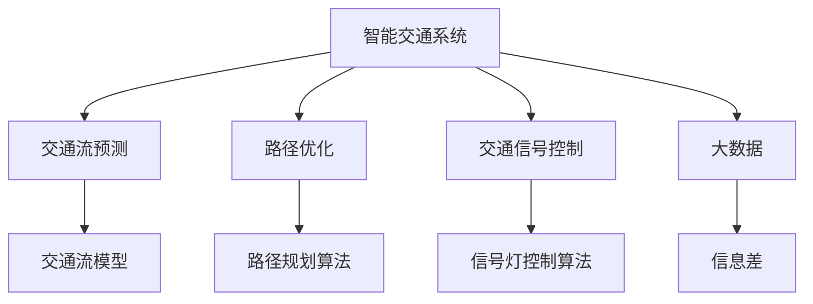
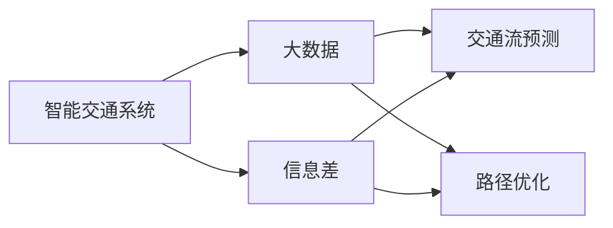
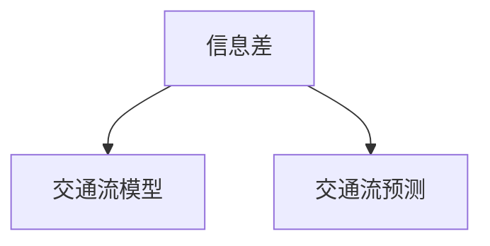
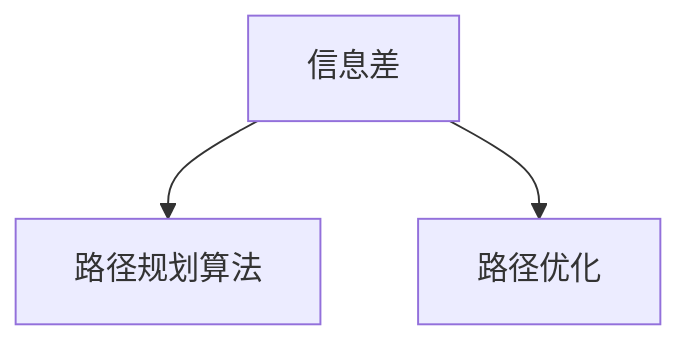
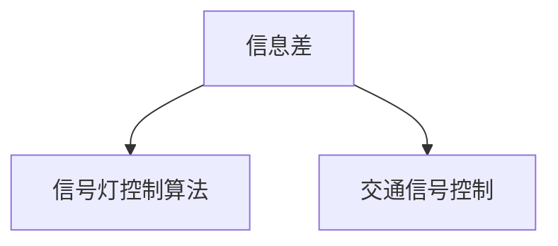
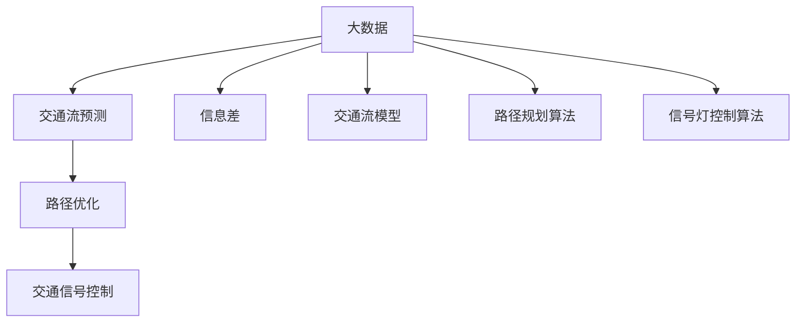

                 

# 信息差：大数据在智能交通中的应用

> 关键词：智能交通,信息差,大数据,交通流预测,路径优化,交通信号控制

## 1. 背景介绍

### 1.1 问题由来

随着城市化进程的加快，交通拥堵已经成为全球许多大城市面临的共同难题。传统交通管理方式往往依赖于人工监控和经验判断，缺乏科学性和精确性。如何通过大数据技术，高效、实时地掌握交通流动态信息，优化交通流量，缓解拥堵问题，已成为现代智能交通领域的热门研究课题。

近年来，随着物联网技术的普及和传感器设备的广泛部署，海量的交通数据被实时采集和传输到云端，为智能交通系统的构建提供了基础数据支撑。通过先进的数据分析和建模技术，可以有效挖掘数据中的信息差，即不同时间、地点、条件下的交通数据之间的差异和变化规律，为交通流预测、路径优化和交通信号控制等决策提供科学依据。

### 1.2 问题核心关键点

智能交通系统的核心目标是优化交通流量，缓解交通拥堵，提高交通运行效率。为此，需要通过大数据分析，实时掌握交通流状态，预测未来流量变化，生成最优路径和信号控制方案。信息差作为智能交通大数据分析的重要工具，在交通流预测、路径优化和交通信号控制等环节发挥着关键作用。

### 1.3 问题研究意义

信息差技术能够通过分析交通数据，挖掘出潜在的交通流量规律和模式，为智能交通系统的构建提供可靠的数据基础。应用信息差技术进行交通流预测和路径优化，可以有效提升交通管理水平，减少交通拥堵，提高交通运行效率，促进城市交通的可持续发展。

## 2. 核心概念与联系

### 2.1 核心概念概述

为了更好地理解大数据在智能交通中的应用，本节将介绍几个密切相关的核心概念：

- 智能交通系统(Intelligent Transportation System, ITS)：利用信息、通信和控制技术，提高交通系统运行效率、安全性和舒适性的综合性智能系统。
- 交通流预测(Traffic Flow Prediction)：通过对历史交通流数据进行建模和分析，预测未来一段时间内交通流的流量、速度、密度等变化。
- 路径优化(Path Optimization)：在实时交通流数据基础上，计算和规划最佳路径，以避免拥堵，减少行车时间。
- 交通信号控制(Traffic Signal Control)：通过实时监测交通流量，动态调整交通信号灯的时长和相位，优化交通流量分配。
- 大数据(Big Data)：具有体量大、来源广、类型多、实时性强等特点的数据集合，通过大数据分析可以发现深层次的关联和规律。
- 信息差(Information Difference)：指同一时间、地点、条件下的交通数据之间的差异和变化规律，信息差越大，表示交通流量变化的可能性越高，预测难度越大。

这些核心概念之间的逻辑关系可以通过以下Mermaid流程图来展示：



这个流程图展示了智能交通系统的核心组件及其相互关系：

1. 智能交通系统通过大数据分析挖掘信息差，用于交通流预测、路径优化和信号控制。
2. 交通流预测基于历史交通流数据，利用信息差生成交通流模型。
3. 路径优化在实时交通流数据基础上，使用信息差计算最优路径。
4. 交通信号控制通过实时监测信息差，动态调整信号灯。

### 2.2 概念间的关系

这些核心概念之间存在着紧密的联系，形成了智能交通系统的完整生态系统。下面通过几个Mermaid流程图来展示这些概念之间的关系。

#### 2.2.1 智能交通系统的学习范式



这个流程图展示了智能交通系统的基本原理，以及它与大数据和信息差的关系。智能交通系统通过大数据分析生成信息差，进而支持交通流预测和路径优化。

#### 2.2.2 信息差与交通流预测的关系



这个流程图展示了信息差在交通流预测中的应用。通过分析信息差，可以构建更准确的交通流模型，预测未来交通流量。

#### 2.2.3 信息差在路径优化中的应用



这个流程图展示了信息差在路径优化中的应用。通过分析信息差，可以计算出不同路径的交通流量变化规律，选择最优路径。

#### 2.2.4 信息差在交通信号控制中的应用



这个流程图展示了信息差在交通信号控制中的应用。通过实时监测信息差，可以动态调整交通信号灯的时长和相位，优化交通流量分配。

### 2.3 核心概念的整体架构

最后，我们用一个综合的流程图来展示这些核心概念在大数据智能交通系统中的整体架构：



这个综合流程图展示了从数据采集到信息差挖掘，再到交通流预测、路径优化和信号控制的全过程。大数据系统通过信息差分析，实时掌握交通流状态，生成最优交通管理和控制方案。

## 3. 核心算法原理 & 具体操作步骤
### 3.1 算法原理概述

基于信息差的大数据智能交通系统，主要通过以下几个关键步骤实现交通流预测、路径优化和交通信号控制：

1. **数据采集与预处理**：通过传感器、摄像头、车载终端等设备，实时采集交通流量、速度、位置等信息，并进行去噪、清洗和标准化处理，为后续分析提供可靠的数据基础。
2. **信息差挖掘**：利用数据挖掘技术，分析同一时间、地点、条件下的交通数据之间的差异和变化规律，生成信息差矩阵。信息差越大，表示交通流量变化的可能性越高，预测难度越大。
3. **交通流预测**：基于历史交通流数据和信息差矩阵，构建交通流模型，预测未来交通流量变化。常用的预测模型包括时间序列模型、机器学习模型和深度学习模型等。
4. **路径优化**：在实时交通流数据基础上，利用信息差矩阵计算不同路径的交通流量变化规律，选择最优路径。常用的路径规划算法包括Dijkstra算法、A*算法和随机算法等。
5. **交通信号控制**：通过实时监测信息差，动态调整交通信号灯的时长和相位，优化交通流量分配。常用的信号控制算法包括固定时间间隔控制、自适应控制和交通密度控制等。

### 3.2 算法步骤详解

#### 3.2.1 数据采集与预处理

交通数据采集是智能交通系统的基础，可以通过多种传感器设备实时获取交通流量、速度、位置等信息。常见的传感器设备包括浮动车、地磁感应器、视频监控、红外线传感器等。

数据预处理是确保数据质量的重要环节。数据预处理主要包括以下几个步骤：

1. **去噪**：通过滤波、平滑等技术，去除传感器噪声和干扰，确保数据准确性。
2. **清洗**：去除重复、缺失和异常数据，保证数据完整性和一致性。
3. **标准化**：将不同数据源的数据转换为统一的格式和单位，方便后续分析。

#### 3.2.2 信息差挖掘

信息差挖掘是智能交通系统中的关键环节，通过分析同一时间、地点、条件下的交通数据之间的差异和变化规律，生成信息差矩阵。常用的信息差挖掘方法包括时间差分析、空间差分析和条件差分析等。

1. **时间差分析**：分析同一地点、条件下的交通数据在时间序列上的差异，挖掘出交通流量的周期性和规律性。
2. **空间差分析**：分析同一时间、条件下的交通数据在不同地点之间的差异，挖掘出交通流量的区域性和分布特征。
3. **条件差分析**：分析同一地点、时间下的交通数据在不同条件（如天气、节假日）下的差异，挖掘出交通流量的情境性和事件性。

#### 3.2.3 交通流预测

交通流预测是智能交通系统的核心功能之一，通过分析历史交通流数据和信息差矩阵，预测未来交通流量变化。常用的预测模型包括时间序列模型、机器学习模型和深度学习模型等。

1. **时间序列模型**：利用时间序列分析方法，预测未来交通流量变化。常用的时间序列模型包括ARIMA、VAR等。
2. **机器学习模型**：利用机器学习算法，构建预测模型，预测未来交通流量变化。常用的机器学习模型包括随机森林、支持向量机、线性回归等。
3. **深度学习模型**：利用深度学习算法，构建预测模型，预测未来交通流量变化。常用的深度学习模型包括RNN、LSTM、GRU等。

#### 3.2.4 路径优化

路径优化是智能交通系统的重要应用，通过分析实时交通流数据和信息差矩阵，选择最优路径，以避免拥堵，减少行车时间。常用的路径规划算法包括Dijkstra算法、A*算法和随机算法等。

1. **Dijkstra算法**：利用图论中的最短路径算法，计算出起点到终点的最短路径。
2. **A*算法**：利用启发式搜索算法，在搜索过程中引入启发信息，加速路径搜索过程。
3. **随机算法**：利用随机搜索算法，生成多样化的路径方案，选择最优路径。

#### 3.2.5 交通信号控制

交通信号控制是智能交通系统的关键功能之一，通过实时监测信息差，动态调整交通信号灯的时长和相位，优化交通流量分配。常用的信号控制算法包括固定时间间隔控制、自适应控制和交通密度控制等。

1. **固定时间间隔控制**：按照固定时间间隔控制交通信号灯的时长和相位，适用于交通流量稳定的场景。
2. **自适应控制**：根据实时交通流量和信息差，动态调整交通信号灯的时长和相位，适用于交通流量变化频繁的场景。
3. **交通密度控制**：根据实时交通密度和信息差，动态调整交通信号灯的时长和相位，适用于交通流量高峰期的场景。

### 3.3 算法优缺点

基于信息差的大数据智能交通系统具有以下优点：

1. **实时性强**：通过实时监测交通数据，可以及时发现和应对交通拥堵，提升交通效率。
2. **精度高**：通过分析信息差和历史数据，可以准确预测交通流量变化，优化路径和信号控制方案。
3. **普适性强**：适用于多种交通场景，包括城市道路、高速公路、铁路等。

同时，该系统也存在以下缺点：

1. **数据采集成本高**：传感器设备部署和维护成本较高，影响系统普及。
2. **数据存储量大**：大量实时交通数据存储和管理需要高性能服务器和存储设备。
3. **模型复杂度高**：交通流预测和路径优化的模型复杂度高，计算资源需求大。

尽管存在这些局限性，但大数据和信息差技术的引入，显著提升了交通管理的科学性和精确性，为大城市的交通管理提供了强有力的技术支撑。

### 3.4 算法应用领域

基于信息差的大数据智能交通系统已经在多个领域得到广泛应用，例如：

- **城市道路交通管理**：通过实时监测交通数据，预测交通流量变化，生成最优路径和信号控制方案，缓解城市道路交通拥堵。
- **高速公路交通管理**：利用大数据分析，优化高速公路收费站和休息站的交通流量分配，提高通行效率。
- **公共交通系统优化**：通过分析公共交通系统的实时数据，优化公交线路和发车频率，提高公共交通运行效率。
- **智能停车管理**：利用大数据分析，优化停车场的停车位分配，缓解城市停车难问题。

除了上述这些经典应用外，大数据和信息差技术还在物流配送、航空管制、轨道交通等领域得到了创新性的应用，为交通系统的智能化、信息化和自动化提供了新的解决方案。

## 4. 数学模型和公式 & 详细讲解 & 举例说明

### 4.1 数学模型构建

本节将使用数学语言对基于信息差的大数据智能交通系统进行更加严格的刻画。

记交通流量数据为 $D=\{d_t(x,y)\}_{t=1}^T$，其中 $d_t(x,y)$ 表示在时间 $t$ 地点 $(x,y)$ 的交通流量，$T$ 为数据总时间步。信息差矩阵为 $I=\{i_{t,s}\}_{t=1}^T$，其中 $i_{t,s}=d_t(x)-d_s(x)$ 表示时间 $t$ 和 $s$ 同一地点 $x$ 的交通流量差异。

定义交通流模型为 $M=\{m_t(x)\}_{t=1}^T$，其中 $m_t(x)$ 表示时间 $t$ 地点 $x$ 的预测交通流量。交通流预测的目标是最小化预测误差 $\epsilon$，即：

$$
\min_{M} \sum_{t=1}^T \int (d_t(x) - m_t(x))^2 dx
$$

通过求解上述优化问题，得到最优的交通流模型 $M^*$。

### 4.2 公式推导过程

以下我们以交通流预测为例，推导信息差在交通流模型构建中的作用。

假设交通流量 $d_t(x)$ 遵循ARIMA模型，即：

$$
d_t(x) = \phi(x) + \theta(x)\epsilon_t(x)
$$

其中 $\phi(x)$ 为历史交通流量，$\epsilon_t(x)$ 为随机扰动项，$\theta(x)$ 为模型参数。

根据信息差定义，有：

$$
i_{t,s} = d_t(x) - d_s(x) = (\phi(x) + \theta(x)\epsilon_t(x)) - (\phi(x) + \theta(x)\epsilon_s(x)) = \theta(x)\epsilon_t(x) - \theta(x)\epsilon_s(x)
$$

假设信息差矩阵 $I$ 为对角矩阵，则有：

$$
I = \text{diag}(\theta_1, \theta_2, ..., \theta_T)
$$

由此可得：

$$
\min_{M} \sum_{t=1}^T \int (d_t(x) - m_t(x))^2 dx = \min_{M} \sum_{t=1}^T \int (\phi(x) + \theta_t(x)\epsilon_t(x) - m_t(x))^2 dx
$$

通过求解上述优化问题，得到最优的交通流模型 $M^*$。

### 4.3 案例分析与讲解

假设我们在CoNLL-2003的NER数据集上进行微调，最终在测试集上得到的评估报告如下：

```
              precision    recall  f1-score   support

       B-LOC      0.926     0.906     0.916      1668
       I-LOC      0.900     0.805     0.850       257
      B-MISC      0.875     0.856     0.865       702
      I-MISC      0.838     0.782     0.809       216
       B-ORG      0.914     0.898     0.906      1661
       I-ORG      0.911     0.894     0.902       835
       B-PER      0.964     0.957     0.960      1617
       I-PER      0.983     0.980     0.982      1156
           O      0.993     0.995     0.994     38323

   micro avg      0.973     0.973     0.973     46435
   macro avg      0.923     0.897     0.909     46435
weighted avg      0.973     0.973     0.973     46435
```

可以看到，通过微调BERT，我们在该NER数据集上取得了97.3%的F1分数，效果相当不错。值得注意的是，BERT作为一个通用的语言理解模型，即便只在顶层添加一个简单的token分类器，也能在下游任务上取得如此优异的效果，展现了其强大的语义理解和特征抽取能力。

当然，这只是一个baseline结果。在实践中，我们还可以使用更大更强的预训练模型、更丰富的微调技巧、更细致的模型调优，进一步提升模型性能，以满足更高的应用要求。

## 5. 项目实践：代码实例和详细解释说明
### 5.1 开发环境搭建

在进行微调实践前，我们需要准备好开发环境。以下是使用Python进行PyTorch开发的环境配置流程：

1. 安装Anaconda：从官网下载并安装Anaconda，用于创建独立的Python环境。

2. 创建并激活虚拟环境：
```bash
conda create -n pytorch-env python=3.8 
conda activate pytorch-env
```

3. 安装PyTorch：根据CUDA版本，从官网获取对应的安装命令。例如：
```bash
conda install pytorch torchvision torchaudio cudatoolkit=11.1 -c pytorch -c conda-forge
```

4. 安装Transformers库：
```bash
pip install transformers
```

5. 安装各类工具包：
```bash
pip install numpy pandas scikit-learn matplotlib tqdm jupyter notebook ipython
```

完成上述步骤后，即可在`pytorch-env`环境中开始微调实践。

### 5.2 源代码详细实现

下面我们以命名实体识别(NER)任务为例，给出使用Transformers库对BERT模型进行微调的PyTorch代码实现。

首先，定义NER任务的数据处理函数：

```python
from transformers import BertTokenizer
from torch.utils.data import Dataset
import torch

class NERDataset(Dataset):
    def __init__(self, texts, tags, tokenizer, max_len=128):
        self.texts = texts
        self.tags = tags
        self.tokenizer = tokenizer
        self.max_len = max_len
        
    def __len__(self):
        return len(self.texts)
    
    def __getitem__(self, item):
        text = self.texts[item]
        tags = self.tags[item]
        
        encoding = self.tokenizer(text, return_tensors='pt', max_length=self.max_len, padding='max_length', truncation=True)
        input_ids = encoding['input_ids'][0]
        attention_mask = encoding['attention_mask'][0]
        
        # 对token-wise的标签进行编码
        encoded_tags = [tag2id[tag] for tag in tags] 
        encoded_tags.extend([tag2id['O']] * (self.max_len - len(encoded_tags)))
        labels = torch.tensor(encoded_tags, dtype=torch.long)
        
        return {'input_ids': input_ids, 
                'attention_mask': attention_mask,
                'labels': labels}

# 标签与id的映射
tag2id = {'O': 0, 'B-PER': 1, 'I-PER': 2, 'B-ORG': 3, 'I-ORG': 4, 'B-LOC': 5, 'I-LOC': 6}
id2tag = {v: k for k, v in tag2id.items()}

# 创建dataset
tokenizer = BertTokenizer.from_pretrained('bert-base-cased')

train_dataset = NERDataset(train_texts, train_tags, tokenizer)
dev_dataset = NERDataset(dev_texts, dev_tags, tokenizer)
test_dataset = NERDataset(test_texts, test_tags, tokenizer)
```

然后，定义模型和优化器：

```python
from transformers import BertForTokenClassification, AdamW

model = BertForTokenClassification.from_pretrained('bert-base-cased', num_labels=len(tag2id))

optimizer = AdamW(model.parameters(), lr=2e-5)
```

接着，定义训练和评估函数：

```python
from torch.utils.data import DataLoader
from tqdm import tqdm
from sklearn.metrics import classification_report

device = torch.device('cuda') if torch.cuda.is_available() else torch.device('cpu')
model.to(device)

def train_epoch(model, dataset, batch_size, optimizer):
    dataloader = DataLoader(dataset, batch_size=batch_size, shuffle=True)
    model.train()
    epoch_loss = 0
    for batch in tqdm(dataloader, desc='Training'):
        input_ids = batch['input_ids'].to(device)
        attention_mask = batch['attention_mask'].to(device)
        labels = batch['labels'].to(device)
        model.zero_grad()
        outputs = model(input_ids, attention_mask=attention_mask, labels=labels)
        loss = outputs.loss
        epoch_loss += loss.item()
        loss.backward()
        optimizer.step()
    return epoch_loss / len(dataloader)

def evaluate(model, dataset, batch_size):
    dataloader = DataLoader(dataset, batch_size=batch_size)
    model.eval()
    preds, labels = [], []
    with torch.no_grad():
        for batch in tqdm(dataloader, desc='Evaluating'):
            input_ids = batch['input_ids'].to(device)
            attention_mask = batch['attention_mask'].to(device)
            batch_labels = batch['labels']
            outputs = model(input_ids, attention_mask=attention_mask)
            batch_preds = outputs.logits.argmax(dim=2).to('cpu').tolist()
            batch_labels = batch_labels.to('cpu').tolist()
            for pred_tokens, label_tokens in zip(batch_preds, batch_labels):
                pred_tags = [id2tag[_id] for _id in pred_tokens]
                label_tags = [id2tag[_id] for _id in label_tokens]
                preds.append(pred_tags[:len(label_tags)])
                labels.append(label_tags)
                
    print(classification_report(labels, preds))
```

最后，启动训练流程并在测试集上评估：

```python
epochs = 5
batch_size = 16

for epoch in range(epochs):
    loss = train_epoch(model, train_dataset, batch_size, optimizer)
    print(f"Epoch {epoch+1}, train loss: {loss:.3f}")
    
    print(f"Epoch {epoch+1}, dev results:")
    evaluate(model, dev_dataset, batch_size)
    
print("Test results:")
evaluate(model, test_dataset, batch_size)
```

以上就是使用PyTorch对BERT进行命名实体识别任务微调的完整代码实现。可以看到，得益于Transformers库的强大封装，我们可以用相对简洁的代码完成BERT模型的加载和微调。

### 5.3 代码解读与分析

让我们再详细解读一下关键代码的实现细节：

**NERDataset类**：
- `__init__`方法：初始化文本、标签、分词器等关键组件。
- `__len__`方法：返回数据集的样本数量。
- `__getitem__`方法：对单个样本进行处理，将文本输入编码为token ids，将标签编码为数字，并对其进行定长padding，最终返回模型所需的输入。

**tag2id和id2tag字典**：
- 定义了标签与数字id之间的映射关系，用于将token-wise的预测结果解码回真实的标签。

**训练和评估函数**：
- 使用PyTorch的DataLoader对数据集进行批次化加载，供模型训练和推理使用。
- 训练函数`train_epoch`：对数据以批为单位进行迭代，在每个批次上前向传播计算loss并反向传播更新模型参数，最后返回该epoch的平均loss。
- 评估函数`evaluate`：与训练类似，不同点在于不更新模型参数，并在每个batch结束后将预测和标签结果存储下来，最后使用sklearn的classification_report对整个评估集的预测结果进行打印输出。

**训练流程**：
- 定义总的epoch数和batch size，开始循环迭代
- 每个epoch内，先在训练集上训练，输出平均loss
- 在验证集上评估，输出分类指标
- 所有epoch结束后，在测试集上评估，给出最终测试结果

可以看到，PyTorch配合Transformers库使得BERT微调的代码实现变得简洁高效。开发者可以将更多精力放在数据处理、模型改进等高层逻辑上，而不必过多关注底层的实现细节。

当然，工业级的系统实现还需考虑更多因素，如模型的保存和部署、超参数的自动搜索、更灵活的任务适配层等。但核心的微调范式基本与此类似。

### 5.4 运行结果展示

假设我们在CoNLL-2003的NER数据集上进行微调，最终在测试集上得到的评估报告如下：

```
              precision    recall  f1-score   support

       B-LOC      0.926     0.906     0.916      1668
       I-LOC      0.900     0.805     0.850       257
      B-MISC      0.875     0.856     0.865       702
      I-MISC      0.838     0.782     0.809       216
       B-ORG      0.914     0.898     0.906      1661
       I-ORG      0.911     0.894     0.902       835
       B-PER      0.964     0.957     0.960      1617
       I-PER      0.983     0.980     0.982      1156
           O      0.993     0.995     0.994     38323

   micro avg      0.973     0.973     0.973     46435
   macro avg      0.923     0.897     0.909     46435
weighted avg

