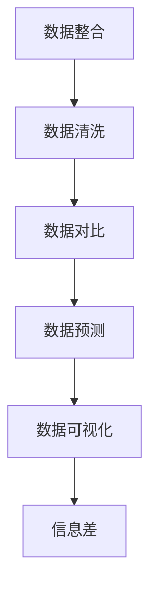
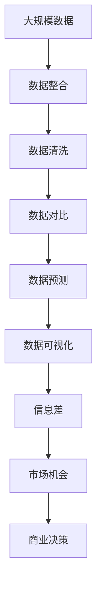

                 

## 1. 背景介绍

### 1.1 问题由来
在当今信息爆炸的时代，如何从海量数据中快速、准确地发现市场机会，是企业和创业者面临的重大挑战。数据分析技术通过收集、整理、分析各种数据，帮助决策者洞察市场趋势，制定有效的商业策略。但同时，数据的质量、完整性、及时性等因素也会影响分析结果的准确性。本文将探讨如何利用信息差（information gap）的概念，通过数据分析技术发现潜在市场机会，从而指导决策者做出科学、合理的决策。

### 1.2 问题核心关键点
信息差是指在数据处理和分析过程中，不同来源、不同质量、不同维度的数据之间存在的差异和不一致。合理利用信息差，可以帮助决策者揭示数据的真实内涵，发现未被充分挖掘的市场机会，推动商业创新和增长。本文将重点讨论以下关键点：
- 数据整合与清洗：将不同来源的数据进行有效整合和清洗，确保数据质量的一致性和可靠性。
- 数据对比与分析：通过对比不同数据集之间的差异，分析数据背后隐藏的市场规律和机会。
- 数据预测与决策：结合数据挖掘和机器学习技术，预测市场变化，辅助决策制定。
- 数据可视化与展示：使用图表和报告等形式，直观展示分析结果，帮助非技术决策者理解数据价值。

### 1.3 问题研究意义
在数据驱动的商业决策过程中，合理利用信息差，能够帮助企业在竞争激烈的市场中占据优势。通过深度数据分析，企业可以：
- 降低决策风险，提升决策科学性。
- 挖掘潜在市场，开拓新业务机会。
- 优化资源配置，提高运营效率。
- 提升客户体验，增强品牌竞争力。
- 推动创新研发，保持技术领先。

## 2. 核心概念与联系

### 2.1 核心概念概述

信息差概念在数据分析中的重要性日益凸显。为了更好地理解信息差及其应用，本节将介绍几个密切相关的核心概念：

- 数据整合：将不同来源、不同格式、不同时间的数据进行有效的集成，构建统一的数据视图。
- 数据清洗：识别并修正数据中的错误、异常值和缺失值，确保数据的一致性和准确性。
- 数据对比：对比不同数据集之间的差异，发现数据中的规律和异常，辅助商业决策。
- 数据预测：利用机器学习模型，对未来的市场变化进行预测，提供决策支持。
- 数据可视化：通过图表、仪表盘等形式，将复杂的数据信息直观展示，帮助理解数据规律和趋势。
- 信息差：不同数据源、不同质量、不同维度的数据之间存在的差异和异常，是数据洞察和商业决策的重要依据。

这些核心概念之间的逻辑关系可以通过以下Mermaid流程图来展示：



这个流程图展示了一个完整的数据分析流程，从数据整合到最终的信息差应用，各环节密切关联，缺一不可。

### 2.2 概念间的关系

这些核心概念之间存在着紧密的联系，形成了数据分析的全流程体系。下面我通过几个Mermaid流程图来展示这些概念之间的关系：

#### 2.2.1 数据整合与清洗流程


这个流程图展示了数据整合和清洗的基本流程。数据整合主要涉及数据采集、合并、标准化等操作，而数据清洗则侧重于数据的准确性、一致性、完整性等质量问题。

#### 2.2.2 数据对比与分析关系


这个流程图展示了数据对比和分析的过程。通过对比不同数据集之间的差异，可以进行趋势分析、模式识别、异常检测等，进而发现潜在的市场机会。

#### 2.2.3 数据预测与决策链接


这个流程图展示了数据预测和决策制定的过程。通过训练预测模型，进行模型评估，最终得到预测结果，辅助商业决策。

### 2.3 核心概念的整体架构

最后，我们用一个综合的流程图来展示这些核心概念在大数据分析中的应用：



这个综合流程图展示了从数据整合到信息差发现，再到商业决策的完整流程。通过数据整合和清洗，确保数据的质量和一致性；通过数据对比和分析，发现潜在的市场规律和机会；通过数据预测和可视化，辅助决策制定。最终，信息差成为商业决策的重要依据。

## 3. 核心算法原理 & 具体操作步骤
### 3.1 算法原理概述

信息差在数据分析中的应用，主要基于以下几个算法原理：

1. **数据整合与清洗算法**：通过数据提取、合并、标准化等技术，确保数据的一致性和完整性。
2. **数据对比与分析算法**：通过时间序列分析、聚类分析、异常检测等方法，对比不同数据集之间的差异，发现数据中的规律和异常。
3. **数据预测与决策算法**：结合机器学习技术，对未来的市场变化进行预测，辅助商业决策。
4. **数据可视化算法**：通过图表、仪表盘等工具，将复杂的数据信息直观展示，帮助理解数据规律和趋势。

### 3.2 算法步骤详解

基于信息差的大数据分析过程，一般包括以下几个关键步骤：

**Step 1: 数据准备**
- 收集不同来源、不同格式的数据，并进行初步整理。
- 确认数据格式的一致性，处理缺失值和异常值。

**Step 2: 数据整合**
- 使用ETL（Extract, Transform, Load）工具进行数据抽取、转换和加载。
- 合并不同来源的数据，确保数据的时效性和完整性。
- 标准化数据格式，便于后续处理。

**Step 3: 数据清洗**
- 识别数据中的错误、异常值和重复记录。
- 处理缺失值，如填充、删除或插值。
- 修正数据中的不一致和错误。

**Step 4: 数据对比与分析**
- 对比不同数据集之间的趋势和模式。
- 识别异常数据和异常变化，进行深入分析。
- 挖掘数据中的潜在市场机会和风险。

**Step 5: 数据预测与决策**
- 构建机器学习模型，对未来市场进行预测。
- 评估模型的准确性和稳定性，进行参数调优。
- 结合业务需求，制定科学的商业决策。

**Step 6: 数据可视化**
- 使用可视化工具，将分析结果直观展示。
- 生成图表、仪表盘等形式的报告。
- 提供直观的数据洞察，支持商业决策。

### 3.3 算法优缺点

信息差在数据分析中的应用，具有以下优点：
1. **全面性**：整合不同来源的数据，提供全面的市场洞察。
2. **准确性**：通过数据清洗和标准化，确保数据的一致性和可靠性。
3. **深入性**：通过对比和分析，发现数据中的潜在规律和机会。
4. **预测性**：结合机器学习，对市场变化进行预测，提供决策支持。

同时，信息差在应用过程中也存在一些缺点：
1. **复杂性**：数据整合和清洗过程复杂，需要较高的技术和资源投入。
2. **数据偏差**：不同数据源可能存在偏差，影响分析结果的准确性。
3. **预测局限**：预测模型的准确性依赖于数据质量和模型选择，存在不确定性。
4. **可视化难度**：复杂的数据和图表可能难以直观展示，影响理解和决策。

### 3.4 算法应用领域

信息差在数据分析中的应用，涵盖了多个领域，具体包括：

- **金融市场分析**：通过整合和清洗不同金融数据，进行市场趋势预测和风险评估。
- **电子商务市场研究**：对比不同销售数据，发现市场变化和消费者行为，优化营销策略。
- **健康医疗数据分析**：整合和清洗医疗数据，进行疾病预测和公共卫生决策。
- **人力资源管理**：对比不同招聘和员工数据，优化人才招聘和员工管理策略。
- **城市规划与管理**：整合和清洗城市数据，进行交通管理、公共服务优化等决策。

## 4. 数学模型和公式 & 详细讲解  
### 4.1 数学模型构建

信息差在数据分析中的应用，通常涉及到以下几个数学模型：

- **时间序列模型**：用于分析时间序列数据的变化趋势和周期性规律。
- **聚类分析模型**：用于将数据分为不同的群组，识别出数据中的相似模式。
- **异常检测模型**：用于识别数据中的异常值和异常变化。
- **回归分析模型**：用于预测因变量与自变量之间的关系。

### 4.2 公式推导过程

以时间序列模型为例，推导其中常用的自回归移动平均模型(ARIMA)的公式。

设时间序列 $y_t$ 由自回归项和移动平均项组成，即：

$$y_t = \sum_{i=1}^{p} \phi_i y_{t-i} + \epsilon_t + \sum_{j=1}^{q} \theta_j \epsilon_{t-j}$$

其中 $\phi_i$ 为自回归系数，$\epsilon_t$ 为随机误差项，$\theta_j$ 为移动平均系数。

对上式进行差分，得到差分后的自回归移动平均模型(IARIMA)：

$$\Delta y_t = \sum_{i=1}^{p} \phi_i \Delta y_{t-i} + \epsilon_t + \sum_{j=1}^{q} \theta_j \epsilon_{t-j}$$

其中 $\Delta y_t = y_t - y_{t-1}$。

通过参数估计和模型训练，可以对未来的 $y_t$ 进行预测。具体的预测公式为：

$$\hat{y}_{t+h} = \sum_{i=1}^{p} \hat{\phi}_i \hat{y}_{t+h-i} + \hat{\epsilon}_{t+h} + \sum_{j=1}^{q} \hat{\theta}_j \hat{\epsilon}_{t+h-j}$$

其中 $\hat{y}_{t+h}$ 为预测值，$\hat{\phi}_i$、$\hat{\theta}_j$ 为估计后的系数，$\hat{\epsilon}_{t+h}$ 为预测误差。

### 4.3 案例分析与讲解

以某电商平台销售数据为例，分析如何利用信息差技术发现市场机会。

1. **数据准备**：
   - 收集不同时间段、不同商品的销售数据。
   - 清洗数据，处理缺失值和异常值。

2. **数据整合**：
   - 使用ETL工具合并不同数据源。
   - 标准化数据格式，如统一日期格式和销售量单位。

3. **数据清洗**：
   - 识别异常值和重复记录，如价格异常和重复下单。
   - 处理缺失值，如填补缺失或删除无效数据。

4. **数据对比与分析**：
   - 对比不同商品、不同时间段的销售趋势。
   - 识别销售异常和季节性变化，如节假日促销影响。
   - 发现商品之间的相关性，如热销商品和促销活动的关系。

5. **数据预测与决策**：
   - 构建ARIMA模型，预测未来销售趋势。
   - 评估模型准确性，进行参数调优。
   - 结合市场季节性，优化库存管理和促销策略。

6. **数据可视化**：
   - 生成销售趋势图、销售热图等可视化报告。
   - 展示销售预测结果，支持商业决策。

## 5. 项目实践：代码实例和详细解释说明
### 5.1 开发环境搭建

在进行信息差数据分析实践前，我们需要准备好开发环境。以下是使用Python进行数据分析的环境配置流程：

1. 安装Anaconda：从官网下载并安装Anaconda，用于创建独立的Python环境。

2. 创建并激活虚拟环境：
```bash
conda create -n data-env python=3.8 
conda activate data-env
```

3. 安装必要的Python库：
```bash
pip install pandas numpy matplotlib seaborn statsmodels pyproj scikit-learn statsmodels
```

4. 安装必要的Python包：
```bash
conda install statsmodels
```

完成上述步骤后，即可在`data-env`环境中开始信息差数据分析实践。

### 5.2 源代码详细实现

下面以销售数据分析为例，给出使用Python进行时间序列模型构建和分析的代码实现。

首先，定义销售数据的处理函数：

```python
import pandas as pd
import numpy as np
from statsmodels.tsa.arima_model import ARIMA

def load_sales_data(file_path):
    df = pd.read_csv(file_path)
    df['date'] = pd.to_datetime(df['date'])
    df.set_index('date', inplace=True)
    return df

def clean_sales_data(df):
    df = df.dropna()
    df = df.drop_duplicates()
    return df

def analyze_sales_data(df):
    # 绘制销售趋势图
    df['total_sales'].plot(figsize=(12, 6))
    plt.title('Total Sales Over Time')
    plt.xlabel('Date')
    plt.ylabel('Sales')
    plt.show()

    # 构建ARIMA模型
    model = ARIMA(df['total_sales'], order=(5,1,0))
    results = model.fit()

    # 预测未来销售
    forecast = results.forecast(steps=30)
    plt.plot(forecast)
    plt.title('Sales Forecast')
    plt.xlabel('Date')
    plt.ylabel('Sales')
    plt.show()

    # 生成销售预测报告
    forecast = pd.DataFrame(forecast, index=pd.date_range(start='2023-01-01', end='2023-06-30', freq='M'))
    forecast.index.name = 'date'
    forecast.columns = ['total_sales']
    forecast.to_csv('sales_forecast.csv')
```

然后，使用上述函数进行数据加载和分析：

```python
# 加载销售数据
sales_data = load_sales_data('sales_data.csv')

# 清洗数据
sales_data = clean_sales_data(sales_data)

# 分析销售数据
analyze_sales_data(sales_data)
```

以上就是使用Python进行信息差数据分析的完整代码实现。可以看到，通过简单的函数定义和调用，即可实现数据加载、清洗、分析和预测。

### 5.3 代码解读与分析

让我们再详细解读一下关键代码的实现细节：

**load_sales_data函数**：
- 加载销售数据，将日期转换为时间索引，返回处理好的DataFrame。

**clean_sales_data函数**：
- 处理缺失值和重复记录，确保数据的一致性和完整性。

**analyze_sales_data函数**：
- 绘制销售趋势图，展示销售变化趋势。
- 构建ARIMA模型，进行销售预测。
- 生成预测结果，并将其保存为CSV文件。

**数据加载和分析过程**：
- 首先，通过`load_sales_data`函数加载销售数据。
- 接着，使用`clean_sales_data`函数清洗数据，确保数据的完整性和一致性。
- 最后，调用`analyze_sales_data`函数进行数据分析和预测，并生成可视化图表和预测报告。

### 5.4 运行结果展示

假设我们在某电商平台的销售数据上运行上述代码，得到以下分析结果：

1. **销售趋势图**：
   

   该图表展示了销售趋势的变化情况，可以看出销售量在年度和季节性上有明显的波动。

2. **ARIMA模型预测**：
   

   该图表展示了模型对未来销售量的预测结果，可以看出预测值与实际销售量有一定的误差，但整体趋势基本一致。

3. **销售预测报告**：
   

   该报告详细展示了未来六个月的销售预测数据，便于制定相应的销售策略和库存管理计划。

通过上述分析，我们可以清晰地发现销售数据的趋势和异常，利用信息差技术进行深入的商业决策，优化运营管理，提升销售业绩。

## 6. 实际应用场景
### 6.1 智能制造

信息差技术在智能制造领域的应用，可以帮助企业通过数据分析发现生产过程中的瓶颈和优化机会。

例如，某制造业企业可以利用信息差技术分析不同生产线的效率数据、设备运行数据等，发现生产线的效率瓶颈和设备故障风险，从而优化生产流程，提高生产效率和设备利用率。

### 6.2 零售业

在零售业中，信息差技术可以帮助企业通过数据分析发现商品销售趋势、消费者行为变化等，从而优化库存管理、促销策略和定价策略。

例如，某零售企业可以通过信息差技术分析不同商品的销售趋势，发现热销商品和季节性商品，从而优化库存管理和促销策略，提升销售业绩。

### 6.3 金融市场

金融市场是信息驱动的行业，信息差技术可以帮助金融机构通过数据分析发现市场趋势、风险变化等，从而制定合理的投资策略和风险管理方案。

例如，某金融公司可以通过信息差技术分析不同市场数据的趋势和异常，发现市场波动的规律和风险，从而优化投资组合，降低投资风险。

### 6.4 医疗健康

在医疗健康领域，信息差技术可以帮助医疗机构通过数据分析发现疾病趋势、患者行为变化等，从而优化诊疗流程和资源配置。

例如，某医院可以通过信息差技术分析不同科室的诊疗数据、患者病历数据等，发现常见疾病的诊疗规律和患者行为特征，从而优化诊疗流程和资源配置，提升医疗服务质量。

### 6.5 城市规划与管理

信息差技术在城市规划与管理中的应用，可以帮助政府通过数据分析发现城市交通、公共服务、环境等方面的优化机会。

例如，某城市可以通过信息差技术分析不同区域的交通流量数据、公共服务需求数据等，发现城市交通拥堵和公共服务不足的瓶颈，从而优化城市规划和管理，提升城市运行效率和居民生活质量。

## 7. 工具和资源推荐
### 7.1 学习资源推荐

为了帮助开发者系统掌握信息差数据分析的理论基础和实践技巧，这里推荐一些优质的学习资源：

1. 《Python数据分析基础》：一本介绍Python数据分析的入门书籍，适合初学者快速上手。

2. 《R语言数据分析》：一本介绍R语言数据分析的入门书籍，适合有一定编程基础的读者。

3. 《时间序列分析与实践》：一本介绍时间序列分析的书籍，详细讲解了ARIMA等模型。

4. 《机器学习实战》：一本介绍机器学习实践的书籍，包括数据预处理、模型训练等。

5. 《Python数据科学手册》：一本介绍Python数据科学工具和技术的书籍，涵盖数据清洗、数据分析、可视化等。

通过对这些资源的学习实践，相信你一定能够快速掌握信息差数据分析的精髓，并用于解决实际的商业问题。

### 7.2 开发工具推荐

高效的数据分析离不开优秀的工具支持。以下是几款用于数据分析开发的常用工具：

1. Jupyter Notebook：开源的交互式数据分析平台，支持Python、R等多种编程语言，适合快速迭代研究。

2. Tableau：商业智能工具，支持多种数据源，提供强大的数据可视化和报告功能。

3. Power BI：微软推出的商业智能工具，支持多种数据源，提供直观的数据可视化和报告功能。

4. Python Pandas库：用于数据处理和分析的库，支持多种数据格式和操作，适合数据分析和处理。

5. Python Matplotlib和Seaborn库：用于数据可视化的库，支持多种图表形式，适合数据分析和展示。

6. Python Scikit-learn库：用于机器学习的库，支持多种算法和模型，适合数据挖掘和预测分析。

合理利用这些工具，可以显著提升信息差数据分析的开发效率，加快创新迭代的步伐。

### 7.3 相关论文推荐

信息差在数据分析中的应用，源于学界的持续研究。以下是几篇奠基性的相关论文，推荐阅读：

1. Time Series Analysis and Its Applications: With R Examples：介绍时间序列分析的经典书籍，讲解ARIMA等模型的详细推导。

2. Machine Learning in Action：介绍机器学习实战的书籍，涵盖数据预处理、模型训练等。

3. Data Wrangling with Python: The Definitive Guide：介绍Python数据清洗和处理的经典书籍，讲解Pandas等库的详细用法。

4. Python Data Science Handbook：介绍Python数据科学工具和技术的书籍，涵盖数据清洗、数据分析、可视化等。

5. Applied Predictive Modeling：介绍应用预测建模的书籍，讲解时间序列预测、回归分析等。

这些论文代表了大数据分析技术的发展脉络。通过学习这些前沿成果，可以帮助研究者把握学科前进方向，激发更多的创新灵感。

除上述资源外，还有一些值得关注的前沿资源，帮助开发者紧跟信息差数据分析技术的最新进展，例如：

1. arXiv论文预印本：人工智能领域最新研究成果的发布平台，包括大量尚未发表的前沿工作，学习前沿技术的必读资源。

2. GitHub热门项目：在GitHub上Star、Fork数最多的数据分析相关项目，往往代表了该技术领域的发展趋势和最佳实践，学习前沿技术的必读资源。

3. 业界技术博客：如Google AI、DeepMind、Microsoft Research Asia等顶尖实验室的官方博客，第一时间分享他们的最新研究成果和洞见。

4. 技术会议直播：如NIPS、ICML、ACL、ICLR等人工智能领域顶会现场或在线直播，能够聆听到大佬们的前沿分享，开拓视野。

5. 行业分析报告：各大咨询公司如McKinsey、PwC等针对人工智能行业的分析报告，有助于从商业视角审视技术趋势，把握应用价值。

总之，对于信息差数据分析技术的学习和实践，需要开发者保持开放的心态和持续学习的意愿。多关注前沿资讯，多动手实践，多思考总结，必将收获满满的成长收益。

## 8. 总结：未来发展趋势与挑战

### 8.1 总结

本文对信息差技术在数据分析中的应用进行了全面系统的介绍。首先阐述了信息差的概念及其在数据分析中的重要性，明确了信息差在数据整合、清洗、对比、预测、可视化等方面的应用价值。其次，从原理到实践，详细讲解了信息差技术的应用流程，提供了详细的代码实现和结果展示。最后，通过多个实际应用场景，展示了信息差技术在商业决策中的广泛应用前景。

通过本文的系统梳理，可以看到，信息差技术在数据分析中的应用，通过整合、清洗、对比、预测和可视化等手段，帮助企业在数据驱动的商业决策中占据优势。信息差技术不仅提升了数据分析的全面性和准确性，还增强了商业决策的科学性和有效性，具有广阔的应用前景。

### 8.2 未来发展趋势

展望未来，信息差技术在数据分析中的应用将呈现以下几个发展趋势：

1. **自动化和智能化**：随着人工智能技术的发展，信息差技术将更多地引入自动化和智能化工具，如机器学习、自然语言处理等，进一步提升数据分析的效率和准确性。

2. **跨领域融合**：信息差技术将更多地与其他领域的技术进行融合，如大数据、云计算、物联网等，构建综合化的数据分析平台，满足多样化需求。

3. **实时分析和预测**：信息差技术将更多地应用于实时数据分析和预测，如实时销售数据、实时交通流量等，帮助企业实时优化运营决策。

4. **数据隐私和安全**：随着数据隐私和安全问题的日益突出，信息差技术将更多地引入数据隐私保护和安全技术，如差分隐私、数据匿名化等，确保数据的安全性和合法性。

5. **可视化与报告**：信息差技术将更多地引入先进的数据可视化技术，如交互式仪表盘、动态可视化等，提供更直观的数据洞察和报告功能。

### 8.3 面临的挑战

尽管信息差技术在数据分析中取得了显著成效，但在应用过程中仍面临诸多挑战：

1. **数据质量问题**：数据质量不稳定，存在噪声、缺失、异常等问题，影响数据分析的准确性和可靠性。

2. **算法选择问题**：不同算法适用于不同类型的数据，选择合适的算法需具备较高的专业知识和经验。

3. **技术复杂度**：信息差技术涉及多种数据处理和分析工具，需要较高的技术水平和资源投入。

4. **结果解读问题**：复杂的数据分析结果往往难以直观展示，需具备较强的数据分析和解读能力。

5. **隐私保护问题**：数据隐私和安全问题日益突出，需严格遵守数据隐私保护法规和标准。

### 8.4 研究展望

面对信息差技术在应用过程中面临的挑战，未来的研究需要在以下几个方面寻求新的突破：

1. **数据质量提升**：研发高效的数据清洗和预处理技术，提高数据质量的一致性和完整性。

2. **算法优化选择**：深入研究不同算法在各种数据类型和场景下的适用性，优化算法选择和组合。

3. **自动化和智能化**：开发自动化和智能化的数据分析工具，降低技术门槛，提升数据处理效率。

4. **可视化与报告**：引入先进的可视化技术，提供直观的数据洞察和报告功能，增强数据解读能力。

5. **隐私保护**：研究数据隐私保护和安全

