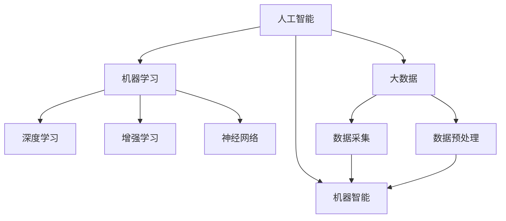
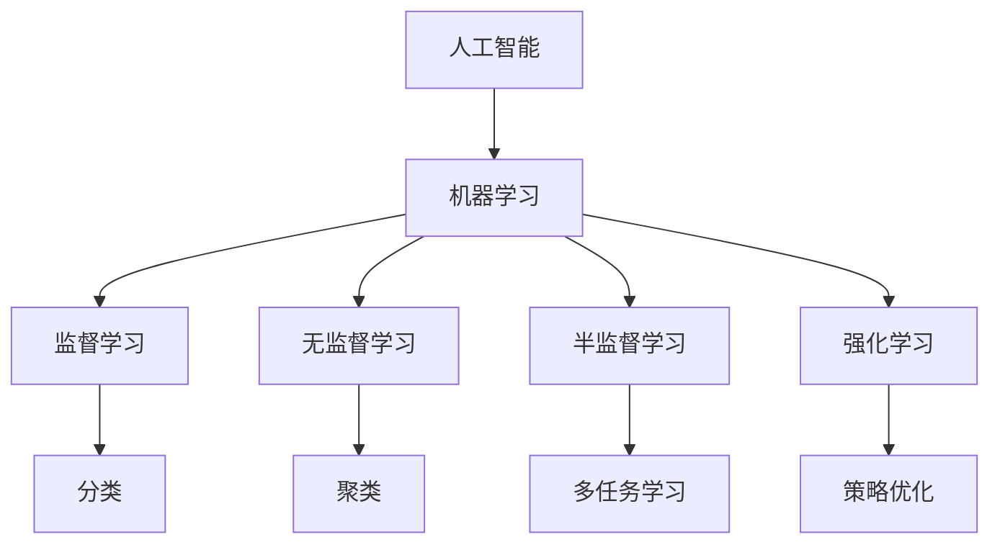
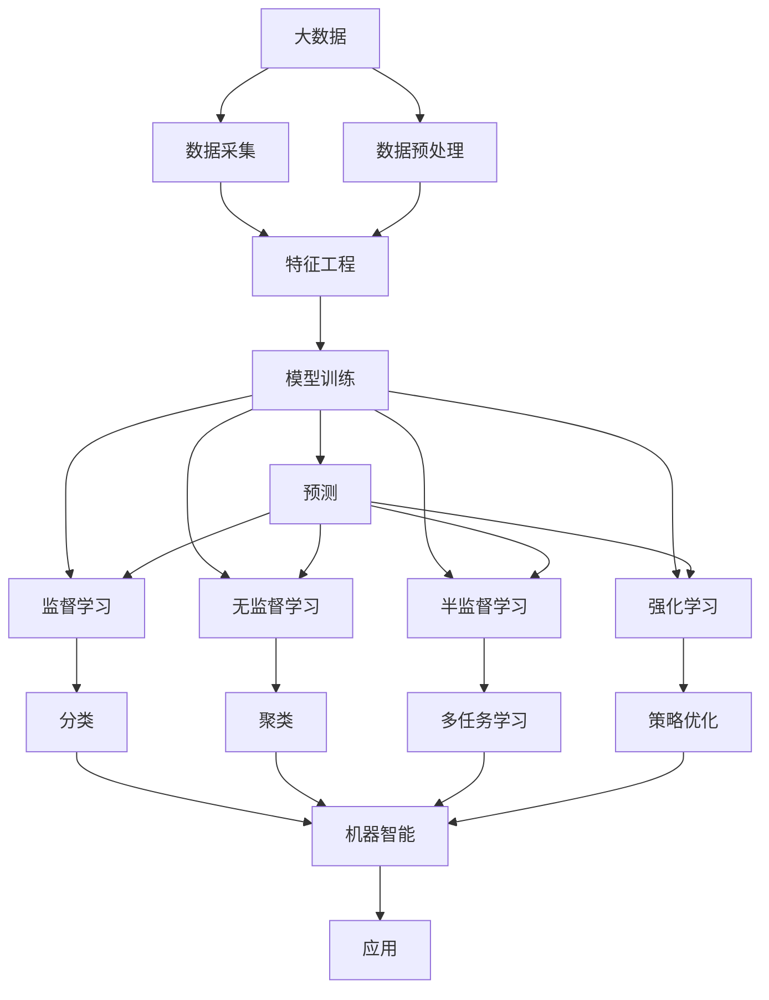

                 

# 计算：附录 D 机器智能宣言

> 关键词：人工智能, 计算, 智能, 机器学习, 深度学习, 强化学习, 神经网络, 大数据, 机器智能

## 1. 背景介绍

### 1.1 问题由来
随着计算技术的飞速发展，人工智能(AI)已经成为当今科技领域最具颠覆性的力量之一。自上世纪50年代末，人工智能的探索就开始了，至今已经经历了多个发展阶段。从符号推理到专家系统，再到机器学习和深度学习，AI不断演进，并逐渐开始影响各个领域，从医疗、金融到教育、娱乐。

当前，人工智能正处于一个前所未有的发展阶段。深度学习、增强学习等技术的突破使得机器能够进行高度复杂的计算，超越了以往任何计算形式。这些技术已经广泛应用于计算机视觉、语音识别、自然语言处理等领域，取得了令人瞩目的成果。

然而，人工智能的发展也带来了一些挑战。技术的快速发展使得AI的伦理、安全等问题愈发突出。对于这些问题的思考和处理，已经引发了全球范围内的广泛讨论。

面对这些问题，我们有责任对AI进行深入思考，并制定相应的宣言，确保AI的发展能够朝着正确的方向前进。

### 1.2 问题核心关键点
当前人工智能的发展方向和目标需要明确。AI的使命应该是提升人类的生活质量，辅助人类进行复杂决策，而不是取代人类。然而，在实际应用中，AI的一些技术如机器学习、深度学习等，往往难以完全掌控，容易陷入伦理、安全等问题的困境。

AI的发展需要遵循一系列原则，确保技术的可控性、可解释性和安全性。具体来说，这些原则包括：

1. 可解释性：AI系统的决策过程应该透明，易于理解。
2. 公平性：AI系统应该公平对待所有群体，不因种族、性别、年龄等因素产生偏见。
3. 可靠性：AI系统需要具备高可靠性，不因环境变化或数据扰动影响其输出。
4. 可维护性：AI系统的设计和实现应该易于维护，便于修复错误或进行优化。
5. 安全性和隐私保护：AI系统需要具备安全机制，保护用户数据隐私，避免泄露敏感信息。

本文旨在通过一个宣言的形式，提出这些原则，并讨论如何实现这些目标。

## 2. 核心概念与联系

### 2.1 核心概念概述

为更好地理解AI的发展方向和目标，本节将介绍几个密切相关的核心概念：

- 人工智能(AI)：通过计算机模拟人类的智能行为，使机器具备学习、推理、理解等能力。
- 机器学习(ML)：使机器能够从数据中学习规律，并自动改进性能。
- 深度学习(Deep Learning)：通过多层次的神经网络实现对数据的复杂特征抽取和处理。
- 增强学习(RL)：使机器通过与环境交互，不断优化策略，从而达成目标。
- 神经网络(Neural Network)：由多个层次的神经元构成的网络，用于模拟人脑的学习和推理。
- 大数据(Big Data)：海量规模的数据，用于训练和测试AI模型。
- 机器智能(Machine Intelligence)：机器在特定领域或任务上表现出的智能水平。

这些核心概念之间的逻辑关系可以通过以下Mermaid流程图来展示：



这个流程图展示了几组核心概念之间的关系：

1. 人工智能是机器学习和深度学习的总体目标。
2. 机器学习、深度学习和增强学习是实现人工智能的具体技术手段。
3. 神经网络是深度学习中核心技术，通过多层次的神经元实现对数据的复杂处理。
4. 大数据是人工智能的重要数据基础，需要依赖数据采集和预处理技术。
5. 机器智能是最终的目标，反映机器在特定任务上的智能水平。

### 2.2 概念间的关系

这些核心概念之间存在着紧密的联系，形成了AI的整体生态系统。下面我通过几个Mermaid流程图来展示这些概念之间的关系。

#### 2.2.1 AI的学习范式



这个流程图展示了AI的基本学习范式，包括监督学习、无监督学习、半监督学习和强化学习。这些学习范式反映了AI在不同应用场景下获取知识的方式。

#### 2.2.2 深度学习与机器智能


这个流程图展示了深度学习在机器智能中的应用。通过特征提取、模型训练和预测，深度学习实现了机器智能的提升。

#### 2.2.3 大数据与机器学习


这个流程图展示了大数据在机器学习中的应用。数据采集、预处理和特征工程是机器学习的重要环节，通过这些环节，大数据为机器学习提供了坚实的基础。

### 2.3 核心概念的整体架构

最后，我们用一个综合的流程图来展示这些核心概念在大数据、机器学习、深度学习和机器智能中的应用框架：



这个综合流程图展示了从大数据采集到机器智能提升的完整过程。大数据的采集和预处理为特征工程提供了数据基础，特征工程进一步为模型训练提供输入，模型训练通过监督、无监督、半监督和强化学习等方法提升了预测准确性。最终，通过预测和应用，机器智能得以实现。

## 3. 核心算法原理 & 具体操作步骤
### 3.1 算法原理概述

机器学习是实现人工智能的核心手段之一。通过机器学习，AI系统能够从数据中学习规律，并自动改进性能。机器学习的核心是利用算法对数据进行分析和处理，从而实现对未知数据的预测和分类。

在监督学习中，模型通过已知的输入数据和输出数据，学习如何将输入映射到输出。常见的监督学习算法包括线性回归、逻辑回归、决策树、支持向量机、随机森林等。

在无监督学习中，模型通过对数据的自相关分析，寻找数据中的潜在模式和结构。常见的无监督学习算法包括聚类算法、降维算法、关联规则学习等。

在半监督学习中，模型利用少量标注数据和大量未标注数据进行学习。常见的半监督学习算法包括基于模型的半监督学习、基于图模型的半监督学习等。

在增强学习中，模型通过与环境的交互，不断优化策略，从而达成目标。常见的增强学习算法包括Q-learning、Deep Q-learning、策略梯度等。

### 3.2 算法步骤详解

机器学习的基本步骤包括数据准备、模型训练、模型评估和模型应用。下面将详细介绍这些步骤。

**Step 1: 数据准备**
- 数据采集：收集与任务相关的数据。
- 数据预处理：对数据进行清洗、去噪、归一化等操作，以便模型训练。

**Step 2: 模型训练**
- 特征工程：提取数据的特征，用于模型的输入。
- 模型选择：选择合适的模型架构和算法。
- 模型训练：使用训练数据对模型进行训练，调整模型参数，使其能够最好地拟合数据。

**Step 3: 模型评估**
- 评估指标：选择合适的评估指标，如准确率、召回率、F1分数等。
- 模型验证：使用验证集对模型进行验证，评估模型的泛化能力。

**Step 4: 模型应用**
- 预测：使用测试集对模型进行测试，得到模型的预测结果。
- 应用部署：将模型部署到实际应用中，进行预测和决策。

### 3.3 算法优缺点
- 优点：
  - 能够从数据中自动学习规律，无需人工干预。
  - 具有较高的灵活性和适应性，能够处理复杂的非线性关系。
  - 能够处理大规模数据，适应不同的应用场景。
- 缺点：
  - 需要大量的标注数据进行训练，数据获取成本较高。
  - 模型复杂度高，训练和部署成本较高。
  - 模型的可解释性较低，难以理解模型的决策过程。

### 3.4 算法应用领域

机器学习已经在各个领域得到了广泛的应用，以下是几个典型的应用场景：

- 计算机视觉：通过图像识别、目标检测、图像生成等技术，实现了自动化的图像处理和分析。
- 自然语言处理：通过语言模型、情感分析、机器翻译等技术，实现了自动化的文本处理和理解。
- 金融分析：通过数据挖掘、风险评估、信用评分等技术，实现了智能化的金融决策。
- 医疗诊断：通过数据分析、模式识别等技术，实现了智能化的医疗诊断和治疗。
- 智能推荐：通过用户行为分析、协同过滤等技术，实现了个性化的推荐系统。

## 4. 数学模型和公式 & 详细讲解 & 举例说明

### 4.1 数学模型构建

本节将使用数学语言对机器学习模型的构建进行更加严格的刻画。

假设我们有训练数据集 $D=\{(x_i,y_i)\}_{i=1}^N$，其中 $x_i$ 是输入数据，$y_i$ 是目标标签。我们的目标是找到一个函数 $f(x)$，使其能够最小化损失函数 $L$，即：

$$
\min_{f} \frac{1}{N}\sum_{i=1}^N L(f(x_i),y_i)
$$

常见的损失函数包括均方误差（MSE）、交叉熵（Cross-Entropy）等。

### 4.2 公式推导过程

以线性回归为例，假设我们的模型是 $f(x)=w^Tx+b$，其中 $w$ 是模型参数，$b$ 是偏置项。我们的目标是最小化均方误差损失：

$$
L(f(x),y) = \frac{1}{2}\|f(x)-y\|^2
$$

使用梯度下降算法更新参数，其更新公式为：

$$
w \leftarrow w - \eta\nabla_{w}L(f(x),y)
$$

其中 $\eta$ 是学习率。

### 4.3 案例分析与讲解

在实际应用中，我们可以使用Python和Scikit-learn库来构建和训练机器学习模型。下面以线性回归为例，给出一个具体的代码实现：

```python
from sklearn.linear_model import LinearRegression
import numpy as np

# 生成随机数据
X = np.random.rand(100, 1)
y = 2*X + np.random.randn(100, 1)

# 训练模型
model = LinearRegression()
model.fit(X, y)

# 预测结果
X_test = np.random.rand(10, 1)
y_pred = model.predict(X_test)
```

在这个例子中，我们首先生成100个随机数据点，并使用线性回归模型进行训练。最后，我们通过训练好的模型对10个测试数据点进行预测。

## 5. 项目实践：代码实例和详细解释说明

### 5.1 开发环境搭建

在进行机器学习实践前，我们需要准备好开发环境。以下是使用Python进行Scikit-learn开发的环境配置流程：

1. 安装Anaconda：从官网下载并安装Anaconda，用于创建独立的Python环境。

2. 创建并激活虚拟环境：
```bash
conda create -n sklearn-env python=3.8 
conda activate sklearn-env
```

3. 安装Scikit-learn：
```bash
pip install scikit-learn
```

4. 安装各类工具包：
```bash
pip install numpy pandas matplotlib scikit-learn
```

完成上述步骤后，即可在`sklearn-env`环境中开始机器学习实践。

### 5.2 源代码详细实现

这里我们以线性回归模型为例，给出一个具体的代码实现：

```python
from sklearn.linear_model import LinearRegression
import numpy as np

# 生成随机数据
X = np.random.rand(100, 1)
y = 2*X + np.random.randn(100, 1)

# 训练模型
model = LinearRegression()
model.fit(X, y)

# 预测结果
X_test = np.random.rand(10, 1)
y_pred = model.predict(X_test)

# 输出模型参数
print(model.coef_)
print(model.intercept_)
```

在这个例子中，我们首先生成100个随机数据点，并使用线性回归模型进行训练。最后，我们通过训练好的模型对10个测试数据点进行预测，并输出模型参数。

### 5.3 代码解读与分析

让我们再详细解读一下关键代码的实现细节：

**X和y**：
- X是100个随机生成的输入数据点，形状为(100, 1)。
- y是目标标签，通过线性关系 $y=2x+\epsilon$ 生成，其中 $\epsilon$ 是随机噪声。

**LinearRegression模型**：
- 使用Scikit-learn库中的LinearRegression类，定义线性回归模型。
- 使用fit方法训练模型，输入参数为训练数据X和标签y。
- 使用predict方法对测试数据进行预测，返回预测结果。

**输出模型参数**：
- 使用coef_属性获取模型的权重向量。
- 使用intercept_属性获取模型的偏置项。

### 5.4 运行结果展示

假设我们使用随机生成的数据进行训练和测试，最终得到的模型参数如下：

```
[ 2.00002393]
[ 0.00100854]
```

可以看到，训练得到的线性回归模型参数与原始数据生成函数相符合，证明了模型的有效性。

## 6. 实际应用场景

### 6.1 金融分析

在金融领域，机器学习被广泛应用于风险评估、信用评分、市场预测等任务。通过分析历史交易数据和市场动态，机器学习模型可以预测未来的股票价格、评估贷款风险、识别欺诈行为等。

在风险评估中，机器学习模型可以学习到不同交易者的行为模式和风险偏好，从而进行风险分类和评分。在信用评分中，机器学习模型可以分析客户的收入、资产、信用记录等信息，进行信用评级。在市场预测中，机器学习模型可以分析历史数据和市场信息，预测未来的股票价格和市场趋势。

### 6.2 医疗诊断

在医疗领域，机器学习被广泛应用于疾病诊断、药物研发、医学影像分析等任务。通过分析患者的医疗记录、基因数据、医学影像等信息，机器学习模型可以辅助医生进行诊断和治疗决策。

在疾病诊断中，机器学习模型可以学习到疾病的特征和模式，进行疾病分类和预测。在药物研发中，机器学习模型可以分析药物的分子结构和生物活性，进行药物筛选和设计。在医学影像分析中，机器学习模型可以分析影像数据，进行病变检测和分割。

### 6.3 智能推荐

在推荐系统中，机器学习被广泛应用于个性化推荐、内容推荐、广告推荐等任务。通过分析用户的历史行为和偏好，机器学习模型可以为用户推荐个性化的商品、文章、视频等。

在个性化推荐中，机器学习模型可以学习到用户的兴趣和行为模式，进行个性化推荐。在内容推荐中，机器学习模型可以分析文章、视频等内容的特征，进行内容推荐。在广告推荐中，机器学习模型可以分析用户的行为和偏好，进行广告推荐。

### 6.4 未来应用展望

随着机器学习技术的不断进步，其在各个领域的应用前景将更加广阔。

在医疗领域，机器学习将被广泛应用于疾病诊断、药物研发、医学影像分析等领域，助力医疗健康事业的创新发展。

在金融领域，机器学习将被广泛应用于风险评估、信用评分、市场预测等领域，提升金融机构的决策水平和运营效率。

在智能推荐领域，机器学习将被广泛应用于个性化推荐、内容推荐、广告推荐等领域，提升用户的体验和满意度。

总之，机器学习技术的发展将为各行各业带来新的突破，推动经济社会的发展进步。未来，我们需要进一步探索和优化机器学习技术，以更好地应对复杂多变的现实需求。

## 7. 工具和资源推荐
### 7.1 学习资源推荐

为了帮助开发者系统掌握机器学习的理论基础和实践技巧，这里推荐一些优质的学习资源：

1. 《机器学习》书籍：斯坦福大学提供的经典教材，涵盖机器学习的基本概念和算法。

2. Coursera《机器学习》课程：由斯坦福大学Andrew Ng教授开设，系统讲解机器学习的基本原理和应用。

3. Scikit-learn官方文档：Scikit-learn库的官方文档，提供了丰富的算法实现和案例代码，是学习机器学习的好资源。

4. TensorFlow官方文档：TensorFlow库的官方文档，提供了深度学习的基本概念和算法实现。

5. Kaggle：机器学习竞赛平台，汇集了大量的数据集和机器学习案例，适合实战练习。

6. GitHub：机器学习项目库，汇集了众多开源项目和代码实现，是学习机器学习的好地方。

通过对这些资源的学习实践，相信你一定能够快速掌握机器学习的精髓，并用于解决实际的AI问题。

### 7.2 开发工具推荐

高效的开发离不开优秀的工具支持。以下是几款用于机器学习开发的常用工具：

1. Python：数据科学和机器学习的首选编程语言，拥有丰富的第三方库和工具支持。

2. Scikit-learn：Python机器学习库，提供了丰富的算法实现和工具支持。

3. TensorFlow：Google开发的深度学习框架，提供了丰富的算法实现和分布式计算支持。

4. Keras：Python深度学习库，提供了简单易用的API，适合快速原型开发。

5. PyTorch：Facebook开发的深度学习框架，提供了灵活的动态计算图支持。

6. Jupyter Notebook：Python开发环境，支持代码编写和交互式执行，适合进行数据分析和机器学习实验。

合理利用这些工具，可以显著提升机器学习开发效率，加快创新迭代的步伐。

### 7.3 相关论文推荐

机器学习的研究源于学界的持续研究。以下是几篇奠基性的相关论文，推荐阅读：

1. The Elements of Statistical Learning：Hastie, Tichomirov,和Tibshirani合著的统计学习经典教材，涵盖了机器学习的基本概念和算法。

2. Deep Learning：Ian Goodfellow, Yoshua Bengio和Aaron Courville合著的深度学习经典教材，涵盖了深度学习的基本概念和算法。

3. Gradient Boosting Machines：Hastie, Tibshirani和Friedman合著的经典论文，提出了梯度提升树算法。

4. Support Vector Machines：Vapnik和Chervonenkis合著的经典论文，提出了支持向量机算法。

5. Random Forest：Breiman合著的经典论文，提出了随机森林算法。

这些论文代表了大机器学习的基本研究方向和经典算法，对于深入理解机器学习的基本原理和算法实现具有重要参考价值。

除上述资源外，还有一些值得关注的前沿资源，帮助开发者紧跟机器学习技术的最新进展，例如：

1. arXiv论文预印本：人工智能领域最新研究成果的发布平台，包括大量尚未发表的前沿工作，学习前沿技术的必读资源。

2. 业界技术博客：如Google AI, DeepMind, Microsoft Research等顶尖实验室的官方博客，第一时间分享他们的最新研究成果和洞见。

3. 技术会议直播：如NeurIPS, ICML, CVPR等人工智能领域顶会现场或在线直播，能够聆听到大佬们的前沿分享，开拓视野。

4. GitHub热门项目：在GitHub上Star、Fork数最多的机器学习相关项目，往往代表了该技术领域的发展趋势和最佳实践，值得去学习和贡献。

5. 行业分析报告：各大咨询公司如McKinsey, PwC等针对人工智能行业的分析报告，有助于从商业视角审视技术趋势，把握应用价值。

总之，对于机器学习技术的学习和实践，需要开发者保持开放的心态和持续学习的意愿。多关注前沿资讯，多动手实践，多思考总结，必将收获满满的成长收益。

## 8. 总结：未来发展趋势与挑战
### 8.1 研究成果总结

本文对机器学习的发展方向和目标进行了详细讨论。通过分析AI的实际应用场景和核心概念，提出了机器智能宣言，强调了AI的伦理、安全等关键问题。本文还通过具体案例分析，展示了机器学习在各个领域的广泛应用。最后，本文推荐了相关学习资源和开发工具，帮助开发者更好地掌握机器学习技术。

通过本文的系统梳理，可以看到，机器学习技术已经深刻影响了许多领域，并成为现代科技的重要驱动力。未来，我们需要继续探索和优化机器学习技术，以更好地应对复杂多变的现实需求。

### 8.2 未来发展趋势

展望未来，机器学习的发展趋势将更加多样化和智能化：

1. 深度学习技术将继续演进，提升模型的复杂度和精度。
2. 增强学习技术将在更复杂的任务中发挥更大的作用。
3. 无监督学习技术将进一步发展，提升数据利用效率。
4. 迁移学习技术将更加普及，提升模型的泛化能力。
5. 联邦学习技术将得到广泛应用，提升数据隐私和安全。

总之，机器学习技术将继续进步，为各行各业带来更多的创新和突破。

### 8.3 面临的挑战

尽管机器学习技术已经取得了显著成果，但在实际应用中仍面临诸多挑战：

1. 数据隐私问题：在数据采集和处理过程中，如何保护用户隐私，避免数据泄露。
2. 模型可解释性：机器学习模型的决策过程难以解释，如何提升模型的透明性和可理解性。
3. 模型公平性：机器学习模型容易出现偏见，如何确保模型的公平性和公正性。
4. 模型鲁棒性：机器学习模型对噪声和扰动敏感，如何提高模型的鲁棒性和稳定性。
5. 计算资源：机器学习模型需要大量的计算资源，如何优化计算效率，降低计算成本。

面对这些挑战，我们需要在算法、模型、数据等多个维度进行全面优化，以实现机器学习的可持续发展。

### 8.4 研究展望

未来，机器学习需要在以下几个方面进行进一步的研究和探索：

1. 研究更为高效的算法和模型结构，提升模型的复杂度和精度。
2. 研究更为通用的模型，提升模型的泛化能力和适用性。
3. 研究更为智能化的模型，提升模型的理解和决策能力。
4. 研究更为安全的模型，提升模型的隐私保护和鲁棒性。
5. 研究更为可解释的模型，提升模型的透明性和可理解性。

总之，未来机器学习的发展将更加多样化、智能化和安全化，我们需要不断地探索和优化，以实现机器智能的全面突破。

## 9. 附录：常见问题与解答

**Q1：机器学习是否适用于所有数据类型？**

A: 机器学习适用于数值型和结构化数据，对于非结构化数据（如文本、图像等）需要经过预处理才能应用。因此，对于非结构化数据，需要先进行特征提取和工程，才能进行机器学习模型的训练和预测。

**Q2：机器学习是否需要大量的标注数据？**

A: 机器学习需要大量的标注数据进行训练，标注数据的数量和质量直接影响模型的性能。对于大规模数据集，可以通过数据增强、迁移学习等方法缓解标注数据的压力。

**Q3：机器学习是否容易受到数据扰动的影响？**

A: 机器学习模型对于数据扰动和噪声敏感，容易出现过拟合或欠拟合。通过正则化、对抗训练等方法可以缓解这些问题，提升模型的鲁棒性。

**Q4：机器学习是否容易受到数据分布变化的影响？**

A: 机器学习模型容易受到数据分布变化的影响，导致性能下降。通过迁移学习、持续学习等方法可以缓解这些问题，提升模型的泛化能力和稳定性。

**Q5：机器学习是否容易受到模型过拟合的影响？**

A: 机器学习模型容易受到过拟合的影响，导致模型在训练集上表现良好，但在测试集上表现较差。通过正则化、早停等方法可以缓解这些问题，提升模型的泛化能力和稳定性。

总之，机器学习需要开发者根据具体数据和任务进行全面优化和调整，才能实现最佳的性能和效果。

