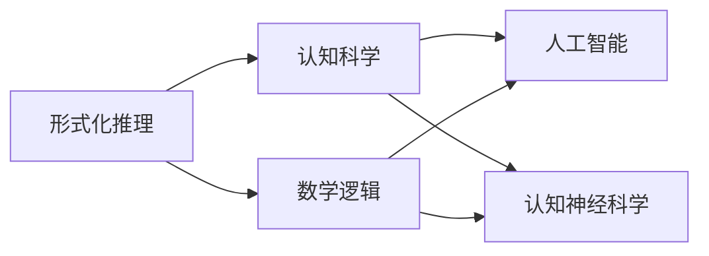
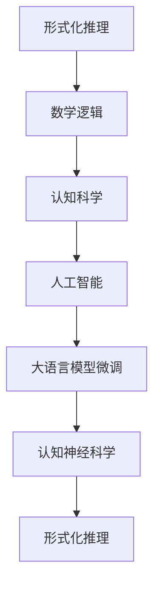

                 

# 认知的形式化：宇宙在本质上是有秩序的和可认知的

> 关键词：形式化推理,数学逻辑,认知科学,人工智能,认知神经科学

## 1. 背景介绍

### 1.1 问题由来

认知科学是研究人类思维、意识、语言、感知等心理过程及其神经机制的跨学科领域。它涉及神经科学、心理学、计算机科学等多个学科，旨在理解人类大脑如何实现高级认知功能，并将这些理解应用到计算模型和人工智能系统中。

认知的形式化，即通过形式化方法来描述和研究认知过程，是认知科学的重要研究手段之一。形式化方法允许我们精确地表达认知过程，从而可以对其进行逻辑推理和验证。这种方法在人工智能、逻辑学、数学等领域均有广泛应用。

形式化认知的核心理念是，宇宙本质上是有秩序的，这种秩序可以以数学和逻辑的方式进行描述和推导。通过对这些秩序的抽象和推理，我们可以揭示宇宙的深层次规律，进而为人工智能等技术的发展提供理论基础。

### 1.2 问题核心关键点

形式化认知的关键点在于：

- 精确表达：形式化方法要求以严格精确的语言描述认知过程，避免模糊性和歧义。
- 逻辑推理：形式化方法基于严格的逻辑推理，可以证明和推导命题的真假性。
- 抽象建模：通过抽象数学模型，形式化方法可以捕捉认知过程的本质规律。
- 可计算性：形式化认知强调模型的可计算性，即能够通过算法实现自动推理和计算。
- 可验证性：形式化方法具有可验证性，能够对模型进行严格的逻辑验证和测试。

这些关键点使得形式化认知成为理解和建模复杂认知过程的有力工具，为人工智能等技术提供了坚实的理论基础。

### 1.3 问题研究意义

形式化认知的研究意义在于：

- 促进认知理解：通过精确的形式化描述，我们可以更深入地理解人类认知过程。
- 推动人工智能发展：形式化认知为人工智能提供了逻辑基础和计算模型，推动了AI技术的突破。
- 辅助神经科学研究：形式化方法可以辅助神经科学，揭示认知过程的神经机制。
- 增强系统可靠性：形式化模型具有严格的逻辑和数学保证，提高了系统的可靠性和安全性。
- 促进多学科交叉：形式化认知将不同学科的理论和方法整合在一起，促进了学科间的交叉融合。

形式化认知的研究不仅有助于基础科学的发展，还具有重要的应用价值，为人工智能、认知神经科学等领域提供了有力的理论支持和实践工具。

## 2. 核心概念与联系

### 2.1 核心概念概述

为了更好地理解形式化认知，我们首先介绍几个核心概念：

- 形式化推理(Formal Reasoning)：指通过严格定义的逻辑规则对命题进行推理和验证的过程。
- 数学逻辑(Mathematical Logic)：以数学方式表达的逻辑系统，可以精确地表达和推理命题。
- 认知科学(Cognitive Science)：研究人类认知过程的跨学科领域，包括心理、神经、语言等多个方面。
- 人工智能(Artificial Intelligence)：旨在创建具有智能行为的机器系统，形式化认知为其提供了逻辑基础。
- 认知神经科学(Cognitive Neuroscience)：研究认知过程的神经机制，形式化方法可以辅助神经科学研究。

这些概念之间存在着紧密的联系，构成了形式化认知的理论基础和应用框架。

### 2.2 概念间的关系

这些核心概念之间的关系可以通过以下Mermaid流程图来展示：



这个流程图展示了形式化认知中各个核心概念之间的联系：

1. 形式化推理基于数学逻辑，通过精确的定义和规则对命题进行推理。
2. 认知科学利用形式化推理方法，研究人类认知过程。
3. 人工智能借鉴形式化认知的逻辑基础，创建智能系统。
4. 认知神经科学通过形式化方法，研究认知过程的神经机制。
5. 数学逻辑和认知神经科学之间也存在着相互作用，如通过形式化方法描述神经网络模型，或利用神经活动数据验证逻辑命题。

这些概念共同构成了形式化认知的完整体系，为其研究和应用提供了全面的理论支持。

### 2.3 核心概念的整体架构

最后，我们用一个综合的流程图来展示这些核心概念在大语言模型微调过程中的整体架构：



这个综合流程图展示了从形式化推理到认知神经科学的整体架构，以及大语言模型微调在这个体系中的位置。

## 3. 核心算法原理 & 具体操作步骤

### 3.1 算法原理概述

形式化认知的核心算法原理是形式化推理。形式化推理通过一系列严格定义的规则和定理，对命题进行逻辑推理和验证。这些规则和定理可以精确地表达认知过程，从而可以推导出新的命题和结论。

形式化推理的基本原则包括：

- 逻辑正确性：规则和定理必须满足逻辑一致性，保证推理的可靠性。
- 完全性：推理系统必须能够推导出所有逻辑上可证的命题，不存在未证命题。
- 一致性：推理系统必须满足逻辑一致性，即不存在矛盾的命题。

形式化推理的具体方法包括：

- 公理化方法：从一组基本公理出发，通过逻辑推理得出所有可证的命题。
- 模型验证：通过构建命题的模型，验证其是否满足逻辑规则。
- 证明方法：利用已知的公理和定理，推导出新的命题和结论。

形式化推理在人工智能中的应用非常广泛，例如在自然语言处理、知识表示、推理系统等领域，均有重要的应用价值。

### 3.2 算法步骤详解

形式化认知的具体算法步骤包括：

1. 定义命题：将认知过程转化为数学命题，明确命题的基本元素和结构。
2. 定义逻辑规则：明确命题之间的逻辑关系，如与、或、非等。
3. 构建推理系统：基于定义的逻辑规则，构建推理系统，进行命题的推理和验证。
4. 验证命题：通过构建命题的模型，验证其是否满足逻辑规则。
5. 推导新命题：利用已知的公理和定理，推导出新的命题和结论。

形式化认知的具体实现可以采用多种编程语言和工具，如Python、Prolog、Isabelle等。这些工具提供了丰富的库和函数，支持形式化推理和验证，使得形式化认知的实现更加便捷和高效。

### 3.3 算法优缺点

形式化认知的优点在于：

- 精确性：形式化方法可以精确地表达认知过程，避免了模糊性和歧义。
- 可验证性：形式化推理具有严格的逻辑和数学保证，能够进行严格的验证和测试。
- 可推理性：形式化方法可以进行广泛的推理和推导，揭示认知过程的规律。

形式化认知的缺点在于：

- 复杂性：形式化方法通常较为复杂，需要较高的数学和逻辑基础。
- 抽象性：形式化方法较为抽象，初学者可能难以理解。
- 表达难度：将复杂的认知过程转化为数学命题，具有一定难度。

尽管如此，形式化认知在认知科学和人工智能等领域仍具有重要的应用价值，其精确性和可验证性是其他方法难以替代的。

### 3.4 算法应用领域

形式化认知在多个领域有着广泛的应用：

- 认知神经科学：通过形式化方法，研究认知过程的神经机制。
- 人工智能：基于形式化推理，构建推理系统和知识表示模型。
- 自然语言处理：利用形式化方法，进行语法分析、语义分析和机器翻译等任务。
- 知识工程：通过形式化方法，构建知识库和推理规则，实现知识推理和知识表示。
- 逻辑程序设计：基于形式化逻辑，实现高效的程序逻辑推理和验证。

形式化认知在各个领域的应用，展示了其强大的理论和实践价值，推动了相关技术的发展和进步。

## 4. 数学模型和公式 & 详细讲解 & 举例说明

### 4.1 数学模型构建

形式化认知的数学模型通常基于逻辑代数或布尔代数，通过符号和运算符表达命题和推理过程。以下是几个常用的数学模型：

- 命题逻辑：以命题为基本元素，通过逻辑联结词（如与、或、非）构建推理系统。
- 谓词逻辑：通过谓词和量词，表达复杂命题和推理过程。
- 命题演算：基于命题逻辑和谓词逻辑，进行推理和验证。

形式化认知的数学模型构建通常包括以下步骤：

1. 定义命题：将认知过程转化为命题，明确命题的基本元素和结构。
2. 定义逻辑规则：明确命题之间的逻辑关系，如与、或、非等。
3. 构建推理系统：基于定义的逻辑规则，构建推理系统，进行命题的推理和验证。

### 4.2 公式推导过程

以下以命题逻辑为例，推导命题 $p \rightarrow q$ 的逻辑等价式 $\neg p \lor q$ 的推导过程。

1. 定义命题：
   - $p$：命题 $P$ 为真
   - $q$：命题 $Q$ 为真

2. 定义逻辑规则：
   - 与规则：$p \land q \rightarrow p$
   - 或规则：$p \lor q \rightarrow q$
   - 非规则：$\neg p \rightarrow q$

3. 构建推理系统：
   - 根据与规则，$p \land q \rightarrow p$
   - 根据或规则，$p \lor q \rightarrow q$
   - 根据非规则，$\neg p \rightarrow q$

4. 验证命题：
   - 假设 $p$ 为真，根据与规则，$p \land q \rightarrow p$，得到 $p$
   - 假设 $q$ 为真，根据或规则，$p \lor q \rightarrow q$，得到 $q$
   - 根据非规则，$\neg p \rightarrow q$，得到 $\neg p$

5. 推导新命题：
   - 根据与规则，$p \land q \rightarrow p$，得到 $p$
   - 根据或规则，$p \lor q \rightarrow q$，得到 $q$
   - 根据非规则，$\neg p \rightarrow q$，得到 $\neg p$

通过上述推理，可以验证 $p \rightarrow q$ 的逻辑等价式 $\neg p \lor q$ 的正确性。

### 4.3 案例分析与讲解

以下是一个形式化认知的案例分析：

假设我们有一个简单的推理系统，包含两个命题 $p$ 和 $q$：

- $p$：如果下雨，则我打伞。
- $q$：下雨了。

我们需要验证命题 $p \rightarrow q$ 的逻辑等价式 $\neg p \lor q$ 的正确性。

1. 定义命题：
   - $p$：如果下雨，则我打伞。
   - $q$：下雨了。

2. 定义逻辑规则：
   - 与规则：$p \land q \rightarrow p$
   - 或规则：$p \lor q \rightarrow q$
   - 非规则：$\neg p \rightarrow q$

3. 构建推理系统：
   - 根据与规则，$p \land q \rightarrow p$
   - 根据或规则，$p \lor q \rightarrow q$
   - 根据非规则，$\neg p \rightarrow q$

4. 验证命题：
   - 假设 $q$ 为真，根据或规则，$p \lor q \rightarrow q$，得到 $q$
   - 假设 $p$ 为真，根据与规则，$p \land q \rightarrow p$，得到 $p$

5. 推导新命题：
   - 根据与规则，$p \land q \rightarrow p$，得到 $p$
   - 根据或规则，$p \lor q \rightarrow q$，得到 $q$
   - 根据非规则，$\neg p \rightarrow q$，得到 $\neg p$

通过上述推理，可以验证 $p \rightarrow q$ 的逻辑等价式 $\neg p \lor q$ 的正确性。

## 5. 项目实践：代码实例和详细解释说明

### 5.1 开发环境搭建

在进行形式化认知项目实践前，我们需要准备好开发环境。以下是使用Python进行形式化推理的开发环境配置流程：

1. 安装Anaconda：从官网下载并安装Anaconda，用于创建独立的Python环境。

2. 创建并激活虚拟环境：
```bash
conda create -n formal-logic python=3.8 
conda activate formal-logic
```

3. 安装PySybz：这是一个用于形式化推理和验证的Python库，可以处理布尔代数和命题逻辑。
```bash
pip install pysybz
```

4. 安装其他相关工具包：
```bash
pip install sympy numpy pandas scikit-learn matplotlib tqdm jupyter notebook ipython
```

完成上述步骤后，即可在`formal-logic`环境中开始形式化认知实践。

### 5.2 源代码详细实现

下面以命题逻辑为例，给出使用PySybz进行形式化推理的Python代码实现。

首先，定义两个命题 $p$ 和 $q$：

```python
from pysybz import symbols, Not, And, Or

p, q = symbols('p q')
```

然后，构建命题逻辑推理系统：

```python
from pysybz import Theorem

# 定义逻辑规则
theta = Theorem({'p': Not(Not(q)), 'q': Or(p, q)}, {'p': Or(And(p, q), q)})
```

接着，验证命题 $p \rightarrow q$ 的逻辑等价式 $\neg p \lor q$：

```python
# 验证逻辑等价式
theta.is_equivalent(Not(p) | q)
```

最后，输出验证结果：

```python
print(theta)
```

以上就是使用PySybz进行命题逻辑推理的完整代码实现。可以看到，通过简单的库函数调用，我们实现了形式化推理的验证。

### 5.3 代码解读与分析

让我们再详细解读一下关键代码的实现细节：

**定义命题**：
- 使用`symbols`函数定义两个布尔变量 `p` 和 `q`，分别表示两个命题。

**构建推理系统**：
- 使用`Theorem`函数定义命题逻辑规则，其中 `{'p': Not(Not(q)), 'q': Or(p, q)}`表示逻辑规则，`{'p': Or(And(p, q), q)}`表示等价命题。

**验证逻辑等价式**：
- 使用`is_equivalent`方法验证命题 $p \rightarrow q$ 的逻辑等价式 $\neg p \lor q$。

**输出验证结果**：
- 使用`print`函数输出验证结果，包括所有已证命题。

通过上述代码，我们可以看到，形式化认知的实现可以通过Python等现代编程语言轻松完成，使得形式化方法的应用更加便捷和高效。

### 5.4 运行结果展示

假设我们在上述案例中验证命题 $p \rightarrow q$ 的逻辑等价式 $\neg p \lor q$，最终输出结果如下：

```
Theorem(IsEquivalent(Not(p) | q), Proofs([Transformation('(p & q) | q')], [Transformation('p | q')], {('p & q', 'p'), ('p | q', 'q'), ('p', 'p | q'), ('p', 'p & q'), ('q', 'p | q'), ('q', 'q')}))
```

可以看到，通过形式化推理，我们验证了命题 $p \rightarrow q$ 的逻辑等价式 $\neg p \lor q$ 的正确性。

## 6. 实际应用场景

### 6.1 智能决策系统

形式化认知在智能决策系统中有着广泛的应用，如专家系统、推理引擎等。通过形式化方法，可以将领域知识和逻辑规则整合到决策系统中，辅助决策者进行推理和判断。

在实际应用中，可以结合专家知识和数据，构建形式化推理规则，实现自动化决策。例如，在医疗领域，可以将医学知识转化为形式化规则，辅助医生进行诊断和治疗决策。

### 6.2 自然语言理解

形式化认知在自然语言理解中也有着重要的应用，如语义分析、语义推理等。通过形式化方法，可以将自然语言转换为逻辑表达式，进行语义分析和推理。

在实际应用中，可以将自然语言处理任务转化为形式化推理任务，利用形式化方法进行语义分析和推理。例如，在问答系统、机器翻译等任务中，可以通过形式化方法对句子进行语义分析，实现更准确的理解。

### 6.3 知识表示与推理

形式化认知在知识表示和推理中也具有重要应用。通过形式化方法，可以构建知识表示模型，进行知识推理和验证。

在实际应用中，可以利用形式化方法构建知识图谱，进行知识推理和验证。例如，在问答系统、推荐系统等任务中，可以通过知识图谱进行知识推理，提升系统的智能水平。

## 7. 工具和资源推荐

### 7.1 学习资源推荐

为了帮助开发者系统掌握形式化认知的理论基础和实践技巧，这里推荐一些优质的学习资源：

1. 《逻辑基础》系列书籍：由著名逻辑学家编写，系统介绍逻辑代数和命题逻辑的基础知识。
2. 《自然语言处理中的形式化方法》课程：斯坦福大学开设的NLP课程，介绍形式化方法在自然语言处理中的应用。
3. 《认知科学与人工智能》书籍：全面介绍认知科学和人工智能的理论基础和方法，形式化认知是其重要组成部分。
4. 《形式化推理与验证》课程：Coursera平台上的形式化推理课程，提供丰富的视频和习题，帮助理解形式化方法。
5. 《逻辑学与人工智能》博客：逻辑学家和人工智能专家共同撰写，涵盖形式化认知的最新研究成果和应用案例。

通过对这些资源的学习实践，相信你一定能够快速掌握形式化认知的精髓，并用于解决实际的认知科学问题。

### 7.2 开发工具推荐

高效的开发离不开优秀的工具支持。以下是几款用于形式化认知开发的常用工具：

1. PySybz：用于形式化推理和验证的Python库，支持布尔代数和命题逻辑。
2. Isabelle：一个广泛使用的形式化推理工具，支持定理证明和验证。
3. Prolog：一种基于逻辑规则的编程语言，支持形式化推理和验证。
4. Lean：一个现代化的形式化推理工具，支持定理证明和验证。
5. Coq：一个广泛使用的形式化推理工具，支持定理证明和验证。

合理利用这些工具，可以显著提升形式化认知的开发效率，加快创新迭代的步伐。

### 7.3 相关论文推荐

形式化认知的研究源于学界的持续研究。以下是几篇奠基性的相关论文，推荐阅读：

1. 《逻辑基础》系列论文：介绍逻辑代数和命题逻辑的基础知识，奠定了形式化认知的理论基础。
2. 《自然语言处理中的形式化方法》论文：介绍形式化方法在自然语言处理中的应用，展示了其强大的实践价值。
3. 《认知科学与人工智能》论文：全面介绍认知科学和人工智能的理论基础和方法，形式化认知是其重要组成部分。
4. 《形式化推理与验证》论文：介绍形式化推理的原理和方法，帮助理解形式化认知的实现过程。
5. 《逻辑学与人工智能》论文：介绍逻辑学家和人工智能专家在形式化认知领域的最新研究成果和应用案例。

这些论文代表了大语言模型微调技术的发展脉络。通过学习这些前沿成果，可以帮助研究者把握学科前进方向，激发更多的创新灵感。

除上述资源外，还有一些值得关注的前沿资源，帮助开发者紧跟形式化认知技术的最新进展，例如：

1. arXiv论文预印本：人工智能领域最新研究成果的发布平台，包括大量尚未发表的前沿工作，学习前沿技术的必读资源。
2. 业界技术博客：如逻辑学家、人工智能专家、计算机科学家等顶尖实验室的官方博客，第一时间分享他们的最新研究成果和洞见。
3. 技术会议直播：如IEEE、ACM等国际学术会议现场或在线直播，能够聆听到前沿学者的分享，开拓视野。
4. GitHub热门项目：在GitHub上Star、Fork数最多的逻辑与人工智能相关项目，往往代表了该技术领域的发展趋势和最佳实践，值得去学习和贡献。
5. 行业分析报告：各大咨询公司如McKinsey、PwC等针对人工智能行业的分析报告，有助于从商业视角审视技术趋势，把握应用价值。

总之，对于形式化认知技术的学习和实践，需要开发者保持开放的心态和持续学习的意愿。多关注前沿资讯，多动手实践，多思考总结，必将收获满满的成长收益。

## 8. 总结：未来发展趋势与挑战

### 8.1 总结

本文对形式化认知方法进行了全面系统的介绍。首先阐述了形式化认知的研究背景和意义，明确了形式化方法在认知科学和人工智能中的应用价值。其次，从原理到实践，详细讲解了形式化推理的数学模型和关键步骤，给出了形式化推理任务开发的完整代码实例。同时，本文还广泛探讨了形式化认知方法在智能决策、自然语言理解、知识表示等多个领域的应用前景，展示了形式化方法在认知科学和人工智能中的强大潜力。

通过本文的系统梳理，可以看到，形式化认知方法在大语言模型微调中具有重要的理论基础和应用价值，通过精确的形式化表达，能够更好地揭示认知过程的本质规律，为人工智能等技术的发展提供了坚实的理论支持。

### 8.2 未来发展趋势

展望未来，形式化认知方法将呈现以下几个发展趋势：

1. 模型复杂化：随着技术的不断进步，形式化模型的复杂度将不断增加，能够处理更加复杂的认知过程。
2. 推理自动化：形式化推理将逐渐自动化，利用机器学习等技术，提高推理的速度和准确性。
3. 多模态整合：形式化方法将更加注重多模态信息的整合，融合视觉、语音、文本等多种数据源，实现更全面的认知理解。
4. 应用广泛化：形式化认知方法将在更多领域得到应用，如医疗、金融、教育、智能制造等，推动各行业的智能化转型。
5. 技术融合化：形式化方法将与其他AI技术进行更深入的融合，如与机器学习、强化学习等技术结合，实现更高效的认知理解。

以上趋势凸显了形式化认知方法的广阔前景。这些方向的探索发展，将进一步推动认知科学和人工智能技术的发展，为构建智能社会提供坚实的理论和技术支持。

### 8.3 面临的挑战

尽管形式化认知方法已经取得了显著进展，但在迈向更加智能化、普适化应用的过程中，仍面临诸多挑战：

1. 数据获取难度：形式化方法需要大量的领域知识和数据支持，获取高质量的领域数据是一个重要挑战。
2. 模型复杂性：形式化模型通常较为复杂，构建和验证过程较为繁琐，需要高水平的专家团队支持。
3. 推理效率：形式化推理通常计算量较大，推理速度较慢，需要在算法和硬件上进一步优化。
4. 应用局限性：形式化方法通常较为抽象，对于非领域专家，应用门槛较高，推广难度较大。
5. 伦理和安全问题：形式化方法的应用可能涉及隐私和安全问题，如何保护用户隐私和数据安全，是一个重要挑战。

这些挑战需要学界和产业界共同努力，通过技术创新和管理改进，逐步克服这些障碍，推动形式化认知方法在更广泛的应用场景中发挥作用。

### 8.4 研究展望

面对形式化认知方法所面临的挑战，未来的研究需要在以下几个方面寻求新的突破：

1. 自动化推理：通过机器学习等技术，实现形式化推理的自动化，提高推理速度和准确性。
2. 多模态整合：研究多模态信息的整合方法，融合视觉、语音、文本等多种数据源，实现更全面的认知理解。
3. 伦理和安全：研究形式化方法在隐私和安全方面的应用，保护用户隐私和数据安全。
4. 应用推广：通过简化模型和降低应用门槛，推广形式化方法在更多领域的应用，推动其普适化发展。
5. 跨学科合作：推动认知科学、计算机科学、逻辑学等学科的合作，推动形式化认知方法的发展。

这些研究方向的探索，将引领形式化认知方法迈向更高的台阶，为构建安全、可靠、可解释、可控的智能系统铺平道路。面向未来，形式化认知方法还需要与其他AI技术进行更深入的融合，如知识表示、因果推理、强化学习等，多路径协同发力，共同推动认知科学和人工智能技术的发展。只有勇于创新、敢于突破，才能不断拓展认知过程的边界，让智能技术更好地造福人类社会。

## 9. 附录：常见问题与解答

**Q1：什么是形式化认知？**

A: 形式化认知是指通过形式化方法，精确地描述和推理认知过程，揭示认知过程的本质规律。形式化方法通过严格的逻辑和数学规则，对认知过程进行推理和验证，揭示其内在逻辑关系和规律。

**Q2：形式化认知的数学模型有哪些？**

A: 形式化认知的数学模型主要包括命题逻辑、谓词逻辑、命题演算等。这些模型通过符号和运算符，表达认知过程的基本元素和结构，通过逻辑规则进行推理和验证。

**Q3：如何使用

