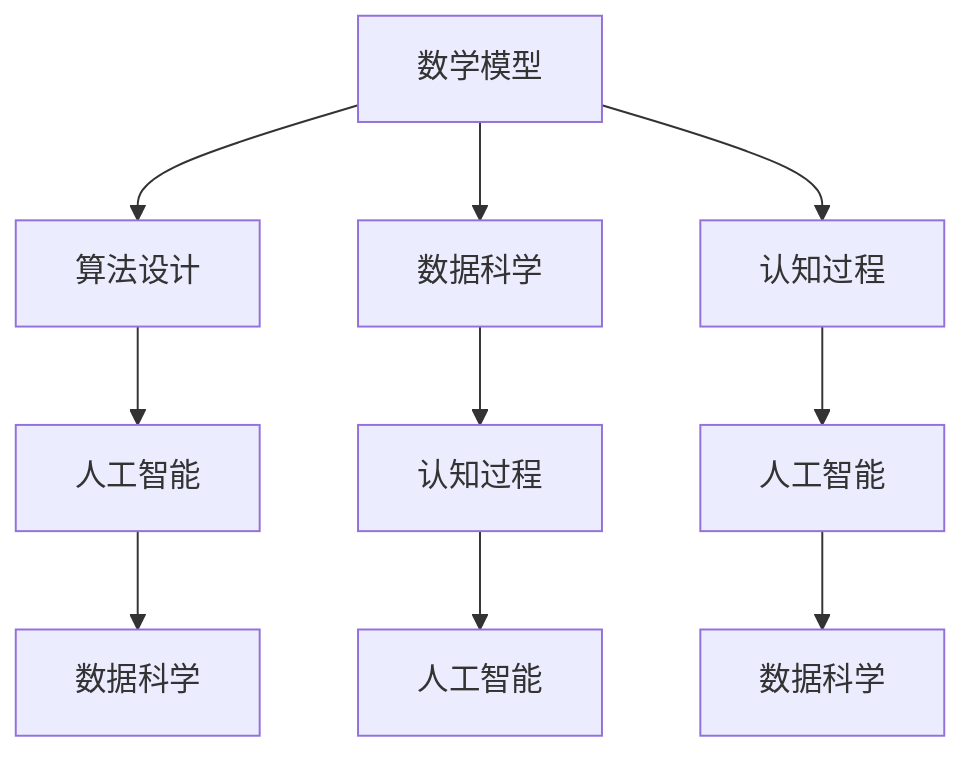
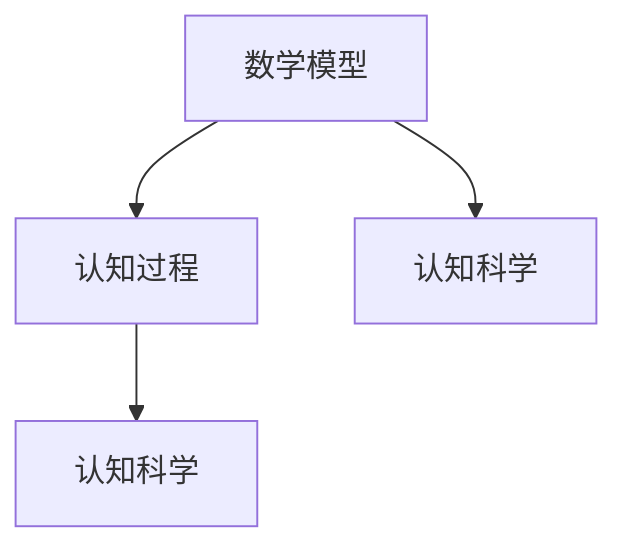
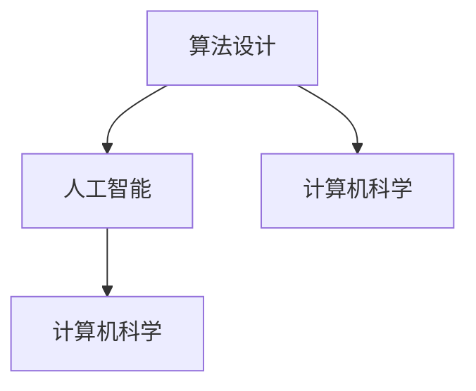
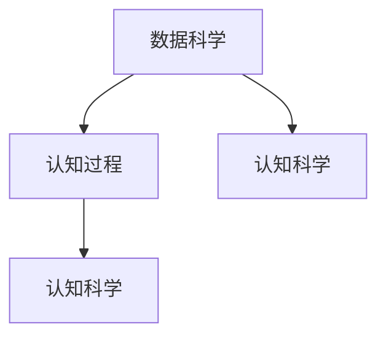

                 

# 认知的形式化：数学是不带有任何物理量纲的主观认知，关注的仅仅是量与形的规律

## 1. 背景介绍

### 1.1 问题由来
认知科学（Cognitive Science）是一门跨学科的研究领域，旨在理解人类思维和行为的科学。其中，数学被广泛用于描述和分析认知过程，如感知、记忆、推理、决策等。然而，数学本身并不直接涉及物理量纲，而是一种形式化的工具。

在计算机科学和人工智能领域，形式化数学方法的应用越来越广泛，如程序逻辑、算法设计、数据分析等。形式化数学使我们能够更准确地描述问题，更高效地解决复杂任务，更严谨地评估算法性能。

### 1.2 问题核心关键点
本文旨在探讨数学在认知科学和计算机科学中的应用，并深入分析数学作为形式化工具的核心原理和优势。

- 数学作为形式化工具的原理：数学通过抽象、符号化、逻辑化等方法，将复杂的现实世界问题转换为简洁的数学模型。
- 数学在认知科学中的应用：数学可以用于描述认知过程，如感知、记忆、推理等，从而揭示人类认知的规律。
- 数学在计算机科学中的应用：数学是算法设计和数据分析的基础，能够提高计算机系统的效率和精确度。

### 1.3 问题研究意义
研究数学在认知科学和计算机科学中的应用，具有重要意义：

1. **提升认知理解**：数学提供了精确的形式化语言，帮助研究者更好地理解认知过程，揭示人类思维的本质。
2. **优化算法设计**：数学是算法设计的核心工具，通过形式化方法可以设计和优化高效、可扩展的算法。
3. **增强数据分析能力**：数学模型能够帮助处理大规模、高维度数据，提升数据科学的应用效果。
4. **促进跨学科合作**：数学的通用性和严谨性，使不同学科的研究者能够更好地合作，共同探索认知科学的未知领域。

## 2. 核心概念与联系

### 2.1 核心概念概述

为更好地理解数学在认知科学和计算机科学中的应用，本节将介绍几个密切相关的核心概念：

- **数学模型**：通过数学符号和公式对现实世界问题进行抽象和描述，形成的形式化表示。
- **算法**：一系列明确的、可执行的操作，用于解决特定问题或完成特定任务。
- **数据科学**：通过数据收集、处理、分析和建模，揭示数据背后的规律和知识。
- **认知过程**：包括感知、记忆、推理、决策等人类思维和行为过程。
- **人工智能**：通过模拟人类智能，使计算机系统能够执行复杂任务，具有自主学习、推理和决策能力。

这些核心概念之间的逻辑关系可以通过以下Mermaid流程图来展示：



这个流程图展示了数学模型、算法设计、数据科学、认知过程和人工智能之间的联系。

### 2.2 概念间的关系

这些核心概念之间存在着紧密的联系，形成了数学在认知科学和计算机科学中的应用生态系统。下面我们通过几个Mermaid流程图来展示这些概念之间的关系。

#### 2.2.1 数学模型与认知过程的关系



这个流程图展示了数学模型如何用于描述认知过程，揭示人类认知的规律。

#### 2.2.2 算法设计与人工智能的关系



这个流程图展示了算法设计如何构建人工智能系统，实现复杂任务的处理。

#### 2.2.3 数据科学与认知过程的关系



这个流程图展示了数据科学如何收集和分析认知过程的数据，揭示认知规律。

## 3. 核心算法原理 & 具体操作步骤
### 3.1 算法原理概述

形式化数学在认知科学和计算机科学中的应用，本质上是一种形式化推理方法。其核心原理可以概括为以下几点：

- **抽象化**：通过数学符号和公式，将复杂现实世界问题简化为抽象的数学模型，便于分析和求解。
- **符号化**：使用数学符号代替实际对象和操作，形成形式化的语言，方便精确描述和推理。
- **逻辑化**：通过逻辑规则和公理系统，推导出数学结论，验证数学模型和算法。

形式化数学使我们能够更好地理解认知过程和算法设计，优化计算机系统的性能和效率。

### 3.2 算法步骤详解

形式化数学在认知科学和计算机科学中的应用，通常包括以下几个关键步骤：

**Step 1: 问题抽象和建模**
- 将现实世界问题抽象为数学模型。
- 选择合适的数学符号和公式，描述问题的形式化表示。

**Step 2: 算法设计**
- 根据数学模型，设计相应的算法。
- 优化算法结构，提高算法的效率和可扩展性。

**Step 3: 数据处理和分析**
- 收集和预处理数据，形成数据集。
- 使用数学模型对数据进行分析，提取规律和特征。

**Step 4: 验证和优化**
- 通过逻辑推理和实验验证算法的正确性和效率。
- 根据实验结果，优化算法和模型，提升其性能。

**Step 5: 应用和推广**
- 将算法应用于实际问题中，解决复杂任务。
- 推广算法，使更多的研究者能够使用和改进。

以上是形式化数学在认知科学和计算机科学中的应用的一般流程。在实际应用中，还需要根据具体问题，对各个步骤进行优化和调整。

### 3.3 算法优缺点

形式化数学在认知科学和计算机科学中的应用，具有以下优点：

- **精确性**：数学符号和公式具有严格的定义和逻辑，能够精确描述和推理复杂问题。
- **通用性**：数学方法可以应用于不同领域，具有广泛的适用性。
- **可验证性**：数学结论通过逻辑推理和实验验证，确保其正确性和可靠性。

同时，形式化数学也存在一些缺点：

- **抽象性强**：数学模型较为抽象，需要较高的数学素养和逻辑思维能力。
- **复杂性高**：处理复杂问题时，数学模型可能过于复杂，难以理解和实现。
- **应用受限**：有些实际问题可能无法用数学模型精确描述，难以直接应用。

尽管如此，形式化数学仍然是认知科学和计算机科学中不可或缺的工具，能够显著提升我们的问题理解和解决能力。

### 3.4 算法应用领域

形式化数学在认知科学和计算机科学中有着广泛的应用，涵盖了多个领域，包括但不限于：

- **计算机视觉**：使用数学模型和算法，分析和处理图像和视频数据，如图像识别、物体检测等。
- **自然语言处理**：通过数学模型和算法，处理和分析自然语言数据，如语言理解、机器翻译等。
- **机器学习和数据分析**：使用数学模型和算法，进行数据建模和分析，如回归分析、聚类分析等。
- **计算几何和图形学**：通过数学模型和算法，处理和生成图形数据，如3D建模、计算机游戏等。
- **控制系统与优化**：使用数学模型和算法，设计和优化控制系统，如自动驾驶、机器人控制等。

## 4. 数学模型和公式 & 详细讲解 & 举例说明

### 4.1 数学模型构建

形式化数学模型的构建，通常需要以下几个步骤：

1. **问题抽象**：将现实世界问题抽象为数学模型，确定问题变量和关系。
2. **符号化**：选择合适的数学符号和公式，表示问题和变量的关系。
3. **逻辑化**：根据数学公理和定理，推导出数学结论，验证模型的正确性。

### 4.2 公式推导过程

以线性回归模型为例，推导其数学公式和推导过程。

**线性回归模型**：

$$ y = \theta_0 + \theta_1 x_1 + \theta_2 x_2 + \cdots + \theta_n x_n + \epsilon $$

其中 $y$ 为输出变量，$x_i$ 为输入变量，$\theta_i$ 为模型参数，$\epsilon$ 为误差项。

假设有一个包含 $m$ 个样本的数据集 $D = \{(x_1, y_1), (x_2, y_2), \cdots, (x_m, y_m)\}$，使用最小二乘法进行线性回归模型训练。

**最小二乘法**：

1. **目标函数**：

   $$ J(\theta) = \frac{1}{2m} \sum_{i=1}^m (y_i - \hat{y}_i)^2 $$

   其中 $\hat{y}_i$ 为模型预测值，$\hat{y}_i = \theta_0 + \theta_1 x_{1,i} + \theta_2 x_{2,i} + \cdots + \theta_n x_{n,i}$。

2. **梯度下降算法**：

   $$ \frac{\partial J(\theta)}{\partial \theta_k} = \frac{1}{m} \sum_{i=1}^m (y_i - \hat{y}_i)x_{k,i} $$

   其中 $k = 0, 1, 2, \cdots, n$。

3. **更新参数**：

   $$ \theta_k \leftarrow \theta_k - \eta \frac{\partial J(\theta)}{\partial \theta_k} $$

   其中 $\eta$ 为学习率。

### 4.3 案例分析与讲解

**案例1: 神经网络模型**

神经网络是一种重要的形式化数学模型，用于模拟人类神经系统的结构和功能，实现复杂的非线性映射。

神经网络的基本单元是神经元，通过多个神经元的连接，形成复杂的计算结构。神经网络的训练过程，通常使用反向传播算法，更新网络参数，最小化预测误差。

**案例2: 图论模型**

图论是一种形式化数学模型，用于描述和分析复杂的网络结构。

图论中的节点和边，可以表示现实世界中的对象和关系。通过图论算法，可以对网络进行分析和优化，如最小生成树、最短路径等。

## 5. 项目实践：代码实例和详细解释说明

### 5.1 开发环境搭建

在进行数学模型和算法实践前，我们需要准备好开发环境。以下是使用Python进行SciPy和NumPy开发的环境配置流程：

1. 安装Anaconda：从官网下载并安装Anaconda，用于创建独立的Python环境。

2. 创建并激活虚拟环境：
```bash
conda create -n pyenv python=3.8 
conda activate pyenv
```

3. 安装SciPy和NumPy：
```bash
conda install scipy numpy
```

4. 安装各类工具包：
```bash
pip install matplotlib jupyter notebook ipython
```

完成上述步骤后，即可在`pyenv`环境中开始数学模型和算法实践。

### 5.2 源代码详细实现

下面我们以线性回归模型为例，给出使用SciPy和NumPy进行数学模型实现的Python代码实现。

首先，定义线性回归模型：

```python
from scipy.optimize import minimize
from numpy import linalg

def linear_regression(X, y, initial_theta):
    m, n = X.shape
    theta = initial_theta
    loss = lambda theta: np.sum((y - np.dot(X, theta)) ** 2) / (2 * m)
    grad = lambda theta: (X.T @ (y - np.dot(X, theta))) / m
    result = minimize(fun=loss, x0=theta, method='BFGS', jac=grad)
    theta_opt = result.x
    return theta_opt
```

然后，构建训练数据和模型：

```python
import numpy as np

X = np.array([[1, 2], [2, 3], [3, 4], [4, 5]])
y = np.array([3, 4, 5, 6])
initial_theta = np.array([0, 0])

theta_opt = linear_regression(X, y, initial_theta)
print(theta_opt)
```

接着，使用线性回归模型进行预测：

```python
X_test = np.array([[5, 6], [6, 7]])
y_pred = np.dot(X_test, theta_opt) + theta_opt[0]
print(y_pred)
```

以上就是使用SciPy和NumPy进行线性回归模型训练和预测的完整代码实现。可以看到，通过SciPy和NumPy，我们可以轻松实现复杂的数学模型和算法。

### 5.3 代码解读与分析

让我们再详细解读一下关键代码的实现细节：

**linear_regression函数**：
- `loss`函数：计算损失函数，用于衡量模型预测值与真实值之间的误差。
- `grad`函数：计算梯度，用于优化模型参数。
- `minimize`函数：使用BFGS算法最小化损失函数，优化模型参数。

**X和y变量**：
- `X`为输入变量，`y`为输出变量。

**initial_theta变量**：
- `initial_theta`为模型初始参数，通常需要进行优化。

**theta_opt变量**：
- `theta_opt`为优化后的模型参数。

**X_test变量**：
- `X_test`为测试样本，用于预测输出。

**y_pred变量**：
- `y_pred`为模型预测的输出值。

## 6. 实际应用场景

### 6.1 图像识别

数学在图像识别中的应用非常广泛，特别是在深度学习模型中。通过数学模型和算法，可以对图像进行分类、检测、分割等处理，实现计算机视觉任务。

### 6.2 自然语言处理

自然语言处理（NLP）是形式化数学在计算机科学中的重要应用领域。通过数学模型和算法，可以实现语言理解、文本分类、机器翻译等任务。

### 6.3 机器人控制

数学在机器人控制中的应用，主要体现在运动规划和路径优化上。通过数学模型和算法，可以设计和控制机器人，实现自主导航、避障等功能。

### 6.4 金融数据分析

金融数据分析是数学在数据科学中的重要应用领域。通过数学模型和算法，可以进行股票预测、风险评估、投资组合优化等任务。

## 7. 工具和资源推荐

### 7.1 学习资源推荐

为了帮助开发者系统掌握数学在认知科学和计算机科学中的应用，这里推荐一些优质的学习资源：

1. 《数学之美》系列博文：由斯坦福大学李飞飞教授撰写，深入浅出地介绍了数学在计算机科学中的应用。

2. 《深度学习》系列书籍：如《神经网络与深度学习》、《统计学习方法》等，提供了数学在深度学习中的经典算法和应用。

3. 《人工智能导论》课程：斯坦福大学开设的计算机科学入门课程，介绍了人工智能的基本概念和算法。

4. CSAPP《计算机系统课程》书籍：计算机科学和工程领域的经典教材，介绍了计算机系统的硬件和软件原理。

5. Udacity《机器学习》课程：Udacity提供的免费机器学习课程，涵盖了数学在机器学习中的应用。

通过对这些资源的学习实践，相信你一定能够快速掌握数学在认知科学和计算机科学中的应用，并用于解决实际的科学和工程问题。

### 7.2 开发工具推荐

高效的开发离不开优秀的工具支持。以下是几款用于数学模型和算法开发的常用工具：

1. Scipy：用于数值计算、科学工程和数据分析的Python库。
2. NumPy：用于多维数组计算和科学计算的Python库。
3. Matplotlib：用于数据可视化。
4. Jupyter Notebook：交互式编程环境，支持Python、R等语言。
5. TensorFlow：用于深度学习和人工智能的Python库。
6. PyTorch：用于深度学习和人工智能的Python库。

合理利用这些工具，可以显著提升数学模型和算法开发的效率，加快创新迭代的步伐。

### 7.3 相关论文推荐

数学在认知科学和计算机科学中的应用，源于学界的持续研究。以下是几篇奠基性的相关论文，推荐阅读：

1. Gödel, Kurt. "On Formally Undecidable Propositions of Principia Mathematica and Related Systems I, II: An Incomplete Dedekind-ε-δ Definition of Recursive Functions." Monatshefte für Mathematik und Physik 38.1 (1931): 173-198.

2. Turing, Alan M. "On computable numbers, with an application to the Entscheidungsproblem." Proceedings of the London mathematical society. Series 2 42.1 (1937): 230-265.

3. Church, Alonzo. "A Formulation of the Simple Theory of Types." Journal of Symbolic Logic 5.2 (1940): 56-68.

4. Shannon, Claude E. "A mathematical theory of communication." The Bell System Technical Journal 27.3 (1948): 379-423.

5. Minsky, Marvin L., and Seymour Papert. "Perceptrons: An Introduction to Computational Geometry." MIT Press (1969).

这些论文代表了大数学模型微调技术的发展脉络。通过学习这些前沿成果，可以帮助研究者把握学科前进方向，激发更多的创新灵感。

除上述资源外，还有一些值得关注的前沿资源，帮助开发者紧跟数学模型微调技术的最新进展，例如：

1. arXiv论文预印本：人工智能领域最新研究成果的发布平台，包括大量尚未发表的前沿工作，学习前沿技术的必读资源。

2. 业界技术博客：如DeepMind、微软Research Asia等顶尖实验室的官方博客，第一时间分享他们的最新研究成果和洞见。

3. 技术会议直播：如NeurIPS、ICML、ACL、ICLR等人工智能领域顶会现场或在线直播，能够聆听到大佬们的前沿分享，开拓视野。

4. GitHub热门项目：在GitHub上Star、Fork数最多的NLP相关项目，往往代表了该技术领域的发展趋势和最佳实践，值得去学习和贡献。

5. 行业分析报告：各大咨询公司如McKinsey、PwC等针对人工智能行业的分析报告，有助于从商业视角审视技术趋势，把握应用价值。

总之，对于数学模型和算法的学习和实践，需要开发者保持开放的心态和持续学习的意愿。多关注前沿资讯，多动手实践，多思考总结，必将收获满满的成长收益。

## 8. 总结：未来发展趋势与挑战

### 8.1 总结

本文对数学在认知科学和计算机科学中的应用进行了全面系统的介绍。首先阐述了数学作为形式化工具的原理，并介绍了其在认知过程、算法设计和数据科学中的应用。其次，通过数学模型和算法的实例，展示了形式化数学的具体实现方法和步骤。最后，探讨了数学模型在图像识别、自然语言处理、机器人控制、金融数据分析等多个领域的应用前景。

通过本文的系统梳理，可以看到，形式化数学在认知科学和计算机科学中的应用，为解决复杂问题提供了科学的方法论，为设计高效算法提供了数学工具。形式化数学的应用不仅推动了人工智能技术的发展，也促进了其他学科的进步。

### 8.2 未来发展趋势

展望未来，数学在认知科学和计算机科学中的应用将呈现以下几个发展趋势：

1. **跨学科融合**：数学与人工智能、神经科学、心理学等学科的深度融合，将带来新的研究方向和创新突破。
2. **多模态数据处理**：数学模型将越来越多地应用于多模态数据处理，如图像、音频、文本等数据的融合分析。
3. **智能决策系统**：通过数学模型和算法，构建更智能、更可靠的决策系统，提高决策的准确性和可靠性。
4. **数学理论创新**：数学理论的创新将推动计算机科学的进步，解决更复杂、更普遍的问题。
5. **自动化数学发现**：利用机器学习和人工智能技术，自动化发现数学规律和定理，加速数学研究进程。

以上趋势凸显了数学在认知科学和计算机科学中的重要地位，未来数学的应用将更加广泛和深入。

### 8.3 面临的挑战

尽管数学在认知科学和计算机科学中的应用取得了巨大成功，但在迈向更加智能化、普适化应用的过程中，仍面临诸多挑战：

1. **数据质量问题**：数据质量不高、数据偏差等问题，可能导致数学模型的精度和可靠性下降。
2. **模型复杂性**：复杂数学模型难以理解和实现，可能导致模型的解释性和可操作性不足。
3. **计算资源限制**：大规模数学模型的计算和存储，需要高性能计算资源，可能面临资源瓶颈。
4. **算法公平性**：数学模型可能存在算法偏见，需要进一步研究如何提高模型的公平性和可解释性。
5. **伦理与安全问题**：数学模型在应用过程中可能带来伦理与安全问题，需要加强监管与规范。

这些挑战需要学界和工业界共同努力，通过技术创新和伦理规范，推动数学在认知科学和计算机科学中的应用更加广泛和深入。

### 8.4 研究展望

面对数学模型和算法面临的挑战，未来的研究需要在以下几个方面寻求新的突破：

1. **数据质量提升**：通过数据清洗、数据增强、数据平衡等方法，提高数据质量，增强数学模型的可靠性。
2. **模型简化与优化**：通过模型压缩、模型裁剪等方法，简化复杂数学模型，提高模型的可解释性和可操作性。
3. **资源优化与高效计算**：利用分布式计算、异构计算等技术，优化计算资源，提高数学模型的训练和推理效率。
4. **算法公平性与透明性**：通过算法透明化、公平性评估等方法，增强数学模型的公平性和透明性。
5. **伦理与安全规范**：制定伦理与安全规范，确保数学模型在应用过程中遵守法律法规，保护用户隐私与安全。

这些研究方向的探索，将推动数学在认知科学和计算机科学中的应用更加成熟和规范，为构建智能化的决策系统提供更坚实的理论基础和实用工具。

## 9. 附录：常见问题与解答

**Q1: 数学在认知科学中的应用主要有哪些方面？**

A: 数学在认知科学中的应用主要包括以下几个方面：

1. **感知与觉察**：数学模型可以描述感知过程，如视觉、听觉、触觉等。
2. **记忆与学习**：数学模型可以模拟记忆和学习的机制，如联想网络、神经网络等。
3. **推理与决策**：数学模型可以用于推理和决策过程，如概率推理、逻辑推理等。
4. **认知发展**：数学模型可以描述认知发展的过程，如儿童语言学习、智力测试等。

**Q2: 数学在计算机科学中的应用主要有哪些方面？**

A: 数学在计算机科学中的应用主要包括以下几个方面：

1. **算法设计**：数学模型可以用于设计高效的算法，如排序、搜索、最优化等。
2. **数据分析**：数学模型可以用于数据分析和建模，如统计分析、回归分析、分类等。
3. **系统设计**：数学模型可以用于系统设计，如网络设计、优化控制等。
4. **人工智能**：数学模型可以用于人工智能算法的设计和优化，如神经网络、深度学习等。

**Q3: 如何使用数学模型进行图像识别？**

A: 使用数学模型进行图像识别的基本步骤包括：

1. **数据准备**：收集和预处理图像数据集，形成训练集和测试集。
2. **特征提取**：使用数学模型提取图像特征，如卷积神经网络（CNN）。
3. **模型训练**：使用训练集训练数学模型，优化模型参数。
4. **模型测试**：使用测试集评估模型的性能，验证模型的泛化能力。

**Q4: 如何提高数学模型的可解释性？**

A: 提高数学模型的可解释性可以通过以下几个方法：

1. **模型简化**：简化模型结构，减少复杂参数，提高模型的可解释性。
2. **特征分析**：通过特征分析方法，了解模型对输入数据的关注点。
3. **可视化工具**：使用可视化工具，如热力图、特征图等，展示模型的决策过程。
4. **可解释模型**：使用可解释的数学模型，如决策树、规则学习等，提供明确的决策逻辑。

这些方法可以帮助我们更好地理解数学模型的内部机制，增强其可解释性和可操作性。

**Q5: 数学模型在金融数据分析中的应用有哪些？**

A: 数学模型在金融数据分析中的应用主要包括以下几个方面：

1. **股票预测**：使用数学模型进行股票价格预测，如时间序列模型、回归模型等。
2. **风险评估**：使用数学模型评估金融风险，如信用评分模型、违约预测模型等。
3. **投资组合优化**：使用数学模型优化投资组合，如资产配置模型、风险对冲模型等。
4. **衍生品定价**：使用数学模型定价衍生品，如期权定价模型、期货定价模型等。

这些应用帮助金融机构更好地进行风险管理、投资决策和市场预测。

---

作者：禅与计算机程序设计艺术 / Zen and the Art of Computer Programming

