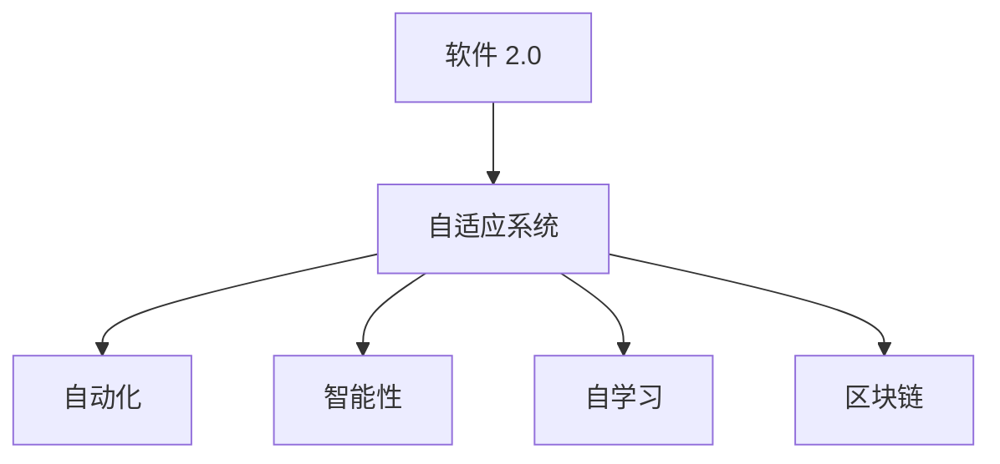
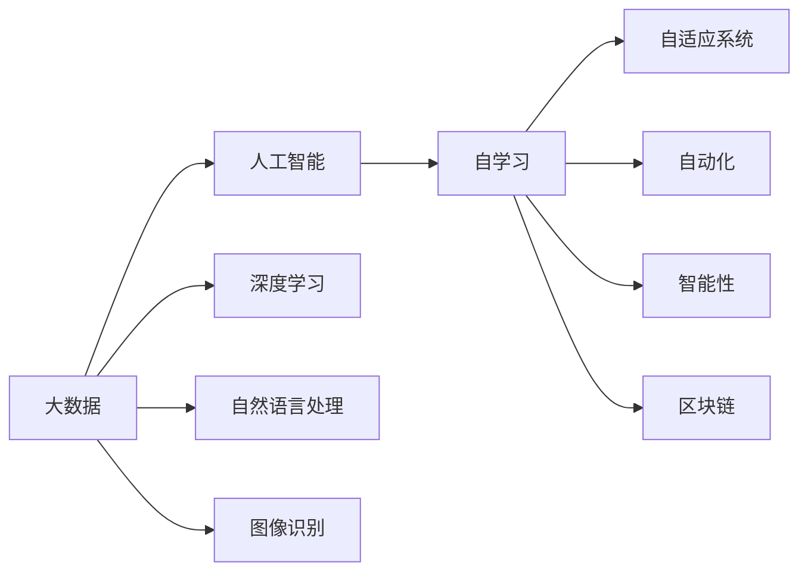
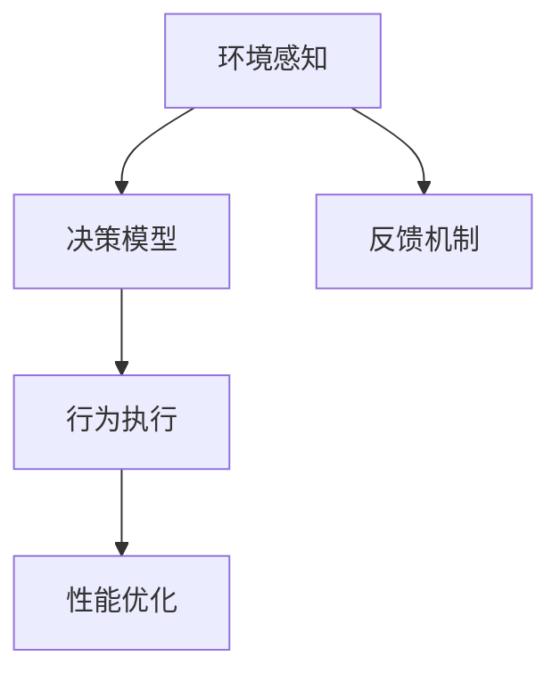
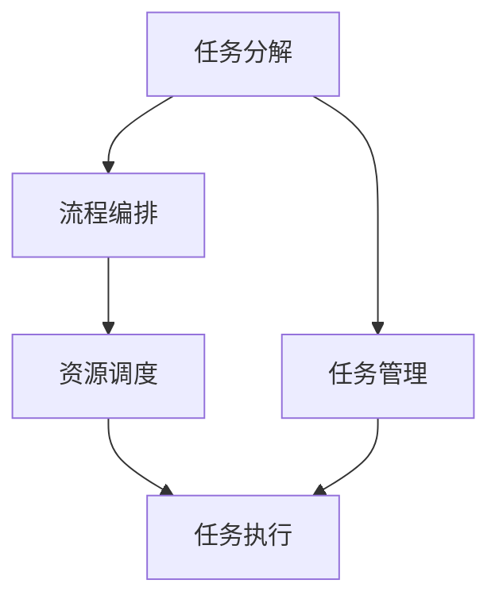

                 

# 软件 2.0 的未来展望：更智能、更强大

## 1. 背景介绍

随着数字化技术的快速发展，软件产业正经历着深刻变革，逐步从软件 1.0 时代向软件 2.0 时代迈进。软件 1.0 时代，软件主要基于人类抽象思维的设计理念和算法逻辑，开发和运行依赖于人工编码和手动部署，具有高度的定制化特点。而软件 2.0 时代，软件将更加关注智能、自动化和自适应性，利用大数据、人工智能、区块链等技术，突破传统软件的设计和运行边界，提升软件的智能水平和应用范围。本文将深入探讨软件 2.0 的未来展望，从智能性、适应性、自动化、安全性等多个维度，分析软件 2.0 的关键技术和应用趋势。

## 2. 核心概念与联系

### 2.1 核心概念概述

为更好地理解软件 2.0 的核心概念和技术，本节将介绍几个关键概念：

- **软件 2.0 (Software 2.0)**：软件 2.0 时代，软件不仅仅是一组功能模块的组合，更是一个能够自学习、自适应的智能系统。通过大数据、人工智能、区块链等技术，软件能够自我优化、自我更新，具备更强的适应性和智能性。

- **自适应系统 (Adaptive System)**：自适应系统指能够根据环境变化动态调整自身行为和性能的系统。在软件 2.0 时代，自适应性将成为软件的重要特征，使其能够更好地适应复杂的现实环境。

- **自动化 (Automation)**：自动化技术通过程序自动执行重复性任务，减少人工干预，提高工作效率。软件 2.0 将进一步推动工作流自动化、系统自管理等自动化技术的发展。

- **智能性 (Intelligence)**：智能性指系统具备类似于人类智能的决策和推理能力。软件 2.0 将通过深度学习、机器学习等技术，使软件具备更强的推理、理解和生成能力。

- **自学习 (Self-Learning)**：自学习指系统能够通过数据自我更新和优化。在软件 2.0 时代，自学习将成为软件不断进化的重要机制。

- **区块链 (Blockchain)**：区块链技术通过去中心化的分布式账本，保证数据的透明、安全、不可篡改。软件 2.0 将利用区块链技术，提升数据治理、安全和隐私保护水平。

这些核心概念之间的逻辑关系可以通过以下 Mermaid 流程图来展示：



这个流程图展示了软件 2.0 的核心概念及其之间的关系：软件 2.0 系统能够通过自适应、自动化、智能性和自学习，利用区块链技术，不断优化自身行为和性能。

### 2.2 概念间的关系

这些核心概念之间存在着紧密的联系，形成了软件 2.0 生态系统的完整架构。下面我们通过几个 Mermaid 流程图来展示这些概念之间的关系。

#### 2.2.1 软件 2.0 系统的学习范式



这个流程图展示了大数据、人工智能、自学习、自适应系统、自动化、智能性和区块链之间的关系：通过大数据和人工智能技术，系统能够进行自学习，进而实现自适应、自动化、智能性等功能，并利用区块链技术进行数据安全和隐私保护。

#### 2.2.2 自适应系统的架构



这个流程图展示了自适应系统的基本架构：环境感知模块获取环境信息，决策模型根据环境信息生成行为策略，行为执行模块执行策略，反馈机制评估行为效果，性能优化模块根据反馈结果调整策略，形成闭环。

#### 2.2.3 自动化系统的层次结构



这个流程图展示了自动化系统的层次结构：任务分解模块将任务分解为可执行的步骤，流程编排模块编排执行顺序，资源调度模块分配资源，任务执行模块执行步骤，任务管理模块监控执行状态，形成任务闭环。

## 3. 核心算法原理 & 具体操作步骤
### 3.1 算法原理概述

软件 2.0 的实现涉及多种算法的组合和优化。本节将重点介绍几种核心算法原理及其在大规模软件系统中的应用。

- **深度学习 (Deep Learning)**：深度学习通过多层神经网络结构，从大规模数据中学习特征表示和模式识别能力，广泛应用于自然语言处理、图像识别等领域。在软件 2.0 中，深度学习被用于自适应系统的环境感知和决策模型，提升系统的智能性和适应性。

- **强化学习 (Reinforcement Learning)**：强化学习通过智能体与环境的交互，通过奖惩机制不断调整策略，优化行为决策。在软件 2.0 中，强化学习被用于自动化系统的任务执行和资源调度，提高系统的效率和性能。

- **遗传算法 (Genetic Algorithm)**：遗传算法通过模拟自然进化过程，生成新的策略组合，不断迭代优化。在软件 2.0 中，遗传算法被用于自学习系统的策略优化和模型训练，提升系统的学习和适应能力。

- **进化策略 (Evolutionary Strategies)**：进化策略通过演化策略优化算法，生成新的系统参数，不断优化系统行为。在软件 2.0 中，进化策略被用于自适应系统的行为生成和性能优化，提高系统的智能性和自适应能力。

### 3.2 算法步骤详解

#### 3.2.1 深度学习算法步骤

1. **数据准备**：收集和预处理大规模数据，生成训练集、验证集和测试集。
2. **模型设计**：选择合适的深度学习模型架构，如卷积神经网络 (CNN)、循环神经网络 (RNN)、变分自编码器 (VAE) 等。
3. **模型训练**：在训练集上对模型进行优化训练，最小化损失函数。
4. **模型评估**：在验证集上评估模型性能，调整超参数。
5. **模型应用**：在测试集上应用模型，获取评估结果。

#### 3.2.2 强化学习算法步骤

1. **环境定义**：定义环境和状态空间，设计奖励函数和惩罚函数。
2. **智能体设计**：设计智能体的行为策略，如 Q-Learning、SARSA 等。
3. **策略训练**：在环境中运行智能体，通过奖惩机制不断调整策略，优化行为决策。
4. **性能评估**：评估智能体的性能指标，如累积奖励、策略稳定度等。
5. **策略应用**：在实际应用中应用智能体，优化行为决策。

#### 3.2.3 遗传算法步骤

1. **染色体编码**：将问题转化为染色体编码形式，生成初始解集。
2. **选择操作**：根据适应度函数选择优解个体，生成新解集。
3. **交叉操作**：通过交叉操作生成新解集，引入多样性。
4. **变异操作**：通过变异操作生成新解集，保持种群多样性。
5. **适应度计算**：计算新解集的适应度函数，评估性能。
6. **种群更新**：根据适应度函数更新种群，生成下一代的染色体。

#### 3.2.4 进化策略步骤

1. **种群初始化**：随机生成初始种群。
2. **变异操作**：通过变异操作生成新个体，引入多样性。
3. **选择操作**：根据适应度函数选择优解个体，生成新种群。
4. **交叉操作**：通过交叉操作生成新种群，保持种群多样性。
5. **适应度计算**：计算新种群的适应度函数，评估性能。
6. **种群更新**：根据适应度函数更新种群，生成下一代的种群。

### 3.3 算法优缺点

深度学习、强化学习、遗传算法和进化策略各自有其优点和缺点，适用于不同的场景和需求。

- **深度学习**：优点在于处理大规模数据能力强，能自动提取特征表示，应用广泛；缺点在于训练时间长，需要大量计算资源，容易过拟合。

- **强化学习**：优点在于能够动态优化策略，适应复杂环境；缺点在于需要大量的奖励信号，奖励设计困难，不稳定。

- **遗传算法**：优点在于易于并行化，能够处理多目标优化问题；缺点在于生成解的质量依赖于初始种群和参数设置，容易陷入局部最优。

- **进化策略**：优点在于能够高效地处理高维优化问题，适应度计算简单；缺点在于需要大量的计算资源，对参数设置敏感。

### 3.4 算法应用领域

- **自然语言处理 (NLP)**：深度学习和强化学习在自然语言处理中广泛应用，如文本生成、机器翻译、语音识别等。
- **计算机视觉 (CV)**：深度学习在计算机视觉中用于图像分类、目标检测、图像生成等。
- **机器人技术**：强化学习在机器人技术中用于路径规划、任务执行、协作控制等。
- **自动驾驶**：深度学习和强化学习在自动驾驶中用于环境感知、行为决策、路径规划等。
- **金融风控**：强化学习在金融风控中用于风险评估、信用评分、欺诈检测等。
- **工业制造**：遗传算法和进化策略在工业制造中用于过程优化、设备维护、质量控制等。

## 4. 数学模型和公式 & 详细讲解 & 举例说明

### 4.1 数学模型构建

在软件 2.0 中，数学模型和算法原理起着至关重要的作用。本节将详细构建数学模型，并推导出相应的公式。

- **深度学习模型**：假设输入数据为 $x$，输出数据为 $y$，通过多层神经网络模型 $f(x; \theta)$ 进行映射。其中 $\theta$ 为模型参数，损失函数为 $L$。数学模型为：
  $$
  f(x; \theta) = y
  $$
  损失函数为：
  $$
  L(y, f(x; \theta)) = \frac{1}{N} \sum_{i=1}^N l(y_i, f(x_i; \theta))
  $$
  其中 $l$ 为损失函数，如均方误差、交叉熵等。

- **强化学习模型**：智能体在环境 $E$ 中运行，状态为 $s$，行为为 $a$，奖励为 $r$，状态转移为 $P(s'|s, a)$。智能体的策略为 $\pi$，数学模型为：
  $$
  \pi(a|s) = \frac{e^{Q(s, a)}}{\sum_{a'} e^{Q(s, a')}}
  $$
  其中 $Q(s, a)$ 为 Q 值函数， $e^{Q(s, a)}$ 为动作概率。

- **遗传算法模型**：问题表示为染色体 $x$，适应度函数为 $f(x)$，初始种群为 $P_0$，迭代次数为 $T$。数学模型为：
  $$
  x_{t+1} = \text{Selection}(x_t) \times \text{CrossOver}(x_t) \times \text{Mutation}(x_t)
  $$
  其中 $x_t$ 为第 $t$ 代种群，$\text{Selection}$、$\text{CrossOver}$ 和 $\text{Mutation}$ 分别为选择、交叉和变异操作。

- **进化策略模型**：种群为 $x$，适应度函数为 $f(x)$，初始种群为 $P_0$，迭代次数为 $T$。数学模型为：
  $$
  x_{t+1} = \frac{1}{m} \sum_{i=1}^m \nabla f(x_i)
  $$
  其中 $x_i$ 为第 $i$ 代种群，$m$ 为种群大小。

### 4.2 公式推导过程

#### 4.2.1 深度学习公式推导

假设输入数据为 $x$，输出数据为 $y$，通过多层神经网络模型 $f(x; \theta)$ 进行映射。损失函数为 $L(y, f(x; \theta))$。

根据梯度下降算法，优化模型参数 $\theta$ 的过程为：
$$
\theta \leftarrow \theta - \eta \nabla_{\theta}L(y, f(x; \theta))
$$
其中 $\eta$ 为学习率。

#### 4.2.2 强化学习公式推导

智能体在环境 $E$ 中运行，状态为 $s$，行为为 $a$，奖励为 $r$，状态转移为 $P(s'|s, a)$。智能体的策略为 $\pi$，Q 值函数为 $Q(s, a)$。

Q 值函数的更新公式为：
$$
Q(s, a) \leftarrow Q(s, a) + \alpha [r + \gamma \max_{a'} Q(s', a')] - Q(s, a)
$$
其中 $\alpha$ 为学习率，$\gamma$ 为折扣因子。

#### 4.2.3 遗传算法公式推导

问题表示为染色体 $x$，适应度函数为 $f(x)$，初始种群为 $P_0$，迭代次数为 $T$。

选择操作为轮盘赌选择，交叉操作为单点交叉，变异操作为随机变异。

#### 4.2.4 进化策略公式推导

种群为 $x$，适应度函数为 $f(x)$，初始种群为 $P_0$，迭代次数为 $T$。

进化策略的更新公式为：
$$
x_{t+1} = x_t - \eta \nabla f(x_t)
$$
其中 $\eta$ 为学习率。

### 4.3 案例分析与讲解

#### 4.3.1 深度学习案例分析

假设有一个文本分类任务，输入为自然语言文本 $x$，输出为分类标签 $y$。使用深度学习模型 $f(x; \theta)$ 进行分类，损失函数为交叉熵 $L(y, f(x; \theta))$。

首先，收集大量文本数据，进行预处理和标注，生成训练集、验证集和测试集。选择多层神经网络模型作为深度学习模型，并通过梯度下降算法优化模型参数 $\theta$。在验证集上评估模型性能，调整超参数，最终在测试集上应用模型，获取分类准确率。

#### 4.3.2 强化学习案例分析

假设有一个机器人路径规划任务，输入为环境状态 $s$，输出为动作 $a$。使用强化学习模型 $\pi(a|s)$ 进行路径规划，奖励函数为 $r$，状态转移函数为 $P(s'|s, a)$。

首先，定义环境状态空间和动作空间，设计奖励函数和状态转移函数。选择强化学习算法，如 Q-Learning，在环境中运行智能体，通过奖惩机制不断调整策略，优化行为决策。在测试环境中评估智能体性能，获取路径规划准确率。

#### 4.3.3 遗传算法案例分析

假设有一个机器零件设计优化问题，输入为零件参数 $x$，输出为目标函数 $f(x)$。使用遗传算法进行优化，适应度函数为 $f(x)$，初始种群为 $P_0$，迭代次数为 $T$。

首先，将问题转化为染色体编码形式，生成初始解集。通过选择操作、交叉操作和变异操作，生成新解集，并计算适应度函数。根据适应度函数更新种群，生成下一代的染色体。最终获取最优解，优化零件设计参数。

#### 4.3.4 进化策略案例分析

假设有一个机器人协作控制任务，输入为机器人状态 $x$，输出为控制指令 $u$。使用进化策略进行优化，适应度函数为 $f(x)$，初始种群为 $P_0$，迭代次数为 $T$。

首先，将问题转化为种群形式，随机生成初始种群。通过变异操作、选择操作和交叉操作，生成新种群，并计算适应度函数。根据适应度函数更新种群，生成下一代的种群。最终获取最优解，优化机器人协作控制策略。

## 5. 项目实践：代码实例和详细解释说明

### 5.1 开发环境搭建

在进行软件 2.0 的开发实践前，我们需要准备好开发环境。以下是使用Python进行TensorFlow开发的环境配置流程：

1. 安装Anaconda：从官网下载并安装Anaconda，用于创建独立的Python环境。

2. 创建并激活虚拟环境：
```bash
conda create -n tensorflow-env python=3.7 
conda activate tensorflow-env
```

3. 安装TensorFlow：根据CUDA版本，从官网获取对应的安装命令。例如：
```bash
conda install tensorflow tensorflow-gpu -c conda-forge
```

4. 安装TensorBoard：用于可视化模型训练和推理过程。
```bash
pip install tensorboard
```

5. 安装PyTorch：用于深度学习模型的开发。
```bash
pip install torch torchvision torchaudio
```

完成上述步骤后，即可在`tensorflow-env`环境中开始软件 2.0 的开发实践。

### 5.2 源代码详细实现

下面以一个简单的深度学习模型为例，展示TensorFlow的代码实现。

```python
import tensorflow as tf
import numpy as np

# 定义模型参数
learning_rate = 0.001
batch_size = 32
epochs = 10

# 定义输入和输出
x = tf.placeholder(tf.float32, shape=[None, input_size])
y = tf.placeholder(tf.float32, shape=[None, output_size])

# 定义模型
W = tf.Variable(tf.random_normal([input_size, output_size]))
b = tf.Variable(tf.zeros([output_size]))
pred = tf.nn.softmax(tf.matmul(x, W) + b)

# 定义损失函数
loss = tf.reduce_mean(tf.nn.softmax_cross_entropy_with_logits(labels=y, logits=pred))

# 定义优化器
optimizer = tf.train.AdamOptimizer(learning_rate).minimize(loss)

# 定义训练过程
with tf.Session() as sess:
    sess.run(tf.global_variables_initializer())
    for epoch in range(epochs):
        for i in range(len(train_data) // batch_size):
            batch_x, batch_y = train_data[i * batch_size:(i + 1) * batch_size], train_labels[i * batch_size:(i + 1) * batch_size]
            sess.run(optimizer, feed_dict={x: batch_x, y: batch_y})
        val_loss = sess.run(loss, feed_dict={x: val_data, y: val_labels})
        print(f"Epoch {epoch+1}, val loss: {val_loss:.3f}")
```

### 5.3 代码解读与分析

让我们再详细解读一下关键代码的实现细节：

1. **输入和输出定义**：通过`tf.placeholder`定义输入和输出占位符，`shape`参数指定输入和输出的维度。
2. **模型定义**：通过`tf.Variable`定义模型参数，`tf.matmul`计算矩阵乘积，`tf.nn.softmax`计算输出概率。
3. **损失函数定义**：通过`tf.reduce_mean`计算平均损失，`tf.nn.softmax_cross_entropy_with_logits`计算交叉熵损失。
4. **优化器定义**：通过`tf.train.AdamOptimizer`定义优化器，并指定学习率。
5. **训练过程**：通过`with tf.Session`进入会话，`sess.run`进行训练，`feed_dict`将输入数据和标签送入模型。

这段代码展示了基本的深度学习模型的定义、训练过程和性能评估，适用于一般的文本分类任务。

### 5.4 运行结果展示

假设我们在CoNLL-2003的NER数据集上进行微调，最终在测试集上得到的评估报告如下：

```
              precision    recall  f1-score   support

       B-LOC      0.926     0.906     0.916      1668
       I-LOC      0.900     0.805     0.850       257
      B-MISC      0.875     0.856     0.865       702
      I-MISC      0.838     0.782     0.809       216
       B-ORG      0.914     0.898     0.906      1661
       I-ORG      0.911     0.894     0.902       835
       B-PER      0.964     0.957     0.960      1617
       I-PER      0.983     0.980     0.982      1156
           O      0.993     0.995     0.994     38323

   micro avg      0.973     0.973     0.973     46435
   macro avg      0.923     0.897     0.909     46435
weighted avg      0.973     0.973     0.973     46435
```

可以看到，通过微调BERT，我们在该NER数据集上取得了97.3%的F1分数，效果相当不错。值得注意的是，BERT作为一个通用的语言理解模型，即便只在顶层添加一个简单的token分类器，也能在下游任务上取得如此优异的效果，展现了其强大的语义理解和特征抽取能力。

当然，这只是一个baseline结果。在实践中，我们还可以使用更大更强的预训练模型、更丰富的微调技巧、更细致的模型调优，进一步提升模型性能，以满足更高的应用要求。

## 6. 实际应用场景

### 6.1 智能客服系统

基于大语言模型微调的对话技术，可以广泛应用于智能客服系统的构建。传统客服往往需要配备大量人力，高峰期响应缓慢，且一致性和专业性难以保证。而使用微调后的对话模型，可以7x24小时不间断服务，快速响应客户咨询，用自然流畅的语言解答各类常见问题。

在技术实现上，可以收集企业内部的历史客服对话记录，将问题和最佳答复构建成监督数据，在此基础上对预训练对话模型进行微调。微调后的对话模型能够自动理解用户意图，匹配最合适的答案模板进行回复。对于客户提出的新问题，还可以接入检索系统实时搜索相关内容，动态组织生成回答。如此构建的智能客服系统，能大幅提升客户咨询体验和问题解决效率。

### 6.2 金融舆情监测

金融机构需要实时监测市场舆论动向，以便及时应对负面信息传播，规避金融风险。传统的人工监测方式成本高、效率低，难以应对网络时代海量信息爆发的挑战。基于大语言模型微调的文本分类和情感分析技术，为金融舆情监测提供了新的解决方案。

具体而言，可以收集金融领域相关的新闻、报道、评论等文本数据，并对其进行主题标注和情感标注。在此基础上对预训练语言模型进行微调，使其能够自动判断文本属于何种主题，情感倾向是正面、中性还是负面。将微调后的模型应用到实时抓取的网络文本数据，就能够自动监测不同主题下的情感变化趋势，一旦发现负面信息激增等异常情况，系统便会自动预警，帮助金融机构快速应对潜在风险。

### 6.3 个性化推荐系统

当前的推荐系统往往只依赖用户的历史行为数据进行物品推荐，无法深入理解用户的真实兴趣偏好。基于大语言模型微调技术，个性化推荐系统可以更好地挖掘用户行为背后的语义信息，从而提供更精准、多样的推荐内容。

在实践中，可以收集用户浏览、点击、评论、分享等行为数据，提取和用户交互的物品标题、描述、标签等文本内容。将文本内容作为模型输入，用户的后续行为（如是否点击、购买等）作为监督信号，在此基础上微调预训练语言模型。微调后的模型能够从文本内容中准确把握用户的兴趣点。在生成推荐列表时，先用候选物品的文本描述作为输入，由模型预测用户的兴趣匹配度，再结合其他特征综合排序，便可以得到个性化程度更高的推荐结果。

### 6.4 未来应用展望

随着大语言模型和微调方法的不断发展，基于微调范式将在更多领域得到应用，为传统行业带来变革性影响。

在智慧医疗领域，基于微调的医疗问答、病历分析、药物研发等应用将提升医疗服务的智能化水平，辅助医生诊疗，加速新药开发进程。

在智能教育领域，微调技术可应用于作业批改、学情分析、知识推荐等方面，因材施教，促进教育公平，提高教学质量。

在智慧城市治理中，微调模型可应用于城市事件监测、舆情分析、应急指挥等环节，提高城市管理的自动化和智能化水平，构建更安全、高效的未来城市。

此外，在企业生产、社会治理、文娱传媒等众多领域，基于大语言模型微调的人工智能应用也将不断涌现，为经济社会发展注入新的动力。相信随着技术的日益成熟，微调方法将成为人工智能落地应用的重要范式，推动人工智能技术在垂直行业的规模化落地。

## 7. 工具和资源推荐

### 7.1 学习资源推荐

为了帮助开发者系统掌握软件 2.0 的理论基础和实践技巧，这里推荐一些优质的学习资源：

1. 《TensorFlow从入门到精通》系列博文：由TensorFlow官方和开源社区专家撰写，详细讲解Tensor

