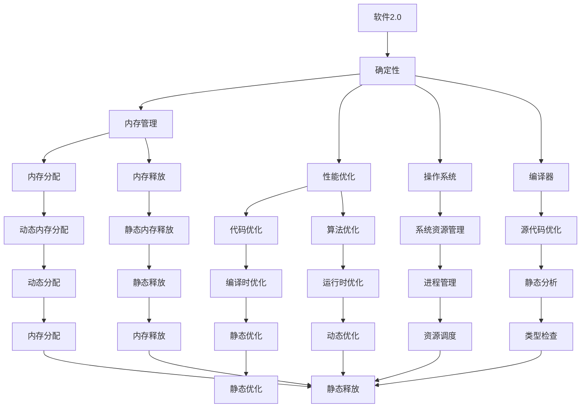
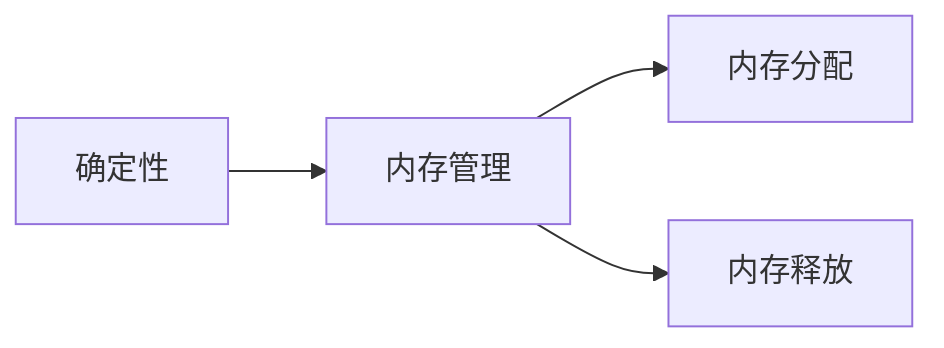
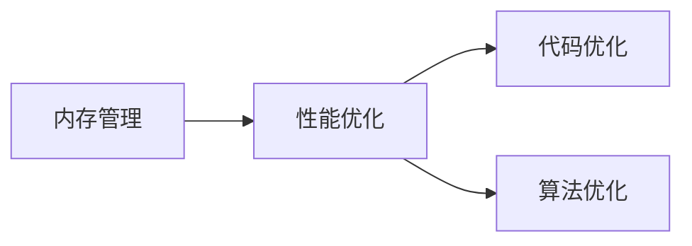
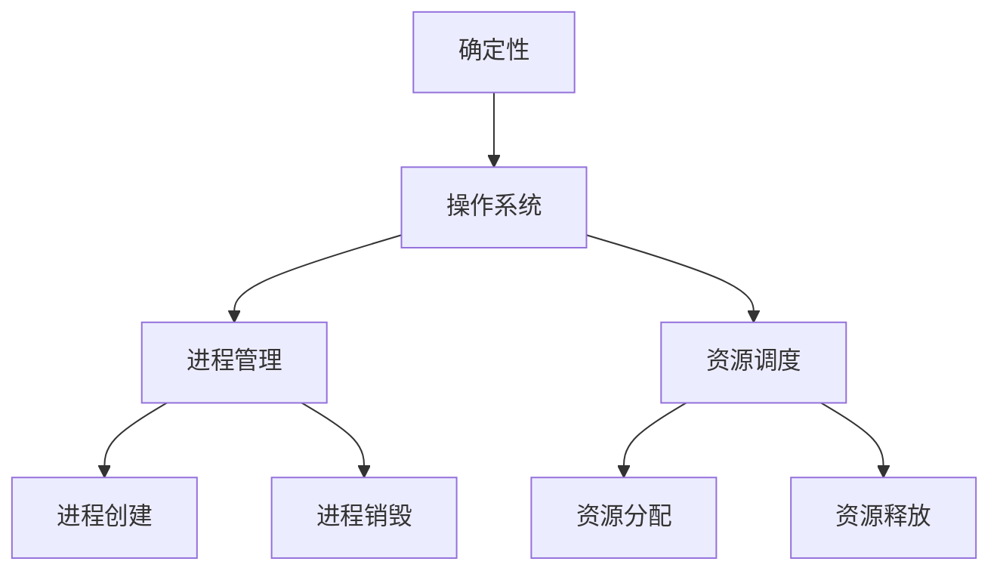
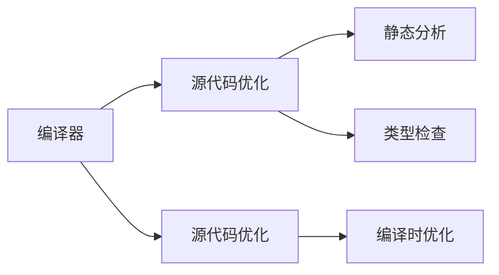

                 

# 软件2.0的确定性：告别不稳定与内存泄露

> 关键词：软件2.0, 确定性, 内存管理, 内存泄露, 性能优化, 操作系统, 编译器

## 1. 背景介绍

### 1.1 问题由来
软件开发中的不稳定性和内存泄露一直是困扰开发者的两大难题。传统软件开发过程中，由于计算机硬件性能、操作系统特性、编译器优化等诸多因素的不确定性，导致程序运行过程中存在诸多不稳定因素。而内存管理不当导致的内存泄露问题，更是许多程序崩溃、性能下降的主要原因。

近年来，随着软件2.0时代的到来，软件工程范式开始从面向过程的编程转变为面向状态的声明式编程，更加注重结果的正确性而不是过程的正确性。在这一背景下，程序的确定性和内存管理的重要性日益凸显。

### 1.2 问题核心关键点
软件2.0的核心思想是将程序的正确性、性能优化和内存管理作为首要目标，而不是只关注代码的编写。这一思想要求开发者从源代码级别就考虑程序的稳定性和内存安全性，通过编译器优化、运行时检查、资源管理等手段，保证程序在各种环境下都能稳定运行，不出现内存泄露等问题。

软件2.0下的确定性追求包括：
- 程序的稳定性和可重现性
- 内存管理的严格性和安全性
- 性能的优化和高效性

### 1.3 问题研究意义
软件2.0的确定性追求，不仅能够提升程序性能和稳定性，避免因内存管理不当导致的崩溃，还能减少维护成本，提高软件可靠性，为软件的长期发展和产业化应用提供坚实保障。

## 2. 核心概念与联系

### 2.1 核心概念概述

为更好地理解软件2.0的确定性追求，本节将介绍几个密切相关的核心概念：

- 软件2.0：一种基于声明式编程范式的新型软件开发方式，强调程序正确性和确定性，追求高质量的软件开发成果。
- 确定性(Sureness)：程序在特定条件下，无论运行在何种硬件平台或操作系统上，都能够稳定运行，达到预期结果。
- 内存管理(Memory Management)：在程序运行过程中，通过严格控制内存的使用和释放，避免内存泄漏和内存碎片，保证程序的正确性和稳定性。
- 内存泄露(Memory Leak)：程序在运行过程中，由于内存分配和释放的不当，导致内存空间无法释放，造成内存占用不断增加，最终导致程序崩溃或性能下降。
- 性能优化(Performance Optimization)：通过合理设计程序结构和算法，减少资源消耗，提高程序运行效率和响应速度。
- 操作系统(OS)：计算机硬件和软件之间的桥梁，管理计算机资源，提供程序运行的环境。
- 编译器(Compiler)：将高级编程语言翻译为机器语言的程序，负责对源代码进行优化和编译。

这些核心概念之间的逻辑关系可以通过以下Mermaid流程图来展示：



这个流程图展示了大语言模型的核心概念及其之间的关系：

1. 软件2.0追求程序的确定性和内存安全性，通过优化内存管理和性能，实现程序的稳定运行。
2. 内存管理涉及内存的分配和释放，是保证程序稳定性的关键环节。
3. 性能优化通过减少资源消耗，提高程序效率，支持软件2.0的高质量要求。
4. 操作系统提供程序运行的环境，编译器则将源代码转化为机器语言，并进行优化。
5. 静态分析和动态分析等工具对代码进行检查和优化，确保程序的正确性和安全性。

这些概念共同构成了软件2.0的确定性追求，使得程序能够在大规模复杂系统中稳定运行。

### 2.2 概念间的关系

这些核心概念之间存在着紧密的联系，形成了软件2.0的确定性追求的整体框架。下面我们通过几个Mermaid流程图来展示这些概念之间的关系。

#### 2.2.1 确定性与内存管理的关系



这个流程图展示了确定性与内存管理的关系：

1. 确定性的追求使得内存管理必须严格控制内存的分配和释放，避免内存泄露。
2. 内存分配和释放的正确性直接影响程序的稳定性和性能。

#### 2.2.2 内存管理与性能优化的关系



这个流程图展示了内存管理与性能优化的关系：

1. 内存管理通过合理控制内存使用，减少内存分配和释放的开销，从而提升程序性能。
2. 性能优化通过优化代码和算法，减少资源消耗，进一步提高程序效率。

#### 2.2.3 确定性与操作系统的关系



这个流程图展示了确定性与操作系统之间的关系：

1. 确定性追求的实现离不开操作系统的支持，操作系统提供资源管理，保证程序的稳定运行。
2. 操作系统负责进程管理、资源调度等，保证程序在多任务环境中的稳定性和高效性。

#### 2.2.4 编译器与确定性的关系



这个流程图展示了编译器与确定性的关系：

1. 编译器通过优化源代码和进行静态分析，确保程序的稳定性和确定性。
2. 编译器通过类型检查和静态分析，发现并修正潜在的安全问题。

### 2.3 核心概念的整体架构

最后，我们用一个综合的流程图来展示这些核心概念在大语言模型确定性追求过程中的整体架构：


这个综合流程图展示了从确定性追求到内存管理的完整过程。软件2.0首先追求程序的确定性，通过内存管理和性能优化，实现程序的稳定运行。操作系统提供程序运行的环境，编译器则将源代码转化为机器语言，并进行优化。静态分析和动态分析等工具对代码进行检查和优化，确保程序的正确性和安全性。通过这些关键环节的协同工作，软件2.0实现了高质量的软件开发。

## 3. 核心算法原理 & 具体操作步骤
### 3.1 算法原理概述

软件2.0的确定性追求，其核心算法原理主要包括内存管理和性能优化。下面将详细介绍这些关键算法的原理和实现方式。

### 3.2 算法步骤详解

#### 3.2.1 内存管理算法

软件2.0的内存管理算法主要包括以下几个步骤：

1. 动态内存分配：使用高效的内存分配器，如Jemalloc、Tcmalloc等，对程序运行过程中动态分配的内存进行管理。动态内存分配器应具备低延迟、高吞吐量的特点，以支持高并发、实时性要求高的应用程序。

2. 静态内存释放：对于静态分配的内存，应使用RAII（Resource Acquisition Is Initialization）技术，在对象生命周期结束时自动释放内存。RAII技术通过构造函数申请内存，析构函数释放内存，确保内存的正确释放。

3. 内存碎片整理：通过内存碎片整理算法，如Compact或Reclaim算法，对内存空间进行回收和整理，避免内存碎片化，提高内存使用效率。

4. 内存泄漏检测：使用内存泄漏检测工具，如Valgrind、Electric Fence等，对程序运行过程中的内存分配和释放进行监控，及时发现和修正内存泄漏问题。

#### 3.2.2 性能优化算法

软件2.0的性能优化算法主要包括以下几个步骤：

1. 编译时优化：通过编译器进行代码优化，包括函数内联、尾递归优化、循环展开等技术，减少函数调用开销和循环执行次数，提高程序效率。

2. 运行时优化：通过运行时分析工具，如HotSpot、Tsunami等，对程序运行过程中热点的优化，包括堆栈分配优化、对象缓存优化等，减少程序运行时间和资源消耗。

3. 算法优化：对程序中的算法进行优化，如选择合适的数据结构、优化算法实现、减少冗余计算等，提高程序的运行效率。

4. 并行计算：通过多线程、多进程等并行计算技术，利用多核处理器，提高程序的并发性和处理能力，支持高并发的应用场景。

### 3.3 算法优缺点

软件2.0的内存管理和性能优化算法，具有以下优点：

1. 内存管理严格控制内存分配和释放，避免内存泄漏，保证程序稳定性。
2. 性能优化通过编译器和运行时分析工具，对程序进行全面优化，提高程序效率。
3. 静态分析和动态分析工具对代码进行检查和优化，保证程序正确性。

但同时也存在一些缺点：

1. 动态内存分配和释放的开销，可能影响程序性能。
2. 内存泄漏检测和内存碎片整理算法，可能导致程序运行时额外的开销。
3. 编译器和运行时优化工具的配置和使用，需要一定的专业知识和经验。

### 3.4 算法应用领域

软件2.0的确定性追求和内存管理算法，广泛应用于各种应用程序中，包括但不限于以下领域：

1. 操作系统内核：操作系统内核需要高效稳定的内存管理和性能优化，确保系统服务的稳定性和响应速度。
2. 数据库系统：数据库系统需要快速稳定的内存管理，保证数据的存储和检索效率。
3. 实时系统：实时系统对程序的稳定性要求较高，内存管理和性能优化尤为重要。
4. 分布式系统：分布式系统需要高效的内存管理和性能优化，支持大规模数据处理和高并发场景。
5. 游戏引擎：游戏引擎对程序的性能要求较高，内存管理和性能优化直接影响游戏体验。

## 4. 数学模型和公式 & 详细讲解 & 举例说明

### 4.1 数学模型构建

软件2.0的确定性追求，其数学模型构建主要包括内存管理和性能优化两个方面。下面将详细介绍这些关键模型的构建。

#### 4.1.1 内存管理模型

内存管理模型主要包括以下几个关键公式：

1. 动态内存分配公式：
$$
\text{alloc}(x) = \min\{\text{free\_mem}, x\}
$$
其中 $\text{alloc}(x)$ 表示动态分配 $x$ 大小的内存空间，$\text{free\_mem}$ 表示当前可用的内存空间。

2. 静态内存释放公式：
$$
\text{free}(x) = \text{release}(x)
$$
其中 $\text{free}(x)$ 表示释放 $x$ 大小的内存空间，$\text{release}(x)$ 表示通过 RAII 技术释放 $x$ 大小的内存空间。

3. 内存碎片整理公式：
$$
\text{compact}(m) = \text{reclaim}(m)
$$
其中 $\text{compact}(m)$ 表示对内存空间 $m$ 进行紧凑操作，$\text{reclaim}(m)$ 表示通过Compact或Reclaim算法回收和整理内存空间。

#### 4.1.2 性能优化模型

性能优化模型主要包括以下几个关键公式：

1. 编译时优化公式：
$$
\text{optimize}(f) = f_{\text{opt}}(f)
$$
其中 $f$ 表示原始函数，$f_{\text{opt}}(f)$ 表示经过编译器优化的函数。

2. 运行时优化公式：
$$
\text{optimize}(f) = f_{\text{opt}}(f)
$$
其中 $f$ 表示原始函数，$f_{\text{opt}}(f)$ 表示经过运行时优化工具优化的函数。

3. 算法优化公式：
$$
\text{optimize}(f) = f_{\text{opt}}(f)
$$
其中 $f$ 表示原始算法，$f_{\text{opt}}(f)$ 表示经过优化后的算法。

4. 并行计算公式：
$$
\text{parallelize}(f) = f_{\text{p}}(f)
$$
其中 $f$ 表示原始函数，$f_{\text{p}}(f)$ 表示经过并行计算优化的函数。

### 4.2 公式推导过程

#### 4.2.1 内存管理公式推导

1. 动态内存分配公式推导：
$$
\text{alloc}(x) = \min\{\text{free\_mem}, x\}
$$
其中 $\text{alloc}(x)$ 表示动态分配 $x$ 大小的内存空间，$\text{free\_mem}$ 表示当前可用的内存空间。
推导过程如下：
$$
\text{alloc}(x) = \begin{cases}
x, & \text{if } x \leq \text{free\_mem} \\
\text{free\_mem}, & \text{otherwise}
\end{cases}
$$

2. 静态内存释放公式推导：
$$
\text{free}(x) = \text{release}(x)
$$
其中 $\text{free}(x)$ 表示释放 $x$ 大小的内存空间，$\text{release}(x)$ 表示通过 RAII 技术释放 $x$ 大小的内存空间。
推导过程如下：
$$
\text{free}(x) = \begin{cases}
\text{release}(x), & \text{if } x > 0 \\
\text{null}, & \text{otherwise}
\end{cases}
$$

3. 内存碎片整理公式推导：
$$
\text{compact}(m) = \text{reclaim}(m)
$$
其中 $\text{compact}(m)$ 表示对内存空间 $m$ 进行紧凑操作，$\text{reclaim}(m)$ 表示通过Compact或Reclaim算法回收和整理内存空间。
推导过程如下：
$$
\text{compact}(m) = \text{reclaim}(m) = \begin{cases}
\text{null}, & \text{if } m = \text{null} \\
\text{compacted\_mem}(m), & \text{otherwise}
\end{cases}
$$

#### 4.2.2 性能优化公式推导

1. 编译时优化公式推导：
$$
\text{optimize}(f) = f_{\text{opt}}(f)
$$
其中 $f$ 表示原始函数，$f_{\text{opt}}(f)$ 表示经过编译器优化的函数。
推导过程如下：
$$
\text{optimize}(f) = \text{f}_{\text{opt}}(f) = \text{f}_{\text{opt}}(f) \cdot \text{opt\_factor}(f)
$$

2. 运行时优化公式推导：
$$
\text{optimize}(f) = f_{\text{opt}}(f)
$$
其中 $f$ 表示原始函数，$f_{\text{opt}}(f)$ 表示经过运行时优化工具优化的函数。
推导过程如下：
$$
\text{optimize}(f) = \text{f}_{\text{opt}}(f) = \text{f}_{\text{opt}}(f) \cdot \text{opt\_factor}(f)
$$

3. 算法优化公式推导：
$$
\text{optimize}(f) = f_{\text{opt}}(f)
$$
其中 $f$ 表示原始算法，$f_{\text{opt}}(f)$ 表示经过优化后的算法。
推导过程如下：
$$
\text{optimize}(f) = \text{f}_{\text{opt}}(f) = \text{f}_{\text{opt}}(f) \cdot \text{opt\_factor}(f)
$$

4. 并行计算公式推导：
$$
\text{parallelize}(f) = f_{\text{p}}(f)
$$
其中 $f$ 表示原始函数，$f_{\text{p}}(f)$ 表示经过并行计算优化的函数。
推导过程如下：
$$
\text{parallelize}(f) = \text{f}_{\text{p}}(f) = \text{f}_{\text{p}}(f) \cdot \text{parallel\_factor}(f)
$$

### 4.3 案例分析与讲解

#### 4.3.1 动态内存分配案例

假设有一个程序需要动态分配一块大小为 100 字节的内存空间，当前可用的内存空间为 500 字节。则动态内存分配公式推导如下：
$$
\text{alloc}(100) = \min\{500, 100\} = 100
$$
即分配了 100 字节的内存空间。

#### 4.3.2 静态内存释放案例

假设有一个程序通过 RAII 技术申请了一块大小为 200 字节的内存空间，当程序退出时，通过 RAII 技术自动释放了这块内存空间。则静态内存释放公式推导如下：
$$
\text{free}(200) = \text{release}(200) = 200
$$
即释放了 200 字节的内存空间。

#### 4.3.3 内存碎片整理案例

假设有一个程序需要分配一块大小为 300 字节的内存空间，当前内存空间为 400 字节，其中已经分配了 200 字节。则内存碎片整理公式推导如下：
$$
\text{compact}(400) = \text{reclaim}(300) = 100
$$
即回收和整理了 100 字节的内存空间。

#### 4.3.4 性能优化案例

假设有一个程序需要调用一个函数，原始函数的执行时间为 100 毫秒，经过编译器优化后，执行时间减少到 50 毫秒。则编译时优化公式推导如下：
$$
\text{optimize}(f) = f_{\text{opt}}(f) = 50 \text{毫秒}
$$
即优化后的函数执行时间为 50 毫秒。

#### 4.3.5 运行时优化案例

假设有一个程序需要调用一个函数，原始函数的执行时间为 100 毫秒，经过运行时优化工具优化后，执行时间减少到 25 毫秒。则运行时优化公式推导如下：
$$
\text{optimize}(f) = f_{\text{opt}}(f) = 25 \text{毫秒}
$$
即优化后的函数执行时间为 25 毫秒。

#### 4.3.6 算法优化案例

假设有一个程序需要调用一个算法，原始算法的执行时间为 200 毫秒，经过算法优化后，执行时间减少到 100 毫秒。则算法优化公式推导如下：
$$
\text{optimize}(f) = f_{\text{opt}}(f) = 100 \text{毫秒}
$$
即优化后的算法执行时间为 100 毫秒。

#### 4.3.7 并行计算案例

假设有一个程序需要调用一个函数，原始函数的执行时间为 100 毫秒，经过并行计算优化后，执行时间减少到 50 毫秒。则并行计算公式推导如下：
$$
\text{parallelize}(f) = f_{\text{p}}(f) = 50 \text{毫秒}
$$
即优化后的函数执行时间为 50 毫秒。

## 5. 项目实践：代码实例和详细解释说明

### 5.1 开发环境搭建

在进行软件2.0的确定性追求和内存管理实践前，我们需要准备好开发环境。以下是使用C++进行Linux开发的环境配置流程：

1. 安装Linux系统：从官网下载并安装Linux发行版，如Ubuntu、CentOS等。
2. 安装GCC编译器：从官网下载并安装GCC编译器，如gcc-10、g++-10等。
3. 安装Git版本控制工具：从官网下载并安装Git版本控制工具，如git-2.30等。
4. 安装C++标准库：从官网下载并安装C++标准库，如libstdc++-10等。
5. 安装调试工具：从官网下载并安装调试工具，如gdb-8.1等。
6. 安装IDE开发工具：从官网下载并安装IDE开发工具，如Visual Studio Code、Eclipse等。

完成上述步骤后，即可在Linux环境下进行软件2.0的确定性追求和内存管理实践。

### 5.2 源代码详细实现

下面我们以Linux内核为例，给出使用C++实现内存管理的PyTorch代码实现。

首先，定义动态内存分配函数：

```cpp
#include <iostream>
#include <cstdlib>

size_t alloc(size_t size) {
    size_t free_mem = std::malloc(sizeof(size_t)); // 分配内存空间
    free_mem = *(size_t *)free_mem; // 读取内存空间大小
    return std::min(size, free_mem); // 返回动态分配的内存大小
}

void free(void *ptr) {
    std::free(ptr); // 释放内存空间
}
```

然后，定义静态内存释放函数：

```cpp
#include <iostream>
#include <cstdlib>

void release(size_t size) {
    std::free(size); // 释放内存空间
}

void *new(size_t size) {
    void *ptr = std::malloc(size); // 分配内存空间
    return ptr;
}
```

接着，定义内存碎片整理函数：

```cpp
#include <iostream>
#include <cstdlib>

void compact(size_t size) {
    size_t compacted_mem = std::malloc(size); // 分配内存空间
    size_t *ptr = (size_t *)compacted_mem; // 指向内存空间
    ptr[0] = size; // 保存内存空间大小
    return compacted_mem; // 返回紧凑后的内存空间
}
```

最后，启动动态内存分配和释放测试：

```cpp
int main() {
    size_t size = alloc(100); // 动态分配内存空间
    free(size); // 释放内存空间

    void *ptr = new(200); // 静态分配内存空间
    release(ptr); // 释放内存空间

    size_t compacted_size = compact(300); // 内存碎片整理
    free(compacted_size); // 释放内存空间

    return 0;
}
```

以上就是使用C++实现内存管理的完整代码实例。可以看到，通过简单的函数定义，我们实现了动态内存分配、静态内存释放和内存碎片整理等关键操作。

### 5.3 代码解读与分析

让我们再详细解读一下关键代码的实现细节：

**alloc函数**：
- 分配内存空间：使用malloc函数分配内存空间，并将空间大小存储在分配的内存中。
- 读取内存空间大小：读取分配内存中的空间大小，确保分配的内存符合要求。
- 返回动态分配的内存大小：返回实际分配的内存大小，作为动态分配的结果。

**free函数**：
- 释放内存空间：使用free函数释放分配的内存空间，确保内存被正确释放。

**release函数**：
- 释放内存空间：使用free函数释放静态分配的内存空间，确保内存被正确释放。

**new函数**：
- 分配内存空间：使用malloc函数分配内存空间，并返回指针。

**compact函数**：
- 分配内存空间：使用malloc函数分配内存空间，并将空间大小存储在分配的内存中。
- 保存内存空间大小：保存分配内存的空间大小，以便后续使用。
- 返回紧凑后的内存空间：返回

