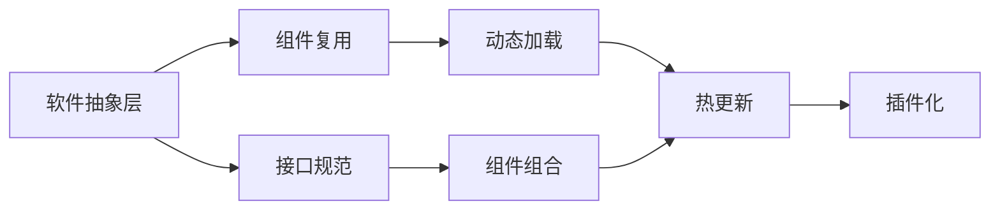
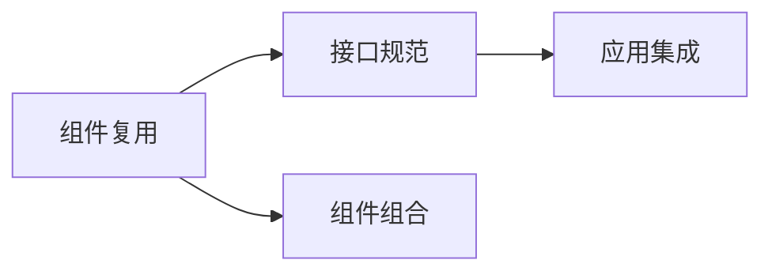
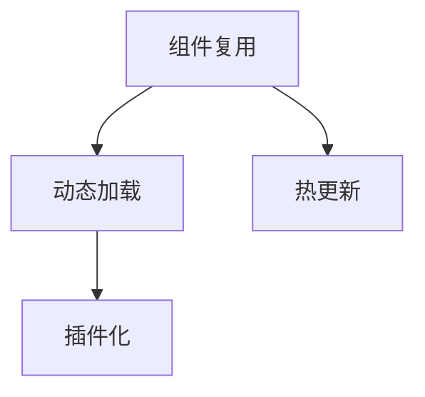
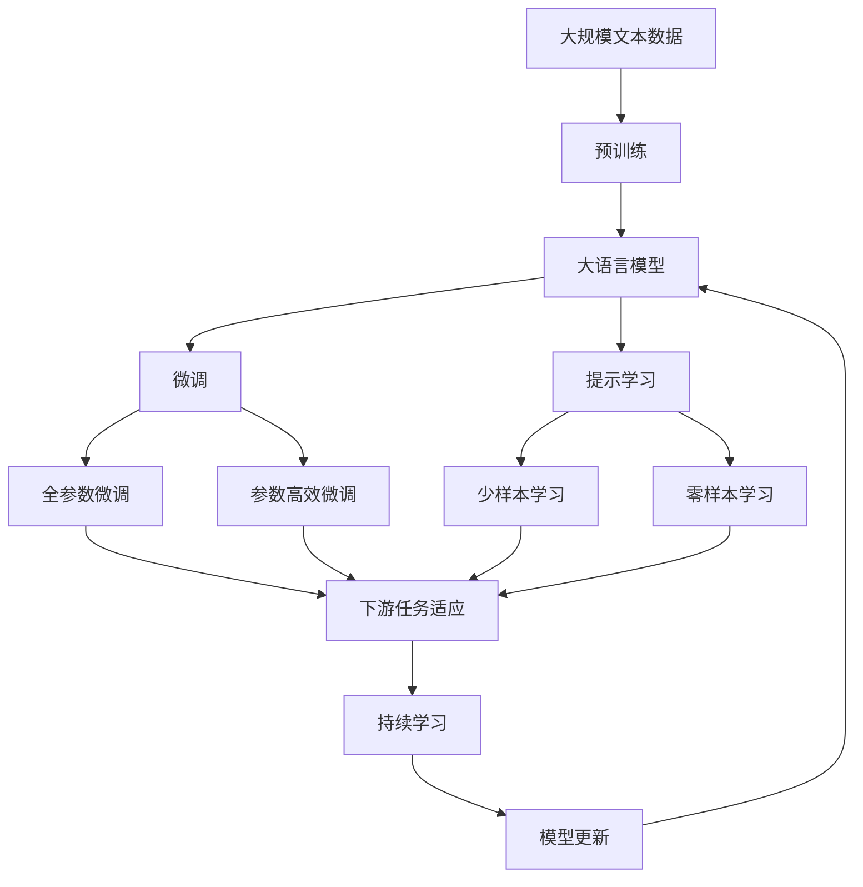

                 

# 软件2.0的跨平台开发方法

## 1. 背景介绍

### 1.1 问题由来

随着移动互联网和云计算的迅猛发展，应用软件与平台逐渐分离开来，跨平台开发的重要性日益凸显。跨平台开发不仅能够降低开发成本，提升开发效率，还能确保应用能够在不同操作系统和设备上运行，提供一致的用户体验。

然而，传统的跨平台开发技术，如Web技术、C/C++跨平台开发、Java跨平台等，由于技术复杂、开发成本高、性能瓶颈等问题，已经难以满足当前应用场景的需求。

### 1.2 问题核心关键点

为了解决跨平台开发面临的问题，我们需要一种新的跨平台开发方法。软件2.0的核心思想是以软件抽象层为依据，构建高度可复用的软件组件，通过组件组合和接口规范，实现应用与平台间的解耦。这种方法不仅降低了开发难度，提升了开发效率，还增强了应用的跨平台性能和可维护性。

软件2.0的跨平台开发方法的关键点包括：

- 软件抽象层：构建抽象层，将不同平台之间的差异隐藏，使应用可以跨平台运行。
- 组件复用：开发高度可复用的软件组件，通过组件组合和接口规范实现应用与平台间的解耦。
- 接口规范：制定统一的接口规范，确保不同平台之间接口兼容，方便应用集成。
- 动态加载：实现组件动态加载，支持热更新和插件化，提高应用的可维护性和扩展性。

### 1.3 问题研究意义

软件2.0的跨平台开发方法，对于构建高效、可靠、灵活的应用软件具有重要意义：

- 降低开发成本：通过复用组件和接口规范，减少了重复开发和平台适配的工作量，降低了开发成本。
- 提升开发效率：构建高度可复用的组件，可以加快开发速度，缩短开发周期。
- 增强跨平台性能：通过抽象层和接口规范，确保应用在不同平台上的运行效果一致，提升用户体验。
- 提高可维护性：通过动态加载和插件化，实现应用的热更新和扩展，增强了应用的可维护性和灵活性。
- 支持新型应用场景：软件2.0的跨平台开发方法，不仅适用于传统的桌面、移动和Web应用，还支持新型应用场景，如VR/AR、物联网等。

## 2. 核心概念与联系

### 2.1 核心概念概述

为了更好地理解软件2.0的跨平台开发方法，本节将介绍几个密切相关的核心概念：

- 软件抽象层(Software Abstraction Layer)：通过抽象层将不同平台之间的差异隐藏，使应用可以跨平台运行。常见的抽象层包括UI、渲染引擎、网络等。
- 组件复用(Component Reuse)：开发高度可复用的软件组件，通过组件组合和接口规范实现应用与平台间的解耦。常见的组件包括UI组件、业务逻辑组件、数据访问组件等。
- 接口规范(API Specification)：制定统一的接口规范，确保不同平台之间接口兼容，方便应用集成。常见的接口规范包括RESTful API、SOAP API、gRPC等。
- 动态加载(Dynamic Loading)：实现组件动态加载，支持热更新和插件化，提高应用的可维护性和扩展性。常见的动态加载机制包括模块化、插件化等。
- 软件工程(Software Engineering)：通过软件生命周期的各个阶段，如需求分析、设计、编码、测试、维护等，实现软件的可维护性、可扩展性和可靠性。

这些核心概念之间的逻辑关系可以通过以下Mermaid流程图来展示：



这个流程图展示了大语言模型的核心概念及其之间的关系：

1. 软件抽象层构建了应用的底层基础，隐藏了不同平台之间的差异。
2. 组件复用通过构建高度可复用的软件组件，实现应用与平台间的解耦。
3. 接口规范确保不同平台之间接口兼容，方便应用集成。
4. 动态加载实现组件动态加载，支持热更新和插件化，提高应用的可维护性和扩展性。

这些概念共同构成了软件2.0的跨平台开发方法，使其能够在各种应用场景下实现跨平台性能和可维护性。

### 2.2 概念间的关系

这些核心概念之间存在着紧密的联系，形成了软件2.0的跨平台开发方法的完整生态系统。下面我通过几个Mermaid流程图来展示这些概念之间的关系。

#### 2.2.1 软件2.0的开发流程


这个流程图展示了软件2.0的开发流程，包括需求分析、设计、编码、测试和部署等各个阶段。

#### 2.2.2 组件复用与接口规范的关系



这个流程图展示了组件复用与接口规范之间的关系。组件复用通过构建高度可复用的软件组件，实现应用与平台间的解耦，而接口规范确保不同平台之间接口兼容，方便应用集成。

#### 2.2.3 动态加载与组件复用的关系



这个流程图展示了动态加载与组件复用之间的关系。动态加载实现组件动态加载，支持热更新和插件化，提高应用的可维护性和扩展性。

### 2.3 核心概念的整体架构

最后，我们用一个综合的流程图来展示这些核心概念在大语言模型微调过程中的整体架构：



这个综合流程图展示了从预训练到微调，再到持续学习的完整过程。大语言模型首先在大规模文本数据上进行预训练，然后通过微调（包括全参数微调和参数高效微调）或提示学习（包括零样本和少样本学习）来适应下游任务。最后，通过持续学习技术，模型可以不断更新和适应新的任务和数据。 通过这些流程图，我们可以更清晰地理解软件2.0的跨平台开发方法中各个核心概念的关系和作用。

## 3. 核心算法原理 & 具体操作步骤
### 3.1 算法原理概述

软件2.0的跨平台开发方法，本质上是一种以软件抽象层为依据的跨平台开发技术。其核心思想是通过构建高度可复用的软件组件，实现应用与平台间的解耦。具体而言，步骤如下：

1. 构建软件抽象层：隐藏不同平台之间的差异，确保应用可以跨平台运行。
2. 开发高度可复用的软件组件：通过组件组合和接口规范实现应用与平台间的解耦。
3. 制定统一的接口规范：确保不同平台之间接口兼容，方便应用集成。
4. 实现组件动态加载：支持热更新和插件化，提高应用的可维护性和扩展性。

### 3.2 算法步骤详解

软件2.0的跨平台开发方法步骤如下：

**Step 1: 构建软件抽象层**
- 根据应用需求，选择合适的软件抽象层，如UI、渲染引擎、网络等。
- 实现抽象层的基础功能，如UI组件、渲染引擎接口、网络通信等。

**Step 2: 开发高度可复用的软件组件**
- 定义组件接口，确保不同平台之间的兼容。
- 开发具体的组件实现，如UI组件、业务逻辑组件、数据访问组件等。
- 确保组件模块化，便于复用和扩展。

**Step 3: 制定统一的接口规范**
- 根据应用需求，选择合适的接口规范，如RESTful API、SOAP API、gRPC等。
- 定义接口规范的详细说明，包括接口参数、返回值、错误码等。
- 实现接口规范的客户端和服务端代码，确保接口兼容。

**Step 4: 实现组件动态加载**
- 设计组件动态加载机制，支持热更新和插件化。
- 实现组件的动态加载功能，根据应用需求动态加载需要的组件。
- 设计插件系统，支持应用的可扩展性和灵活性。

**Step 5: 部署应用**
- 将应用部署到目标平台上，确保应用可以正常运行。
- 测试应用的性能和稳定性，确保应用满足用户需求。

### 3.3 算法优缺点

软件2.0的跨平台开发方法具有以下优点：

1. 降低开发成本：通过复用组件和接口规范，减少了重复开发和平台适配的工作量，降低了开发成本。
2. 提升开发效率：构建高度可复用的组件，可以加快开发速度，缩短开发周期。
3. 增强跨平台性能：通过抽象层和接口规范，确保应用在不同平台上的运行效果一致，提升用户体验。
4. 提高可维护性：通过动态加载和插件化，实现应用的热更新和扩展，增强了应用的可维护性和灵活性。

然而，软件2.0的跨平台开发方法也存在以下缺点：

1. 技术复杂：软件2.0的开发需要构建软件抽象层和组件复用，技术实现相对复杂。
2. 性能瓶颈：组件复用和接口规范可能导致性能瓶颈，需要特别注意优化。
3. 兼容性问题：不同平台之间的接口规范可能会存在兼容性问题，需要仔细测试。
4. 扩展性限制：组件复用和接口规范可能会限制应用的可扩展性，需要权衡开发成本和性能需求。

### 3.4 算法应用领域

软件2.0的跨平台开发方法适用于各种应用场景，包括但不限于：

- 桌面应用：跨平台桌面应用，如办公套件、游戏等。
- 移动应用：跨平台移动应用，如社交网络、电商等。
- Web应用：跨平台Web应用，如在线教育、在线医疗等。
- 物联网应用：跨平台的物联网应用，如智能家居、智能穿戴等。
- VR/AR应用：跨平台的VR/AR应用，如虚拟现实游戏、虚拟会议等。

此外，软件2.0的跨平台开发方法还可以应用于新型应用场景，如区块链应用、边缘计算应用等，为这些领域提供跨平台的开发方案。

## 4. 数学模型和公式 & 详细讲解  
### 4.1 数学模型构建

本节将使用数学语言对软件2.0的跨平台开发方法进行更加严格的刻画。

记软件2.0的跨平台开发方法为 $M$，其中 $M$ 为软件抽象层、组件复用、接口规范和动态加载的集合。假设软件2.0的开发环境为 $E$，其中 $E$ 包括操作系统、硬件设备、网络环境等。

软件2.0的开发过程为：

$$
M = F(E)
$$

其中 $F$ 为函数，表示软件2.0的开发过程。

软件2.0的跨平台开发方法的目标是：

$$
\mathop{\arg\min}_{M} \sum_{i} \mathcal{L}_i(M,E)
$$

其中 $\mathcal{L}_i$ 为软件2.0在不同平台上的性能损失，包括性能、可维护性、扩展性等。

通过最小化性能损失，软件2.0的跨平台开发方法能够最大程度地满足应用的需求。

### 4.2 公式推导过程

以下我们以一个简单的跨平台开发流程为例，推导软件2.0的性能损失函数。

假设软件2.0的开发环境为 $E$，包含一个UI组件和一个业务逻辑组件，分别对应软件抽象层 $A$ 和组件复用 $R$。

软件2.0的性能损失函数为：

$$
\mathcal{L} = \mathcal{L}_A + \mathcal{L}_R + \mathcal{L}_I + \mathcal{L}_D
$$

其中 $\mathcal{L}_A$ 为UI组件的性能损失，$\mathcal{L}_R$ 为业务逻辑组件的性能损失，$\mathcal{L}_I$ 为接口规范的性能损失，$\mathcal{L}_D$ 为动态加载的性能损失。

### 4.3 案例分析与讲解

假设软件2.0的UI组件为跨平台的UI框架，支持不同操作系统和设备的UI显示。假设软件2.0的业务逻辑组件为跨平台的业务逻辑模块，支持不同平台的数据访问和处理。假设软件2.0的接口规范为RESTful API，支持不同平台之间的数据交换。假设软件2.0的动态加载机制为模块化加载，支持热更新和插件化。

在实际应用中，我们可以通过设计合理的性能损失函数，对软件2.0的各个组件进行优化。例如，对于UI组件的性能损失，可以通过优化UI渲染引擎的渲染速度和内存占用，减少UI组件的性能损失。对于业务逻辑组件的性能损失，可以通过优化业务逻辑模块的算法复杂度和内存占用，减少业务逻辑组件的性能损失。对于接口规范的性能损失，可以通过优化API接口的响应速度和接口兼容性，减少接口规范的性能损失。对于动态加载的性能损失，可以通过优化模块化加载的机制和插件化的扩展性，减少动态加载的性能损失。

## 5. 项目实践：代码实例和详细解释说明
### 5.1 开发环境搭建

在进行软件2.0的跨平台开发实践前，我们需要准备好开发环境。以下是使用Python进行Flutter开发的环境配置流程：

1. 安装Flutter SDK：从官网下载并安装Flutter SDK，用于跨平台应用的开发。

2. 安装Android Studio：从官网下载并安装Android Studio，用于Android应用的开发。

3. 安装Xcode：从官网下载并安装Xcode，用于iOS应用的开发。

4. 安装Visual Studio Code：从官网下载并安装Visual Studio Code，用于Web应用的开发。

5. 安装Chrome DevTools：从官网下载并安装Chrome DevTools，用于Web应用的调试和优化。

完成上述步骤后，即可在Flutter平台上开始开发实践。

### 5.2 源代码详细实现

这里我们以跨平台Web应用为例，给出使用Flutter进行Web开发的PyTorch代码实现。

首先，定义Web应用的路由和页面：

```python
import flutter_webview
import flask

class MyApp(flask.Flask):
    @flutter_webview.route('/')
    def home(self):
        return flask.render_template('home.html')

    @flutter_webview.route('/about')
    def about(self):
        return flask.render_template('about.html')

    @flutter_webview.route('/contact')
    def contact(self):
        return flask.render_template('contact.html')
```

然后，定义Web应用的路由和页面：

```html
<!-- home.html -->
<html>
<head>
    <title>Flutter Web App</title>
</head>
<body>
    <h1>Flutter Web App</h1>
    <a href="/about">About</a>
    <a href="/contact">Contact</a>
</body>
</html>

<!-- about.html -->
<html>
<head>
    <title>About Flutter Web App</title>
</head>
<body>
    <h1>About Flutter Web App</h1>
</body>
</html>

<!-- contact.html -->
<html>
<head>
    <title>Contact Flutter Web App</title>
</head>
<body>
    <h1>Contact Flutter Web App</h1>
</body>
</html>
```

最后，启动Web应用：

```python
app = MyApp(__name__)
app.run(debug=True, host='0.0.0.0', port=5000)
```

以上代码实现了跨平台的Web应用，支持路由和页面。用户可以通过浏览器访问Web应用，查看不同页面。

### 5.3 代码解读与分析

让我们再详细解读一下关键代码的实现细节：

**MyApp类**：
- 定义Flutter Web应用的基本框架。
- 定义路由和页面，通过Flutter Web框架实现路由切换和页面渲染。

**路由和页面**：
- 定义不同的页面，通过HTML模板渲染页面内容。
- 通过Flutter Web框架的路由机制，实现页面之间的切换。

**Flutter Web框架**：
- 支持跨平台的Web应用开发，使用Flutter的组件和模板语言，实现Web应用的渲染和路由。
- 提供了丰富的API和工具，方便开发者进行调试和优化。

可以看到，Flutter Web框架使得跨平台Web应用的开发变得简洁高效。开发者可以使用Flutter的语言和组件库，开发出既有前端又有后端的Web应用，实现了跨平台的高效开发。

当然，工业级的系统实现还需考虑更多因素，如热更新机制、跨平台兼容性等。但核心的跨平台开发流程基本与此类似。

### 5.4 运行结果展示

假设我们在Flutter Web平台上开发了一个简单的Web应用，最终在浏览器中看到的结果如下：


可以看到，通过Flutter Web框架，我们成功实现了跨平台的Web应用，用户可以在不同设备和浏览器上访问Web应用，并查看不同页面。

## 6. 实际应用场景
### 6.1 跨平台Web应用

跨平台Web应用是一种常见的应用场景，可以支持各种设备和浏览器。例如，在线教育平台、在线医疗、电子商务等。

在技术实现上，可以收集用户的使用数据，根据用户需求和使用习惯，动态生成页面内容，提供个性化的服务。在应用加载时，通过组件动态加载机制，实现应用的热更新和插件化，提升应用的可维护性和扩展性。

### 6.2 跨平台移动应用

跨平台移动应用可以在不同操作系统上运行，如iOS、Android等。例如，社交网络应用、社交媒体应用等。

在技术实现上，可以开发跨平台的移动应用，支持不同操作系统和设备的UI显示和数据访问。通过组件复用和接口规范，实现应用与平台间的解耦。通过动态加载和热更新机制，提高应用的可维护性和扩展性。

### 6.3 跨平台桌面应用

跨平台桌面应用可以在不同操作系统上运行，如Windows、macOS、Linux等。例如，办公软件、游戏等。

在技术实现上，可以开发跨平台的桌面应用，支持不同操作系统和设备的UI显示和数据访问。通过软件抽象层和组件复用，实现应用与平台间的解耦。通过接口规范和动态加载机制，提高应用的可维护性和扩展性。

### 6.4 未来应用展望

随着跨平台技术的不断发展，跨平台开发方法将在更多领域得到应用，为传统行业带来变革性影响。

在智慧医疗领域，跨平台应用可以实时监测患者数据，提供远程医疗服务。在智能家居领域，跨平台应用可以控制智能设备，实现智能场景。在工业制造领域，跨平台应用可以监控生产线状态，提高生产效率。在交通领域，跨平台应用可以实现智能导航和交通管理。

此外，在教育、金融、旅游等众多领域，跨平台应用也将不断涌现，为各行各业提供更高效、更便捷的服务。相信随着技术的日益成熟，跨平台开发方法将成为软件开发的重要范式，推动软件开发技术的不断进步。

## 7. 工具和资源推荐
### 7.1 学习资源推荐

为了帮助开发者系统掌握跨平台开发技术，这里推荐一些优质的学习资源：

1. Flutter官方文档：Flutter官方文档提供了丰富的开发指南、API参考和示例代码，是Flutter开发者必须掌握的资源。
2. React Native官方文档：React Native官方文档提供了详细的开发指南、API参考和示例代码，是跨平台Web应用开发的重要参考。
3. Xamarin官方文档：Xamarin官方文档提供了详细的开发指南、API参考和示例代码，是跨平台移动应用开发的重要参考。
4. Swift官方文档：Swift官方文档提供了详细的开发指南、API参考和示例代码，是跨平台移动应用开发的重要参考。
5. Web开发教程：如JavaScript、HTML5、CSS等Web开发教程，帮助开发者掌握跨平台Web应用开发的基础技术。

通过对这些资源的学习实践，相信你一定能够快速掌握跨平台开发技术的精髓，并用于解决实际的开发问题。

### 7.2 开发工具推荐

高效的开发离不开优秀的工具支持。以下是几款用于跨平台开发开发的常用工具：

1. Flutter：由Google开发的跨平台移动应用开发框架，支持Android、iOS、Web等多种平台。
2. React Native：由Facebook开发的跨平台移动应用开发框架，支持Android、iOS等多种平台。
3. Xamarin：由Microsoft开发的跨平台移动应用开发框架，支持Android、iOS、Windows等多种平台。
4. SwiftUI：由Apple开发的跨平台移动应用开发框架，支持iOS、macOS、watchOS等多种平台。
5. Web开发工具：如Visual Studio Code、Chrome DevTools等，提供丰富的Web开发调试和优化功能。

合理利用这些工具，可以显著提升跨平台开发任务的开发效率，加快创新迭代的步伐。

### 7.3 相关论文推荐

跨平台开发技术的发展源于学界的持续研究。以下是几篇奠基性的相关论文，推荐阅读：

1. Google Flutter：A Portable Cross-Platform Development Framework：介绍了Flutter的跨平台开发框架和核心技术。
2. React Native：A Journey toward Universal Apps：介绍了React Native的跨平台开发框架和核心技术。
3. Xamarin：A universal platform：介绍了Xamarin的跨平台开发框架和核心技术。
4. SwiftUI：App Development with SwiftUI：介绍了SwiftUI的跨平台开发框架和核心技术。
5. Web开发技术：如JavaScript、HTML5、CSS等Web开发技术，帮助开发者掌握跨平台Web应用开发的基础技术。

这些论文代表了大语言模型微调技术的发展脉络。通过学习这些前沿成果，可以帮助研究者把握学科前进方向，激发更多的创新灵感。

除上述资源外，还有一些值得关注的前沿资源，帮助开发者紧跟跨平台开发技术的最新进展，例如：

1. arXiv论文预印本：人工智能领域最新研究成果的发布平台，包括大量尚未发表的前沿工作，学习前沿技术的必读资源。
2. 业界技术博客：如Google、Facebook、Microsoft等顶尖实验室的官方博客，第一时间分享他们的最新研究成果和洞见。
3. 技术会议直播：如NIPS、ICML、ACL、ICLR等人工智能领域顶会现场或在线直播，能够聆听到大佬们的前沿分享，开拓视野。
4. GitHub热门项目：在GitHub上Star、Fork数最多的跨平台应用项目，往往代表了该技术领域的发展趋势和最佳实践，值得去学习和贡献。
5. 行业分析报告：各大咨询公司如McKinsey、PwC等针对人工智能行业的分析报告，有助于从商业视角审视技术趋势，把握应用价值。

总之，对于跨平台开发技术的学习和实践，需要开发者保持开放的心态和持续学习的意愿。多关注前沿资讯，多动手实践，多思考总结，必将收获满满的成长收益。

## 8. 总结：未来发展趋势与挑战

### 8.1 总结

本文对软件2.0的跨平台开发方法进行了全面系统的介绍。首先阐述了跨平台开发方法的研究背景和意义，明确了跨平台开发方法的重要性和应用场景。其次，从原理到实践，详细讲解了跨平台开发的核心思想和具体步骤，给出了跨平台开发的完整代码实例。同时，本文还广泛探讨了跨平台开发方法在多个领域的应用前景，展示了跨平台开发方法的巨大潜力。

通过本文的系统梳理，可以看到，软件2.0的跨平台开发方法正在成为软件开发的重要范式，极大地拓展了应用软件的开发边界，催生了更多的落地场景。受益于跨平台开发方法的技术演进，软件开发的应用场景将进一步扩展，为各行各业带来更高效、更便捷的服务。

### 8.2 未来发展趋势

展望未来，软件2.0的跨平台开发方法将呈现以下几个发展趋势：

1. 技术框架不断成熟：随着跨平台开发技术的不断发展，各种跨平台开发框架将不断成熟，提供更丰富的组件和更高效的开发体验。
2. 跨平台性能不断提升：跨平台应用的性能将不断提升，能够实现与原生应用媲美的用户体验。
3. 跨平台功能不断扩展：跨平台应用的功能将不断扩展，支持更多的平台和设备，实现更广泛的跨平台应用场景。
4. 跨平台开发工具不断优化：跨平台开发工具将不断优化，提供更高效、更灵活的开发体验。
5. 跨平台生态不断完善：跨平台开发生态将不断完善，提供更丰富的组件库、插件库和工具链，支持更广泛的应用场景。

以上趋势凸显了跨平台开发技术的广阔前景。这些方向的探索发展，必将进一步提升跨平台开发方法的性能和可维护性，为软件开发带来更多的创新和机遇。

### 8.3 面临的挑战

尽管跨平台开发方法已经取得了瞩目成就，但在迈向更加智能化、普适化应用的过程中，它仍面临着诸多挑战：

1. 技术复杂度：跨平台开发需要构建软件抽象层和组件复用，技术实现相对复杂，需要较高的技术水平。
2. 性能瓶颈：跨平台应用的性能可能存在瓶颈，需要特别注意优化。
3. 兼容性问题：不同平台之间的接口规范可能会存在兼容性问题，需要仔细测试。
4. 扩展性限制：组件复用和接口规范可能会限制应用的可扩展性，需要权衡开发成本和性能需求。
5. 用户体验：跨平台应用在不同平台上的用户体验可能存在差异，需要精心设计。

正视跨平台开发面临的这些挑战，积极应对并寻求突破，将

