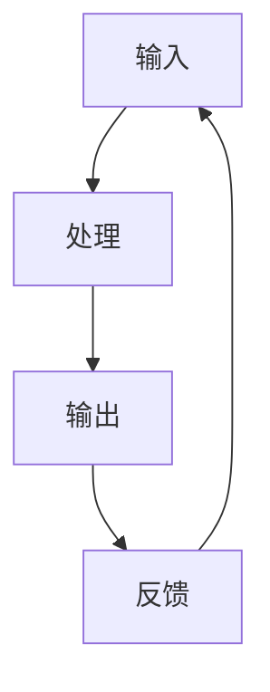

                 

# 输入、处理、输出、反馈的逻辑

> 关键词：输入、处理、输出、反馈、逻辑流、系统设计、软件工程

## 1. 背景介绍

在现代信息技术体系中，数据和信号的流动贯穿整个系统设计、开发和运行的全过程。无论是在软件开发、硬件设计，还是在云服务、人工智能等各个领域，输入、处理、输出、反馈的逻辑都是系统的核心所在。理解和掌握这一逻辑流，对于高效、可靠、可维护的系统和应用设计至关重要。

本文将深入探讨输入、处理、输出、反馈的逻辑，并结合实际案例，介绍如何在软件工程实践中应用这些原则，以实现高效的系统设计和开发。

## 2. 核心概念与联系

### 2.1 核心概念概述

在进行详细讨论前，我们需要明确一些核心概念：

- **输入**：系统的外部输入可以是数据、信号、事件等，用于系统处理和计算的基础。
- **处理**：系统内部的一系列计算、推理和控制逻辑，实现对输入的加工和转换。
- **输出**：系统处理后的结果，可以是数据、信号、图像、文本等，供外部使用或进一步处理。
- **反馈**：系统输出的一部分或全部通过一定机制返回至输入端，影响后续输入的处理过程。

这些概念在计算机系统中构建了一种环路，输入被处理并输出，而输出部分或全部通过反馈影响输入的下一轮处理。这种逻辑流贯穿于整个系统设计和实现的各个环节。

### 2.2 概念间的关系

通过下面的Mermaid流程图，我们可以更直观地理解这些核心概念之间的关系：



这个流程图展示了一个基本的系统循环，输入经过处理产生输出，部分输出又作为反馈影响输入，形成了一个闭环。这种反馈机制是实现自适应和高效系统设计的基础。

## 3. 核心算法原理 & 具体操作步骤

### 3.1 算法原理概述

输入、处理、输出、反馈的逻辑是现代系统设计的基本原理之一。在软件工程中，这一原理可以应用于各种类型的系统设计和开发，包括但不限于：

- 数据处理系统：如数据库管理系统、ETL（Extract, Transform, Load）工具等。
- 算法库和框架：如TensorFlow、PyTorch等深度学习框架。
- 分布式计算系统：如Spark、Flink等。
- 用户界面和交互系统：如Web应用、移动应用等。

算法原理上，输入、处理、输出、反馈的逻辑通常遵循以下步骤：

1. **输入接收**：系统接收外部输入，可能是数据、命令、事件等。
2. **数据处理**：系统根据需求对输入进行转换、计算和分析。
3. **输出生成**：处理后的数据转化为系统的输出，通常供进一步使用或展示。
4. **反馈机制**：部分输出作为反馈输入到系统，影响下一轮处理。

### 3.2 算法步骤详解

下面，我们通过一个简单的数据处理系统示例，详细介绍每个步骤的具体实现：

#### 3.2.1 输入接收

在数据处理系统中，输入通常是各种形式的数据，如CSV文件、JSON数据、SQL查询等。对于这些不同形式的数据，系统需要通过解析器或适配器进行处理。

**代码实现**：
```python
class DataReceiver:
    def receive(self, data_format):
        if data_format == 'csv':
            return parse_csv(data)
        elif data_format == 'json':
            return parse_json(data)
        elif data_format == 'sql':
            return execute_sql(data)
        else:
            raise ValueError("Unsupported data format")
```

#### 3.2.2 数据处理

数据处理通常涉及到数据的清洗、转换、分析和计算。这些操作可以是简单的数据格式转换，也可以是复杂的算法模型计算。

**代码实现**：
```python
class DataProcessor:
    def process(self, data):
        # 数据清洗
        cleaned_data = self.clean(data)
        # 数据转换
        transformed_data = self.transform(cleaned_data)
        # 数据分析
        analyzed_data = self.analyze(transformed_data)
        # 数据计算
        computed_data = self.calculate(analyzed_data)
        return computed_data
```

#### 3.2.3 输出生成

处理后的数据需要转化为系统的输出，这些输出可以是数据库记录、API响应、报告文件等。

**代码实现**：
```python
class OutputGenerator:
    def generate(self, data):
        # 将处理结果转化为数据库记录
        save_to_database(data)
        # 生成API响应
        api_response = generate_api_response(data)
        # 生成报告文件
        save_report_file(data)
        return api_response
```

#### 3.2.4 反馈机制

在许多情况下，系统的部分输出可以作为反馈输入，影响下一轮的处理。比如，基于用户交互的Web应用，用户点击行为可以反馈到系统，影响内容的推荐和展示。

**代码实现**：
```python
class FeedbackReceiver:
    def receive(self, output):
        # 接收用户点击行为
        click_data = output
        # 根据点击行为调整推荐算法
        recommend_algorithm = adjust_algorithm(click_data)
        return recommend_algorithm
```

### 3.3 算法优缺点

输入、处理、输出、反馈的逻辑虽然是一种有效的系统设计原则，但也存在一些缺点和挑战：

#### 优点：

1. **灵活性和适应性**：通过反馈机制，系统可以自适应环境和需求的变化，提升系统的灵活性和适应性。
2. **高效性**：通过循环迭代，系统可以在处理每个输入时都利用上一次处理的输出，减少重复计算，提高系统效率。
3. **可靠性和鲁棒性**：反馈机制可以帮助系统检测并纠正错误，提升系统的可靠性和鲁棒性。

#### 缺点：

1. **复杂性**：设计输入、处理、输出、反馈的循环，可能引入更多的复杂性和耦合性。
2. **延迟**：反馈机制的引入可能增加系统的延迟，特别是在高负载和高复杂度的系统中。
3. **资源消耗**：处理和反馈机制的计算和存储消耗可能较大，需要合理配置资源。

### 3.4 算法应用领域

输入、处理、输出、反馈的逻辑广泛应用在各种系统和应用中，以下是几个典型领域：

#### 1. 数据库管理系统

在数据库管理系统中，用户查询输入被处理成SQL语句，经过数据库执行生成结果，部分结果作为反馈调整查询计划，以优化后续查询。

#### 2. 深度学习框架

在深度学习框架中，输入数据经过神经网络处理，生成输出，部分输出用于调整模型参数和优化策略，以提高模型性能。

#### 3. 分布式计算系统

在分布式计算系统中，任务被分解为多个子任务并行处理，部分结果作为反馈调整任务分配和负载平衡策略。

#### 4. 用户界面和交互系统

在用户界面和交互系统中，用户操作输入被处理成系统命令，生成输出，部分输出作为反馈调整UI展示和交互逻辑。

## 4. 数学模型和公式 & 详细讲解 & 举例说明

### 4.1 数学模型构建

输入、处理、输出、反馈的逻辑可以用数学模型来描述。下面以一个简单的数据处理系统为例，构建数学模型：

假设系统接收的数据为 $X$，处理后的结果为 $Y$，反馈输入为 $F$。系统处理逻辑可以表示为：

$$ Y = g(X, F) $$

其中 $g$ 为系统的处理函数，$X$ 为输入数据，$F$ 为反馈数据。

### 4.2 公式推导过程

在上述模型中，$X$ 和 $F$ 的关系可以表示为：

$$ F = h(X, Y) $$

其中 $h$ 为系统的反馈函数。将 $F$ 代入 $Y$ 的计算公式中，得到：

$$ Y = g(X, h(X, Y)) $$

这是一个递归定义，表示 $Y$ 依赖于 $X$ 和前一轮处理结果 $Y$。

### 4.3 案例分析与讲解

考虑一个简单的推荐系统，用户历史行为数据 $X$ 被输入，经过处理生成推荐结果 $Y$。推荐结果 $Y$ 又作为反馈，调整后续推荐算法，进一步优化推荐结果。这个系统可以表示为：

$$ Y = f(X, F) $$

其中 $f$ 为推荐算法，$F$ 为历史推荐结果。反馈函数 $h$ 可以根据当前推荐结果 $Y$ 调整推荐算法参数，例如：

$$ F = \alpha * Y + (1 - \alpha) * X $$

其中 $\alpha$ 为反馈强度，$0 \leq \alpha \leq 1$。

## 5. 项目实践：代码实例和详细解释说明

### 5.1 开发环境搭建

在进行项目实践前，需要搭建好开发环境。以下是使用Python进行开发的基本环境配置：

1. 安装Python：下载并安装Python 3.8及以上版本。
2. 安装虚拟环境管理工具：安装`virtualenv`，创建虚拟环境。
3. 安装依赖库：安装必要的依赖库，如numpy、pandas、scikit-learn等。

### 5.2 源代码详细实现

以下是一个简单的数据处理系统的实现，展示输入、处理、输出、反馈的逻辑：

**接收模块**：
```python
class DataReceiver:
    def receive(self, data_format):
        if data_format == 'csv':
            return parse_csv(data)
        elif data_format == 'json':
            return parse_json(data)
        elif data_format == 'sql':
            return execute_sql(data)
        else:
            raise ValueError("Unsupported data format")
```

**处理模块**：
```python
class DataProcessor:
    def process(self, data):
        # 数据清洗
        cleaned_data = self.clean(data)
        # 数据转换
        transformed_data = self.transform(cleaned_data)
        # 数据分析
        analyzed_data = self.analyze(transformed_data)
        # 数据计算
        computed_data = self.calculate(analyzed_data)
        return computed_data
```

**输出模块**：
```python
class OutputGenerator:
    def generate(self, data):
        # 将处理结果转化为数据库记录
        save_to_database(data)
        # 生成API响应
        api_response = generate_api_response(data)
        # 生成报告文件
        save_report_file(data)
        return api_response
```

**反馈模块**：
```python
class FeedbackReceiver:
    def receive(self, output):
        # 接收用户点击行为
        click_data = output
        # 根据点击行为调整推荐算法
        recommend_algorithm = adjust_algorithm(click_data)
        return recommend_algorithm
```

### 5.3 代码解读与分析

**接收模块**：
- 实现输入数据的解析和转换，根据不同数据格式调用相应的解析器。

**处理模块**：
- 实现数据的清洗、转换、分析和计算，根据实际需求选择相应的处理函数。

**输出模块**：
- 实现数据的输出，包括数据库记录生成、API响应生成和报告文件生成。

**反馈模块**：
- 实现反馈数据的接收和处理，根据用户行为调整推荐算法。

### 5.4 运行结果展示

假设我们在一个推荐系统中进行测试，用户历史行为数据输入后，系统进行数据处理生成推荐结果，部分推荐结果作为反馈调整推荐算法。运行结果可能包括：

- 数据库记录
- API响应
- 推荐算法参数调整

## 6. 实际应用场景

### 6.1 推荐系统

在推荐系统中，用户历史行为数据被输入，经过处理生成推荐结果。推荐结果部分作为反馈，调整推荐算法参数，进一步优化推荐结果。这种自适应机制可以提升推荐系统的精准度和用户满意度。

### 6.2 数据挖掘系统

在数据挖掘系统中，原始数据被输入，经过处理生成特征向量。部分处理结果作为反馈，调整特征提取和处理策略，以提高数据挖掘的效率和准确性。

### 6.3 智能监控系统

在智能监控系统中，传感器数据被输入，经过处理生成报警信息。部分报警信息作为反馈，调整监控策略和阈值，提升监控系统的可靠性和鲁棒性。

### 6.4 未来应用展望

随着技术的发展，输入、处理、输出、反馈的逻辑将在更多领域得到应用，为系统设计提供新的思路：

- 边缘计算：通过在边缘设备上处理和反馈，实现低延迟、高可靠的数据处理。
- 区块链：通过区块链的分布式共识机制，实现更安全和透明的数据处理和反馈。
- 人机交互：通过智能语音和图像处理技术，实现自然流畅的人机交互和反馈。

## 7. 工具和资源推荐

### 7.1 学习资源推荐

为了深入理解输入、处理、输出、反馈的逻辑，推荐以下学习资源：

1. 《软件工程原理》：该书详细介绍了系统设计和软件开发的原则，包括输入、处理、输出、反馈的逻辑。
2. 《数据科学实战》：该书介绍了数据处理、数据分析和数据可视化的实践技巧，有助于理解数据处理系统的设计。
3. 《深度学习基础》：该书介绍了深度学习框架和算法的基本原理，涵盖了输入、处理、输出、反馈的逻辑。
4. 在线课程：如Coursera、Udacity等平台上的数据处理、机器学习、深度学习相关课程。
5. 论文和博客：如arXiv、IEEE Xplore等平台上的相关论文和博客，了解最新的研究和实践进展。

### 7.2 开发工具推荐

以下工具可以辅助开发和调试输入、处理、输出、反馈逻辑的实现：

1. IDE：如PyCharm、Visual Studio Code等，提供代码编辑和调试功能。
2. 版本控制系统：如Git，管理代码的版本和协作开发。
3. 测试框架：如unittest、pytest等，自动化测试输入、处理、输出、反馈的逻辑。
4. 数据库系统：如MySQL、PostgreSQL等，存储和查询数据。
5. 数据可视化工具：如Matplotlib、Seaborn等，可视化数据处理结果。

### 7.3 相关论文推荐

以下是一些关于输入、处理、输出、反馈逻辑的著名论文：

1. 《数据处理系统设计》：介绍了数据处理系统的基本设计和实现原理。
2. 《推荐系统算法》：介绍了推荐系统的算法设计和实现，涵盖了反馈机制的应用。
3. 《深度学习模型》：介绍了深度学习模型和算法的原理，涉及输入、处理、输出、反馈的逻辑。
4. 《分布式计算框架》：介绍了分布式计算框架的设计和实现，包括反馈机制的应用。
5. 《用户界面设计》：介绍了用户界面的设计原则和反馈机制，提升人机交互体验。

## 8. 总结：未来发展趋势与挑战

### 8.1 总结

本文深入探讨了输入、处理、输出、反馈的逻辑，并结合实际案例，介绍了如何在软件工程实践中应用这些原则。通过理解这一逻辑，可以设计出高效、可靠、可维护的系统和应用。

### 8.2 未来发展趋势

随着技术的发展，输入、处理、输出、反馈的逻辑将在更多领域得到应用：

1. 云计算：通过云平台的高可扩展性和弹性计算，实现更高效、更灵活的数据处理和反馈。
2. 物联网：通过边缘计算和分布式处理，实现实时、低延迟的数据处理和反馈。
3. 人工智能：通过智能算法和模型，实现更智能、更个性化的输入、处理、输出、反馈机制。
4. 区块链：通过区块链的分布式共识和透明性，实现更安全和可靠的数据处理和反馈。

### 8.3 面临的挑战

尽管输入、处理、输出、反馈的逻辑在实践中广泛应用，但也面临一些挑战：

1. 复杂性：设计循环迭代逻辑时，需要考虑系统各部分之间的依赖和耦合关系，增加设计和调试的复杂性。
2. 延迟：反馈机制的引入可能增加系统的延迟，特别是在高负载和高复杂度的系统中。
3. 资源消耗：处理和反馈机制的计算和存储消耗可能较大，需要合理配置资源。

### 8.4 研究展望

未来的研究可以从以下几个方面进行：

1. 优化反馈机制：通过改进反馈函数和反馈策略，提升系统的自适应性和鲁棒性。
2. 提高系统效率：通过优化处理算法和数据结构，减少延迟和资源消耗。
3. 扩展应用场景：将输入、处理、输出、反馈的逻辑应用于更多领域，提升系统的通用性和实用性。
4. 实现自动化设计：通过自动化工具和模型，简化系统设计和实现的过程，提升开发效率。

总之，输入、处理、输出、反馈的逻辑是现代系统设计的基础，通过深入理解和应用这一逻辑，可以设计出高效、可靠、可维护的系统和应用，推动信息技术的发展和进步。

## 9. 附录：常见问题与解答

### Q1: 输入、处理、输出、反馈的逻辑在实际应用中如何优化？

A: 优化输入、处理、输出、反馈的逻辑，可以从以下几个方面入手：

1. 优化输入接收：选择合适的解析器和适配器，提高数据输入的效率和准确性。
2. 优化数据处理：选择高效的算法和数据结构，减少计算和存储消耗。
3. 优化输出生成：选择合适的方式和格式，减少资源消耗和延迟。
4. 优化反馈机制：选择合适的反馈策略和函数，提升系统的自适应性和鲁棒性。

### Q2: 在实现输入、处理、输出、反馈逻辑时，有哪些常见的陷阱？

A: 实现输入、处理、输出、反馈逻辑时，常见的陷阱包括：

1. 输入处理不充分：输入数据格式错误、数据清洗不足等，可能导致处理结果错误。
2. 输出格式不当：输出格式不规范或格式错误，可能导致后续处理中断或错误。
3. 反馈机制不合理：反馈强度不当、反馈机制过于复杂，可能导致系统不稳定或反馈失效。
4. 资源管理不当：处理和反馈机制的计算和存储消耗较大，可能导致系统性能下降或崩溃。

### Q3: 如何评估输入、处理、输出、反馈逻辑的性能？

A: 评估输入、处理、输出、反馈逻辑的性能，可以从以下几个方面入手：

1. 计算资源消耗：监控CPU、内存、磁盘等计算资源的消耗，评估系统的资源利用效率。
2. 延迟和响应时间：测量系统的延迟和响应时间，评估系统的性能和用户体验。
3. 正确性和准确性：通过测试和验证，评估系统的输出正确性和处理准确性。
4. 稳定性与鲁棒性：在多种负载和数据条件下，测试系统的稳定性和鲁棒性。

总之，理解并应用输入、处理、输出、反馈的逻辑，对于设计高效、可靠、可维护的系统和应用至关重要。通过不断优化和改进这一逻辑，可以在软件开发和系统设计中取得更好的效果。

---

作者：禅与计算机程序设计艺术 / Zen and the Art of Computer Programming

