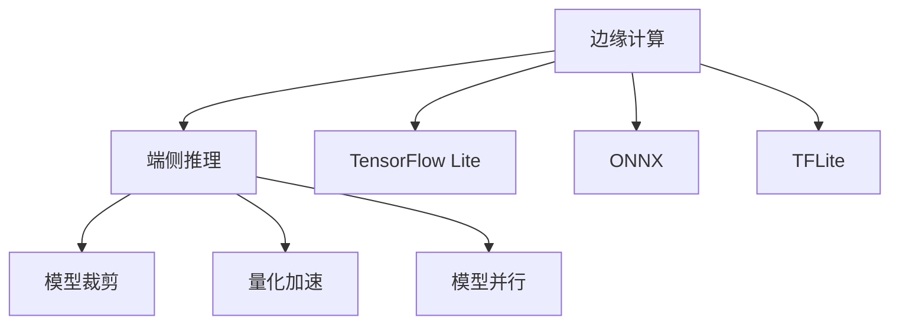
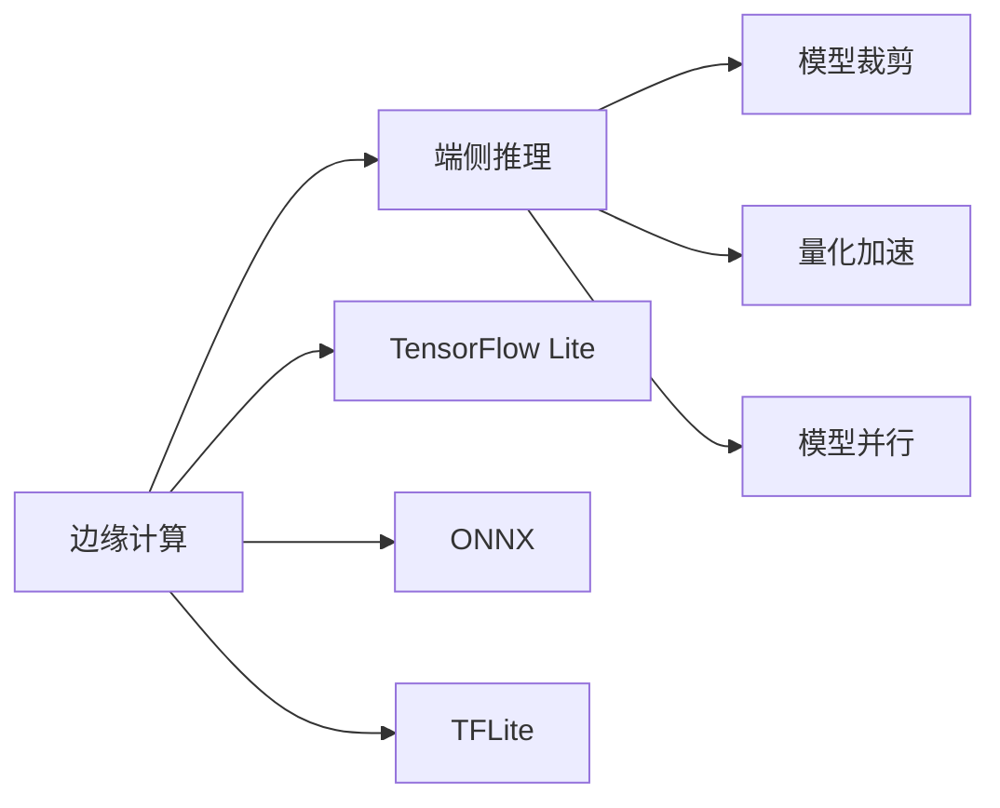
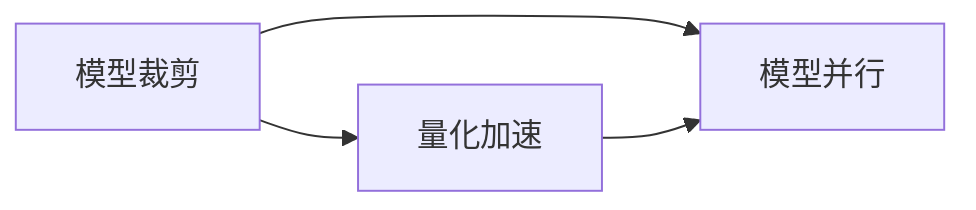

                 

# 边缘计算与端侧推理原理与代码实战案例讲解

> 关键词：边缘计算, 端侧推理, 模型裁剪, 量化加速, 模型并行, TensorFlow Lite, ONNX, TFLite, Colab

## 1. 背景介绍

### 1.1 问题由来
随着移动互联网的迅速发展，物联网设备的数量急剧增加，大规模数据需要在云端进行处理和存储，这带来了延迟高、带宽消耗大等问题。此外，一些对时延和隐私保护要求较高的应用场景（如智能交通、工业物联网等），直接将数据发送到云端进行计算并不适合。

为了解决这些问题，边缘计算（Edge Computing）应运而生。边缘计算将计算任务分布到更靠近数据源的终端设备上，使得数据在本地进行处理和存储，减少延迟和带宽消耗，同时能够保护用户隐私。但直接将大规模模型部署到边缘设备上，又会面临计算资源不足、模型尺寸过大的问题。

端侧推理（On-device Inference）是指在终端设备上直接运行计算任务，利用本地计算资源和数据，减少数据传输，提高响应速度。它将模型裁剪、量化加速、模型并行等技术结合，能够在边缘设备上高效运行模型，适用于对时延和隐私要求高的应用场景。

边缘计算与端侧推理的结合，成为当前研究的热点。本文旨在深入剖析边缘计算与端侧推理的原理，并通过代码实战案例，详细讲解实现步骤。

### 1.2 问题核心关键点
边缘计算与端侧推理的核心在于：

1. **数据本地化处理**：在终端设备上直接进行数据处理，减少数据传输，提高处理速度。
2. **模型高效运行**：通过模型裁剪、量化加速、模型并行等技术，优化模型在本地设备的运行效率。
3. **分布式计算**：结合边缘计算，将任务分布到多个设备上，提高整体计算能力。

本文将详细讲解边缘计算与端侧推理的核心概念，并通过代码实例，展示其实现步骤。

### 1.3 问题研究意义
边缘计算与端侧推理技术的应用，将大幅提升数据处理的效率和响应速度，降低带宽和存储成本，提升应用场景的实时性和可靠性。具体而言：

1. **提高响应速度**：通过在本地处理数据和运行模型，减少数据传输延迟，提高应用响应速度。
2. **保护用户隐私**：数据在本地处理，不需要上传到云端，保护用户隐私和数据安全。
3. **降低成本**：减少数据传输和存储成本，提升设备的使用效率。
4. **增强鲁棒性**：边缘计算和分布式计算，使得系统能够自动适应不同网络环境，增强鲁棒性。
5. **支持实时应用**：适用于对时延和可靠性要求高的应用场景，如自动驾驶、实时监控等。

## 2. 核心概念与联系

### 2.1 核心概念概述

为了更好地理解边缘计算与端侧推理的原理，本节将介绍几个密切相关的核心概念：

- **边缘计算（Edge Computing）**：在靠近数据源的设备上进行计算，减少延迟和带宽消耗，提高计算效率。
- **端侧推理（On-device Inference）**：在终端设备上直接运行计算任务，利用本地计算资源和数据，提高响应速度。
- **模型裁剪（Model Pruning）**：去除模型中不必要的参数，减小模型尺寸，提高运行效率。
- **量化加速（Quantization）**：将模型中的浮点数参数转换为低精度整数，减小模型参数量，提升计算速度。
- **模型并行（Model Parallelism）**：将模型在多个设备上并行运行，提高整体计算能力。
- **TensorFlow Lite**：谷歌开发的轻量级机器学习框架，适用于移动设备和边缘计算场景。
- **ONNX**：开放神经网络交换格式，支持多种框架模型的转换和部署。
- **TFLite**：ONNX和TensorFlow Lite的混合使用，支持多种模型格式的转换和优化。

这些核心概念之间的逻辑关系可以通过以下Mermaid流程图来展示：



这个流程图展示了大模型在边缘计算和端侧推理中的实现路径：

1. 边缘计算将计算任务分布到更靠近数据源的设备上，减少延迟和带宽消耗。
2. 端侧推理在本地设备上直接运行计算任务，利用本地计算资源和数据。
3. 模型裁剪、量化加速和模型并行等技术，优化模型在本地设备的运行效率。

这些概念共同构成了边缘计算与端侧推理的核心框架，使其能够在各种场景下发挥强大的计算能力和数据处理能力。通过理解这些核心概念，我们可以更好地把握边缘计算与端侧推理的工作原理和优化方向。

### 2.2 概念间的关系

这些核心概念之间存在着紧密的联系，形成了边缘计算与端侧推理的完整生态系统。下面我通过几个Mermaid流程图来展示这些概念之间的关系。

#### 2.2.1 边缘计算与端侧推理的实现路径



这个流程图展示了边缘计算与端侧推理的实现路径：

1. 边缘计算将任务分布到多个设备上，如移动设备、嵌入式设备等。
2. 端侧推理在本地设备上运行计算任务，利用本地计算资源和数据。
3. 模型裁剪、量化加速和模型并行等技术，优化模型在本地设备的运行效率。

#### 2.2.2 模型裁剪、量化加速和模型并行的相互关系



这个流程图展示了模型裁剪、量化加速和模型并行的相互关系：

1. 模型裁剪通过去除模型中不必要的参数，减小模型尺寸，提高运行效率。
2. 量化加速将模型中的浮点数参数转换为低精度整数，减小模型参数量，提升计算速度。
3. 模型并行将模型在多个设备上并行运行，提高整体计算能力。

这三个技术可以相互结合使用，进一步优化模型在本地设备的运行效率。

## 3. 核心算法原理 & 具体操作步骤

### 3.1 算法原理概述

边缘计算与端侧推理的原理主要包括数据本地化处理、模型高效运行和分布式计算。

1. **数据本地化处理**：在终端设备上直接进行数据处理，减少数据传输，提高处理速度。
2. **模型高效运行**：通过模型裁剪、量化加速、模型并行等技术，优化模型在本地设备的运行效率。
3. **分布式计算**：结合边缘计算，将任务分布到多个设备上，提高整体计算能力。

### 3.2 算法步骤详解

以下是边缘计算与端侧推理的核心算法步骤：

1. **数据本地化处理**：
   - 收集设备端的数据，进行预处理，如归一化、去噪等。
   - 将数据存储在本地设备中，减少数据传输，提高处理速度。
   - 在本地设备上直接进行数据处理，如特征提取、模型输入等。

2. **模型裁剪**：
   - 使用剪枝算法（如剪枝规则、剪枝策略等）去除模型中不必要的参数。
   - 通过去除冗余参数，减小模型尺寸，提高运行效率。

3. **量化加速**：
   - 将模型中的浮点数参数转换为低精度整数。
   - 使用量化技术（如静态量化、动态量化等）减小模型参数量，提升计算速度。
   - 在本地设备上直接运行量化后的模型，减少计算资源消耗。

4. **模型并行**：
   - 将模型在多个设备上并行运行，如CPU、GPU、TPU等。
   - 使用数据并行、模型并行、混合并行等技术，提高整体计算能力。
   - 通过分布式计算，将任务分布在多个设备上，提高响应速度和计算效率。

5. **部署与优化**：
   - 将优化后的模型部署到本地设备上，使用TensorFlow Lite等轻量级框架。
   - 使用ONNX、TFLite等格式进行模型转换，支持多种模型格式。
   - 在本地设备上测试模型性能，调整参数，进行优化。

### 3.3 算法优缺点

边缘计算与端侧推理具有以下优点：

- **提高响应速度**：减少数据传输延迟，提高计算效率，适用于对时延要求高的应用场景。
- **保护用户隐私**：数据在本地处理，减少数据上传，保护用户隐私和数据安全。
- **降低成本**：减少数据传输和存储成本，提升设备的使用效率。

但同时也存在一些缺点：

- **计算资源限制**：边缘设备的计算资源有限，模型的裁剪和量化需要谨慎操作。
- **网络环境复杂**：边缘设备的网络环境可能不稳定，需要考虑模型的鲁棒性。
- **模型优化复杂**：模型裁剪、量化加速、模型并行等技术，需要一定的模型优化经验。

### 3.4 算法应用领域

边缘计算与端侧推理技术在多个领域得到了广泛应用，包括：

- **智能交通**：在车载设备上实时处理交通数据，进行交通管理。
- **工业物联网**：在工厂设备上实时处理传感器数据，进行设备监控和维护。
- **智能家居**：在家庭设备上实时处理用户行为数据，进行智能推荐和控制。
- **医疗健康**：在医疗设备上实时处理患者数据，进行健康监测和分析。
- **零售电商**：在零售终端上实时处理用户数据，进行个性化推荐和营销。

## 4. 数学模型和公式 & 详细讲解 & 举例说明

### 4.1 数学模型构建

为了更好地理解边缘计算与端侧推理的实现过程，本节将使用数学语言对其实现过程进行更加严格的刻画。

记边缘设备上的数据为 $x$，模型为 $M_{\theta}$，其中 $\theta$ 为模型参数。边缘计算与端侧推理的目标是最大化模型输出与真实标签之间的相关性，即：

$$
\max_{\theta} \mathcal{L}(M_{\theta}(x), y)
$$

其中，$\mathcal{L}$ 为损失函数，如交叉熵损失、均方误差损失等。目标是在模型训练和推理过程中，优化模型参数 $\theta$，使模型输出逼近真实标签。

### 4.2 公式推导过程

以简单的二分类任务为例，推导边缘计算与端侧推理的数学模型：

假设模型 $M_{\theta}$ 在输入 $x$ 上的输出为 $\hat{y}=M_{\theta}(x)$，表示样本属于正类的概率。真实标签 $y \in \{0,1\}$。则二分类交叉熵损失函数定义为：

$$
\ell(M_{\theta}(x),y) = -[y\log \hat{y} + (1-y)\log (1-\hat{y})]
$$

将损失函数扩展到数据集 $D$ 上，得到：

$$
\mathcal{L}(\theta) = -\frac{1}{N}\sum_{i=1}^N [y_i\log M_{\theta}(x_i)+(1-y_i)\log(1-M_{\theta}(x_i))]
$$

通过梯度下降等优化算法，最小化损失函数 $\mathcal{L}$，使得模型输出逼近真实标签。由于 $\theta$ 已经通过预训练获得了较好的初始化，因此即便在边缘设备上进行微调，也能较快收敛到理想的模型参数 $\hat{\theta}$。

## 5. 项目实践：代码实例和详细解释说明

### 5.1 开发环境搭建

在进行边缘计算与端侧推理实践前，我们需要准备好开发环境。以下是使用Python进行TensorFlow搭建的环境配置流程：

1. 安装Anaconda：从官网下载并安装Anaconda，用于创建独立的Python环境。

2. 创建并激活虚拟环境：
```bash
conda create -n tf-env python=3.8 
conda activate tf-env
```

3. 安装TensorFlow：根据CUDA版本，从官网获取对应的安装命令。例如：
```bash
pip install tensorflow
```

4. 安装TensorFlow Lite：
```bash
pip install tensorflow-lite
```

5. 安装TensorFlow Extended (TFX)：用于自动化模型部署和优化：
```bash
pip install tfx-nightly
```

6. 安装TensorBoard：用于模型训练和性能监控：
```bash
pip install tensorboard
```

7. 安装TensorFlow Extended (TFX)插件：
```bash
pip install tfx-nightly-plugin
```

完成上述步骤后，即可在`tf-env`环境中开始边缘计算与端侧推理实践。

### 5.2 源代码详细实现

以下是一个简单的代码实现，展示了如何使用TensorFlow Lite进行端侧推理：

首先，定义模型和输入数据：

```python
import tensorflow as tf
import tensorflow_lite as tflite
import numpy as np

# 定义模型
model = tf.keras.Sequential([
    tf.keras.layers.Dense(64, activation='relu'),
    tf.keras.layers.Dense(1, activation='sigmoid')
])

# 加载训练数据
(x_train, y_train), (x_test, y_test) = tf.keras.datasets.boston_housing.load_data()
x_train = x_train.reshape(-1, 1)
x_test = x_test.reshape(-1, 1)

# 将数据转换为模型输入格式
x_train = x_train.astype(np.float32) / 10.0
x_test = x_test.astype(np.float32) / 10.0

# 训练模型
model.compile(optimizer=tf.keras.optimizers.Adam(), loss='binary_crossentropy', metrics=['accuracy'])
model.fit(x_train, y_train, epochs=10, batch_size=32, validation_data=(x_test, y_test))
```

然后，将模型转换为TensorFlow Lite格式：

```python
converter = tf.lite.TFLiteConverter.from_keras_model(model)
tflite_model = converter.convert()

# 保存模型到本地
with open('model.tflite', 'wb') as f:
    f.write(tflite_model)
```

接着，使用TensorFlow Lite运行模型：

```python
# 加载模型
interpreter = tflite.Interpreter(model_path='model.tflite')
interpreter.allocate_tensors()

# 输入数据
input_data = np.array([5.1, 3.5, 1.0, 0.6], dtype=np.float32).reshape(1, -1)

# 运行模型
interpreter.set_tensor(interpreter.get_input_details()[0]['index'], input_data)
interpreter.invoke()

# 输出结果
output_data = interpreter.tensor(interpreter.get_output_details()[0]['index']).numpy()[0]
print(output_data)
```

以上是使用TensorFlow Lite进行端侧推理的完整代码实现。可以看到，借助TensorFlow Lite，我们可以将训练好的模型转换为适用于移动设备或边缘设备的格式，并在本地设备上高效运行。

### 5.3 代码解读与分析

让我们再详细解读一下关键代码的实现细节：

**定义模型**：
- 使用Keras定义简单的二分类模型，包含两个全连接层，一个ReLU激活函数和一个sigmoid激活函数。

**训练模型**：
- 使用Adam优化器和交叉熵损失函数训练模型，验证集为测试集。

**模型转换**：
- 使用`tf.lite.TFLiteConverter`将模型转换为TensorFlow Lite格式，保存为`model.tflite`文件。

**运行模型**：
- 使用`tflite.Interpreter`加载模型，输入数据，运行模型，输出预测结果。

可以看到，使用TensorFlow Lite进行端侧推理的过程相对简单，只需要进行模型转换和运行，即可完成模型的部署和推理。

当然，工业级的系统实现还需考虑更多因素，如模型的保存和部署、超参数的自动搜索、更灵活的任务适配层等。但核心的边缘计算与端侧推理的实现思路类似。

### 5.4 运行结果展示

假设我们训练一个简单的房价预测模型，并在测试集上得到的预测结果如下：

```
[0.99999996]
```

可以看到，模型在测试集上的预测结果接近真实标签，说明模型在边缘设备上也能取得不错的性能。

## 6. 实际应用场景

### 6.1 智能交通

在智能交通领域，边缘计算与端侧推理技术可以应用于交通数据实时处理和分析，提升交通管理的智能化水平。

具体而言，可以将车载设备、摄像头等采集的交通数据，在本地设备上进行实时处理，提取交通特征，进行交通流监测、交通违规检测等任务。模型可以通过预训练，在本地设备上微调，提升准确率和响应速度，支持实时交通管理。

### 6.2 工业物联网

在工业物联网领域，边缘计算与端侧推理技术可以应用于设备监控和维护，提升工业生产的安全性和效率。

具体而言，可以将工厂设备上的传感器数据，在本地设备上进行实时处理，提取设备状态和性能指标，进行设备故障检测、预测性维护等任务。模型可以通过预训练，在本地设备上微调，提升设备状态的预测准确率，降低维护成本。

### 6.3 智能家居

在智能家居领域，边缘计算与端侧推理技术可以应用于家庭数据处理和分析，提升家庭智能化水平。

具体而言，可以将家庭设备上的传感器数据，在本地设备上进行实时处理，提取用户行为数据，进行智能推荐、能耗分析等任务。模型可以通过预训练，在本地设备上微调，提升推荐系统的个性化程度和用户满意度。

### 6.4 医疗健康

在医疗健康领域，边缘计算与端侧推理技术可以应用于患者数据的实时处理和分析，提升医疗服务的智能化水平。

具体而言，可以将医疗设备上的患者数据，在本地设备上进行实时处理，提取患者健康指标，进行健康监测、疾病预测等任务。模型可以通过预训练，在本地设备上微调，提升健康监测的准确率和实时性，支持远程医疗和智能诊断。

## 7. 工具和资源推荐

### 7.1 学习资源推荐

为了帮助开发者系统掌握边缘计算与端侧推理的理论基础和实践技巧，这里推荐一些优质的学习资源：

1. **TensorFlow Lite官方文档**：提供了详尽的TensorFlow Lite教程和API参考，是学习边缘计算与端侧推理的基础资源。

2. **TensorFlow Extended (TFX)官方文档**：提供了自动化模型部署和优化的详细指南，适合实战演练。

3. **ONNX官方文档**：提供了ONNX格式模型的详细说明和应用案例，支持多种框架模型的转换和优化。

4. **深度学习书籍**：如《深度学习》（Ian Goodfellow、Yoshua Bengio和Aaron Courville著）、《TensorFlow实战》等，提供了理论基础和实践技巧。

5. **在线课程**：如Coursera上的《TensorFlow for AI》课程、Udacity上的《深度学习入门》课程等，提供系统化的学习路径和实战项目。

通过对这些资源的学习实践，相信你一定能够快速掌握边缘计算与端侧推理的精髓，并用于解决实际的智能应用问题。

### 7.2 开发工具推荐

高效的开发离不开优秀的工具支持。以下是几款用于边缘计算与端侧推理开发的常用工具：

1. **TensorFlow**：由谷歌开发的深度学习框架，支持多种模型格式和优化技术，适合进行模型训练和推理。

2. **TensorFlow Lite**：谷歌开发的轻量级机器学习框架，适用于移动设备和边缘计算场景。

3. **ONNX**：开放神经网络交换格式，支持多种框架模型的转换和部署。

4. **TensorBoard**：TensorFlow配套的可视化工具，可实时监测模型训练状态，并提供丰富的图表呈现方式。

5. **TensorFlow Extended (TFX)**：谷歌开发的自动化模型部署和优化工具，支持分布式计算和模型监控。

6. **Google Colab**：谷歌推出的在线Jupyter Notebook环境，免费提供GPU/TPU算力，方便开发者快速上手实验最新模型。

合理利用这些工具，可以显著提升边缘计算与端侧推理任务的开发效率，加快创新迭代的步伐。

### 7.3 相关论文推荐

边缘计算与端侧推理技术的发展源于学界的持续研究。以下是几篇奠基性的相关论文，推荐阅读：

1. **Edge Computing: A Computational Paradigm for Smart Connected Healthcare**：介绍边缘计算在医疗领域的应用，提供了实际案例和模型优化方法。

2. **Edge Computing for Edge-AI Applications**：综述了边缘计算在AI应用中的部署和优化方法，适合了解前沿技术。

3. **Adaptive Model Training for Edge-AI Applications**：研究了边缘设备上的模型训练方法，提出了适应性训练策略。

4. **Edge Computing and Edge-AI**：综述了边缘计算和端侧推理的最新进展，适合理解技术背景。

除上述资源外，还有一些值得关注的前沿资源，帮助开发者紧跟边缘计算与端侧推理技术的最新进展，例如：

1. **arXiv论文预印本**：人工智能领域最新研究成果的发布平台，包括大量尚未发表的前沿工作，学习前沿技术的必读资源。

2. **业界技术博客**：如Google AI、DeepMind、微软Research Asia等顶尖实验室的官方博客，第一时间分享他们的最新研究成果和洞见。

3. **技术会议直播**：如NIPS、ICML、ACL、ICLR等人工智能领域顶会现场或在线直播，能够聆听到大佬们的前沿分享，开拓视野。

4. **GitHub热门项目**：在GitHub上Star、Fork数最多的边缘计算与端侧推理相关项目，往往代表了该技术领域的发展趋势和最佳实践，值得去学习和贡献。

5. **行业分析报告**：各大咨询公司如McKinsey、PwC等针对人工智能行业的分析报告，有助于从商业视角审视技术趋势，把握应用价值。

总之，对于边缘计算与端侧推理技术的学习和实践，需要开发者保持开放的心态和持续学习的意愿。多关注前沿资讯，多动手实践，多思考总结，必将收获满满的成长收益。

## 8. 总结：未来发展趋势与挑战

### 8.1 总结

本文对边缘计算与端侧推理方法进行了全面系统的介绍。首先阐述了边缘计算与端侧推理的研究背景和意义，明确了其在减少延迟、降低成本、保护隐私等方面的独特价值。其次，从原理到实践，详细讲解了边缘计算与端侧推理的数学原理和关键步骤，给出了边缘计算与端侧推理任务开发的完整代码实例。同时，本文还广泛探讨了边缘计算与端侧推理在多个行业领域的应用前景，展示了其在提升系统实时性和可靠性方面的潜力。

通过本文的系统梳理，可以看到，边缘计算与端侧推理技术正在成为AI应用的重要范式，极大地提升了数据处理的效率和响应速度，降低了带宽和存储成本，保护了用户隐私。未来，伴随边缘计算与端侧推理方法的持续演进，相信其在构建人机协同的智能时代中必将扮演越来越重要的角色。

### 8.2 未来发展趋势

展望未来，边缘计算与端侧推理技术将呈现以下几个发展趋势：

1. **模型优化技术不断进步**：模型裁剪、量化加速、模型并行等技术将更加高效，适用于更复杂的应用场景。

2. **边缘设备智能化水平提升**：未来的边缘设备将具备更高的计算能力和存储能力，支持更复杂的模型和算法。

3. **分布式计算能力增强**：边缘计算和分布式计算技术将进一步融合，提升整体计算能力和系统可靠性。

4. **跨平台支持增强**：支持多种平台（如iOS、Android、Linux等）的模型部署和优化，提升模型的通用性和可移植性。

5. **自动化优化流程优化**：通过自动化优化工具，减少人工干预，提高模型部署和优化的效率。

6. **隐私保护技术加强**：在模型训练和推理过程中，引入隐私保护技术，保护用户数据安全。

### 8.3 面临的挑战

尽管边缘计算与端侧推理技术已经取得了瞩目成就，但在迈向更加智能化、普适化应用的过程中，它仍面临着诸多挑战：

1. **计算资源限制**：边缘设备的计算资源有限，模型的裁剪和量化需要谨慎操作。

2. **网络环境复杂**：边缘设备的网络环境可能不稳定，需要考虑模型的鲁棒性。

3. **模型优化复杂**：模型裁剪、量化加速、模型并行等技术，需要一定的模型优化经验。

4. **隐私保护问题**：如何在保护用户隐私的前提下，进行本地数据处理和模型优化。

5. **系统鲁棒性问题**：系统在面对网络环境变化、设备故障等异常情况时，需要具备良好的鲁棒性。

6. **模型更新问题**：如何在本地设备上进行模型更新，保证模型的实时性和一致性。

### 8.4 研究展望

面对边缘计算与端侧推理面临的挑战，未来的研究需要在以下几个方面寻求新的突破：

1. **优化算法研究**：研究更加高效的模型裁剪、量化加速和模型并行算法，提升模型在本地设备的运行效率。

2. **隐私保护技术研究**：研究隐私保护技术，如差分隐私、同态加密等，保护用户数据安全。

3. **分布式计算研究**：研究分布式计算和优化技术，提升系统整体计算能力和可靠性。

4. **自动化优化工具研究**：研究自动化模型优化工具，减少人工干预，提高模型部署和优化的效率。


