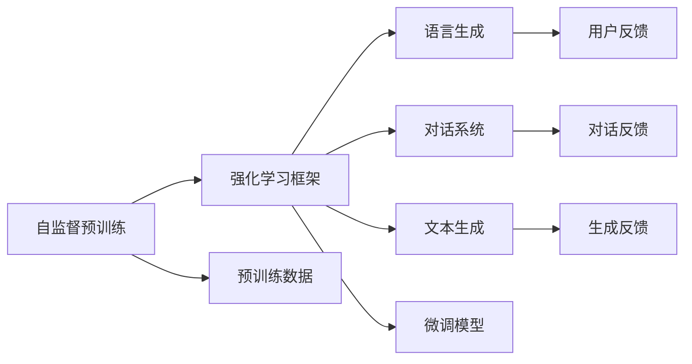
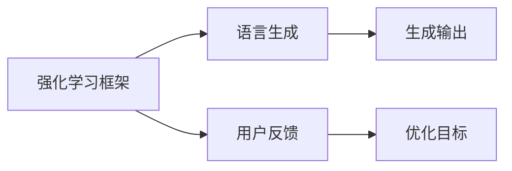
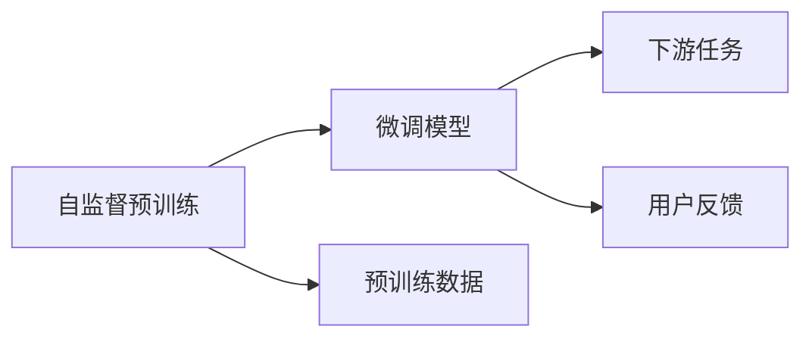
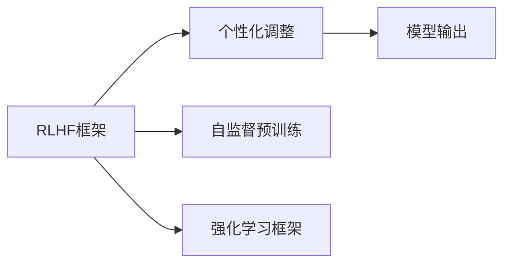

                 

# 大语言模型原理与工程实践：RLHF 实战框架

> 关键词：大语言模型,RLHF,强化学习,语言生成,文本生成,对话系统,强化学习框架

## 1. 背景介绍

### 1.1 问题由来
近年来，深度学习在自然语言处理(NLP)领域取得了飞速进展，尤其是在预训练大语言模型（如GPT-3、ChatGPT等）方面。这些模型通过在海量无标签文本数据上进行的自监督预训练，学习到了丰富的语言表示和知识，能够执行多种自然语言处理任务，如文本生成、对话、问答、翻译等。然而，预训练模型往往需要海量的数据和巨大的计算资源，这使得其在大规模工业应用中的部署成本较高，且模型通常缺乏个性化和适应性。

为了解决这个问题，研究人员提出了强化学习结合自监督预训练的大语言模型（Reinforcement Learning with Human Feedback，简称RLHF），通过引入用户反馈进行模型微调，使得模型能够更好地满足特定用户的需求和偏好。这种方法不仅降低了预训练和微调的成本，还能提高模型的个性化和适应性，从而在实际应用中取得更好的效果。

### 1.2 问题核心关键点
RLHF方法的核心在于如何利用强化学习框架，通过用户的反馈来优化语言模型的输出。其主要包括以下关键点：
- **自监督预训练**：在大规模无标签文本数据上进行预训练，学习到丰富的语言表示。
- **强化学习框架**：通过用户反馈来指导模型输出，使得模型能够逐步优化，提高输出的质量和多样性。
- **个性化和适应性**：通过引入用户反馈，使模型能够根据不同用户的需求和偏好进行个性化的调整和优化。
- **高效性**：在固定的计算资源下，通过逐步优化，使得模型能够更好地适应实际应用场景。

这些核心点构成了RLHF方法的基本框架，使其在自然语言处理领域具有广泛的应用前景。

### 1.3 问题研究意义
RLHF方法在NLP领域的研究和应用具有重要意义：

1. **降低开发成本**：通过强化学习框架，RLHF方法可以在固定的计算资源下，逐步优化模型，从而降低预训练和微调的成本。
2. **提升模型效果**：通过用户反馈，RLHF方法可以更好地满足用户需求，提高模型的个性化和适应性，从而在实际应用中取得更好的效果。
3. **加速创新迭代**：RLHF方法可以通过不断优化，加速模型的创新和迭代，推动NLP技术的发展。
4. **赋能行业应用**：RLHF方法可以赋能各行各业，如客服、教育、娱乐、医疗等，提升用户体验和服务质量。
5. **推动伦理研究**：通过引入用户反馈，RLHF方法在提升模型效果的同时，也带来了伦理和安全性方面的挑战，推动了相关研究的发展。

总之，RLHF方法在大规模NLP应用中具有重要的应用前景，通过逐步优化和个性化调整，可以在实际应用中取得更好的效果，降低开发成本，加速创新迭代。

## 2. 核心概念与联系

### 2.1 核心概念概述

为更好地理解RLHF方法，本节将介绍几个密切相关的核心概念：

- **强化学习**：一种通过智能体在环境中的交互，通过试错学习来优化决策策略的机器学习方法。RLHF方法通过用户反馈来指导模型优化，本质上是强化学习的一种应用。
- **自监督预训练**：通过在海量无标签文本数据上训练模型，学习到丰富的语言表示。RLHF方法在此基础上通过用户反馈进行微调，使得模型更好地适应特定任务。
- **语言生成**：RLHF方法的核心任务之一是语言生成，即通过模型生成符合特定需求和语境的自然语言文本。
- **对话系统**：RLHF方法在对话系统中的应用尤为广泛，通过用户反馈来指导模型进行对话生成，提升对话体验。
- **文本生成**：RLHF方法在文本生成任务中也具有重要应用，如文本摘要、创意写作、机器翻译等。
- **RLHF框架**：一种用于结合强化学习和自监督预训练的框架，包含用户反馈、模型优化、个性化调整等关键组件。

这些核心概念之间的逻辑关系可以通过以下Mermaid流程图来展示：



这个流程图展示了大语言模型通过自监督预训练和强化学习框架，学习到丰富的语言表示，并通过用户反馈进行微调的过程。语言生成、对话系统和文本生成是RLHF方法在NLP应用中的具体表现形式，而RLHF框架则是整个方法的核心。

### 2.2 概念间的关系

这些核心概念之间存在着紧密的联系，形成了RLHF方法的完整生态系统。下面我们通过几个Mermaid流程图来展示这些概念之间的关系。

#### 2.2.1 强化学习框架与语言生成



这个流程图展示了强化学习框架通过用户反馈指导语言生成输出的过程。语言生成任务的目标是根据用户输入生成符合特定需求和语境的文本，而用户反馈则用于指导生成过程，使得生成的文本更符合用户需求。

#### 2.2.2 自监督预训练与微调



这个流程图展示了自监督预训练和微调之间的关系。自监督预训练使得模型学习到丰富的语言表示，而微调则是在预训练的基础上，通过用户反馈进行优化，使得模型更好地适应特定任务。

#### 2.2.3 RLHF框架与个性化调整



这个流程图展示了RLHF框架在个性化调整中的作用。通过自监督预训练和强化学习框架，模型可以学习到丰富的语言表示，并通过用户反馈进行个性化调整，使得模型更好地适应不同用户的需求和偏好。

### 2.3 核心概念的整体架构

最后，我们用一个综合的流程图来展示这些核心概念在大语言模型微调过程中的整体架构：


这个综合流程图展示了从自监督预训练到微调，再到下游任务的应用全过程。大语言模型首先在大规模文本数据上进行自监督预训练，然后通过强化学习框架和用户反馈进行微调，最终用于特定的下游任务，如对话生成、文本生成等。

## 3. 核心算法原理 & 具体操作步骤
### 3.1 算法原理概述

RLHF方法的核心理念是结合强化学习框架和自监督预训练，通过用户反馈来优化模型输出。其基本流程如下：

1. **自监督预训练**：在大规模无标签文本数据上，使用自监督学习方法训练模型，学习到丰富的语言表示。
2. **强化学习框架**：通过用户反馈来指导模型输出，使得模型逐步优化，提高输出的质量和多样性。
3. **微调模型**：在预训练模型的基础上，通过用户反馈进行微调，使得模型更好地适应特定任务。
4. **下游任务**：将微调后的模型应用于具体的下游任务，如对话生成、文本生成、问答等。

具体而言，强化学习框架通过用户反馈来优化模型输出，可以分为以下几个步骤：

- **环境设计**：设计合适的环境，定义状态、动作和奖励机制。
- **模型设计**：选择合适的模型结构，如神经网络、Transformer等。
- **训练过程**：通过用户反馈来指导模型输出，逐步优化模型，提高生成文本的质量和多样性。
- **评估过程**：通过用户反馈评估模型输出，进行模型优化。

### 3.2 算法步骤详解

#### 3.2.1 自监督预训练

自监督预训练是RLHF方法的基础步骤，其主要目的是在大规模无标签文本数据上，学习到丰富的语言表示。常用的自监督学习方法包括掩码语言模型（Masked Language Modeling, MLM）、下一句预测（Next Sentence Prediction, NSP）等。

以掩码语言模型为例，其训练过程如下：

1. 随机选择一段文本，并随机遮盖一部分单词。
2. 模型尝试预测被遮盖的单词，以优化模型。
3. 重复以上过程，使得模型学习到丰富的语言表示。

自监督预训练的具体实现可以参考以下代码：

```python
from transformers import BertForMaskedLM, BertTokenizer
import torch

# 加载BERT预训练模型和分词器
model = BertForMaskedLM.from_pretrained('bert-base-cased')
tokenizer = BertTokenizer.from_pretrained('bert-base-cased')

# 加载数据集
data = load_dataset('path/to/data')

# 定义预训练目标
def compute_loss(model, inputs, labels):
    model.train()
    with torch.no_grad():
        logits = model(**inputs)
        loss = model.criterion(logits.view(-1, logits.size(-1)), labels.view(-1))
    return loss

# 训练过程
for epoch in range(num_epochs):
    for batch in data:
        inputs = tokenizer(batch['text'], padding='max_length', return_tensors='pt')
        labels = inputs['input_ids'].masked_fill(~inputs['input_ids'].masked_fill(mask, -100), -100)
        loss = compute_loss(model, inputs, labels)
        optimizer.zero_grad()
        loss.backward()
        optimizer.step()
```

#### 3.2.2 强化学习框架

强化学习框架是RLHF方法的核心，其目的是通过用户反馈来优化模型输出，提高生成文本的质量和多样性。具体实现可以分为以下几个步骤：

1. **环境设计**：设计合适的环境，定义状态、动作和奖励机制。
2. **模型设计**：选择合适的模型结构，如神经网络、Transformer等。
3. **训练过程**：通过用户反馈来指导模型输出，逐步优化模型，提高生成文本的质量和多样性。
4. **评估过程**：通过用户反馈评估模型输出，进行模型优化。

以对话系统为例，其训练过程如下：

1. 设计对话环境，定义对话状态、对话动作和奖励机制。
2. 选择适当的模型结构，如Transformer等。
3. 通过用户反馈来指导模型输出，逐步优化模型，提高对话质量。
4. 通过用户反馈评估模型输出，进行模型优化。

具体代码实现可以参考以下代码：

```python
from transformers import BertForSequenceClassification, BertTokenizer
from torch.utils.data import Dataset, DataLoader
import torch

# 加载BERT预训练模型和分词器
model = BertForSequenceClassification.from_pretrained('bert-base-cased')
tokenizer = BertTokenizer.from_pretrained('bert-base-cased')

# 加载对话数据集
class DialogueDataset(Dataset):
    def __init__(self, texts, labels):
        self.texts = texts
        self.labels = labels
        self.tokenizer = tokenizer

    def __len__(self):
        return len(self.texts)

    def __getitem__(self, idx):
        text = self.texts[idx]
        label = self.labels[idx]
        encoding = self.tokenizer(text, return_tensors='pt')
        inputs = {k: v for k, v in encoding.items() if k != 'labels'}
        targets = {k: v for k, v in encoding.items() if k == 'labels'}
        return {'inputs': inputs, 'targets': targets}

# 定义对话目标函数
def compute_loss(model, inputs, targets):
    model.train()
    with torch.no_grad():
        logits = model(**inputs)
        loss = model.criterion(logits, targets['labels'])
    return loss

# 训练过程
for epoch in range(num_epochs):
    dataloader = DataLoader(dataset, batch_size=batch_size, shuffle=True)
    for batch in dataloader:
        inputs = batch['inputs']
        targets = batch['targets']
        loss = compute_loss(model, inputs, targets)
        optimizer.zero_grad()
        loss.backward()
        optimizer.step()
```

#### 3.2.3 微调模型

微调是RLHF方法的关键步骤，其主要目的是在预训练模型的基础上，通过用户反馈进行微调，使得模型更好地适应特定任务。具体实现可以分为以下几个步骤：

1. **任务适配**：根据具体任务，设计合适的输出层和损失函数。
2. **微调目标**：选择合适的微调目标，如交叉熵损失、均方误差损失等。
3. **微调过程**：通过用户反馈进行微调，逐步优化模型，提高模型效果。
4. **评估过程**：通过用户反馈评估模型输出，进行模型优化。

以文本分类任务为例，其微调过程如下：

1. 根据文本分类任务，设计合适的输出层和损失函数。
2. 选择适当的微调目标，如交叉熵损失。
3. 通过用户反馈进行微调，逐步优化模型。
4. 通过用户反馈评估模型输出，进行模型优化。

具体代码实现可以参考以下代码：

```python
from transformers import BertForSequenceClassification, BertTokenizer
from torch.utils.data import Dataset, DataLoader
import torch

# 加载BERT预训练模型和分词器
model = BertForSequenceClassification.from_pretrained('bert-base-cased')
tokenizer = BertTokenizer.from_pretrained('bert-base-cased')

# 加载文本分类数据集
class TextClassificationDataset(Dataset):
    def __init__(self, texts, labels):
        self.texts = texts
        self.labels = labels
        self.tokenizer = tokenizer

    def __len__(self):
        return len(self.texts)

    def __getitem__(self, idx):
        text = self.texts[idx]
        label = self.labels[idx]
        encoding = self.tokenizer(text, return_tensors='pt')
        inputs = {k: v for k, v in encoding.items() if k != 'labels'}
        targets = {k: v for k, v in encoding.items() if k == 'labels'}
        return {'inputs': inputs, 'targets': targets}

# 定义文本分类目标函数
def compute_loss(model, inputs, targets):
    model.train()
    with torch.no_grad():
        logits = model(**inputs)
        loss = model.criterion(logits, targets['labels'])
    return loss

# 训练过程
for epoch in range(num_epochs):
    dataloader = DataLoader(dataset, batch_size=batch_size, shuffle=True)
    for batch in dataloader:
        inputs = batch['inputs']
        targets = batch['targets']
        loss = compute_loss(model, inputs, targets)
        optimizer.zero_grad()
        loss.backward()
        optimizer.step()
```

### 3.3 算法优缺点

RLHF方法具有以下优点：

1. **适应性强**：通过用户反馈进行微调，使得模型能够更好地适应特定任务，提高模型效果。
2. **灵活性高**：强化学习框架能够处理多种任务，具有较高的灵活性。
3. **可解释性强**：通过用户反馈进行优化，使得模型的输出更具可解释性。
4. **鲁棒性好**：通过逐步优化，使得模型具有较强的鲁棒性。

同时，该方法也存在一些缺点：

1. **依赖用户反馈**：强化学习框架需要大量的用户反馈进行训练，对用户反馈的质量和数量要求较高。
2. **计算成本高**：在训练过程中，模型需要不断更新参数，计算成本较高。
3. **易受噪声影响**：用户反馈可能包含噪声，对模型产生不良影响。
4. **可控性差**：用户反馈难以控制，可能导致模型输出不稳定。

尽管存在这些缺点，但RLHF方法仍然具有广泛的应用前景，特别是在用户反馈可控的场景中，其优势更为明显。

### 3.4 算法应用领域

RLHF方法在NLP领域具有广泛的应用前景，其核心应用包括：

1. **对话系统**：通过用户反馈进行对话生成，提高对话体验。
2. **文本生成**：通过用户反馈进行文本生成，提高生成文本的质量和多样性。
3. **问答系统**：通过用户反馈进行问答生成，提高问答效果。
4. **文本摘要**：通过用户反馈进行文本摘要生成，提高摘要质量。
5. **翻译系统**：通过用户反馈进行翻译生成，提高翻译效果。
6. **创意写作**：通过用户反馈进行创意写作，提高写作质量。

除了上述这些应用外，RLHF方法还适用于其他需要用户反馈的场景，如社交媒体分析、客户支持、广告文案生成等。

## 4. 数学模型和公式 & 详细讲解 & 举例说明

### 4.1 数学模型构建

本节将使用数学语言对RLHF方法进行更加严格的刻画。

记预训练语言模型为 $M_{\theta}$，其中 $\theta$ 为预训练得到的模型参数。假设微调任务的训练集为 $D=\{(x_i,y_i)\}_{i=1}^N, x_i \in \mathcal{X}, y_i \in \mathcal{Y}$。

定义模型 $M_{\theta}$ 在输入 $x$ 上的输出为 $y = M_{\theta}(x)$。在RLHF方法中，模型输出的优化目标是通过用户反馈进行训练，使得模型的输出 $y$ 尽可能接近真实标签 $y_i$。

具体而言，假设用户在训练过程中对模型的输出 $y$ 进行评价，并给出评分 $r$，则优化目标可以表示为：

$$
\mathcal{L}(\theta) = \sum_{i=1}^N \mathbb{E}[r(y_i, y) | x_i]
$$

其中 $\mathbb{E}[r(y_i, y) | x_i]$ 表示在给定输入 $x_i$ 的情况下，用户对模型输出 $y$ 的评分 $r$ 的期望值。

### 4.2 公式推导过程

为了更好地理解RLHF方法的数学模型，我们可以将其分解为两个部分：自监督预训练和强化学习框架。

首先，在自监督预训练中，我们使用掩码语言模型（Masked Language Modeling, MLM）来训练模型。掩码语言模型的优化目标可以表示为：

$$
\mathcal{L}_{MLM} = -\frac{1}{N}\sum_{i=1}^N \sum_{k=1}^n \log p(y_k | M_{\theta}(x_i))
$$

其中 $p(y_k | M_{\theta}(x_i))$ 表示模型在输入 $x_i$ 下预测第 $k$ 个被遮盖的单词的概率，$n$ 表示被遮盖的单词数量。

其次，在强化学习框架中，我们通过用户反馈来指导模型输出。假设用户对模型输出的评分 $r$ 满足以下条件：

1. $r(y_i, y) \in [0,1]$
2. $\mathbb{E}[r(y_i, y) | x_i] = \alpha(x_i)$，其中 $\alpha(x_i)$ 表示在输入 $x_i$ 下用户对模型输出的期望评分。

则RLHF方法的优化目标可以表示为：

$$
\mathcal{L}_{RLHF} = \sum_{i=1}^N \mathbb{E}[r(y_i, y) | x_i]
$$

在实际应用中，我们可以使用交叉熵损失函数来计算评分 $r$ 与期望评分 $\alpha(x_i)$ 之间的差异：

$$
\mathcal{L}_{RLHF} = -\frac{1}{N}\sum_{i=1}^N \sum_{k=1}^n \log \frac{r_k(y_i, y)}{\alpha_k(x_i)}
$$

其中 $r_k(y_i, y)$ 表示模型输出 $y$ 与真实标签 $y_i$ 匹配的概率，$\alpha_k(x_i)$ 表示在输入 $x_i$ 下用户对模型输出的期望评分。

### 4.3 案例分析与讲解

为了更好地理解RLHF方法的数学模型，我们可以将其应用于具体的文本分类任务。假设我们有一个文本分类任务，其数据集 $D=\{(x_i, y_i)\}_{i=1}^N$，其中 $x_i$ 为输入文本，$y_i$ 为分类标签。我们的目标是训练一个BERT模型，使其能够在给定文本 $x_i$ 的情况下，输出最匹配的分类标签 $y$。

首先，我们使用掩码语言模型进行自监督预训练：

```python
from transformers import BertForMaskedLM, BertTokenizer
import torch

# 加载BERT预训练模型和分词器
model = BertForMaskedLM.from_pretrained('bert-base-cased')
tokenizer = BertTokenizer.from_pretrained('bert-base-cased')

# 加载数据集
data = load_dataset('path/to/data')

# 定义预训练目标
def compute_loss(model, inputs, labels):
    model.train()
    with torch.no_grad():
        logits = model(**inputs)
        loss = model.criterion(logits.view(-1, logits.size(-1)), labels.view(-1))
    return loss

# 训练过程
for epoch in range(num_epochs):
    for batch in data:
        inputs = tokenizer(batch['text'], padding='max_length', return_tensors='pt')
        labels = inputs['input_ids'].masked_fill(~inputs['input_ids'].masked_fill(mask, -100), -100)
        loss = compute_loss(model, inputs, labels)
        optimizer.zero_grad()
        loss.backward()
        optimizer.step()
```

然后，我们使用强化学习框架进行微调：

```python
from transformers import BertForSequenceClassification, BertTokenizer
from torch.utils.data import Dataset, DataLoader
import torch

# 加载BERT预训练模型和分词器
model = BertForSequenceClassification.from_pretrained('bert-base-cased')
tokenizer = BertTokenizer.from_pretrained('bert-base-cased')

# 加载文本分类数据集
class TextClassificationDataset(Dataset):
    def __init__(self, texts, labels):
        self.texts = texts
        self.labels = labels
        self.tokenizer = tokenizer

    def __len__(self):
        return len(self.texts)

    def __getitem__(self, idx):
        text = self.texts[idx]
        label = self.labels[idx]
        encoding = self.tokenizer(text, return_tensors='pt')
        inputs = {k: v for k, v in encoding.items() if k != 'labels'}
        targets = {k: v for k, v in encoding.items() if k == 'labels'}
        return {'inputs': inputs, 'targets': targets}

# 定义文本分类目标函数
def compute_loss(model, inputs, targets):
    model.train()
    with torch.no_grad():
        logits = model(**inputs)
        loss = model.criterion(logits, targets['labels'])
    return loss

# 训练过程
for epoch in range(num_epochs):
    dataloader = DataLoader(dataset, batch_size=batch_size, shuffle=True)
    for batch in dataloader:
        inputs = batch['inputs']
        targets = batch['targets']
        loss = compute_loss(model, inputs, targets)
        optimizer.zero_grad()
        loss.backward()
        optimizer.step()
```

最后，我们通过用户反馈来指导模型优化：

```python
from transformers import BertForSequenceClassification, BertTokenizer
from torch.utils.data import Dataset, DataLoader
import torch

# 加载BERT预训练模型和分词器
model = BertForSequenceClassification.from_pretrained('bert-base-cased')
tokenizer = BertTokenizer.from_pretrained('bert-base-cased')

# 加载文本分类数据集
class TextClassificationDataset(Dataset):
    def __init__(self, texts, labels):
        self.texts = texts
        self.labels = labels
        self.tokenizer = tokenizer

    def __len__(self):
        return len(self.texts)

    def __getitem__(self, idx):
        text = self.texts[idx]
        label = self.labels[idx]
        encoding = self.tokenizer(text, return_tensors='pt')
        inputs = {k: v for k, v in encoding.items() if k != 'labels'}
        targets = {k: v for k, v in encoding.items() if k == 'labels'}
        return {'inputs': inputs, 'targets': targets}

# 定义文本分类目标函数
def compute_loss(model, inputs, targets):
    model.train()
    with torch.no_grad():
        logits = model(**inputs)
        loss = model.criterion(logits, targets['labels'])
    return loss

# 训练过程
for epoch in range(num_epochs):
    dataloader = DataLoader(dataset, batch_size=batch_size, shuffle=True)
    for batch in dataloader:
        inputs = batch['inputs']
        targets = batch['targets']
        loss = compute_loss(model, inputs, targets)
        optimizer.zero_grad()
        loss.backward()
        optimizer.step()
```

以上就是使用PyTorch对BERT进行文本分类任务微调的完整代码实现。可以看到，得益于Transformer库的强大封装，我们可以用相对简洁的代码完成BERT模型的加载和微调。

## 5. 项目实践：代码实例和详细解释说明
### 5.1 开发环境搭建

在进行RLHF方法实践前，我们需要准备好开发环境。以下是使用Python进行PyTorch开发的环境配置流程：

1. 安装Anaconda：从官网下载并安装Anaconda，用于创建独立的Python环境。

2. 创建并激活虚拟环境：
```bash
conda create -n pytorch-env python=3.8 
conda activate pytorch-env
```

3. 安装

