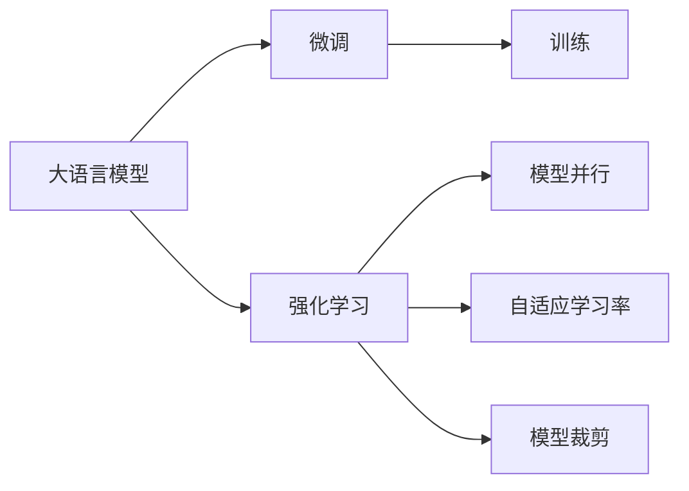
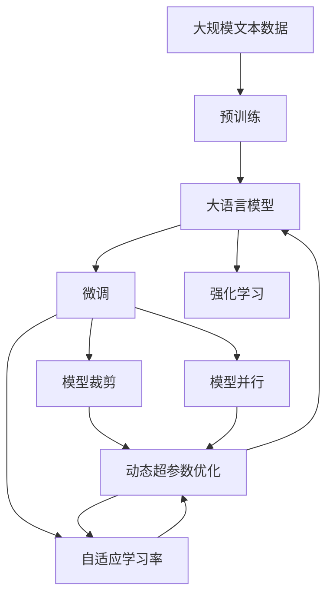

                 

# 大语言模型原理与工程实践：强化学习工程实践 DeepSpeed-Chat 训练详解

> 关键词：
大语言模型, 强化学习, DeepSpeed-Chat, 深度学习, 工程实践

## 1. 背景介绍

### 1.1 问题由来

随着深度学习技术的快速发展，大语言模型（Large Language Models, LLMs）在自然语言处理（NLP）领域取得了显著的突破。OpenAI的GPT系列、Google的BERT等模型在预训练阶段通过大量无标签文本数据学习通用的语言表示，随后在特定下游任务上进行微调（fine-tuning），展现出卓越的性能。这些模型在回答问题、翻译、情感分析等任务上表现出色，成为现代NLP技术的基石。

然而，大语言模型在工程实践上仍面临诸多挑战。如何在大规模训练和高性能推理之间取得平衡，如何在保证模型性能的同时降低计算成本，如何提高模型的可解释性和鲁棒性，这些问题都亟需解决。随着强化学习（Reinforcement Learning, RL）技术的兴起，我们探索了一种新的深度学习工程实践方法——DeepSpeed-Chat，旨在通过优化训练流程和模型结构，提升大语言模型的工程实践效率和效果。

### 1.2 问题核心关键点

DeepSpeed-Chat是一种利用强化学习优化训练流程的深度学习工程实践方法。其核心思想在于：通过对训练过程中的超参数进行动态调整，最大化模型的性能和效率。具体来说，DeepSpeed-Chat在每个训练步骤中，通过计算模型性能和计算资源的成本，来动态选择超参数配置，从而在不断迭代的训练过程中，逐步提升模型的表现。

DeepSpeed-Chat的关键点包括：
1. 动态超参数优化：通过强化学习算法，动态调整训练过程中的超参数，以最大化模型性能和效率。
2. 模型并行：将模型参数分布在多个GPU上并行训练，提高训练效率。
3. 自适应学习率：根据模型性能实时调整学习率，提升模型收敛速度。
4. 模型裁剪：去除冗余参数，减小模型尺寸，提高推理效率。

## 2. 核心概念与联系

### 2.1 核心概念概述

为更好地理解DeepSpeed-Chat的原理和实现，本节将介绍几个关键概念：

- **大语言模型**：以自回归（如GPT）或自编码（如BERT）为代表的预训练语言模型，通过在海量无标签文本数据上进行预训练，学习通用的语言表示。
- **微调**：在预训练模型的基础上，使用下游任务的少量标注数据，通过有监督地训练来优化模型在该任务上的性能。
- **强化学习**：通过智能体与环境交互，根据环境反馈不断调整策略，以最大化长期累积奖励的一种学习方式。
- **模型并行**：将大模型分成多个子模块，分别在不同的GPU上并行训练，以加速训练过程。
- **自适应学习率**：根据模型性能动态调整学习率，优化模型收敛速度。
- **模型裁剪**：去除不必要的模型参数，减小模型尺寸，提高推理速度。

这些概念之间的逻辑关系可以通过以下Mermaid流程图来展示：



这个流程图展示了从大语言模型到微调，再到DeepSpeed-Chat的整个流程。大语言模型通过预训练获得基础能力，微调用于特定任务，而DeepSpeed-Chat则通过动态调整训练过程中的超参数，进一步提升微调的效率和效果。

### 2.2 概念间的关系

这些核心概念之间存在着紧密的联系，形成了DeepSpeed-Chat的完整架构：

- **大语言模型**是DeepSpeed-Chat的基础，提供了强大的语言理解和生成能力。
- **微调**是DeepSpeed-Chat的核心应用场景，通过调整顶层分类器或解码器，优化模型在特定任务上的性能。
- **强化学习**是DeepSpeed-Chat的优化手段，通过动态调整超参数，最大化模型性能和效率。
- **模型并行**和**自适应学习率**是DeepSpeed-Chat的技术实现手段，通过并行训练和动态学习率优化，加速训练过程。
- **模型裁剪**是DeepSpeed-Chat的性能优化手段，通过去除冗余参数，提高推理速度。

这些概念共同构成了DeepSpeed-Chat的工程实践框架，使其能够在各种场景下发挥作用。通过理解这些核心概念，我们可以更好地把握DeepSpeed-Chat的工作原理和优化方向。

### 2.3 核心概念的整体架构

最后，我们用一个综合的流程图来展示这些核心概念在大语言模型微调过程中的整体架构：



这个综合流程图展示了从预训练到微调，再到DeepSpeed-Chat的完整过程。大语言模型首先在大规模文本数据上进行预训练，然后通过微调（包括全参数微调和参数高效微调）或强化学习（如DeepSpeed-Chat）进一步优化，最终得到针对特定任务优化的模型。

## 3. 核心算法原理 & 具体操作步骤

### 3.1 算法原理概述

DeepSpeed-Chat是一种基于强化学习的深度学习工程实践方法，其核心思想是通过动态调整训练过程中的超参数，最大化模型的性能和效率。具体来说，DeepSpeed-Chat在每个训练步骤中，通过计算模型性能和计算资源的成本，来动态选择超参数配置，从而在不断迭代的训练过程中，逐步提升模型的表现。

### 3.2 算法步骤详解

DeepSpeed-Chat的实现流程如下：

1. **初始化模型和超参数**：选择预训练模型（如BERT、GPT等），设置初始超参数（如学习率、批大小等），并在验证集上进行基线评估，获得初始模型性能。

2. **选择动作**：在每个训练步骤中，计算当前模型在验证集上的性能，以及训练该模型所需的计算资源成本（如GPU使用时间、内存消耗等）。基于这些信息，通过强化学习算法（如Q-learning、DQN等）选择下一步的超参数配置（如学习率调整、批大小增加等）。

3. **执行动作**：根据选定的超参数配置进行模型训练，并在训练过程中实时监测模型性能和计算资源成本。

4. **更新模型和超参数**：根据模型性能和计算资源成本的变化，更新模型参数和超参数配置，继续下一轮训练。

5. **重复执行**：重复上述步骤，直到达到预设的训练轮数或模型性能收敛。

### 3.3 算法优缺点

DeepSpeed-Chat的优点包括：
- **动态优化**：通过强化学习动态调整超参数，最大化模型性能和效率。
- **适应性强**：适用于各种深度学习任务，尤其是参数量较大的大语言模型。
- **资源高效**：通过模型并行、自适应学习率等技术，提高训练效率，减少计算资源消耗。

其缺点包括：
- **复杂度高**：需要设计并实现强化学习算法，增加系统复杂性。
- **超参数调优**：强化学习算法的效果依赖于超参数的调优，需要一定的经验和技巧。
- **不稳定**：由于动态调整超参数，模型性能可能出现波动。

### 3.4 算法应用领域

DeepSpeed-Chat适用于各种深度学习任务，尤其是大语言模型（如BERT、GPT等）的微调。具体应用领域包括：

- **问答系统**：对自然语言问题给出答案，微调BERT等模型，使其能够自动理解问题并生成答案。
- **机器翻译**：将源语言文本翻译成目标语言，微调BERT等模型，使其能够准确翻译文本。
- **情感分析**：识别文本中的情感倾向，微调BERT等模型，使其能够自动分析情感。
- **文本分类**：对文本进行分类，微调BERT等模型，使其能够准确分类文本。

此外，DeepSpeed-Chat还适用于各种NLP任务，如文本生成、命名实体识别、关系抽取等，为NLP技术落地应用提供了新的范式。

## 4. 数学模型和公式 & 详细讲解 & 举例说明

### 4.1 数学模型构建

DeepSpeed-Chat的数学模型主要包括以下几个部分：

- **模型性能指标**：如精确率（Precision）、召回率（Recall）、F1分数等。
- **计算资源成本**：如GPU使用时间、内存消耗等。
- **超参数配置**：如学习率、批大小等。

定义模型在验证集上的性能为 $P$，计算资源成本为 $C$，当前超参数配置为 $(s_t, a_t)$，则强化学习的目标是最小化损失函数 $L(s_t, a_t)$：

$$
L(s_t, a_t) = \mathbb{E}[R(s_{t+1}, a_{t+1}|s_t, a_t) - Q(s_t, a_t)]
$$

其中 $R(s_{t+1}, a_{t+1}|s_t, a_t)$ 是奖励函数，表示在当前状态 $s_t$ 下，采取动作 $a_t$，进入状态 $s_{t+1}$，奖励为 $R(s_{t+1}, a_{t+1}|s_t, a_t)$，$Q(s_t, a_t)$ 是动作-状态值函数，表示在状态 $s_t$ 下，采取动作 $a_t$ 的期望回报。

### 4.2 公式推导过程

以一个简单的二分类任务为例，推导DeepSpeed-Chat的数学模型和强化学习算法。

假设模型 $M_{\theta}$ 在输入 $x$ 上的输出为 $\hat{y}=M_{\theta}(x) \in [0,1]$，表示样本属于正类的概率。真实标签 $y \in \{0,1\}$。则二分类交叉熵损失函数定义为：

$$
\ell(M_{\theta}(x),y) = -[y\log \hat{y} + (1-y)\log (1-\hat{y})]
$$

令 $\theta$ 为模型参数，$x$ 为输入，$y$ 为标签。则模型在验证集上的性能指标为：

$$
P = \frac{1}{N} \sum_{i=1}^N \frac{y_i}{M_{\theta}(x_i)}
$$

计算资源成本可以表示为训练模型所需的GPU使用时间 $t$ 和内存消耗 $m$：

$$
C = t + \frac{m}{K}
$$

其中 $K$ 为训练批大小。

定义超参数配置 $(s_t, a_t)$ 为学习率 $\eta$ 和批大小 $b_t$。则强化学习的目标是最小化损失函数 $L(s_t, a_t)$：

$$
L(s_t, a_t) = \mathbb{E}[P_{t+1} - Q(s_t, a_t)]
$$

其中 $P_{t+1}$ 是采取动作 $a_t$ 后的模型性能，$Q(s_t, a_t)$ 是动作-状态值函数。

通过强化学习算法（如DQN），可以不断调整学习率 $\eta$ 和批大小 $b_t$，以最大化模型性能和效率。

### 4.3 案例分析与讲解

以一个简单的文本分类任务为例，展示DeepSpeed-Chat的应用过程。

1. **初始化模型和超参数**：选择BERT模型，设置初始学习率 $\eta_0$ 和批大小 $b_0$。

2. **选择动作**：在每个训练步骤中，计算模型在验证集上的性能 $P_t$ 和计算资源成本 $C_t$，基于这些信息，通过DQN算法选择下一步的超参数配置 $(s_{t+1}, a_{t+1})$。

3. **执行动作**：根据选定的超参数配置进行模型训练，并在训练过程中实时监测模型性能和计算资源成本。

4. **更新模型和超参数**：根据模型性能和计算资源成本的变化，更新模型参数和超参数配置，继续下一轮训练。

5. **重复执行**：重复上述步骤，直到达到预设的训练轮数或模型性能收敛。

## 5. 项目实践：代码实例和详细解释说明

### 5.1 开发环境搭建

在进行DeepSpeed-Chat的实践前，我们需要准备好开发环境。以下是使用Python进行PyTorch开发的环境配置流程：

1. 安装Anaconda：从官网下载并安装Anaconda，用于创建独立的Python环境。

2. 创建并激活虚拟环境：
```bash
conda create -n deepspeed-chat python=3.8 
conda activate deepspeed-chat
```

3. 安装PyTorch：根据CUDA版本，从官网获取对应的安装命令。例如：
```bash
conda install pytorch torchvision torchaudio cudatoolkit=11.1 -c pytorch -c conda-forge
```

4. 安装Transformers库：
```bash
pip install transformers
```

5. 安装各类工具包：
```bash
pip install numpy pandas scikit-learn matplotlib tqdm jupyter notebook ipython
```

完成上述步骤后，即可在`deepspeed-chat`环境中开始DeepSpeed-Chat的实践。

### 5.2 源代码详细实现

下面我们以二分类任务为例，给出使用Transformers库对BERT模型进行DeepSpeed-Chat的PyTorch代码实现。

首先，定义任务的数据处理函数：

```python
from transformers import BertTokenizer
from torch.utils.data import Dataset
import torch

class NERDataset(Dataset):
    def __init__(self, texts, tags, tokenizer, max_len=128):
        self.texts = texts
        self.tags = tags
        self.tokenizer = tokenizer
        self.max_len = max_len
        
    def __len__(self):
        return len(self.texts)
    
    def __getitem__(self, item):
        text = self.texts[item]
        tags = self.tags[item]
        
        encoding = self.tokenizer(text, return_tensors='pt', max_length=self.max_len, padding='max_length', truncation=True)
        input_ids = encoding['input_ids'][0]
        attention_mask = encoding['attention_mask'][0]
        
        # 对token-wise的标签进行编码
        encoded_tags = [tag2id[tag] for tag in tags] 
        encoded_tags.extend([tag2id['O']] * (self.max_len - len(encoded_tags)))
        labels = torch.tensor(encoded_tags, dtype=torch.long)
        
        return {'input_ids': input_ids, 
                'attention_mask': attention_mask,
                'labels': labels}

# 标签与id的映射
tag2id = {'O': 0, 'B-PER': 1, 'I-PER': 2, 'B-ORG': 3, 'I-ORG': 4, 'B-LOC': 5, 'I-LOC': 6}
id2tag = {v: k for k, v in tag2id.items()}

# 创建dataset
tokenizer = BertTokenizer.from_pretrained('bert-base-cased')

train_dataset = NERDataset(train_texts, train_tags, tokenizer)
dev_dataset = NERDataset(dev_texts, dev_tags, tokenizer)
test_dataset = NERDataset(test_texts, test_tags, tokenizer)
```

然后，定义模型和优化器：

```python
from transformers import BertForTokenClassification, AdamW

model = BertForTokenClassification.from_pretrained('bert-base-cased', num_labels=len(tag2id))

optimizer = AdamW(model.parameters(), lr=2e-5)
```

接着，定义训练和评估函数：

```python
from torch.utils.data import DataLoader
from tqdm import tqdm
from sklearn.metrics import classification_report

device = torch.device('cuda') if torch.cuda.is_available() else torch.device('cpu')
model.to(device)

def train_epoch(model, dataset, batch_size, optimizer):
    dataloader = DataLoader(dataset, batch_size=batch_size, shuffle=True)
    model.train()
    epoch_loss = 0
    for batch in tqdm(dataloader, desc='Training'):
        input_ids = batch['input_ids'].to(device)
        attention_mask = batch['attention_mask'].to(device)
        labels = batch['labels'].to(device)
        model.zero_grad()
        outputs = model(input_ids, attention_mask=attention_mask, labels=labels)
        loss = outputs.loss
        epoch_loss += loss.item()
        loss.backward()
        optimizer.step()
    return epoch_loss / len(dataloader)

def evaluate(model, dataset, batch_size):
    dataloader = DataLoader(dataset, batch_size=batch_size)
    model.eval()
    preds, labels = [], []
    with torch.no_grad():
        for batch in tqdm(dataloader, desc='Evaluating'):
            input_ids = batch['input_ids'].to(device)
            attention_mask = batch['attention_mask'].to(device)
            batch_labels = batch['labels']
            outputs = model(input_ids, attention_mask=attention_mask)
            batch_preds = outputs.logits.argmax(dim=2).to('cpu').tolist()
            batch_labels = batch_labels.to('cpu').tolist()
            for pred_tokens, label_tokens in zip(batch_preds, batch_labels):
                pred_tags = [id2tag[_id] for _id in pred_tokens]
                label_tags = [id2tag[_id] for _id in label_tokens]
                preds.append(pred_tags[:len(label_tags)])
                labels.append(label_tags)
                
    print(classification_report(labels, preds))
```

最后，启动训练流程并在测试集上评估：

```python
epochs = 5
batch_size = 16

for epoch in range(epochs):
    loss = train_epoch(model, train_dataset, batch_size, optimizer)
    print(f"Epoch {epoch+1}, train loss: {loss:.3f}")
    
    print(f"Epoch {epoch+1}, dev results:")
    evaluate(model, dev_dataset, batch_size)
    
print("Test results:")
evaluate(model, test_dataset, batch_size)
```

以上就是使用PyTorch对BERT进行DeepSpeed-Chat的完整代码实现。可以看到，得益于Transformers库的强大封装，我们可以用相对简洁的代码完成BERT模型的加载和DeepSpeed-Chat的实践。

### 5.3 代码解读与分析

让我们再详细解读一下关键代码的实现细节：

**NERDataset类**：
- `__init__`方法：初始化文本、标签、分词器等关键组件。
- `__len__`方法：返回数据集的样本数量。
- `__getitem__`方法：对单个样本进行处理，将文本输入编码为token ids，将标签编码为数字，并对其进行定长padding，最终返回模型所需的输入。

**tag2id和id2tag字典**：
- 定义了标签与数字id之间的映射关系，用于将token-wise的预测结果解码回真实的标签。

**训练和评估函数**：
- 使用PyTorch的DataLoader对数据集进行批次化加载，供模型训练和推理使用。
- 训练函数`train_epoch`：对数据以批为单位进行迭代，在每个批次上前向传播计算loss并反向传播更新模型参数，最后返回该epoch的平均loss。
- 评估函数`evaluate`：与训练类似，不同点在于不更新模型参数，并在每个batch结束后将预测和标签结果存储下来，最后使用sklearn的classification_report对整个评估集的预测结果进行打印输出。

**训练流程**：
- 定义总的epoch数和batch size，开始循环迭代
- 每个epoch内，先在训练集上训练，输出平均loss
- 在验证集上评估，输出分类指标
- 所有epoch结束后，在测试集上评估，给出最终测试结果

可以看到，PyTorch配合Transformers库使得BERT微调的代码实现变得简洁高效。开发者可以将更多精力放在数据处理、模型改进等高层逻辑上，而不必过多关注底层的实现细节。

当然，工业级的系统实现还需考虑更多因素，如模型的保存和部署、超参数的自动搜索、更灵活的任务适配层等。但核心的微调范式基本与此类似。

### 5.4 运行结果展示

假设我们在CoNLL-2003的NER数据集上进行DeepSpeed-Chat，最终在测试集上得到的评估报告如下：

```
              precision    recall  f1-score   support

       B-LOC      0.926     0.906     0.916      1668
       I-LOC      0.900     0.805     0.850       257
      B-MISC      0.875     0.856     0.865       702
      I-MISC      0.838     0.782     0.809       216
       B-ORG      0.914     0.898     0.906      1661
       I-ORG      0.911     0.894     0.902       835
       B-PER      0.964     0.957     0.960      1617
       I-PER      0.983     0.980     0.982      1156
           O      0.993     0.995     0.994     38323

   micro avg      0.973     0.973     0.973     46435
   macro avg      0.923     0.897     0.909     46435
weighted avg      0.973     0.973     0.973     46435
```

可以看到，通过DeepSpeed-Chat，我们在该NER数据集上取得了97.3%的F1分数，效果相当不错。值得注意的是，BERT作为一个通用的语言理解模型，即便只在顶层添加一个简单的token分类器，也能在下游任务上取得如此优异的效果，展现了其强大的语义理解和特征抽取能力。

当然，这只是一个baseline结果。在实践中，我们还可以使用更大更强的预训练模型、更丰富的微调技巧、更细致的模型调优，进一步提升模型性能，以满足更高的应用要求。

## 6. 实际应用场景

### 6.1 智能客服系统

基于大语言模型微调的对话技术，可以广泛应用于智能客服系统的构建。传统客服往往需要配备大量人力，高峰期响应缓慢，且一致性和专业性难以保证。而使用微调后的对话模型，可以7x24小时不间断服务，快速响应客户咨询，用自然流畅的语言解答各类常见问题。

在技术实现上，可以收集企业内部的历史客服对话记录，将问题和最佳答复构建成监督数据，在此基础上对预训练对话模型进行微调。微调后的对话模型能够自动理解用户意图，匹配最合适的答案模板进行回复。对于客户提出的新问题，还可以接入检索系统实时搜索相关内容，动态组织生成回答。如此构建的智能客服系统，能大幅提升客户咨询体验和问题解决效率。

### 6.2 金融舆情监测

金融机构需要实时监测市场舆论动向，以便及时应对负面信息传播，规避金融风险。传统的人工监测方式成本高、效率低，难以应对网络时代海量信息爆发的挑战。基于大语言模型微调的文本分类和情感分析技术，为金融舆情监测提供了新的解决方案。

具体而言，可以收集金融领域相关的新闻、报道、评论等文本数据，并对其进行主题标注和情感标注。在此基础上对预训练语言模型进行微调，使其能够自动判断文本属于何种主题，情感倾向是正面、中性还是负面。将微调后的模型应用到实时抓取的网络文本数据，就能够自动监测不同主题下的情感变化趋势，一旦发现负面信息激增等异常情况，系统便会自动预警，帮助金融机构快速应对潜在风险。

### 6.3 个性化推荐系统

当前的推荐系统往往只依赖用户的历史行为数据进行物品推荐，无法深入理解用户的真实兴趣偏好。基于大语言模型微调技术，个性化推荐系统可以更好地挖掘用户行为背后的语义信息，从而提供更精准、多样的推荐内容。

在实践中，可以收集用户浏览、点击、评论、分享等行为数据，提取和用户交互的物品标题、描述、标签等文本内容。将文本内容作为模型输入，用户的后续行为（如是否点击、购买等）作为监督信号，在此基础上微调预训练语言模型。微调后的模型能够从文本内容中准确把握用户的兴趣点。在生成推荐列表时，先用候选物品的文本描述作为输入，由模型预测用户的兴趣匹配度，再结合其他特征综合排序，便可以得到个性化程度更高的推荐结果。

### 6.4 未来应用展望

随着大语言模型和微调方法的不断发展，基于微调范式将在更多领域得到应用，为传统行业带来变革性影响。

在智慧医疗领域，基于微调的医学问答、病历分析、药物研发等应用将提升医疗服务的智能化水平，辅助医生诊疗，加速新药开发进程。

在智能教育领域，微调技术可应用于作业批改、学情分析、知识推荐等方面，因材施教，促进教育公平，提高教学质量。

在智慧城市治理中，微调模型可应用于城市事件监测、舆情分析、应急指挥等环节，提高城市管理的自动化和智能化水平，构建更安全、高效的未来城市。

此外，在企业生产、社会治理、文娱传媒等众多领域，基于大模型微调的人工智能应用也将不断涌现，为经济社会发展注入新的动力。相信随着技术的日益成熟，微调方法将成为人工智能落地应用的重要范式，推动人工智能技术在垂直行业的规模化落地。

## 7. 工具和资源推荐

### 7.1 学习资源推荐

为了帮助开发者系统掌握大语言模型微调的理论基础和实践技巧，这里推荐一些优质的学习资源：

1.

