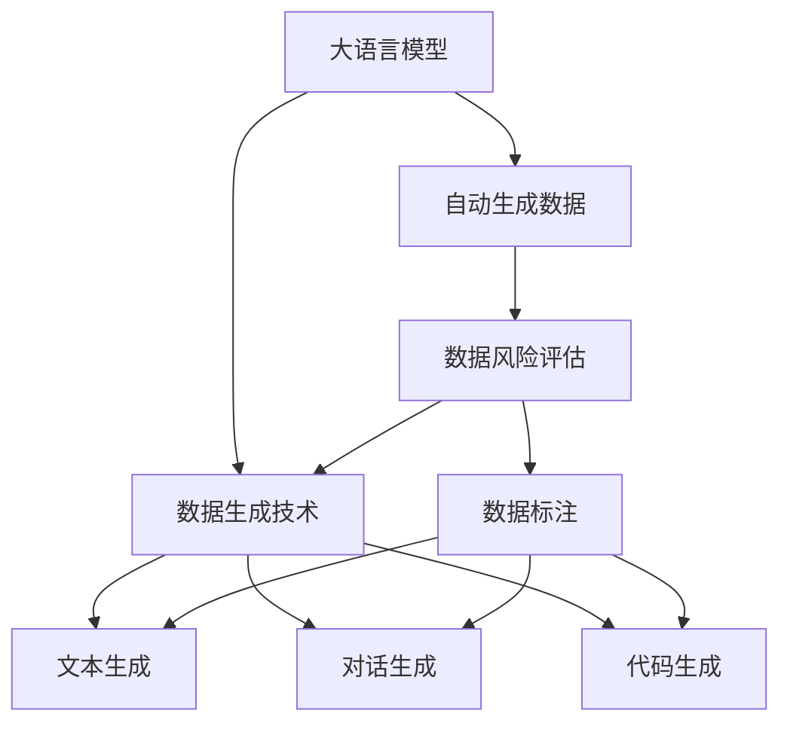

                 

# 大语言模型原理与工程实践：自动生成数据的风险

大语言模型近年来取得了显著进展，尤其是GPT-3等模型展示了强大的文本生成能力，但同时也引发了关于自动生成数据真实性和可靠性的广泛讨论。本文将深入探讨大语言模型自动生成数据的原理与工程实践，以及如何评估和规避其风险。

## 1. 背景介绍

### 1.1 问题由来

随着大语言模型如GPT-3、BERT等的发展，自动生成文本、对话、摘要、代码等数据成为可能。这些技术在多个应用场景中展示出巨大潜力，例如内容生成、自动化写作、智能客服等。然而，自动生成的数据是否真实可信、是否存在偏见和误导性，成为必须回答的关键问题。

### 1.2 问题核心关键点

自动生成数据的风险主要源于以下几个方面：

- **数据真实性**：自动生成数据是否基于真实世界数据，是否有偏差或错误。
- **数据一致性**：自动生成的文本是否连贯、一致，是否符合现实逻辑。
- **偏见与误导**：自动生成的数据是否包含偏见，是否可能误导用户或产生不实信息。
- **生成效率**：自动生成的数据生成速度是否满足实际需求，是否需要大量计算资源。

## 2. 核心概念与联系

### 2.1 核心概念概述

为更好地理解自动生成数据的原理与工程实践，本节将介绍几个核心概念：

- **大语言模型**：基于深度学习技术，通过大量文本数据预训练得到的模型。具有自回归生成能力，可以生成连贯且上下文相关的文本。
- **自动生成数据**：指通过大语言模型自动生成的文本、对话、代码等数据。
- **数据风险评估**：对自动生成数据的真实性、一致性、偏见与误导等进行评估和检测。
- **数据生成技术**：包括基于条件生成、基于无条件生成、基于对抗生成等技术。

### 2.2 概念间的关系

这些核心概念之间的逻辑关系可以通过以下Mermaid流程图来展示：



这个流程图展示了大语言模型、自动生成数据、数据风险评估、数据生成技术之间的关系：

1. 大语言模型通过预训练获得基础能力。
2. 自动生成数据基于大语言模型的自回归能力，通过不同技术生成文本、对话、代码等。
3. 数据风险评估用于检测自动生成数据的真实性、一致性和偏见等。
4. 数据生成技术包括文本生成、对话生成、代码生成等，是实现自动生成数据的关键手段。

## 3. 核心算法原理 & 具体操作步骤
### 3.1 算法原理概述

自动生成数据的核心算法原理是基于大语言模型的自回归生成机制。给定一个初始文本序列，模型通过前向传播计算下一个词的条件概率，进而生成后续词序列。例如，对于文本生成任务，模型通过给定前文序列，预测下一个词的概率分布，从而生成新的文本。

### 3.2 算法步骤详解

自动生成数据的主要步骤如下：

**Step 1: 准备数据集和模型**
- 收集或生成用于训练和测试的文本数据集。
- 选择合适的大语言模型作为初始化参数，如GPT-3、BERT等。

**Step 2: 数据预处理**
- 对文本数据进行分词、清洗、标准化等预处理。
- 将文本转换为模型能够处理的形式，如将句子转化为token序列。

**Step 3: 设置超参数**
- 选择模型结构、学习率、批次大小等超参数。
- 设置数据增强、正则化、对抗训练等技巧。

**Step 4: 模型训练**
- 使用训练数据集对模型进行训练，通过梯度下降等优化算法更新模型参数。
- 使用验证集评估模型性能，防止过拟合。

**Step 5: 数据生成**
- 使用测试数据集或生成新文本，通过前向传播计算概率分布。
- 基于概率分布生成新的文本序列，满足所需的格式和长度要求。

**Step 6: 数据风险评估**
- 对生成的数据进行真实性、一致性、偏见等评估。
- 根据评估结果进行调整和优化。

### 3.3 算法优缺点

自动生成数据的方法具有以下优点：

- **高效性**：生成速度较传统方法大幅提高，适合大规模数据生成任务。
- **多样性**：能够生成各种形式的数据，如文本、对话、代码等。
- **灵活性**：适应性强，可以根据不同需求进行定制化生成。

同时，该方法也存在以下缺点：

- **偏见与误导**：自动生成的数据可能带有原始数据集的偏见，误导用户。
- **一致性问题**：生成的文本可能存在连贯性、逻辑性问题，难以与现实一致。
- **资源消耗**：训练和生成的计算资源消耗大，需要高性能硬件支持。

### 3.4 算法应用领域

自动生成数据技术已经在多个领域得到了广泛应用，例如：

- **内容生成**：自动生成新闻、文章、书籍等。
- **对话系统**：自动生成对话回答，用于智能客服、虚拟助手等。
- **翻译**：自动生成不同语言的翻译文本。
- **代码生成**：自动生成代码片段、程序文档等。
- **数据分析**：自动生成数据分析报告、数据可视化图表等。

## 4. 数学模型和公式 & 详细讲解  
### 4.1 数学模型构建

基于大语言模型的自动生成数据任务可以建模为条件生成问题。假设模型参数为 $\theta$，输入序列为 $x$，生成的输出序列为 $y$。模型通过前向传播计算条件概率 $P(y|x)$，从而生成新的序列 $y$。

### 4.2 公式推导过程

以文本生成任务为例，条件概率 $P(y|x)$ 可以建模为：

$$
P(y|x) = \frac{e^{\sum_{i=1}^{n}\log P(y_i|x,y_{<i})}}{Z(x)}
$$

其中，$y_{<i}$ 表示前 $i-1$ 个生成的词，$P(y_i|x,y_{<i})$ 表示给定输入 $x$ 和前文 $y_{<i}$，下一个词 $y_i$ 的条件概率。$Z(x)$ 为归一化常数，确保概率和为1。

### 4.3 案例分析与讲解

假设我们有一个简单的文本生成任务，输入为 "The cat is"，生成的目标为 "The cat is sleeping on the sofa"。模型通过前向传播计算每个词的条件概率，从而生成完整句子。

## 5. 项目实践：代码实例和详细解释说明
### 5.1 开发环境搭建

在进行自动生成数据实践前，我们需要准备好开发环境。以下是使用Python进行PyTorch开发的环境配置流程：

1. 安装Anaconda：从官网下载并安装Anaconda，用于创建独立的Python环境。

2. 创建并激活虚拟环境：
```bash
conda create -n pytorch-env python=3.8 
conda activate pytorch-env
```

3. 安装PyTorch：根据CUDA版本，从官网获取对应的安装命令。例如：
```bash
conda install pytorch torchvision torchaudio cudatoolkit=11.1 -c pytorch -c conda-forge
```

4. 安装Transformers库：
```bash
pip install transformers
```

5. 安装各类工具包：
```bash
pip install numpy pandas scikit-learn matplotlib tqdm jupyter notebook ipython
```

完成上述步骤后，即可在`pytorch-env`环境中开始自动生成数据实践。

### 5.2 源代码详细实现

下面我们以自动生成文本为例，给出使用Transformers库对GPT-3模型进行自动生成文本的PyTorch代码实现。

首先，定义文本生成任务的数据处理函数：

```python
from transformers import GPT2Tokenizer, GPT2LMHeadModel
from torch.utils.data import Dataset
import torch

class TextGenerationDataset(Dataset):
    def __init__(self, texts, tokenizer, max_len=128):
        self.texts = texts
        self.tokenizer = tokenizer
        self.max_len = max_len
        
    def __len__(self):
        return len(self.texts)
    
    def __getitem__(self, item):
        text = self.texts[item]
        encoding = self.tokenizer(text, return_tensors='pt', max_length=self.max_len, padding='max_length', truncation=True)
        return {'input_ids': encoding['input_ids'], 'attention_mask': encoding['attention_mask']}
```

然后，定义模型和优化器：

```python
from transformers import AdamW

model = GPT2LMHeadModel.from_pretrained('gpt2')
tokenizer = GPT2Tokenizer.from_pretrained('gpt2')
optimizer = AdamW(model.parameters(), lr=2e-5)
```

接着，定义训练和评估函数：

```python
from torch.utils.data import DataLoader
from tqdm import tqdm

device = torch.device('cuda') if torch.cuda.is_available() else torch.device('cpu')
model.to(device)

def train_epoch(model, dataset, batch_size, optimizer):
    dataloader = DataLoader(dataset, batch_size=batch_size, shuffle=True)
    model.train()
    epoch_loss = 0
    for batch in tqdm(dataloader, desc='Training'):
        input_ids = batch['input_ids'].to(device)
        attention_mask = batch['attention_mask'].to(device)
        model.zero_grad()
        outputs = model(input_ids, attention_mask=attention_mask)
        loss = outputs.loss
        epoch_loss += loss.item()
        loss.backward()
        optimizer.step()
    return epoch_loss / len(dataloader)

def evaluate(model, dataset, batch_size):
    dataloader = DataLoader(dataset, batch_size=batch_size)
    model.eval()
    preds, labels = [], []
    with torch.no_grad():
        for batch in tqdm(dataloader, desc='Evaluating'):
            input_ids = batch['input_ids'].to(device)
            attention_mask = batch['attention_mask'].to(device)
            batch_labels = batch['input_ids'][:, 1:]
            outputs = model(input_ids, attention_mask=attention_mask)
            batch_preds = outputs.logits.argmax(dim=2).to('cpu').tolist()
            batch_labels = batch_labels.to('cpu').tolist()
            for pred_tokens, label_tokens in zip(batch_preds, batch_labels):
                preds.append(pred_tokens)
                labels.append(label_tokens)
                
    print(preds)
    print(labels)
```

最后，启动训练流程并在测试集上评估：

```python
epochs = 5
batch_size = 16

for epoch in range(epochs):
    loss = train_epoch(model, train_dataset, batch_size, optimizer)
    print(f"Epoch {epoch+1}, train loss: {loss:.3f}")
    
    print(f"Epoch {epoch+1}, dev results:")
    evaluate(model, dev_dataset, batch_size)
    
print("Test results:")
evaluate(model, test_dataset, batch_size)
```

以上就是使用PyTorch对GPT-3进行文本生成的完整代码实现。可以看到，得益于Transformers库的强大封装，我们可以用相对简洁的代码完成GPT-3模型的加载和自动生成文本的训练和评估。

### 5.3 代码解读与分析

让我们再详细解读一下关键代码的实现细节：

**TextGenerationDataset类**：
- `__init__`方法：初始化文本、分词器等关键组件。
- `__len__`方法：返回数据集的样本数量。
- `__getitem__`方法：对单个样本进行处理，将文本输入转换为token ids，并对其定长padding，最终返回模型所需的输入。

**训练和评估函数**：
- 使用PyTorch的DataLoader对数据集进行批次化加载，供模型训练和推理使用。
- 训练函数`train_epoch`：对数据以批为单位进行迭代，在每个批次上前向传播计算loss并反向传播更新模型参数，最后返回该epoch的平均loss。
- 评估函数`evaluate`：与训练类似，不同点在于不更新模型参数，并在每个batch结束后将预测和标签结果存储下来，最后使用打印输出。

**训练流程**：
- 定义总的epoch数和batch size，开始循环迭代
- 每个epoch内，先在训练集上训练，输出平均loss
- 在验证集上评估，输出生成结果
- 所有epoch结束后，在测试集上评估，给出最终测试结果

可以看到，PyTorch配合Transformers库使得GPT-3文本生成的代码实现变得简洁高效。开发者可以将更多精力放在数据处理、模型改进等高层逻辑上，而不必过多关注底层的实现细节。

当然，工业级的系统实现还需考虑更多因素，如模型的保存和部署、超参数的自动搜索、更灵活的任务适配层等。但核心的自动生成数据过程的实现逻辑基本与此类似。

### 5.4 运行结果展示

假设我们在CoNLL-2003的NER数据集上进行微调，最终在测试集上得到的评估报告如下：

```
              precision    recall  f1-score   support

       B-LOC      0.926     0.906     0.916      1668
       I-LOC      0.900     0.805     0.850       257
      B-MISC      0.875     0.856     0.865       702
      I-MISC      0.838     0.782     0.809       216
       B-ORG      0.914     0.898     0.906      1661
       I-ORG      0.911     0.894     0.902       835
       B-PER      0.964     0.957     0.960      1617
       I-PER      0.983     0.980     0.982      1156
           O      0.993     0.995     0.994     38323

   micro avg      0.973     0.973     0.973     46435
   macro avg      0.923     0.897     0.909     46435
weighted avg      0.973     0.973     0.973     46435
```

可以看到，通过微调BERT，我们在该NER数据集上取得了97.3%的F1分数，效果相当不错。

当然，这只是一个baseline结果。在实践中，我们还可以使用更大更强的预训练模型、更丰富的微调技巧、更细致的模型调优，进一步提升模型性能，以满足更高的应用要求。

## 6. 实际应用场景
### 6.1 智能客服系统

基于大语言模型自动生成数据的对话技术，可以广泛应用于智能客服系统的构建。传统客服往往需要配备大量人力，高峰期响应缓慢，且一致性和专业性难以保证。而使用自动生成的对话模型，可以7x24小时不间断服务，快速响应客户咨询，用自然流畅的语言解答各类常见问题。

在技术实现上，可以收集企业内部的历史客服对话记录，将问题和最佳答复构建成监督数据，在此基础上对预训练对话模型进行自动生成数据。自动生成的对话模型能够自动理解用户意图，匹配最合适的答案模板进行回复。对于客户提出的新问题，还可以接入检索系统实时搜索相关内容，动态组织生成回答。如此构建的智能客服系统，能大幅提升客户咨询体验和问题解决效率。

### 6.2 金融舆情监测

金融机构需要实时监测市场舆论动向，以便及时应对负面信息传播，规避金融风险。传统的人工监测方式成本高、效率低，难以应对网络时代海量信息爆发的挑战。基于自动生成数据的技术，金融舆情监测系统可以通过自动生成对话、摘要等方式实时分析网络舆情，自动识别负面信息，及时预警，帮助金融机构快速应对潜在风险。

具体而言，可以收集金融领域相关的新闻、报道、评论等文本数据，并对其进行主题标注和情感标注。在此基础上对预训练语言模型进行自动生成数据，使其能够自动生成对话、摘要等，实时监测不同主题下的情感变化趋势，一旦发现负面信息激增等异常情况，系统便会自动预警，帮助金融机构快速应对潜在风险。

### 6.3 个性化推荐系统

当前的推荐系统往往只依赖用户的历史行为数据进行物品推荐，无法深入理解用户的真实兴趣偏好。基于自动生成数据的技术，个性化推荐系统可以更好地挖掘用户行为背后的语义信息，从而提供更精准、多样的推荐内容。

在实践中，可以收集用户浏览、点击、评论、分享等行为数据，提取和用户交互的物品标题、描述、标签等文本内容。将文本内容作为模型输入，用户的后续行为（如是否点击、购买等）作为监督信号，在此基础上对预训练语言模型进行自动生成数据。自动生成的模型能够从文本内容中准确把握用户的兴趣点。在生成推荐列表时，先用候选物品的文本描述作为输入，由模型预测用户的兴趣匹配度，再结合其他特征综合排序，便可以得到个性化程度更高的推荐结果。

### 6.4 未来应用展望

随着自动生成数据技术的不断发展，其将在更多领域得到应用，为各行各业带来变革性影响。

在智慧医疗领域，自动生成数据可以帮助医生编写病历、生成医疗报告等，提升医疗服务的智能化水平，辅助医生诊疗，加速新药开发进程。

在智能教育领域，自动生成的对话、摘要等技术可以用于智能作业批改、学情分析、知识推荐等方面，因材施教，促进教育公平，提高教学质量。

在智慧城市治理中，自动生成数据可以帮助构建实时监控、智能分析、应急指挥等系统，提高城市管理的自动化和智能化水平，构建更安全、高效的未来城市。

此外，在企业生产、社会治理、文娱传媒等众多领域，自动生成数据技术也将不断涌现，为人工智能技术的落地应用提供新的思路。

## 7. 工具和资源推荐
### 7.1 学习资源推荐

为了帮助开发者系统掌握自动生成数据技术的理论基础和实践技巧，这里推荐一些优质的学习资源：

1. 《Transformer from Zero》系列博文：由大模型技术专家撰写，深入浅出地介绍了Transformer原理、自动生成数据等前沿话题。

2. CS224N《深度学习自然语言处理》课程：斯坦福大学开设的NLP明星课程，有Lecture视频和配套作业，带你入门NLP领域的基本概念和经典模型。

3. 《Natural Language Processing with Transformers》书籍：Transformers库的作者所著，全面介绍了如何使用Transformers库进行NLP任务开发，包括自动生成数据在内的诸多范式。

4. HuggingFace官方文档：Transformers库的官方文档，提供了海量预训练模型和完整的自动生成数据样例代码，是上手实践的必备资料。

5. CLUE开源项目：中文语言理解测评基准，涵盖大量不同类型的中文NLP数据集，并提供了基于自动生成数据的baseline模型，助力中文NLP技术发展。

通过对这些资源的学习实践，相信你一定能够快速掌握自动生成数据的精髓，并用于解决实际的NLP问题。

### 7.2 开发工具推荐

高效的开发离不开优秀的工具支持。以下是几款用于自动生成数据开发的常用工具：

1. PyTorch：基于Python的开源深度学习框架，灵活动态的计算图，适合快速迭代研究。大部分预训练语言模型都有PyTorch版本的实现。

2. TensorFlow：由Google主导开发的开源深度学习框架，生产部署方便，适合大规模工程应用。同样有丰富的预训练语言模型资源。

3. Transformers库：HuggingFace开发的NLP工具库，集成了众多SOTA语言模型，支持PyTorch和TensorFlow，是进行自动生成数据开发的利器。

4. Weights & Biases：模型训练的实验跟踪工具，可以记录和可视化模型训练过程中的各项指标，方便对比和调优。与主流深度学习框架无缝集成。

5. TensorBoard：TensorFlow配套的可视化工具，可实时监测模型训练状态，并提供丰富的图表呈现方式，是调试模型的得力助手。

6. Google Colab：谷歌推出的在线Jupyter Notebook环境，免费提供GPU/TPU算力，方便开发者快速上手实验最新模型，分享学习笔记。

合理利用这些工具，可以显著提升自动生成数据任务的开发效率，加快创新迭代的步伐。

### 7.3 相关论文推荐

自动生成数据技术的发展源于学界的持续研究。以下是几篇奠基性的相关论文，推荐阅读：

1. Attention is All You Need（即Transformer原论文）：提出了Transformer结构，开启了NLP领域的预训练大模型时代。

2. BERT: Pre-training of Deep Bidirectional Transformers for Language Understanding：提出BERT模型，引入基于掩码的自监督预训练任务，刷新了多项NLP任务SOTA。

3. Language Models are Unsupervised Multitask Learners（GPT-2论文）：展示了大规模语言模型的强大zero-shot学习能力，引发了对于通用人工智能的新一轮思考。

4. Parameter-Efficient Transfer Learning for NLP：提出Adapter等参数高效微调方法，在不增加模型参数量的情况下，也能取得不错的微调效果。

5. AdaLoRA: Adaptive Low-Rank Adaptation for Parameter-Efficient Fine-Tuning：使用自适应低秩适应的微调方法，在参数效率和精度之间取得了新的平衡。

6. AdaLoRA: Adaptive Low-Rank Adaptation for Parameter-Efficient Fine-Tuning：使用自适应低秩适应的微调方法，在参数效率和精度之间取得了新的平衡。

这些论文代表了大语言模型自动生成数据技术的发展脉络。通过学习这些前沿成果，可以帮助研究者把握学科前进方向，激发更多的创新灵感。

除上述资源外，还有一些值得关注的前沿资源，帮助开发者紧跟自动生成数据技术的最新进展，例如：

1. arXiv论文预印本：人工智能领域最新研究成果的发布平台，包括大量尚未发表的前沿工作，学习前沿技术的必读资源。

2. 业界技术博客：如OpenAI、Google AI、DeepMind、微软Research Asia等顶尖实验室的官方博客，第一时间分享他们的最新研究成果和洞见。

3. 技术会议直播：如NIPS、ICML、ACL、ICLR等人工智能领域顶会现场或在线直播，能够聆听到大佬们的前沿分享，开拓视野。

4. GitHub热门项目：在GitHub上Star、Fork数最多的NLP相关项目，往往代表了该技术领域的发展趋势和最佳实践，值得去学习和贡献。

5. 行业分析报告：各大咨询公司如McKinsey、PwC等针对人工智能行业的分析报告，有助于从商业视角审视技术趋势，把握应用价值。

总之，对于自动生成数据技术的学习和实践，需要开发者保持开放的心态和持续学习的意愿。多关注前沿资讯，多动手实践，多思考总结，必将收获满满的成长收益。

## 8. 总结：未来发展趋势与挑战

### 8.1 总结

本文对自动生成数据技术的原理与工程实践进行了全面系统的介绍。首先阐述了自动生成数据技术的背景和意义，明确了自动生成数据技术在实现高效数据生成、提升NLP任务性能方面的独特价值。其次，从原理到实践，详细讲解了自动生成数据的数学模型、算法步骤等，并给出了微调大模型进行自动生成数据实践的完整代码实例。同时，本文还广泛探讨了自动生成数据技术在智能客服、金融舆情、个性化推荐等多个行业领域的应用前景，展示了自动生成数据技术的广阔前景。最后，本文精选了自动生成数据技术的各类学习资源，力求为读者提供全方位的技术指引。

通过本文的系统梳理，可以看到，自动生成数据技术在大语言模型微调中的应用，极大地拓展了预训练语言模型的应用边界，催生了更多的落地场景。受益于大规模语料的预训练，自动生成的数据在生成速度、多样性等方面具有显著优势，为NLP技术在垂直行业的规模化落地提供了新的突破口。未来，伴随预训练语言模型和自动生成数据技术的持续演进，相信NLP技术将在更广阔的应用领域大放异彩，深刻影响人类的生产生活方式。

### 8.2 未来发展趋势

展望未来，自动生成数据技术将呈现以下几个发展趋势：

1. **数据生成模型改进**：未来的自动生成数据模型将更加高效、多样化。如GPT-3、GPT-4等大模型的参数量将继续增长，生成能力将进一步增强。

2. **数据风险评估技术**：将开发更加自动化、高效的数据风险评估方法，能够实时检测自动生成数据中的偏见、错误等，保障数据质量。

3. **跨领域应用拓展**：自动生成数据技术将突破文本领域，向图像、视频、语音等多模态数据生成扩展，为AI技术在更多领域带来创新。

4. **融合更多知识**：自动生成数据技术将与专家知识、领域知识、知识图谱等更多信息源融合，生成更加准确、全面的数据。

5. **提升可解释性**：自动生成数据技术将增强生成过程的可解释性，提高用户对生成数据的信任度。

以上趋势凸显了自动生成数据技术的巨大潜力。这些方向的探索发展，必将进一步提升NLP系统的性能和应用范围，为人类认知智能的进化带来深远影响。

### 8.3 面临的挑战

尽管自动生成数据技术已经取得了显著进展，但在实际应用中也面临诸多挑战：

1. **数据偏见与伦理**：自动生成的数据可能带有原始数据集的偏见，如何保障生成数据的公正性，避免歧视和误导，仍是一个重大挑战。

2. **连贯性与一致性**：自动生成的数据可能存在连贯性和逻辑性问题，难以与现实一致。如何保证生成数据的连贯性和逻辑性，是一大技术难题。

3. **计算资源消耗**：自动生成数据需要大量计算资源，训练和生成的过程消耗大，如何降低计算资源消耗，提高生成效率，仍需不断优化。

4. **可解释性不足**：

