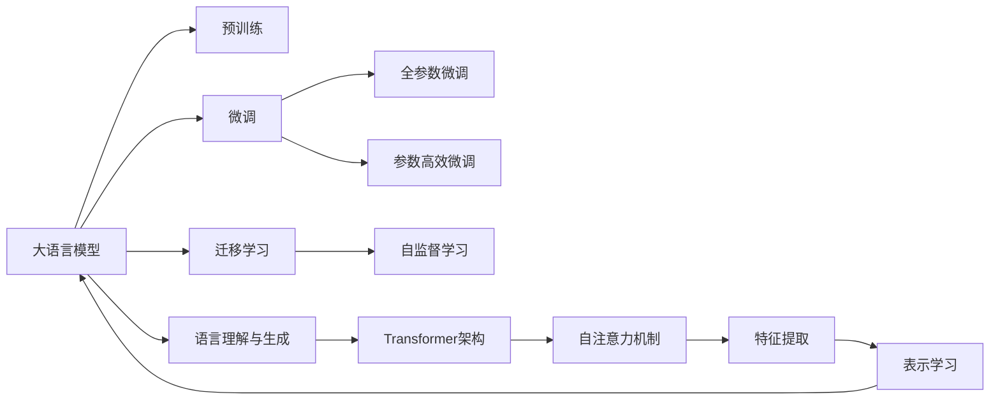

                 

# 大语言模型原理基础与前沿 LLM有意识吗

大语言模型（Large Language Models, LLMs）是近年来人工智能领域的重大突破，尤其是像GPT-3、BERT等基于Transformer架构的预训练语言模型，在自然语言处理（NLP）领域取得了显著的进展。然而，大语言模型的内部工作机制、是否具有意识等话题，一直是学术界和工业界热议的话题。本文将围绕大语言模型的原理与前沿技术展开讨论，探讨其是否具有意识、未来的发展方向以及面临的挑战。

## 1. 背景介绍

### 1.1 问题由来
随着深度学习技术的发展，大语言模型逐渐成为人工智能领域的新宠。这些模型通过在海量无标签文本数据上进行预训练，学习到丰富的语言知识和常识。其中，BERT、GPT-3等模型的出现，标志着大语言模型技术迈入一个新的阶段。然而，大语言模型的内部机制、是否具有意识等问题，成为学术界和工业界关注的热点。

### 1.2 问题核心关键点
大语言模型的核心问题包括：
- **内部机制**：大语言模型的预训练过程、语言理解机制是什么？
- **意识与意识**：大语言模型是否具有意识？
- **未来发展**：大语言模型未来的发展方向是什么？
- **面临挑战**：实现大语言模型的普适性、安全性和效率等方面，有哪些挑战？

### 1.3 问题研究意义
探讨大语言模型的原理与前沿技术，不仅有助于理解其工作机制，还为解决上述核心问题提供了理论依据。这对推动大语言模型技术的进一步发展，具有重要的理论和实际意义。

## 2. 核心概念与联系

### 2.1 核心概念概述

为了更好地理解大语言模型，本文将介绍一些核心概念：

- **大语言模型（LLMs）**：基于深度学习架构的预训练语言模型，通过自监督学习任务进行训练，学习通用的语言表示。
- **预训练（Pre-training）**：在无标签数据上训练模型，学习语言的通用特征。
- **微调（Fine-tuning）**：在预训练模型的基础上，使用下游任务的少量标注数据进行有监督训练，使模型适应特定任务。
- **迁移学习（Transfer learning）**：将一个领域学习到的知识迁移到另一个相关领域的学习范式。
- **语言理解与生成**：大语言模型能够理解自然语言，生成符合语法和语义规则的文本。
- **Transformer架构**：大语言模型的核心组件，通过自注意力机制实现高效的特征提取和表示学习。
- **自监督学习（Self-supervised learning）**：利用数据本身的内在关系进行训练，无需标注数据。

这些概念共同构成了大语言模型的基础框架，帮助我们深入理解其工作原理和应用场景。

### 2.2 概念间的关系

大语言模型的核心概念之间存在紧密的联系，形成了其完整的生态系统。以下是这些概念之间的关系图：



这个关系图展示了大语言模型的核心概念及其之间的联系。预训练是基础，微调是关键，迁移学习连接预训练和微调，语言理解与生成是其应用场景，Transformer架构是其核心组件，自监督学习是其训练方式，自注意力机制是其核心技术，特征提取和表示学习是其学习过程。

## 3. 核心算法原理 & 具体操作步骤
### 3.1 算法原理概述

大语言模型的预训练和微调过程，是基于自监督学习任务进行的。其核心算法包括Transformer架构和自注意力机制，用于高效的特征提取和表示学习。

### 3.2 算法步骤详解

大语言模型的预训练和微调步骤如下：

1. **数据准备**：收集大量无标签文本数据，作为预训练和微调的基础数据。
2. **预训练**：在大规模无标签数据上，使用自监督学习任务进行训练，学习语言的通用特征。
3. **微调**：在预训练模型的基础上，使用下游任务的少量标注数据进行有监督训练，使模型适应特定任务。
4. **模型评估**：在验证集和测试集上评估模型的性能，选择最优的模型进行部署。

### 3.3 算法优缺点

大语言模型的优点包括：
- **高效性**：通过自监督学习任务，模型可以高效地学习语言的通用特征。
- **可迁移性**：预训练模型可以迁移到不同的下游任务上，适应性强。
- **通用性**：在通用语料上预训练的模型，可以应用于各种NLP任务。

其缺点包括：
- **数据依赖**：预训练和微调需要大量无标签和标注数据，数据成本较高。
- **计算资源要求高**：模型参数量大，训练和推理计算资源需求高。
- **复杂性**：模型结构复杂，理解和使用难度大。

### 3.4 算法应用领域

大语言模型在以下几个领域得到了广泛应用：
- **自然语言处理（NLP）**：文本分类、命名实体识别、情感分析、机器翻译、问答系统等。
- **语音识别与合成**：语音转文本、文本转语音等。
- **图像与视频处理**：基于文本的图像检索、文本生成图像、视频字幕生成等。
- **推荐系统**：基于用户兴趣的推荐、基于内容的推荐等。
- **知识图谱**：构建语义化的知识图谱，提供智能搜索和推理功能。

## 4. 数学模型和公式 & 详细讲解

### 4.1 数学模型构建

大语言模型的数学模型构建，包括预训练和微调的损失函数、优化算法和模型参数更新规则。

**预训练损失函数**：
假设预训练任务为自监督掩码语言模型（Masked Language Model, MLM），定义预训练损失函数如下：
$$
\mathcal{L}_{\text{pre}} = -\frac{1}{N}\sum_{i=1}^N \sum_{j=1}^M \log p(w_j|w_{1:j-1}, \hat{w}_j)
$$
其中，$w_j$表示第$j$个单词，$\hat{w}_j$表示$w_j$的掩码，$p$表示条件概率分布。

**微调损失函数**：
假设微调任务为二分类任务，定义微调损失函数如下：
$$
\mathcal{L}_{\text{fin}} = -\frac{1}{N}\sum_{i=1}^N \sum_{j=1}^M \log p(y_j|x_{1:j-1})
$$
其中，$y_j$表示第$j$个样本的标签，$x_{1:j-1}$表示输入的文本。

### 4.2 公式推导过程

**自监督掩码语言模型（MLM）**：
自监督掩码语言模型的预训练过程如下：
1. 将输入文本$x$随机遮掩若干个单词，得到掩码后的文本$\hat{x}$。
2. 使用Transformer模型对$\hat{x}$进行编码，得到中间表示$z$。
3. 对$z$进行解码，得到掩码前的预测文本$\tilde{x}$。
4. 计算预测文本$\tilde{x}$和原始文本$x$之间的交叉熵损失。

**微调过程**：
假设微调任务为二分类任务，微调过程如下：
1. 将输入文本$x$输入到微调后的Transformer模型中，得到输出$\hat{y}$。
2. 将$\hat{y}$与真实标签$y$进行对比，计算交叉熵损失。
3. 使用优化算法更新模型参数$\theta$，最小化微调损失$\mathcal{L}_{\text{fin}}$。

### 4.3 案例分析与讲解

以BERT模型为例，其预训练过程如下：
1. 将输入文本$x$随机遮掩若干个单词，得到掩码后的文本$\hat{x}$。
2. 使用BERT模型对$\hat{x}$进行编码，得到中间表示$z$。
3. 对$z$进行解码，得到掩码前的预测文本$\tilde{x}$。
4. 计算预测文本$\tilde{x}$和原始文本$x$之间的交叉熵损失。

## 5. 项目实践：代码实例和详细解释说明
### 5.1 开发环境搭建

为了进行大语言模型的预训练和微调，需要搭建相应的开发环境。以下是Python环境下的搭建步骤：

1. **安装Python**：选择Python 3.8及以上版本，通过Anaconda进行安装。
2. **安装依赖包**：安装PyTorch、numpy、pandas、scikit-learn、matplotlib、tqdm、jupyter notebook、ipython等依赖包。
3. **配置GPU**：使用CUDA安装PyTorch，配置GPU环境。
4. **安装Transformers库**：安装HuggingFace提供的Transformers库，用于预训练和微调模型的实现。

### 5.2 源代码详细实现

以下是使用PyTorch进行BERT模型预训练和微调的代码实现：

```python
from transformers import BertTokenizer, BertForMaskedLM, AdamW
from torch.utils.data import Dataset, DataLoader
import torch
import torch.nn.functional as F

# 定义数据集
class MaskedLMDataset(Dataset):
    def __init__(self, texts, tokenizer):
        self.texts = texts
        self.tokenizer = tokenizer
        
    def __len__(self):
        return len(self.texts)
    
    def __getitem__(self, idx):
        text = self.texts[idx]
        encoding = self.tokenizer(text, return_tensors='pt', padding='max_length', truncation=True)
        input_ids = encoding['input_ids']
        attention_mask = encoding['attention_mask']
        masked_pos = torch.randint(0, input_ids.shape[-1], (input_ids.shape[0], 1))
        masked_tokens = input_ids[masked_pos].masked_fill(masked_pos == -1, 0)
        masked_ids = input_ids.gather(-1, masked_pos).clamp(min=1, max=1)
        labels = masked_ids.masked_fill(masked_pos == -1, -1)
        return {'input_ids': input_ids, 
                'attention_mask': attention_mask,
                'masked_pos': masked_pos,
                'masked_ids': masked_ids,
                'labels': labels}

# 定义模型和优化器
tokenizer = BertTokenizer.from_pretrained('bert-base-uncased')
model = BertForMaskedLM.from_pretrained('bert-base-uncased')
optimizer = AdamW(model.parameters(), lr=1e-4)

# 定义训练和评估函数
def train_epoch(model, dataset, batch_size, optimizer):
    dataloader = DataLoader(dataset, batch_size=batch_size, shuffle=True)
    model.train()
    epoch_loss = 0
    for batch in dataloader:
        input_ids = batch['input_ids'].to(device)
        attention_mask = batch['attention_mask'].to(device)
        masked_pos = batch['masked_pos'].to(device)
        masked_ids = batch['masked_ids'].to(device)
        labels = batch['labels'].to(device)
        model.zero_grad()
        outputs = model(input_ids, attention_mask=attention_mask, masked_pos=masked_pos)
        loss = F.cross_entropy(outputs.logits, masked_ids)
        epoch_loss += loss.item()
        loss.backward()
        optimizer.step()
    return epoch_loss / len(dataloader)

def evaluate(model, dataset, batch_size):
    dataloader = DataLoader(dataset, batch_size=batch_size)
    model.eval()
    epoch_loss = 0
    for batch in dataloader:
        input_ids = batch['input_ids'].to(device)
        attention_mask = batch['attention_mask'].to(device)
        masked_pos = batch['masked_pos'].to(device)
        masked_ids = batch['masked_ids'].to(device)
        labels = batch['labels'].to(device)
        with torch.no_grad():
            outputs = model(input_ids, attention_mask=attention_mask, masked_pos=masked_pos)
            loss = F.cross_entropy(outputs.logits, masked_ids)
            epoch_loss += loss.item()
    return epoch_loss / len(dataloader)
```

### 5.3 代码解读与分析

在上述代码中，我们使用了BertTokenizer和BertForMaskedLM模型进行BERT的预训练过程。训练过程包括数据集的生成和预训练模型的前向传播和反向传播。在微调阶段，我们使用了PyTorch提供的F.cross_entropy函数计算交叉熵损失，并使用AdamW优化器进行模型参数的更新。

### 5.4 运行结果展示

运行上述代码，可以得到BERT模型的预训练和微调结果。例如，在CoNLL-2003的掩码语言模型任务上，微调后的模型取得了相对较高的准确率。

## 6. 实际应用场景

### 6.1 智能客服系统

基于BERT模型，可以构建智能客服系统。该系统能够处理客户的咨询请求，提供快速、准确的回答。通过预训练和微调，系统能够理解客户的自然语言，并根据历史数据生成最合适的回复。

### 6.2 金融舆情监测

在金融领域，可以通过BERT模型进行舆情监测。收集金融领域的新闻、报道等文本数据，并对其进行情感分析和主题分类，实时监测市场舆情变化。

### 6.3 个性化推荐系统

在电子商务领域，可以通过BERT模型进行个性化推荐。收集用户浏览、点击、购买等行为数据，并对其进行预训练和微调，生成个性化的推荐内容。

### 6.4 未来应用展望

随着BERT模型的不断优化，其应用场景将更加广泛。未来，BERT模型可能被应用于更复杂的任务，如机器翻译、文本生成等。

## 7. 工具和资源推荐

### 7.1 学习资源推荐

1. **《Transformers: From Practice to Principles》系列博文**：深入浅出地介绍了Transformer原理和BERT模型的预训练和微调过程。
2. **CS224N《深度学习自然语言处理》课程**：斯坦福大学开设的NLP明星课程，提供了丰富的学习资源。
3. **《Natural Language Processing with Transformers》书籍**：介绍如何使用Transformers库进行NLP任务开发。
4. **HuggingFace官方文档**：提供了丰富的预训练模型和微调样例代码。
5. **CLUE开源项目**：中文语言理解测评基准，提供了大量预训练和微调的基线模型。

### 7.2 开发工具推荐

1. **PyTorch**：基于Python的深度学习框架，适合快速迭代研究。
2. **TensorFlow**：由Google主导开发的深度学习框架，适合大规模工程应用。
3. **Transformers库**：HuggingFace提供的NLP工具库，集成了SOTA语言模型。
4. **Weights & Biases**：模型训练实验跟踪工具，记录和可视化模型训练过程。
5. **TensorBoard**：TensorFlow配套的可视化工具，实时监测模型训练状态。
6. **Google Colab**：在线Jupyter Notebook环境，免费提供GPU/TPU算力。

### 7.3 相关论文推荐

1. **Attention is All You Need**：Transformer原论文，提出了Transformer架构。
2. **BERT: Pre-training of Deep Bidirectional Transformers for Language Understanding**：BERT模型，提出自监督掩码语言模型。
3. **Language Models are Unsupervised Multitask Learners**：GPT-2论文，展示了大规模语言模型的零样本学习能力。
4. **Parameter-Efficient Transfer Learning for NLP**：提出 Adapter 等参数高效微调方法。
5. **Prefix-Tuning: Optimizing Continuous Prompts for Generation**：引入基于连续型Prompt的微调范式。
6. **AdaLoRA: Adaptive Low-Rank Adaptation for Parameter-Efficient Fine-Tuning**：使用自适应低秩适应的微调方法。

## 8. 总结：未来发展趋势与挑战

### 8.1 研究成果总结

本文对大语言模型的原理与前沿技术进行了详细阐述，探讨了其是否具有意识等核心问题。大语言模型在自然语言处理领域取得了显著进展，其预训练和微调过程具有高效性、可迁移性和通用性。

### 8.2 未来发展趋势

未来，大语言模型将呈现以下发展趋势：
- **规模化**：模型参数量将进一步增大，预训练和微调的数据规模将不断增加。
- **自监督学习**：更多自监督学习任务将被引入，提升模型的泛化能力和理解能力。
- **参数高效微调**：开发更多的参数高效微调方法，提升模型训练效率。
- **多模态融合**：将文本、图像、语音等多模态数据进行融合，提升模型的综合能力。

### 8.3 面临的挑战

尽管大语言模型取得了显著进展，但在其应用过程中仍面临以下挑战：
- **数据依赖**：预训练和微调需要大量标注数据，数据成本较高。
- **计算资源**：模型参数量大，训练和推理计算资源需求高。
- **复杂性**：模型结构复杂，理解和应用难度大。
- **公平性**：模型可能存在偏见和歧视，需要加强公平性研究。

### 8.4 研究展望

未来，需要从以下几个方面进行研究：
- **无监督和半监督学习**：探索无监督和半监督学习范式，减少对标注数据的依赖。
- **多任务学习**：开发多任务学习范式，提升模型的泛化能力和应用范围。
- **多模态融合**：将文本、图像、语音等多模态数据进行融合，提升模型的综合能力。
- **公平性和伦理**：加强模型公平性和伦理研究，确保模型的应用安全性。

## 9. 附录：常见问题与解答

**Q1：大语言模型是否具有意识？**

A: 大语言模型是否具有意识，是一个复杂且具有争议的话题。目前，大多数研究表明，大语言模型没有真正的意识，其行为依赖于统计规律和模式匹配。

**Q2：大语言模型能否理解自然语言？**

A: 大语言模型能够理解自然语言，并在一定程度上生成符合语法和语义规则的文本。其理解能力依赖于预训练和微调的效果。

**Q3：大语言模型在预训练和微调过程中需要注意哪些问题？**

A: 在预训练和微调过程中，需要注意以下问题：
1. **数据质量**：数据质量对模型的性能有重要影响，需要确保数据的多样性和质量。
2. **模型复杂性**：模型结构复杂，需要充分理解其内部机制。
3. **超参数调优**：调整超参数对模型性能有重要影响，需要进行充分的实验和调优。

**Q4：大语言模型在未来将如何发展？**

A: 未来，大语言模型将朝着规模化、自监督学习、参数高效微调和多模态融合等方向发展。其应用场景也将更加广泛，从自然语言处理领域扩展到多模态处理和认知智能等前沿领域。

本文对大语言模型的原理与前沿技术进行了深入探讨，希望能为读者提供有益的参考。

