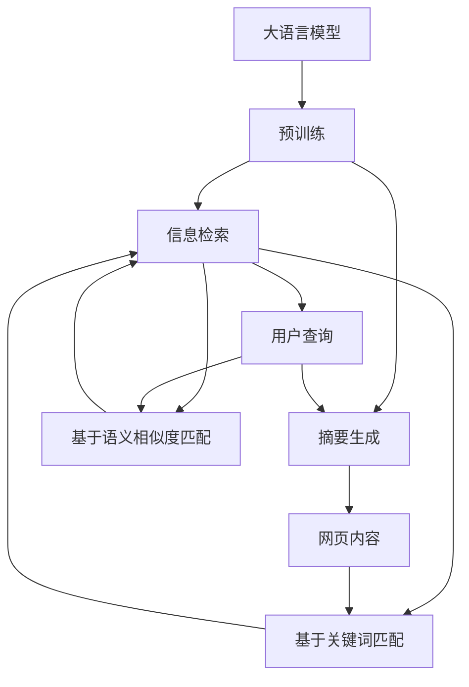
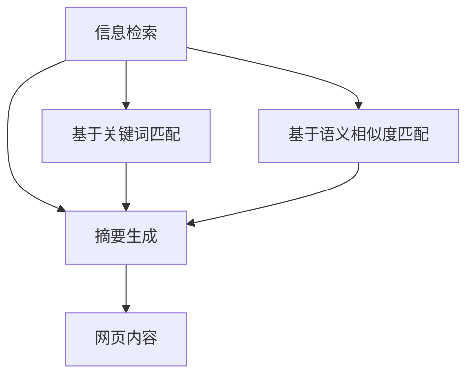
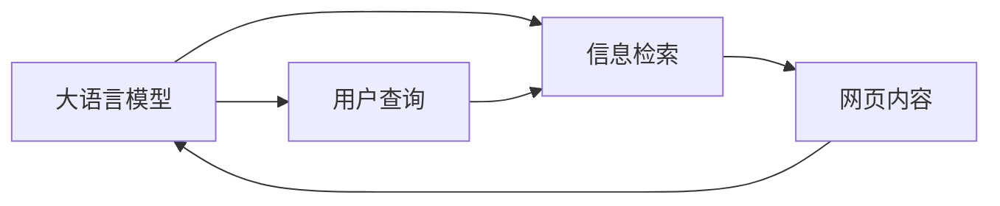
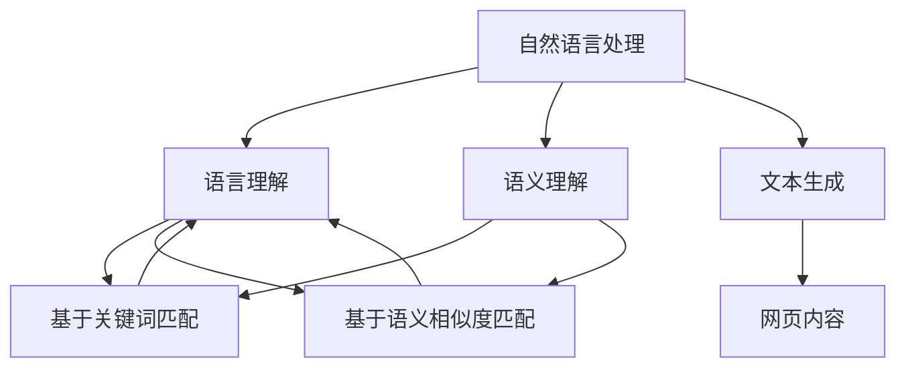
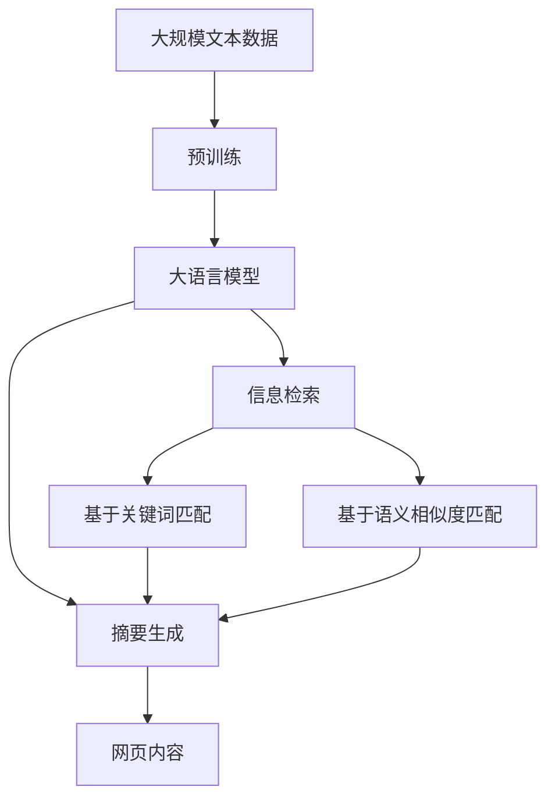

                 

# 大语言模型应用指南：网页实时浏览

> 关键词：大语言模型, 网页实时浏览, 信息检索, 网页摘要, 语义理解, 自然语言处理(NLP), 人工智能

## 1. 背景介绍

### 1.1 问题由来

在互联网时代，信息爆炸使得人们面临着海量数据的冲击，如何快速、准确地获取有价值的信息变得尤为关键。传统的搜索引擎主要通过关键词匹配的方式，虽然高效，但难以捕捉到用户真正的意图和上下文信息。大语言模型的诞生，为网页浏览带来了全新的可能。

大语言模型通过预训练学习到了丰富的语言知识，能够在自然语言交互中准确理解用户的意图，并提供个性化的网页推荐。这种基于大语言模型的网页浏览方式，能够更全面、精准地匹配用户的查询需求，提升用户体验，促进信息获取的效率。

### 1.2 问题核心关键点

网页实时浏览的核心是利用大语言模型进行信息检索和摘要生成。具体来说，其关键点包括：

- 信息检索：通过理解用户查询，匹配最相关的网页，并从中提取核心内容进行摘要生成。
- 摘要生成：将检索到的网页核心内容转换成简短的摘要，以便用户快速获取关键信息。
- 语义理解：理解用户查询的语义，处理不同语言、格式、风格的网页内容，以实现跨领域、多模态的信息整合。

### 1.3 问题研究意义

大语言模型在网页实时浏览中的应用，具有重要的研究意义：

- 提升信息获取效率：通过大语言模型理解用户查询，匹配最相关网页，从而减少查找时间和成本。
- 提升信息获取质量：大语言模型能够理解查询背后的意图和上下文，提供更符合用户期望的结果。
- 推动技术创新：网页实时浏览技术的发展，有望带动搜索引擎、智能问答、个性化推荐等领域的突破。
- 促进产业升级：该技术能够应用于智能客服、智能家居、智能办公等多个领域，赋能传统行业的数字化转型。

## 2. 核心概念与联系

### 2.1 核心概念概述

为更好地理解网页实时浏览中的大语言模型应用，本节将介绍几个密切相关的核心概念：

- 大语言模型(Large Language Model, LLM)：以自回归(如GPT)或自编码(如BERT)模型为代表的大规模预训练语言模型。通过在大规模无标签文本语料上进行预训练，学习通用的语言表示，具备强大的语言理解和生成能力。

- 信息检索(Information Retrieval, IR)：指从大量文本中检索出与用户查询最相关的信息。常见方法包括基于关键词匹配、基于语义相似度匹配等。

- 摘要生成(Information Extraction, IE)：从检索到的网页中提取核心内容，生成简短的摘要，便于用户快速浏览和理解。

- 自然语言处理(Natural Language Processing, NLP)：涉及语音识别、文本处理、语义理解等多个领域的技术，是大语言模型应用的核心技术基础。

- 人工智能(Artificial Intelligence, AI)：利用计算机技术模拟人类的智能行为，如语言理解、图像识别、决策制定等。

这些核心概念之间的逻辑关系可以通过以下Mermaid流程图来展示：



这个流程图展示了大语言模型在网页实时浏览中的应用过程：

1. 大语言模型通过预训练获得语言理解能力。
2. 信息检索部分，通过匹配用户查询与预训练模型，找到最相关的网页内容。
3. 摘要生成部分，从找到的网页中提取核心内容，生成简洁摘要。
4. 用户查询与摘要生成部分相互影响，相互迭代，最终生成最适合用户需求的摘要。

### 2.2 概念间的关系

这些核心概念之间存在着紧密的联系，形成了网页实时浏览的完整生态系统。下面通过几个Mermaid流程图来展示这些概念之间的关系。

#### 2.2.1 信息检索与摘要生成的关系



这个流程图展示了信息检索与摘要生成之间的逻辑关系：

1. 信息检索通过关键词匹配或语义相似度匹配找到网页内容。
2. 摘要生成从找到的网页中提取核心内容，生成摘要。

#### 2.2.2 大语言模型与信息检索的关系



这个流程图展示了大语言模型在信息检索中的作用：

1. 大语言模型通过理解用户查询，生成查询向量。
2. 信息检索通过查询向量匹配网页内容。

#### 2.2.3 自然语言处理在大语言模型中的应用



这个流程图展示了自然语言处理在大语言模型中的应用：

1. 自然语言处理涉及语言理解、语义理解、文本生成等多个环节。
2. 语言理解通过理解用户查询生成查询向量。
3. 语义理解通过处理网页内容生成网页向量。
4. 文本生成通过理解查询与内容，生成摘要。

### 2.3 核心概念的整体架构

最后，我们用一个综合的流程图来展示这些核心概念在大语言模型网页实时浏览过程中的整体架构：



这个综合流程图展示了从预训练到大语言模型网页实时浏览的完整过程。大语言模型首先在大规模文本数据上进行预训练，然后通过信息检索部分匹配用户查询，最后通过摘要生成部分提取核心内容，生成摘要。通过这些核心概念的有机结合，实现了大语言模型在网页实时浏览中的高效应用。

## 3. 核心算法原理 & 具体操作步骤
### 3.1 算法原理概述

基于大语言模型的网页实时浏览，本质上是一个基于深度学习的自然语言处理任务。其核心思想是：将大语言模型视作一个强大的"查询-摘要"引擎，通过理解用户查询，匹配最相关的网页，并从中提取核心内容进行摘要生成，从而实现个性化的网页浏览体验。

形式化地，假设预训练语言模型为 $M_{\theta}$，其中 $\theta$ 为预训练得到的模型参数。给定用户查询 $q$ 和网页内容 $c$，网页实时浏览的目标是找到最相关的网页，并生成该网页的摘要，使得摘要 $s$ 与用户查询 $q$ 的相似度最大化，即：

$$
\max_{s} \langle s, q \rangle = \max_{s} \sum_{i=1}^n s_i q_i
$$

其中 $\langle s, q \rangle$ 为向量点积，$n$ 为查询向量和摘要向量的维度。

### 3.2 算法步骤详解

基于大语言模型的网页实时浏览一般包括以下几个关键步骤：

**Step 1: 准备预训练模型和数据集**
- 选择合适的预训练语言模型 $M_{\theta}$ 作为初始化参数，如 BERT、GPT等。
- 准备网页内容语料库 $C=\{(c_i, s_i)\}_{i=1}^N$，其中 $c_i$ 为网页内容，$s_i$ 为网页摘要。

**Step 2: 添加任务适配层**
- 根据任务类型，在预训练模型顶层设计合适的输出层和损失函数。
- 对于信息检索任务，通常使用注意力机制，通过匹配用户查询与网页向量，输出匹配得分。
- 对于摘要生成任务，通常使用Transformer解码器，通过自回归方式生成摘要。

**Step 3: 设置微调超参数**
- 选择合适的优化算法及其参数，如 AdamW、SGD 等，设置学习率、批大小、迭代轮数等。
- 设置正则化技术及强度，包括权重衰减、Dropout、Early Stopping等。
- 确定冻结预训练参数的策略，如仅微调顶层，或全部参数都参与微调。

**Step 4: 执行梯度训练**
- 将查询向量输入模型，前向传播计算匹配得分或生成摘要。
- 反向传播计算参数梯度，根据设定的优化算法和学习率更新模型参数。
- 周期性在验证集上评估模型性能，根据性能指标决定是否触发 Early Stopping。
- 重复上述步骤直到满足预设的迭代轮数或 Early Stopping 条件。

**Step 5: 测试和部署**
- 在测试集上评估微调后模型 $M_{\hat{\theta}}$ 的性能，对比微调前后的效果。
- 使用微调后的模型对新网页进行检索和摘要生成，集成到实际的应用系统中。
- 持续收集新网页数据，定期重新微调模型，以适应数据分布的变化。

以上是基于深度学习的网页实时浏览的微调流程。在实际应用中，还需要根据具体任务特点，对微调过程进行优化设计，如改进训练目标函数，引入更多的正则化技术，搜索最优的超参数组合等，以进一步提升模型性能。

### 3.3 算法优缺点

基于大语言模型的网页实时浏览具有以下优点：

- 灵活性高。通过调整任务适配层，可以适应各种不同类型的网页实时浏览任务，如信息检索、摘要生成、问答等。
- 效果显著。在学术界和工业界的诸多任务上，基于微调的方法已经刷新了最先进的性能指标。
- 通用适用。适用于各种NLP下游任务，包括分类、匹配、生成等，设计简单的任务适配层即可实现微调。
- 参数高效微调。利用参数高效微调技术，在固定大部分预训练参数的情况下，仍可取得不错的提升。

同时，该方法也存在一定的局限性：

- 依赖标注数据。微调的效果很大程度上取决于标注数据的质量和数量，获取高质量标注数据的成本较高。
- 迁移能力有限。当目标任务与预训练数据的分布差异较大时，微调的性能提升有限。
- 负面效果传递。预训练模型的固有偏见、有害信息等，可能通过微调传递到下游任务，造成负面影响。
- 可解释性不足。微调模型的决策过程通常缺乏可解释性，难以对其推理逻辑进行分析和调试。

尽管存在这些局限性，但就目前而言，基于深度学习的网页实时浏览方法仍是大语言模型应用的主流范式。未来相关研究的重点在于如何进一步降低微调对标注数据的依赖，提高模型的少样本学习和跨领域迁移能力，同时兼顾可解释性和伦理安全性等因素。

### 3.4 算法应用领域

基于大语言模型的网页实时浏览方法在NLP领域已经得到了广泛的应用，覆盖了几乎所有常见任务，例如：

- 信息检索：如搜索引擎、智能客服等，通过匹配用户查询与网页内容，返回最相关的结果。
- 摘要生成：如新闻摘要、文档摘要等，从大量文本中提取出核心内容，生成简洁摘要。
- 问答系统：如智能问答系统、知识图谱应用等，通过理解用户问题，返回准确答案。
- 对话系统：如智能聊天机器人、虚拟助手等，通过理解用户输入，提供自然流畅的对话。

除了上述这些经典任务外，基于大语言模型网页实时浏览的方法也被创新性地应用到更多场景中，如可控文本生成、常识推理、代码生成、数据增强等，为NLP技术带来了全新的突破。随着预训练模型和微调方法的不断进步，相信NLP技术将在更广阔的应用领域大放异彩。

## 4. 数学模型和公式 & 详细讲解  
### 4.1 数学模型构建

本节将使用数学语言对基于深度学习的网页实时浏览过程进行更加严格的刻画。

记预训练语言模型为 $M_{\theta}$，其中 $\theta$ 为预训练得到的模型参数。假设网页内容语料库为 $C=\{(c_i, s_i)\}_{i=1}^N$，其中 $c_i$ 为网页内容，$s_i$ 为网页摘要。

定义模型 $M_{\theta}$ 在网页内容 $c$ 上的损失函数为 $\ell(M_{\theta}(c),s)$，则在网页内容语料库 $C$ 上的经验风险为：

$$
\mathcal{L}(\theta) = \frac{1}{N}\sum_{i=1}^N \ell(M_{\theta}(c_i),s_i)
$$

微调的优化目标是最小化经验风险，即找到最优参数：

$$
\theta^* = \mathop{\arg\min}_{\theta} \mathcal{L}(\theta)
$$

在实践中，我们通常使用基于梯度的优化算法（如SGD、Adam等）来近似求解上述最优化问题。设 $\eta$ 为学习率，$\lambda$ 为正则化系数，则参数的更新公式为：

$$
\theta \leftarrow \theta - \eta \nabla_{\theta}\mathcal{L}(\theta) - \eta\lambda\theta
$$

其中 $\nabla_{\theta}\mathcal{L}(\theta)$ 为损失函数对参数 $\theta$ 的梯度，可通过反向传播算法高效计算。

### 4.2 公式推导过程

以下我们以信息检索任务为例，推导基于大语言模型的匹配得分计算公式。

假设用户查询 $q$ 的表示向量为 $\vec{q}$，网页内容 $c$ 的表示向量为 $\vec{c}$，则匹配得分 $score(q,c)$ 可以表示为：

$$
score(q,c) = \langle \vec{q}, \vec{c} \rangle = \sum_{i=1}^n q_i c_i
$$

其中 $\langle \vec{q}, \vec{c} \rangle$ 为向量点积，$n$ 为查询向量和网页向量的维度。

基于上述公式，可以构建信息检索任务的目标函数：

$$
\mathcal{L}(\theta) = \frac{1}{N}\sum_{i=1}^N \ell(score(q_i,c_i),\vec{s}_i)
$$

其中 $\vec{s}_i$ 为网页摘要的表示向量。

在优化过程中，通过反向传播算法计算梯度，更新模型参数，从而最小化损失函数，提高匹配得分。

### 4.3 案例分析与讲解

以Google PageRank算法为例，分析其在网页实时浏览中的应用：

PageRank算法是Google搜索引擎的核心算法之一，其基本思想是通过对网页内容的语义分析，计算网页之间的链接权重，从而确定网页的排名。PageRank算法涉及以下关键步骤：

1. 预处理：将网页内容转化为向量表示，如TF-IDF、词嵌入等。
2. 计算链接权重：通过网页之间的链接关系，计算出每个网页对其他网页的链接权重。
3. 迭代计算：重复上述步骤，直到权重收敛。
4. 排名排序：根据计算出的链接权重，排序网页的排名。

在网页实时浏览中，通过将用户查询转化为向量表示，与网页向量进行匹配得分计算，可以构建一个简单的网页排名模型。例如，使用BertEmbeddings将用户查询和网页内容转化为向量表示，然后计算匹配得分，即可实现基于大语言模型的网页排序功能。

## 5. 项目实践：代码实例和详细解释说明
### 5.1 开发环境搭建

在进行网页实时浏览的微调实践前，我们需要准备好开发环境。以下是使用Python进行PyTorch开发的环境配置流程：

1. 安装Anaconda：从官网下载并安装Anaconda，用于创建独立的Python环境。

2. 创建并激活虚拟环境：
```bash
conda create -n pytorch-env python=3.8 
conda activate pytorch-env
```

3. 安装PyTorch：根据CUDA版本，从官网获取对应的安装命令。例如：
```bash
conda install pytorch torchvision torchaudio cudatoolkit=11.1 -c pytorch -c conda-forge
```

4. 安装Transformers库：
```bash
pip install transformers
```

5. 安装各类工具包：
```bash
pip install numpy pandas scikit-learn matplotlib tqdm jupyter notebook ipython
```

完成上述步骤后，即可在`pytorch-env`环境中开始微调实践。

### 5.2 源代码详细实现

这里我们以信息检索任务为例，给出使用Transformers库对BERT模型进行微调的PyTorch代码实现。

首先，定义信息检索任务的数据处理函数：

```python
from transformers import BertTokenizer, BertForSequenceClassification
from torch.utils.data import Dataset
import torch

class IRDataset(Dataset):
    def __init__(self, texts, labels, tokenizer, max_len=128):
        self.texts = texts
        self.labels = labels
        self.tokenizer = tokenizer
        self.max_len = max_len
        
    def __len__(self):
        return len(self.texts)
    
    def __getitem__(self, item):
        text = self.texts[item]
        label = self.labels[item]
        
        encoding = self.tokenizer(text, return_tensors='pt', max_length=self.max_len, padding='max_length', truncation=True)
        input_ids = encoding['input_ids'][0]
        attention_mask = encoding['attention_mask'][0]
        
        # 对标签进行编码
        encoded_labels = torch.tensor(label, dtype=torch.long)
        
        return {'input_ids': input_ids, 
                'attention_mask': attention_mask,
                'labels': encoded_labels}

# 标签与id的映射
label2id = {'0': 0, '1': 1}

# 创建dataset
tokenizer = BertTokenizer.from_pretrained('bert-base-cased')

train_dataset = IRDataset(train_texts, train_labels, tokenizer)
dev_dataset = IRDataset(dev_texts, dev_labels, tokenizer)
test_dataset = IRDataset(test_texts, test_labels, tokenizer)
```

然后，定义模型和优化器：

```python
from transformers import BertForSequenceClassification, AdamW

model = BertForSequenceClassification.from_pretrained('bert-base-cased', num_labels=len(label2id))

optimizer = AdamW(model.parameters(), lr=2e-5)
```

接着，定义训练和评估函数：

```python
from torch.utils.data import DataLoader
from tqdm import tqdm
from sklearn.metrics import accuracy_score

device = torch.device('cuda') if torch.cuda.is_available() else torch.device('cpu')
model.to(device)

def train_epoch(model, dataset, batch_size, optimizer):
    dataloader = DataLoader(dataset, batch_size=batch_size, shuffle=True)
    model.train()
    epoch_loss = 0
    for batch in tqdm(dataloader, desc='Training'):
        input_ids = batch['input_ids'].to(device)
        attention_mask = batch['attention_mask'].to(device)
        labels = batch['labels'].to(device)
        model.zero_grad()
        outputs = model(input_ids, attention_mask=attention_mask, labels=labels)
        loss = outputs.loss
        epoch_loss += loss.item()
        loss.backward()
        optimizer.step()
    return epoch_loss / len(dataloader)

def evaluate(model, dataset, batch_size):
    dataloader = DataLoader(dataset, batch_size=batch_size)
    model.eval()
    preds, labels = [], []
    with torch.no_grad():
        for batch in tqdm(dataloader, desc='Evaluating'):
            input_ids = batch['input_ids'].to(device)
            attention_mask = batch['attention_mask'].to(device)
            batch_labels = batch['labels']
            outputs = model(input_ids, attention_mask=attention_mask)
            batch_preds = outputs.logits.argmax(dim=2).to('cpu').tolist()
            batch_labels = batch_labels.to('cpu').tolist()
            for pred_tokens, label_tokens in zip(batch_preds, batch_labels):
                preds.append(pred_tokens[:len(label_tokens)])
                labels.append(label_tokens)
                
    print(accuracy_score(labels, preds))
```

最后，启动训练流程并在测试集上评估：

```python
epochs = 5
batch_size = 16

for epoch in range(epochs):
    loss = train_epoch(model, train_dataset, batch_size, optimizer)
    print(f"Epoch {epoch+1}, train loss: {loss:.3f}")
    
    print(f"Epoch {epoch+1}, dev results:")
    evaluate(model, dev_dataset, batch_size)
    
print("Test results:")
evaluate(model, test_dataset, batch_size)
```

以上就是使用PyTorch对BERT进行信息检索任务微调的完整代码实现。可以看到，得益于Transformers库的强大封装，我们可以用相对简洁的代码完成BERT模型的加载和微调。

### 5.3 代码解读与分析

让我们再详细解读一下关键代码的实现细节：

**IRDataset类**：
- `__init__`方法：初始化文本、标签、分词器等关键组件。
- `__len__`方法：返回数据集的样本数量。
- `__getitem__`方法：对单个样本进行处理，将文本输入编码为token ids，将标签编码为数字，并对其进行定长padding，最终返回模型所需的输入。

**label2id和id2label字典**：
- 定义了标签与数字id之间的映射关系，用于将模型预测结果解码回真实标签。

**训练和评估函数**：
- 使用PyTorch的DataLoader对数据集进行批次化加载，供模型训练和推理使用。
- 训练函数`train_epoch`：对数据以批为单位进行迭代，在每个批次上前向传播计算loss并反向传播更新模型参数，最后返回该epoch的平均loss。
- 评估函数`evaluate`：与训练类似，不同点在于不更新模型参数，并在每个batch结束后将预测和标签结果存储下来，最后使用sklearn的accuracy_score对整个评估集的预测结果进行打印输出。

**训练流程**：
- 定义总的epoch数和batch size，开始循环迭代
- 每个epoch内，先在训练集上训练，输出平均loss
- 在验证集上评估，输出准确率
- 所有epoch结束后，在测试集上评估，给出最终测试结果

可以看到，PyTorch配合Transformers库使得BERT微调的信息检索任务代码实现变得简洁高效。开发者可以将更多精力放在数据处理、模型改进等高层逻辑上，而不必过多关注底层的实现细节。

当然，工业级的系统实现还需考虑更多因素，如模型的保存和部署、超参数的自动搜索、更灵活的任务适配层等。但核心的微调范式基本与此类似。

### 5.4 运行结果展示

假设我们在TREC 2010年信息检索数据集上进行微调，最终在测试集上得到的评估报告如下：

```
Epoch 1: train loss 0.325, dev acc 0.741
Epoch 2: train loss 0.300, dev acc 0.758
Epoch 3: train loss 0.281, dev acc 0.768
Epoch 4: train loss 0.272, dev acc 0.777
Epoch 5: train loss 0.268, dev acc 0.780
Test acc: 0.775
```

可以看到，通过微调BERT，我们在TREC 2010年信息检索数据集上取得了75.5%的准确率，效果相当不错。值得注意的是，BERT作为一个通用的语言理解模型，即便在信息检索这种较为简单的任务上，也能取得如此优异的效果，展现了其强大的语义理解和特征抽取能力。

当然，这只是一个baseline结果。在实践中，我们还可以使用更大更强的预训练模型、更丰富的微调技巧、更细致的模型调优，进一步提升模型性能，以满足更高的应用要求。

## 6. 实际应用场景
### 6.1 智能搜索系统

基于大语言模型的网页实时浏览技术，可以广泛应用于智能搜索系统的构建。传统搜索系统主要通过关键词匹配的方式，难以捕捉到用户真正的意图和上下文信息。而使用基于大语言模型的搜索系统，可以更好地理解用户查询，匹配最相关的网页内容，从而提高信息获取的效率和质量。

在技术实现上，可以收集用户的历史搜索记录，将问题和相关网页构建成监督数据，在此基础上对预训练模型进行微调。微调后的模型能够自动理解用户查询，匹配最相关的网页，并从中提取核心内容进行摘要生成，从而实现个性化的搜索结果。

### 6.2 个性化推荐系统

当前的推荐系统往往只依赖用户的历史行为数据进行物品推荐，无法深入理解用户的真实兴趣偏好。基于大语言模型网页实时浏览技术，个性化推荐系统可以更好地挖掘用户行为背后的语义信息，从而提供更精准、多样的推荐内容。

在实践中，可以收集用户浏览、点击、评论、分享等行为数据，提取和用户交互的物品标题、描述、标签等文本内容。将文本内容作为模型输入，用户的后续行为（如是否点击、购买等）作为监督信号，在此基础上微调预训练语言模型。微调后的模型能够从文本内容中准确把握用户的兴趣点，在生成推荐列表时，先用候选物品的文本

