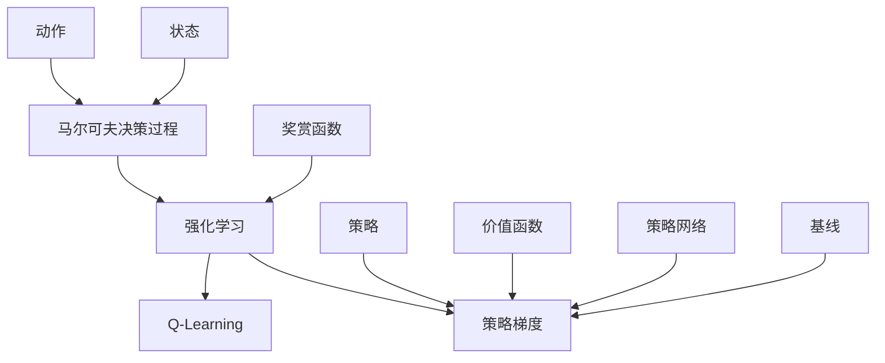

# 大规模语言模型从理论到实践：策略梯度

## 1. 背景介绍

### 1.1 问题的由来

在过去的几年中，自然语言处理(NLP)领域取得了长足的进步,很大程度上归功于transformer模型的出现,尤其是大规模语言模型(LLM)的应用。LLM能够在各种下游任务中表现出色,展现出强大的泛化能力。然而,训练这些模型需要大量的计算资源和海量的文本数据,这对于普通研究机构和企业来说是一个巨大的挑战。

此外,虽然LLM在许多任务上表现出色,但它们存在一些固有的缺陷,例如:

- 缺乏对因果关系的理解
- 容易受到偏见和不当内容的影响
- 对于一些特定领域的任务,泛化能力较差

为了解决这些问题,研究人员提出了一种新的训练范式:策略梯度(Policy Gradient)。

### 1.2 研究现状

策略梯度是一种强化学习算法,它通过直接优化期望回报来学习策略。与监督学习不同,强化学习算法不需要标注的训练数据,而是通过与环境的交互来学习。这使得策略梯度在处理序列决策问题时具有独特的优势。

最近,一些研究工作将策略梯度应用于语言模型的训练,取得了令人鼓舞的结果。例如,OpenAI的InstructGPT就是使用策略梯度进行训练的。与传统的语言模型相比,策略梯度训练的模型表现出更好的因果推理能力、更强的一致性和更少的有害偏见。

### 1.3 研究意义

将策略梯度应用于大规模语言模型训练,有望解决传统语言模型存在的一些缺陷,提高模型的泛化能力和可解释性。此外,策略梯度还可以帮助语言模型更好地理解任务和指令,从而提高模型在特定领域的表现。

本文将深入探讨策略梯度在大规模语言模型训练中的应用,包括其理论基础、核心算法、数学模型以及实际实现。我们还将分析策略梯度的优缺点,并讨论其在不同场景下的应用前景。

### 1.4 本文结构

本文的结构安排如下:

1. 背景介绍
2. 核心概念与联系
3. 核心算法原理与具体操作步骤
4. 数学模型和公式详细讲解与举例说明
5. 项目实践:代码实例和详细解释说明
6. 实际应用场景
7. 工具和资源推荐
8. 总结:未来发展趋势与挑战
9. 附录:常见问题与解答

## 2. 核心概念与联系

在深入探讨策略梯度算法之前,我们先介绍一些核心概念和它们之间的联系。

- **强化学习(Reinforcement Learning)**: 策略梯度算法属于强化学习范畴。强化学习是一种基于环境交互的学习范式,旨在找到一个最优策略来最大化期望回报。
- **马尔可夫决策过程(Markov Decision Process, MDP)**: 强化学习问题通常建模为MDP,它由状态、动作、奖赏函数和状态转移概率组成。
- **奖赏函数(Reward Function)**: 奖赏函数定义了在特定状态下执行某个动作所获得的即时回报。
- **策略(Policy)**: 策略是一个映射函数,它将状态映射到动作的概率分布。策略梯度算法旨在直接优化策略。
- **价值函数(Value Function)**: 价值函数估计了在当前状态下遵循某个策略所能获得的期望回报。
- **策略网络(Policy Network)**: 在实践中,策略通常由神经网络来表示和参数化,这就是策略网络。
- **基线(Baseline)**: 基线是一个估计值,用于减小策略梯度的方差,从而提高训练稳定性。

策略梯度算法的核心思想是直接优化策略网络的参数,使得在给定的MDP中,执行该策略能够获得最大的期望回报。这与基于价值函数的算法(如Q-Learning)不同,后者是通过估计价值函数来间接得到最优策略。

## 3. 核心算法原理与具体操作步骤

### 3.1 算法原理概述

策略梯度算法的核心思想是使用随机梯度上升法来直接优化策略的参数,从而最大化期望回报。具体来说,我们定义了一个目标函数 $J(\theta)$,它表示在当前策略参数 $\theta$ 下的期望回报。然后,我们计算目标函数关于策略参数的梯度 $\nabla_\theta J(\theta)$,并沿着梯度的方向更新策略参数。

$$J(\theta) = \mathbb{E}_{\tau \sim p_\theta(\tau)} [R(\tau)]$$

其中, $\tau$ 表示一个轨迹(状态-动作序列), $p_\theta(\tau)$ 是在策略参数 $\theta$ 下产生该轨迹的概率, $R(\tau)$ 是该轨迹的回报。

通过应用一些数学技巧,我们可以将梯度 $\nabla_\theta J(\theta)$ 重写为一个更易于计算的形式:

$$\nabla_\theta J(\theta) = \mathbb{E}_{\tau \sim p_\theta(\tau)} \left[\sum_{t=0}^{T} \nabla_\theta \log \pi_\theta(a_t|s_t) Q^{\pi_\theta}(s_t, a_t)\right]$$

其中, $\pi_\theta(a_t|s_t)$ 是在状态 $s_t$ 下执行动作 $a_t$ 的概率, $Q^{\pi_\theta}(s_t, a_t)$ 是在状态 $s_t$ 执行动作 $a_t$ 后,按照策略 $\pi_\theta$ 执行所能获得的期望回报。

这个公式告诉我们,为了最大化期望回报,我们需要增加那些回报较高的轨迹的概率,同时减小那些回报较低的轨迹的概率。

### 3.2 算法步骤详解

基于上述原理,我们可以总结出策略梯度算法的具体步骤:

1. **初始化策略参数** $\theta$
2. **采集轨迹数据**:通过与环境交互,按照当前策略 $\pi_\theta$ 采集一批轨迹数据 $\{\tau_i\}$
3. **估计回报**:对于每个轨迹 $\tau_i$,估计其回报 $R(\tau_i)$
4. **计算策略梯度**:根据公式计算策略梯度 $\nabla_\theta J(\theta)$
5. **更新策略参数**:使用优化算法(如随机梯度上升)沿着梯度方向更新策略参数 $\theta$
6. **重复步骤2-5**,直到策略收敛或达到预设的训练轮次

在实际应用中,我们通常会引入一些技巧来提高算法的稳定性和效率,例如:

- **基线(Baseline)**: 减小策略梯度的方差
- **优势估计(Advantage Estimation)**: 更准确地估计 $Q^{\pi_\theta}(s_t, a_t)$
- **策略熵正则化(Policy Entropy Regularization)**: 防止策略过早收敛到一个子优策略
- **异步更新(Asynchronous Update)**: 并行采集轨迹数据以提高效率

### 3.3 算法优缺点

策略梯度算法相较于其他强化学习算法有以下优缺点:

**优点**:

- 直接优化策略,无需估计价值函数,更加简单高效
- 适用于连续动作空间和非线性策略
- 通过交互式学习,能够更好地捕捉环境动态
- 具有较好的收敛性和稳定性

**缺点**:

- 需要大量的交互数据,数据效率较低
- 存在较大的方差,需要使用基线和其他技巧来减小方差
- 收敛速度较慢,尤其是在高维状态空间和动作空间中
- 难以处理稀疏奖赏问题

### 3.4 算法应用领域

策略梯度算法广泛应用于以下领域:

- **机器人控制**: 通过与环境交互来学习最优控制策略
- **游戏AI**: 训练智能体在各种游戏环境中获得最高分数
- **自动驾驶**: 学习安全高效的驾驶策略
- **对话系统**: 训练对话代理根据上下文做出最佳响应
- **推荐系统**: 学习个性化的推荐策略以最大化用户满意度

特别是在自然语言处理领域,策略梯度算法展现出了巨大的潜力,可以用于训练大规模语言模型,使其具有更好的泛化能力、一致性和可解释性。

## 4. 数学模型和公式详细讲解与举例说明

在这一部分,我们将详细介绍策略梯度算法的数学模型和公式,并通过具体案例进行讲解和说明。

### 4.1 数学模型构建

我们将强化学习问题建模为一个马尔可夫决策过程(MDP),它由以下组件组成:

- 状态集合 $\mathcal{S}$
- 动作集合 $\mathcal{A}$
- 转移概率 $P(s'|s, a)$,表示在状态 $s$ 执行动作 $a$ 后,转移到状态 $s'$ 的概率
- 奖赏函数 $R(s, a)$,表示在状态 $s$ 执行动作 $a$ 所获得的即时回报
- 折扣因子 $\gamma \in [0, 1]$,用于权衡即时回报和长期回报的重要性

在策略梯度算法中,我们的目标是找到一个最优策略 $\pi^*$,使得在该策略下的期望回报最大化:

$$\pi^* = \arg\max_\pi \mathbb{E}_{\tau \sim \pi} \left[\sum_{t=0}^{\infty} \gamma^t R(s_t, a_t)\right]$$

其中, $\tau = (s_0, a_0, s_1, a_1, \dots)$ 表示一个轨迹(状态-动作序列)。

为了解决这个优化问题,我们引入了一个目标函数 $J(\theta)$,它表示在当前策略参数 $\theta$ 下的期望回报:

$$J(\theta) = \mathbb{E}_{\tau \sim p_\theta(\tau)} \left[\sum_{t=0}^{T} R(s_t, a_t)\right]$$

其中, $p_\theta(\tau)$ 是在策略参数 $\theta$ 下产生轨迹 $\tau$ 的概率。我们的目标是最大化这个目标函数 $J(\theta)$。

### 4.2 公式推导过程

为了最大化目标函数 $J(\theta)$,我们需要计算它关于策略参数 $\theta$ 的梯度 $\nabla_\theta J(\theta)$,并沿着梯度的方向更新策略参数。

根据对数技巧(Log Trick),我们可以将梯度 $\nabla_\theta J(\theta)$ 重写为:

$$\begin{aligned}
\nabla_\theta J(\theta) &= \nabla_\theta \mathbb{E}_{\tau \sim p_\theta(\tau)} \left[\sum_{t=0}^{T} R(s_t, a_t)\right] \
&= \mathbb{E}_{\tau \sim p_\theta(\tau)} \left[\sum_{t=0}^{T} \nabla_\theta \log p_\theta(\tau) R(s_t, a_t)\right] \
&= \mathbb{E}_{\tau \sim p_\theta(\tau)} \left[\sum_{t=0}^{T} \nabla_\theta \log \pi_\theta(a_t|s_t) R(s_t, a_t)\right]
\end{aligned}$$

其中, $\pi_\theta(a_t|s_t)$ 是在状态 $s_t$ 下执行动作 $a_t$ 的概率。

接下来,我们引入一个基线函数 $b(s_t)$,它是对回报的一个估计值,但与动作无关。将其代入上式,我们得到:

$$\nabla